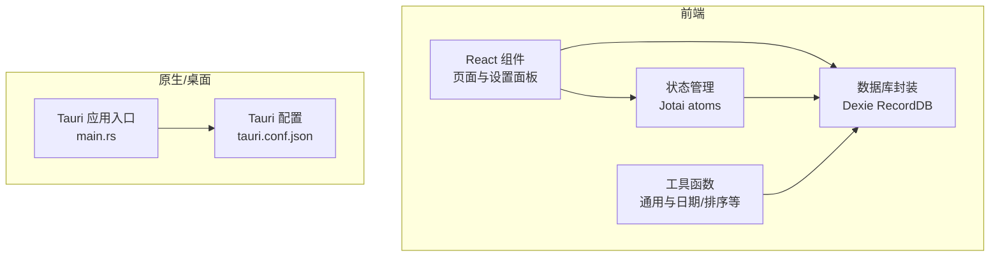
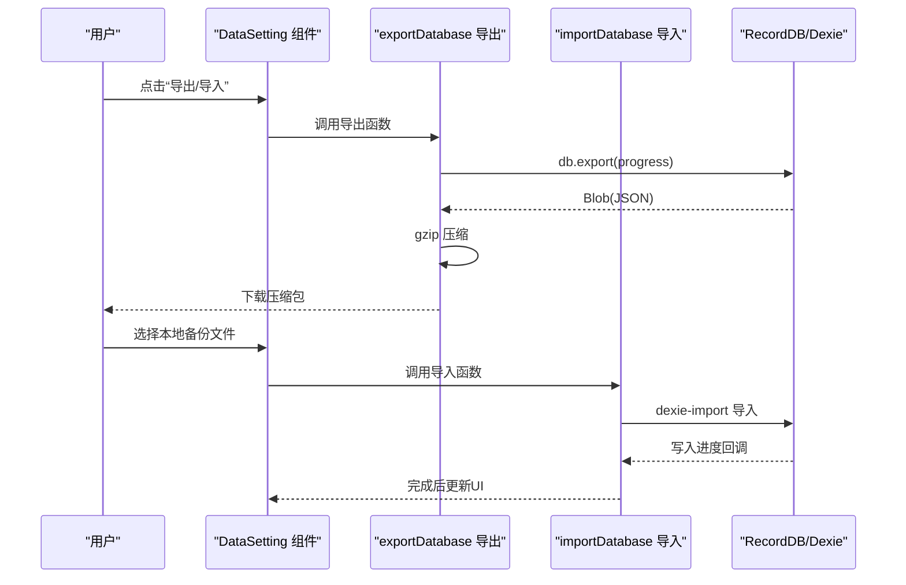
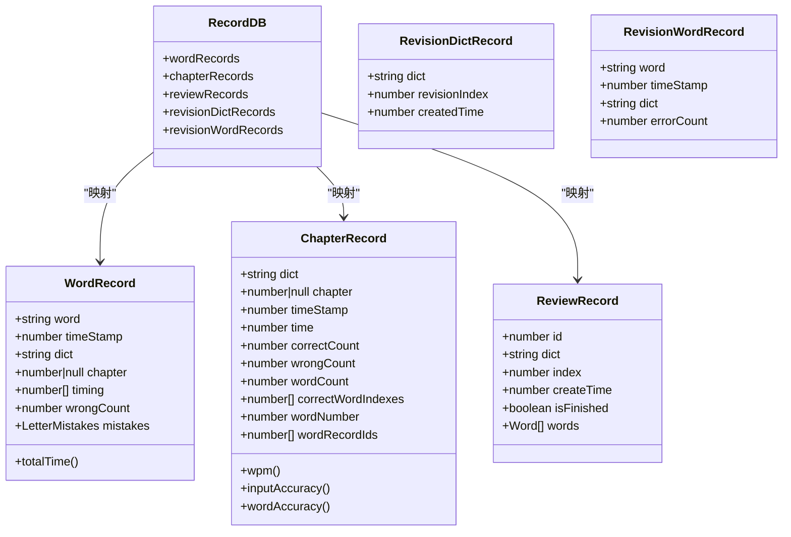
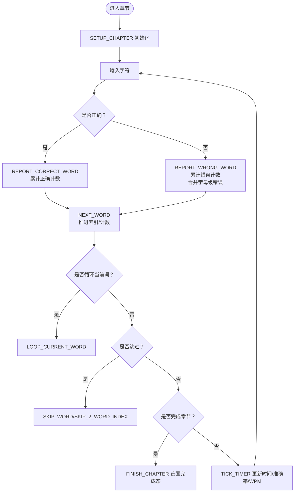
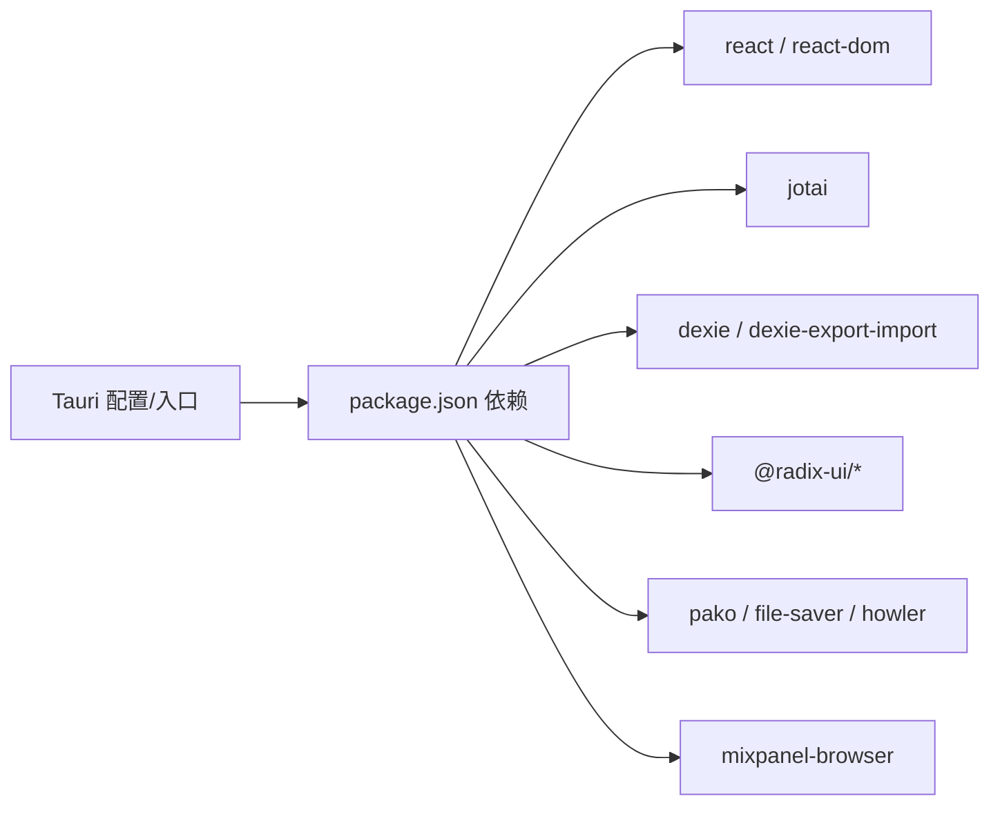

# API 参考文档

<cite>
**本文引用的文件**
- [src/utils/db/index.ts](file://src/utils/db/index.ts)
- [src/utils/db/record.ts](file://src/utils/db/record.ts)
- [src/utils/db/data-export.ts](file://src/utils/db/data-export.ts)
- [src/pages/Typing/components/Setting/DataSetting.tsx](file://src/pages/Typing/components/Setting/DataSetting.tsx)
- [src/store/index.ts](file://src/store/index.ts)
- [src/store/atomForConfig.ts](file://src/store/atomForConfig.ts)
- [src/pages/Typing/store/index.ts](file://src/pages/Typing/store/index.ts)
- [src/pages/Typing/store/type.ts](file://src/pages/Typing/store/type.ts)
- [src/utils/index.ts](file://src/utils/index.ts)
- [src/constants/index.ts](file://src/constants/index.ts)
- [src-tauri/tauri.conf.json](file://src-tauri/tauri.conf.json)
- [src-tauri/src/main.rs](file://src-tauri/src/main.rs)
- [src-tauri/Cargo.toml](file://src-tauri/Cargo.toml)
- [package.json](file://package.json)
- [public/default.conf](file://public/default.conf)
</cite>

## 目录

1. [简介](#简介)
2. [项目结构](#项目结构)
3. [核心组件](#核心组件)
4. [架构总览](#架构总览)
5. [详细组件分析](#详细组件分析)
6. [依赖关系分析](#依赖关系分析)
7. [性能考量](#性能考量)
8. [故障排查指南](#故障排查指南)
9. [结论](#结论)
10. [附录](#附录)

## 简介

本 API 参考文档面向开发者，系统梳理 Qwerty Learner 项目的公共接口与内部 API，覆盖数据持久化（IndexedDB/Dexie）、状态管理（Jotai/Redux 式 reducer）、配置接口与工具函数，并给出调用流程、错误处理、性能优化、安全与限流建议、版本兼容与迁移指引等。文档同时提供可视化图示帮助理解模块间交互。

## 项目结构

项目采用前端 React/Vite + Tauri 桌面端集成的双层架构：

- 前端层：React 组件、状态管理（Jotai）、打字练习状态机、数据库封装（Dexie）与导出导入工具。
- 后端/原生层：Tauri 应用入口与配置，负责打包、窗口与安全策略。

图表来源

- [src/pages/Typing/store/index.ts](file://src/pages/Typing/store/index.ts#L1-L227)
- [src/store/index.ts](file://src/store/index.ts#L1-L118)
- [src/utils/db/index.ts](file://src/utils/db/index.ts#L1-L136)
- [src-tauri/src/main.rs](file://src-tauri/src/main.rs#L1-L8)
- [src-tauri/tauri.conf.json](file://src-tauri/tauri.conf.json#L1-L59)

章节来源

- [src/pages/Typing/store/index.ts](file://src/pages/Typing/store/index.ts#L1-L227)
- [src/store/index.ts](file://src/store/index.ts#L1-L118)
- [src/utils/db/index.ts](file://src/utils/db/index.ts#L1-L136)
- [src-tauri/src/main.rs](file://src-tauri/src/main.rs#L1-L8)
- [src-tauri/tauri.conf.json](file://src-tauri/tauri.conf.json#L1-L59)

## 核心组件

- 数据持久化 API：基于 Dexie 的 RecordDB 类，提供章节记录、单词记录、复习记录等增删查改能力；并提供导出/导入工具。
- 状态管理 API：Jotai atoms 用于配置与全局状态；打字练习使用 Redux 式 reducer 与 context 维护练习状态。
- 配置接口：统一通过 atomForConfig 进行配置读取、默认值合并与 localStorage 持久化。
- 工具函数：日期、字符串、设备判断、类名拼接、章节计数、时间戳转换等。

章节来源

- [src/utils/db/index.ts](file://src/utils/db/index.ts#L1-L136)
- [src/utils/db/record.ts](file://src/utils/db/record.ts#L1-L186)
- [src/utils/db/data-export.ts](file://src/utils/db/data-export.ts#L1-L42)
- [src/pages/Typing/components/Setting/DataSetting.tsx](file://src/pages/Typing/components/Setting/DataSetting.tsx#L1-L54)
- [src/store/index.ts](file://src/store/index.ts#L1-L118)
- [src/store/atomForConfig.ts](file://src/store/atomForConfig.ts#L1-L44)
- [src/pages/Typing/store/index.ts](file://src/pages/Typing/store/index.ts#L1-L227)
- [src/pages/Typing/store/type.ts](file://src/pages/Typing/store/type.ts#L1-L55)
- [src/utils/index.ts](file://src/utils/index.ts#L1-L130)
- [src/constants/index.ts](file://src/constants/index.ts#L1-L19)

## 架构总览

下图展示从“设置面板”触发“数据导出/导入”，到“数据库”写入与状态更新的端到端流程。

图表来源

- [src/pages/Typing/components/Setting/DataSetting.tsx](file://src/pages/Typing/components/Setting/DataSetting.tsx#L1-L54)
- [src/utils/db/data-export.ts](file://src/utils/db/data-export.ts#L1-L42)
- [src/utils/db/index.ts](file://src/utils/db/index.ts#L1-L136)

章节来源

- [src/pages/Typing/components/Setting/DataSetting.tsx](file://src/pages/Typing/components/Setting/DataSetting.tsx#L1-L54)
- [src/utils/db/data-export.ts](file://src/utils/db/data-export.ts#L1-L42)
- [src/utils/db/index.ts](file://src/utils/db/index.ts#L1-L136)

## 详细组件分析

### 数据持久化 API

- RecordDB 类与版本迁移
  - 使用 Dexie 定义 wordRecords、chapterRecords、reviewRecords 等表结构与索引。
  - 通过多版本 stores 实现 schema 升级，确保向后兼容。
- 单词记录与章节记录
  - 提供保存单词记录与章节记录的钩子，自动填充时间戳、计算统计指标。
  - 支持按条件删除单词记录。
- 复习记录与复习字典记录
  - 提供复习记录模型与复习字典记录模型，支持复习模式下的特殊字段。
- 导出/导入工具
  - 导出：将数据库导出为 Blob，再 gzip 压缩，最后触发下载。
  - 导入：弹出文件选择器，读取.gz 文件并导入数据库，支持进度回调。

图表来源

- [src/utils/db/index.ts](file://src/utils/db/index.ts#L1-L136)
- [src/utils/db/record.ts](file://src/utils/db/record.ts#L1-L186)

章节来源

- [src/utils/db/index.ts](file://src/utils/db/index.ts#L1-L136)
- [src/utils/db/record.ts](file://src/utils/db/record.ts#L1-L186)

#### 数据导出/导入 API 规范

- 导出接口
  - 参数：回调函数(progress: ExportProgress) -> boolean
  - 返回：无（触发下载）
  - 进度对象：totalRows?, completedRows, done
  - 行为：导出 DB -> 文本 -> gzip -> 触发下载 -> 记录操作日志
- 导入接口
  - 参数：onStart() -> void, 回调函数(progress: ImportProgress) -> boolean
  - 返回：无（触发文件选择与导入）
  - 进度对象：totalRows?, completedRows, done
  - 行为：弹出文件选择器 -> 读取.gz -> dexie 导入 -> 进度回调

章节来源

- [src/utils/db/data-export.ts](file://src/utils/db/data-export.ts#L1-L42)
- [src/pages/Typing/components/Setting/DataSetting.tsx](file://src/pages/Typing/components/Setting/DataSetting.tsx#L1-L54)

#### 章节/单词记录保存 API

- 保存章节记录
  - 输入：TypingState（包含章节数据、计时数据）
  - 输出：异步写入 chapterRecords
  - 关键字段：dict、chapter、time、correctCount、wrongCount、wordCount、correctWordIndexes、wordNumber、wordRecordIds
- 保存单词记录
  - 输入：word、wrongCount、letterTimeArray、letterMistake
  - 输出：异步写入 wordRecords，返回自增 ID；更新打字状态中的 wordRecordIds
  - 时间序列：由相邻时间差计算 timing 数组
- 删除单词记录
  - 输入：word、dict
  - 输出：删除数量

章节来源

- [src/utils/db/index.ts](file://src/utils/db/index.ts#L43-L136)
- [src/utils/db/record.ts](file://src/utils/db/record.ts#L1-L186)
- [src/pages/Typing/store/index.ts](file://src/pages/Typing/store/index.ts#L1-L227)

### 状态管理 API

- Jotai 配置原子
  - atomForConfig(key, defaultValue)：带默认值校验与属性补齐，持久化到 localStorage。
  - store/index.ts 集中导出各类配置原子：字体、发音、随机、忽略大小写、音效、主题等。
- 打字练习状态机
  - TypingState：包含 chapterData、timerData、显示控制与保存状态标记。
  - TypingStateActionType 枚举：涵盖章节初始化、计时、跳过、循环、完成等动作。
  - reducer：根据 Action 更新 state，计算准确率、WPM、索引推进等。
  - TypingContext：提供 state 与 dispatch 给组件使用。

图表来源

- [src/pages/Typing/store/index.ts](file://src/pages/Typing/store/index.ts#L1-L227)
- [src/pages/Typing/store/type.ts](file://src/pages/Typing/store/type.ts#L1-L55)

章节来源

- [src/store/index.ts](file://src/store/index.ts#L1-L118)
- [src/store/atomForConfig.ts](file://src/store/atomForConfig.ts#L1-L44)
- [src/pages/Typing/store/index.ts](file://src/pages/Typing/store/index.ts#L1-L227)
- [src/pages/Typing/store/type.ts](file://src/pages/Typing/store/type.ts#L1-L55)

### 配置接口

- 统一配置工厂
  - atomForConfig：读取 localStorage，若类型不匹配或缺字段则回退默认值并写回。
- 常用配置项
  - 字体大小、发音开关与类型、音效开关与资源、随机模式、忽略大小写、显示答案悬停、文本可选中、主题、单词听写等。
- 建议
  - 新增配置时务必提供默认值，避免运行期类型不一致。
  - 配置变更应通过对应 atom 进行，保证持久化与响应式更新。

章节来源

- [src/store/atomForConfig.ts](file://src/store/atomForConfig.ts#L1-L44)
- [src/store/index.ts](file://src/store/index.ts#L1-L118)

### 工具函数

- 通用工具
  - isLegal：过滤非法按键（功能键、方向键、音量键等）
  - isChineseSymbol：中文标点检测
  - IsDesktop/IS_MAC_OS/CTRL：设备与快捷键适配
  - classNames：拼接 CSS 类名
  - getCurrentDate/getUTCUnixTimestamp/timeStamp2String：日期与时间处理
  - calcChapterCount：按固定长度计算章节数
  - findCommonValues/toFixedNumber：集合与数值处理
- 常量
  - CHAPTER_LENGTH：每章单词数
  - CONFETTI_DEFAULTS：彩带动画默认配置
  - defaultFontSizeConfig：默认字体大小

章节来源

- [src/utils/index.ts](file://src/utils/index.ts#L1-L130)
- [src/constants/index.ts](file://src/constants/index.ts#L1-L19)

## 依赖关系分析

- 前端依赖
  - React 生态、Jotai、Dexie、Radix UI、Mixpanel、Pako、FileSaver 等。
- 原生依赖
  - Tauri 1.x，提供跨平台桌面应用能力。
- 关系图

图表来源

- [package.json](file://package.json#L1-L128)
- [src-tauri/tauri.conf.json](file://src-tauri/tauri.conf.json#L1-L59)
- [src-tauri/src/main.rs](file://src-tauri/src/main.rs#L1-L8)

章节来源

- [package.json](file://package.json#L1-L128)
- [src-tauri/tauri.conf.json](file://src-tauri/tauri.conf.json#L1-L59)
- [src-tauri/src/main.rs](file://src-tauri/src/main.rs#L1-L8)

## 性能考量

- 数据库写入
  - 批量写入建议合并请求，减少事务次数；导出/导入使用进度回调降低主线程阻塞。
- 状态更新
  - reducer 中避免不必要的深拷贝；合理拆分 dispatch，减少无关渲染。
- UI 与资源
  - 音效与彩带动画仅在必要时触发；图片/音频懒加载。
- 时间计算
  - WPM 与准确率在计时 tick 中计算，避免频繁重算；必要时节流。

## 故障排查指南

- 导出/导入异常
  - 确认浏览器支持 FileSaver 与 pako；检查文件格式与大小限制；查看进度回调返回值以决定是否终止。
- 数据库写入失败
  - 捕获异常并记录错误；确认表结构与索引是否存在；版本升级后清理旧数据。
- 配置不生效
  - 检查 atomForConfig 是否正确写回 localStorage；确认默认值与实际类型一致。
- 打字状态异常
  - 核对 TypingStateActionType 分支；检查索引越界与 wordRecordIds 追加逻辑。

章节来源

- [src/utils/db/data-export.ts](file://src/utils/db/data-export.ts#L1-L42)
- [src/utils/db/index.ts](file://src/utils/db/index.ts#L80-L136)
- [src/store/atomForConfig.ts](file://src/store/atomForConfig.ts#L1-L44)
- [src/pages/Typing/store/index.ts](file://src/pages/Typing/store/index.ts#L92-L224)

## 结论

本 API 参考文档梳理了 Qwerty Learner 的数据持久化、状态管理、配置与工具函数的关键接口与使用方式。通过明确的调用流程、错误处理与性能建议，开发者可高效集成与扩展功能。建议在新增接口时遵循现有命名与数据模型风格，确保版本演进与兼容性。

## 附录

### API 清单与调用示例路径

- 数据导出
  - 接口：exportDatabase(callback)
  - 示例路径：[导出调用示例](file://src/pages/Typing/components/Setting/DataSetting.tsx#L28-L32)
- 数据导入
  - 接口：importDatabase(onStart, callback)
  - 示例路径：[导入调用示例](file://src/pages/Typing/components/Setting/DataSetting.tsx#L52-L54)
- 保存章节记录
  - 接口：useSaveChapterRecord()
  - 示例路径：[章节记录保存](file://src/utils/db/index.ts#L43-L73)
- 保存单词记录
  - 接口：useSaveWordRecord()
  - 示例路径：[单词记录保存](file://src/utils/db/index.ts#L80-L122)
- 删除单词记录
  - 接口：useDeleteWordRecord()
  - 示例路径：[删除记录](file://src/utils/db/index.ts#L124-L136)
- 配置读取/写入
  - 接口：atomForConfig(key, defaultValue)
  - 示例路径：[配置原子工厂](file://src/store/atomForConfig.ts#L1-L44)
- 打字状态机
  - 接口：TypingContext + typingReducer
  - 示例路径：[状态机实现](file://src/pages/Typing/store/index.ts#L1-L227)

### 版本兼容与迁移指南

- Dexie 版本迁移
  - 新增版本号与 stores 定义，保持向后兼容；升级后清理旧索引或字段。
- 配置兼容
  - 使用 atomForConfig 自动补齐缺失字段与类型矫正；避免直接修改 localStorage 键名。
- 前端依赖升级
  - 逐步升级 React、Jotai、Dexie 等依赖，关注破坏性变更；先在开发环境验证。

章节来源

- [src/utils/db/index.ts](file://src/utils/db/index.ts#L19-L34)
- [src/store/atomForConfig.ts](file://src/store/atomForConfig.ts#L1-L44)
- [package.json](file://package.json#L1-L128)

### 安全考虑、限流与使用限制

- 安全
  - Tauri 配置中禁用全局 allowlist，按需开放权限；避免暴露敏感 API。
  - 导入文件需校验格式与来源，防止恶意数据注入。
- 限流
  - 导入/导出进度回调返回布尔值以允许取消；UI 层应提供取消按钮。
- 使用限制
  - 浏览器兼容性：确保 FileSaver、pako、Dexie 在目标浏览器可用。
  - 文件大小：大体积备份建议分批处理或提示用户。

章节来源

- [src-tauri/tauri.conf.json](file://src-tauri/tauri.conf.json#L1-L59)
- [src/utils/db/data-export.ts](file://src/utils/db/data-export.ts#L1-L42)

### 最佳实践

- 将配置与状态分离，配置走 Jotai，业务状态走 typingReducer。
- 导出/导入流程中始终提供进度反馈与错误日志。
- 对外暴露稳定 API，内部实现细节通过工具函数封装。
- 严格遵守数据模型字段命名与类型，避免运行期类型错误。
