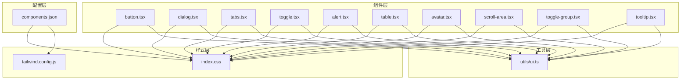
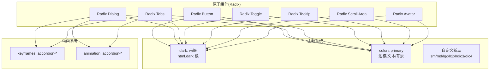
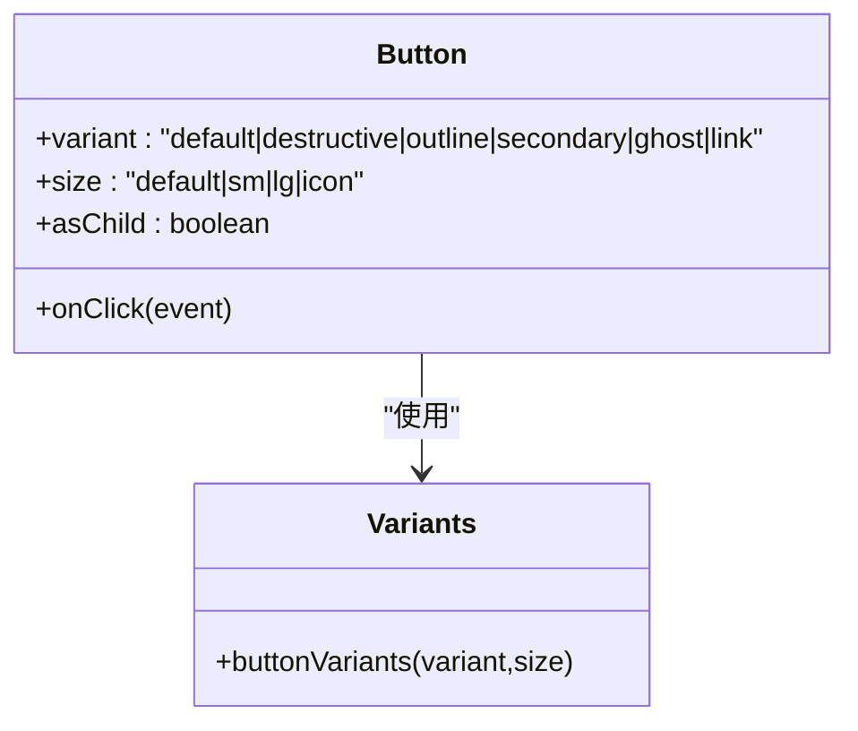
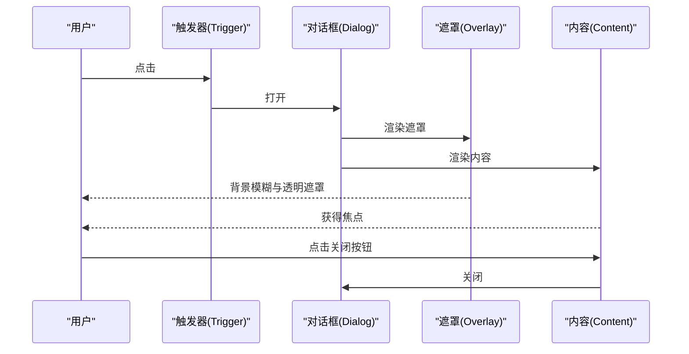
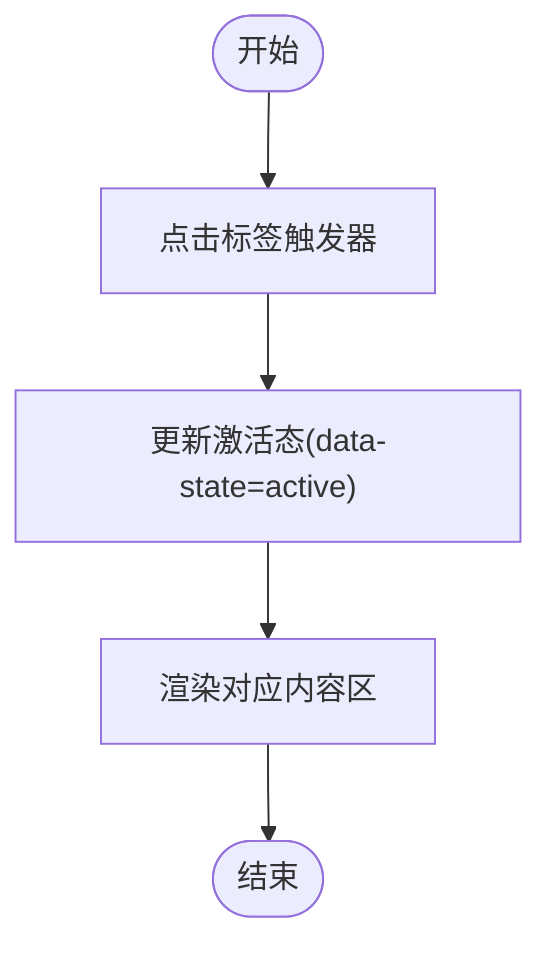
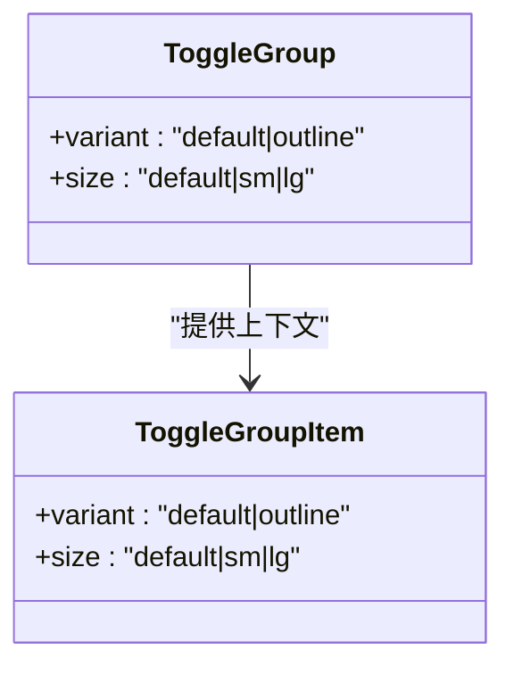
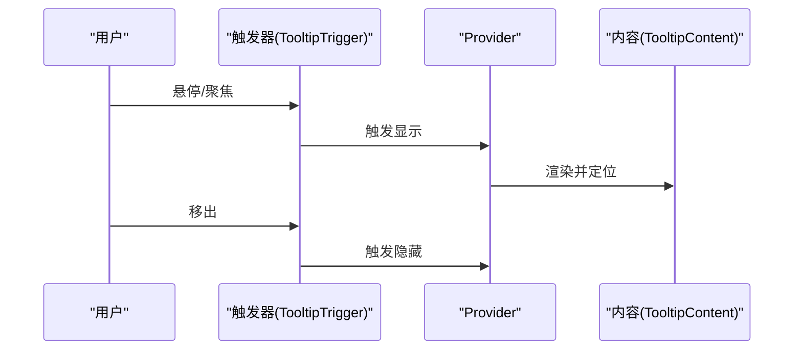
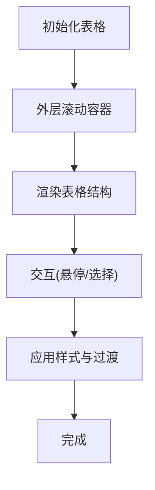
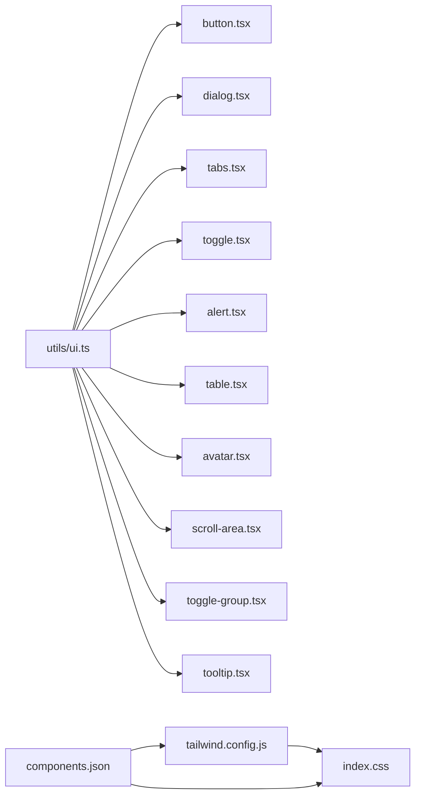

# UI 组件库

<cite>
**本文引用的文件**
- [README.md](file://README.md)
- [components.json](file://components.json)
- [tailwind.config.js](file://tailwind.config.js)
- [src/index.css](file://src/index.css)
- [src/utils/ui.ts](file://src/utils/ui.ts)
- [src/components/ui/button.tsx](file://src/components/ui/button.tsx)
- [src/components/ui/dialog.tsx](file://src/components/ui/dialog.tsx)
- [src/components/ui/tabs.tsx](file://src/components/ui/tabs.tsx)
- [src/components/ui/toggle.tsx](file://src/components/ui/toggle.tsx)
- [src/components/ui/alert.tsx](file://src/components/ui/alert.tsx)
- [src/components/ui/table.tsx](file://src/components/ui/table.tsx)
- [src/components/ui/avatar.tsx](file://src/components/ui/avatar.tsx)
- [src/components/ui/scroll-area.tsx](file://src/components/ui/scroll-area.tsx)
- [src/components/ui/toggle-group.tsx](file://src/components/ui/toggle-group.tsx)
- [src/components/ui/tooltip.tsx](file://src/components/ui/tooltip.tsx)
</cite>

## 目录

1. [引言](#引言)
2. [项目结构](#项目结构)
3. [核心组件](#核心组件)
4. [架构总览](#架构总览)
5. [组件详解](#组件详解)
6. [依赖关系分析](#依赖关系分析)
7. [性能考量](#性能考量)
8. [故障排查指南](#故障排查指南)
9. [结论](#结论)
10. [附录](#附录)

## 引言

本设计文档面向开发者与设计人员，系统化阐述本 UI 组件库的整体理念、设计规范与使用指南。组件库以实用、可访问、可定制为核心目标，结合 TailwindCSS 与 Radix UI 原子能力，提供一致的视觉语言与交互体验。文档覆盖各组件的功能特性、属性配置、事件处理、可访问性、响应式布局、主题定制、视觉样式、交互状态与动画效果，并给出使用示例、最佳实践与性能优化建议，以及组件间组合与扩展方法。

## 项目结构

组件库采用“按功能域分层 + 原子化设计”的组织方式：

- 组件层：位于 src/components/ui，包含按钮、对话框、标签页、切换器、表格、头像、滚动区域、切换组、提示等基础 UI 组件。
- 工具层：位于 src/utils，提供类名合并工具 cn，统一组件 className 策略。
- 样式层：位于 src/index.css 与 tailwind.config.js，定义全局样式、暗色模式、关键动画与断点。
- 配置层：components.json 用于对接 shadcn/ui 生态，统一别名与 Tailwind 配置。

图表来源

- [src/components/ui/button.tsx](file://src/components/ui/button.tsx#L1-L44)
- [src/components/ui/dialog.tsx](file://src/components/ui/dialog.tsx#L1-L92)
- [src/components/ui/tabs.tsx](file://src/components/ui/tabs.tsx#L1-L44)
- [src/components/ui/toggle.tsx](file://src/components/ui/toggle.tsx#L1-L38)
- [src/components/ui/alert.tsx](file://src/components/ui/alert.tsx#L1-L40)
- [src/components/ui/table.tsx](file://src/components/ui/table.tsx#L1-L70)
- [src/components/ui/avatar.tsx](file://src/components/ui/avatar.tsx#L1-L32)
- [src/components/ui/scroll-area.tsx](file://src/components/ui/scroll-area.tsx#L1-L39)
- [src/components/ui/toggle-group.tsx](file://src/components/ui/toggle-group.tsx#L1-L50)
- [src/components/ui/tooltip.tsx](file://src/components/ui/tooltip.tsx#L1-L29)
- [src/utils/ui.ts](file://src/utils/ui.ts#L1-L7)
- [src/index.css](file://src/index.css#L1-L208)
- [tailwind.config.js](file://tailwind.config.js#L1-L78)
- [components.json](file://components.json#L1-L17)

章节来源

- [README.md](file://README.md#L63-L120)
- [components.json](file://components.json#L1-L17)
- [tailwind.config.js](file://tailwind.config.js#L1-L78)
- [src/index.css](file://src/index.css#L1-L208)

## 核心组件

本节概述所有 UI 组件的能力边界与通用约定：

- 统一的变体与尺寸系统：通过 class-variance-authority 定义 variant/size，保证风格一致性与可扩展性。
- 类名合并策略：使用 twMerge + clsx 合并冲突类，避免 Tailwind 覆盖顺序问题。
- 暗色模式支持：通过 dark: 前缀与 html.dark 根元素适配深色主题。
- 动画与过渡：基于 Tailwind keyframes 与 animation，提供平滑的展开/收起、淡入淡出、缩放与滑入滑出等动效。
- 响应式断点：自定义断点如 dic3、dic4，配合 md、lg 等标准断点，覆盖桌面端与大屏场景。
- 可访问性：组件均遵循 ARIA 角色与键盘可达性，提供焦点管理与屏幕阅读器友好语义。

章节来源

- [src/utils/ui.ts](file://src/utils/ui.ts#L1-L7)
- [tailwind.config.js](file://tailwind.config.js#L1-L78)
- [src/index.css](file://src/index.css#L1-L208)

## 架构总览

组件库采用“原子化组件 + 主题系统 + 动画系统”的三层架构：

- 原子化组件：以 Radix UI 为底层，提供语义化、可组合的基础控件。
- 主题系统：Tailwind dark: 与全局背景色、边框色、文本色联动，形成明暗两套视觉体系。
- 动画系统：通过 keyframes 与 animation 定义统一的过渡动效，贯穿所有容器与浮层组件。

图表来源

- [tailwind.config.js](file://tailwind.config.js#L1-L78)
- [src/index.css](file://src/index.css#L1-L208)
- [src/components/ui/dialog.tsx](file://src/components/ui/dialog.tsx#L1-L92)
- [src/components/ui/tabs.tsx](file://src/components/ui/tabs.tsx#L1-L44)

## 组件详解

### 按钮 Button

- 功能特性
  - 支持多种变体：默认、破坏性、描边、次级、幽灵、链接。
  - 支持多种尺寸：默认、小号、大号、图标。
  - 支持 asChild 渲染为任意元素，保持原生语义与可访问性。
  - 禁用态与焦点态具备明确视觉反馈。
- 属性配置
  - HTMLButtonElement 原生属性透传。
  - variant/size/asChild 由变体系统控制。
- 事件处理
  - onClick 等原生事件透传至底层元素。
- 视觉样式与交互状态
  - 默认变体使用主色调背景与悬停透明度变化。
  - 焦点态提供可见轮廓，暗色模式下文字透明度调整。
- 动画与过渡
  - 通过过渡类实现平滑的悬停与禁用态变化。
- 可访问性
  - 保持原生按钮语义；禁用态阻止交互事件。
- 使用示例与最佳实践
  - 优先使用默认变体表达主操作；破坏性仅用于危险操作。
  - 图标按钮需提供替代文本或明确的视觉提示。
- 性能优化
  - 避免在渲染路径中频繁创建新对象作为 props；复用变体配置。

图表来源

- [src/components/ui/button.tsx](file://src/components/ui/button.tsx#L1-L44)

章节来源

- [src/components/ui/button.tsx](file://src/components/ui/button.tsx#L1-L44)
- [src/index.css](file://src/index.css#L1-L208)

### 对话框 Dialog

- 功能特性
  - 提供 Root/Trigger/Portal/Overlay/Content/Close/Header/Footer/Title/Description 等子组件，支持模态遮罩、居中内容区、关闭按钮与标题描述。
  - 内置入场/出场动画：淡入淡出、缩放、滑入滑出。
- 属性配置
  - Overlay/Content/Title/Description 等均透传原生属性。
  - Close 按钮包含不可见的“关闭”文本，提升可访问性。
- 事件处理
  - 支持打开/关闭状态变更回调；点击遮罩或按下 Esc 可关闭。
- 视觉样式与交互状态
  - 明/暗主题下边框、背景与文字颜色自动切换。
  - 关闭按钮悬停时透明度变化。
- 动画与过渡
  - 使用 keyframes 与 animation 定义统一的进入/退出动效。
- 可访问性
  - 自动聚焦到内容区；支持键盘导航与 Esc 关闭。
- 使用示例与最佳实践
  - 内容区不宜过宽，建议限制最大宽度；必要时配合 ScrollArea。
  - 标题与描述需清晰传达目的与操作后果。
- 性能优化
  - Portal 渲染减少 DOM 层级；避免在打开时进行重型计算。

图表来源

- [src/components/ui/dialog.tsx](file://src/components/ui/dialog.tsx#L1-L92)
- [src/index.css](file://src/index.css#L1-L208)

章节来源

- [src/components/ui/dialog.tsx](file://src/components/ui/dialog.tsx#L1-L92)
- [tailwind.config.js](file://tailwind.config.js#L1-L78)

### 标签页 Tabs

- 功能特性
  - 提供 Tabs/TabsList/TabsTrigger/TabsContent 四个子组件，支持多面板切换。
  - 触发器激活态具备高亮与阴影反馈。
- 属性配置
  - 列表与触发器支持样式透传；内容区聚焦管理良好。
- 事件处理
  - 切换时自动更新激活态；支持键盘左右键导航。
- 视觉样式与交互状态
  - 明/暗主题下激活态颜色与边框对比度一致。
- 动画与过渡
  - 使用统一的 keyframes 与 animation 控制展开/收起。
- 可访问性
  - 使用 aria-controls 与 aria-selected；Tab/Shift+Tab 导航。
- 使用示例与最佳实践
  - 标题简洁明确；内容区避免过长导致滚动困难。
- 性能优化
  - 非激活面板延迟渲染或懒加载，减少初始负载。

图表来源

- [src/components/ui/tabs.tsx](file://src/components/ui/tabs.tsx#L1-L44)
- [tailwind.config.js](file://tailwind.config.js#L1-L78)

章节来源

- [src/components/ui/tabs.tsx](file://src/components/ui/tabs.tsx#L1-L44)

### 切换 Toggle 与切换组 ToggleGroup

- 功能特性
  - Toggle 提供单选开关语义，支持激活态样式。
  - ToggleGroup 将多个 Toggle 组合，共享变体与尺寸上下文。
- 属性配置
  - 支持 variant/size，支持 asChild 渲染。
  - ToggleGroupItem 可从上下文继承变体/尺寸。
- 事件处理
  - onChange/onCheckedChange 事件透传 Radix 事件。
- 视觉样式与交互状态
  - 激活态与悬停态具备对比度良好的颜色与边框。
- 动画与过渡
  - 使用过渡类实现平滑状态切换。
- 可访问性
  - 使用 aria-pressed 表达开关状态；键盘切换。
- 使用示例与最佳实践
  - 切换组适合互斥选项；非互斥场景使用多个独立 Toggle。
- 性能优化
  - 避免在组内大量重复渲染；合理拆分上下文。

图表来源

- [src/components/ui/toggle.tsx](file://src/components/ui/toggle.tsx#L1-L38)
- [src/components/ui/toggle-group.tsx](file://src/components/ui/toggle-group.tsx#L1-L50)

章节来源

- [src/components/ui/toggle.tsx](file://src/components/ui/toggle.tsx#L1-L38)
- [src/components/ui/toggle-group.tsx](file://src/components/ui/toggle-group.tsx#L1-L50)

### 提示 Tooltip

- 功能特性
  - 提供 Provider/Root/Trigger/Content 四个子组件，支持多方位偏移与入场/出场动画。
- 属性配置
  - Content 支持 sideOffset 与方向控制。
- 事件处理
  - 悬停/聚焦触发显示；失焦隐藏。
- 视觉样式与交互状态
  - 明/暗主题下背景与文字颜色对比度一致。
- 动画与过渡
  - 使用 fadeIn/zoomIn 与 slide-in-from-\* 系列动画。
- 可访问性
  - 保持原生触发器语义；内容区提供简短说明。
- 使用示例与最佳实践
  - 文案简洁；避免遮挡主要内容。
- 性能优化
  - 合理设置延迟与禁用动画以降低重绘。

图表来源

- [src/components/ui/tooltip.tsx](file://src/components/ui/tooltip.tsx#L1-L29)

章节来源

- [src/components/ui/tooltip.tsx](file://src/components/ui/tooltip.tsx#L1-L29)

### 表格 Table

- 功能特性
  - 提供 Table/TableHeader/TableBody/TableFooter/TableRow/TableCell/TableCaption 全套表格子组件。
  - 内容区自动包裹滚动容器，避免溢出。
- 属性配置
  - 行/单元格支持选择态与 hover 态样式。
- 事件处理
  - 行级点击/悬停事件透传。
- 视觉样式与交互状态
  - 边框、背景与文本颜色在明/暗主题下保持对比度。
- 动画与过渡
  - hover 与选择态使用过渡类实现平滑变化。
- 可访问性
  - 语义化表格结构；支持键盘导航。
- 使用示例与最佳实践
  - 长表格使用 ScrollArea 包裹；避免过宽列。
- 性能优化
  - 大表格建议虚拟化或分页。

图表来源

- [src/components/ui/table.tsx](file://src/components/ui/table.tsx#L1-L70)

章节来源

- [src/components/ui/table.tsx](file://src/components/ui/table.tsx#L1-L70)

### 头像 Avatar

- 功能特性
  - 提供根容器、图片与占位符三部分，支持懒加载与降级显示。
- 属性配置
  - 支持图片与占位符样式透传。
- 事件处理
  - 图片加载失败回退至占位符。
- 视觉样式与交互状态
  - 圆形裁剪与背景色在明/暗主题下一致。
- 动画与过渡
  - 无复杂动画，注重稳定性。
- 可访问性
  - 图片需提供替代文本；占位符提供可辨识的背景。
- 使用示例与最佳实践
  - 头像尺寸与布局需与上下文一致；避免过大头像影响信息密度。
- 性能优化
  - 图片懒加载与尺寸控制；避免阻塞主线程。

章节来源

- [src/components/ui/avatar.tsx](file://src/components/ui/avatar.tsx#L1-L32)

### 滚动区域 ScrollArea

- 功能特性
  - 提供根容器与滚动条，支持水平/垂直滚动与角落装饰。
- 属性配置
  - 支持方向与滚动条样式透传。
- 事件处理
  - 滚动事件透传；滚动条随内容变化自适应。
- 视觉样式与交互状态
  - 滚 scrollbar 在明/暗主题下具备合适对比度。
- 动画与过渡
  - 滚动条透明度与尺寸过渡自然。
- 可访问性
  - 保持原生滚动语义；键盘可操作。
- 使用示例与最佳实践
  - 内容区使用固定高度；避免嵌套过多滚动容器。
- 性能优化
  - 避免在滚动时进行昂贵计算；使用防抖。

章节来源

- [src/components/ui/scroll-area.tsx](file://src/components/ui/scroll-area.tsx#L1-L39)

### 警告 Alert

- 功能特性
  - 提供 Alert/AlertTitle/AlertDescription 三部分，支持默认与破坏性两种变体。
- 属性配置
  - 变体由变体系统控制；支持样式透传。
- 事件处理
  - 无交互事件，仅承载信息。
- 视觉样式与交互状态
  - 破坏性变体强调警示与错误状态。
- 动画与过渡
  - 无复杂动画，保持稳定。
- 可访问性
  - 使用 role="alert" 提升可访问性。
- 使用示例与最佳实践
  - 警告文案简洁明确；避免过度使用破坏性。
- 性能优化
  - 无性能负担。

章节来源

- [src/components/ui/alert.tsx](file://src/components/ui/alert.tsx#L1-L40)

## 依赖关系分析

- 组件依赖
  - 所有组件依赖 utils/ui 的 cn 合并类名，确保样式一致性。
  - 大多数组件依赖 Radix UI 原子组件，保证可访问性与可组合性。
- 样式依赖
  - tailwind.config.js 定义颜色、keyframes、animation、screens 与插件。
  - src/index.css 定义全局样式、暗色模式根元素、自定义组件样式与动画。
- 配置依赖
  - components.json 指定 shadcn 风格、Tailwind 配置与别名，便于生态集成。

图表来源

- [src/utils/ui.ts](file://src/utils/ui.ts#L1-L7)
- [tailwind.config.js](file://tailwind.config.js#L1-L78)
- [src/index.css](file://src/index.css#L1-L208)
- [components.json](file://components.json#L1-L17)

章节来源

- [src/utils/ui.ts](file://src/utils/ui.ts#L1-L7)
- [tailwind.config.js](file://tailwind.config.js#L1-L78)
- [src/index.css](file://src/index.css#L1-L208)
- [components.json](file://components.json#L1-L17)

## 性能考量

- 样式合并
  - 使用 twMerge + clsx 合并类名，避免重复与冲突，减少样式层叠复杂度。
- 动画与过渡
  - 使用 transform/opacity 等可合成属性，避免触发布局与绘制。
- 渲染优化
  - 将重型逻辑移出渲染函数；对高频组件使用 memo 化。
- 懒加载与虚拟化
  - 大表格与长列表使用虚拟滚动或分页，降低首屏渲染压力。
- 可访问性与性能
  - 保持键盘可达与焦点管理，避免不必要的重排与重绘。

## 故障排查指南

- 样式冲突
  - 症状：组件样式异常或被覆盖。
  - 排查：检查 cn 合并顺序与 Tailwind 配置；确认未手动覆盖关键类。
- 暗色模式不生效
  - 症状：夜间模式下颜色未切换。
  - 排查：确认 html 根元素存在 dark 类；检查 dark: 前缀使用是否正确。
- 动画卡顿
  - 症状：进入/退出动画不流畅。
  - 排查：避免在动画期间进行昂贵计算；减少重绘属性使用。
- 可访问性问题
  - 症状：屏幕阅读器无法读取内容或键盘无法导航。
  - 排查：确保使用正确的 ARIA 属性与语义标签；提供替代文本与可见焦点。

章节来源

- [src/utils/ui.ts](file://src/utils/ui.ts#L1-L7)
- [tailwind.config.js](file://tailwind.config.js#L1-L78)
- [src/index.css](file://src/index.css#L1-L208)

## 结论

本 UI 组件库以“可组合、可访问、可定制”为目标，通过原子化组件与主题系统实现一致的视觉与交互体验。组件覆盖常用业务场景，提供完善的变体与尺寸体系、暗色模式支持与统一动画风格。建议在实际项目中遵循本文档的最佳实践，结合业务需求进行扩展与定制，持续提升可用性与性能。

## 附录

- 设计理念与规范
  - 以键盘工作者为主要用户群体，强调输入效率与肌肉记忆训练，组件设计需兼顾信息密度与操作便捷性。
  - 采用明/暗双主题，确保在不同光照环境下均有良好可读性。
- 主题定制
  - 通过 Tailwind colors 与 dark: 前缀快速切换主题；可在 tailwind.config.js 中扩展主色与辅助色。
- 响应式布局
  - 使用标准断点与自定义断点适配桌面与大屏；组件尺寸与间距在 md/lg 等断点下自动调整。
- 动画与交互
  - 统一使用 keyframes 与 animation，确保动效风格一致；避免过度动画影响性能。
- 组件扩展
  - 新增组件建议遵循现有变体/尺寸体系与命名规范；优先使用 Radix UI 原子组件以保障可访问性。

章节来源

- [README.md](file://README.md#L63-L120)
- [tailwind.config.js](file://tailwind.config.js#L1-L78)
- [src/index.css](file://src/index.css#L1-L208)
