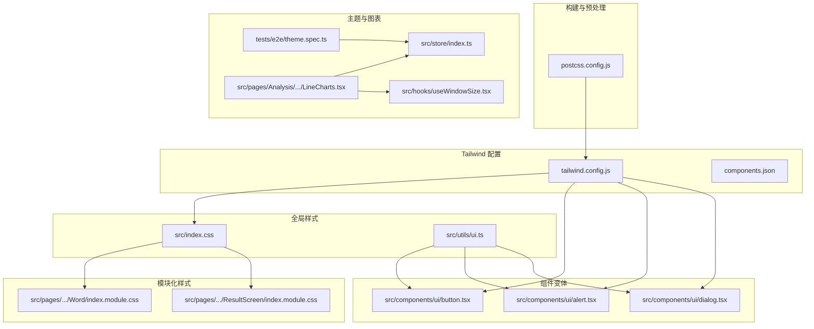
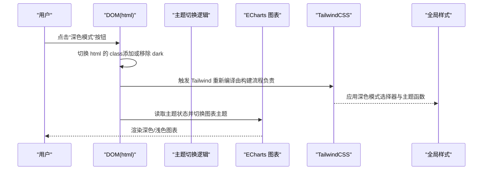
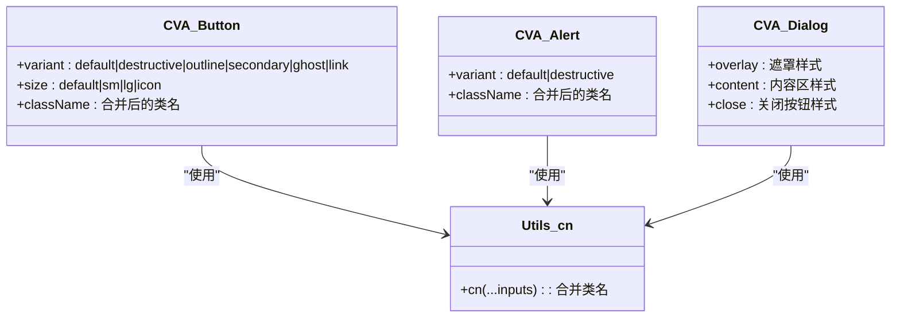
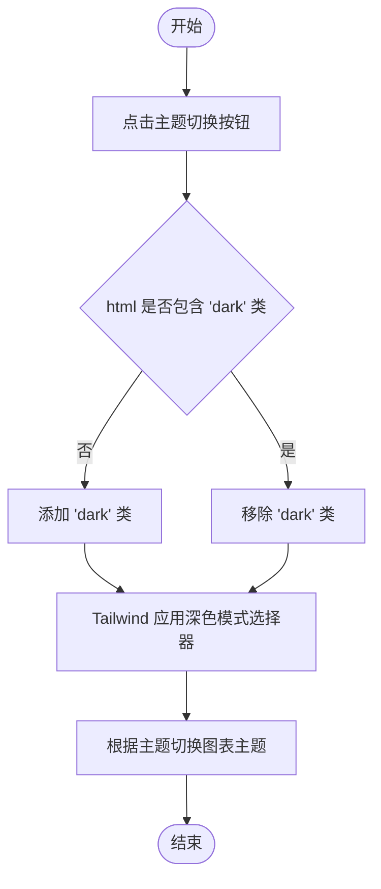
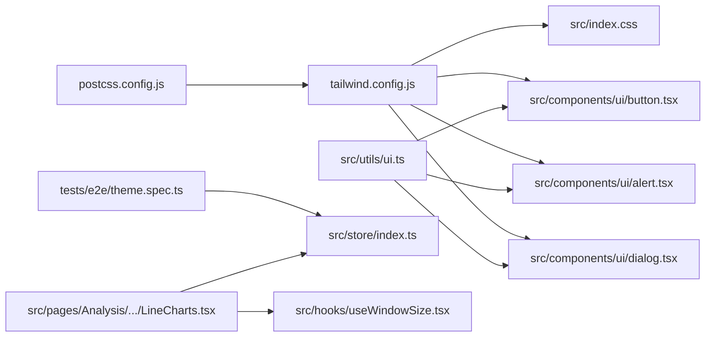

# 主题与样式系统

<cite>
**本文引用的文件**
- [tailwind.config.js](file://tailwind.config.js)
- [postcss.config.js](file://postcss.config.js)
- [src/index.css](file://src/index.css)
- [components.json](file://components.json)
- [src/utils/ui.ts](file://src/utils/ui.ts)
- [src/components/ui/button.tsx](file://src/components/ui/button.tsx)
- [src/components/ui/alert.tsx](file://src/components/ui/alert.tsx)
- [src/components/ui/dialog.tsx](file://src/components/ui/dialog.tsx)
- [src/pages/Typing/components/WordPanel/components/Word/index.module.css](file://src/pages/Typing/components/WordPanel/components/Word/index.module.css)
- [src/pages/Typing/components/ResultScreen/index.module.css](file://src/pages/Typing/components/ResultScreen/index.module.css)
- [tests/e2e/theme.spec.ts](file://tests/e2e/theme.spec.ts)
- [src/store/index.ts](file://src/store/index.ts)
- [src/hooks/useWindowSize.tsx](file://src/hooks/useWindowSize.tsx)
- [src/pages/Analysis/components/LineCharts.tsx](file://src/pages/Analysis/components/LineCharts.tsx)
</cite>

## 目录

1. [引言](#引言)
2. [项目结构](#项目结构)
3. [核心组件](#核心组件)
4. [架构总览](#架构总览)
5. [详细组件分析](#详细组件分析)
6. [依赖分析](#依赖分析)
7. [性能考虑](#性能考虑)
8. [故障排查指南](#故障排查指南)
9. [结论](#结论)
10. [附录](#附录)

## 引言

本文件系统性梳理项目的主题与样式体系，涵盖颜色体系、字体规范、间距标准、TailwindCSS 定制、组件变体系统（class-variance-authority）、动态样式生成、深色/浅色模式切换、响应式断点、移动端适配、跨设备兼容、样式扩展与品牌化定制，以及 CSS-in-JS 的使用模式与性能优化策略。目标是帮助开发者在不直接阅读源码的情况下，也能快速理解并高效维护与扩展主题系统。

## 项目结构

样式相关的核心文件分布如下：

- 构建与预处理：PostCSS 配置用于加载 TailwindCSS 与 Autoprefixer。
- TailwindCSS 配置：定义深色模式策略、内容扫描路径、主题扩展（颜色、动画、尺寸、断点等）与插件。
- 全局样式：基础排版、滚动条、通用组件样式层（@layer components）与动画。
- 组件样式：通过 class-variance-authority（CVA）统一管理按钮、警示框、对话框等 UI 组件的变体与尺寸。
- 模块化样式：按功能页面拆分的局部样式文件，支持主题函数与深色模式适配。
- 测试用例：端到端测试验证主题切换行为。
- 图表主题：基于 ECharts 的主题注册与切换逻辑。

图示来源

- [postcss.config.js](file://postcss.config.js#L1-L7)
- [tailwind.config.js](file://tailwind.config.js#L1-L78)
- [components.json](file://components.json#L1-L17)
- [src/index.css](file://src/index.css#L1-L208)
- [src/utils/ui.ts](file://src/utils/ui.ts#L1-L7)
- [src/components/ui/button.tsx](file://src/components/ui/button.tsx#L1-L44)
- [src/components/ui/alert.tsx](file://src/components/ui/alert.tsx#L1-L40)
- [src/components/ui/dialog.tsx](file://src/components/ui/dialog.tsx#L1-L92)
- [src/pages/Typing/components/WordPanel/components/Word/index.module.css](file://src/pages/Typing/components/WordPanel/components/Word/index.module.css#L1-L45)
- [src/pages/Typing/components/ResultScreen/index.module.css](file://src/pages/Typing/components/ResultScreen/index.module.css#L1-L40)
- [tests/e2e/theme.spec.ts](file://tests/e2e/theme.spec.ts#L1-L24)
- [src/store/index.ts](file://src/store/index.ts#L1-L200)
- [src/hooks/useWindowSize.tsx](file://src/hooks/useWindowSize.tsx#L1-L29)
- [src/pages/Analysis/components/LineCharts.tsx](file://src/pages/Analysis/components/LineCharts.tsx#L1-L35)

章节来源

- [postcss.config.js](file://postcss.config.js#L1-L7)
- [tailwind.config.js](file://tailwind.config.js#L1-L78)
- [components.json](file://components.json#L1-L17)
- [src/index.css](file://src/index.css#L1-L208)

## 核心组件

- TailwindCSS 主题与变体系统
  - 深色模式采用类名驱动（class），通过 html 上的类名控制暗色主题。
  - 主题扩展包括颜色、关键帧动画、过渡时长、内边距/外边距、宽高、边框宽度与自定义断点。
  - 变体系统通过 class-variance-authority（CVA）在组件中集中定义默认/可选状态与尺寸，结合工具函数合并类名，确保一致性和可维护性。
- 全局样式与通用组件层
  - 在全局 CSS 中定义基础排版、滚动条样式、通用组件样式层（@layer components），并在其中使用深色模式选择器与主题函数进行适配。
- 模块化样式与主题函数
  - 页面级样式文件使用主题函数读取当前主题下的颜色值，保证在不同主题下保持视觉一致性。
- 端到端测试与主题切换
  - 使用 Playwright 测试验证主题切换按钮存在且能在浅色与深色之间正确切换。

章节来源

- [tailwind.config.js](file://tailwind.config.js#L1-L78)
- [src/index.css](file://src/index.css#L1-L208)
- [src/utils/ui.ts](file://src/utils/ui.ts#L1-L7)
- [src/components/ui/button.tsx](file://src/components/ui/button.tsx#L1-L44)
- [src/components/ui/alert.tsx](file://src/components/ui/alert.tsx#L1-L40)
- [src/components/ui/dialog.tsx](file://src/components/ui/dialog.tsx#L1-L92)
- [tests/e2e/theme.spec.ts](file://tests/e2e/theme.spec.ts#L1-L24)

## 架构总览

主题与样式系统的运行链路如下：

- PostCSS 加载 TailwindCSS 与 Autoprefixer，扫描内容目录生成所需 CSS。
- Tailwind 配置定义深色模式策略、主题扩展与插件，全局样式与组件样式通过 Tailwind 类与主题函数生效。
- 组件通过 CVA 定义变体与尺寸，使用工具函数合并类名，避免重复与冲突。
- 模块化样式文件在局部范围内使用主题函数与深色模式选择器，确保组件在不同上下文中的一致表现。
- 端到端测试验证主题切换行为，应用层通过状态管理与图表库主题注册实现主题联动。

图示来源

- [tests/e2e/theme.spec.ts](file://tests/e2e/theme.spec.ts#L1-L24)
- [src/pages/Analysis/components/LineCharts.tsx](file://src/pages/Analysis/components/LineCharts.tsx#L1-L35)
- [tailwind.config.js](file://tailwind.config.js#L1-L78)
- [src/index.css](file://src/index.css#L1-L208)

## 详细组件分析

### TailwindCSS 配置与主题扩展

- 深色模式策略：采用类名驱动，通过 html 上的类名控制暗色主题。
- 内容扫描：扫描 src 目录与根 HTML 文件，确保按需生成样式。
- 主题扩展：
  - 颜色：定义主色与常用颜色别名，便于组件复用。
  - 动画：定义手风琴展开/收起的关键帧与时长。
  - 过渡：自定义过渡时长以满足交互体验。
  - 尺寸：扩展常用内边距、外边距、宽高与边框宽度，满足组件布局需求。
  - 断点：标准断点与自定义字典页断点，兼顾桌面与移动端。
- 变体扩展：为可见性、文本/背景透明度等属性启用深色模式变体。
- 插件：集成 Headless UI、Forms 与 TailwindCSS Animate，增强组件生态与动效能力。

章节来源

- [tailwind.config.js](file://tailwind.config.js#L1-L78)

### 全局样式与通用组件层

- 基础排版与过渡：设置字体族、抗锯齿、背景色过渡，并在深色模式下切换背景色。
- 自定义滚动条：通过伪元素定义滚动条宽度、滑块与轨道颜色。
- 通用组件样式层：在 @layer components 中定义图标、词片、按钮、提示框、开关、列表框与滑块等通用样式，使用深色模式选择器与主题函数保证一致性。
- 动画：定义渐变文字、打字机、闪烁光标等动画，提升交互体验。

章节来源

- [src/index.css](file://src/index.css#L1-L208)

### 组件变体系统（class-variance-authority）

- 统一入口：通过工具函数合并类名，避免重复与冲突。
- 按钮变体：定义默认、破坏性、描边、次级、幽灵、链接等变体，以及默认、小号、大号、图标等尺寸，结合深色模式选择器实现夜间适配。
- 警示框变体：定义默认与破坏性两种变体，分别在浅色与深色模式下设置背景、边框与文本颜色。
- 对话框：使用 Radix UI 的对话框原语，结合 Tailwind 类与深色模式选择器实现遮罩、内容区与关闭按钮的样式与动效。

图示来源

- [src/components/ui/button.tsx](file://src/components/ui/button.tsx#L1-L44)
- [src/components/ui/alert.tsx](file://src/components/ui/alert.tsx#L1-L40)
- [src/components/ui/dialog.tsx](file://src/components/ui/dialog.tsx#L1-L92)
- [src/utils/ui.ts](file://src/utils/ui.ts#L1-L7)

章节来源

- [src/components/ui/button.tsx](file://src/components/ui/button.tsx#L1-L44)
- [src/components/ui/alert.tsx](file://src/components/ui/alert.tsx#L1-L40)
- [src/components/ui/dialog.tsx](file://src/components/ui/dialog.tsx#L1-L92)
- [src/utils/ui.ts](file://src/utils/ui.ts#L1-L7)

### 模块化样式与主题函数

- 页面级样式：在模块化 CSS 中使用主题函数读取当前主题的颜色值，保证在不同主题下保持视觉一致性。
- 动画与交互：在模块化样式中定义局部动画，如错误时的抖动动画与结果页的图片抖动动画，提升反馈感。

章节来源

- [src/pages/Typing/components/WordPanel/components/Word/index.module.css](file://src/pages/Typing/components/WordPanel/components/Word/index.module.css#L1-L45)
- [src/pages/Typing/components/ResultScreen/index.module.css](file://src/pages/Typing/components/ResultScreen/index.module.css#L1-L40)

### 深色/浅色模式切换与一致性保证

- 切换机制：通过端到端测试验证点击按钮后 html 的 class 在空字符串与 “dark” 之间切换，从而驱动 Tailwind 的深色模式选择器生效。
- 一致性保证：全局样式与组件样式均使用深色模式选择器与主题函数，确保在任何上下文中主题一致。
- 图表联动：图表初始化时根据主题状态选择浅色或自定义深色主题，保证整体风格统一。

图示来源

- [tests/e2e/theme.spec.ts](file://tests/e2e/theme.spec.ts#L1-L24)
- [src/pages/Analysis/components/LineCharts.tsx](file://src/pages/Analysis/components/LineCharts.tsx#L1-L35)
- [src/index.css](file://src/index.css#L1-L208)

章节来源

- [tests/e2e/theme.spec.ts](file://tests/e2e/theme.spec.ts#L1-L24)
- [src/pages/Analysis/components/LineCharts.tsx](file://src/pages/Analysis/components/LineCharts.tsx#L1-L35)
- [src/index.css](file://src/index.css#L1-L208)

### 响应式设计与跨设备兼容

- 断点配置：标准断点与自定义字典页断点，满足不同场景的布局需求。
- 移动端适配：组件与通用样式层广泛使用响应式修饰符，确保在小屏设备上具备良好可读性与交互性。
- 窗口尺寸监听：通过 Hook 获取窗口尺寸，图表等组件根据屏幕尺寸调整渲染参数，提升跨设备兼容性。

章节来源

- [tailwind.config.js](file://tailwind.config.js#L1-L78)
- [src/hooks/useWindowSize.tsx](file://src/hooks/useWindowSize.tsx#L1-L29)

### 样式扩展指南与品牌化定制

- 扩展 Tailwind 主题：在配置中新增颜色、动画、尺寸与断点，确保与现有命名规范一致。
- 组件变体扩展：通过 CVA 新增变体与尺寸，使用工具函数合并类名，避免样式冲突。
- 全局样式扩展：在 @layer components 中新增通用组件样式，使用深色模式选择器与主题函数。
- 模块化样式：在页面级样式文件中使用主题函数与深色模式选择器，确保局部样式与全局主题一致。
- 品牌化定制：通过主题函数与颜色别名统一品牌色，避免硬编码颜色值；在组件中使用变体系统保证品牌一致性。

章节来源

- [tailwind.config.js](file://tailwind.config.js#L1-L78)
- [src/index.css](file://src/index.css#L1-L208)
- [src/components/ui/button.tsx](file://src/components/ui/button.tsx#L1-L44)
- [src/components/ui/alert.tsx](file://src/components/ui/alert.tsx#L1-L40)
- [src/components/ui/dialog.tsx](file://src/components/ui/dialog.tsx#L1-L92)

## 依赖分析

- 构建依赖：PostCSS 依赖 TailwindCSS 与 Autoprefixer，负责将配置与内容扫描结果转换为最终 CSS。
- 组件依赖：UI 组件依赖 CVA 与工具函数合并类名，确保变体与尺寸的统一管理。
- 样式依赖：全局样式与组件样式依赖 Tailwind 类与深色模式选择器，模块化样式依赖主题函数。
- 主题联动：端到端测试依赖 DOM 类名切换，图表依赖主题状态与主题注册。

图示来源

- [postcss.config.js](file://postcss.config.js#L1-L7)
- [tailwind.config.js](file://tailwind.config.js#L1-L78)
- [src/index.css](file://src/index.css#L1-L208)
- [src/utils/ui.ts](file://src/utils/ui.ts#L1-L7)
- [src/components/ui/button.tsx](file://src/components/ui/button.tsx#L1-L44)
- [src/components/ui/alert.tsx](file://src/components/ui/alert.tsx#L1-L40)
- [src/components/ui/dialog.tsx](file://src/components/ui/dialog.tsx#L1-L92)
- [tests/e2e/theme.spec.ts](file://tests/e2e/theme.spec.ts#L1-L24)
- [src/store/index.ts](file://src/store/index.ts#L1-L200)
- [src/pages/Analysis/components/LineCharts.tsx](file://src/pages/Analysis/components/LineCharts.tsx#L1-L35)
- [src/hooks/useWindowSize.tsx](file://src/hooks/useWindowSize.tsx#L1-L29)

章节来源

- [postcss.config.js](file://postcss.config.js#L1-L7)
- [tailwind.config.js](file://tailwind.config.js#L1-L78)
- [src/utils/ui.ts](file://src/utils/ui.ts#L1-L7)
- [src/components/ui/button.tsx](file://src/components/ui/button.tsx#L1-L44)
- [src/components/ui/alert.tsx](file://src/components/ui/alert.tsx#L1-L40)
- [src/components/ui/dialog.tsx](file://src/components/ui/dialog.tsx#L1-L92)
- [tests/e2e/theme.spec.ts](file://tests/e2e/theme.spec.ts#L1-L24)
- [src/pages/Analysis/components/LineCharts.tsx](file://src/pages/Analysis/components/LineCharts.tsx#L1-L35)

## 性能考虑

- 按需生成：Tailwind 的内容扫描仅包含 src 与根 HTML，减少未使用样式的生成。
- 类名合并：通过工具函数合并类名，避免重复与冗余，降低运行时开销。
- 动画与过渡：合理设置过渡时长与关键帧，避免过度动画影响性能。
- 图表主题：在主题切换时销毁并重建图表实例，确保主题切换即时生效，同时避免不必要的重绘。

章节来源

- [tailwind.config.js](file://tailwind.config.js#L1-L78)
- [src/utils/ui.ts](file://src/utils/ui.ts#L1-L7)
- [src/pages/Analysis/components/LineCharts.tsx](file://src/pages/Analysis/components/LineCharts.tsx#L1-L35)

## 故障排查指南

- 主题切换无效
  - 检查端到端测试是否通过，确认 html 的 class 在浅色与深色之间正确切换。
  - 确认全局样式中的深色模式选择器已正确应用。
- 颜色不一致
  - 检查是否使用主题函数与深色模式选择器，避免硬编码颜色值。
  - 确认 Tailwind 配置中的颜色扩展与组件变体一致。
- 动画异常
  - 检查模块化样式中的动画定义与触发条件，确保在主题切换时不会被意外覆盖。
- 图表主题不匹配
  - 确认图表初始化时根据主题状态选择了正确的主题名称，并在主题切换时重新初始化。

章节来源

- [tests/e2e/theme.spec.ts](file://tests/e2e/theme.spec.ts#L1-L24)
- [src/index.css](file://src/index.css#L1-L208)
- [tailwind.config.js](file://tailwind.config.js#L1-L78)
- [src/pages/Analysis/components/LineCharts.tsx](file://src/pages/Analysis/components/LineCharts.tsx#L1-L35)

## 结论

本项目通过 TailwindCSS 的类名驱动主题、CVA 统一组件变体、工具函数合并类名、深色模式选择器与主题函数，实现了稳定、可扩展且一致的主题与样式系统。配合响应式断点、模块化样式与端到端测试，确保在多设备与多场景下具备良好的用户体验与可维护性。建议在后续扩展中继续遵循现有命名与组织方式，保持主题一致性与性能最优。

## 附录

- 组件样式配置参考
  - 按钮变体与尺寸：参见 [src/components/ui/button.tsx](file://src/components/ui/button.tsx#L1-L44)
  - 警示框变体：参见 [src/components/ui/alert.tsx](file://src/components/ui/alert.tsx#L1-L40)
  - 对话框样式：参见 [src/components/ui/dialog.tsx](file://src/components/ui/dialog.tsx#L1-L92)
- 全局样式与通用组件层：参见 [src/index.css](file://src/index.css#L1-L208)
- Tailwind 配置与主题扩展：参见 [tailwind.config.js](file://tailwind.config.js#L1-L78)
- 构建与预处理：参见 [postcss.config.js](file://postcss.config.js#L1-L7)
- 组件变体工具函数：参见 [src/utils/ui.ts](file://src/utils/ui.ts#L1-L7)
- 端到端主题测试：参见 [tests/e2e/theme.spec.ts](file://tests/e2e/theme.spec.ts#L1-L24)
- 图表主题联动：参见 [src/pages/Analysis/components/LineCharts.tsx](file://src/pages/Analysis/components/LineCharts.tsx#L1-L35)
