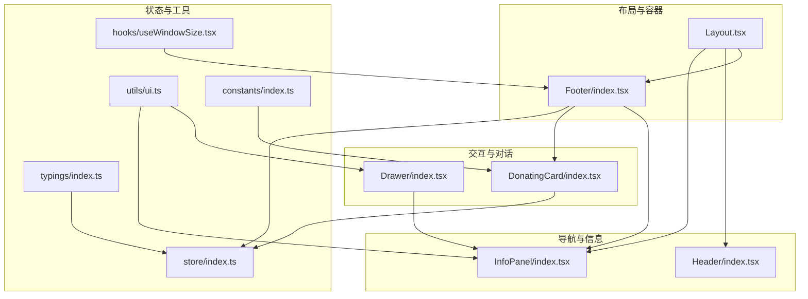
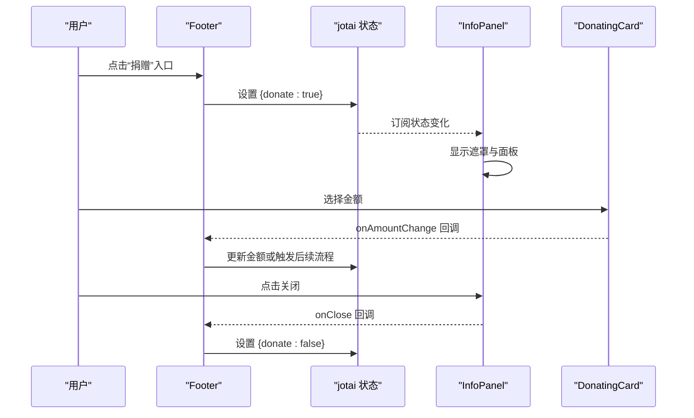
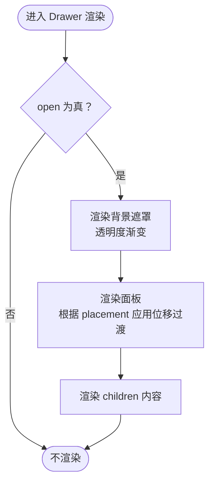
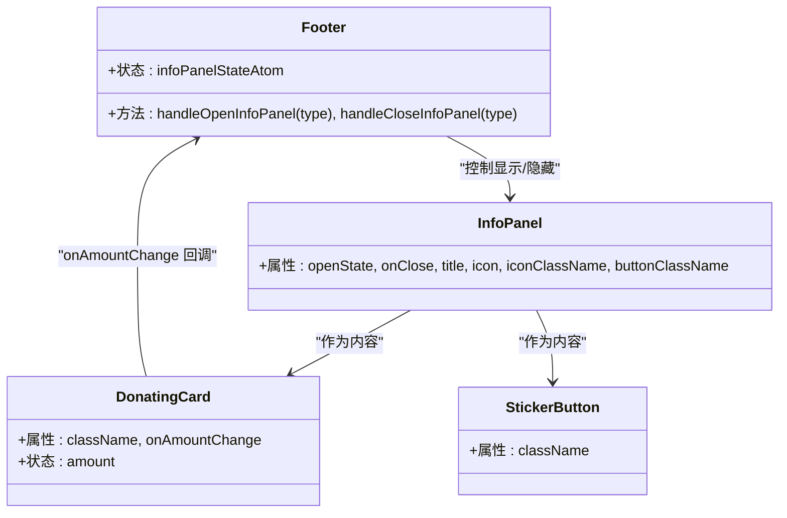
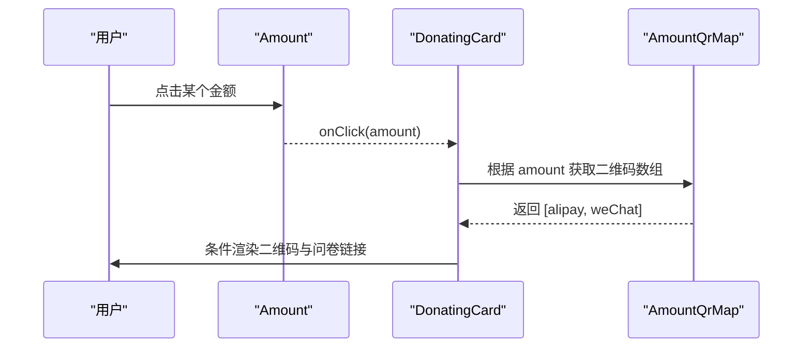
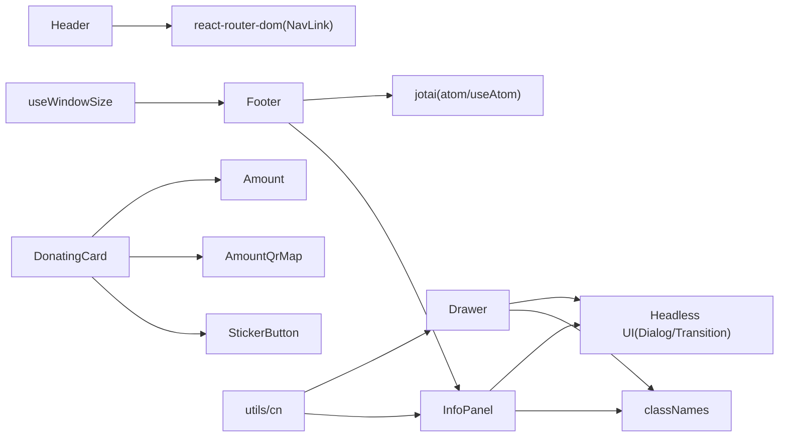

# 交互组件实现

<cite>
**本文引用的文件**
- [src/components/Drawer/index.tsx](file://src/components/Drawer/index.tsx)
- [src/components/Header/index.tsx](file://src/components/Header/index.tsx)
- [src/components/Footer/index.tsx](file://src/components/Footer/index.tsx)
- [src/components/InfoPanel/index.tsx](file://src/components/InfoPanel/index.tsx)
- [src/components/Layout.tsx](file://src/components/Layout.tsx)
- [src/components/DonatingCard/index.tsx](file://src/components/DonatingCard/index.tsx)
- [src/components/DonatingCard/components/Amount.tsx](file://src/components/DonatingCard/components/Amount.tsx)
- [src/components/DonatingCard/components/StickerButton.tsx](file://src/components/DonatingCard/components/StickerButton.tsx)
- [src/components/DonatingCard/AmountQrMap.tsx](file://src/components/DonatingCard/AmountQrMap.tsx)
- [src/store/index.ts](file://src/store/index.ts)
- [src/hooks/useWindowSize.tsx](file://src/hooks/useWindowSize.tsx)
- [src/utils/ui.ts](file://src/utils/ui.ts)
- [src/typings/index.ts](file://src/typings/index.ts)
- [src/constants/index.ts](file://src/constants/index.ts)
</cite>

## 目录

1. [简介](#简介)
2. [项目结构](#项目结构)
3. [核心组件](#核心组件)
4. [架构总览](#架构总览)
5. [详细组件分析](#详细组件分析)
6. [依赖关系分析](#依赖关系分析)
7. [性能考量](#性能考量)
8. [故障排查指南](#故障排查指南)
9. [结论](#结论)
10. [附录](#附录)

## 简介

本技术文档聚焦于交互组件的实现与设计，覆盖抽屉(Drawer)、头部导航(Header)、底部栏(Footer)、信息面板(InfoPanel)与布局(Layout)等组件。文档从系统架构、组件关系、数据流与处理逻辑、集成点与事件传递、错误处理与性能特性等方面进行深入剖析，并补充可访问性、键盘支持、屏幕阅读器兼容性、性能优化、内存管理、渲染优化、自定义扩展、主题适配与国际化支持方案。

## 项目结构

本项目采用按功能域分层的组织方式：页面与组件位于 src 下，交互组件集中在 src/components；全局状态由 jotai 原子管理，位于 src/store；通用工具与类型定义分别在 src/utils 与 src/typings；响应式尺寸钩子在 src/hooks 中提供。

图表来源

- [src/components/Layout.tsx](file://src/components/Layout.tsx#L1-L12)
- [src/components/Footer/index.tsx](file://src/components/Footer/index.tsx#L1-L253)
- [src/components/Header/index.tsx](file://src/components/Header/index.tsx#L1-L26)
- [src/components/InfoPanel/index.tsx](file://src/components/InfoPanel/index.tsx#L1-L78)
- [src/components/Drawer/index.tsx](file://src/components/Drawer/index.tsx#L1-L69)
- [src/components/DonatingCard/index.tsx](file://src/components/DonatingCard/index.tsx#L1-L51)
- [src/store/index.ts](file://src/store/index.ts#L1-L118)
- [src/hooks/useWindowSize.tsx](file://src/hooks/useWindowSize.tsx#L1-L30)
- [src/utils/ui.ts](file://src/utils/ui.ts#L1-L7)
- [src/typings/index.ts](file://src/typings/index.ts#L1-L51)
- [src/constants/index.ts](file://src/constants/index.ts#L1-L19)

章节来源

- [src/components/Layout.tsx](file://src/components/Layout.tsx#L1-L12)
- [src/components/Footer/index.tsx](file://src/components/Footer/index.tsx#L1-L253)
- [src/components/Header/index.tsx](file://src/components/Header/index.tsx#L1-L26)
- [src/components/InfoPanel/index.tsx](file://src/components/InfoPanel/index.tsx#L1-L78)
- [src/components/Drawer/index.tsx](file://src/components/Drawer/index.tsx#L1-L69)
- [src/components/DonatingCard/index.tsx](file://src/components/DonatingCard/index.tsx#L1-L51)
- [src/store/index.ts](file://src/store/index.ts#L1-L118)
- [src/hooks/useWindowSize.tsx](file://src/hooks/useWindowSize.tsx#L1-L30)
- [src/utils/ui.ts](file://src/utils/ui.ts#L1-L7)
- [src/typings/index.ts](file://src/typings/index.ts#L1-L51)
- [src/constants/index.ts](file://src/constants/index.ts#L1-L19)

## 核心组件

- 抽屉 Drawer：基于 Headless UI 的 Dialog/Transition 实现，支持多方位滑入/滑出过渡，背景遮罩透明度控制，类名合并与方向映射。
- 头部导航 Header：响应式布局，Logo 与标题、导航项容器，移动端与桌面端排布差异。
- 底部栏 Footer：聚合多个信息面板入口，使用 jotai 状态驱动 InfoPanel 开关，内嵌 DonatingCard 与 StickerButton。
- 信息面板 InfoPanel：基于 Headless UI 的对话框，淡入淡出与缩放过渡，标题与图标区域，关闭按钮。
- 布局 Layout：主容器，承载页面内容并在底部注入 Footer。

章节来源

- [src/components/Drawer/index.tsx](file://src/components/Drawer/index.tsx#L1-L69)
- [src/components/Header/index.tsx](file://src/components/Header/index.tsx#L1-L26)
- [src/components/Footer/index.tsx](file://src/components/Footer/index.tsx#L1-L253)
- [src/components/InfoPanel/index.tsx](file://src/components/InfoPanel/index.tsx#L1-L78)
- [src/components/Layout.tsx](file://src/components/Layout.tsx#L1-L12)

## 架构总览

组件间通过状态原子与事件回调建立松耦合连接。Footer 统一持有 InfoPanel 状态，通过回调切换对应面板；Drawer 与 InfoPanel 共用 Headless UI 动画与遮罩；DonatingCard 作为 InfoPanel 内容之一，通过受控状态与事件向上通知金额变更。

图表来源

- [src/components/Footer/index.tsx](file://src/components/Footer/index.tsx#L1-L253)
- [src/store/index.ts](file://src/store/index.ts#L1-L118)
- [src/components/InfoPanel/index.tsx](file://src/components/InfoPanel/index.tsx#L1-L78)
- [src/components/DonatingCard/index.tsx](file://src/components/DonatingCard/index.tsx#L1-L51)

## 详细组件分析

### 抽屉 Drawer 分析

- 设计模式：组合 Headless UI 的 Dialog 与 Transition，通过 show/appear 控制整体显隐，子元素分别控制背景遮罩与面板位移过渡。
- 方向映射：根据 placement 将过渡位移映射为 translate-x/y 的负值或正值，配合绝对定位与固定定位实现从边缘滑入。
- 动画与过渡：背景遮罩与面板分别定义 enter/leave 的透明度与位移动画，时长与缓动函数可配置。
- 类名合并：使用 classNames 合并传入的 classNames 与默认样式，确保可定制性与主题一致性。
- 响应式与手势：当前实现未内置手势交互，可通过在父级容器添加触摸事件与位移阈值实现滑动手势关闭；建议结合 useWindowSize 判断设备类型决定是否启用手势。

图表来源

- [src/components/Drawer/index.tsx](file://src/components/Drawer/index.tsx#L1-L69)

章节来源

- [src/components/Drawer/index.tsx](file://src/components/Drawer/index.tsx#L1-L69)
- [src/utils/ui.ts](file://src/utils/ui.ts#L1-L7)

### 头部导航 Header 分析

- 结构：Logo + 标题 + 导航容器，容器内放置多个导航项。
- 响应式：在 lg 断点前垂直堆叠，断点后水平排列，间距与字号随设备调整。
- 可访问性：NavLink 提供路由跳转，图片与标题具备 alt/aria-label 属性，容器具备语义化 header 标签。
- 主题适配：容器使用明暗主题色值，过渡时长统一。

章节来源

- [src/components/Header/index.tsx](file://src/components/Header/index.tsx#L1-L26)

### 底部栏 Footer 分析

- 状态驱动：通过 jotai 的 infoPanelStateAtom 统一管理四个面板开关状态，Footer 内部提供 open/close 回调。
- 事件传递：点击各入口调用 handleOpenInfoPanel，记录埋点并设置对应状态；关闭按钮调用 handleCloseInfoPanel。
- 内容组织：底部栏内嵌多个 InfoPanel，分别承载“捐赠”“VSCode 插件”“用户社群”“小红书社群”等信息；其中“捐赠”面板内含 DonatingCard 与 StickerButton。
- 可访问性：所有外部链接与按钮均提供 aria-label 或 title 属性；点击后主动 blur，避免键盘焦点停留在已移除的元素上。
- 国际化：当前文案为中文，建议将文案抽取至 i18n 资源，通过上下文或配置切换语言。

图表来源

- [src/components/Footer/index.tsx](file://src/components/Footer/index.tsx#L1-L253)
- [src/components/InfoPanel/index.tsx](file://src/components/InfoPanel/index.tsx#L1-L78)
- [src/components/DonatingCard/index.tsx](file://src/components/DonatingCard/index.tsx#L1-L51)
- [src/components/DonatingCard/components/StickerButton.tsx](file://src/components/DonatingCard/components/StickerButton.tsx#L1-L38)
- [src/store/index.ts](file://src/store/index.ts#L1-L118)

章节来源

- [src/components/Footer/index.tsx](file://src/components/Footer/index.tsx#L1-L253)
- [src/store/index.ts](file://src/store/index.ts#L1-L118)
- [src/typings/index.ts](file://src/typings/index.ts#L1-L51)

### 信息面板 InfoPanel 分析

- 对话框实现：基于 Dialog/Transition，根节点控制整体显隐，子节点控制背景与面板的 enter/leave 过渡。
- 样式与图标：标题区包含图标容器与标题文本，内容区承载 children；底部按钮使用传入的按钮类名。
- 关闭机制：通过 onClose 回调与外部状态联动，确保外部状态与 UI 同步。

章节来源

- [src/components/InfoPanel/index.tsx](file://src/components/InfoPanel/index.tsx#L1-L78)

### 布局 Layout 分析

- 容器职责：提供全屏高度的纵向布局，承载页面主体内容并在底部注入 Footer。
- 适用场景：作为页面级容器，确保 Footer 总是出现在可视区域底部。

章节来源

- [src/components/Layout.tsx](file://src/components/Layout.tsx#L1-L12)

### 捐赠卡片 DonatingCard 与金额选择 Amount

- 数据流：Amount 组件接收 onClick 回调，选中金额后通过 onAmountChange 通知父组件；DonatingCard 内部维护 amount 状态并根据金额显示二维码区域。
- 金额映射：AmountQrMap 将金额映射到支付宝与微信二维码图片数组；当金额大于等于 50 或为自定义金额时，展示贴纸寄送问卷链接。
- 交互细节：金额选择后，DonatingCard 使用高度过渡与条件渲染展示二维码；StickerButton 通过 Tooltip 展示贴纸图片与说明。

图表来源

- [src/components/DonatingCard/index.tsx](file://src/components/DonatingCard/index.tsx#L1-L51)
- [src/components/DonatingCard/components/Amount.tsx](file://src/components/DonatingCard/components/Amount.tsx#L1-L24)
- [src/components/DonatingCard/AmountQrMap.tsx](file://src/components/DonatingCard/AmountQrMap.tsx#L1-L22)

章节来源

- [src/components/DonatingCard/index.tsx](file://src/components/DonatingCard/index.tsx#L1-L51)
- [src/components/DonatingCard/components/Amount.tsx](file://src/components/DonatingCard/components/Amount.tsx#L1-L24)
- [src/components/DonatingCard/AmountQrMap.tsx](file://src/components/DonatingCard/AmountQrMap.tsx#L1-L22)
- [src/components/DonatingCard/components/StickerButton.tsx](file://src/components/DonatingCard/components/StickerButton.tsx#L1-L38)
- [src/constants/index.ts](file://src/constants/index.ts#L1-L19)

## 依赖关系分析

- 组件依赖：Footer 依赖 InfoPanel 与 DonatingCard；InfoPanel 依赖 Headless UI 的 Dialog/Transition；Drawer 依赖 Headless UI 与 classNames；DonatingCard 依赖 Amount 与 AmountQrMap。
- 状态依赖：Footer 与 InfoPanel 通过 jotai 的 infoPanelStateAtom 同步状态；DonatingCard 通过 onAmountChange 与父组件同步金额。
- 工具依赖：classNames 用于类名合并；useWindowSize 用于响应式判断；cn 用于 Tailwind 合并。

图表来源

- [src/components/Drawer/index.tsx](file://src/components/Drawer/index.tsx#L1-L69)
- [src/components/Header/index.tsx](file://src/components/Header/index.tsx#L1-L26)
- [src/components/Footer/index.tsx](file://src/components/Footer/index.tsx#L1-L253)
- [src/components/InfoPanel/index.tsx](file://src/components/InfoPanel/index.tsx#L1-L78)
- [src/components/DonatingCard/index.tsx](file://src/components/DonatingCard/index.tsx#L1-L51)
- [src/components/DonatingCard/components/Amount.tsx](file://src/components/DonatingCard/components/Amount.tsx#L1-L24)
- [src/components/DonatingCard/AmountQrMap.tsx](file://src/components/DonatingCard/AmountQrMap.tsx#L1-L22)
- [src/components/DonatingCard/components/StickerButton.tsx](file://src/components/DonatingCard/components/StickerButton.tsx#L1-L38)
- [src/store/index.ts](file://src/store/index.ts#L1-L118)
- [src/hooks/useWindowSize.tsx](file://src/hooks/useWindowSize.tsx#L1-L30)
- [src/utils/ui.ts](file://src/utils/ui.ts#L1-L7)

章节来源

- [src/store/index.ts](file://src/store/index.ts#L1-L118)
- [src/utils/ui.ts](file://src/utils/ui.ts#L1-L7)
- [src/hooks/useWindowSize.tsx](file://src/hooks/useWindowSize.tsx#L1-L30)

## 性能考量

- 渲染优化
  - 使用 Fragment 减少额外 DOM 包裹，降低渲染层级。
  - Drawer 与 InfoPanel 的 Transition 子节点仅在显隐时参与过渡，避免不必要的重绘。
  - DonatingCard 使用条件渲染与高度过渡，减少大块内容的常驻渲染。
- 状态与订阅
  - 使用 jotai 原子精确订阅，避免无关组件重渲染；Footer 仅订阅 infoPanelStateAtom，减少全局广播。
- 事件与监听
  - useWindowSize 在客户端注册 resize 事件，组件卸载时解绑，防止内存泄漏。
- 图片与资源
  - 二维码图片按需加载，避免首屏阻塞；StickerButton 的 Tooltip 图片在悬停时可见，延迟加载策略可进一步优化。
- 动画与过渡
  - 控制 enter/leave 的时长与缓动函数，避免过长动画导致卡顿；必要时在低端设备降级为无动画。

[本节为通用性能建议，无需列出具体文件来源]

## 故障排查指南

- 信息面板无法关闭
  - 检查 Footer 的 handleCloseInfoPanel 是否正确调用；确认 onClose 回调是否被 InfoPanel 接收并触发。
  - 章节来源
    - [src/components/Footer/index.tsx](file://src/components/Footer/index.tsx#L1-L253)
    - [src/components/InfoPanel/index.tsx](file://src/components/InfoPanel/index.tsx#L1-L78)
- Drawer 不显示或无过渡
  - 确认 open 与 placement 参数；检查 transitionDirectionMap 与 Panel 的类名拼接。
  - 章节来源
    - [src/components/Drawer/index.tsx](file://src/components/Drawer/index.tsx#L1-L69)
- 捐赠金额未生效
  - 检查 DonatingCard 的 onAmountChange 是否传入 Footer；确认 Amount 的 active 样式与选中状态。
  - 章节来源
    - [src/components/DonatingCard/index.tsx](file://src/components/DonatingCard/index.tsx#L1-L51)
    - [src/components/DonatingCard/components/Amount.tsx](file://src/components/DonatingCard/components/Amount.tsx#L1-L24)
- 焦点与可访问性问题
  - Footer 中点击后调用 blur，避免键盘焦点停留在已移除元素；为外部链接提供 aria-label 或 title。
  - 章节来源
    - [src/components/Footer/index.tsx](file://src/components/Footer/index.tsx#L1-L253)

## 结论

本项目交互组件以 Headless UI 为基础，结合 jotai 状态管理与 Tailwind/CSS 工具类，实现了简洁、可定制、可扩展的 UI 体系。Footer 作为状态中枢，有效串联多个 InfoPanel；Drawer 与 InfoPanel 提供一致的过渡与遮罩体验；DonatingCard 通过金额选择与二维码联动增强捐赠流程。未来可在手势交互、国际化文案、动画降级与资源懒加载方面继续优化。

[本节为总结性内容，无需列出具体文件来源]

## 附录

### 可访问性与键盘支持

- 为所有可交互元素提供 aria-label 或 title；为外部链接提供 rel="noreferrer" 与 target 属性。
- 使用 focus:outline-none 时，确保替代焦点可见性方案；Footer 中点击后主动 blur，避免焦点悬挂。
- 为图片提供 alt 文本，图标使用语义化标签或 aria-label。

章节来源

- [src/components/Footer/index.tsx](file://src/components/Footer/index.tsx#L1-L253)
- [src/components/InfoPanel/index.tsx](file://src/components/InfoPanel/index.tsx#L1-L78)

### 主题适配与样式合并

- 使用 classNames/twMerge 合并类名，确保默认样式与自定义样式的优先级与覆盖关系清晰。
- 通过明暗主题变量与 dark: 前缀实现自动适配。

章节来源

- [src/utils/ui.ts](file://src/utils/ui.ts#L1-L7)
- [src/components/Drawer/index.tsx](file://src/components/Drawer/index.tsx#L1-L69)
- [src/components/InfoPanel/index.tsx](file://src/components/InfoPanel/index.tsx#L1-L78)

### 国际化支持方案

- 将 Footer 与 InfoPanel 的文案抽取至 i18n 资源，通过配置切换语言；保持图标与结构不变，仅替换文本。
- 金额文案与提示文案纳入翻译键值，避免硬编码。

章节来源

- [src/components/Footer/index.tsx](file://src/components/Footer/index.tsx#L1-L253)
- [src/components/InfoPanel/index.tsx](file://src/components/InfoPanel/index.tsx#L1-L78)
- [src/typings/index.ts](file://src/typings/index.ts#L1-L51)

### 自定义扩展指南

- Drawer：新增 placement 方向时，扩展 transitionDirectionMap 并在 Panel 类名中补充对应定位类。
- InfoPanel：新增图标与颜色主题时，通过 iconClassName/buttonClassName 注入新样式；如需不同尺寸，扩展 max-width 与 padding。
- Footer：新增入口时，扩展 InfoPanelType 并在 Footer 中添加对应状态与入口按钮，保持 onClose 与埋点一致。
- DonatingCard：新增金额选项时，扩展 displayAmount 与 AmountQrMap；如需自定义文案，通过 props 传入。

章节来源

- [src/components/Drawer/index.tsx](file://src/components/Drawer/index.tsx#L1-L69)
- [src/components/InfoPanel/index.tsx](file://src/components/InfoPanel/index.tsx#L1-L78)
- [src/components/Footer/index.tsx](file://src/components/Footer/index.tsx#L1-L253)
- [src/components/DonatingCard/index.tsx](file://src/components/DonatingCard/index.tsx#L1-L51)
- [src/typings/index.ts](file://src/typings/index.ts#L1-L51)
