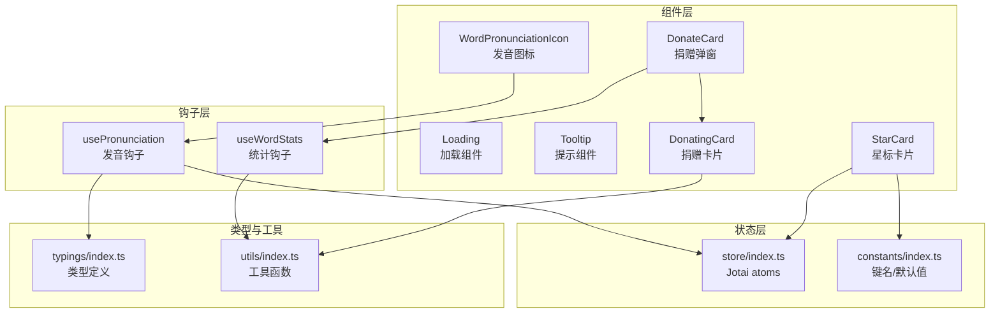
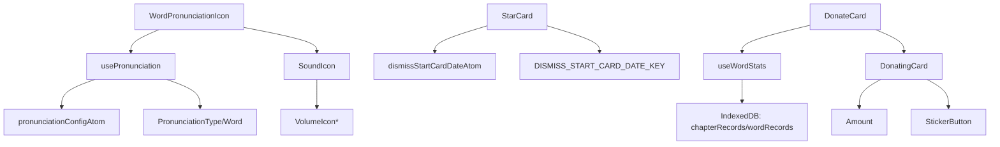
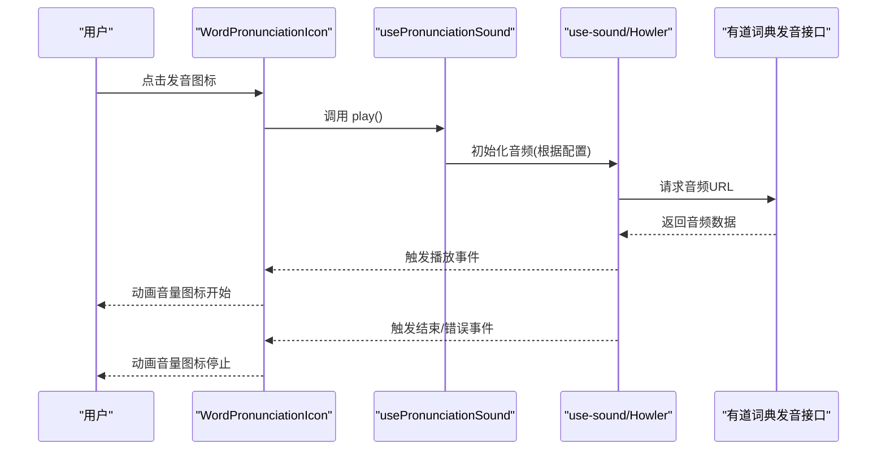
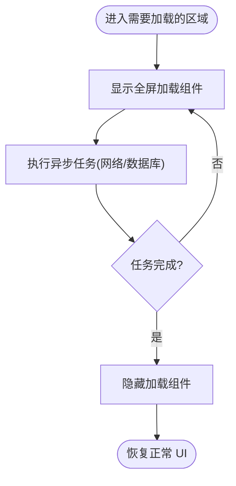
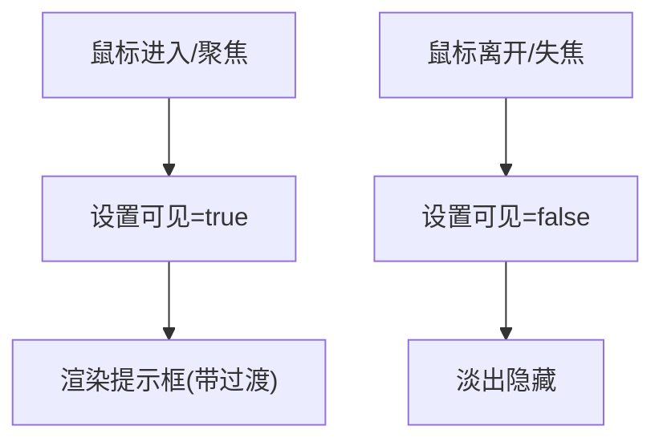
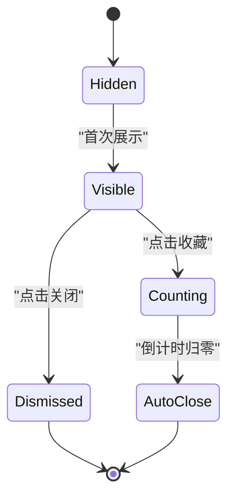
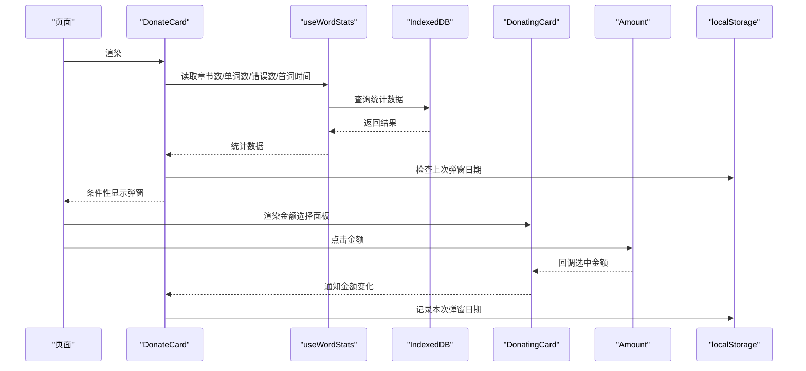
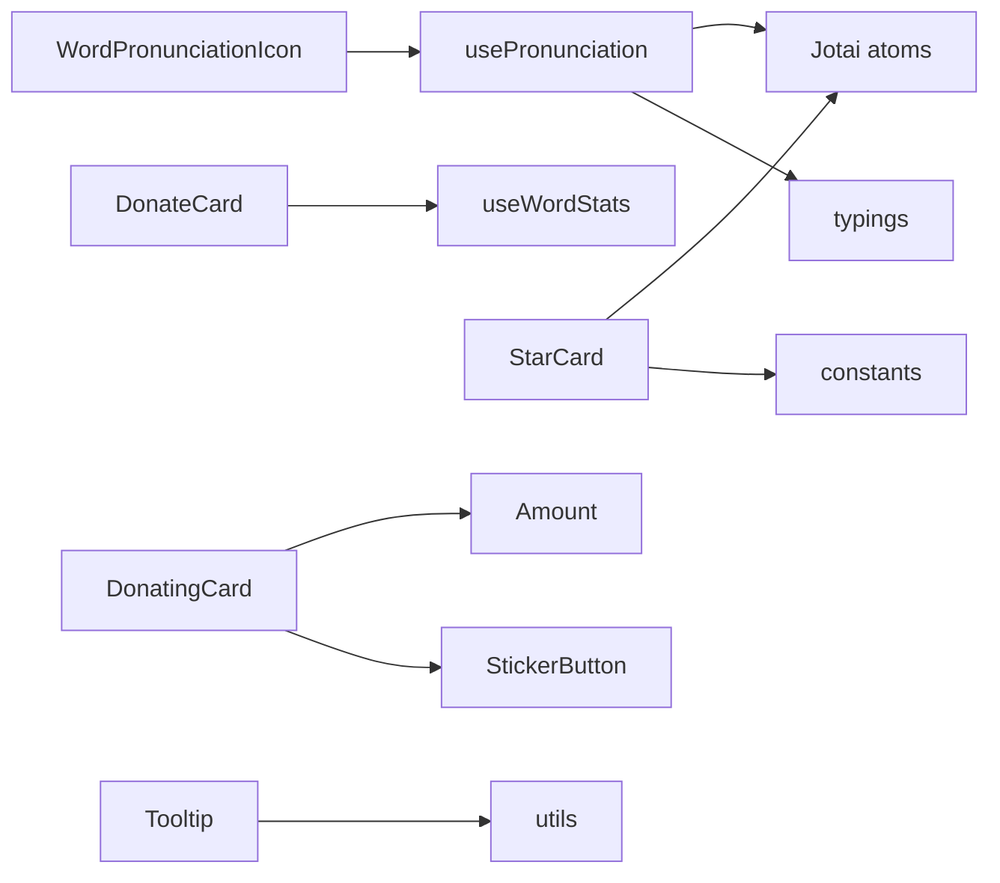

# 功能组件设计

<cite>
**本文引用的文件**
- [src/components/WordPronunciationIcon/index.tsx](file://src/components/WordPronunciationIcon/index.tsx)
- [src/components/WordPronunciationIcon/SoundIcon.tsx](file://src/components/WordPronunciationIcon/SoundIcon.tsx)
- [src/components/WordPronunciationIcon/VolumeIcon.tsx](file://src/components/WordPronunciationIcon/VolumeIcon.tsx)
- [src/hooks/usePronunciation.ts](file://src/hooks/usePronunciation.ts)
- [src/store/index.ts](file://src/store/index.ts)
- [src/typings/index.ts](file://src/typings/index.ts)
- [src/components/Loading/index.tsx](file://src/components/Loading/index.tsx)
- [src/components/Tooltip/index.tsx](file://src/components/Tooltip/index.tsx)
- [src/components/StarCard/index.tsx](file://src/components/StarCard/index.tsx)
- [src/constants/index.ts](file://src/constants/index.ts)
- [src/utils/index.ts](file://src/utils/index.ts)
- [src/components/DonateCard/index.tsx](file://src/components/DonateCard/index.tsx)
- [src/components/DonateCard/hooks/useWordStats.ts](file://src/components/DonateCard/hooks/useWordStats.ts)
- [src/components/DonatingCard/index.tsx](file://src/components/DonatingCard/index.tsx)
- [src/components/DonatingCard/components/Amount.tsx](file://src/components/DonatingCard/components/Amount.tsx)
- [src/components/DonatingCard/components/StickerButton.tsx](file://src/components/DonatingCard/components/StickerButton.tsx)
</cite>

## 目录

1. [简介](#简介)
2. [项目结构](#项目结构)
3. [核心组件](#核心组件)
4. [架构总览](#架构总览)
5. [详细组件分析](#详细组件分析)
6. [依赖关系分析](#依赖关系分析)
7. [性能考量](#性能考量)
8. [故障排除指南](#故障排除指南)
9. [结论](#结论)
10. [附录](#附录)

## 简介

本技术文档聚焦于以下专用功能组件的设计与实现：单词发音图标（WordPronunciationIcon）、加载组件（Loading）、提示组件（Tooltip）、星标卡片（StarCard）、捐赠卡片（DonatingCard）。文档从系统架构、数据流、状态管理、用户交互、外部服务集成、可复用性与扩展点、生命周期与错误处理、性能优化等方面进行深入剖析，并提供使用示例、集成指南与故障排除方法。

## 项目结构

这些组件分布在 src/components 下的功能目录中，配合 hooks、store、typings、constants 等模块协同工作，形成清晰的分层与职责边界：

- 组件层：各功能组件独立封装，暴露最小公共接口
- 钩子层：usePronunciation、useWordStats 等提供跨组件的状态与副作用抽象
- 状态层：Jotai 原子（atoms）集中管理全局配置与持久化状态
- 类型与常量：typings 定义语言与发音类型，constants 提供键名与默认配置
- 工具层：通用工具函数（类名拼接、事件监听、时间格式化等）

图表来源

- [src/components/WordPronunciationIcon/index.tsx](file://src/components/WordPronunciationIcon/index.tsx#L1-L58)
- [src/hooks/usePronunciation.ts](file://src/hooks/usePronunciation.ts#L1-L104)
- [src/store/index.ts](file://src/store/index.ts#L1-L118)
- [src/typings/index.ts](file://src/typings/index.ts#L1-L51)
- [src/components/DonateCard/index.tsx](file://src/components/DonateCard/index.tsx#L1-L161)
- [src/components/DonateCard/hooks/useWordStats.ts](file://src/components/DonateCard/hooks/useWordStats.ts#L1-L72)
- [src/components/DonatingCard/index.tsx](file://src/components/DonatingCard/index.tsx#L1-L51)
- [src/components/StarCard/index.tsx](file://src/components/StarCard/index.tsx#L1-L124)
- [src/constants/index.ts](file://src/constants/index.ts#L1-L19)
- [src/utils/index.ts](file://src/utils/index.ts#L1-L130)

章节来源

- [src/components/WordPronunciationIcon/index.tsx](file://src/components/WordPronunciationIcon/index.tsx#L1-L58)
- [src/components/Loading/index.tsx](file://src/components/Loading/index.tsx#L1-L23)
- [src/components/Tooltip/index.tsx](file://src/components/Tooltip/index.tsx#L1-L39)
- [src/components/StarCard/index.tsx](file://src/components/StarCard/index.tsx#L1-L124)
- [src/components/DonateCard/index.tsx](file://src/components/DonateCard/index.tsx#L1-L161)
- [src/components/DonatingCard/index.tsx](file://src/components/DonatingCard/index.tsx#L1-L51)

## 核心组件

本节概述五个组件的核心功能、关键职责与交互入口。

- 单词发音图标（WordPronunciationIcon）
  - 职责：根据词典条目与语言配置生成发音 URL，控制音频播放/停止与动画反馈；对外暴露 ref 方法以支持外部触发播放
  - 关键点：多语言适配（含哈萨克语两种书写形式）、防并发播放、动画音量图标轮播
- 加载组件（Loading）
  - 职责：全屏旋转加载指示器，提供轻量级骨架占位
  - 关键点：固定定位、记忆化渲染、纯 UI 组件
- 提示组件（Tooltip）
  - 职责：基于鼠标悬停或焦点显示气泡提示，支持上下方位切换
  - 关键点：可见性状态、类名拼接、过渡动画
- 星标卡片（StarCard）
  - 职责：引导用户收藏站点，倒计时自动关闭，记录用户行为
  - 关键点：本地存储控制展示时机、倒计时状态机、Headless UI 过渡
- 捐赠卡片（DonatingCard）
  - 职责：展示捐赠金额选择与二维码，联动 DonateCard 弹窗
  - 关键点：金额映射、图片预览区显隐、贴纸问卷链接

章节来源

- [src/components/WordPronunciationIcon/index.tsx](file://src/components/WordPronunciationIcon/index.tsx#L1-L58)
- [src/components/Loading/index.tsx](file://src/components/Loading/index.tsx#L1-L23)
- [src/components/Tooltip/index.tsx](file://src/components/Tooltip/index.tsx#L1-L39)
- [src/components/StarCard/index.tsx](file://src/components/StarCard/index.tsx#L1-L124)
- [src/components/DonatingCard/index.tsx](file://src/components/DonatingCard/index.tsx#L1-L51)

## 架构总览

组件间协作关系如下：

- WordPronunciationIcon 通过 usePronunciation 读取 Jotai 原子中的发音配置，生成有道词典发音 URL 并使用 use-sound 播放；SoundIcon 负责动画音量图标
- StarCard 通过 Jotai 原子与 localStorage 控制展示与倒计时，记录用户行为
- DonateCard 通过 useWordStats 钩子访问 IndexedDB 统计信息，结合 localStorage 控制弹窗触发频率
- DonatingCard 作为金额选择面板，向上游回调选中金额并联动二维码展示

图表来源

- [src/components/WordPronunciationIcon/index.tsx](file://src/components/WordPronunciationIcon/index.tsx#L1-L58)
- [src/components/WordPronunciationIcon/SoundIcon.tsx](file://src/components/WordPronunciationIcon/SoundIcon.tsx#L1-L39)
- [src/components/WordPronunciationIcon/VolumeIcon.tsx](file://src/components/WordPronunciationIcon/VolumeIcon.tsx#L1-L33)
- [src/hooks/usePronunciation.ts](file://src/hooks/usePronunciation.ts#L1-L104)
- [src/store/index.ts](file://src/store/index.ts#L1-L118)
- [src/typings/index.ts](file://src/typings/index.ts#L1-L51)
- [src/components/StarCard/index.tsx](file://src/components/StarCard/index.tsx#L1-L124)
- [src/constants/index.ts](file://src/constants/index.ts#L1-L19)
- [src/components/DonateCard/index.tsx](file://src/components/DonateCard/index.tsx#L1-L161)
- [src/components/DonateCard/hooks/useWordStats.ts](file://src/components/DonateCard/hooks/useWordStats.ts#L1-L72)
- [src/components/DonatingCard/index.tsx](file://src/components/DonatingCard/index.tsx#L1-L51)
- [src/components/DonatingCard/components/Amount.tsx](file://src/components/DonatingCard/components/Amount.tsx#L1-L24)
- [src/components/DonatingCard/components/StickerButton.tsx](file://src/components/DonatingCard/components/StickerButton.tsx#L1-L38)

## 详细组件分析

### 单词发音图标（WordPronunciationIcon）

- 设计要点
  - 语言分支：针对“哈萨克语”区分西里尔与老文字，其他语言使用英文词名
  - 并发控制：每次播放前先 stop，避免多个音频同时播放
  - 动画反馈：通过 isPlaying 驱动音量图标循环动画
  - 外部 ref：暴露 play 方法，便于父组件主动触发
- 数据流与状态
  - 输入：word、lang、className、iconClassName
  - 内部状态：isPlaying
  - 外部状态：从 pronunciationConfigAtom 读取发音类型、循环、速率、音量
- 外部服务集成
  - 发音 URL 由 generateWordSoundSrc 依据配置与语言生成，调用有道词典发音接口
  - 使用 use-sound 与 Howler，统一监听播放/结束/暂停/错误事件
- 生命周期与清理
  - 组件卸载时卸载音频资源，移除事件监听
- 错误处理
  - 播放错误时将 isPlaying 置为 false，保证 UI 与状态一致
- 性能优化
  - 音频预取：usePrefetchPronunciationSound 在页面首屏或即将出现时预加载音频标签，减少首次播放延迟
  - 动画帧：SoundIcon 使用定时器驱动帧切换，避免高频重渲染

图表来源

- [src/components/WordPronunciationIcon/index.tsx](file://src/components/WordPronunciationIcon/index.tsx#L1-L58)
- [src/hooks/usePronunciation.ts](file://src/hooks/usePronunciation.ts#L1-L104)

章节来源

- [src/components/WordPronunciationIcon/index.tsx](file://src/components/WordPronunciationIcon/index.tsx#L1-L58)
- [src/components/WordPronunciationIcon/SoundIcon.tsx](file://src/components/WordPronunciationIcon/SoundIcon.tsx#L1-L39)
- [src/components/WordPronunciationIcon/VolumeIcon.tsx](file://src/components/WordPronunciationIcon/VolumeIcon.tsx#L1-L33)
- [src/hooks/usePronunciation.ts](file://src/hooks/usePronunciation.ts#L1-L104)
- [src/store/index.ts](file://src/store/index.ts#L1-L118)
- [src/typings/index.ts](file://src/typings/index.ts#L1-L51)

### 加载组件（Loading）

- 设计要点
  - 全屏固定定位，居中显示旋转指示器
  - 使用 CSS 动画与 Tailwind 类名控制样式
  - React.memo 包装，避免重复渲染
- 使用建议
  - 适合长任务或异步数据加载场景
  - 注意在路由切换时正确挂载/卸载

图表来源

- [src/components/Loading/index.tsx](file://src/components/Loading/index.tsx#L1-L23)

章节来源

- [src/components/Loading/index.tsx](file://src/components/Loading/index.tsx#L1-L23)

### 提示组件（Tooltip）

- 设计要点
  - 基于鼠标进入/离开与焦点失焦控制可见性
  - 支持顶部/底部两个方位，通过类名切换定位
  - 使用 classNames 工具拼接类名，保证样式可控
- 扩展点
  - 可增加左右方位、延迟显示、主题色等配置

图表来源

- [src/components/Tooltip/index.tsx](file://src/components/Tooltip/index.tsx#L1-L39)
- [src/utils/index.ts](file://src/utils/index.ts#L1-L130)

章节来源

- [src/components/Tooltip/index.tsx](file://src/components/Tooltip/index.tsx#L1-L39)
- [src/utils/index.ts](file://src/utils/index.ts#L1-L130)

### 星标卡片（StarCard）

- 设计要点
  - 初始展示：若未在 localStorage 记录过关闭时间，则显示
  - 行为记录：点击“我要收藏”进入倒计时，点击“关闭提示”记录关闭动作
  - 倒计时：每秒递减，归零后自动隐藏
  - 过渡：使用 Headless UI Transition 实现平滑进出
- 状态管理
  - dismissStartCardDateAtom：持久化关闭时间
  - 本地存储键：DISMISS_START_CARD_DATE_KEY
- 用户体验
  - 提供快捷键提示（Mac 与 Windows 差异）
  - 自动关闭避免打扰

图表来源

- [src/components/StarCard/index.tsx](file://src/components/StarCard/index.tsx#L1-L124)
- [src/store/index.ts](file://src/store/index.ts#L1-L118)
- [src/constants/index.ts](file://src/constants/index.ts#L1-L19)
- [src/utils/index.ts](file://src/utils/index.ts#L1-L130)

章节来源

- [src/components/StarCard/index.tsx](file://src/components/StarCard/index.tsx#L1-L124)
- [src/store/index.ts](file://src/store/index.ts#L1-L118)
- [src/constants/index.ts](file://src/constants/index.ts#L1-L19)
- [src/utils/index.ts](file://src/utils/index.ts#L1-L130)

### 捐赠卡片（DonatingCard）与捐赠弹窗（DonateCard）

- 设计要点
  - DonateCard：按章节数（每满 10 章）周期性弹窗，结合 localStorage 控制弹窗频率
  - DonatingCard：金额选择面板，选中后显示支付宝/微信二维码，满足一定金额后显示贴纸问卷链接
  - useWordStats：从 IndexedDB 读取章节数、单词数、错误次数、首个单词记录时间等统计数据
- 数据流
  - 选中金额通过回调上行至 DonateCard，同时记录到 localStorage
  - 报告埋点：记录用户行为（已捐赠/稍后提醒），携带统计信息
- 可复用性
  - 将金额选择与二维码展示解耦为独立组件，便于复用与替换

图表来源

- [src/components/DonateCard/index.tsx](file://src/components/DonateCard/index.tsx#L1-L161)
- [src/components/DonateCard/hooks/useWordStats.ts](file://src/components/DonateCard/hooks/useWordStats.ts#L1-L72)
- [src/components/DonatingCard/index.tsx](file://src/components/DonatingCard/index.tsx#L1-L51)
- [src/components/DonatingCard/components/Amount.tsx](file://src/components/DonatingCard/components/Amount.tsx#L1-L24)
- [src/components/DonatingCard/components/StickerButton.tsx](file://src/components/DonatingCard/components/StickerButton.tsx#L1-L38)

章节来源

- [src/components/DonateCard/index.tsx](file://src/components/DonateCard/index.tsx#L1-L161)
- [src/components/DonateCard/hooks/useWordStats.ts](file://src/components/DonateCard/hooks/useWordStats.ts#L1-L72)
- [src/components/DonatingCard/index.tsx](file://src/components/DonatingCard/index.tsx#L1-L51)
- [src/components/DonatingCard/components/Amount.tsx](file://src/components/DonatingCard/components/Amount.tsx#L1-L24)
- [src/components/DonatingCard/components/StickerButton.tsx](file://src/components/DonatingCard/components/StickerButton.tsx#L1-L38)

## 依赖关系分析

- 组件与钩子
  - WordPronunciationIcon 依赖 usePronunciation 生成音频 URL 并控制播放
  - DonateCard 依赖 useWordStats 读取数据库统计
- 组件与状态
  - StarCard 依赖 Jotai 原子与 localStorage 控制展示
  - DonatingCard 依赖外部回调与本地存储
- 组件与工具
  - Tooltip 使用 classNames 工具拼接类名
  - StarCard 使用 IS_MAC_OS、recordStarAction 等工具
- 组件与类型
  - usePronunciation 依赖 PronunciationType/Word 类型定义
  - WordPronunciationIcon 依赖 Word 类型

图表来源

- [src/components/WordPronunciationIcon/index.tsx](file://src/components/WordPronunciationIcon/index.tsx#L1-L58)
- [src/hooks/usePronunciation.ts](file://src/hooks/usePronunciation.ts#L1-L104)
- [src/store/index.ts](file://src/store/index.ts#L1-L118)
- [src/typings/index.ts](file://src/typings/index.ts#L1-L51)
- [src/components/DonateCard/index.tsx](file://src/components/DonateCard/index.tsx#L1-L161)
- [src/components/DonateCard/hooks/useWordStats.ts](file://src/components/DonateCard/hooks/useWordStats.ts#L1-L72)
- [src/components/DonatingCard/index.tsx](file://src/components/DonatingCard/index.tsx#L1-L51)
- [src/components/DonatingCard/components/Amount.tsx](file://src/components/DonatingCard/components/Amount.tsx#L1-L24)
- [src/components/DonatingCard/components/StickerButton.tsx](file://src/components/DonatingCard/components/StickerButton.tsx#L1-L38)
- [src/components/Tooltip/index.tsx](file://src/components/Tooltip/index.tsx#L1-L39)
- [src/utils/index.ts](file://src/utils/index.ts#L1-L130)
- [src/components/StarCard/index.tsx](file://src/components/StarCard/index.tsx#L1-L124)
- [src/constants/index.ts](file://src/constants/index.ts#L1-L19)

章节来源

- [src/components/WordPronunciationIcon/index.tsx](file://src/components/WordPronunciationIcon/index.tsx#L1-L58)
- [src/hooks/usePronunciation.ts](file://src/hooks/usePronunciation.ts#L1-L104)
- [src/store/index.ts](file://src/store/index.ts#L1-L118)
- [src/typings/index.ts](file://src/typings/index.ts#L1-L51)
- [src/components/DonateCard/index.tsx](file://src/components/DonateCard/index.tsx#L1-L161)
- [src/components/DonateCard/hooks/useWordStats.ts](file://src/components/DonateCard/hooks/useWordStats.ts#L1-L72)
- [src/components/DonatingCard/index.tsx](file://src/components/DonatingCard/index.tsx#L1-L51)
- [src/components/DonatingCard/components/Amount.tsx](file://src/components/DonatingCard/components/Amount.tsx#L1-L24)
- [src/components/DonatingCard/components/StickerButton.tsx](file://src/components/DonatingCard/components/StickerButton.tsx#L1-L38)
- [src/components/Tooltip/index.tsx](file://src/components/Tooltip/index.tsx#L1-L39)
- [src/utils/index.ts](file://src/utils/index.ts#L1-L130)
- [src/components/StarCard/index.tsx](file://src/components/StarCard/index.tsx#L1-L124)
- [src/constants/index.ts](file://src/constants/index.ts#L1-L19)

## 性能考量

- 音频播放
  - 使用 use-sound 与 Howler，统一事件监听与资源释放，避免内存泄漏
  - 预取音频：在页面首屏或即将出现时预加载，降低首播延迟
  - 循环/速率/音量参数来自 Jotai 原子，避免频繁重建音频实例
- 动画与渲染
  - Loading 使用 React.memo，减少不必要的重渲染
  - Tooltip 通过可见性状态与过渡类名控制，避免复杂计算
  - StarCard 使用 Headless UI 过渡，确保动画流畅
- 数据访问
  - useWordStats 采用一次性读取策略，避免高频查询
  - IndexedDB 查询在组件挂载时执行，完成后缓存结果

[本节为通用性能建议，无需特定文件引用]

## 故障排除指南

- 发音无法播放
  - 检查发音配置是否启用、类型是否有效
  - 确认网络可达有道词典发音接口
  - 若播放报错，组件会将播放状态置为 false，确认事件监听是否正常移除
- 音频重复播放
  - 确保每次播放前调用 stop，避免并发音频叠加
- 倒计时不生效
  - 检查 localStorage 中关闭时间键是否存在，确认 isCounting 状态流转
- 捐赠弹窗不出现
  - 确认章节数是否达到 10 的倍数，且距离上次弹窗超过阈值
  - 检查 useWordStats 是否成功读取数据库统计

章节来源

- [src/hooks/usePronunciation.ts](file://src/hooks/usePronunciation.ts#L1-L104)
- [src/components/StarCard/index.tsx](file://src/components/StarCard/index.tsx#L1-L124)
- [src/components/DonateCard/index.tsx](file://src/components/DonateCard/index.tsx#L1-L161)
- [src/components/DonateCard/hooks/useWordStats.ts](file://src/components/DonateCard/hooks/useWordStats.ts#L1-L72)

## 结论

上述组件通过清晰的职责划分与稳定的外部依赖（Jotai、use-sound、Howler、Headless UI、IndexedDB），实现了高内聚、低耦合的功能模块。它们在数据流、状态管理、用户交互与性能优化方面均具备良好的工程实践，既满足当前业务需求，又为后续扩展提供了明确的接口与配置点。

[本节为总结性内容，无需特定文件引用]

## 附录

- 使用示例与集成指南
  - 单词发音图标：接收 word、lang、className、iconClassName，必要时通过 ref.play 主动触发
  - 加载组件：在长任务开始时挂载，任务结束后卸载
  - 提示组件：将 children 包裹在 Tooltip 内，传入提示文本与方位
  - 星标卡片：直接引入组件，无需额外配置；可通过本地存储键控制展示
  - 捐赠卡片：在合适页面引入 DonateCard，DonatingCard 作为金额选择面板随其联动
- 自定义配置与扩展点
  - 发音类型与循环/速率/音量：通过 Jotai 原子配置
  - Tooltip 方位与样式：通过 props 与 className 扩展
  - StarCard 展示策略：通过 localStorage 键与倒计时逻辑控制
  - 捐赠金额与二维码：通过 AmountQrMap 与 Amount 组件扩展更多金额档位
- 最佳实践
  - 对外暴露最小 API，内部状态与副作用通过钩子封装
  - 使用事件监听统一管理音频生命周期
  - 使用预取与过渡动画提升用户体验

[本节为通用指导，无需特定文件引用]
