# 基础 UI 组件

<cite>
**本文引用的文件**
- [button.tsx](file://src/components/ui/button.tsx)
- [dialog.tsx](file://src/components/ui/dialog.tsx)
- [alert.tsx](file://src/components/ui/alert.tsx)
- [avatar.tsx](file://src/components/ui/avatar.tsx)
- [table.tsx](file://src/components/ui/table.tsx)
- [tabs.tsx](file://src/components/ui/tabs.tsx)
- [toggle.tsx](file://src/components/ui/toggle.tsx)
- [toggle-group.tsx](file://src/components/ui/toggle-group.tsx)
- [scroll-area.tsx](file://src/components/ui/scroll-area.tsx)
- [tooltip.tsx](file://src/components/ui/tooltip.tsx)
- [ui.ts](file://src/utils/ui.ts)
- [tailwind.config.js](file://tailwind.config.js)
</cite>

## 目录

1. [引言](#引言)
2. [项目结构](#项目结构)
3. [核心组件](#核心组件)
4. [架构总览](#架构总览)
5. [组件详解](#组件详解)
6. [依赖关系分析](#依赖关系分析)
7. [性能与可访问性](#性能与可访问性)
8. [故障排查指南](#故障排查指南)
9. [结论](#结论)
10. [附录：使用示例与最佳实践](#附录使用示例与最佳实践)

## 引言

本设计文档聚焦于项目中的基础 UI 组件，涵盖按钮、对话框、警告框、头像、表格、标签页、切换器、滚动区域以及提示工具等。文档从设计理念、属性配置、变体样式、尺寸规格、事件处理、可访问性与无障碍支持、键盘导航、视觉样式规范（颜色、字体、间距）、到组合模式与集成方法进行全面阐述，并提供使用示例与性能优化建议。

## 项目结构

基础 UI 组件集中位于 src/components/ui 下，采用“按组件拆分”的模块化组织方式，每个组件独立导出其根组件与子组件（如 DialogOverlay、DialogTrigger 等），并通过统一的工具函数进行类名合并与样式扩展。Tailwind 配置在 tailwind.config.js 中集中管理，扩展了颜色、动画、过渡时长、屏幕断点等主题变量。

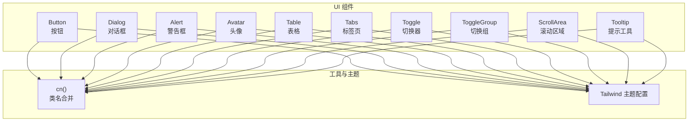

图表来源

- [button.tsx](file://src/components/ui/button.tsx#L1-L44)
- [dialog.tsx](file://src/components/ui/dialog.tsx#L1-L92)
- [alert.tsx](file://src/components/ui/alert.tsx#L1-L40)
- [avatar.tsx](file://src/components/ui/avatar.tsx#L1-L32)
- [table.tsx](file://src/components/ui/table.tsx#L1-L70)
- [tabs.tsx](file://src/components/ui/tabs.tsx#L1-L44)
- [toggle.tsx](file://src/components/ui/toggle.tsx#L1-L38)
- [toggle-group.tsx](file://src/components/ui/toggle-group.tsx#L1-L50)
- [scroll-area.tsx](file://src/components/ui/scroll-area.tsx#L1-L39)
- [tooltip.tsx](file://src/components/ui/tooltip.tsx#L1-L29)
- [ui.ts](file://src/utils/ui.ts#L1-L7)
- [tailwind.config.js](file://tailwind.config.js#L1-L78)

章节来源

- [tailwind.config.js](file://tailwind.config.js#L1-L78)

## 核心组件

本节概述各组件的核心职责与通用能力：

- 按钮 Button：提供多种语义变体（默认、破坏性、描边、次级、幽灵、链接）与尺寸（默认、小、大、图标），支持作为子节点渲染。
- 对话框 Dialog：基于 Radix UI 的可访问性原生实现，提供触发器、覆盖层、内容区、标题、描述与关闭按钮。
- 警告框 Alert：语义化警告容器，支持默认与破坏性两种变体。
- 头像 Avatar：头像根组件、图片与占位 fallback。
- 表格 Table：表格容器与表头/体/脚、行、单元格、标题、描述等子组件。
- 标签页 Tabs：列表、触发器与内容区，支持激活态样式。
- 切换器 Toggle：单个开关式控件，支持默认与描边两种变体及多尺寸。
- 切换组 ToggleGroup：上下文共享变体与尺寸，内部项继承或覆盖。
- 滚动区域 ScrollArea：提供可定制滚动条的滚动容器。
- 提示工具 Tooltip：基于 Provider/Root/Trigger/Content 的轻提示。

章节来源

- [button.tsx](file://src/components/ui/button.tsx#L1-L44)
- [dialog.tsx](file://src/components/ui/dialog.tsx#L1-L92)
- [alert.tsx](file://src/components/ui/alert.tsx#L1-L40)
- [avatar.tsx](file://src/components/ui/avatar.tsx#L1-L32)
- [table.tsx](file://src/components/ui/table.tsx#L1-L70)
- [tabs.tsx](file://src/components/ui/tabs.tsx#L1-L44)
- [toggle.tsx](file://src/components/ui/toggle.tsx#L1-L38)
- [toggle-group.tsx](file://src/components/ui/toggle-group.tsx#L1-L50)
- [scroll-area.tsx](file://src/components/ui/scroll-area.tsx#L1-L39)
- [tooltip.tsx](file://src/components/ui/tooltip.tsx#L1-L29)

## 架构总览

组件间通过以下方式协作：

- 类名合并：统一使用 cn() 合并样式，确保变体与用户传入类名正确叠加。
- 变体系统：使用 class-variance-authority 定义变体与默认值，保证一致的外观与交互状态。
- 可访问性：大量组件基于 Radix UI，天然具备无障碍语义与键盘导航。
- 主题系统：Tailwind 扩展颜色、动画、过渡与断点，满足深浅色模式与响应式需求。

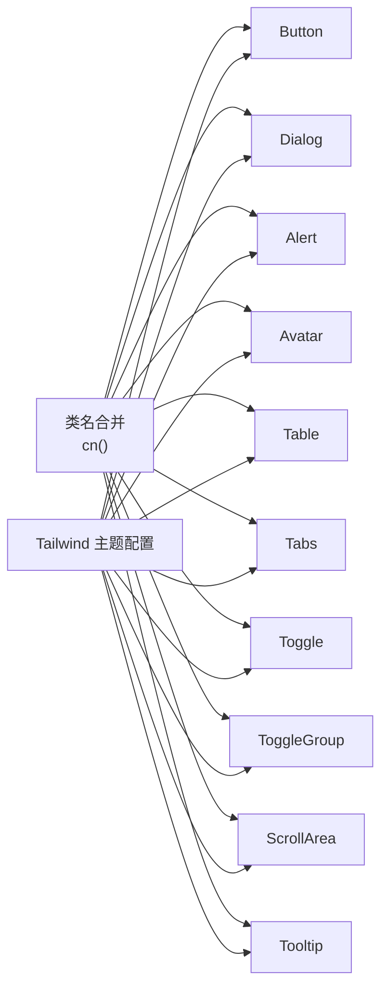

图表来源

- [ui.ts](file://src/utils/ui.ts#L1-L7)
- [tailwind.config.js](file://tailwind.config.js#L1-L78)
- [button.tsx](file://src/components/ui/button.tsx#L1-L44)
- [dialog.tsx](file://src/components/ui/dialog.tsx#L1-L92)
- [alert.tsx](file://src/components/ui/alert.tsx#L1-L40)
- [avatar.tsx](file://src/components/ui/avatar.tsx#L1-L32)
- [table.tsx](file://src/components/ui/table.tsx#L1-L70)
- [tabs.tsx](file://src/components/ui/tabs.tsx#L1-L44)
- [toggle.tsx](file://src/components/ui/toggle.tsx#L1-L38)
- [toggle-group.tsx](file://src/components/ui/toggle-group.tsx#L1-L50)
- [scroll-area.tsx](file://src/components/ui/scroll-area.tsx#L1-L39)
- [tooltip.tsx](file://src/components/ui/tooltip.tsx#L1-L29)

## 组件详解

### 按钮 Button

- 设计理念
  - 以变体与尺寸为核心配置，通过 cva 定义不同语义与大小的样式集合。
  - 支持 asChild 渲染为任意元素，提升组合灵活性。
- 属性与变体
  - 变体：default、destructive、outline、secondary、ghost、link
  - 尺寸：default、sm、lg、icon
  - 其他：className、disabled、asChild 等原生 button 属性透传
- 事件处理
  - 透传 onClick、onFocus、onBlur 等原生事件；支持受控禁用与透明禁用态。
- 可访问性与键盘导航
  - 使用 focus-visible 与 ring-offset 实现清晰焦点环；支持键盘激活。
- 视觉样式规范
  - 颜色：基于主题色板与深浅色模式；阴影、悬停透明度、圆角等由变体控制。
  - 字体：中等字号、适中字重；图标尺寸与内边距按尺寸统一。
  - 间距：内边距与高度随尺寸线性扩展。
- 性能与最佳实践
  - 优先使用变体与尺寸而非内联样式；避免重复计算类名。
  - 在复杂列表中复用 Button，减少不必要的包裹元素。

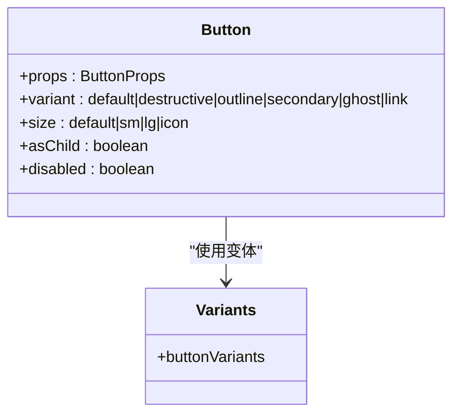

图表来源

- [button.tsx](file://src/components/ui/button.tsx#L1-L44)

章节来源

- [button.tsx](file://src/components/ui/button.tsx#L1-L44)

### 对话框 Dialog

- 设计理念
  - 基于 Radix UI 的可访问性原生实现，提供 Portal、Overlay、Content、Trigger、Close 等原子组件。
  - 内置开合动画与焦点管理，支持 ESC 关闭与点击遮罩关闭。
- 子组件与职责
  - Root、Trigger、Portal、Close、Overlay、Content、Header、Footer、Title、Description
- 事件处理
  - 通过 Trigger 触发打开；Close 或 Overlay 点击关闭；支持外部回调。
- 可访问性与键盘导航
  - 自动管理焦点；支持键盘 ESC 关闭；标题与描述提供语义化信息。
- 视觉样式规范
  - 遮罩背景与模糊效果；居中弹窗、圆角与阴影；关闭按钮语义化（含 sr-only 文本）。
- 性能与最佳实践
  - 将内容区包裹在 Portal 中，避免层级与溢出问题；仅在需要时渲染 Overlay。

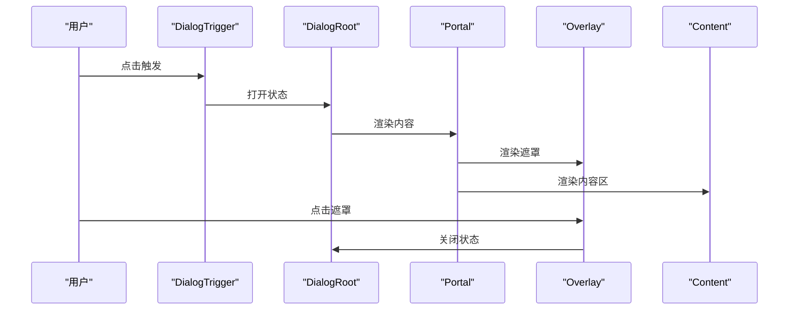

图表来源

- [dialog.tsx](file://src/components/ui/dialog.tsx#L1-L92)

章节来源

- [dialog.tsx](file://src/components/ui/dialog.tsx#L1-L92)

### 警告框 Alert

- 设计理念
  - 语义化警告容器，支持默认与破坏性两类，适合错误、提示、强调等场景。
- 子组件
  - Alert、AlertTitle、AlertDescription
- 可访问性
  - 容器使用 role="alert"，提升读屏可达性。
- 视觉样式规范
  - 边框、背景、文字颜色随变体变化；图标定位与留白由选择器控制。
- 最佳实践
  - 标题简明，描述补充细节；破坏性用于严重错误。

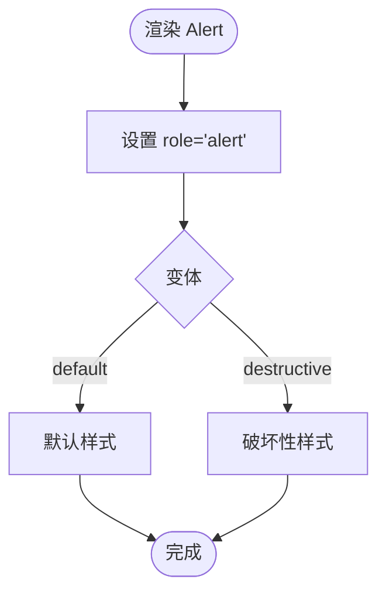

图表来源

- [alert.tsx](file://src/components/ui/alert.tsx#L1-L40)

章节来源

- [alert.tsx](file://src/components/ui/alert.tsx#L1-L40)

### 头像 Avatar

- 设计理念
  - 提供根容器、图片与 fallback 三部分，确保在网络异常或未加载时有可用占位。
- 子组件
  - Avatar、AvatarImage、AvatarFallback
- 视觉样式规范
  - 圆形裁剪、缩放填充、深浅色背景 fallback。
- 最佳实践
  - 为图片提供错误回退；在列表中保持统一尺寸。

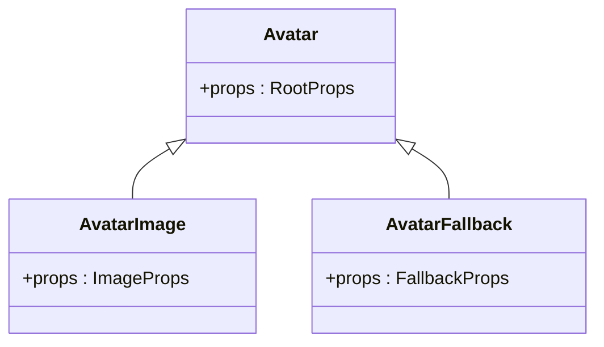

图表来源

- [avatar.tsx](file://src/components/ui/avatar.tsx#L1-L32)

章节来源

- [avatar.tsx](file://src/components/ui/avatar.tsx#L1-L32)

### 表格 Table

- 设计理念
  - 提供滚动容器与表格主体，统一行/列样式与悬停、选中态。
- 子组件
  - Table、TableHeader、TableBody、TableFooter、TableHead、TableRow、TableCell、TableCaption
- 视觉样式规范
  - 行边框、悬停与选中态颜色；表头文本颜色与对齐；单元格内边距。
- 最佳实践
  - 在大数据量场景使用 ScrollArea 包裹 Table；为可排序列提供语义化标记。

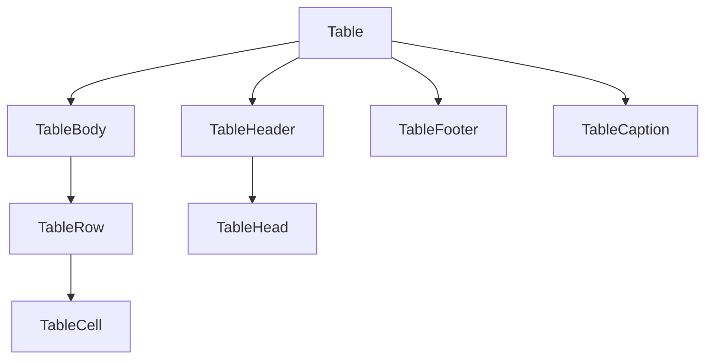

图表来源

- [table.tsx](file://src/components/ui/table.tsx#L1-L70)

章节来源

- [table.tsx](file://src/components/ui/table.tsx#L1-L70)

### 标签页 Tabs

- 设计理念
  - 列表容器 + 触发器 + 内容区，激活态自动高亮。
- 子组件
  - Tabs、TabsList、TabsTrigger、TabsContent
- 可访问性与键盘导航
  - 支持方向键在触发器间切换；Tab 切换到内容区。
- 视觉样式规范
  - 触发器激活态背景与文字颜色；深浅色模式下的对比度。
- 最佳实践
  - 为每个 Tab 设置明确的 aria-controls 与 aria-selected。

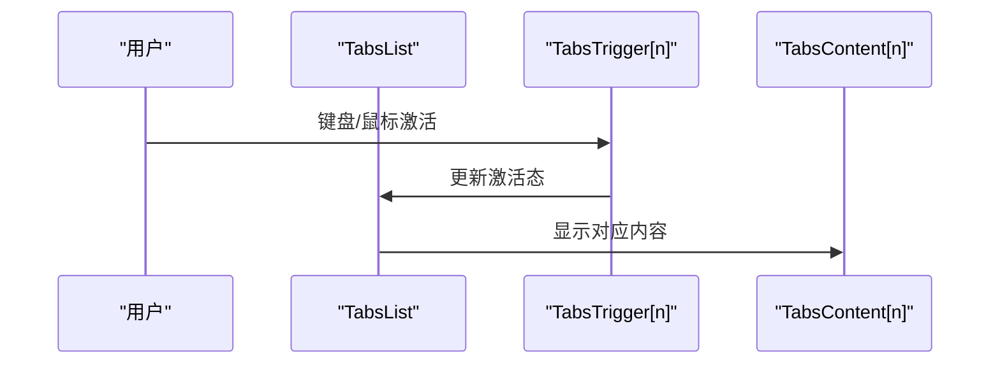

图表来源

- [tabs.tsx](file://src/components/ui/tabs.tsx#L1-L44)

章节来源

- [tabs.tsx](file://src/components/ui/tabs.tsx#L1-L44)

### 切换器 Toggle 与切换组 ToggleGroup

- 设计理念
  - 单个开关（Toggle）与一组互斥/非互斥开关（ToggleGroup）；支持默认与描边变体、多尺寸。
- 子组件与上下文
  - Toggle、ToggleGroup、ToggleGroupItem；ToggleGroup 通过 Context 共享变体与尺寸。
- 可访问性与键盘导航
  - 支持空格键切换；数据状态 on/on/off 用于样式映射。
- 视觉样式规范
  - 激活态背景与文字颜色；悬停与禁用态；描边变体边框与背景透明。
- 组合模式
  - ToggleGroupItem 可覆盖父级变体/尺寸；适合工具栏、过滤器等场景。

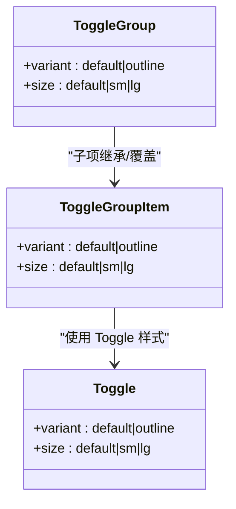

图表来源

- [toggle.tsx](file://src/components/ui/toggle.tsx#L1-L38)
- [toggle-group.tsx](file://src/components/ui/toggle-group.tsx#L1-L50)

章节来源

- [toggle.tsx](file://src/components/ui/toggle.tsx#L1-L38)
- [toggle-group.tsx](file://src/components/ui/toggle-group.tsx#L1-L50)

### 滚动区域 ScrollArea

- 设计理念
  - 提供可定制滚动条的滚动容器，支持水平/垂直滚动与角落装饰。
- 子组件
  - ScrollArea、ScrollBar（内部 Thumb）
- 视觉样式规范
  - 滚动条宽度、边距、颜色随深浅色模式；触摸友好。
- 最佳实践
  - 在固定高度容器中使用；避免滚动条遮挡内容。

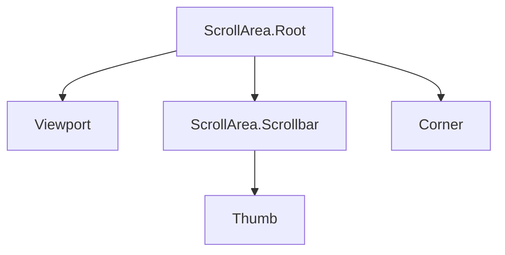

图表来源

- [scroll-area.tsx](file://src/components/ui/scroll-area.tsx#L1-L39)

章节来源

- [scroll-area.tsx](file://src/components/ui/scroll-area.tsx#L1-L39)

### 提示工具 Tooltip

- 设计理念
  - 基于 Provider/Root/Trigger/Content 的轻提示，支持延迟显示与多方向定位。
- 子组件
  - TooltipProvider、Tooltip、TooltipTrigger、TooltipContent
- 最佳实践
  - 为复杂图标或短文本提供简要说明；避免遮挡主要内容。

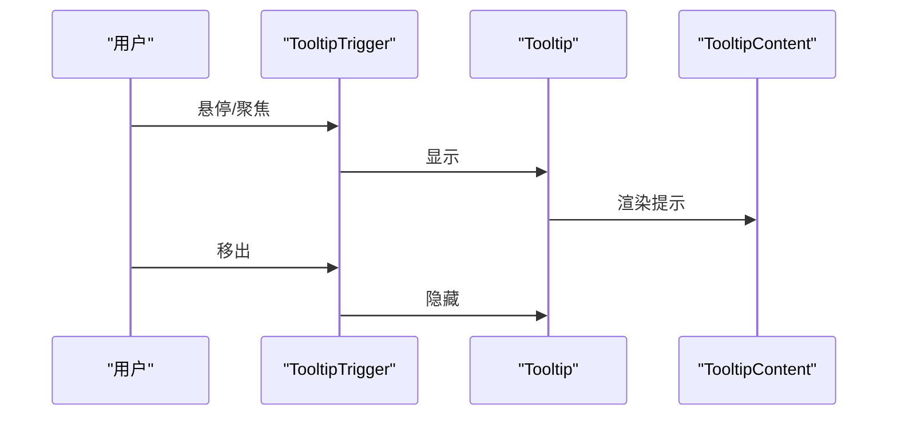

图表来源

- [tooltip.tsx](file://src/components/ui/tooltip.tsx#L1-L29)

章节来源

- [tooltip.tsx](file://src/components/ui/tooltip.tsx#L1-L29)

## 依赖关系分析

- 组件依赖
  - 所有组件均依赖 cn() 进行类名合并，确保样式一致性与可维护性。
  - 大量组件基于 Radix UI（Dialog、Avatar、Tabs、Toggle、Tooltip、ScrollArea），获得可访问性与键盘导航保障。
  - 变体系统统一使用 class-variance-authority，降低重复样式与提升可扩展性。
- 主题依赖
  - Tailwind 配置扩展颜色、动画、过渡与断点，组件样式与暗色模式通过 dark: 前缀生效。

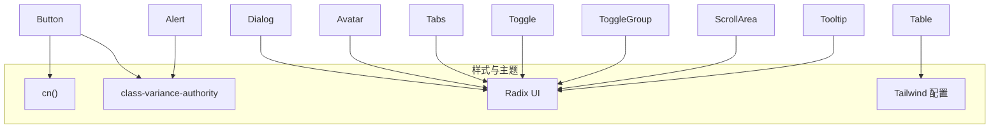

图表来源

- [ui.ts](file://src/utils/ui.ts#L1-L7)
- [button.tsx](file://src/components/ui/button.tsx#L1-L44)
- [dialog.tsx](file://src/components/ui/dialog.tsx#L1-L92)
- [alert.tsx](file://src/components/ui/alert.tsx#L1-L40)
- [avatar.tsx](file://src/components/ui/avatar.tsx#L1-L32)
- [table.tsx](file://src/components/ui/table.tsx#L1-L70)
- [tabs.tsx](file://src/components/ui/tabs.tsx#L1-L44)
- [toggle.tsx](file://src/components/ui/toggle.tsx#L1-L38)
- [toggle-group.tsx](file://src/components/ui/toggle-group.tsx#L1-L50)
- [scroll-area.tsx](file://src/components/ui/scroll-area.tsx#L1-L39)
- [tooltip.tsx](file://src/components/ui/tooltip.tsx#L1-L29)
- [tailwind.config.js](file://tailwind.config.js#L1-L78)

章节来源

- [tailwind.config.js](file://tailwind.config.js#L1-L78)

## 性能与可访问性

- 性能
  - 使用 cn() 合并类名，避免重复与冲突；变体与尺寸通过 cva 计算一次，减少运行时开销。
  - 将重型内容置于 Dialog/Tabs 的内容区，按需渲染；在表格场景使用 ScrollArea 减少重排。
  - ToggleGroup 通过 Context 共享配置，避免重复传递 props。
- 可访问性与键盘导航
  - 大多数组件基于 Radix UI，具备自动焦点管理、键盘导航与 ARIA 属性。
  - Alert 使用 role="alert"；Dialog 内部关闭按钮包含 sr-only 文本；Tabs 支持方向键与 Tab 导航。
- 视觉与交互
  - 深浅色模式通过 dark: 前缀与 Tailwind 配置实现；颜色系统围绕主题色扩展。
  - 动画与过渡由 Tailwind 插件与 Radix UI 动画配合，保证流畅体验。

[本节为通用指导，不直接分析具体文件]

## 故障排查指南

- 类名冲突
  - 症状：样式错乱或覆盖异常
  - 排查：确认是否正确使用 cn() 合并类名；检查 Tailwind 配置与暗色模式前缀
  - 参考
    - [ui.ts](file://src/utils/ui.ts#L1-L7)
    - [tailwind.config.js](file://tailwind.config.js#L1-L78)
- 对话框无法关闭
  - 症状：点击遮罩或按下 ESC 无效
  - 排查：确认 DialogRoot 状态管理；检查 Trigger/Close 是否正确绑定
  - 参考
    - [dialog.tsx](file://src/components/ui/dialog.tsx#L1-L92)
- 切换器样式不生效
  - 症状：激活态或禁用态不符合预期
  - 排查：确认 variant/size 传参；检查 ToggleGroup 上下文是否正确提供
  - 参考
    - [toggle.tsx](file://src/components/ui/toggle.tsx#L1-L38)
    - [toggle-group.tsx](file://src/components/ui/toggle-group.tsx#L1-L50)
- 表格滚动异常
  - 症状：滚动条不可见或遮挡内容
  - 排查：确认 ScrollArea 包裹 Table；检查容器高度与样式
  - 参考
    - [scroll-area.tsx](file://src/components/ui/scroll-area.tsx#L1-L39)
    - [table.tsx](file://src/components/ui/table.tsx#L1-L70)

章节来源

- [ui.ts](file://src/utils/ui.ts#L1-L7)
- [tailwind.config.js](file://tailwind.config.js#L1-L78)
- [dialog.tsx](file://src/components/ui/dialog.tsx#L1-L92)
- [toggle.tsx](file://src/components/ui/toggle.tsx#L1-L38)
- [toggle-group.tsx](file://src/components/ui/toggle-group.tsx#L1-L50)
- [scroll-area.tsx](file://src/components/ui/scroll-area.tsx#L1-L39)
- [table.tsx](file://src/components/ui/table.tsx#L1-L70)

## 结论

本套基础 UI 组件以 Radix UI 为可访问性基石，结合 class-variance-authority 的变体系统与 Tailwind 的主题扩展，形成了一套高内聚、低耦合、易组合且具备良好可访问性的组件体系。通过 cn() 统一类名合并、通过 cva 管理变体与尺寸、通过 Provider/Root/Trigger/Content 等模式实现清晰的组合关系，既满足日常开发需求，也为复杂交互提供了稳定基础。

[本节为总结性内容，不直接分析具体文件]

## 附录：使用示例与最佳实践

- 组合模式
  - 在卡片或列表项中使用 Button 作为触发器，配合 Dialog 展示详情。
  - 使用 Tabs 切换不同视图；在 TabsTrigger 上使用 Tooltip 提供简要说明。
  - 使用 ToggleGroup 构建过滤器工具栏，项之间共享变体与尺寸。
  - 使用 ScrollArea 包裹 Table，处理大数据量展示。
- 最佳实践
  - 优先使用组件提供的变体与尺寸，避免内联样式；必要时通过 className 扩展。
  - 为关键交互提供语义化标签与 aria 属性；确保键盘可达。
  - 控制动画与过渡时长，避免影响性能；在暗色模式下保持足够的对比度。
- 示例参考路径
  - 对话框与提示工具组合：[DictionaryWithoutCover.tsx](file://src/pages/Gallery-N/DictionaryWithoutCover.tsx#L32-L66)
  - 分享弹窗与按钮：[SharePicDialog.tsx](file://src/pages/Typing/components/ShareButton/SharePicDialog.tsx#L109-L130)
  - 切换器与表格：[toggle.tsx](file://src/components/ui/toggle.tsx#L1-L38)、[table.tsx](file://src/components/ui/table.tsx#L1-L70)

章节来源

- [dialog.tsx](file://src/components/ui/dialog.tsx#L1-L92)
- [tooltip.tsx](file://src/components/ui/tooltip.tsx#L1-L29)
- [toggle.tsx](file://src/components/ui/toggle.tsx#L1-L38)
- [table.tsx](file://src/components/ui/table.tsx#L1-L70)
- [DictionaryWithoutCover.tsx](file://src/pages/Gallery-N/DictionaryWithoutCover.tsx#L32-L66)
- [SharePicDialog.tsx](file://src/pages/Typing/components/ShareButton/SharePicDialog.tsx#L109-L130)
