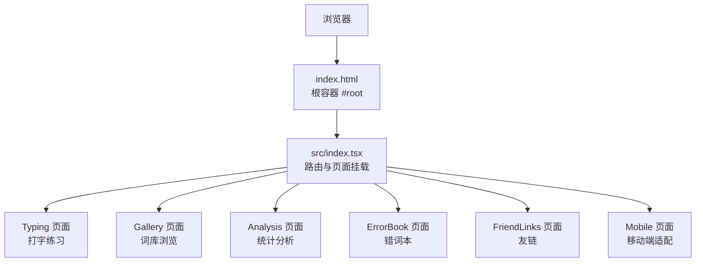
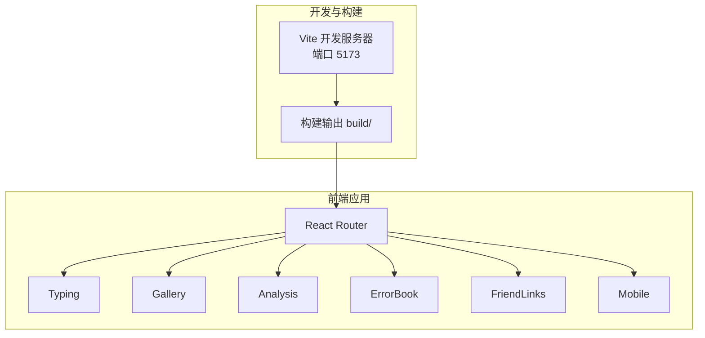
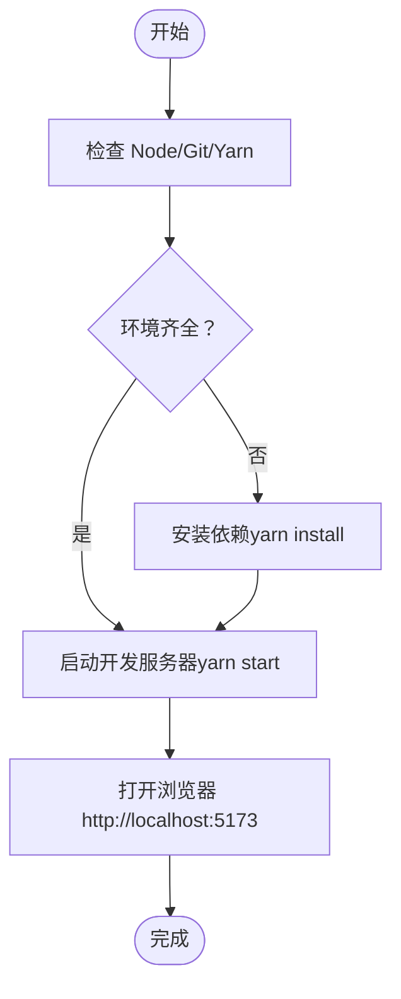

# 快速开始

<cite>
**本文引用的文件**
- [README.md](file://README.md)
- [package.json](file://package.json)
- [vite.config.ts](file://vite.config.ts)
- [index.html](file://index.html)
- [scripts/install.sh](file://scripts/install.sh)
- [scripts/install.ps1](file://scripts/install.ps1)
- [scripts/pre-check.sh](file://scripts/pre-check.sh)
- [scripts/pre-check.ps1](file://scripts/pre-check.ps1)
- [src/index.tsx](file://src/index.tsx)
</cite>

## 目录

1. [简介](#简介)
2. [项目结构](#项目结构)
3. [核心组件](#核心组件)
4. [架构总览](#架构总览)
5. [详细组件分析](#详细组件分析)
6. [依赖关系分析](#依赖关系分析)
7. [性能注意事项](#性能注意事项)
8. [故障排查指南](#故障排查指南)
9. [结论](#结论)
10. [附录](#附录)

## 简介

本指南面向首次接触 Qwerty Learner 的用户，帮助你在最短时间内完成环境准备、安装与启动，并了解项目的基本使用流程。项目基于 React/Vite 构建，提供在线访问入口与本地开发两种方式；同时提供 Windows/macOS 的一键安装脚本，便于快速上手。

## 项目结构

- 项目采用前端单页应用（SPA）架构，使用 Vite 作为开发服务器与打包工具，路由基于 React Router。
- 根目录包含启动脚本、构建配置、页面与组件源码、静态资源与词库等。
- 默认开发端口为 5173，可通过 Vite 配置调整。

图表来源

- [index.html](file://index.html#L195-L203)
- [src/index.tsx](file://src/index.tsx#L50-L74)

章节来源

- [README.md](file://README.md#L133-L190)
- [vite.config.ts](file://vite.config.ts#L13-L54)

## 核心组件

- 环境要求：Node.js、Git、Yarn
- 启动方式：手动安装与脚本安装两种路径
- 访问方式：默认本地地址 http://localhost:5173/
- 在线访问：提供多个部署入口，包括首选部署与 GitHub Pages

章节来源

- [README.md](file://README.md#L137-L190)
- [package.json](file://package.json#L60-L69)

## 架构总览

- 前端 SPA：React + Vite，按需加载页面组件，支持暗色主题切换与移动端适配。
- 构建产物：Vite 输出至 build 目录，生产构建关闭 console 与 debugger，启用最小化。
- 路由：BrowserRouter，支持首页、词库、分析、错词本、友链与移动端路由。

图表来源

- [vite.config.ts](file://vite.config.ts#L31-L42)
- [src/index.tsx](file://src/index.tsx#L52-L71)

章节来源

- [vite.config.ts](file://vite.config.ts#L13-L54)
- [src/index.tsx](file://src/index.tsx#L29-L74)

## 详细组件分析

### 环境准备与验证

- 验证命令（Windows/macOS 均可使用）：
  - node --version
  - git --version
  - yarn --version
- 自动检查脚本：
  - Windows：powershell 执行 scripts/pre-check.ps1
  - macOS：终端执行 scripts/pre-check.sh
- 官方安装来源：
  - Node.js：https://nodejs.org/en/download
  - Git：https://git-scm.com/downloads
  - Yarn：https://classic.yarnpkg.com/lang/en/docs/install

章节来源

- [README.md](file://README.md#L137-L164)
- [scripts/pre-check.ps1](file://scripts/pre-check.ps1#L1-L63)
- [scripts/pre-check.sh](file://scripts/pre-check.sh#L1-L47)

### 手动安装步骤

- 获取代码：使用 Git 克隆仓库到本地
- 安装依赖：在项目根目录执行 yarn install
- 启动项目：执行 yarn start
- 访问页面：在浏览器打开 http://localhost:5173/

章节来源

- [README.md](file://README.md#L165-L171)

### 脚本安装（Windows）

- 打开 PowerShell，定位到 scripts 目录
- 执行 .\install.ps1
- 若系统未安装 Node，脚本将尝试通过 winget 安装
- 安装完成后自动启动项目并在浏览器打开 http://localhost:5173/

章节来源

- [README.md](file://README.md#L172-L182)
- [scripts/install.ps1](file://scripts/install.ps1#L1-L39)

### 脚本安装（macOS）

- 打开终端，进入项目根目录
- 执行 scripts/install.sh
- 若系统未安装 Node，脚本将尝试通过 Homebrew 安装
- 安装完成后自动启动项目并在浏览器打开 http://localhost:5173/

章节来源

- [README.md](file://README.md#L183-L189)
- [scripts/install.sh](file://scripts/install.sh#L1-L28)

### 项目启动后的访问与基本使用

- 默认访问地址：http://localhost:5173/
- 首页为打字练习页面，支持选择词库、设置练习参数、开始练习
- 移动端设备会自动跳转到 /mobile 路由
- 其他可用路由：
  - /gallery：词库浏览
  - /analysis：统计分析
  - /error-book：错词本
  - /friend-links：友链
  - /mobile：移动端页面

章节来源

- [README.md](file://README.md#L169-L170)
- [src/index.tsx](file://src/index.tsx#L35-L48)
- [src/index.tsx](file://src/index.tsx#L52-L71)

## 依赖关系分析

- 依赖管理：使用 Yarn，脚本中默认使用淘宝镜像加速安装
- 构建与开发：Vite 作为开发服务器与打包工具，定义了 dev/start/build/test 等脚本
- 生产构建：输出目录 build，最小化与移除调试语句，启用可视化分析插件

图表来源

- [scripts/install.sh](file://scripts/install.sh#L14-L23)
- [scripts/install.ps1](file://scripts/install.ps1#L25-L38)
- [package.json](file://package.json#L60-L69)

章节来源

- [package.json](file://package.json#L60-L69)
- [vite.config.ts](file://vite.config.ts#L31-L42)

## 性能注意事项

- 生产构建会移除 console 与 debugger，减小包体并提升运行效率
- 开发模式下保留调试信息，便于本地调试
- 使用按需加载（React.lazy）减少首屏加载压力
- 建议使用现代浏览器以获得最佳体验

章节来源

- [vite.config.ts](file://vite.config.ts#L36-L42)
- [src/index.tsx](file://src/index.tsx#L18-L19)

## 故障排查指南

- 端口占用
  - 现象：启动失败或端口被占用
  - 处理：修改 Vite 配置中的端口或释放占用端口
- 依赖安装失败
  - 现象：yarn install 报错
  - 处理：更换网络环境或使用代理；若使用脚本，确保已正确安装 Node/包管理器
- 浏览器无法访问
  - 现象：打开 http://localhost:5173/ 无响应
  - 处理：确认开发服务器已启动；检查防火墙与杀毒软件拦截；尝试使用其他浏览器
- 路由刷新 404（部署场景）
  - 说明：本项目为 SPA，默认通过前端路由处理；若部署到静态站点，需配置回退规则
  - 参考：index.html 中已包含 GitHub Pages 的 SPA 回退脚本
- Windows 特定问题
  - 现象：winget 无法安装 Node
  - 处理：升级系统版本或手动安装 Node；确保 PowerShell 具备执行策略权限
- macOS 特定问题
  - 现象：Homebrew 未安装导致脚本中断
  - 处理：先安装 Homebrew，再执行脚本

章节来源

- [README.md](file://README.md#L172-L189)
- [scripts/install.ps1](file://scripts/install.ps1#L17-L24)
- [scripts/install.sh](file://scripts/install.sh#L7-L11)
- [index.html](file://index.html#L17-L39)

## 结论

通过本指南，你可以快速完成环境准备、安装与启动，并在本地或在线环境中开始使用 Qwerty Learner。若遇到问题，可参考故障排查章节逐项排除。建议优先使用一键脚本以降低环境差异带来的风险，并在遇到网络问题时切换为手动安装路径。

## 附录

- 在线访问入口（参考 README）
  - 首选部署：https://qwerty.kaiyi.cool/
  - GitHub Pages：https://realkai42.github.io/qwerty-learner/
- 项目脚本与配置
  - Windows：scripts/install.ps1、scripts/pre-check.ps1
  - macOS：scripts/install.sh、scripts/pre-check.sh
  - 构建与开发：package.json 中的 scripts 字段
  - 开发服务器与构建：vite.config.ts

章节来源

- [README.md](file://README.md#L33-L41)
- [package.json](file://package.json#L60-L69)
- [vite.config.ts](file://vite.config.ts#L13-L54)
