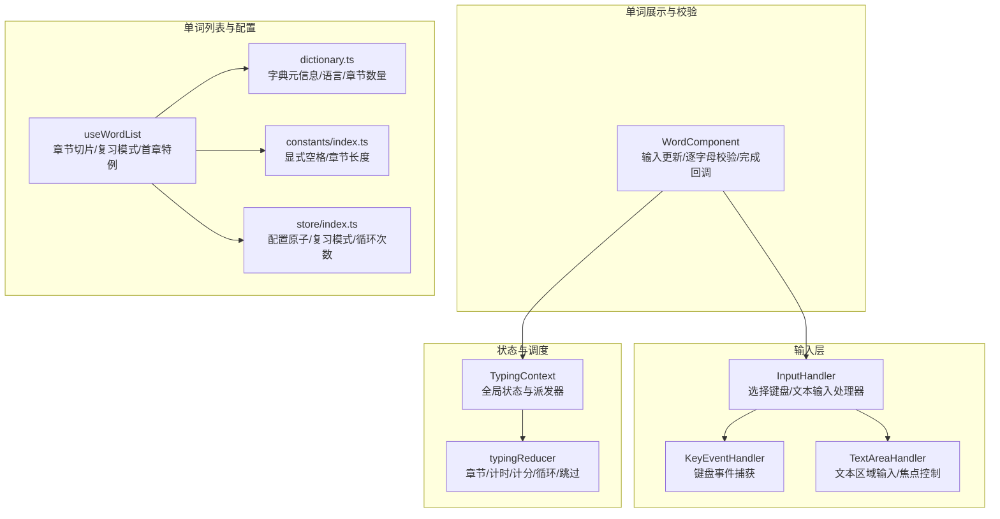
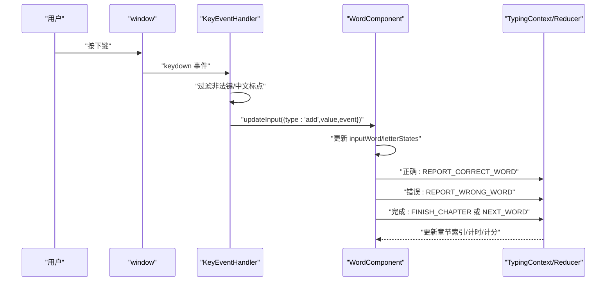
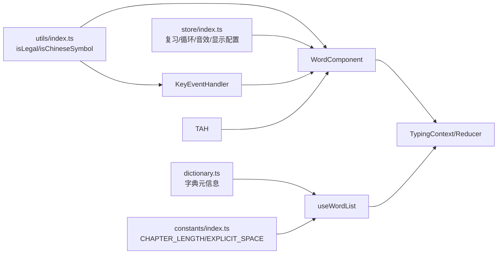

# 单词输入处理

<cite>
**本文引用的文件**
- [src/pages/Typing/components/WordPanel/index.tsx](file://src/pages/Typing/components/WordPanel/index.tsx)
- [src/pages/Typing/components/WordPanel/components/InputHandler/index.tsx](file://src/pages/Typing/components/WordPanel/components/InputHandler/index.tsx)
- [src/pages/Typing/components/WordPanel/components/KeyEventHandler/index.tsx](file://src/pages/Typing/components/WordPanel/components/KeyEventHandler/index.tsx)
- [src/pages/Typing/components/WordPanel/components/TextAreaHandler/index.tsx](file://src/pages/Typing/components/WordPanel/components/TextAreaHandler/index.tsx)
- [src/pages/Typing/components/WordPanel/components/Word/index.tsx](file://src/pages/Typing/components/WordPanel/components/Word/index.tsx)
- [src/pages/Typing/store/index.ts](file://src/pages/Typing/store/index.ts)
- [src/pages/Typing/hooks/useWordList.ts](file://src/pages/Typing/hooks/useWordList.ts)
- [src/pages/Typing/store/type.ts](file://src/pages/Typing/store/type.ts)
- [src/utils/index.ts](file://src/utils/index.ts)
- [src/utils/wordListFetcher.ts](file://src/utils/wordListFetcher.ts)
- [src/store/index.ts](file://src/store/index.ts)
- [src/resources/dictionary.ts](file://src/resources/dictionary.ts)
- [src/constants/index.ts](file://src/constants/index.ts)
- [src/typings/index.ts](file://src/typings/index.ts)
</cite>

## 目录

1. [简介](#简介)
2. [项目结构](#项目结构)
3. [核心组件](#核心组件)
4. [架构总览](#架构总览)
5. [详细组件分析](#详细组件分析)
6. [依赖关系分析](#依赖关系分析)
7. [性能考虑](#性能考虑)
8. [故障排查指南](#故障排查指南)
9. [结论](#结论)
10. [附录](#附录)

## 简介

本文件面向“单词输入处理”模块，系统化梳理从键盘事件捕获、字符验证、输入状态管理到文本区域处理、单词列表生成与管理、复习模式与章节选择等全流程机制。文档同时覆盖输入验证规则、错误处理策略、性能优化建议，并提供可操作的扩展指引，帮助开发者快速理解并高效迭代该模块。

## 项目结构

单词输入处理位于 Typing 页面的“单词面板”子树中，围绕输入处理器、单词渲染与状态机展开；单词列表由钩子与字典资源共同驱动，章节与复习模式通过全局状态与配置原子进行控制。

图表来源

- [src/pages/Typing/components/WordPanel/components/InputHandler/index.tsx](file://src/pages/Typing/components/WordPanel/components/InputHandler/index.tsx#L1-L46)
- [src/pages/Typing/components/WordPanel/components/KeyEventHandler/index.tsx](file://src/pages/Typing/components/WordPanel/components/KeyEventHandler/index.tsx#L1-L36)
- [src/pages/Typing/components/WordPanel/components/TextAreaHandler/index.tsx](file://src/pages/Typing/components/WordPanel/components/TextAreaHandler/index.tsx#L1-L53)
- [src/pages/Typing/components/WordPanel/components/Word/index.tsx](file://src/pages/Typing/components/WordPanel/components/Word/index.tsx#L1-L319)
- [src/pages/Typing/store/index.ts](file://src/pages/Typing/store/index.ts#L1-L227)
- [src/pages/Typing/hooks/useWordList.ts](file://src/pages/Typing/hooks/useWordList.ts#L1-L91)
- [src/resources/dictionary.ts](file://src/resources/dictionary.ts#L1-L120)
- [src/store/index.ts](file://src/store/index.ts#L1-L118)
- [src/constants/index.ts](file://src/constants/index.ts#L1-L19)

章节来源

- [src/pages/Typing/components/WordPanel/index.tsx](file://src/pages/Typing/components/WordPanel/index.tsx#L1-L190)
- [src/pages/Typing/components/WordPanel/components/InputHandler/index.tsx](file://src/pages/Typing/components/WordPanel/components/InputHandler/index.tsx#L1-L46)
- [src/pages/Typing/components/WordPanel/components/KeyEventHandler/index.tsx](file://src/pages/Typing/components/WordPanel/components/KeyEventHandler/index.tsx#L1-L36)
- [src/pages/Typing/components/WordPanel/components/TextAreaHandler/index.tsx](file://src/pages/Typing/components/WordPanel/components/TextAreaHandler/index.tsx#L1-L53)
- [src/pages/Typing/components/WordPanel/components/Word/index.tsx](file://src/pages/Typing/components/WordPanel/components/Word/index.tsx#L1-L319)
- [src/pages/Typing/store/index.ts](file://src/pages/Typing/store/index.ts#L1-L227)
- [src/pages/Typing/hooks/useWordList.ts](file://src/pages/Typing/hooks/useWordList.ts#L1-L91)
- [src/utils/index.ts](file://src/utils/index.ts#L1-L130)
- [src/utils/wordListFetcher.ts](file://src/utils/wordListFetcher.ts#L1-L10)
- [src/store/index.ts](file://src/store/index.ts#L1-L118)
- [src/resources/dictionary.ts](file://src/resources/dictionary.ts#L1-L120)
- [src/constants/index.ts](file://src/constants/index.ts#L1-L19)
- [src/typings/index.ts](file://src/typings/index.ts#L1-L51)

## 核心组件

- 输入处理器选择器：根据当前字典语言动态选择键盘事件处理器或文本区域处理器。
- 键盘事件处理器：在 Typing 全局开启时监听 window 的 keydown，过滤非法按键与中文标点，向单词组件回传增量输入。
- 文本区域处理器：聚焦/失焦控制、Composition 输入法提示、onInput 同步清空输入框，避免重复输入。
- 单词组件：维护输入字符串、逐字母状态、计时与错误统计；完成时持久化记录并触发下一词/下一章。
- Typing 状态机：统一管理章节数据、计时/准确率/WPM、是否打字中、是否完成、循环单词、跳过开关等。
- 单词列表钩子：基于字典 URL 加载 JSON，按章节切片；支持复习模式与首章特例；兜底翻译数组。
- 字典与配置：字典资源含语言类别、章节总数；全局配置含复习模式、循环次数、音效、音标显示等。

章节来源

- [src/pages/Typing/components/WordPanel/components/InputHandler/index.tsx](file://src/pages/Typing/components/WordPanel/components/InputHandler/index.tsx#L1-L46)
- [src/pages/Typing/components/WordPanel/components/KeyEventHandler/index.tsx](file://src/pages/Typing/components/WordPanel/components/KeyEventHandler/index.tsx#L1-L36)
- [src/pages/Typing/components/WordPanel/components/TextAreaHandler/index.tsx](file://src/pages/Typing/components/WordPanel/components/TextAreaHandler/index.tsx#L1-L53)
- [src/pages/Typing/components/WordPanel/components/Word/index.tsx](file://src/pages/Typing/components/WordPanel/components/Word/index.tsx#L1-L319)
- [src/pages/Typing/store/index.ts](file://src/pages/Typing/store/index.ts#L1-L227)
- [src/pages/Typing/hooks/useWordList.ts](file://src/pages/Typing/hooks/useWordList.ts#L1-L91)
- [src/resources/dictionary.ts](file://src/resources/dictionary.ts#L1-L120)
- [src/store/index.ts](file://src/store/index.ts#L1-L118)
- [src/constants/index.ts](file://src/constants/index.ts#L1-L19)

## 架构总览

下面的序列图展示一次典型输入流程：用户按键 → 键盘事件处理器过滤 → 更新单词输入状态 → 逐字母校验 → 正确/错误分支 → 状态机推进 → 下一词/下一章。

图表来源

- [src/pages/Typing/components/WordPanel/components/KeyEventHandler/index.tsx](file://src/pages/Typing/components/WordPanel/components/KeyEventHandler/index.tsx#L1-L36)
- [src/pages/Typing/components/WordPanel/components/Word/index.tsx](file://src/pages/Typing/components/WordPanel/components/Word/index.tsx#L1-L319)
- [src/pages/Typing/store/index.ts](file://src/pages/Typing/store/index.ts#L1-L227)

## 详细组件分析

### 输入处理器与事件捕获

- 输入处理器选择逻辑：依据当前字典语言选择键盘或文本输入处理器，确保不同语言输入法与字符集得到适配。
- 键盘事件捕获：仅在 Typing 开启时注册监听；过滤功能键、方向键、音量键等；禁止组合键（Alt/Ctrl/Meta）触发；检测中文标点提示关闭输入法。
- 文本区域处理器：自动聚焦/失焦；onInput 仅在非 Composition 时生效；清空输入框避免重复提交；Composition 开始时提示关闭输入法。

章节来源

- [src/pages/Typing/components/WordPanel/components/InputHandler/index.tsx](file://src/pages/Typing/components/WordPanel/components/InputHandler/index.tsx#L1-L46)
- [src/pages/Typing/components/WordPanel/components/KeyEventHandler/index.tsx](file://src/pages/Typing/components/WordPanel/components/KeyEventHandler/index.tsx#L1-L36)
- [src/pages/Typing/components/WordPanel/components/TextAreaHandler/index.tsx](file://src/pages/Typing/components/WordPanel/components/TextAreaHandler/index.tsx#L1-L53)
- [src/utils/index.ts](file://src/utils/index.ts#L1-L130)

### 文本区域处理与焦点控制

- 多行输入支持：文本区域采用绝对定位与不可见样式，避免影响布局；通过 isTyping 控制聚焦/失焦。
- 光标位置管理：通过受控 value 清空实现“光标回到起点”的视觉效果；实际输入内容由单词组件内部状态维护。
- 输入框焦点控制：当 Typing 关闭时强制 blur，防止后台输入干扰；开启时主动 focus。

章节来源

- [src/pages/Typing/components/WordPanel/components/TextAreaHandler/index.tsx](file://src/pages/Typing/components/WordPanel/components/TextAreaHandler/index.tsx#L1-L53)

### 单词列表生成与管理

- 数据源：通过字典 URL 使用 fetch 获取 JSON，解析为 Word 数组。
- 章节切片：每章固定长度（常量），按当前章节起止切片；若章节越界则重置为 0。
- 首章特例：针对特定字典与章节组合提供内置首章数据。
- 复习模式：从 reviewRecord 中取词，优先级高于正常章节切片。
- 翻译兜底：确保 trans 为字符串数组，避免类型异常。

章节来源

- [src/pages/Typing/hooks/useWordList.ts](file://src/pages/Typing/hooks/useWordList.ts#L1-L91)
- [src/utils/wordListFetcher.ts](file://src/utils/wordListFetcher.ts#L1-L10)
- [src/resources/dictionary.ts](file://src/resources/dictionary.ts#L1-L120)
- [src/constants/index.ts](file://src/constants/index.ts#L1-L19)

### 输入验证规则与错误处理

- 验证规则：
  - 过滤非法键：功能键、方向键、音量键、Home/PageUp 等。
  - 中文标点检测：若检测到中文标点，提示关闭输入法。
  - 大小写忽略：可通过配置切换大小写敏感。
  - 组合键屏蔽：Alt/Ctrl/Meta 组合键不计入输入。
- 错误处理：
  - 逐字母比较：正确则累加正确计数与时间戳，错误则记录错字与位置。
  - 错误阈值：达到一定错误次数后允许跳过下一词。
  - 完成检测：输入长度等于目标长度即完成，播放提示音并保存记录。
  - 重置策略：错误后短暂延迟重置输入与状态，避免闪烁。

章节来源

- [src/utils/index.ts](file://src/utils/index.ts#L1-L130)
- [src/pages/Typing/components/WordPanel/components/Word/index.tsx](file://src/pages/Typing/components/WordPanel/components/Word/index.tsx#L1-L319)

### 输入状态管理与推进

- 状态机职责：初始化章节、设置初始索引、洗牌/顺序、计时/准确率/WPM、循环单词、跳过、下一章/完成等。
- 行为细节：
  - SETUP_CHAPTER：复制初始状态、可选洗牌、初始化用户输入日志。
  - NEXT_WORD/LOOP_CURRENT_WORD/FINISH_CHAPTER：推进索引、累计计数、更新完成态。
  - TICK_TIMER：按时间增量更新计时、准确率、WPM。
  - 报告正确/错误：合并逐字母错误记录，更新章节统计。

章节来源

- [src/pages/Typing/store/index.ts](file://src/pages/Typing/store/index.ts#L1-L227)
- [src/pages/Typing/store/type.ts](file://src/pages/Typing/store/type.ts#L1-L55)

### 参数对输入处理的影响

- 语言与输入法：字典语言决定使用键盘事件或文本区域处理器；文本区域处理器对 Composition 输入法进行提示。
- 复习模式：useWordList 优先从 reviewRecord 取词，影响输入词序列与进度。
- 章节选择：currentChapter 与 CHAPTER_LENGTH 决定切片范围；越界自动回退至首章。
- 循环配置：loopWordConfig 控制单词循环次数，影响“完成当前单词”后的推进逻辑。
- 显示与交互：isIgnoreCase、isShowAnswerOnHover、wordDictationConfig 影响字母可见性与 Tab 提示。

章节来源

- [src/pages/Typing/components/WordPanel/index.tsx](file://src/pages/Typing/components/WordPanel/index.tsx#L1-L190)
- [src/pages/Typing/hooks/useWordList.ts](file://src/pages/Typing/hooks/useWordList.ts#L1-L91)
- [src/store/index.ts](file://src/store/index.ts#L1-L118)
- [src/constants/index.ts](file://src/constants/index.ts#L1-L19)
- [src/typings/index.ts](file://src/typings/index.ts#L1-L51)

## 依赖关系分析

- 输入层依赖 TypingContext 传递的 isTyping 与 dispatch；WordComponent 通过 updateInput 将增量输入回传给输入处理器。
- 输入处理器依赖字典语言选择器；键盘处理器依赖工具函数进行键位合法性判断与中文标点检测。
- 单词列表依赖字典资源与章节常量；useWordList 依赖 SWR 与 fetch 工具；复习模式依赖 reviewRecord。
- 全局配置通过 Jotai 原子提供，贯穿输入、显示与行为控制。

图表来源

- [src/utils/index.ts](file://src/utils/index.ts#L1-L130)
- [src/pages/Typing/components/WordPanel/components/KeyEventHandler/index.tsx](file://src/pages/Typing/components/WordPanel/components/KeyEventHandler/index.tsx#L1-L36)
- [src/pages/Typing/components/WordPanel/components/Word/index.tsx](file://src/pages/Typing/components/WordPanel/components/Word/index.tsx#L1-L319)
- [src/pages/Typing/hooks/useWordList.ts](file://src/pages/Typing/hooks/useWordList.ts#L1-L91)
- [src/resources/dictionary.ts](file://src/resources/dictionary.ts#L1-L120)
- [src/constants/index.ts](file://src/constants/index.ts#L1-L19)
- [src/store/index.ts](file://src/store/index.ts#L1-L118)

章节来源

- [src/pages/Typing/components/WordPanel/components/Word/index.tsx](file://src/pages/Typing/components/WordPanel/components/Word/index.tsx#L1-L319)
- [src/pages/Typing/store/index.ts](file://src/pages/Typing/store/index.ts#L1-L227)
- [src/pages/Typing/hooks/useWordList.ts](file://src/pages/Typing/hooks/useWordList.ts#L1-L91)
- [src/utils/index.ts](file://src/utils/index.ts#L1-L130)

## 性能考虑

- 事件监听按需注册：仅在 isTyping 为真时绑定 keydown，减少无关事件开销。
- 受控输入框清空：onInput 后立即清空 textarea，避免 DOM 重排与重复提交。
- 状态更新局部化：useImmer 与结构化克隆仅更新必要字段，降低渲染压力。
- 计时与统计：TICK_TIMER 按增量更新，避免高频重算；准确率与 WPM 基于累计值计算。
- 数据加载：useSWR 缓存字典 JSON；章节切片与首章特例减少运行时计算。
- 配置持久化：Jotai 原子本地存储，避免每次重渲染重建配置。

章节来源

- [src/pages/Typing/components/WordPanel/components/KeyEventHandler/index.tsx](file://src/pages/Typing/components/WordPanel/components/KeyEventHandler/index.tsx#L1-L36)
- [src/pages/Typing/components/WordPanel/components/TextAreaHandler/index.tsx](file://src/pages/Typing/components/WordPanel/components/TextAreaHandler/index.tsx#L1-L53)
- [src/pages/Typing/components/WordPanel/components/Word/index.tsx](file://src/pages/Typing/components/WordPanel/components/Word/index.tsx#L1-L319)
- [src/pages/Typing/store/index.ts](file://src/pages/Typing/store/index.ts#L1-L227)
- [src/pages/Typing/hooks/useWordList.ts](file://src/pages/Typing/hooks/useWordList.ts#L1-L91)

## 故障排查指南

- 输入法导致的误判
  - 现象：输入中文标点或 Composition 期间误触发。
  - 处理：键盘处理器检测中文标点并提示关闭输入法；文本区域处理器在 Composition 开始时提示。
- 键盘无效按键
  - 现象：方向键、功能键、音量键被识别为输入。
  - 处理：使用工具函数过滤非法键；组合键 Alt/Ctrl/Meta 屏蔽。
- 输入框无法聚焦
  - 现象：Typing 关闭后仍尝试聚焦。
  - 处理：根据 isTyping 切换 focus/blur；首次输入时自动 focus。
- 复习模式未生效
  - 现象：章节切片覆盖了 reviewRecord。
  - 处理：确认 isReviewMode 与 reviewRecord 是否存在；useWordList 优先使用 reviewRecord。
- 首章特例未出现
  - 现象：期望的内置首章数据未加载。
  - 处理：核对字典 ID 与章节条件；检查 isFirstChapter 分支逻辑。
- 错误过多导致跳过
  - 现象：错误次数达到阈值后自动显示跳过。
  - 处理：查看 wordState.wrongCount 与 SET_IS_SKIP 分发逻辑。

章节来源

- [src/utils/index.ts](file://src/utils/index.ts#L1-L130)
- [src/pages/Typing/components/WordPanel/components/KeyEventHandler/index.tsx](file://src/pages/Typing/components/WordPanel/components/KeyEventHandler/index.tsx#L1-L36)
- [src/pages/Typing/components/WordPanel/components/TextAreaHandler/index.tsx](file://src/pages/Typing/components/WordPanel/components/TextAreaHandler/index.tsx#L1-L53)
- [src/pages/Typing/hooks/useWordList.ts](file://src/pages/Typing/hooks/useWordList.ts#L1-L91)
- [src/pages/Typing/components/WordPanel/components/Word/index.tsx](file://src/pages/Typing/components/WordPanel/components/Word/index.tsx#L1-L319)

## 结论

该模块通过“输入处理器选择器 + 事件过滤 + 单词组件校验 + 状态机推进”的清晰分层，实现了跨语言、多输入法、多显示配置下的稳定输入体验。结合字典与章节切片、复习模式与循环配置，形成可扩展的练习体系。建议在后续迭代中进一步完善 Composition API 支持、错误统计的可视化与导出能力，以及更细粒度的性能监控与埋点。

## 附录

- 使用场景示例路径
  - 键盘输入流程：[src/pages/Typing/components/WordPanel/components/KeyEventHandler/index.tsx](file://src/pages/Typing/components/WordPanel/components/KeyEventHandler/index.tsx#L1-L36)
  - 文本区域输入与焦点：[src/pages/Typing/components/WordPanel/components/TextAreaHandler/index.tsx](file://src/pages/Typing/components/WordPanel/components/TextAreaHandler/index.tsx#L1-L53)
  - 单词输入与校验：[src/pages/Typing/components/WordPanel/components/Word/index.tsx](file://src/pages/Typing/components/WordPanel/components/Word/index.tsx#L1-L319)
  - 章节与循环推进：[src/pages/Typing/store/index.ts](file://src/pages/Typing/store/index.ts#L1-L227)
  - 单词列表加载与切片：[src/pages/Typing/hooks/useWordList.ts](file://src/pages/Typing/hooks/useWordList.ts#L1-L91)
  - 字典元信息与语言：[src/resources/dictionary.ts](file://src/resources/dictionary.ts#L1-L120), [src/typings/index.ts](file://src/typings/index.ts#L1-L51)
