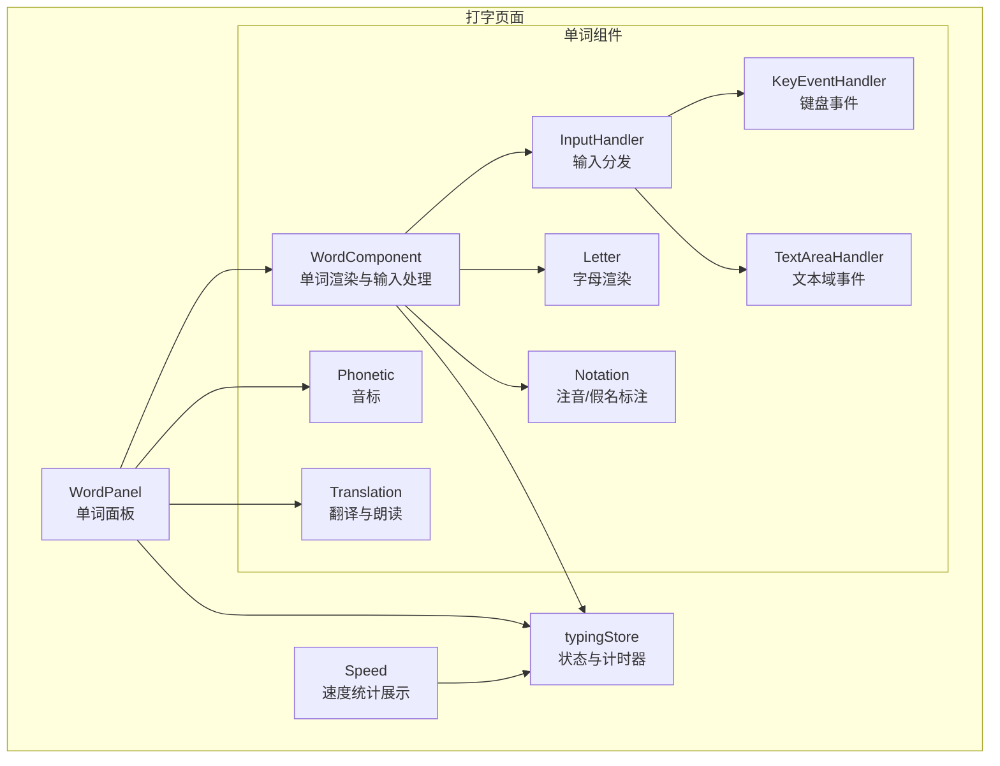
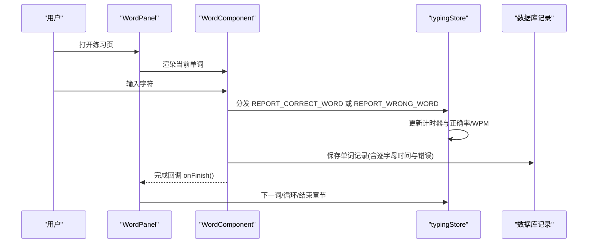
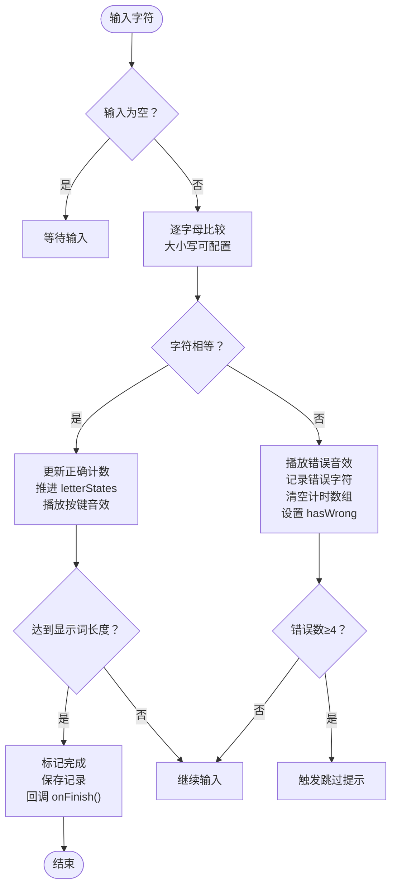
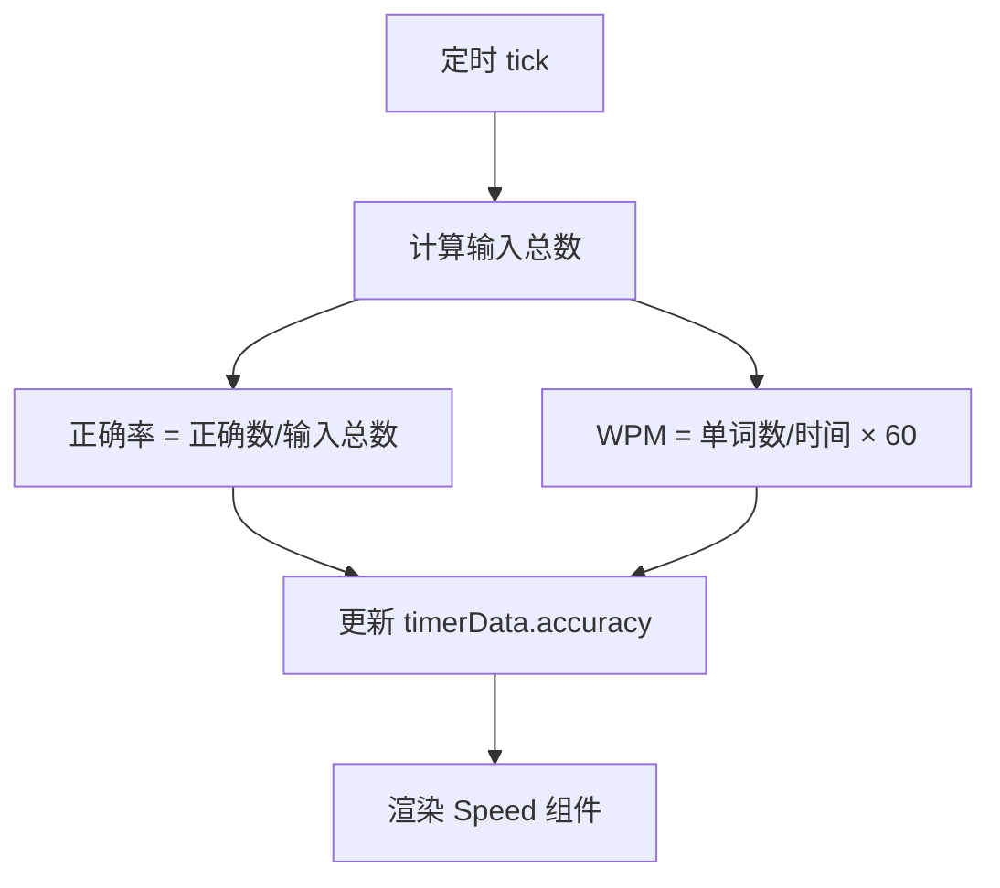
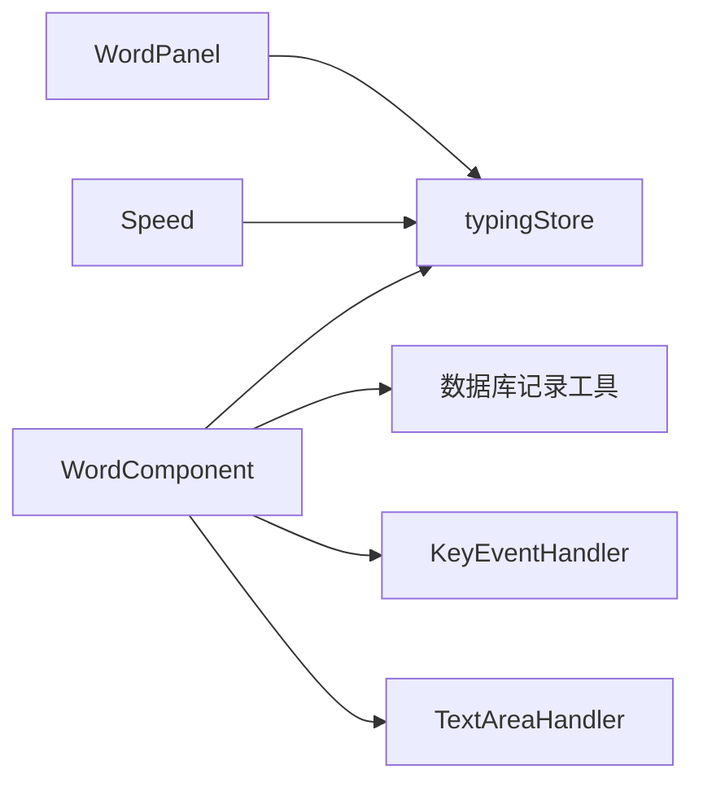

# 实时反馈系统

<cite>
**本文引用的文件**
- [src/pages/Typing/components/WordPanel/index.tsx](file://src/pages/Typing/components/WordPanel/index.tsx)
- [src/pages/Typing/components/WordPanel/components/Word/index.tsx](file://src/pages/Typing/components/WordPanel/components/Word/index.tsx)
- [src/pages/Typing/components/WordPanel/components/Word/index.module.css](file://src/pages/Typing/components/WordPanel/components/Word/index.module.css)
- [src/pages/Typing/components/WordPanel/components/Word/Letter.tsx](file://src/pages/Typing/components/WordPanel/components/Word/Letter.tsx)
- [src/pages/Typing/components/WordPanel/components/Word/Notation.tsx](file://src/pages/Typing/components/WordPanel/components/Word/Notation.tsx)
- [src/pages/Typing/components/WordPanel/components/Phonetic/index.tsx](file://src/pages/Typing/components/WordPanel/components/Phonetic/index.tsx)
- [src/pages/Typing/components/WordPanel/components/Translation/index.tsx](file://src/pages/Typing/components/WordPanel/components/Translation/index.tsx)
- [src/pages/Typing/components/WordPanel/components/InputHandler/index.tsx](file://src/pages/Typing/components/WordPanel/components/InputHandler/index.tsx)
- [src/pages/Typing/components/WordPanel/components/KeyEventHandler/index.tsx](file://src/pages/Typing/components/WordPanel/components/KeyEventHandler/index.tsx)
- [src/pages/Typing/components/WordPanel/components/TextAreaHandler/index.tsx](file://src/pages/Typing/components/WordPanel/components/TextAreaHandler/index.tsx)
- [src/pages/Typing/store/index.ts](file://src/pages/Typing/store/index.ts)
- [src/pages/Typing/store/type.ts](file://src/pages/Typing/store/type.ts)
- [src/pages/Typing/hooks/useWordList.ts](file://src/pages/Typing/hooks/useWordList.ts)
- [src/utils/db/record.ts](file://src/utils/db/record.ts)
- [src/pages/Typing/components/Speed/index.tsx](file://src/pages/Typing/components/Speed/index.tsx)
</cite>

## 目录

1. [简介](#简介)
2. [项目结构](#项目结构)
3. [核心组件](#核心组件)
4. [架构总览](#架构总览)
5. [详细组件分析](#详细组件分析)
6. [依赖关系分析](#依赖关系分析)
7. [性能考虑](#性能考虑)
8. [故障排查指南](#故障排查指南)
9. [结论](#结论)
10. [附录](#附录)

## 简介

本文件面向“实时反馈系统”的功能与实现，聚焦单词面板组件的设计与渲染、实时反馈机制（正确率、速度、错误检测）的算法实现、状态管理在不同场景下的行为、以及用户界面的动态反馈（高亮、颜色、动画）。同时给出性能优化、内存管理与用户体验设计的技术考量，并提供可操作的调试方法与实现示例路径。

## 项目结构

该系统围绕“打字练习页面”展开，单词面板作为核心交互区域，承载单词渲染、音标展示、翻译呈现、输入处理与实时反馈统计。状态管理采用上下文与原子化状态组合，配合计时器与章节数据驱动全局指标更新。

图表来源

- [src/pages/Typing/components/WordPanel/index.tsx](file://src/pages/Typing/components/WordPanel/index.tsx#L1-L190)
- [src/pages/Typing/components/WordPanel/components/Word/index.tsx](file://src/pages/Typing/components/WordPanel/components/Word/index.tsx#L1-L319)
- [src/pages/Typing/components/WordPanel/components/InputHandler/index.tsx](file://src/pages/Typing/components/WordPanel/components/InputHandler/index.tsx#L1-L46)
- [src/pages/Typing/components/WordPanel/components/KeyEventHandler/index.tsx](file://src/pages/Typing/components/WordPanel/components/KeyEventHandler/index.tsx#L1-L37)
- [src/pages/Typing/components/WordPanel/components/TextAreaHandler/index.tsx](file://src/pages/Typing/components/WordPanel/components/TextAreaHandler/index.tsx#L1-L54)
- [src/pages/Typing/components/WordPanel/components/Word/Letter.tsx](file://src/pages/Typing/components/WordPanel/components/Word/Letter.tsx#L1-L42)
- [src/pages/Typing/components/WordPanel/components/Word/Notation.tsx](file://src/pages/Typing/components/WordPanel/components/Word/Notation.tsx#L1-L81)
- [src/pages/Typing/components/WordPanel/components/Phonetic/index.tsx](file://src/pages/Typing/components/WordPanel/components/Phonetic/index.tsx#L1-L26)
- [src/pages/Typing/components/WordPanel/components/Translation/index.tsx](file://src/pages/Typing/components/WordPanel/components/Translation/index.tsx#L1-L45)
- [src/pages/Typing/store/index.ts](file://src/pages/Typing/store/index.ts#L1-L227)
- [src/pages/Typing/components/Speed/index.tsx](file://src/pages/Typing/components/Speed/index.tsx#L1-L24)

章节来源

- [src/pages/Typing/components/WordPanel/index.tsx](file://src/pages/Typing/components/WordPanel/index.tsx#L1-L190)
- [src/pages/Typing/store/index.ts](file://src/pages/Typing/store/index.ts#L1-L227)

## 核心组件

- 单词面板：负责组织单词、音标、翻译、前后词预览与进度条，并协调完成回调与跳词。
- 单词组件：维护输入状态、逐字母校验、错误统计、发音图标与提示告警，完成后持久化记录并触发章节流转。
- 输入处理：根据语言类型选择键盘事件或文本域事件，统一通过动作分发给单词组件。
- 状态管理：章节数据、计时器、正确/错误计数、是否完成/跳过等状态集中管理与计算。
- 统计展示：时间、输入数、WPM、正确数、正确率等指标实时更新。

章节来源

- [src/pages/Typing/components/WordPanel/index.tsx](file://src/pages/Typing/components/WordPanel/index.tsx#L1-L190)
- [src/pages/Typing/components/WordPanel/components/Word/index.tsx](file://src/pages/Typing/components/WordPanel/components/Word/index.tsx#L1-L319)
- [src/pages/Typing/store/index.ts](file://src/pages/Typing/store/index.ts#L1-L227)
- [src/pages/Typing/components/Speed/index.tsx](file://src/pages/Typing/components/Speed/index.tsx#L1-L24)

## 架构总览

系统采用“组件-状态-算法”三层协作：

- 组件层：渲染单词、音标、翻译、输入框与统计卡片。
- 状态层：TypingContext + Jotai 原子，集中管理章节、计时、正确/错误数与可见性。
- 算法层：逐字母比较、错误聚合、WPM/正确率计算、循环与章节切换。

图表来源

- [src/pages/Typing/components/WordPanel/index.tsx](file://src/pages/Typing/components/WordPanel/index.tsx#L54-L91)
- [src/pages/Typing/components/WordPanel/components/Word/index.tsx](file://src/pages/Typing/components/WordPanel/components/Word/index.tsx#L180-L236)
- [src/pages/Typing/store/index.ts](file://src/pages/Typing/store/index.ts#L114-L203)
- [src/utils/db/record.ts](file://src/utils/db/record.ts#L1-L186)

## 详细组件分析

### 单词面板（WordPanel）

职责与流程

- 获取当前/下一单词、章节索引与循环配置。
- 处理完成回调：支持单词循环与章节推进；在复习模式下同步复习记录。
- 提供“上一个/下一个”跳词热键与“显示/隐藏翻译”热键。
- 条件渲染音标与翻译，控制进度条透明度。

关键点

- 使用预取接口提前加载下一词发音资源，降低首帧延迟。
- 复习模式下写入 reviewRecord 的 index 与完成标记。
- 通过 key 强制重载单词组件，确保输入状态重置。

章节来源

- [src/pages/Typing/components/WordPanel/index.tsx](file://src/pages/Typing/components/WordPanel/index.tsx#L1-L190)

### 单词组件（WordComponent）

职责与流程

- 初始化单词状态：显示词、字母状态数组、起始时间、随机隐藏标记。
- 输入处理：区分空格与普通字符，追加到输入缓冲。
- 逐字母校验：大小写可配置；正确时推进 letterStates 并播放按键音效；错误时记录错误字符、清空计时数组并播放错误音效。
- 完成条件：输入长度达到显示词长度且全部正确，设置完成标志，保存记录并回调 onFinish。
- 错误阈值：累计错误 ≥4 时触发“跳过”提示，辅助学习节奏控制。
- 字母可见性：根据“听写模式”（隐藏元音/辅音/随机）与悬停显示答案进行动态控制。

渲染细节

- 字母渲染组件根据状态应用不同颜色类名。
- 支持日文/平假名/片假名注音（Notation）。
- 发音图标支持快捷键播放与首次输入自动播放。

图表来源

- [src/pages/Typing/components/WordPanel/components/Word/index.tsx](file://src/pages/Typing/components/WordPanel/components/Word/index.tsx#L170-L236)
- [src/pages/Typing/components/WordPanel/components/Word/Letter.tsx](file://src/pages/Typing/components/WordPanel/components/Word/Letter.tsx#L1-L42)

章节来源

- [src/pages/Typing/components/WordPanel/components/Word/index.tsx](file://src/pages/Typing/components/WordPanel/components/Word/index.tsx#L1-L319)
- [src/pages/Typing/components/WordPanel/components/Word/Letter.tsx](file://src/pages/Typing/components/WordPanel/components/Word/Letter.tsx#L1-L42)
- [src/pages/Typing/components/WordPanel/components/Word/Notation.tsx](file://src/pages/Typing/components/WordPanel/components/Word/Notation.tsx#L1-L81)
- [src/pages/Typing/components/WordPanel/components/Word/index.module.css](file://src/pages/Typing/components/WordPanel/components/Word/index.module.css#L1-L45)

### 输入处理器（InputHandler/KeyEventHandler/TextAreaHandler）

职责与流程

- 根据词典语言类型选择输入方式：英文/德文/罗马音走键盘事件，代码类走文本域事件。
- 键盘事件过滤中文符号与修饰键，仅接受合法字符。
- 文本域事件在输入后清空，避免 DOM 累积内容；焦点随 isTyping 切换。

章节来源

- [src/pages/Typing/components/WordPanel/components/InputHandler/index.tsx](file://src/pages/Typing/components/WordPanel/components/InputHandler/index.tsx#L1-L46)
- [src/pages/Typing/components/WordPanel/components/KeyEventHandler/index.tsx](file://src/pages/Typing/components/WordPanel/components/KeyEventHandler/index.tsx#L1-L37)
- [src/pages/Typing/components/WordPanel/components/TextAreaHandler/index.tsx](file://src/pages/Typing/components/WordPanel/components/TextAreaHandler/index.tsx#L1-L54)

### 音标与翻译组件

- 音标：根据配置显示美式/英式音标，支持文本选择。
- 翻译：支持悬停显示/隐藏；可选朗读释义，带音量控制与播放状态指示。

章节来源

- [src/pages/Typing/components/WordPanel/components/Phonetic/index.tsx](file://src/pages/Typing/components/WordPanel/components/Phonetic/index.tsx#L1-L26)
- [src/pages/Typing/components/WordPanel/components/Translation/index.tsx](file://src/pages/Typing/components/WordPanel/components/Translation/index.tsx#L1-L45)

### 状态管理与实时反馈算法

状态模型

- 章节数据：words、index、wordCount、correctCount、wrongCount、userInputLogs、wordRecordIds。
- 计时器数据：time、accuracy、wpm。
- 控制标志：isTyping、isFinished、isShowSkip、isTransVisible、isLoopSingleWord、isSavingRecord。

算法要点

- 正确率：基于章节累计正确/错误计数计算百分比。
- 速度（WPM）：基于 wordCount 与 time 计算，分钟换算。
- 计时器：每 tick 增加时间，同时刷新 accuracy 与 wpm。
- 错误聚合：将逐字母错误合并到当前单词的日志中，便于后续分析。

图表来源

- [src/pages/Typing/store/index.ts](file://src/pages/Typing/store/index.ts#L191-L203)
- [src/pages/Typing/components/Speed/index.tsx](file://src/pages/Typing/components/Speed/index.tsx#L1-L24)

章节来源

- [src/pages/Typing/store/index.ts](file://src/pages/Typing/store/index.ts#L1-L227)
- [src/pages/Typing/store/type.ts](file://src/pages/Typing/store/type.ts#L1-L55)
- [src/pages/Typing/components/Speed/index.tsx](file://src/pages/Typing/components/Speed/index.tsx#L1-L24)

### 数据持久化与复习记录

- 单词记录：保存单词、时间序列、错误次数与逐字母错误集合。
- 章节记录：汇总时间、正确/错误数、单词数、正确单词索引与 wordRecordIds。
- 复习记录：在复习模式下维护当前索引、是否完成与单词列表。

章节来源

- [src/utils/db/record.ts](file://src/utils/db/record.ts#L1-L186)
- [src/pages/Typing/components/WordPanel/index.tsx](file://src/pages/Typing/components/WordPanel/index.tsx#L44-L52)

## 依赖关系分析

- 组件耦合
  - WordPanel 依赖 typingStore 与 Jotai 原子，协调章节与可见性。
  - WordComponent 依赖 typingStore、Jotai 原子、音效钩子与数据库保存函数。
  - InputHandler 依赖词典语言信息，动态选择键盘或文本域处理器。
- 状态耦合
  - typingReducer 将动作映射到状态变更，计时器与统计计算集中在 reducer 中。
- 外部依赖
  - 音频与语音合成：音效与翻译朗读。
  - 数据持久化：本地存储或后端接口（通过工具函数抽象）。

图表来源

- [src/pages/Typing/components/WordPanel/components/Word/index.tsx](file://src/pages/Typing/components/WordPanel/components/Word/index.tsx#L1-L319)
- [src/pages/Typing/store/index.ts](file://src/pages/Typing/store/index.ts#L1-L227)
- [src/pages/Typing/components/Speed/index.tsx](file://src/pages/Typing/components/Speed/index.tsx#L1-L24)

章节来源

- [src/pages/Typing/components/WordPanel/index.tsx](file://src/pages/Typing/components/WordPanel/index.tsx#L1-L190)
- [src/pages/Typing/components/WordPanel/components/Word/index.tsx](file://src/pages/Typing/components/WordPanel/components/Word/index.tsx#L1-L319)
- [src/pages/Typing/store/index.ts](file://src/pages/Typing/store/index.ts#L1-L227)

## 性能考虑

- 渲染优化
  - 使用 useImmer 管理局部状态，减少不必要的对象重建。
  - 字母渲染组件使用 memo 化，避免重复渲染。
  - 通过 key 强制重载单词组件，确保输入状态重置，避免跨词状态泄漏。
- 计算优化
  - 计时器与统计在 reducer 中集中计算，避免在渲染阶段做重型运算。
  - 预取下一词发音资源，降低首帧等待。
- 内存管理
  - 错误数组与时间数组按需增长，注意在完成或重置时清理。
  - 合并逐字母错误时使用不可变合并策略，避免深层拷贝。
- 用户体验
  - 错误阈值触发跳过提示，避免长时间卡顿。
  - 发音图标与翻译朗读可配置，兼顾无障碍与专注模式。

章节来源

- [src/pages/Typing/components/WordPanel/components/Word/index.tsx](file://src/pages/Typing/components/WordPanel/components/Word/index.tsx#L1-L319)
- [src/pages/Typing/components/WordPanel/components/Word/Letter.tsx](file://src/pages/Typing/components/WordPanel/components/Word/Letter.tsx#L1-L42)
- [src/pages/Typing/components/WordPanel/index.tsx](file://src/pages/Typing/components/WordPanel/index.tsx#L1-L190)

## 故障排查指南

- 输入无响应
  - 检查 isTyping 标志是否为 true，键盘事件监听是否生效。
  - 确认语言类型选择正确，英文/德文/罗马音应使用键盘事件处理器。
- 错误提示闪烁或无法清除
  - 检查 hasWrong 状态与重置定时器逻辑，确认 300ms 清理流程执行。
- 正确率/WPM 不更新
  - 确认定时 tick 是否触发，章节数据的 correctCount/wrongCount/wordCount 是否递增。
- 复习模式进度异常
  - 检查 reviewRecord 的 index 与 isFinished 字段是否按预期更新。
- 音频/朗读问题
  - 检查浏览器语音合成可用性与音量配置，确认发音图标点击事件绑定。

章节来源

- [src/pages/Typing/components/WordPanel/components/KeyEventHandler/index.tsx](file://src/pages/Typing/components/WordPanel/components/KeyEventHandler/index.tsx#L1-L37)
- [src/pages/Typing/components/WordPanel/components/TextAreaHandler/index.tsx](file://src/pages/Typing/components/WordPanel/components/TextAreaHandler/index.tsx#L1-L54)
- [src/pages/Typing/store/index.ts](file://src/pages/Typing/store/index.ts#L191-L203)
- [src/pages/Typing/components/WordPanel/index.tsx](file://src/pages/Typing/components/WordPanel/index.tsx#L44-L52)

## 结论

该实时反馈系统通过清晰的组件边界与集中状态管理，实现了从输入到渲染、从统计到持久化的闭环。单词面板承担了视觉与交互的核心职责，typingStore 提供稳定的计算与状态更新，结合预取与渲染优化，在保证用户体验的同时具备良好的扩展性。建议后续进一步完善逐字母错误可视化、复习算法与导出能力，以提升学习效果追踪与个性化训练。

## 附录

- 实现示例路径
  - 单词面板主入口：[src/pages/Typing/components/WordPanel/index.tsx](file://src/pages/Typing/components/WordPanel/index.tsx#L1-L190)
  - 单词组件与输入处理：[src/pages/Typing/components/WordPanel/components/Word/index.tsx](file://src/pages/Typing/components/WordPanel/components/Word/index.tsx#L1-L319)
  - 输入处理器选择逻辑：[src/pages/Typing/components/WordPanel/components/InputHandler/index.tsx](file://src/pages/Typing/components/WordPanel/components/InputHandler/index.tsx#L1-L46)
  - 状态与计时器算法：[src/pages/Typing/store/index.ts](file://src/pages/Typing/store/index.ts#L114-L203)
  - 速度统计展示：[src/pages/Typing/components/Speed/index.tsx](file://src/pages/Typing/components/Speed/index.tsx#L1-L24)
  - 数据持久化模型：[src/utils/db/record.ts](file://src/utils/db/record.ts#L1-L186)
  - 词汇列表与章节切片：[src/pages/Typing/hooks/useWordList.ts](file://src/pages/Typing/hooks/useWordList.ts#L1-L91)
