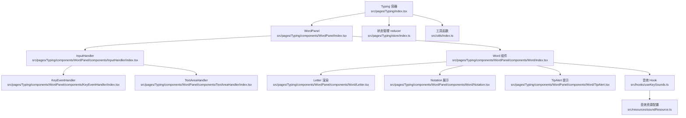
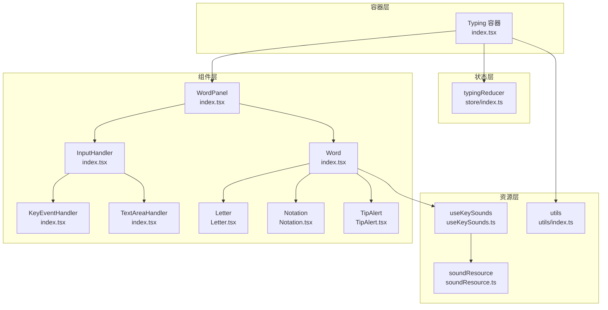
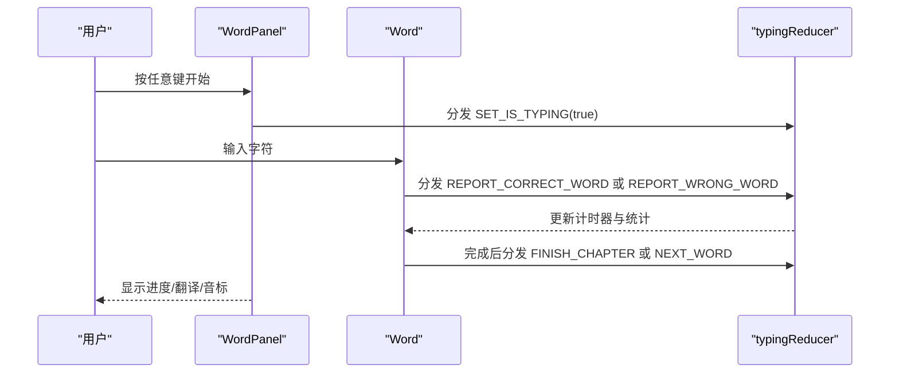
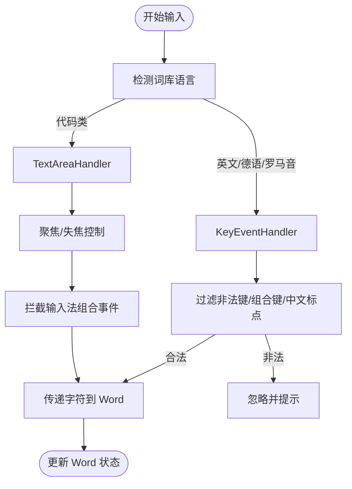
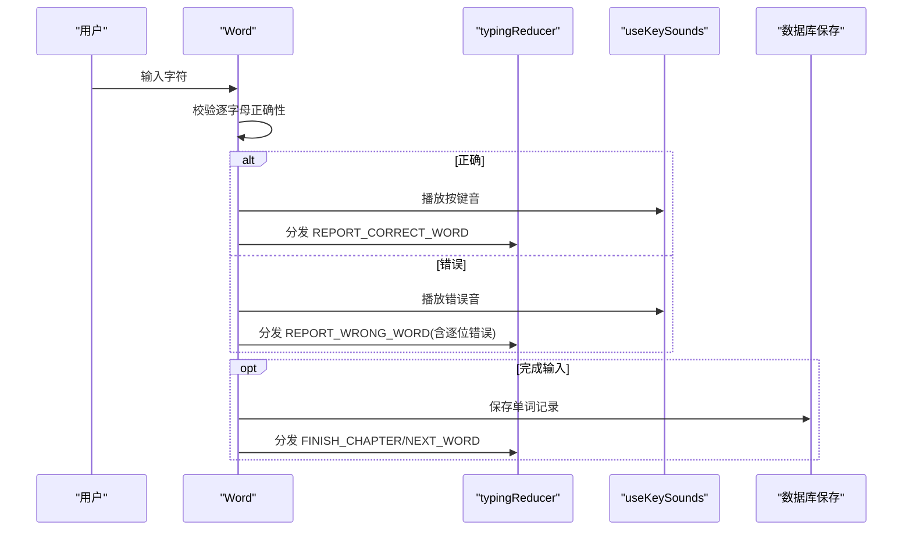
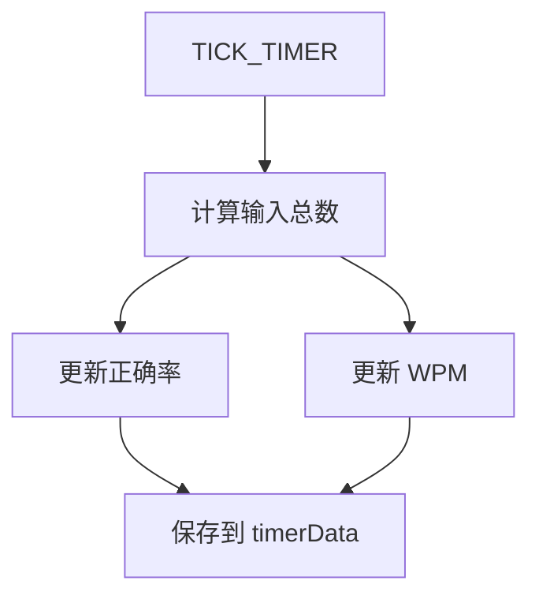
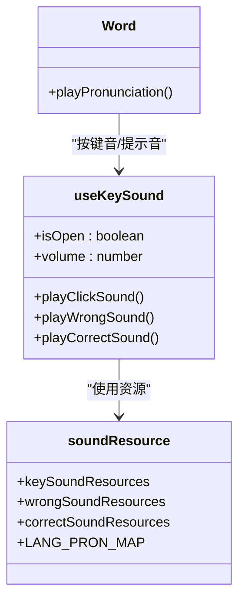
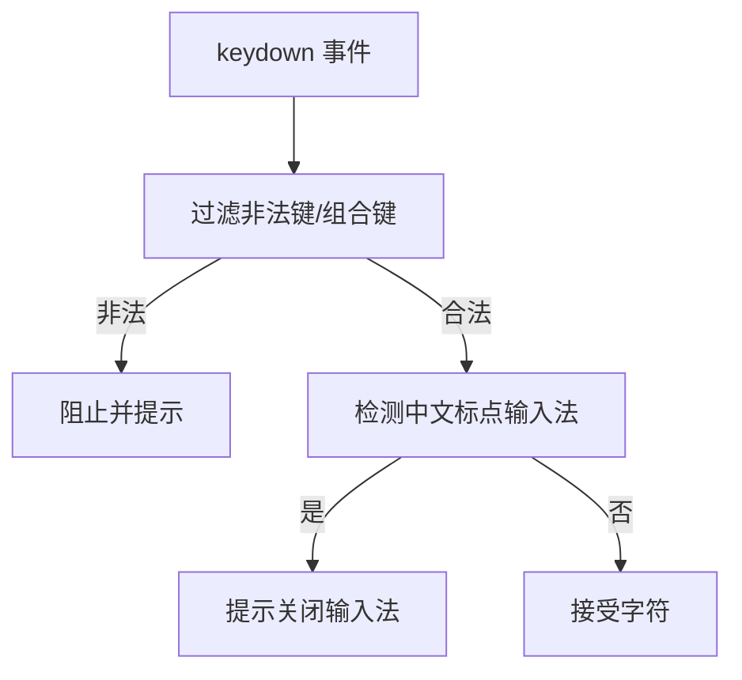
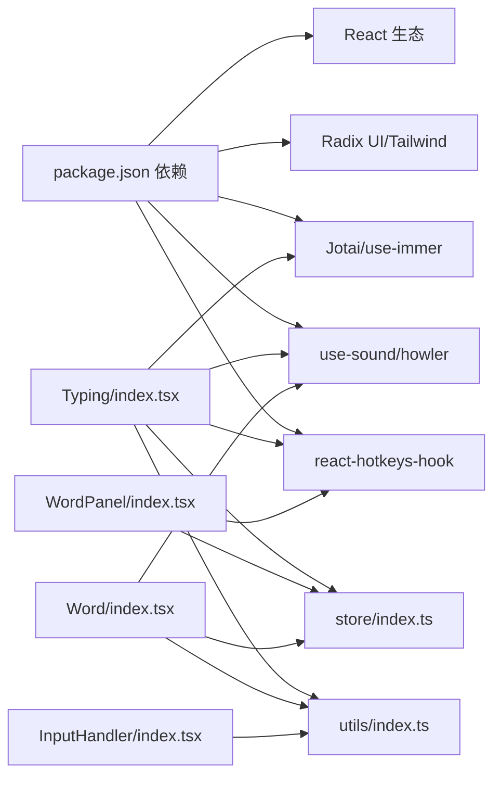

# 打字练习系统

<cite>
**本文引用的文件**
- [README.md](file://README.md)
- [package.json](file://package.json)
- [src/pages/Typing/index.tsx](file://src/pages/Typing/index.tsx)
- [src/pages/Typing/store/index.ts](file://src/pages/Typing/store/index.ts)
- [src/pages/Typing/components/WordPanel/index.tsx](file://src/pages/Typing/components/WordPanel/index.tsx)
- [src/pages/Typing/components/WordPanel/components/InputHandler/index.tsx](file://src/pages/Typing/components/WordPanel/components/InputHandler/index.tsx)
- [src/pages/Typing/components/WordPanel/components/KeyEventHandler/index.tsx](file://src/pages/Typing/components/WordPanel/components/KeyEventHandler/index.tsx)
- [src/pages/Typing/components/WordPanel/components/TextAreaHandler/index.tsx](file://src/pages/Typing/components/WordPanel/components/TextAreaHandler/index.tsx)
- [src/pages/Typing/components/WordPanel/components/Word/index.tsx](file://src/pages/Typing/components/WordPanel/components/Word/index.tsx)
- [src/pages/Typing/components/WordPanel/components/Word/Letter.tsx](file://src/pages/Typing/components/WordPanel/components/Word/Letter.tsx)
- [src/pages/Typing/components/WordPanel/components/Word/Notation.tsx](file://src/pages/Typing/components/WordPanel/components/Word/Notation.tsx)
- [src/pages/Typing/components/WordPanel/components/Word/TipAlert.tsx](file://src/pages/Typing/components/WordPanel/components/Word/TipAlert.tsx)
- [src/hooks/useKeySounds.ts](file://src/hooks/useKeySounds.ts)
- [src/resources/soundResource.ts](file://src/resources/soundResource.ts)
- [src/utils/index.ts](file://src/utils/index.ts)
</cite>

## 目录

1. [简介](#简介)
2. [项目结构](#项目结构)
3. [核心组件](#核心组件)
4. [架构总览](#架构总览)
5. [详细组件分析](#详细组件分析)
6. [依赖关系分析](#依赖关系分析)
7. [性能考虑](#性能考虑)
8. [故障排查指南](#故障排查指南)
9. [结论](#结论)
10. [附录](#附录)

## 简介

本系统面向键盘工作者，结合“单词记忆”与“键盘肌肉记忆”训练，提供可配置的词库、音标与发音、默写模式、速度与正确率统计、音效反馈与发音播放等功能。练习流程从选择词库章节开始，进入打字界面后，用户逐词输入，系统实时反馈正确性、速度与正确率，并在完成后汇总结果。

本功能文档聚焦于核心练习功能：单词输入处理、实时反馈系统、速度统计与正确率计算、单词面板组件设计与交互、输入处理器工作机制、音效反馈与发音实现、键盘事件处理、文本区域处理、输入验证等关键技术细节，并给出用户交互流程、状态变化与性能优化策略。

**章节来源**

- [README.md](file://README.md#L83-L120)

## 项目结构

Typing 页面由顶层容器负责全局状态与生命周期控制，WordPanel 作为核心展示与交互单元，内部包含输入处理器、键盘事件处理、文本区域处理、单词渲染与字母状态管理、音标与翻译展示、发音图标等子组件。状态通过 useImmerReducer 的 typingReducer 统一管理，计时器与统计在 reducer 中更新，音效通过 useKeySound Hook 管理，发音资源通过 soundResource 配置。

**图表来源**

- [src/pages/Typing/index.tsx](file://src/pages/Typing/index.tsx#L1-L174)
- [src/pages/Typing/components/WordPanel/index.tsx](file://src/pages/Typing/components/WordPanel/index.tsx#L1-L190)
- [src/pages/Typing/components/WordPanel/components/InputHandler/index.tsx](file://src/pages/Typing/components/WordPanel/components/InputHandler/index.tsx#L1-L46)
- [src/pages/Typing/components/WordPanel/components/KeyEventHandler/index.tsx](file://src/pages/Typing/components/WordPanel/components/KeyEventHandler/index.tsx#L1-L37)
- [src/pages/Typing/components/WordPanel/components/TextAreaHandler/index.tsx](file://src/pages/Typing/components/WordPanel/components/TextAreaHandler/index.tsx#L1-L54)
- [src/pages/Typing/components/WordPanel/components/Word/index.tsx](file://src/pages/Typing/components/WordPanel/components/Word/index.tsx#L1-L319)
- [src/pages/Typing/components/WordPanel/components/Word/Letter.tsx](file://src/pages/Typing/components/WordPanel/components/Word/Letter.tsx#L1-L42)
- [src/pages/Typing/components/WordPanel/components/Word/Notation.tsx](file://src/pages/Typing/components/WordPanel/components/Word/Notation.tsx#L1-L81)
- [src/pages/Typing/components/WordPanel/components/Word/TipAlert.tsx](file://src/pages/Typing/components/WordPanel/components/Word/TipAlert.tsx#L1-L31)
- [src/hooks/useKeySounds.ts](file://src/hooks/useKeySounds.ts#L1-L51)
- [src/resources/soundResource.ts](file://src/resources/soundResource.ts#L1-L131)
- [src/pages/Typing/store/index.ts](file://src/pages/Typing/store/index.ts#L1-L227)
- [src/utils/index.ts](file://src/utils/index.ts#L1-L130)

**章节来源**

- [src/pages/Typing/index.tsx](file://src/pages/Typing/index.tsx#L1-L174)
- [src/pages/Typing/store/index.ts](file://src/pages/Typing/store/index.ts#L1-L227)

## 核心组件

- Typing 容器：负责设备检测、词库加载、章节初始化、计时器启动、章节完成后的记录上传与保存、全局状态 Provider。
- WordPanel：承载当前单词、音标、翻译、进度条、前后词预览、跳词快捷键等，协调单词完成回调与循环/复习模式。
- Word 组件：维护单个单词的输入状态、逐字母校验、正确/错误反馈、音效触发、记录保存、提示弹窗。
- 输入处理器：根据词库语言类型选择键盘事件处理器或文本区域处理器，统一接收输入并更新 Word 状态。
- 键盘事件处理器：监听原生键盘事件，过滤非法按键与组合键，将字符传入 Word。
- 文本区域处理器：聚焦/失焦控制、输入法组合事件拦截、输入事件透传，保证输入法兼容性。
- Letter/Notation/TipAlert：字母渲染、注音展示、提示告警。
- 音效 Hook：按键音、正确/错误提示音，支持开关与音量配置。
- 音效资源：按键音资源枚举、正确/错误音资源、语言发音映射。

**章节来源**

- [src/pages/Typing/index.tsx](file://src/pages/Typing/index.tsx#L1-L174)
- [src/pages/Typing/components/WordPanel/index.tsx](file://src/pages/Typing/components/WordPanel/index.tsx#L1-L190)
- [src/pages/Typing/components/WordPanel/components/Word/index.tsx](file://src/pages/Typing/components/WordPanel/components/Word/index.tsx#L1-L319)
- [src/pages/Typing/components/WordPanel/components/InputHandler/index.tsx](file://src/pages/Typing/components/WordPanel/components/InputHandler/index.tsx#L1-L46)
- [src/pages/Typing/components/WordPanel/components/KeyEventHandler/index.tsx](file://src/pages/Typing/components/WordPanel/components/KeyEventHandler/index.tsx#L1-L37)
- [src/pages/Typing/components/WordPanel/components/TextAreaHandler/index.tsx](file://src/pages/Typing/components/WordPanel/components/TextAreaHandler/index.tsx#L1-L54)
- [src/pages/Typing/components/WordPanel/components/Word/Letter.tsx](file://src/pages/Typing/components/WordPanel/components/Word/Letter.tsx#L1-L42)
- [src/pages/Typing/components/WordPanel/components/Word/Notation.tsx](file://src/pages/Typing/components/WordPanel/components/Word/Notation.tsx#L1-L81)
- [src/pages/Typing/components/WordPanel/components/Word/TipAlert.tsx](file://src/pages/Typing/components/WordPanel/components/Word/TipAlert.tsx#L1-L31)
- [src/hooks/useKeySounds.ts](file://src/hooks/useKeySounds.ts#L1-L51)
- [src/resources/soundResource.ts](file://src/resources/soundResource.ts#L1-L131)

## 架构总览

系统采用“容器 + 组件 + Hook + 资源”的分层架构：

- 容器层：Typing 容器负责生命周期、设备检测、章节初始化、计时器与完成逻辑。
- 组件层：WordPanel 为核心交互面，内部拆分输入、渲染、反馈、发音等子组件。
- 状态层：typingReducer 统一管理章节数据、计时器数据、全局开关与流程控制。
- 资源层：音效资源、发音映射、工具函数等。

**图表来源**

- [src/pages/Typing/index.tsx](file://src/pages/Typing/index.tsx#L1-L174)
- [src/pages/Typing/store/index.ts](file://src/pages/Typing/store/index.ts#L1-L227)
- [src/pages/Typing/components/WordPanel/index.tsx](file://src/pages/Typing/components/WordPanel/index.tsx#L1-L190)
- [src/pages/Typing/components/WordPanel/components/InputHandler/index.tsx](file://src/pages/Typing/components/WordPanel/components/InputHandler/index.tsx#L1-L46)
- [src/pages/Typing/components/WordPanel/components/KeyEventHandler/index.tsx](file://src/pages/Typing/components/WordPanel/components/KeyEventHandler/index.tsx#L1-L37)
- [src/pages/Typing/components/WordPanel/components/TextAreaHandler/index.tsx](file://src/pages/Typing/components/WordPanel/components/TextAreaHandler/index.tsx#L1-L54)
- [src/pages/Typing/components/WordPanel/components/Word/index.tsx](file://src/pages/Typing/components/WordPanel/components/Word/index.tsx#L1-L319)
- [src/pages/Typing/components/WordPanel/components/Word/Letter.tsx](file://src/pages/Typing/components/WordPanel/components/Word/Letter.tsx#L1-L42)
- [src/pages/Typing/components/WordPanel/components/Word/Notation.tsx](file://src/pages/Typing/components/WordPanel/components/Word/Notation.tsx#L1-L81)
- [src/pages/Typing/components/WordPanel/components/Word/TipAlert.tsx](file://src/pages/Typing/components/WordPanel/components/Word/TipAlert.tsx#L1-L31)
- [src/hooks/useKeySounds.ts](file://src/hooks/useKeySounds.ts#L1-L51)
- [src/resources/soundResource.ts](file://src/resources/soundResource.ts#L1-L131)
- [src/utils/index.ts](file://src/utils/index.ts#L1-L130)

## 详细组件分析

### 单词面板与交互逻辑（WordPanel）

- 角色：承载当前单词、音标、翻译、进度条、前后词预览、跳词快捷键、循环/复习模式控制。
- 关键行为：
  - 根据 isShowPrevAndNextWord 与 isTyping 控制前后词预览显示。
  - 使用热键 Ctrl+Shift+方向键跳过前后词；Tab 切换翻译显隐。
  - 循环模式：loopWordTimes 控制同一单词重复次数；完成后进入下一词或结束章节。
  - 复习模式：记录当前索引，完成时更新 reviewRecord。
  - 预取下一个单词的发音资源，减少首击延迟。
- 交互状态：
  - isTyping：决定输入焦点与键盘事件监听。
  - isTransVisible：全局翻译显隐开关。
  - isShowSkip：错误达到阈值时显示“跳过该词”。

**图表来源**

- [src/pages/Typing/components/WordPanel/index.tsx](file://src/pages/Typing/components/WordPanel/index.tsx#L1-L190)
- [src/pages/Typing/store/index.ts](file://src/pages/Typing/store/index.ts#L1-L227)

**章节来源**

- [src/pages/Typing/components/WordPanel/index.tsx](file://src/pages/Typing/components/WordPanel/index.tsx#L1-L190)

### 输入处理器与键盘/文本区域处理

- InputHandler 根据词库语言选择处理器：
  - 英文/德语/罗马音：使用 KeyEventHandler。
  - 编程类代码：使用 TextAreaHandler。
- KeyEventHandler：
  - 过滤非法键（空格、退格、方向键、功能键等）与组合键。
  - 拦截中文标点输入法提示，避免误判。
  - 将合法字符传递给 Word。
- TextAreaHandler：
  - 自动聚焦/失焦，保持输入焦点。
  - 拦截输入法组合事件，防止中文标点干扰。
  - 通过 onInput 透传输入字符，清空输入框以避免重复提交。

**图表来源**

- [src/pages/Typing/components/WordPanel/components/InputHandler/index.tsx](file://src/pages/Typing/components/WordPanel/components/InputHandler/index.tsx#L1-L46)
- [src/pages/Typing/components/WordPanel/components/KeyEventHandler/index.tsx](file://src/pages/Typing/components/WordPanel/components/KeyEventHandler/index.tsx#L1-L37)
- [src/pages/Typing/components/WordPanel/components/TextAreaHandler/index.tsx](file://src/pages/Typing/components/WordPanel/components/TextAreaHandler/index.tsx#L1-L54)
- [src/utils/index.ts](file://src/utils/index.ts#L1-L130)

**章节来源**

- [src/pages/Typing/components/WordPanel/components/InputHandler/index.tsx](file://src/pages/Typing/components/WordPanel/components/InputHandler/index.tsx#L1-L46)
- [src/pages/Typing/components/WordPanel/components/KeyEventHandler/index.tsx](file://src/pages/Typing/components/WordPanel/components/KeyEventHandler/index.tsx#L1-L37)
- [src/pages/Typing/components/WordPanel/components/TextAreaHandler/index.tsx](file://src/pages/Typing/components/WordPanel/components/TextAreaHandler/index.tsx#L1-L54)
- [src/utils/index.ts](file://src/utils/index.ts#L1-L130)

### 单词输入与实时反馈（Word 组件）

- 状态管理：
  - 维护 inputWord、letterStates、correctCount、wrongCount、letterTimeArray、hasWrong、hasMadeInputWrong、letterMistake 等。
  - 支持大小写忽略、默写模式下的字母隐藏策略（元音/辅音/随机）。
- 输入处理：
  - 追加字符（含空格规范化）。
  - 逐字母比较，区分正确/错误，更新 letterStates。
- 反馈机制：
  - 正确：播放按键音，累计正确数；完成时播放提示音，保存单词记录，触发完成回调。
  - 错误：播放错误音，标记错误位置，累计错误数；超过阈值开启“跳过该词”。
  - 首次输入时自动播放发音图标音效。
- 提示与辅助：
  - Tab 切换翻译显隐；悬停显示答案；首次连续错误超过阈值弹出插件冲突提示。
- 发音与音效：
  - 通过 WordPronunciationIcon 触发发音；音效由 useKeySounds 管理。

**图表来源**

- [src/pages/Typing/components/WordPanel/components/Word/index.tsx](file://src/pages/Typing/components/WordPanel/components/Word/index.tsx#L1-L319)
- [src/pages/Typing/store/index.ts](file://src/pages/Typing/store/index.ts#L1-L227)
- [src/hooks/useKeySounds.ts](file://src/hooks/useKeySounds.ts#L1-L51)

**章节来源**

- [src/pages/Typing/components/WordPanel/components/Word/index.tsx](file://src/pages/Typing/components/WordPanel/components/Word/index.tsx#L1-L319)
- [src/pages/Typing/components/WordPanel/components/Word/Letter.tsx](file://src/pages/Typing/components/WordPanel/components/Word/Letter.tsx#L1-L42)
- [src/pages/Typing/components/WordPanel/components/Word/Notation.tsx](file://src/pages/Typing/components/WordPanel/components/Word/Notation.tsx#L1-L81)
- [src/pages/Typing/components/WordPanel/components/Word/TipAlert.tsx](file://src/pages/Typing/components/WordPanel/components/Word/TipAlert.tsx#L1-L31)
- [src/hooks/useKeySounds.ts](file://src/hooks/useKeySounds.ts#L1-L51)

### 速度统计与正确率计算

- 计时器：每秒 tick，增加时间。
- 正确率：correctCount / (correctCount + wrongCount) × 100%。
- WPM：wordCount / time × 60。
- 统计更新在 reducer 的 TICK_TIMER 分支中完成，确保全局一致。

**图表来源**

- [src/pages/Typing/store/index.ts](file://src/pages/Typing/store/index.ts#L1-L227)

**章节来源**

- [src/pages/Typing/store/index.ts](file://src/pages/Typing/store/index.ts#L1-L227)

### 音效反馈与发音功能

- 音效资源：
  - 按键音资源枚举与默认回退。
  - 正确/错误音资源。
  - 语言发音映射（美音/英音/德语/日语/哈萨克语等）。
- 音效 Hook：
  - useKeySound 返回 [播放按键音, 播放错误音, 播放正确音]，按配置开关与音量控制。
- 发音图标：
  - WordPronunciationIcon 触发发音；首击自动播放；支持热键触发。

**图表来源**

- [src/hooks/useKeySounds.ts](file://src/hooks/useKeySounds.ts#L1-L51)
- [src/resources/soundResource.ts](file://src/resources/soundResource.ts#L1-L131)
- [src/pages/Typing/components/WordPanel/components/Word/index.tsx](file://src/pages/Typing/components/WordPanel/components/Word/index.tsx#L1-L319)

**章节来源**

- [src/hooks/useKeySounds.ts](file://src/hooks/useKeySounds.ts#L1-L51)
- [src/resources/soundResource.ts](file://src/resources/soundResource.ts#L1-L131)

### 键盘事件处理与输入验证

- 合法按键判定：排除 Enter、Backspace、Delete、Tab、CapsLock、Shift、Control、Alt、Meta、Esc、Fn、方向键、音量键、Home/PageUp/PageDown/Clear 等。
- 中文标点拦截：检测中文标点输入法，提示关闭输入法。
- 设备检测：移动端提示使用桌面端或外接键盘。

**图表来源**

- [src/utils/index.ts](file://src/utils/index.ts#L1-L130)
- [src/pages/Typing/components/WordPanel/components/KeyEventHandler/index.tsx](file://src/pages/Typing/components/WordPanel/components/KeyEventHandler/index.tsx#L1-L37)

**章节来源**

- [src/utils/index.ts](file://src/utils/index.ts#L1-L130)
- [src/pages/Typing/components/WordPanel/components/KeyEventHandler/index.tsx](file://src/pages/Typing/components/WordPanel/components/KeyEventHandler/index.tsx#L1-L37)

## 依赖关系分析

- 依赖关系概览：
  - Typing 容器依赖 store、db 工具、Mixpanel 工具、Jotai 状态。
  - WordPanel 依赖 store、热键库、预取发音 Hook。
  - Word 组件依赖 store、音效 Hook、数据库保存、热键库。
  - 输入处理器依赖词库语言信息、工具函数。
  - 音效 Hook 依赖音效资源配置。
- 外部依赖：
  - use-sound、howler、react-hotkeys-hook、jotai、use-immer 等。

**图表来源**

- [package.json](file://package.json#L1-L128)
- [src/pages/Typing/index.tsx](file://src/pages/Typing/index.tsx#L1-L174)
- [src/pages/Typing/store/index.ts](file://src/pages/Typing/store/index.ts#L1-L227)
- [src/pages/Typing/components/WordPanel/index.tsx](file://src/pages/Typing/components/WordPanel/index.tsx#L1-L190)
- [src/pages/Typing/components/WordPanel/components/Word/index.tsx](file://src/pages/Typing/components/WordPanel/components/Word/index.tsx#L1-L319)
- [src/pages/Typing/components/WordPanel/components/InputHandler/index.tsx](file://src/pages/Typing/components/WordPanel/components/InputHandler/index.tsx#L1-L46)
- [src/utils/index.ts](file://src/utils/index.ts#L1-L130)

**章节来源**

- [package.json](file://package.json#L1-L128)

## 性能考虑

- 渲染优化：
  - Letter 使用 React.memo，避免无关重渲染。
  - Word 状态使用 useImmer，减少深拷贝成本。
- 事件与焦点：
  - TextAreaHandler 仅在 isTyping 时聚焦，降低无效交互。
  - 键盘事件监听按需注册/注销，避免常驻监听。
- 资源与网络：
  - 预取下一个单词发音资源，减少首击等待。
  - 音效资源按需加载，支持默认回退。
- 计算与定时：
  - 统计计算在 reducer 中集中处理，避免重复计算。
  - 计时器按需启动，减少不必要的 tick。

[本节为通用性能建议，无需特定文件引用]

## 故障排查指南

- 输入法冲突：
  - 现象：多次输入错误后弹出插件冲突提示。
  - 处理：关闭浏览器输入法或相关插件，切换浏览器测试。
- 移动端访问：
  - 现象：移动端弹出不支持提示。
  - 处理：使用桌面端浏览器或外接键盘。
- 键盘事件无效：
  - 现象：按键无响应。
  - 排查：确认未使用输入法；检查组合键（Alt/Ctrl/Meta）；确认 isTyping 已置为 true。
- 音效不播放：
  - 现象：按键音/正确/错误音不生效。
  - 排查：检查音效开关与音量设置；确认资源文件存在；尝试刷新页面。

**章节来源**

- [src/pages/Typing/components/WordPanel/components/Word/TipAlert.tsx](file://src/pages/Typing/components/WordPanel/components/Word/TipAlert.tsx#L1-L31)
- [src/pages/Typing/index.tsx](file://src/pages/Typing/index.tsx#L40-L74)
- [src/pages/Typing/components/WordPanel/components/KeyEventHandler/index.tsx](file://src/pages/Typing/components/WordPanel/components/KeyEventHandler/index.tsx#L1-L37)
- [src/hooks/useKeySounds.ts](file://src/hooks/useKeySounds.ts#L1-L51)

## 结论

本系统通过清晰的分层架构与细粒度的状态管理，实现了稳定高效的打字练习体验。输入处理、实时反馈、统计计算与音效发音均围绕 Word 组件展开，配合 WordPanel 的交互与快捷键，形成流畅的练习闭环。建议在扩展新词库与语言时，遵循现有输入与状态管理模式，确保一致性与可维护性。

[本节为总结性内容，无需特定文件引用]

## 附录

- 术语说明：
  - WPM：每分钟有效单词数。
  - 正确率：正确输入次数占总输入次数的比例。
  - 字母错误：逐字母错误集合，用于后续分析与复习。
- 常用快捷键：
  - Tab：显示/隐藏翻译。
  - Ctrl+Shift+左右箭头：跳过前后词。
  - Ctrl+J：触发单词发音（若启用）。

[本节为补充说明，无需特定文件引用]
