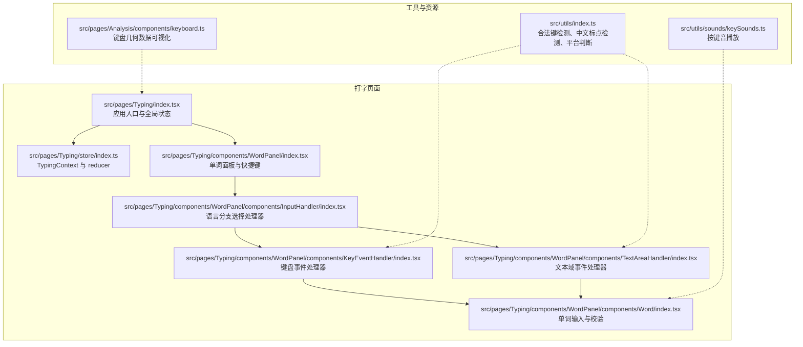
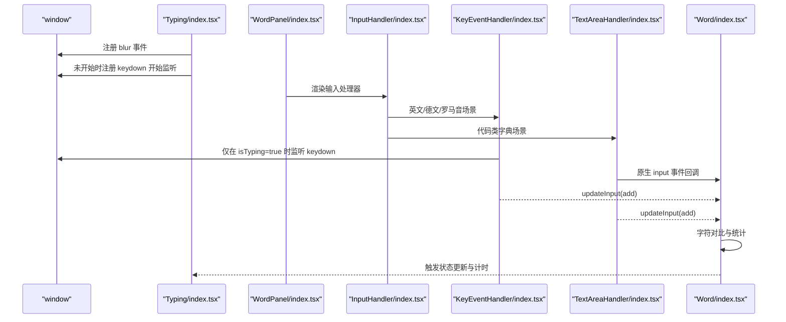
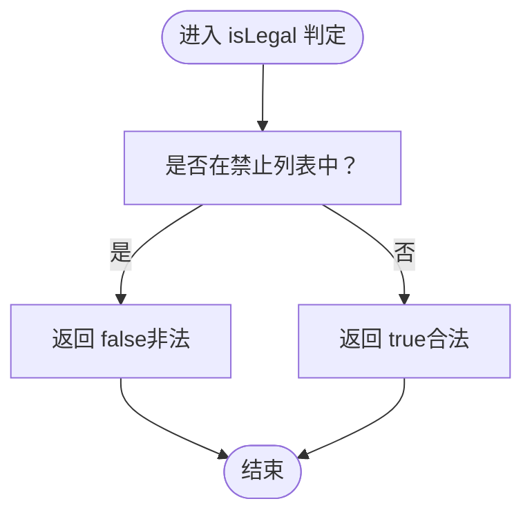
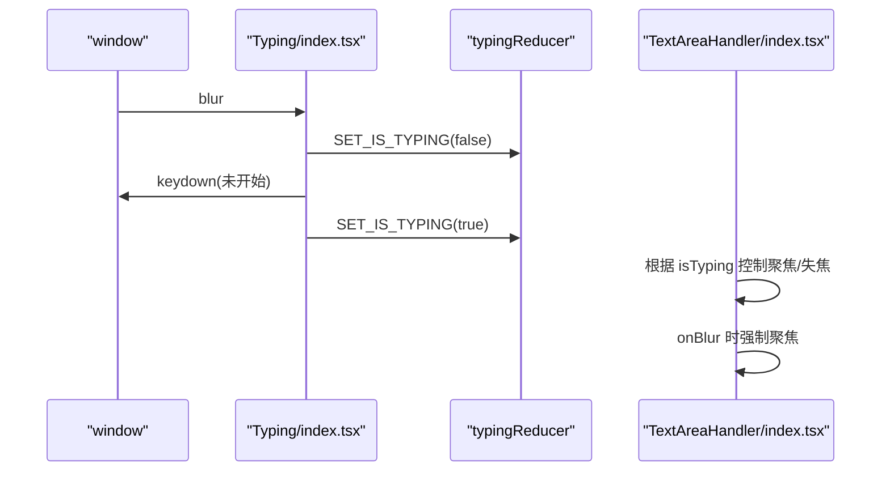
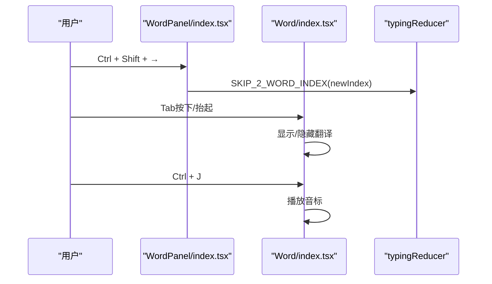
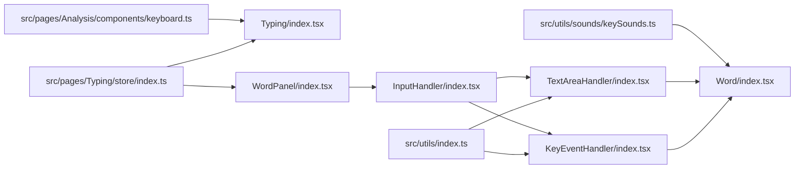
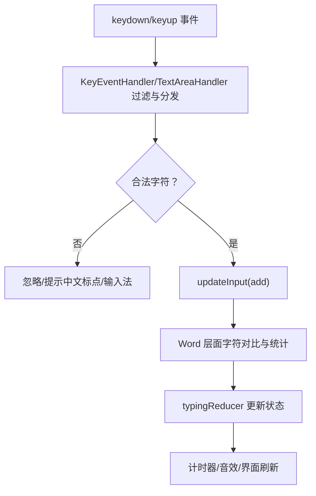

# 键盘事件处理

<cite>
**本文引用的文件**
- [src/pages/Typing/index.tsx](file://src/pages/Typing/index.tsx)
- [src/pages/Typing/store/index.ts](file://src/pages/Typing/store/index.ts)
- [src/pages/Typing/components/WordPanel/index.tsx](file://src/pages/Typing/components/WordPanel/index.tsx)
- [src/pages/Typing/components/WordPanel/components/InputHandler/index.tsx](file://src/pages/Typing/components/WordPanel/components/InputHandler/index.tsx)
- [src/pages/Typing/components/WordPanel/components/KeyEventHandler/index.tsx](file://src/pages/Typing/components/WordPanel/components/KeyEventHandler/index.tsx)
- [src/pages/Typing/components/WordPanel/components/TextAreaHandler/index.tsx](file://src/pages/Typing/components/WordPanel/components/TextAreaHandler/index.tsx)
- [src/pages/Typing/components/WordPanel/components/Word/index.tsx](file://src/pages/Typing/components/WordPanel/components/Word/index.tsx)
- [src/utils/index.ts](file://src/utils/index.ts)
- [src/utils/sounds/keySounds.ts](file://src/utils/sounds/keySounds.ts)
- [src/pages/Analysis/components/keyboard.ts](file://src/pages/Analysis/components/keyboard.ts)
- [tests/e2e/practice.spec.ts](file://tests/e2e/practice.spec.ts)
</cite>

## 目录

1. [简介](#简介)
2. [项目结构](#项目结构)
3. [核心组件](#核心组件)
4. [架构总览](#架构总览)
5. [详细组件分析](#详细组件分析)
6. [依赖关系分析](#依赖关系分析)
7. [性能考量](#性能考量)
8. [故障排查指南](#故障排查指南)
9. [结论](#结论)
10. [附录](#附录)

## 简介

本技术文档聚焦于键盘事件处理模块，系统性阐述以下内容：

- 键盘事件监听与处理机制：keydown、keyup 的捕获与响应流程
- 合法字符检测算法：字母、数字、空格、回车等特殊键的判定规则
- 输入焦点管理与窗口失焦检测：自动暂停、继续练习、状态恢复
- 快捷键与组合键支持：Alt、Ctrl、Meta 等修饰键识别与处理
- 跨浏览器兼容性与移动端键盘适配、特殊字符输入的挑战与方案
- 性能优化策略、内存泄漏防护与调试技巧

## 项目结构

键盘事件处理相关代码主要分布在“打字练习”页面及其子组件中，配合全局状态管理与工具函数共同完成事件捕获、过滤、分发与交互反馈。

图表来源

- [src/pages/Typing/index.tsx](file://src/pages/Typing/index.tsx#L61-L92)
- [src/pages/Typing/store/index.ts](file://src/pages/Typing/store/index.ts#L1-L60)
- [src/pages/Typing/components/WordPanel/index.tsx](file://src/pages/Typing/components/WordPanel/index.tsx#L1-L60)
- [src/pages/Typing/components/WordPanel/components/InputHandler/index.tsx](file://src/pages/Typing/components/WordPanel/components/InputHandler/index.tsx#L1-L27)
- [src/pages/Typing/components/WordPanel/components/KeyEventHandler/index.tsx](file://src/pages/Typing/components/WordPanel/components/KeyEventHandler/index.tsx#L1-L36)
- [src/pages/Typing/components/WordPanel/components/TextAreaHandler/index.tsx](file://src/pages/Typing/components/WordPanel/components/TextAreaHandler/index.tsx#L1-L54)
- [src/pages/Typing/components/WordPanel/components/Word/index.tsx](file://src/pages/Typing/components/WordPanel/components/Word/index.tsx#L74-L120)
- [src/utils/index.ts](file://src/utils/index.ts#L6-L48)
- [src/utils/sounds/keySounds.ts](file://src/utils/sounds/keySounds.ts#L1-L13)
- [src/pages/Analysis/components/keyboard.ts](file://src/pages/Analysis/components/keyboard.ts#L1-L74)

章节来源

- [src/pages/Typing/index.tsx](file://src/pages/Typing/index.tsx#L61-L92)
- [src/pages/Typing/store/index.ts](file://src/pages/Typing/store/index.ts#L1-L60)
- [src/pages/Typing/components/WordPanel/index.tsx](file://src/pages/Typing/components/WordPanel/index.tsx#L1-L60)
- [src/pages/Typing/components/WordPanel/components/InputHandler/index.tsx](file://src/pages/Typing/components/WordPanel/components/InputHandler/index.tsx#L1-L27)
- [src/pages/Typing/components/WordPanel/components/KeyEventHandler/index.tsx](file://src/pages/Typing/components/WordPanel/components/KeyEventHandler/index.tsx#L1-L36)
- [src/pages/Typing/components/WordPanel/components/TextAreaHandler/index.tsx](file://src/pages/Typing/components/WordPanel/components/TextAreaHandler/index.tsx#L1-L54)
- [src/pages/Typing/components/WordPanel/components/Word/index.tsx](file://src/pages/Typing/components/WordPanel/components/Word/index.tsx#L74-L120)
- [src/utils/index.ts](file://src/utils/index.ts#L6-L48)
- [src/utils/sounds/keySounds.ts](file://src/utils/sounds/keySounds.ts#L1-L13)
- [src/pages/Analysis/components/keyboard.ts](file://src/pages/Analysis/components/keyboard.ts#L1-L74)

## 核心组件

- 全局入口与焦点管理
  - 应用在挂载时注册窗口 blur 事件，用于检测窗口失焦并自动暂停练习。
  - 在未开始练习时，捕获任意可识别键（排除 Enter、空格等特定键）触发开始。
- 输入处理器分支
  - 根据字典语言类型选择不同输入处理器：英文/德文/罗马音走键盘事件处理器，代码类字典走文本域处理器。
- 键盘事件处理器
  - 仅在 isTyping 为真时监听 window 的 keydown 事件。
  - 使用工具函数过滤非法键与中文标点，避免输入法干扰。
- 文本域事件处理器
  - 通过隐藏的 textarea 获取原生 input 事件，区分输入法合成阶段与最终输入，避免重复处理。
  - 失焦时自动聚焦，保证持续输入体验。
- 单词输入与校验
  - 将输入字符加入当前单词输入缓冲，支持空格转换为显式占位符。
  - 对比正确字符，统计正确/错误数量，触发响应回调与音效播放。
- 工具函数
  - 合法键检测：预定义禁止列表，排除功能键、方向键、音量键等。
  - 中文标点检测：正则匹配常见中文标点，提示关闭输入法。
  - 平台判断与修饰键名称：根据系统区分 Ctrl/Control。

章节来源

- [src/pages/Typing/index.tsx](file://src/pages/Typing/index.tsx#L61-L92)
- [src/pages/Typing/components/WordPanel/components/InputHandler/index.tsx](file://src/pages/Typing/components/WordPanel/components/InputHandler/index.tsx#L1-L27)
- [src/pages/Typing/components/WordPanel/components/KeyEventHandler/index.tsx](file://src/pages/Typing/components/WordPanel/components/KeyEventHandler/index.tsx#L1-L36)
- [src/pages/Typing/components/WordPanel/components/TextAreaHandler/index.tsx](file://src/pages/Typing/components/WordPanel/components/TextAreaHandler/index.tsx#L1-L54)
- [src/pages/Typing/components/WordPanel/components/Word/index.tsx](file://src/pages/Typing/components/WordPanel/components/Word/index.tsx#L74-L120)
- [src/utils/index.ts](file://src/utils/index.ts#L6-L48)

## 架构总览

键盘事件处理的整体流程如下：

图表来源

- [src/pages/Typing/index.tsx](file://src/pages/Typing/index.tsx#L61-L92)
- [src/pages/Typing/components/WordPanel/index.tsx](file://src/pages/Typing/components/WordPanel/index.tsx#L1-L60)
- [src/pages/Typing/components/WordPanel/components/InputHandler/index.tsx](file://src/pages/Typing/components/WordPanel/components/InputHandler/index.tsx#L1-L27)
- [src/pages/Typing/components/WordPanel/components/KeyEventHandler/index.tsx](file://src/pages/Typing/components/WordPanel/components/KeyEventHandler/index.tsx#L1-L36)
- [src/pages/Typing/components/WordPanel/components/TextAreaHandler/index.tsx](file://src/pages/Typing/components/WordPanel/components/TextAreaHandler/index.tsx#L1-L54)
- [src/pages/Typing/components/WordPanel/components/Word/index.tsx](file://src/pages/Typing/components/WordPanel/components/Word/index.tsx#L74-L120)

## 详细组件分析

### 合法字符检测算法

- 预定义禁止列表：包含 Enter、Backspace、Delete、Tab、CapsLock、Shift、Control、Alt、Meta、Escape、Fn、FnLock、Hyper、Super、OS、方向键、音量键、End/PageUp/PageDown/Clear/Home 等。
- 判定流程：若键名在禁止列表中则视为非法；否则视为合法。
- 中文标点检测：对输入字符进行正则匹配，若命中中文标点则提示关闭输入法。
- 修饰键过滤：键盘事件处理器在合法字符基础上进一步排除 Alt/Ctrl/Meta 组合键，避免误触快捷键。

图表来源

- [src/utils/index.ts](file://src/utils/index.ts#L6-L42)
- [src/pages/Typing/components/WordPanel/components/KeyEventHandler/index.tsx](file://src/pages/Typing/components/WordPanel/components/KeyEventHandler/index.tsx#L14-L21)

章节来源

- [src/utils/index.ts](file://src/utils/index.ts#L6-L48)
- [src/pages/Typing/components/WordPanel/components/KeyEventHandler/index.tsx](file://src/pages/Typing/components/WordPanel/components/KeyEventHandler/index.tsx#L14-L21)

### 输入焦点管理与窗口失焦检测

- 窗口失焦自动暂停
  - 应用在挂载时注册 window.blur 事件，当窗口失去焦点时将 isTyping 设为 false，停止计时与输入处理。
- 未开始时的自动开始
  - 当 isTyping 为假且未加载时，捕获任意可识别键（排除 Enter、空格等），调用 SET_IS_TYPING 打开练习。
- 文本域焦点管理
  - TextAreaHandler 根据 isTyping 自动聚焦或失焦，确保输入连续性。
  - 失焦回调中再次聚焦，防止意外失焦导致输入中断。

图表来源

- [src/pages/Typing/index.tsx](file://src/pages/Typing/index.tsx#L61-L92)
- [src/pages/Typing/store/index.ts](file://src/pages/Typing/store/index.ts#L110-L120)
- [src/pages/Typing/components/WordPanel/components/TextAreaHandler/index.tsx](file://src/pages/Typing/components/WordPanel/components/TextAreaHandler/index.tsx#L12-L39)

章节来源

- [src/pages/Typing/index.tsx](file://src/pages/Typing/index.tsx#L61-L92)
- [src/pages/Typing/store/index.ts](file://src/pages/Typing/store/index.ts#L110-L120)
- [src/pages/Typing/components/WordPanel/components/TextAreaHandler/index.tsx](file://src/pages/Typing/components/WordPanel/components/TextAreaHandler/index.tsx#L12-L39)

### 快捷键与组合键处理

- 全局快捷键
  - Enter：切换 isTyping 状态（开始/暂停）
  - Ctrl + Shift + 方向左/右：跳过单词到上一个/下一个
  - Tab：显示/隐藏翻译
  - Ctrl + J：播放单词音标
- 组合键识别
  - 使用 react-hotkeys-hook，结合 preventDefault 与 enableOnFormTags 控制默认行为与表单元素中的快捷键生效范围。
  - 修饰键名称根据系统区分（Mac 使用 Control，其他系统使用 Ctrl）。

图表来源

- [src/pages/Typing/components/WordPanel/index.tsx](file://src/pages/Typing/components/WordPanel/index.tsx#L106-L145)
- [src/pages/Typing/components/WordPanel/components/Word/index.tsx](file://src/pages/Typing/components/WordPanel/components/Word/index.tsx#L103-L129)
- [src/utils/index.ts](file://src/utils/index.ts#L63-L66)

章节来源

- [src/pages/Typing/components/WordPanel/index.tsx](file://src/pages/Typing/components/WordPanel/index.tsx#L106-L145)
- [src/pages/Typing/components/WordPanel/components/Word/index.tsx](file://src/pages/Typing/components/WordPanel/components/Word/index.tsx#L103-L129)
- [src/utils/index.ts](file://src/utils/index.ts#L63-L66)

### 输入法与特殊字符处理

- 输入法合成阶段
  - TextAreaHandler 使用原生 input 事件，通过 isComposing 区分输入法合成阶段与最终输入，避免重复处理。
  - CompositionStart 时提示关闭输入法，减少误判。
- 中文标点过滤
  - KeyEventHandler 在 keydown 阶段检测中文标点，提示关闭输入法。
- 空格与回车
  - Word 层面将空格转换为显式占位符，统一渲染与统计。
  - 回车键在未开始时用于触发开始，避免与输入冲突。

章节来源

- [src/pages/Typing/components/WordPanel/components/TextAreaHandler/index.tsx](file://src/pages/Typing/components/WordPanel/components/TextAreaHandler/index.tsx#L21-L30)
- [src/pages/Typing/components/WordPanel/components/KeyEventHandler/index.tsx](file://src/pages/Typing/components/WordPanel/components/KeyEventHandler/index.tsx#L14-L16)
- [src/pages/Typing/components/WordPanel/components/Word/index.tsx](file://src/pages/Typing/components/WordPanel/components/Word/index.tsx#L80-L90)

### 跨浏览器与移动端适配

- 跨浏览器兼容
  - 使用 e.key 作为键名，避免依赖 keyCode；通过工具函数统一修饰键名称（Ctrl/Control）。
  - 使用 preventDefault 控制默认行为，提升一致性。
- 移动端适配
  - 应用在挂载时检测非桌面设备，弹出提示建议使用桌面端或外接键盘。
  - 文本域输入处理器在移动端仍可工作，但整体体验更偏向桌面端。

章节来源

- [src/pages/Typing/index.tsx](file://src/pages/Typing/index.tsx#L40-L49)
- [src/utils/index.ts](file://src/utils/index.ts#L63-L66)

### 事件处理性能优化与内存泄漏防护

- 事件解绑
  - KeyEventHandler 在 useEffect 中仅在 isTyping 为真时添加 window keydown 监听，并在卸载时移除，避免常驻监听造成内存泄漏。
  - Typing/index.tsx 在未开始时才注册 keydown 开始监听，并在卸载时移除。
  - TextAreaHandler 在 blur 时强制聚焦，避免频繁 DOM 操作。
- 作用域控制
  - 通过 TypingContext.state.isTyping 控制事件处理器启用范围，减少无效计算。
- 计时器清理
  - Typing/index.tsx 在 isTyping 变化时启动/停止计时器，避免后台任务持续运行。

章节来源

- [src/pages/Typing/components/WordPanel/components/KeyEventHandler/index.tsx](file://src/pages/Typing/components/WordPanel/components/KeyEventHandler/index.tsx#L26-L33)
- [src/pages/Typing/index.tsx](file://src/pages/Typing/index.tsx#L80-L92)
- [src/pages/Typing/index.tsx](file://src/pages/Typing/index.tsx#L116-L126)

### 调试技巧与实践建议

- 快捷键调试
  - 使用 react-hotkeys-hook 的 keyup 选项区分按下/抬起，便于验证组合键行为。
- 输入法问题定位
  - TextAreaHandler 的 isComposing 与 CompositionStart 提示有助于快速定位输入法干扰。
- 行为验证
  - E2E 测试覆盖了按任意键开始与正确输入单词的场景，可用于回归验证。

章节来源

- [src/pages/Typing/components/WordPanel/components/Word/index.tsx](file://src/pages/Typing/components/WordPanel/components/Word/index.tsx#L138-L145)
- [src/pages/Typing/components/WordPanel/components/TextAreaHandler/index.tsx](file://src/pages/Typing/components/WordPanel/components/TextAreaHandler/index.tsx#L48-L51)
- [tests/e2e/practice.spec.ts](file://tests/e2e/practice.spec.ts#L1-L37)

## 依赖关系分析

键盘事件处理模块的依赖关系如下：

图表来源

- [src/utils/index.ts](file://src/utils/index.ts#L6-L48)
- [src/pages/Typing/store/index.ts](file://src/pages/Typing/store/index.ts#L1-L60)
- [src/pages/Typing/index.tsx](file://src/pages/Typing/index.tsx#L61-L92)
- [src/pages/Typing/components/WordPanel/index.tsx](file://src/pages/Typing/components/WordPanel/index.tsx#L1-L60)
- [src/pages/Typing/components/WordPanel/components/InputHandler/index.tsx](file://src/pages/Typing/components/WordPanel/components/InputHandler/index.tsx#L1-L27)
- [src/pages/Typing/components/WordPanel/components/KeyEventHandler/index.tsx](file://src/pages/Typing/components/WordPanel/components/KeyEventHandler/index.tsx#L1-L36)
- [src/pages/Typing/components/WordPanel/components/TextAreaHandler/index.tsx](file://src/pages/Typing/components/WordPanel/components/TextAreaHandler/index.tsx#L1-L54)
- [src/pages/Typing/components/WordPanel/components/Word/index.tsx](file://src/pages/Typing/components/WordPanel/components/Word/index.tsx#L74-L120)
- [src/utils/sounds/keySounds.ts](file://src/utils/sounds/keySounds.ts#L1-L13)
- [src/pages/Analysis/components/keyboard.ts](file://src/pages/Analysis/components/keyboard.ts#L1-L74)

章节来源

- [src/utils/index.ts](file://src/utils/index.ts#L6-L48)
- [src/pages/Typing/store/index.ts](file://src/pages/Typing/store/index.ts#L1-L60)
- [src/pages/Typing/index.tsx](file://src/pages/Typing/index.tsx#L61-L92)
- [src/pages/Typing/components/WordPanel/index.tsx](file://src/pages/Typing/components/WordPanel/index.tsx#L1-L60)
- [src/pages/Typing/components/WordPanel/components/InputHandler/index.tsx](file://src/pages/Typing/components/WordPanel/components/InputHandler/index.tsx#L1-L27)
- [src/pages/Typing/components/WordPanel/components/KeyEventHandler/index.tsx](file://src/pages/Typing/components/WordPanel/components/KeyEventHandler/index.tsx#L1-L36)
- [src/pages/Typing/components/WordPanel/components/TextAreaHandler/index.tsx](file://src/pages/Typing/components/WordPanel/components/TextAreaHandler/index.tsx#L1-L54)
- [src/pages/Typing/components/WordPanel/components/Word/index.tsx](file://src/pages/Typing/components/WordPanel/components/Word/index.tsx#L74-L120)
- [src/utils/sounds/keySounds.ts](file://src/utils/sounds/keySounds.ts#L1-L13)
- [src/pages/Analysis/components/keyboard.ts](file://src/pages/Analysis/components/keyboard.ts#L1-L74)

## 性能考量

- 事件监听最小化
  - 仅在 isTyping 为真时监听 keydown，避免常驻监听。
  - 未开始时仅在必要时机注册 keydown 开始监听并及时清理。
- 计算与渲染优化
  - 使用 useImmerReducer 管理状态，减少不必要的重渲染。
  - Word 层面按字符粒度更新，避免整树重绘。
- 音频播放
  - Howler 实例按需创建与播放，避免重复实例化带来的资源浪费。

[本节为通用指导，无需列出具体文件来源]

## 故障排查指南

- 输入法干扰
  - 现象：输入中文标点或拼音导致异常
  - 排查：确认 KeyEventHandler 的中文标点检测与 TextAreaHandler 的 isComposing 分支
  - 处置：提示关闭输入法，确保输入法合成结束再输入
- 快捷键冲突
  - 现象：组合键触发浏览器默认行为
  - 排查：确认 preventDefault 与 enableOnFormTags 的配置
  - 处置：在相应组件中调整 useHotkeys 的选项
- 窗口失焦导致暂停
  - 现象：练习被意外暂停
  - 排查：确认 blur 事件绑定与 isTyping 状态流转
  - 处置：在需要保持练习时避免主动失焦
- 文本域无法输入
  - 现象：输入框不聚焦或反复失焦
  - 排查：确认 TextAreaHandler 的聚焦/失焦逻辑
  - 处置：确保 isTyping 为真时聚焦，失焦回调中再次聚焦

章节来源

- [src/pages/Typing/components/WordPanel/components/KeyEventHandler/index.tsx](file://src/pages/Typing/components/WordPanel/components/KeyEventHandler/index.tsx#L14-L16)
- [src/pages/Typing/components/WordPanel/components/TextAreaHandler/index.tsx](file://src/pages/Typing/components/WordPanel/components/TextAreaHandler/index.tsx#L12-L39)
- [src/pages/Typing/index.tsx](file://src/pages/Typing/index.tsx#L61-L92)
- [src/pages/Typing/components/WordPanel/components/Word/index.tsx](file://src/pages/Typing/components/WordPanel/components/Word/index.tsx#L103-L129)

## 结论

键盘事件处理模块通过清晰的职责划分与严格的边界控制，实现了：

- 精准的合法字符检测与输入法隔离
- 稳健的焦点管理与窗口失焦处理
- 丰富的快捷键与组合键支持
- 良好的跨浏览器与移动端适配
- 可靠的性能优化与内存泄漏防护

这些特性共同构成了稳定、可维护且用户体验良好的键盘事件处理体系。

[本节为总结性内容，无需列出具体文件来源]

## 附录

- 关键流程图（键盘事件到状态更新）

图表来源

- [src/pages/Typing/components/WordPanel/components/KeyEventHandler/index.tsx](file://src/pages/Typing/components/WordPanel/components/KeyEventHandler/index.tsx#L14-L21)
- [src/pages/Typing/components/WordPanel/components/TextAreaHandler/index.tsx](file://src/pages/Typing/components/WordPanel/components/TextAreaHandler/index.tsx#L21-L30)
- [src/pages/Typing/components/WordPanel/components/Word/index.tsx](file://src/pages/Typing/components/WordPanel/components/Word/index.tsx#L74-L120)
- [src/pages/Typing/store/index.ts](file://src/pages/Typing/store/index.ts#L110-L120)
