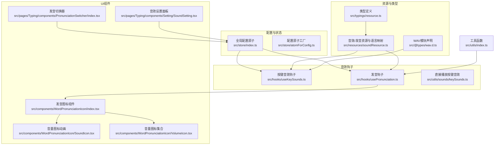
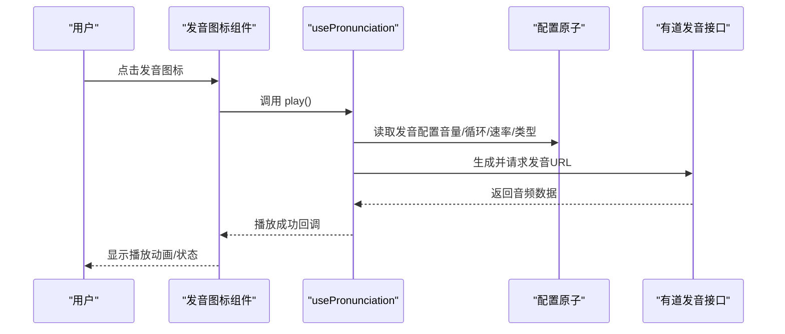
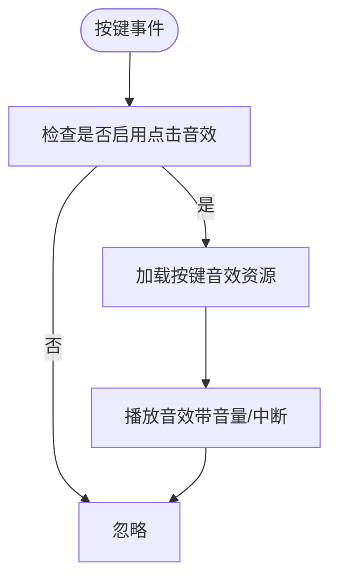
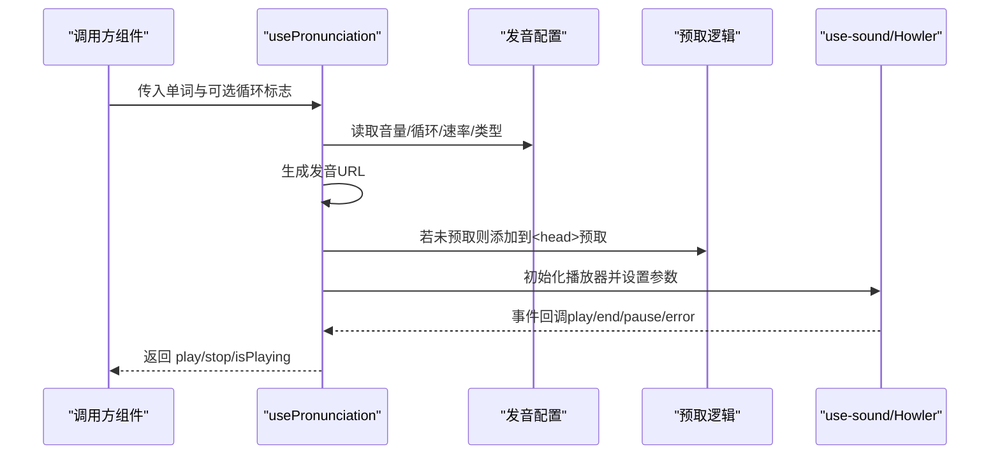
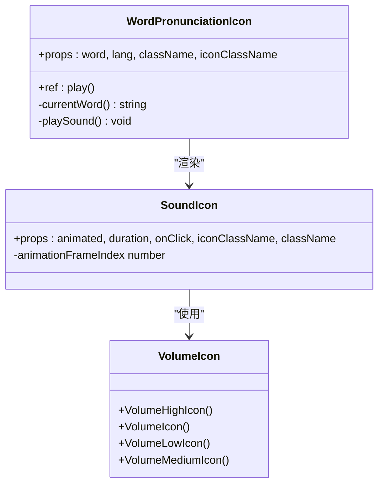
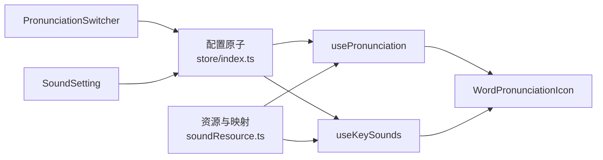

# 音效与发音系统

<cite>
**本文引用的文件**
- [src/resources/soundResource.ts](file://src/resources/soundResource.ts)
- [src/hooks/useKeySounds.ts](file://src/hooks/useKeySounds.ts)
- [src/hooks/usePronunciation.ts](file://src/hooks/usePronunciation.ts)
- [src/utils/sounds/keySounds.ts](file://src/utils/sounds/keySounds.ts)
- [src/components/WordPronunciationIcon/index.tsx](file://src/components/WordPronunciationIcon/index.tsx)
- [src/components/WordPronunciationIcon/SoundIcon.tsx](file://src/components/WordPronunciationIcon/SoundIcon.tsx)
- [src/components/WordPronunciationIcon/VolumeIcon.tsx](file://src/components/WordPronunciationIcon/VolumeIcon.tsx)
- [src/pages/Typing/components/PronunciationSwitcher/index.tsx](file://src/pages/Typing/components/PronunciationSwitcher/index.tsx)
- [src/store/index.ts](file://src/store/index.ts)
- [src/store/atomForConfig.ts](file://src/store/atomForConfig.ts)
- [src/typings/resource.ts](file://src/typings/resource.ts)
- [src/utils/index.ts](file://src/utils/index.ts)
- [src/@types/wav.d.ts](file://src/@types/wav.d.ts)
- [src/pages/Typing/components/Setting/SoundSetting.tsx](file://src/pages/Typing/components/Setting/SoundSetting.tsx)
</cite>

## 目录

1. [简介](#简介)
2. [项目结构](#项目结构)
3. [核心组件](#核心组件)
4. [架构总览](#架构总览)
5. [详细组件分析](#详细组件分析)
6. [依赖关系分析](#依赖关系分析)
7. [性能考量](#性能考量)
8. [故障排查指南](#故障排查指南)
9. [结论](#结论)
10. [附录：配置与自定义](#附录配置与自定义)

## 简介

本文件面向“音效与发音系统”的技术文档，覆盖按键音效触发时机、音效文件管理、音量控制；发音功能的集成方式（音标发音、单词发音、音频播放控制）；音频资源加载与缓存策略（格式、预加载、内存优化）；发音图标组件设计与实现（显示逻辑、点击交互、发音状态同步）；以及音频播放的错误处理、兼容性与移动端适配等技术挑战与解决方案，并提供可扩展的配置项与自定义路径。

## 项目结构

围绕音效与发音的关键目录与文件如下：

- 资源与类型
  - 音频资源枚举与语言发音映射：[src/resources/soundResource.ts](file://src/resources/soundResource.ts)
  - 类型定义（字典、语言发音映射、音效资源）：[src/typings/resource.ts](file://src/typings/resource.ts)
  - WAV 模块声明：[src/@types/wav.d.ts](file://src/@types/wav.d.ts)
- 配置与状态
  - 全局配置原子（含音效/发音开关、音量、默认发音类型等）：[src/store/index.ts](file://src/store/index.ts)
  - 配置原子工厂（带持久化与类型校验）：[src/store/atomForConfig.ts](file://src/store/atomForConfig.ts)
- 音效钩子
  - 按键音效钩子（点击/正确/错误提示音）：[src/hooks/useKeySounds.ts](file://src/hooks/useKeySounds.ts)
  - 发音钩子（单词发音、循环、速率、音量、预取）：[src/hooks/usePronunciation.ts](file://src/hooks/usePronunciation.ts)
  - 直接播放按键音效（Howler）：[src/utils/sounds/keySounds.ts](file://src/utils/sounds/keySounds.ts)
- 发音图标组件
  - 发音图标容器与播放控制：[src/components/WordPronunciationIcon/index.tsx](file://src/components/WordPronunciationIcon/index.tsx)
  - 图标动画与渲染：[src/components/WordPronunciationIcon/SoundIcon.tsx](file://src/components/WordPronunciationIcon/SoundIcon.tsx)
  - 音量图标集合：[src/components/WordPronunciationIcon/VolumeIcon.tsx](file://src/components/WordPronunciationIcon/VolumeIcon.tsx)
- 发音切换器 UI
  - 发音类型选择与提示：[src/pages/Typing/components/PronunciationSwitcher/index.tsx](file://src/pages/Typing/components/PronunciationSwitcher/index.tsx)
- 设置面板
  - 音效设置（发音开关、音量、循环、速率等）：[src/pages/Typing/components/Setting/SoundSetting.tsx](file://src/pages/Typing/components/Setting/SoundSetting.tsx)
- 工具函数
  - Howler 事件监听封装、平台判断、组合键标识等：[src/utils/index.ts](file://src/utils/index.ts)

图表来源

- [src/store/index.ts](file://src/store/index.ts#L36-L61)
- [src/store/atomForConfig.ts](file://src/store/atomForConfig.ts#L1-L45)
- [src/resources/soundResource.ts](file://src/resources/soundResource.ts#L1-L130)
- [src/typings/resource.ts](file://src/typings/resource.ts#L1-L52)
- [src/@types/wav.d.ts](file://src/@types/wav.d.ts#L1-L4)
- [src/hooks/useKeySounds.ts](file://src/hooks/useKeySounds.ts#L1-L51)
- [src/hooks/usePronunciation.ts](file://src/hooks/usePronunciation.ts#L1-L103)
- [src/utils/sounds/keySounds.ts](file://src/utils/sounds/keySounds.ts#L1-L13)
- [src/components/WordPronunciationIcon/index.tsx](file://src/components/WordPronunciationIcon/index.tsx#L1-L57)
- [src/components/WordPronunciationIcon/SoundIcon.tsx](file://src/components/WordPronunciationIcon/SoundIcon.tsx#L1-L39)
- [src/components/WordPronunciationIcon/VolumeIcon.tsx](file://src/components/WordPronunciationIcon/VolumeIcon.tsx#L1-L33)
- [src/pages/Typing/components/PronunciationSwitcher/index.tsx](file://src/pages/Typing/components/PronunciationSwitcher/index.tsx#L1-L237)
- [src/pages/Typing/components/Setting/SoundSetting.tsx](file://src/pages/Typing/components/Setting/SoundSetting.tsx#L1-L19)
- [src/utils/index.ts](file://src/utils/index.ts#L1-L129)

章节来源

- [src/resources/soundResource.ts](file://src/resources/soundResource.ts#L1-L130)
- [src/store/index.ts](file://src/store/index.ts#L36-L61)
- [src/hooks/useKeySounds.ts](file://src/hooks/useKeySounds.ts#L1-L51)
- [src/hooks/usePronunciation.ts](file://src/hooks/usePronunciation.ts#L1-L103)
- [src/components/WordPronunciationIcon/index.tsx](file://src/components/WordPronunciationIcon/index.tsx#L1-L57)
- [src/pages/Typing/components/PronunciationSwitcher/index.tsx](file://src/pages/Typing/components/PronunciationSwitcher/index.tsx#L1-L237)
- [src/pages/Typing/components/Setting/SoundSetting.tsx](file://src/pages/Typing/components/Setting/SoundSetting.tsx#L1-L19)
- [src/utils/index.ts](file://src/utils/index.ts#L1-L129)

## 核心组件

- 音效资源与语言发音映射
  - 统一管理按键音效、正确/错误提示音与多语言发音映射，支持按部署环境动态选择资源前缀。
- 配置原子
  - 提供持久化存储、类型校验与默认值补全，确保跨版本升级时配置兼容。
- 音效钩子
  - 按键音效：根据开关与音量实时播放，支持中断优先级。
  - 发音钩子：基于 YouDao 发音接口生成 URL，支持循环、速率、音量与预取。
- 发音图标组件
  - 将单词发音封装为可点击图标，内置播放状态动画与生命周期清理。
- 发音切换器与设置面板
  - 提供 UI 以选择发音类型、音量、循环、速率等参数，并在快捷键提示中引导用户操作。

章节来源

- [src/resources/soundResource.ts](file://src/resources/soundResource.ts#L1-L130)
- [src/store/index.ts](file://src/store/index.ts#L36-L61)
- [src/hooks/useKeySounds.ts](file://src/hooks/useKeySounds.ts#L1-L51)
- [src/hooks/usePronunciation.ts](file://src/hooks/usePronunciation.ts#L1-L103)
- [src/components/WordPronunciationIcon/index.tsx](file://src/components/WordPronunciationIcon/index.tsx#L1-L57)
- [src/pages/Typing/components/PronunciationSwitcher/index.tsx](file://src/pages/Typing/components/PronunciationSwitcher/index.tsx#L1-L237)
- [src/pages/Typing/components/Setting/SoundSetting.tsx](file://src/pages/Typing/components/Setting/SoundSetting.tsx#L1-L19)

## 架构总览

系统采用“配置驱动 + 钩子抽象 + 组件封装”的分层架构：

- 配置层：通过 Jotai 原子集中管理音效/发音开关、音量、循环、速率、默认发音类型等。
- 资源层：统一枚举音效文件与语言发音映射，按部署环境选择资源路径前缀。
- 钩子层：暴露 useKeySound 与 usePronunciation 两个核心钩子，屏蔽播放库细节。
- 组件层：发音图标组件与切换器 UI 通过钩子与配置联动，提供一致的交互体验。
- 工具层：封装 Howler 事件监听、平台判断、组合键标识等通用能力。

图表来源

- [src/components/WordPronunciationIcon/index.tsx](file://src/components/WordPronunciationIcon/index.tsx#L1-L57)
- [src/hooks/usePronunciation.ts](file://src/hooks/usePronunciation.ts#L1-L103)
- [src/store/index.ts](file://src/store/index.ts#L52-L61)

## 详细组件分析

### 按键音效机制

- 触发时机
  - 点击键盘按键时触发点击音效；打字结果正确/错误时分别触发对应提示音。
- 音效文件管理
  - 通过资源枚举与部署前缀动态拼接路径，支持 WAV 格式。
- 音量与中断
  - 支持独立音量控制与 interrupt 优先级，避免长音效阻塞后续音效。
- 错误处理
  - 当资源不可用或路径异常时，回退到默认资源并更新配置。

图表来源

- [src/hooks/useKeySounds.ts](file://src/hooks/useKeySounds.ts#L1-L51)
- [src/utils/sounds/keySounds.ts](file://src/utils/sounds/keySounds.ts#L1-L13)
- [src/resources/soundResource.ts](file://src/resources/soundResource.ts#L1-L39)
- [src/@types/wav.d.ts](file://src/@types/wav.d.ts#L1-L4)

章节来源

- [src/hooks/useKeySounds.ts](file://src/hooks/useKeySounds.ts#L1-L51)
- [src/utils/sounds/keySounds.ts](file://src/utils/sounds/keySounds.ts#L1-L13)
- [src/resources/soundResource.ts](file://src/resources/soundResource.ts#L1-L39)
- [src/@types/wav.d.ts](file://src/@types/wav.d.ts#L1-L4)

### 发音功能集成

- 单词发音
  - 通过 generateWordSoundSrc 依据发音类型（英音/美音/日语/德语/普通话/印尼语/哈拼/哈萨克语兜底）生成 URL。
  - 使用 use-sound 播放，支持循环、速率与音量。
- 预加载与缓存
  - 在单词变更时预取音频，设置 preload 与匿名跨域，避免第三方插件干扰。
- 状态同步
  - 监听 Howler 事件（play/end/pause/playerror），同步 isPlaying 状态并在卸载时释放资源。

图表来源

- [src/hooks/usePronunciation.ts](file://src/hooks/usePronunciation.ts#L1-L103)
- [src/store/index.ts](file://src/store/index.ts#L52-L61)

章节来源

- [src/hooks/usePronunciation.ts](file://src/hooks/usePronunciation.ts#L1-L103)
- [src/store/index.ts](file://src/store/index.ts#L52-L61)

### 发音图标组件设计

- 显示逻辑
  - 根据语言与单词形态（如哈萨克语不同文字体系）选择发音文本。
  - 内置音量图标动画，播放时循环展示不同音量等级图标。
- 点击交互
  - 点击图标触发播放，先停止当前播放再开始新播放。
- 发音状态同步
  - 通过 Howler 事件更新 isPlaying，组件根据状态切换动画帧。
- 生命周期清理
  - 组件卸载时停止播放并释放音频资源，避免内存泄漏。

图表来源

- [src/components/WordPronunciationIcon/index.tsx](file://src/components/WordPronunciationIcon/index.tsx#L1-L57)
- [src/components/WordPronunciationIcon/SoundIcon.tsx](file://src/components/WordPronunciationIcon/SoundIcon.tsx#L1-L39)
- [src/components/WordPronunciationIcon/VolumeIcon.tsx](file://src/components/WordPronunciationIcon/VolumeIcon.tsx#L1-L33)

章节来源

- [src/components/WordPronunciationIcon/index.tsx](file://src/components/WordPronunciationIcon/index.tsx#L1-L57)
- [src/components/WordPronunciationIcon/SoundIcon.tsx](file://src/components/WordPronunciationIcon/SoundIcon.tsx#L1-L39)
- [src/components/WordPronunciationIcon/VolumeIcon.tsx](file://src/components/WordPronunciationIcon/VolumeIcon.tsx#L1-L33)

### 发音切换器与设置面板

- 发音切换器
  - 基于当前词典语言从语言映射表中提取可用发音类型，支持默认发音索引回退。
  - 提供快捷键提示，便于用户快速开启/关闭发音。
- 音效设置面板
  - 提供发音开关、音量、循环、速率等配置入口，并与全局配置原子联动。

章节来源

- [src/pages/Typing/components/PronunciationSwitcher/index.tsx](file://src/pages/Typing/components/PronunciationSwitcher/index.tsx#L1-L237)
- [src/pages/Typing/components/Setting/SoundSetting.tsx](file://src/pages/Typing/components/Setting/SoundSetting.tsx#L1-L19)
- [src/resources/soundResource.ts](file://src/resources/soundResource.ts#L40-L130)
- [src/store/index.ts](file://src/store/index.ts#L52-L61)

## 依赖关系分析

- 配置依赖
  - useKeySounds 与 usePronunciation 均依赖全局配置原子，保证 UI 与播放行为一致。
- 资源依赖
  - 资源枚举与语言映射由资源文件集中管理，避免分散硬编码。
- 组件耦合
  - 发音图标组件仅依赖 usePronunciation 钩子，低耦合高内聚。
- 外部依赖
  - use-sound/Howler 提供播放能力；有道发音接口提供在线音频源。

图表来源

- [src/store/index.ts](file://src/store/index.ts#L36-L61)
- [src/resources/soundResource.ts](file://src/resources/soundResource.ts#L1-L130)
- [src/hooks/useKeySounds.ts](file://src/hooks/useKeySounds.ts#L1-L51)
- [src/hooks/usePronunciation.ts](file://src/hooks/usePronunciation.ts#L1-L103)
- [src/components/WordPronunciationIcon/index.tsx](file://src/components/WordPronunciationIcon/index.tsx#L1-L57)
- [src/pages/Typing/components/PronunciationSwitcher/index.tsx](file://src/pages/Typing/components/PronunciationSwitcher/index.tsx#L1-L237)
- [src/pages/Typing/components/Setting/SoundSetting.tsx](file://src/pages/Typing/components/Setting/SoundSetting.tsx#L1-L19)

章节来源

- [src/store/index.ts](file://src/store/index.ts#L36-L61)
- [src/resources/soundResource.ts](file://src/resources/soundResource.ts#L1-L130)
- [src/hooks/useKeySounds.ts](file://src/hooks/useKeySounds.ts#L1-L51)
- [src/hooks/usePronunciation.ts](file://src/hooks/usePronunciation.ts#L1-L103)
- [src/components/WordPronunciationIcon/index.tsx](file://src/components/WordPronunciationIcon/index.tsx#L1-L57)
- [src/pages/Typing/components/PronunciationSwitcher/index.tsx](file://src/pages/Typing/components/PronunciationSwitcher/index.tsx#L1-L237)
- [src/pages/Typing/components/Setting/SoundSetting.tsx](file://src/pages/Typing/components/Setting/SoundSetting.tsx#L1-L19)

## 性能考量

- 音频格式与体积
  - 按键音效采用 WAV，发音采用 MP3（通过 use-sound/Howler），兼顾浏览器兼容与体积。
- 预加载与缓存
  - 发音预取使用 Audio 元素与 preload=auto，避免重复下载；同时设置匿名跨域与隐藏元素，降低对页面布局与第三方插件的影响。
- 循环与速率
  - 循环播放需谨慎使用，避免长时间占用资源；速率调整影响 CPU 占用，建议按需开启。
- 内存优化
  - 组件卸载时主动 unload 音频，防止内存泄漏；预取的 Audio 元素在不再需要时及时移除。
- 移动端适配
  - 移动端自动静音策略与浏览器手势限制可能导致首次播放失败，建议在用户交互后触发播放或提供显式播放按钮。

章节来源

- [src/hooks/usePronunciation.ts](file://src/hooks/usePronunciation.ts#L75-L103)
- [src/utils/sounds/keySounds.ts](file://src/utils/sounds/keySounds.ts#L1-L13)
- [src/utils/index.ts](file://src/utils/index.ts#L1-L129)

## 故障排查指南

- 按键音效无法播放
  - 检查资源路径前缀与文件名是否匹配；确认资源枚举中存在对应文件；若资源缺失，系统会回退到默认资源并更新配置。
- 发音无法播放
  - 检查网络连通性与有道接口可用性；确认发音类型映射是否存在；查看 Howler 事件回调中的错误状态并重试。
- 预取无效或重复
  - 确认预取 URL 未被重复添加；检查 head 中 link/audio 标签去重逻辑；避免跨域问题导致预取失败。
- 移动端静音/手势限制
  - 在用户首次交互后触发播放；必要时提供“允许播放”提示或引导用户手动触发。
- 配置不生效
  - 检查配置原子是否正确持久化与类型校验；若旧版配置字段缺失，工厂会进行补全并写回本地存储。

章节来源

- [src/hooks/useKeySounds.ts](file://src/hooks/useKeySounds.ts#L1-L51)
- [src/hooks/usePronunciation.ts](file://src/hooks/usePronunciation.ts#L37-L103)
- [src/store/atomForConfig.ts](file://src/store/atomForConfig.ts#L1-L45)
- [src/utils/index.ts](file://src/utils/index.ts#L63-L71)

## 结论

本系统通过清晰的配置驱动与钩子抽象，实现了按键音效与单词发音的解耦集成。资源与语言映射集中管理，组件层保持低耦合，配合预取与状态同步机制，在性能与用户体验之间取得平衡。未来可在发音源扩展、移动端手势策略与错误恢复方面进一步完善。

## 附录：配置与自定义

- 可配置项（来自全局配置原子）
  - 按键音效：开关、点击音效开关、音量、按键音效资源
  - 提示音效：开关、音量、正确/错误提示音开关与资源
  - 发音：开关、音量、循环、速率、发音类型、是否显示音标、音标音量
- 自定义方法
  - 新增按键音效：在资源枚举中添加新文件并更新资源列表；在 useKeySounds 中按需启用。
  - 新增语言发音：在语言映射表中新增语言与默认发音索引；在发音切换器中自动呈现。
  - 自定义发音源：替换 generateWordSoundSrc 的实现或接入自有发音服务；注意预加载与跨域策略。
  - 配置持久化与迁移：通过配置原子工厂确保类型安全与默认值补全，避免升级后配置丢失。

章节来源

- [src/store/index.ts](file://src/store/index.ts#L36-L61)
- [src/resources/soundResource.ts](file://src/resources/soundResource.ts#L40-L130)
- [src/hooks/useKeySounds.ts](file://src/hooks/useKeySounds.ts#L1-L51)
- [src/hooks/usePronunciation.ts](file://src/hooks/usePronunciation.ts#L1-L103)
- [src/store/atomForConfig.ts](file://src/store/atomForConfig.ts#L1-L45)
