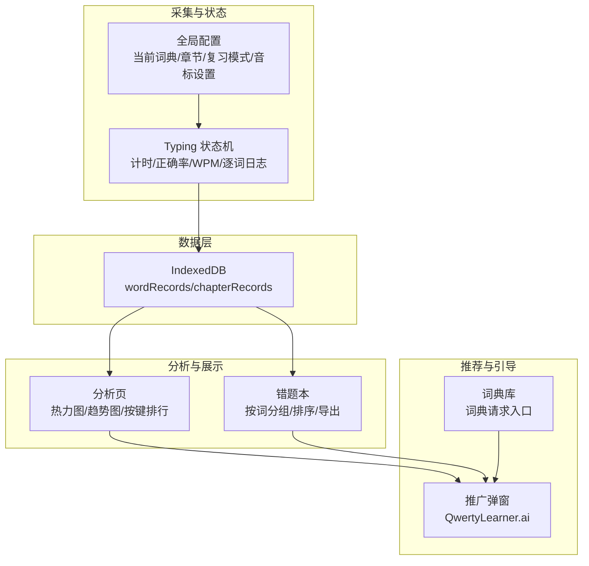
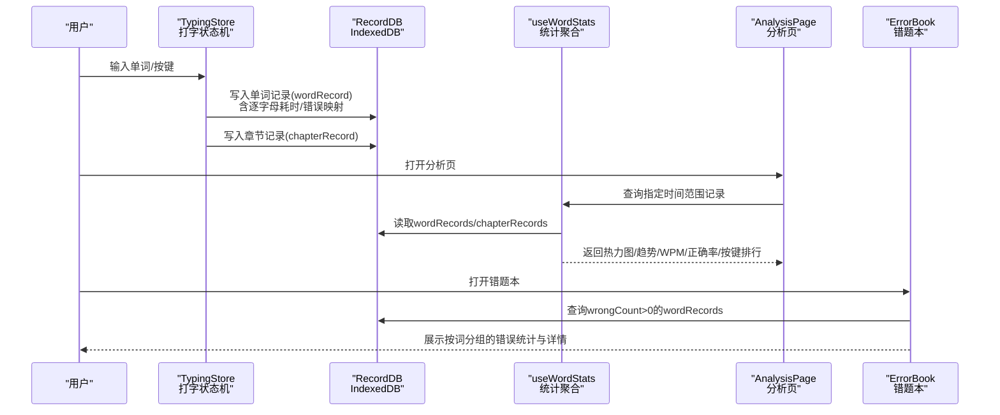
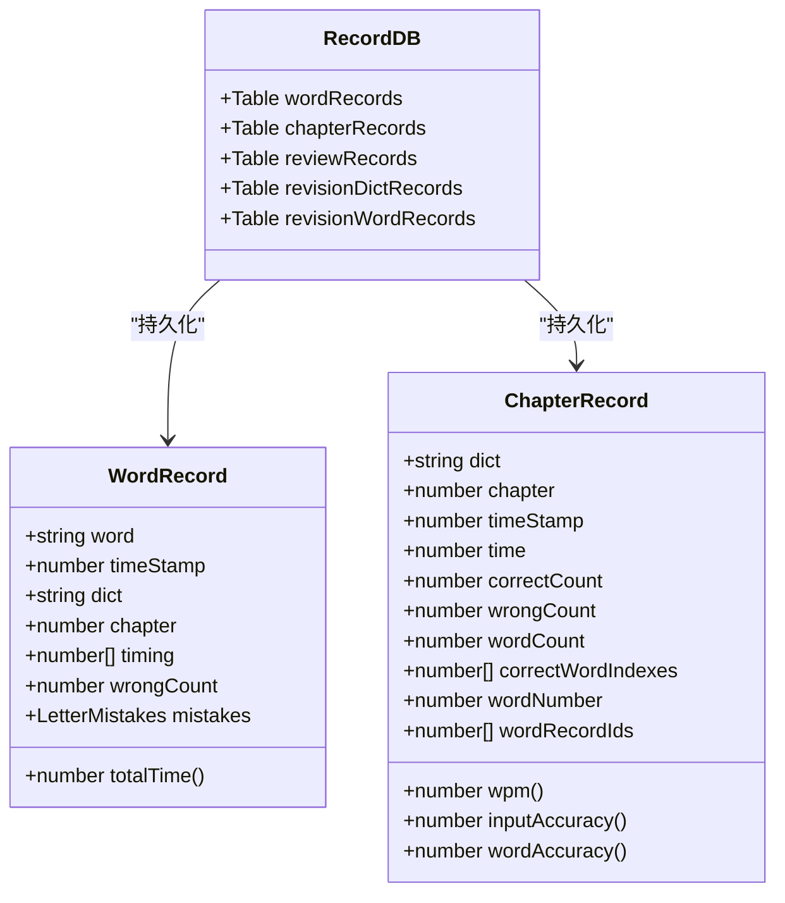
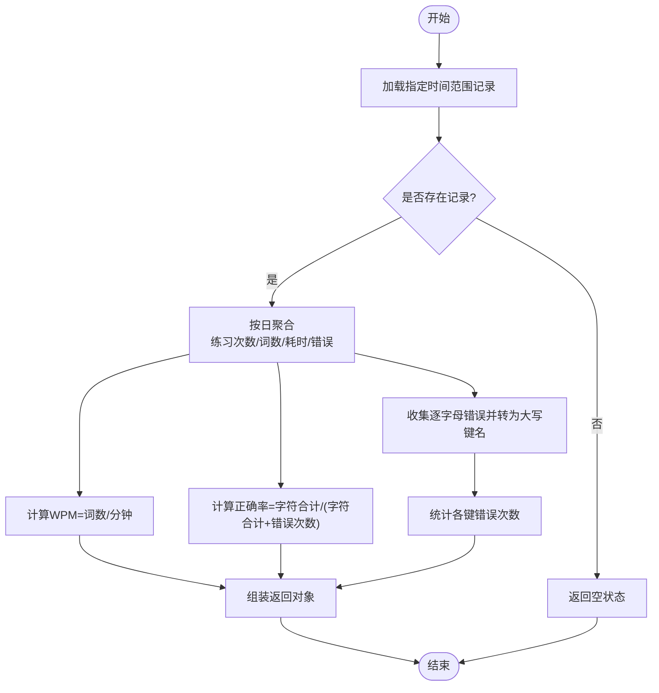
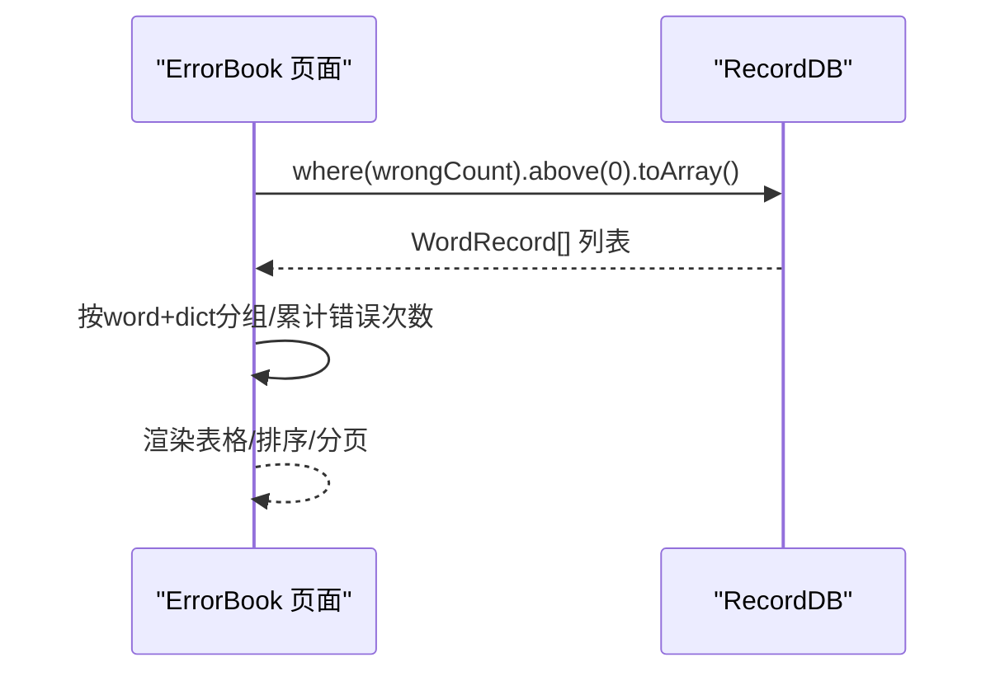
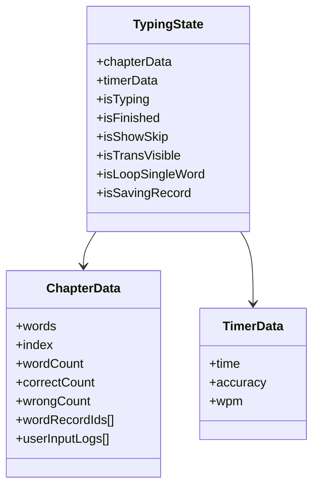
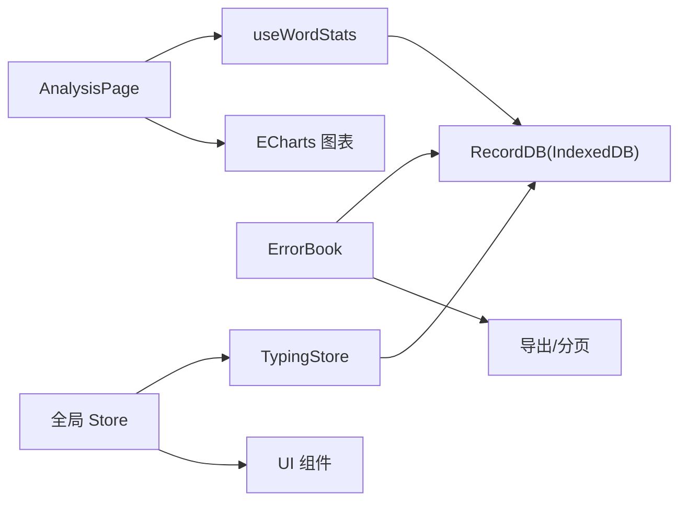

# 学习建议制定

<cite>
**本文引用的文件**
- [README.md](file://README.md)
- [package.json](file://package.json)
- [src/pages/Analysis/index.tsx](file://src/pages/Analysis/index.tsx)
- [src/pages/Analysis/hooks/useWordStats.ts](file://src/pages/Analysis/hooks/useWordStats.ts)
- [src/utils/db/index.ts](file://src/utils/db/index.ts)
- [src/utils/db/record.ts](file://src/utils/db/record.ts)
- [src/pages/ErrorBook/index.tsx](file://src/pages/ErrorBook/index.tsx)
- [src/pages/Typing/store/index.ts](file://src/pages/Typing/store/index.ts)
- [src/store/index.ts](file://src/store/index.ts)
- [src/components/EnhancedPromotionModal/index.tsx](file://src/components/EnhancedPromotionModal/index.tsx)
- [src/pages/Gallery-N/DictRequest.tsx](file://src/pages/Gallery-N/DictRequest.tsx)
- [src/pages/Mobile/index.tsx](file://src/pages/Mobile/index.tsx)
- [public/dicts/ai_machine_learning.json](file://public/dicts/ai_machine_learning.json)
- [public/dicts/ai_for_science.json](file://public/dicts/ai_for_science.json)
</cite>

## 目录

1. [简介](#简介)
2. [项目结构](#项目结构)
3. [核心组件](#核心组件)
4. [架构总览](#架构总览)
5. [详细组件分析](#详细组件分析)
6. [依赖关系分析](#依赖关系分析)
7. [性能考虑](#性能考虑)
8. [故障排查指南](#故障排查指南)
9. [结论](#结论)
10. [附录](#附录)

## 简介

本文件围绕“学习建议制定”的智能化功能展开，聚焦于如何基于用户练习数据（如打字速度、正确率、错误按键分布、逐字母错误模式等）生成可执行的学习策略建议，包括：

- 难度调整与练习强度建议
- 弱点识别与针对性训练
- 学习进度跟踪与能力评估
- 个性化学习路径规划
- 学习效果预测与目标设定
- 动态调整策略与用户反馈整合

当前代码库已具备完整的数据采集与分析能力（IndexedDB 记录、WPM/正确率统计、按键错误排行、逐字母错误聚合），为后续扩展“智能推荐系统”提供了坚实的数据基础。

## 项目结构

从学习建议制定的角度，关键模块包括：

- 数据采集与持久化：打字过程中的单词级记录、章节级记录
- 数据分析与可视化：按日聚合、热力图、趋势图、按键错误排行
- 错题与错误模式：按单词分组统计错误次数、逐字母错误映射
- 学习状态与配置：当前词典、章节、复习模式、音标/发音设置等
- 推荐入口与引导：推广 QwertyLearner.ai 的增强版能力

图表来源

- [src/utils/db/index.ts](file://src/utils/db/index.ts#L1-L136)
- [src/pages/Analysis/index.tsx](file://src/pages/Analysis/index.tsx#L1-L82)
- [src/pages/Analysis/hooks/useWordStats.ts](file://src/pages/Analysis/hooks/useWordStats.ts#L1-L132)
- [src/pages/ErrorBook/index.tsx](file://src/pages/ErrorBook/index.tsx#L1-L136)
- [src/pages/Typing/store/index.ts](file://src/pages/Typing/store/index.ts#L1-L227)
- [src/store/index.ts](file://src/store/index.ts#L1-L118)
- [src/components/EnhancedPromotionModal/index.tsx](file://src/components/EnhancedPromotionModal/index.tsx#L87-L168)
- [src/pages/Gallery-N/DictRequest.tsx](file://src/pages/Gallery-N/DictRequest.tsx#L55-L75)

章节来源

- [README.md](file://README.md#L1-L332)
- [package.json](file://package.json#L1-L128)

## 核心组件

- 数据模型与持久化
  - 单词记录：包含单词、时间戳、词典标识、章节、逐字母耗时序列、错误次数、逐字母错误映射
  - 章节记录：包含章节总时长、正确/错误计数、单词总数、正确单词索引集合、单词记录 ID 列表
  - 数据库版本演进：支持按词典+章节复合索引查询，便于按范围聚合
- 分析与统计
  - 按日聚合练习次数、去重词数、WPM、正确率、按键错误次数排行
  - 逐字母错误映射：用于识别特定字母键位的错误倾向
- 错题与错误模式
  - 按单词分组统计错误次数，支持排序、分页、导出
  - 展示逐词的错误详情，辅助定位薄弱环节
- 学习状态与配置
  - 当前词典、章节、复习模式、音标/发音开关、主题模式等
- 推荐与引导
  - 通过推广弹窗与词典请求入口，引导用户探索增强版 AI 能力

章节来源

- [src/utils/db/record.ts](file://src/utils/db/record.ts#L1-L186)
- [src/utils/db/index.ts](file://src/utils/db/index.ts#L1-L136)
- [src/pages/Analysis/hooks/useWordStats.ts](file://src/pages/Analysis/hooks/useWordStats.ts#L1-L132)
- [src/pages/ErrorBook/index.tsx](file://src/pages/ErrorBook/index.tsx#L1-L136)
- [src/pages/Typing/store/index.ts](file://src/pages/Typing/store/index.ts#L1-L227)
- [src/store/index.ts](file://src/store/index.ts#L1-L118)
- [src/components/EnhancedPromotionModal/index.tsx](file://src/components/EnhancedPromotionModal/index.tsx#L87-L168)
- [src/pages/Gallery-N/DictRequest.tsx](file://src/pages/Gallery-N/DictRequest.tsx#L55-L75)

## 架构总览

学习建议制定的智能流程应覆盖“数据采集—特征提取—模式识别—策略生成—动态调整—反馈闭环”。当前代码库已实现数据采集与基础统计，下一步可在现有基础上扩展推荐算法与可视化。

图表来源

- [src/pages/Typing/store/index.ts](file://src/pages/Typing/store/index.ts#L1-L227)
- [src/utils/db/index.ts](file://src/utils/db/index.ts#L1-L136)
- [src/pages/Analysis/hooks/useWordStats.ts](file://src/pages/Analysis/hooks/useWordStats.ts#L1-L132)
- [src/pages/Analysis/index.tsx](file://src/pages/Analysis/index.tsx#L1-L82)
- [src/pages/ErrorBook/index.tsx](file://src/pages/ErrorBook/index.tsx#L1-L136)

## 详细组件分析

### 数据采集与持久化（RecordDB）

- 单词记录字段：word、timeStamp、dict、chapter、timing（逐字母耗时差）、wrongCount、mistakes（逐字母错误映射）
- 章节记录字段：dict、chapter、timeStamp、time、correctCount、wrongCount、wordCount、correctWordIndexes、wordNumber、wordRecordIds
- 写入时机：单词完成时保存 wordRecord；章节结束时保存 chapterRecord；必要时回传记录 ID 以建立关联
- 版本迁移：新增字段（如 wrongCount、mistakes）与复合索引（dict+chapter）保障高效查询

图表来源

- [src/utils/db/record.ts](file://src/utils/db/record.ts#L1-L186)
- [src/utils/db/index.ts](file://src/utils/db/index.ts#L1-L136)

章节来源

- [src/utils/db/record.ts](file://src/utils/db/record.ts#L1-L186)
- [src/utils/db/index.ts](file://src/utils/db/index.ts#L1-L136)

### 分析与统计（useWordStats）

- 时间范围聚合：按日统计练习次数、去重词数、WPM、正确率
- 键位错误排行：将逐字母错误映射统一为大写键名，统计出现频次
- 空数据处理：当范围内无记录时返回空状态，避免渲染异常

图表来源

- [src/pages/Analysis/hooks/useWordStats.ts](file://src/pages/Analysis/hooks/useWordStats.ts#L1-L132)

章节来源

- [src/pages/Analysis/hooks/useWordStats.ts](file://src/pages/Analysis/hooks/useWordStats.ts#L1-L132)
- [src/pages/Analysis/index.tsx](file://src/pages/Analysis/index.tsx#L1-L82)

### 错题与错误模式（ErrorBook）

- 查询 wrongCount > 0 的单词记录，按 word+dict 分组
- 统计每组的总错误次数，支持升/降序排序
- 支持分页与导出，便于用户复盘与导出学习报告

图表来源

- [src/pages/ErrorBook/index.tsx](file://src/pages/ErrorBook/index.tsx#L1-L136)
- [src/utils/db/index.ts](file://src/utils/db/index.ts#L1-L136)

章节来源

- [src/pages/ErrorBook/index.tsx](file://src/pages/ErrorBook/index.tsx#L1-L136)

### 学习状态与配置（TypingStore 与 Store）

- TypingStore：维护打字过程中的计时、正确率、WPM、逐词输入日志（含逐字母错误映射），并在章节结束时保存记录
- Store：管理当前词典、章节、复习模式、音标/发音设置、主题模式等全局配置

图表来源

- [src/pages/Typing/store/index.ts](file://src/pages/Typing/store/index.ts#L1-L227)

章节来源

- [src/pages/Typing/store/index.ts](file://src/pages/Typing/store/index.ts#L1-L227)
- [src/store/index.ts](file://src/store/index.ts#L1-L118)

### 推荐与引导（推广弹窗与词典请求）

- 推广弹窗：介绍 QwertyLearner.ai 的增强能力（AI 智能词库、文章练习等）
- 词典请求入口：提示用户上传自定义词典，打造专属学习词库

章节来源

- [src/components/EnhancedPromotionModal/index.tsx](file://src/components/EnhancedPromotionModal/index.tsx#L87-L168)
- [src/pages/Gallery-N/DictRequest.tsx](file://src/pages/Gallery-N/DictRequest.tsx#L55-L75)

## 依赖关系分析

- 数据依赖：TypingStore 依赖 IndexedDB（RecordDB）进行持久化；Analysis 与 ErrorBook 依赖 useWordStats 与 db 查询接口
- 可视化依赖：Analysis 页使用 ECharts 等图表库进行热力图与趋势图展示
- 配置依赖：Store 提供全局配置，影响 UI 行为与默认学习参数

图表来源

- [src/pages/Typing/store/index.ts](file://src/pages/Typing/store/index.ts#L1-L227)
- [src/utils/db/index.ts](file://src/utils/db/index.ts#L1-L136)
- [src/pages/Analysis/hooks/useWordStats.ts](file://src/pages/Analysis/hooks/useWordStats.ts#L1-L132)
- [src/pages/Analysis/index.tsx](file://src/pages/Analysis/index.tsx#L1-L82)
- [src/pages/ErrorBook/index.tsx](file://src/pages/ErrorBook/index.tsx#L1-L136)
- [package.json](file://package.json#L1-L128)

章节来源

- [package.json](file://package.json#L1-L128)

## 性能考虑

- 数据库查询优化：利用复合索引（dict+chapter）减少扫描范围，提升按词典/章节聚合效率
- 前端渲染优化：Analysis 与 ErrorBook 采用分页与懒加载，避免一次性渲染大量数据
- 统计计算：useWordStats 已做按日聚合与去重处理，建议在服务端或后台任务中缓存热点统计，降低前端压力
- 图表渲染：ECharts 渲染大数据集时注意虚拟化与采样策略

## 故障排查指南

- 无练习数据
  - 现象：Analysis 页显示“暂无练习数据”
  - 排查：确认是否已完成至少一次打字练习；检查 IndexedDB 是否成功写入
- 错误按键排行为空
  - 现象：按键错误排行无数据
  - 排查：确认打字过程中是否产生错误；检查 mistakes 字段是否正确写入
- 错题本未显示
  - 现象：错题本无记录
  - 排查：确认 wrongCount 是否大于 0；检查分组逻辑与数据库查询条件
- 导出失败
  - 现象：导出按钮不可用或导出异常
  - 排查：检查导出模块依赖与权限；确认数据格式正确

章节来源

- [src/pages/Analysis/index.tsx](file://src/pages/Analysis/index.tsx#L1-L82)
- [src/pages/ErrorBook/index.tsx](file://src/pages/ErrorBook/index.tsx#L1-L136)
- [src/utils/db/index.ts](file://src/utils/db/index.ts#L1-L136)

## 结论

当前代码库已具备完善的学习数据采集与基础分析能力，为“学习建议制定”的智能化功能奠定了良好基础。下一步可在此基础上引入：

- 错误模式识别与薄弱环节分析算法
- 个性化难度调整与练习强度建议
- 学习进度跟踪与能力评估指标
- 学习效果预测模型与目标设定算法
- 动态调整策略与用户反馈整合机制

## 附录

### 学习建议制定的算法扩展清单（面向开发者）

- 错误模式识别
  - 逐字母错误分布聚类，识别高频错误键位与手型模式
  - 基于 mistakes 字段构建字母-错误映射矩阵，统计错误转移概率
- 弱点识别与针对性训练
  - 按单词维度统计错误次数，结合词频与难度，筛选高风险词汇
  - 按键维度统计错误次数，识别特定键位的薄弱区域
- 难度调整与练习强度建议
  - 基于 WPM 与正确率趋势，动态调整章节长度与单词难度
  - 根据错误率阈值触发“专项强化”模式（如重复练习某类单词/键位）
- 学习进度跟踪与能力评估
  - 定义阶段性目标（如周/月 WPM 提升、正确率达标）
  - 构建能力画像（字母键位熟练度、单词识别速度、拼写稳定性）
- 个性化学习路径规划
  - 基于历史表现与薄弱环节，生成“优先级训练计划”
  - 结合词典标签与用户偏好，推荐适合的词库组合
- 学习效果预测与目标设定
  - 基于时间序列趋势（WPM/正确率）拟合短期预测模型
  - 设定可量化的阶段性目标（如“X 天内 WPM 达到 Y”）
- 动态调整与反馈整合
  - 根据用户反馈（如“太难/太简单”）与近期表现，自动调节训练强度
  - 引入 A/B 测试框架，对比不同策略的效果

### 词典与数据来源（供策略扩展参考）

- AI 相关词库：机器学习、深度学习、数据科学等专业术语
- 词典文件示例：包含英文术语与中文释义，可用于构建术语词库与练习素材

章节来源

- [public/dicts/ai_machine_learning.json](file://public/dicts/ai_machine_learning.json#L1-L276)
- [public/dicts/ai_for_science.json](file://public/dicts/ai_for_science.json#L540-L2507)
