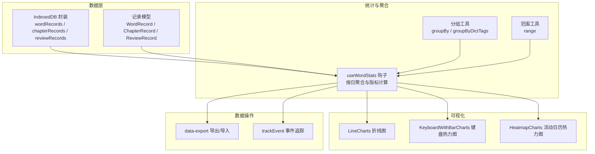
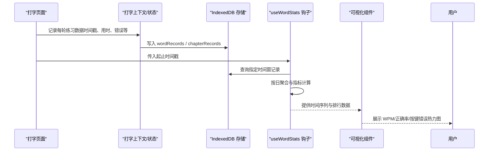
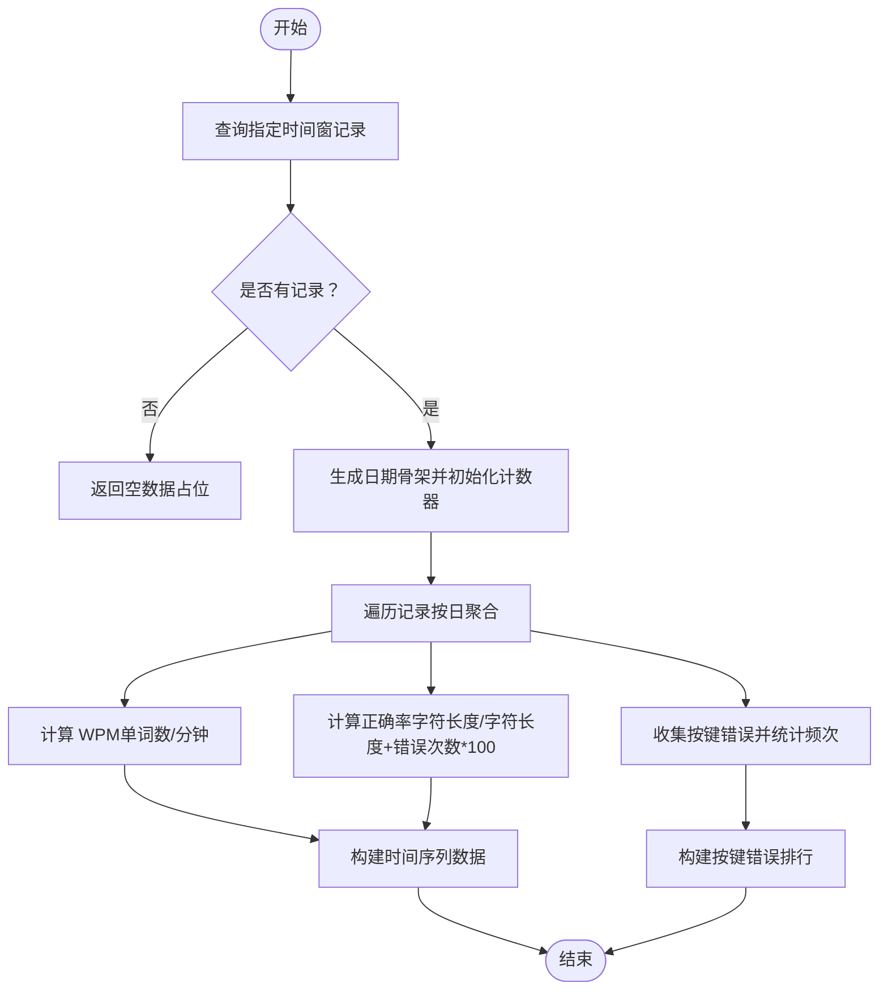
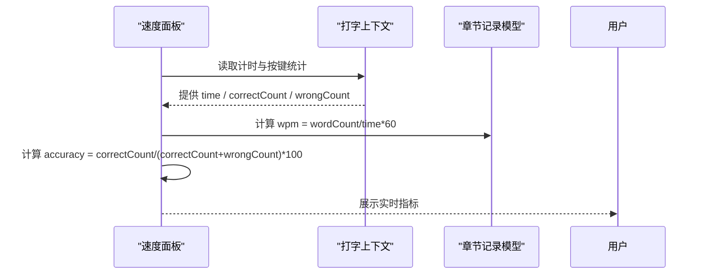
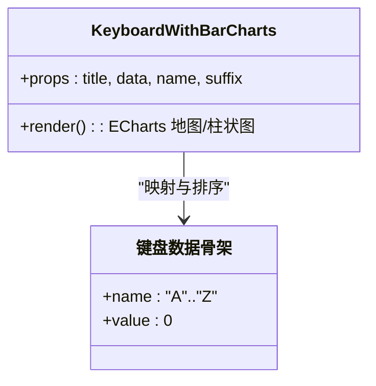
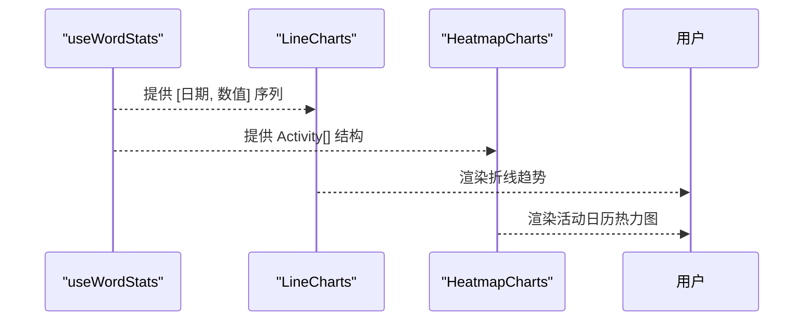
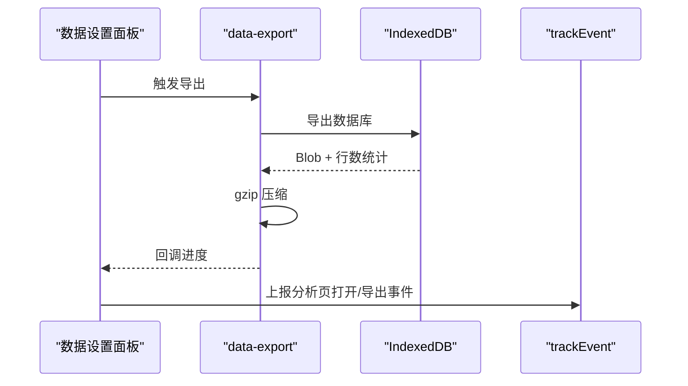
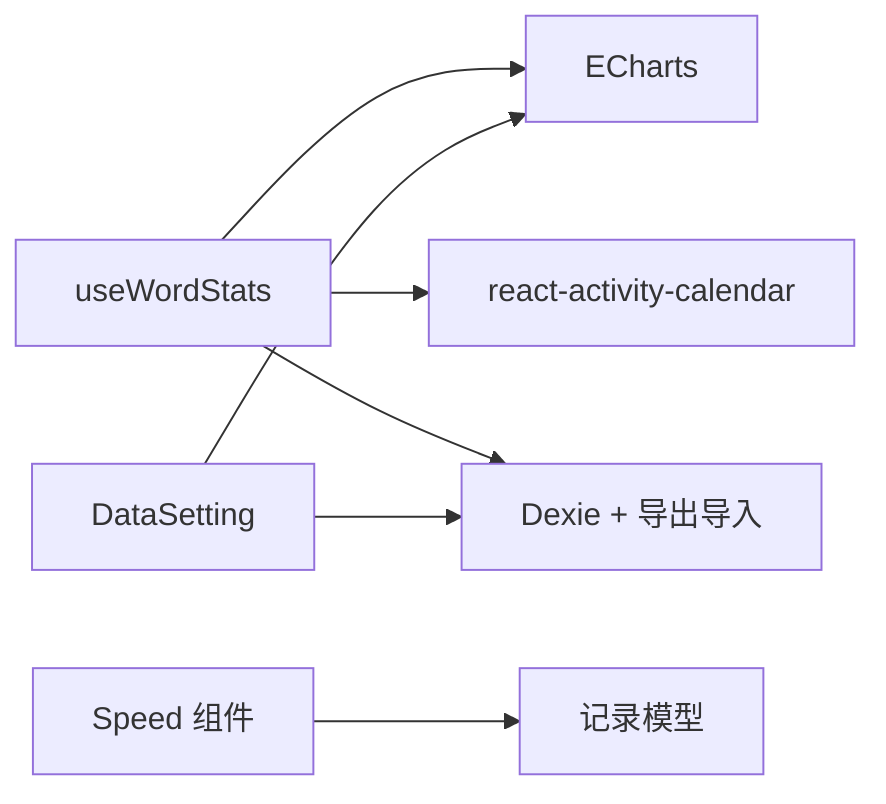

# 数据分析算法

<cite>
**本文引用的文件**
- [src/pages/Analysis/index.tsx](file://src/pages/Analysis/index.tsx)
- [src/pages/Analysis/hooks/useWordStats.ts](file://src/pages/Analysis/hooks/useWordStats.ts)
- [src/pages/Analysis/components/LineCharts.tsx](file://src/pages/Analysis/components/LineCharts.tsx)
- [src/pages/Analysis/components/KeyboardWithBarCharts.tsx](file://src/pages/Analysis/components/KeyboardWithBarCharts.tsx)
- [src/pages/Analysis/components/HeatmapCharts.tsx](file://src/pages/Analysis/components/HeatmapCharts.tsx)
- [src/utils/db/index.ts](file://src/utils/db/index.ts)
- [src/utils/db/record.ts](file://src/utils/db/record.ts)
- [src/utils/db/data-export.ts](file://src/utils/db/data-export.ts)
- [src/pages/Typing/components/Speed/index.tsx](file://src/pages/Typing/components/Speed/index.tsx)
- [src/utils/groupBy.ts](file://src/utils/groupBy.ts)
- [src/utils/range.ts](file://src/utils/range.ts)
- [src/pages/Typing/components/AnalysisButton/index.tsx](file://src/pages/Typing/components/AnalysisButton/index.tsx)
- [src/pages/Mobile/index.tsx](file://src/pages/Mobile/index.tsx)
- [src/utils/trackEvent.ts](file://src/utils/trackEvent.ts)
</cite>

## 目录

1. [简介](#简介)
2. [项目结构](#项目结构)
3. [核心组件](#核心组件)
4. [架构总览](#架构总览)
5. [详细组件分析](#详细组件分析)
6. [依赖关系分析](#依赖关系分析)
7. [性能考量](#性能考量)
8. [故障排查指南](#故障排查指南)
9. [结论](#结论)
10. [附录](#附录)

## 简介

本技术文档聚焦于“数据分析算法”，围绕速度统计（WPM）、正确率计算、错误频率分析等核心指标，系统梳理时间序列聚合、趋势分析与统计指标的实现逻辑；同时覆盖数据预处理、异常值检测与清洗策略，以及时间窗口选择、滑动平均与趋势预测模型的扩展思路。文档还提供性能优化、缓存策略与实时数据处理建议，并给出算法扩展与自定义分析指标的实践指导。

## 项目结构

本项目的数据分析能力主要分布在以下模块：

- 数据存储与模型：IndexedDB 封装与记录模型（章节、单词、复习记录）
- 实时统计与聚合：按日聚合的 WPM、正确率、按键错误排行
- 可视化展示：折线图、键盘热力图、活动日历热力图
- 数据导出与导入：数据库压缩导出、进度回调与事件追踪

**图表来源**

- [src/utils/db/index.ts](file://src/utils/db/index.ts#L16-L46)
- [src/utils/db/record.ts](file://src/utils/db/record.ts#L1-L186)
- [src/pages/Analysis/hooks/useWordStats.ts](file://src/pages/Analysis/hooks/useWordStats.ts#L1-L132)
- [src/pages/Analysis/components/LineCharts.tsx](file://src/pages/Analysis/components/LineCharts.tsx#L1-L88)
- [src/pages/Analysis/components/KeyboardWithBarCharts.tsx](file://src/pages/Analysis/components/KeyboardWithBarCharts.tsx#L1-L182)
- [src/pages/Analysis/components/HeatmapCharts.tsx](file://src/pages/Analysis/components/HeatmapCharts.tsx#L1-L16)
- [src/utils/db/data-export.ts](file://src/utils/db/data-export.ts#L1-L42)
- [src/utils/trackEvent.ts](file://src/utils/trackEvent.ts#L1-L17)

**章节来源**

- [src/pages/Analysis/index.tsx](file://src/pages/Analysis/index.tsx#L62-L81)
- [src/pages/Analysis/hooks/useWordStats.ts](file://src/pages/Analysis/hooks/useWordStats.ts#L1-L132)
- [src/pages/Analysis/components/LineCharts.tsx](file://src/pages/Analysis/components/LineCharts.tsx#L1-L88)
- [src/pages/Analysis/components/KeyboardWithBarCharts.tsx](file://src/pages/Analysis/components/KeyboardWithBarCharts.tsx#L1-L182)
- [src/pages/Analysis/components/HeatmapCharts.tsx](file://src/pages/Analysis/components/HeatmapCharts.tsx#L1-L16)
- [src/utils/db/index.ts](file://src/utils/db/index.ts#L16-L46)
- [src/utils/db/record.ts](file://src/utils/db/record.ts#L1-L186)
- [src/utils/db/data-export.ts](file://src/utils/db/data-export.ts#L1-L42)
- [src/utils/trackEvent.ts](file://src/utils/trackEvent.ts#L1-L17)

## 核心组件

- 数据模型与存储
  - IndexedDB 版本迁移与表结构定义，包含 wordRecords、chapterRecords、reviewRecords
  - 记录类提供字段与派生指标（如单词记录的总耗时、章节记录的 WPM、正确率等）
- 统计与聚合钩子
  - useWordStats：按日聚合练习次数、去重词数、WPM、正确率、按键错误排行
  - 通过 IndexedDB 查询指定时间窗内的记录，构造日期骨架并累加统计
- 可视化组件
  - 折线图：时间序列趋势展示（WPM、正确率）
  - 键盘热力图：按键错误频率热力图与柱状图切换
  - 活动日历热力图：练习强度热力图
- 数据导出与事件追踪
  - 数据库导出（gzip 压缩），带进度回调
  - 事件追踪（分析页打开、数据导出等）

**章节来源**

- [src/utils/db/index.ts](file://src/utils/db/index.ts#L16-L46)
- [src/utils/db/record.ts](file://src/utils/db/record.ts#L1-L186)
- [src/pages/Analysis/hooks/useWordStats.ts](file://src/pages/Analysis/hooks/useWordStats.ts#L1-L132)
- [src/pages/Analysis/components/LineCharts.tsx](file://src/pages/Analysis/components/LineCharts.tsx#L1-L88)
- [src/pages/Analysis/components/KeyboardWithBarCharts.tsx](file://src/pages/Analysis/components/KeyboardWithBarCharts.tsx#L1-L182)
- [src/pages/Analysis/components/HeatmapCharts.tsx](file://src/pages/Analysis/components/HeatmapCharts.tsx#L1-L16)
- [src/utils/db/data-export.ts](file://src/utils/db/data-export.ts#L1-L42)
- [src/utils/trackEvent.ts](file://src/utils/trackEvent.ts#L1-L17)

## 架构总览

下图展示了从前端数据采集、入库、统计聚合到可视化的完整链路。

**图表来源**

- [src/pages/Typing/components/Speed/index.tsx](file://src/pages/Typing/components/Speed/index.tsx#L1-L23)
- [src/utils/db/index.ts](file://src/utils/db/index.ts#L16-L46)
- [src/pages/Analysis/hooks/useWordStats.ts](file://src/pages/Analysis/hooks/useWordStats.ts#L1-L132)
- [src/pages/Analysis/components/LineCharts.tsx](file://src/pages/Analysis/components/LineCharts.tsx#L1-L88)
- [src/pages/Analysis/components/KeyboardWithBarCharts.tsx](file://src/pages/Analysis/components/KeyboardWithBarCharts.tsx#L1-L182)

## 详细组件分析

### 组件 A：按日聚合与统计指标（useWordStats）

- 输入：起始与结束时间戳
- 输出：练习次数、去重词数、WPM、正确率、按键错误排行
- 关键实现要点
  - 日期骨架生成：基于起止时间生成每日字符串键，初始化计数器
  - 日粒度聚合：遍历记录，按日期累加练习次数、总时长、错误次数、按键错误集合
  - 指标计算：
    - WPM：单词数（不去重）/ 总分钟数（四舍五入）
    - 正确率：字符总长度 / (字符总长度 + 错误次数) × 100（四舍五入）
    - 键盘错误排行：按键名统一转大写后频次统计
  - 可视化数据格式：折线图为 [日期, 数值]，键盘热力图为 { name, value }

**图表来源**

- [src/pages/Analysis/hooks/useWordStats.ts](file://src/pages/Analysis/hooks/useWordStats.ts#L1-L132)

**章节来源**

- [src/pages/Analysis/hooks/useWordStats.ts](file://src/pages/Analysis/hooks/useWordStats.ts#L1-L132)

### 组件 B：速度统计（WPM）与正确率（实时）

- 实时 WPM 与正确率来源于打字上下文中的计时与按键统计
- 字段含义
  - 时间：当前计时
  - 输入数：正确数 + 错误数
  - WPM：基于章节记录的派生指标（单词数/秒 ×60）
  - 正确数：正确按键次数
  - 正确率：正确按键次数 /（正确按键次数 + 错误按键次数）× 100

**图表来源**

- [src/pages/Typing/components/Speed/index.tsx](file://src/pages/Typing/components/Speed/index.tsx#L1-L23)
- [src/utils/db/record.ts](file://src/utils/db/record.ts#L105-L116)

**章节来源**

- [src/pages/Typing/components/Speed/index.tsx](file://src/pages/Typing/components/Speed/index.tsx#L1-L23)
- [src/utils/db/record.ts](file://src/utils/db/record.ts#L105-L116)

### 组件 C：错误频率分析与键盘热力图

- 键盘热力图数据来源：按键错误排行（name/value）
- 组件特性：支持地图热力图与柱状图切换，视觉映射区间随最高频次动态调整
- 数据预处理：按键名统一大写，缺失按键补零

**图表来源**

- [src/pages/Analysis/components/KeyboardWithBarCharts.tsx](file://src/pages/Analysis/components/KeyboardWithBarCharts.tsx#L1-L182)

**章节来源**

- [src/pages/Analysis/components/KeyboardWithBarCharts.tsx](file://src/pages/Analysis/components/KeyboardWithBarCharts.tsx#L1-L182)

### 组件 D：时间序列趋势与活动日历热力图

- 折线图：X 轴为时间轴，Y 轴为数值（WPM/正确率），支持平滑曲线与工具提示
- 活动日历热力图：基于日期与强度的活动图，用于展示练习强度分布

**图表来源**

- [src/pages/Analysis/hooks/useWordStats.ts](file://src/pages/Analysis/hooks/useWordStats.ts#L1-L132)
- [src/pages/Analysis/components/LineCharts.tsx](file://src/pages/Analysis/components/LineCharts.tsx#L1-L88)
- [src/pages/Analysis/components/HeatmapCharts.tsx](file://src/pages/Analysis/components/HeatmapCharts.tsx#L1-L16)

**章节来源**

- [src/pages/Analysis/components/LineCharts.tsx](file://src/pages/Analysis/components/LineCharts.tsx#L1-L88)
- [src/pages/Analysis/components/HeatmapCharts.tsx](file://src/pages/Analysis/components/HeatmapCharts.tsx#L1-L16)

### 组件 E：数据导出与事件追踪

- 数据导出：导出 IndexedDB 为 Blob，gzip 压缩，文件命名含日期，回调进度
- 事件追踪：分析页打开、数据导出等事件上报

**图表来源**

- [src/pages/Typing/components/Setting/DataSetting.tsx](file://src/pages/Typing/components/Setting/DataSetting.tsx#L1-L54)
- [src/utils/db/data-export.ts](file://src/utils/db/data-export.ts#L1-L42)
- [src/utils/trackEvent.ts](file://src/utils/trackEvent.ts#L1-L17)

**章节来源**

- [src/utils/db/data-export.ts](file://src/utils/db/data-export.ts#L1-L42)
- [src/utils/trackEvent.ts](file://src/utils/trackEvent.ts#L1-L17)

## 依赖关系分析

- 组件耦合
  - useWordStats 依赖 IndexedDB 与 dayjs，输出标准化时间序列与排行数据
  - 可视化组件仅消费数据，不直接依赖存储层
  - 数据导出与事件追踪作为横切关注点，被 UI 与统计模块间接调用
- 外部依赖
  - ECharts：折线图、地图/热力图、工具箱与视觉映射
  - react-activity-calendar：活动日历热力图
  - Dexie 与 dexie-export-import：IndexedDB 封装与导出导入

**图表来源**

- [src/pages/Analysis/hooks/useWordStats.ts](file://src/pages/Analysis/hooks/useWordStats.ts#L1-L132)
- [src/pages/Analysis/components/LineCharts.tsx](file://src/pages/Analysis/components/LineCharts.tsx#L1-L88)
- [src/pages/Analysis/components/KeyboardWithBarCharts.tsx](file://src/pages/Analysis/components/KeyboardWithBarCharts.tsx#L1-L182)
- [src/pages/Analysis/components/HeatmapCharts.tsx](file://src/pages/Analysis/components/HeatmapCharts.tsx#L1-L16)
- [src/utils/db/data-export.ts](file://src/utils/db/data-export.ts#L1-L42)
- [src/utils/db/record.ts](file://src/utils/db/record.ts#L1-L186)

**章节来源**

- [src/pages/Analysis/hooks/useWordStats.ts](file://src/pages/Analysis/hooks/useWordStats.ts#L1-L132)
- [src/pages/Analysis/components/LineCharts.tsx](file://src/pages/Analysis/components/LineCharts.tsx#L1-L88)
- [src/pages/Analysis/components/KeyboardWithBarCharts.tsx](file://src/pages/Analysis/components/KeyboardWithBarCharts.tsx#L1-L182)
- [src/pages/Analysis/components/HeatmapCharts.tsx](file://src/pages/Analysis/components/HeatmapCharts.tsx#L1-L16)
- [src/utils/db/data-export.ts](file://src/utils/db/data-export.ts#L1-L42)
- [src/utils/db/record.ts](file://src/utils/db/record.ts#L1-L186)

## 性能考量

- 时间复杂度
  - 按日聚合：O(N)，N 为时间窗内记录条数
  - 键盘错误排行：O(M)，M 为错误按键数量
  - 折线图渲染：ECharts 渲染开销与数据点数量线性相关
- 内存与存储
  - 使用 IndexedDB 分版本管理，避免频繁迁移导致的性能抖动
  - 导出阶段采用流式 Blob 与 gzip 压缩，降低传输体积
- 可视化优化
  - 折线图启用平滑曲线与响应式尺寸调整
  - 键盘热力图支持地图/柱状图切换，减少一次性渲染压力
- 实时性
  - 打字实时指标来自上下文状态，避免额外查询
  - 分页/懒加载策略可应用于大数据集的可视化渲染

[本节为通用性能讨论，无需列出具体文件来源]

## 故障排查指南

- 数据为空或指标异常
  - 检查时间窗是否正确传入，确认 IndexedDB 中是否存在对应记录
  - 确认 WPM/正确率计算分母是否为零（无字符或无错误次数）
- 可视化不显示或空白
  - 确认 ECharts 已注册主题与组件，容器尺寸变化后触发 resize
  - 键盘热力图需确保按键名大小写一致（统一转大写）
- 导出失败或进度异常
  - 检查导出回调是否被正确调用，确认 Blob 文本解码与 gzip 压缩流程
- 事件追踪无效
  - 确认第三方分析 SDK 初始化与 window.gtag 可用性

**章节来源**

- [src/pages/Analysis/hooks/useWordStats.ts](file://src/pages/Analysis/hooks/useWordStats.ts#L1-L132)
- [src/pages/Analysis/components/LineCharts.tsx](file://src/pages/Analysis/components/LineCharts.tsx#L1-L88)
- [src/pages/Analysis/components/KeyboardWithBarCharts.tsx](file://src/pages/Analysis/components/KeyboardWithBarCharts.tsx#L1-L182)
- [src/utils/db/data-export.ts](file://src/utils/db/data-export.ts#L1-L42)
- [src/utils/trackEvent.ts](file://src/utils/trackEvent.ts#L1-L17)

## 结论

本项目以 useWordStats 为核心，实现了从原始记录到时间序列与排行指标的高效聚合，并通过多种可视化组件直观呈现用户的学习轨迹。通过合理的数据模型设计、工具函数与外部可视化库的配合，系统在保证易用性的同时具备良好的扩展性与可维护性。后续可在时间窗口选择、滑动平均与趋势预测方面进一步增强，以满足更复杂的分析需求。

[本节为总结性内容，无需列出具体文件来源]

## 附录

### 数据预处理与清洗策略

- 缺失值处理
  - 日期骨架初始化时为缺失日期提供零计数，避免空洞导致的趋势断层
- 异常值检测
  - 可基于标准差或分位数对 WPM/正确率进行离群检测，剔除极端波动
- 数据一致性
  - 统一按键名大小写，确保错误排行的准确性
- 分组与范围工具
  - 使用 groupBy 与 groupByDictTags 进行按词典/标签的聚合
  - 使用 range 生成连续整数序列，辅助时间轴对齐

**章节来源**

- [src/pages/Analysis/hooks/useWordStats.ts](file://src/pages/Analysis/hooks/useWordStats.ts#L1-L132)
- [src/utils/groupBy.ts](file://src/utils/groupBy.ts#L1-L27)
- [src/utils/range.ts](file://src/utils/range.ts#L1-L36)

### 时间窗口选择与滑动平均

- 时间窗口
  - 支持按日、周、月聚合；通过起止时间戳灵活切换
- 滑动平均
  - 可在现有时间序列基础上增加 N 日滑动均值序列，平滑短期波动
- 趋势预测
  - 基于线性回归或指数平滑法对 WPM/正确率进行短期预测，辅助学习计划制定

[本节为概念性扩展建议，无需列出具体文件来源]

### 算法扩展与自定义指标

- 新增指标
  - 在 useWordStats 中添加新的聚合维度（如按词典、按章节）
  - 在记录模型中新增派生指标（如平均单字耗时、错误按键组合）
- 可视化扩展
  - 增加柱状图、散点图、仪表盘等组件，丰富分析维度
- 实时处理
  - 在打字上下文中引入增量更新，减少全量重算成本
- 缓存策略
  - 对常用时间窗结果进行内存缓存，结合失效策略避免陈旧数据

[本节为概念性扩展建议，无需列出具体文件来源]
