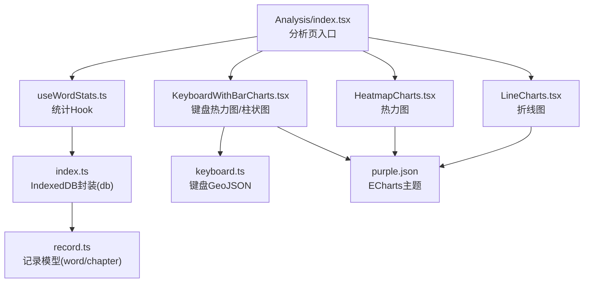
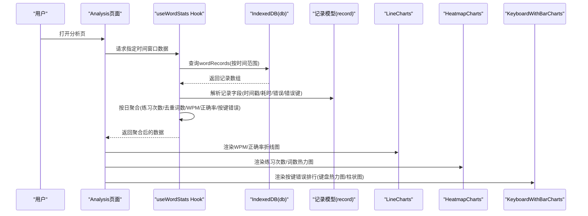
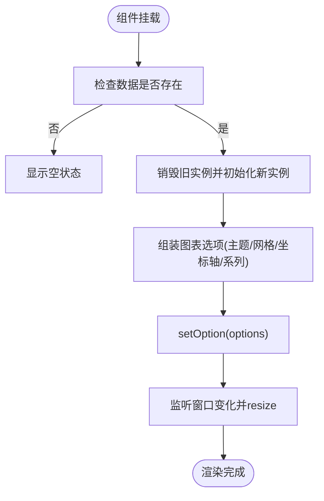
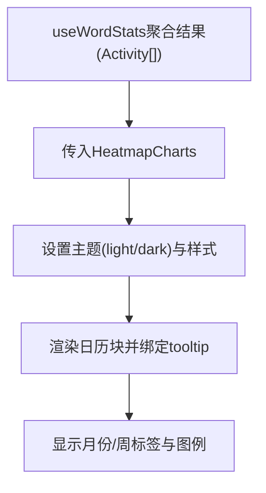
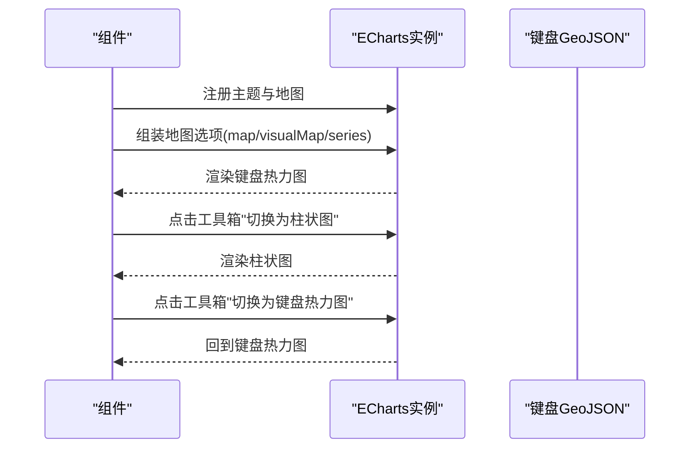
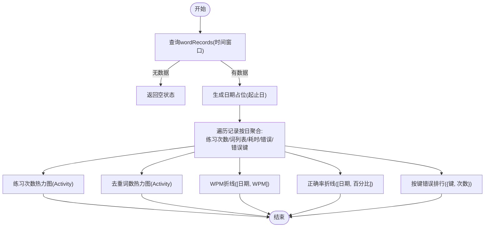
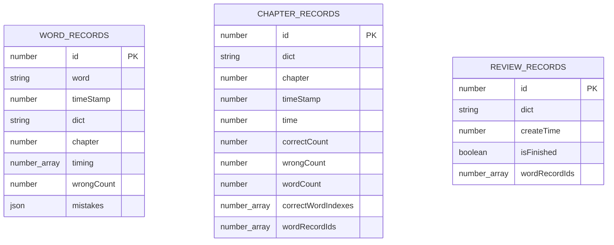
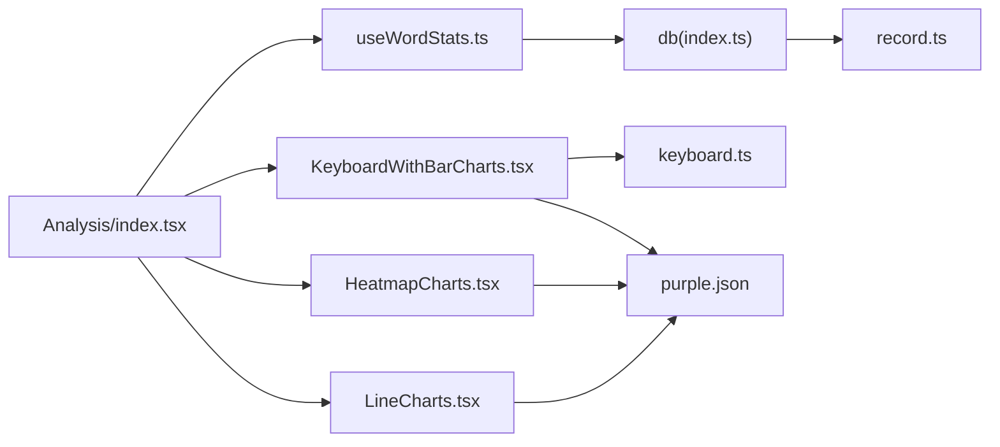

# 数据分析系统

<cite>
**本文引用的文件**
- [README.md](file://README.md)
- [Analysis/index.tsx](file://src/pages/Analysis/index.tsx)
- [LineCharts.tsx](file://src/pages/Analysis/components/LineCharts.tsx)
- [HeatmapCharts.tsx](file://src/pages/Analysis/components/HeatmapCharts.tsx)
- [KeyboardWithBarCharts.tsx](file://src/pages/Analysis/components/KeyboardWithBarCharts.tsx)
- [keyboard.ts](file://src/pages/Analysis/components/keyboard.ts)
- [useWordStats.ts](file://src/pages/Analysis/hooks/useWordStats.ts)
- [index.ts](file://src/utils/db/index.ts)
- [record.ts](file://src/utils/db/record.ts)
- [index.ts](file://src/store/index.ts)
- [purple.json](file://src/pages/Analysis/components/purple.json)
- [DataSetting.tsx](file://src/pages/Typing/components/Setting/DataSetting.tsx)
</cite>

## 目录

1. [简介](#简介)
2. [项目结构](#项目结构)
3. [核心组件](#核心组件)
4. [架构总览](#架构总览)
5. [组件详解](#组件详解)
6. [依赖关系分析](#依赖关系分析)
7. [性能与优化](#性能与优化)
8. [故障排查指南](#故障排查指南)
9. [结论](#结论)
10. [附录](#附录)

## 简介

本文件面向数据分析系统的使用者与开发者，系统性梳理统计图表的实现机制与数据流，覆盖折线图、热力图、键盘分布图等可视化组件的设计原理与交互方式；解释从数据采集、处理到展示的完整流程，包括速度统计（WPM）、正确率分析、错误模式识别等；阐述数据聚合算法、时间序列分析与趋势展示方法；并提供数据隐私保护、性能优化与用户体验设计建议，以及结果解读与学习建议制定方法。

## 项目结构

数据分析页面位于 Analysis 页面，采用模块化组件组织，核心包括：

- 分析页入口：负责时间窗口选择、调用统计 Hook、渲染各类图表容器
- 图表组件：折线图、热力图、键盘热力图/柱状图
- 统计 Hook：从 IndexedDB 读取记录，按天聚合并产出指标序列
- 数据层：IndexedDB 表结构与记录模型定义
- 主题与主题注册：ECharts 自定义主题与暗色模式联动

**图表来源**

- [Analysis/index.tsx](file://src/pages/Analysis/index.tsx#L1-L82)
- [useWordStats.ts](file://src/pages/Analysis/hooks/useWordStats.ts#L1-L132)
- [index.ts](file://src/utils/db/index.ts#L1-L136)
- [record.ts](file://src/utils/db/record.ts#L1-L186)
- [LineCharts.tsx](file://src/pages/Analysis/components/LineCharts.tsx#L1-L88)
- [HeatmapCharts.tsx](file://src/pages/Analysis/components/HeatmapCharts.tsx#L1-L58)
- [KeyboardWithBarCharts.tsx](file://src/pages/Analysis/components/KeyboardWithBarCharts.tsx#L1-L182)
- [keyboard.ts](file://src/pages/Analysis/components/keyboard.ts#L1-L424)
- [purple.json](file://src/pages/Analysis/components/purple.json#L1-L355)

**章节来源**

- [Analysis/index.tsx](file://src/pages/Analysis/index.tsx#L1-L82)

## 核心组件

- 折线图组件：基于 ECharts，支持时间轴 X 轴、数值 Y 轴、平滑曲线、深浅主题切换、响应式尺寸调整
- 热力图组件：基于 react-activity-calendar，按日聚合练习次数/词数，支持中文化标签与提示
- 键盘热力图/柱状图：基于 ECharts 地图能力，注册键盘 GeoJSON，支持地图与柱状图互切，可视化按键错误次数排行
- 统计 Hook：从 IndexedDB 读取指定时间窗口内的单词记录，按天聚合，计算练习次数、去重词数、WPM、正确率、按键错误排行
- 数据层：IndexedDB 表 wordRecords/chapterRecords，记录模型包含时间戳、字词、耗时数组、错误次数与错误键映射

**章节来源**

- [LineCharts.tsx](file://src/pages/Analysis/components/LineCharts.tsx#L1-L88)
- [HeatmapCharts.tsx](file://src/pages/Analysis/components/HeatmapCharts.tsx#L1-L58)
- [KeyboardWithBarCharts.tsx](file://src/pages/Analysis/components/KeyboardWithBarCharts.tsx#L1-L182)
- [useWordStats.ts](file://src/pages/Analysis/hooks/useWordStats.ts#L1-L132)
- [index.ts](file://src/utils/db/index.ts#L1-L136)
- [record.ts](file://src/utils/db/record.ts#L1-L186)

## 架构总览

整体数据流从“打字练习记录”到“时间聚合统计”，再到“可视化图表展示”。核心路径如下：

**图表来源**

- [Analysis/index.tsx](file://src/pages/Analysis/index.tsx#L36-L71)
- [useWordStats.ts](file://src/pages/Analysis/hooks/useWordStats.ts#L59-L132)
- [index.ts](file://src/utils/db/index.ts#L1-L136)
- [record.ts](file://src/utils/db/record.ts#L1-L186)
- [LineCharts.tsx](file://src/pages/Analysis/components/LineCharts.tsx#L22-L85)
- [HeatmapCharts.tsx](file://src/pages/Analysis/components/HeatmapCharts.tsx#L10-L57)
- [KeyboardWithBarCharts.tsx](file://src/pages/Analysis/components/KeyboardWithBarCharts.tsx#L55-L181)

## 组件详解

### 折线图（LineCharts）

- 设计要点
  - 时间序列：X 轴为时间（日粒度），Y 轴为数值（如 WPM、正确率百分比）
  - 平滑曲线：提升趋势可读性
  - 深浅主题：根据 isOpenDarkModeAtom 切换主题名称
  - 响应式：监听窗口尺寸变化触发 resize
- 关键实现
  - 注册主题与组件：registerTheme、use([...])
  - 初始化与销毁：init/getInstanceByDom/dispose
  - 选项设置：tooltip/grid/xAxis/yAxis/series
  - 文本后缀：正确率显示百分号，WPM 不加后缀

**图表来源**

- [LineCharts.tsx](file://src/pages/Analysis/components/LineCharts.tsx#L12-L85)
- [purple.json](file://src/pages/Analysis/components/purple.json#L1-L355)
- [index.ts](file://src/store/index.ts#L92-L92)

**章节来源**

- [LineCharts.tsx](file://src/pages/Analysis/components/LineCharts.tsx#L1-L88)

### 热力图（HeatmapCharts）

- 设计要点
  - 日维度聚合：将记录按日期聚合为练习次数/去重词数
  - 活动日历：使用 react-activity-calendar 展示日强度热力图
  - 中文化标签：月份、周标签、总计文本、图例文案
  - 工具提示：点击块显示日期与次数
- 关键实现
  - Activity 接口：date/count/level
  - 主题颜色：根据 isOpenDarkModeAtom 切换 light/dark
  - 自定义 renderBlock：绑定 react-tooltip

**图表来源**

- [HeatmapCharts.tsx](file://src/pages/Analysis/components/HeatmapCharts.tsx#L10-L57)
- [useWordStats.ts](file://src/pages/Analysis/hooks/useWordStats.ts#L94-L105)

**章节来源**

- [HeatmapCharts.tsx](file://src/pages/Analysis/components/HeatmapCharts.tsx#L1-L58)

### 键盘分布图（KeyboardWithBarCharts）

- 设计要点
  - 键盘 GeoJSON：keyboard.ts 定义 Q~M 的键位几何
  - 地图热力：注册地图后以热力形式展示按键错误次数
  - 柱状对比：切换为柱状图，横轴为键名，纵轴为错误次数
  - 互切工具箱：提供“切换为键盘热力图/切换为柱状图”
- 关键实现
  - 注册地图：echarts.registerMap('Keyboard', Keyboard)
  - 数据映射：将传入的按键错误数据映射到键盘键位集合
  - 视觉映射：visualMap 控制颜色深浅
  - 工具箱回调：setOption 切换地图/柱状

**图表来源**

- [KeyboardWithBarCharts.tsx](file://src/pages/Analysis/components/KeyboardWithBarCharts.tsx#L14-L181)
- [keyboard.ts](file://src/pages/Analysis/components/keyboard.ts#L1-L424)
- [purple.json](file://src/pages/Analysis/components/purple.json#L1-L355)

**章节来源**

- [KeyboardWithBarCharts.tsx](file://src/pages/Analysis/components/KeyboardWithBarCharts.tsx#L1-L182)
- [keyboard.ts](file://src/pages/Analysis/components/keyboard.ts#L1-L424)

### 统计聚合与时间序列（useWordStats）

- 数据来源：IndexedDB 表 wordRecords，按时间窗口查询
- 聚合逻辑：
  - 日期补全：生成起止时间之间的每日占位
  - 练习次数：按日累加
  - 去重词数：对当日词列表去重计数
  - WPM：总词数（不去重）/ 总时间（分钟）
  - 正确率：总字符数 / (总字符数 + 总错误次数)
  - 键位错误排行：将 mistakes 展平并按键名计数
- 输出格式：
  - 热力图：Activity[]（date/count/level）
  - 折线图：[string, number][]（日期, 数值）
  - 键盘图：{ name: string; value: number }[]（按键, 错误次数）

**图表来源**

- [useWordStats.ts](file://src/pages/Analysis/hooks/useWordStats.ts#L59-L132)

**章节来源**

- [useWordStats.ts](file://src/pages/Analysis/hooks/useWordStats.ts#L1-L132)

### 数据层与记录模型（IndexedDB 与记录类）

- 表结构：wordRecords、chapterRecords、reviewRecords（版本演进）
- 记录模型：
  - WordRecord：word、timeStamp、dict、chapter、timing、wrongCount、mistakes
  - ChapterRecord：dict、chapter、timeStamp、time、correctCount、wrongCount、wordCount、correctWordIndexes、wordRecordIds
- 写入与读取：
  - 写入：useSaveWordRecord/useSaveChapterRecord
  - 读取：db.wordRecords.where(...).between(...).toArray()

**图表来源**

- [index.ts](file://src/utils/db/index.ts#L1-L136)
- [record.ts](file://src/utils/db/record.ts#L1-L186)

**章节来源**

- [index.ts](file://src/utils/db/index.ts#L1-L136)
- [record.ts](file://src/utils/db/record.ts#L1-L186)

## 依赖关系分析

- 组件耦合
  - Analysis/index.tsx 依赖 useWordStats，组合三个图表组件
  - 图表组件均依赖 isOpenDarkModeAtom 与 ECharts 主题
  - 键盘图依赖 keyboard.ts 提供的 GeoJSON
- 数据依赖
  - useWordStats 依赖 db.wordRecords 查询与 record 类型
- 外部依赖
  - ECharts（折线/柱状/地图/组件/渲染器/过渡）
  - react-activity-calendar（热力图）
  - react-tooltip（提示）
  - dayjs（日期计算）

**图表来源**

- [Analysis/index.tsx](file://src/pages/Analysis/index.tsx#L1-L82)
- [useWordStats.ts](file://src/pages/Analysis/hooks/useWordStats.ts#L1-L132)
- [index.ts](file://src/utils/db/index.ts#L1-L136)
- [record.ts](file://src/utils/db/record.ts#L1-L186)
- [LineCharts.tsx](file://src/pages/Analysis/components/LineCharts.tsx#L1-L88)
- [HeatmapCharts.tsx](file://src/pages/Analysis/components/HeatmapCharts.tsx#L1-L58)
- [KeyboardWithBarCharts.tsx](file://src/pages/Analysis/components/KeyboardWithBarCharts.tsx#L1-L182)
- [keyboard.ts](file://src/pages/Analysis/components/keyboard.ts#L1-L424)
- [purple.json](file://src/pages/Analysis/components/purple.json#L1-L355)

**章节来源**

- [Analysis/index.tsx](file://src/pages/Analysis/index.tsx#L1-L82)

## 性能与优化

- 图表渲染
  - 避免重复 init：先 getInstanceByDom 并 dispose 旧实例，再 init 新实例
  - 选项更新：setOption 覆盖而非重建，减少重绘
  - 响应式：统一在窗口尺寸变化时调用 resize，避免频繁重算
- 数据聚合
  - 一次性遍历记录，按日聚合，避免多次扫描
  - 使用 flat/map/sort/filter 等纯函数操作，保持 O(n) 级别
- 存储与查询
  - IndexedDB 使用复合索引与范围查询，避免全表扫描
  - 合理拆分统计维度，减少单次聚合计算量
- 主题与渲染
  - ECharts Canvas 渲染器适合大量数据；主题切换通过主题名切换，避免重复初始化
- 体积与加载
  - 按需引入 ECharts 组件与渲染器，减少打包体积
  - 图表组件懒渲染，仅在可见区域初始化

[本节为通用性能建议，无需特定文件引用]

## 故障排查指南

- 无数据或空状态
  - 现象：分析页显示“暂无练习数据”
  - 排查：确认时间窗口内是否存在 wordRecords；检查 db 初始化与版本迁移
  - 参考
    - [Analysis/index.tsx](file://src/pages/Analysis/index.tsx#L49-L53)
    - [useWordStats.ts](file://src/pages/Analysis/hooks/useWordStats.ts#L63-L65)
    - [index.ts](file://src/utils/db/index.ts#L1-L38)
- 图表不显示或空白
  - 现象：图表容器为空
  - 排查：检查 chartRef 是否存在、数据是否为空、主题名是否正确、ECharts 组件是否注册
  - 参考
    - [LineCharts.tsx](file://src/pages/Analysis/components/LineCharts.tsx#L25-L36)
    - [HeatmapCharts.tsx](file://src/pages/Analysis/components/HeatmapCharts.tsx#L18-L31)
    - [KeyboardWithBarCharts.tsx](file://src/pages/Analysis/components/KeyboardWithBarCharts.tsx#L72-L76)
- 键盘图不显示或无法切换
  - 现象：键盘热力图不显示或工具箱切换无效
  - 排查：确认 registerMap('Keyboard', Keyboard) 成功、工具箱回调是否生效、setOption 参数是否正确
  - 参考
    - [KeyboardWithBarCharts.tsx](file://src/pages/Analysis/components/KeyboardWithBarCharts.tsx#L14-L18)
    - [keyboard.ts](file://src/pages/Analysis/components/keyboard.ts#L1-L424)
- 数据导出/导入
  - 现象：需要备份/迁移本地数据
  - 操作：使用数据设置面板的导出/导入功能，观察进度回调
  - 参考
    - [DataSetting.tsx](file://src/pages/Typing/components/Setting/DataSetting.tsx#L1-L54)

**章节来源**

- [Analysis/index.tsx](file://src/pages/Analysis/index.tsx#L49-L53)
- [useWordStats.ts](file://src/pages/Analysis/hooks/useWordStats.ts#L63-L65)
- [index.ts](file://src/utils/db/index.ts#L1-L38)
- [LineCharts.tsx](file://src/pages/Analysis/components/LineCharts.tsx#L25-L36)
- [HeatmapCharts.tsx](file://src/pages/Analysis/components/HeatmapCharts.tsx#L18-L31)
- [KeyboardWithBarCharts.tsx](file://src/pages/Analysis/components/KeyboardWithBarCharts.tsx#L14-L18)
- [keyboard.ts](file://src/pages/Analysis/components/keyboard.ts#L1-L424)
- [DataSetting.tsx](file://src/pages/Typing/components/Setting/DataSetting.tsx#L1-L54)

## 结论

本数据分析系统以“时间序列 + 多维指标 + 可视化图表”为核心，结合 IndexedDB 存储与 ECharts 强大的渲染能力，实现了从原始按键记录到可读性强的趋势与分布洞察的完整闭环。通过模块化的图表组件与可插拔的主题体系，系统具备良好的扩展性与可维护性。建议在后续迭代中进一步完善错误模式聚类、趋势预测与个性化学习建议功能。

[本节为总结性内容，无需特定文件引用]

## 附录

### 数据隐私保护措施

- 本地存储：使用 IndexedDB 存放训练记录，不上传至服务端
- 导出导入：提供本地数据导出/导入能力，便于用户自行管理数据
- 参考
  - [index.ts](file://src/utils/db/index.ts#L1-L136)
  - [DataSetting.tsx](file://src/pages/Typing/components/Setting/DataSetting.tsx#L1-L54)

**章节来源**

- [index.ts](file://src/utils/db/index.ts#L1-L136)
- [DataSetting.tsx](file://src/pages/Typing/components/Setting/DataSetting.tsx#L1-L54)

### 用户体验设计建议

- 深浅主题：根据系统偏好自动切换，支持快捷键切换
- 响应式布局：图表随窗口变化自适应
- 交互反馈：工具箱按钮、提示信息、切换动画
- 参考
  - [Analysis/index.tsx](file://src/pages/Analysis/index.tsx#L23-L35)
  - [LineCharts.tsx](file://src/pages/Analysis/components/LineCharts.tsx#L73-L78)
  - [HeatmapCharts.tsx](file://src/pages/Analysis/components/HeatmapCharts.tsx#L18-L31)
  - [KeyboardWithBarCharts.tsx](file://src/pages/Analysis/components/KeyboardWithBarCharts.tsx#L167-L171)

**章节来源**

- [Analysis/index.tsx](file://src/pages/Analysis/index.tsx#L23-L35)
- [LineCharts.tsx](file://src/pages/Analysis/components/LineCharts.tsx#L73-L78)
- [HeatmapCharts.tsx](file://src/pages/Analysis/components/HeatmapCharts.tsx#L18-L31)
- [KeyboardWithBarCharts.tsx](file://src/pages/Analysis/components/KeyboardWithBarCharts.tsx#L167-L171)

### 图表定制与功能扩展指南

- 新增图表
  - 参考现有组件：注册主题、use 组件、初始化与 setOption、resize
  - 文件参考：[LineCharts.tsx](file://src/pages/Analysis/components/LineCharts.tsx#L12-L85)、[KeyboardWithBarCharts.tsx](file://src/pages/Analysis/components/KeyboardWithBarCharts.tsx#L14-L181)
- 新增指标
  - 在 useWordStats 中新增聚合逻辑与输出格式，再在 Analysis 页面挂载
  - 文件参考：[useWordStats.ts](file://src/pages/Analysis/hooks/useWordStats.ts#L59-L132)
- 键盘图扩展
  - 可扩展为“按键错误模式热力图”（按错误键对角线/邻近键分布）
  - 文件参考：[keyboard.ts](file://src/pages/Analysis/components/keyboard.ts#L1-L424)

**章节来源**

- [LineCharts.tsx](file://src/pages/Analysis/components/LineCharts.tsx#L12-L85)
- [KeyboardWithBarCharts.tsx](file://src/pages/Analysis/components/KeyboardWithBarCharts.tsx#L14-L181)
- [useWordStats.ts](file://src/pages/Analysis/hooks/useWordStats.ts#L59-L132)
- [keyboard.ts](file://src/pages/Analysis/components/keyboard.ts#L1-L424)

### 数据解读与学习建议

- WPM 趋势：关注短期波动与长期趋势，结合练习强度与词库难度制定节奏
- 正确率：反映输入稳定性，低正确率提示需加强薄弱环节
- 键盘热力图：识别高频错误键位，针对性练习与手位纠正
- 热力图：评估练习频率与覆盖面，建议设定“连续有效练习”目标

[本节为通用指导，无需特定文件引用]
