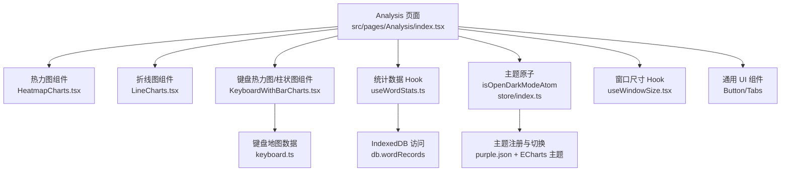
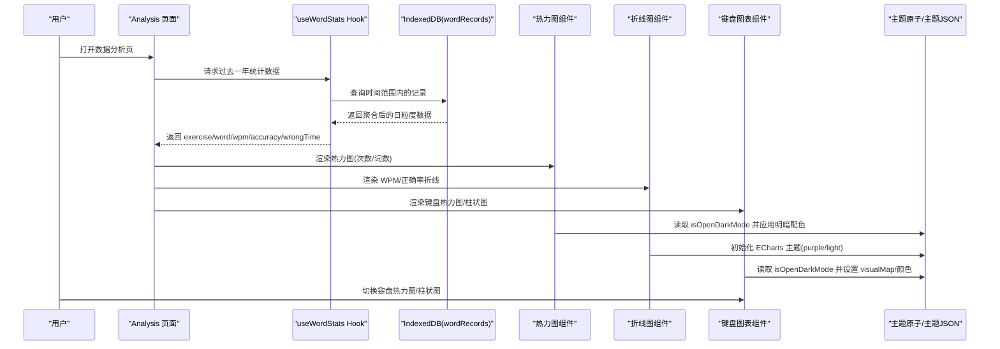
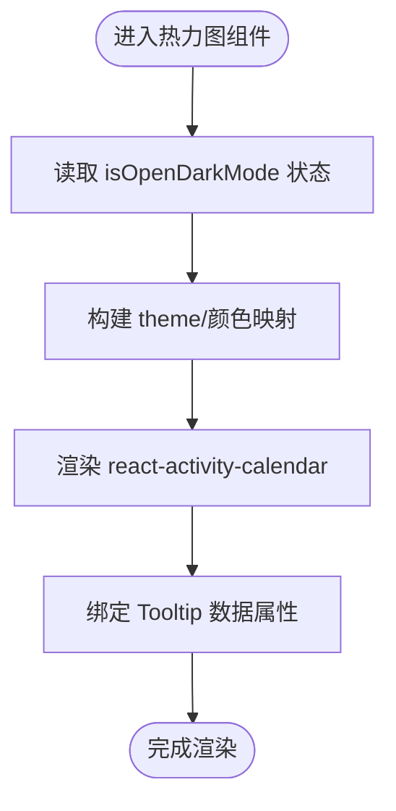
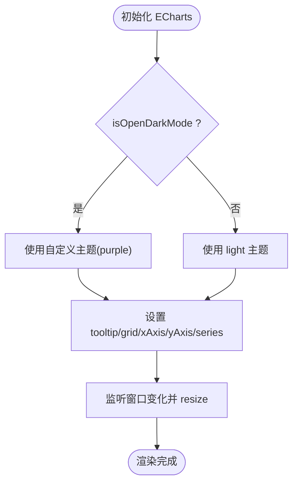
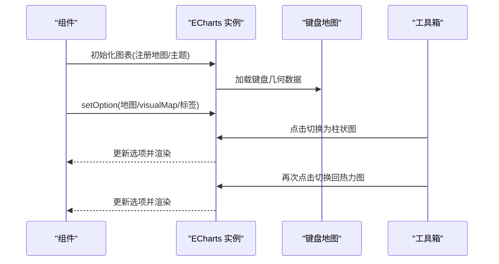
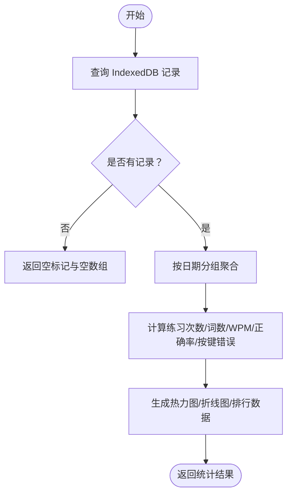
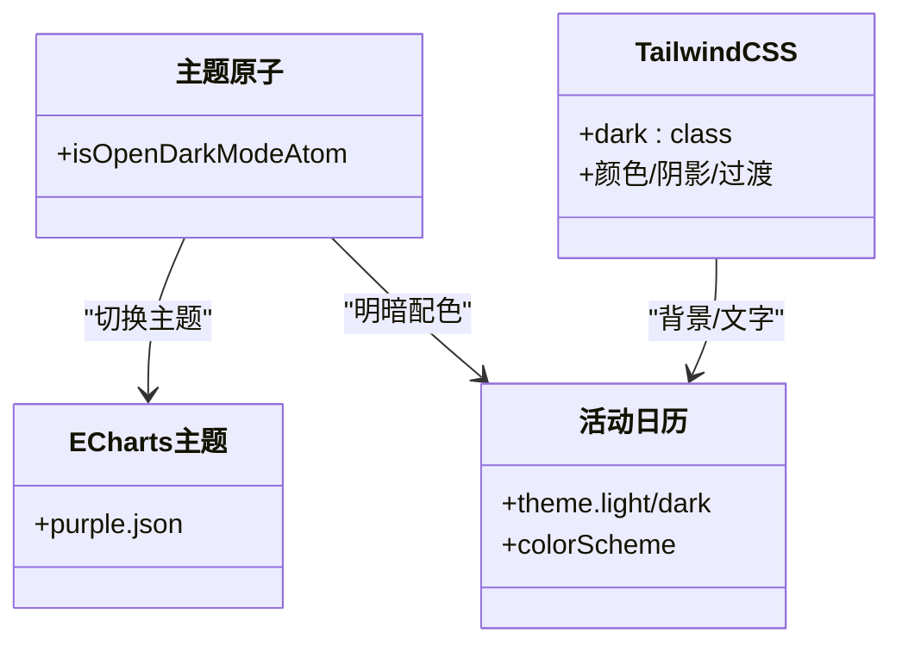
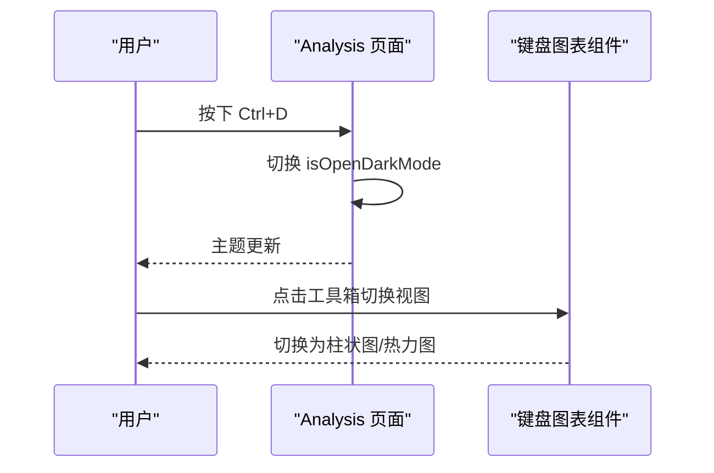
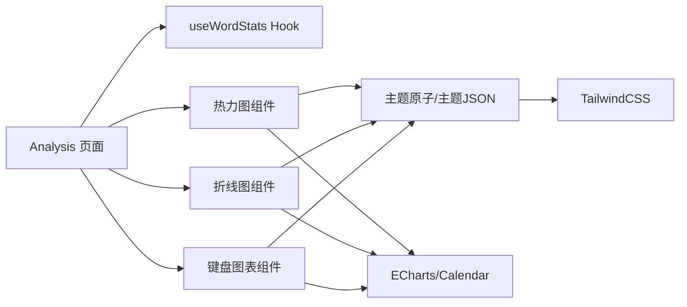

# 数据可视化设计

<cite>
**本文引用的文件**
- [src/pages/Analysis/index.tsx](file://src/pages/Analysis/index.tsx)
- [src/pages/Analysis/components/HeatmapCharts.tsx](file://src/pages/Analysis/components/HeatmapCharts.tsx)
- [src/pages/Analysis/components/LineCharts.tsx](file://src/pages/Analysis/components/LineCharts.tsx)
- [src/pages/Analysis/components/KeyboardWithBarCharts.tsx](file://src/pages/Analysis/components/KeyboardWithBarCharts.tsx)
- [src/pages/Analysis/components/purple.json](file://src/pages/Analysis/components/purple.json)
- [src/pages/Analysis/components/keyboard.ts](file://src/pages/Analysis/components/keyboard.ts)
- [src/pages/Analysis/hooks/useWordStats.ts](file://src/pages/Analysis/hooks/useWordStats.ts)
- [src/store/index.ts](file://src/store/index.ts)
- [src/store/atomForConfig.ts](file://src/store/atomForConfig.ts)
- [src/hooks/useWindowSize.tsx](file://src/hooks/useWindowSize.tsx)
- [src/index.css](file://src/index.css)
- [tailwind.config.js](file://tailwind.config.js)
- [src/constants/index.ts](file://src/constants/index.ts)
- [src/components/ui/button.tsx](file://src/components/ui/button.tsx)
- [src/components/ui/tabs.tsx](file://src/components/ui/tabs.tsx)
</cite>

## 目录

1. [引言](#引言)
2. [项目结构](#项目结构)
3. [核心组件](#核心组件)
4. [架构总览](#架构总览)
5. [详细组件分析](#详细组件分析)
6. [依赖关系分析](#依赖关系分析)
7. [性能考量](#性能考量)
8. [故障排查指南](#故障排查指南)
9. [结论](#结论)
10. [附录](#附录)

## 引言

本文件面向设计师与开发者，围绕“数据分析界面”的可视化设计进行系统化用户体验说明。内容涵盖整体布局与信息层次、颜色编码与主题适配、响应式与无障碍支持、用户交互与数据探索流程、图表选择与信息密度控制、以及可定制化的最佳实践。目标是帮助团队在保持一致性的同时，提升可读性、可用性与可访问性。

## 项目结构

数据分析界面位于 Analysis 页面，采用模块化组件拆分：热力图、折线图、键盘热力图与柱状图等。数据统计由自定义 Hook 提供，主题状态通过全局原子管理，图表渲染基于 ECharts 与 react-activity-calendar，并结合 TailwindCSS 实现响应式与暗色模式适配。

**图表来源**

- [src/pages/Analysis/index.tsx](file://src/pages/Analysis/index.tsx#L1-L82)
- [src/pages/Analysis/components/HeatmapCharts.tsx](file://src/pages/Analysis/components/HeatmapCharts.tsx#L1-L58)
- [src/pages/Analysis/components/LineCharts.tsx](file://src/pages/Analysis/components/LineCharts.tsx#L1-L88)
- [src/pages/Analysis/components/KeyboardWithBarCharts.tsx](file://src/pages/Analysis/components/KeyboardWithBarCharts.tsx#L1-L182)
- [src/pages/Analysis/components/keyboard.ts](file://src/pages/Analysis/components/keyboard.ts#L1-L424)
- [src/pages/Analysis/hooks/useWordStats.ts](file://src/pages/Analysis/hooks/useWordStats.ts#L1-L132)
- [src/store/index.ts](file://src/store/index.ts#L92-L92)
- [src/pages/Analysis/components/purple.json](file://src/pages/Analysis/components/purple.json#L1-L355)
- [src/hooks/useWindowSize.tsx](file://src/hooks/useWindowSize.tsx#L1-L30)
- [src/components/ui/button.tsx](file://src/components/ui/button.tsx#L1-L44)
- [src/components/ui/tabs.tsx](file://src/components/ui/tabs.tsx#L1-L44)

**章节来源**

- [src/pages/Analysis/index.tsx](file://src/pages/Analysis/index.tsx#L1-L82)
- [tailwind.config.js](file://tailwind.config.js#L1-L78)

## 核心组件

- 热力图组件：展示过去一年练习次数与练习词数的热力图，支持本地化标签与深浅色主题映射。
- 折线图组件：展示 WPM 与正确率的趋势，支持动态主题切换与自适应布局。
- 键盘热力图/柱状图组件：以地图形式映射按键错误分布，并可一键切换为柱状图对比，增强探索性。
- 统计数据 Hook：从 IndexedDB 聚合日粒度数据，生成热力图与折线图所需的时间序列与分类数据。
- 主题与配色：通过 ECharts 自定义主题与 react-activity-calendar 的明暗配色，统一视觉语言；TailwindCSS 提供基础配色与过渡动画。

**章节来源**

- [src/pages/Analysis/components/HeatmapCharts.tsx](file://src/pages/Analysis/components/HeatmapCharts.tsx#L1-L58)
- [src/pages/Analysis/components/LineCharts.tsx](file://src/pages/Analysis/components/LineCharts.tsx#L1-L88)
- [src/pages/Analysis/components/KeyboardWithBarCharts.tsx](file://src/pages/Analysis/components/KeyboardWithBarCharts.tsx#L1-L182)
- [src/pages/Analysis/hooks/useWordStats.ts](file://src/pages/Analysis/hooks/useWordStats.ts#L1-L132)
- [src/store/index.ts](file://src/store/index.ts#L92-L92)
- [src/pages/Analysis/components/purple.json](file://src/pages/Analysis/components/purple.json#L1-L355)

## 架构总览

下图展示了从数据到可视化的端到端流程：页面加载后通过 Hook 获取统计，再驱动各图表组件渲染；主题状态影响 ECharts 主题与 react-activity-calendar 颜色；窗口尺寸变化触发图表重绘。

**图表来源**

- [src/pages/Analysis/index.tsx](file://src/pages/Analysis/index.tsx#L36-L79)
- [src/pages/Analysis/hooks/useWordStats.ts](file://src/pages/Analysis/hooks/useWordStats.ts#L38-L132)
- [src/pages/Analysis/components/HeatmapCharts.tsx](file://src/pages/Analysis/components/HeatmapCharts.tsx#L1-L58)
- [src/pages/Analysis/components/LineCharts.tsx](file://src/pages/Analysis/components/LineCharts.tsx#L1-L88)
- [src/pages/Analysis/components/KeyboardWithBarCharts.tsx](file://src/pages/Analysis/components/KeyboardWithBarCharts.tsx#L1-L182)
- [src/store/index.ts](file://src/store/index.ts#L92-L92)
- [src/pages/Analysis/components/purple.json](file://src/pages/Analysis/components/purple.json#L1-L355)

## 详细组件分析

### 热力图组件（Activity Calendar）

- 功能要点
  - 展示过去一年练习次数与练习词数的热力图，支持周标签、月份标签与本地化提示。
  - 基于 isOpenDarkMode 切换明暗配色；通过 theme 映射 light/dark 颜色区间。
  - 使用 Tooltip 提供日期与次数的悬停信息。
- 视觉引导
  - 通过区块大小与圆角控制密度感知；颜色梯度体现强度差异。
  - 标签与图例帮助用户快速建立时间与强度的对应关系。
- 可访问性
  - 图表具备可聚焦元素与键盘导航友好性；Tooltip 文案清晰可读。

**图表来源**

- [src/pages/Analysis/components/HeatmapCharts.tsx](file://src/pages/Analysis/components/HeatmapCharts.tsx#L1-L58)

**章节来源**

- [src/pages/Analysis/components/HeatmapCharts.tsx](file://src/pages/Analysis/components/HeatmapCharts.tsx#L1-L58)

### 折线图组件（ECharts）

- 功能要点
  - 支持 WPM 与正确率两条时间序列；平滑曲线增强趋势可读性。
  - 动态主题：根据 isOpenDarkMode 切换 ECharts 主题或默认主题。
  - 自适应：监听窗口尺寸变化并调用 resize。
- 视觉引导
  - 工具提示与坐标轴标签配合，突出数值与时间点。
  - 通过 grid 边距与轴标签格式化，避免拥挤。
- 交互设计
  - 高亮聚焦系列，便于在多条线中区分关注对象。

**图表来源**

- [src/pages/Analysis/components/LineCharts.tsx](file://src/pages/Analysis/components/LineCharts.tsx#L1-L88)
- [src/pages/Analysis/components/purple.json](file://src/pages/Analysis/components/purple.json#L1-L355)
- [src/hooks/useWindowSize.tsx](file://src/hooks/useWindowSize.tsx#L1-L30)

**章节来源**

- [src/pages/Analysis/components/LineCharts.tsx](file://src/pages/Analysis/components/LineCharts.tsx#L1-L88)
- [src/hooks/useWindowSize.tsx](file://src/hooks/useWindowSize.tsx#L1-L30)

### 键盘热力图/柱状图组件（ECharts 地图 + 工具箱）

- 功能要点
  - 注册键盘地图数据，将按键名称映射到地理区域，形成热力图。
  - 提供工具箱按钮在“键盘热力图”与“柱状图”之间切换，便于多角度观察。
  - visualMap 根据 isOpenDarkMode 设置颜色范围与文本方向。
- 视觉引导
  - 热力图强调按键错误的空间分布；柱状图强调排序与对比。
  - 标签旋转与最小间隔减少拥挤，提升可读性。
- 交互设计
  - 工具箱图标语义明确，点击即刻切换视图，降低认知负担。

**图表来源**

- [src/pages/Analysis/components/KeyboardWithBarCharts.tsx](file://src/pages/Analysis/components/KeyboardWithBarCharts.tsx#L1-L182)
- [src/pages/Analysis/components/keyboard.ts](file://src/pages/Analysis/components/keyboard.ts#L1-L424)
- [src/pages/Analysis/components/purple.json](file://src/pages/Analysis/components/purple.json#L1-L355)

**章节来源**

- [src/pages/Analysis/components/KeyboardWithBarCharts.tsx](file://src/pages/Analysis/components/KeyboardWithBarCharts.tsx#L1-L182)
- [src/pages/Analysis/components/keyboard.ts](file://src/pages/Analysis/components/keyboard.ts#L1-L424)

### 数据统计 Hook（useWordStats）

- 功能要点
  - 从 IndexedDB 读取指定时间范围内的练习记录，按日期聚合。
  - 生成热力图所需的 Activity 数组、折线图所需的 [时间, 数值] 序列、按键错误排行等。
  - 对空数据场景返回 isEmpty 标记，驱动页面占位提示。
- 处理逻辑
  - 日期补全：确保时间轴连续，缺失日期计数为 0。
  - 统计指标：练习次数、去重词数、WPM、正确率、按键错误频次。
- 性能与复杂度
  - 时间复杂度近似 O(n)，n 为记录数量；内存占用与时间范围线性相关。

**图表来源**

- [src/pages/Analysis/hooks/useWordStats.ts](file://src/pages/Analysis/hooks/useWordStats.ts#L1-L132)

**章节来源**

- [src/pages/Analysis/hooks/useWordStats.ts](file://src/pages/Analysis/hooks/useWordStats.ts#L1-L132)

### 主题与颜色系统

- ECharts 主题
  - 自定义主题 purple 包含标题、坐标轴、图例、提示框、地图/地理等元素的颜色与样式配置，保证深浅色一致的视觉风格。
- react-activity-calendar
  - 通过 theme.light/dark 与 colorScheme 控制明暗配色；本地化标签与图例文案增强可读性。
- TailwindCSS
  - 提供基础配色与暗色模式类名，页面背景、卡片阴影、文字颜色随主题切换。
- 颜色编码与信息密度
  - 热力图使用渐变色表达强度；折线图与柱状图采用单一主色系，避免过多色彩干扰。
  - 通过 visualMap 与坐标轴标签格式化，控制信息密度与噪声。

**图表来源**

- [src/store/index.ts](file://src/store/index.ts#L92-L92)
- [src/pages/Analysis/components/purple.json](file://src/pages/Analysis/components/purple.json#L1-L355)
- [src/pages/Analysis/components/HeatmapCharts.tsx](file://src/pages/Analysis/components/HeatmapCharts.tsx#L1-L58)
- [src/index.css](file://src/index.css#L1-L208)

**章节来源**

- [src/store/index.ts](file://src/store/index.ts#L92-L92)
- [src/pages/Analysis/components/purple.json](file://src/pages/Analysis/components/purple.json#L1-L355)
- [src/pages/Analysis/components/HeatmapCharts.tsx](file://src/pages/Analysis/components/HeatmapCharts.tsx#L1-L58)
- [src/index.css](file://src/index.css#L1-L208)

### 响应式设计与无障碍支持

- 响应式
  - TailwindCSS 在多个断点上扩展了宽度与高度，满足桌面与大屏展示需求。
  - 图表组件监听窗口尺寸变化并调用 resize，确保在不同屏幕尺寸下保持良好显示。
- 无障碍
  - 图表具备可聚焦元素与键盘导航友好性；Tooltip 文案清晰可读。
  - 深浅色模式切换遵循系统偏好，降低视觉疲劳。

**章节来源**

- [tailwind.config.js](file://tailwind.config.js#L1-L78)
- [src/hooks/useWindowSize.tsx](file://src/hooks/useWindowSize.tsx#L1-L30)
- [src/pages/Analysis/components/LineCharts.tsx](file://src/pages/Analysis/components/LineCharts.tsx#L73-L78)
- [src/pages/Analysis/components/KeyboardWithBarCharts.tsx](file://src/pages/Analysis/components/KeyboardWithBarCharts.tsx#L167-L171)

### 用户交互设计与数据探索流程

- 快捷键
  - Ctrl+D 切换深浅色模式；Enter/Esc 返回首页，提升操作效率。
- 视图切换
  - 键盘热力图与柱状图一键切换，支持从空间分布与排序对比两个维度探索按键错误。
- 卡片布局
  - 每个图表置于圆角卡片中，阴影与留白提升可读性与层级感。

**图表来源**

- [src/pages/Analysis/index.tsx](file://src/pages/Analysis/index.tsx#L23-L34)
- [src/pages/Analysis/components/KeyboardWithBarCharts.tsx](file://src/pages/Analysis/components/KeyboardWithBarCharts.tsx#L83-L137)

**章节来源**

- [src/pages/Analysis/index.tsx](file://src/pages/Analysis/index.tsx#L23-L34)
- [src/pages/Analysis/components/KeyboardWithBarCharts.tsx](file://src/pages/Analysis/components/KeyboardWithBarCharts.tsx#L83-L137)

### 图表选择指南与信息密度控制

- 图表类型选择
  - 时间序列趋势：折线图（平滑曲线、高亮聚焦系列）。
  - 分布与强度：热力图（渐变色、本地化标签）。
  - 排序与对比：柱状图（标签旋转、最小间隔）。
  - 空间分布：地图（键盘热力图，配合 visualMap）。
- 信息密度控制
  - 合理设置 grid 边距与坐标轴标签格式化，避免拥挤。
  - 使用工具箱与切换按钮减少一次性呈现的信息量。
  - 通过主题与配色统一视觉语言，降低认知负担。

**章节来源**

- [src/pages/Analysis/components/LineCharts.tsx](file://src/pages/Analysis/components/LineCharts.tsx#L37-L68)
- [src/pages/Analysis/components/HeatmapCharts.tsx](file://src/pages/Analysis/components/HeatmapCharts.tsx#L20-L51)
- [src/pages/Analysis/components/KeyboardWithBarCharts.tsx](file://src/pages/Analysis/components/KeyboardWithBarCharts.tsx#L124-L162)

### 界面定制与用户体验优化最佳实践

- 主题与配色
  - 使用 ECharts 自定义主题与 react-activity-calendar 的明暗映射，确保跨图表一致性。
  - TailwindCSS 提供暗色模式类名，页面背景与卡片阴影随主题切换。
- 布局与留白
  - 卡片圆角与阴影提升层级感；统一的外边距与内边距保证信息区块的可读性。
- 交互与反馈
  - 工具箱按钮语义明确；Tooltip 提供即时上下文信息。
  - 快捷键提升高频操作效率。
- 可访问性
  - 图表具备键盘可达性；深浅色模式遵循系统偏好；标签与图例清晰可读。

**章节来源**

- [src/pages/Analysis/components/purple.json](file://src/pages/Analysis/components/purple.json#L1-L355)
- [src/pages/Analysis/components/HeatmapCharts.tsx](file://src/pages/Analysis/components/HeatmapCharts.tsx#L18-L51)
- [src/index.css](file://src/index.css#L1-L208)
- [src/components/ui/button.tsx](file://src/components/ui/button.tsx#L1-L44)
- [src/components/ui/tabs.tsx](file://src/components/ui/tabs.tsx#L1-L44)

## 依赖关系分析

- 组件耦合
  - Analysis 页面聚合多个图表组件，通过 Hook 提供的数据驱动渲染。
  - 图表组件依赖主题原子与窗口尺寸 Hook，实现主题与响应式联动。
- 外部依赖
  - ECharts：提供丰富的图表类型与主题能力。
  - react-activity-calendar：专注活动日历热力图。
  - TailwindCSS：提供响应式与暗色模式基础能力。
- 潜在循环依赖
  - 当前结构为单向依赖（页面 -> 组件 -> 外部库），未见循环依赖迹象。

**图表来源**

- [src/pages/Analysis/index.tsx](file://src/pages/Analysis/index.tsx#L36-L79)
- [src/pages/Analysis/hooks/useWordStats.ts](file://src/pages/Analysis/hooks/useWordStats.ts#L38-L132)
- [src/store/index.ts](file://src/store/index.ts#L92-L92)
- [src/pages/Analysis/components/purple.json](file://src/pages/Analysis/components/purple.json#L1-L355)

**章节来源**

- [src/pages/Analysis/index.tsx](file://src/pages/Analysis/index.tsx#L36-L79)
- [src/store/index.ts](file://src/store/index.ts#L92-L92)

## 性能考量

- 图表渲染
  - 首次渲染后复用实例并 dispose 旧实例，避免重复注册导致的内存泄漏。
  - resize 仅在窗口尺寸变化时触发，减少不必要的重绘。
- 数据处理
  - useWordStats 对记录进行一次聚合，后续图表直接消费，避免重复计算。
- 主题切换
  - 主题切换通过原子状态驱动，组件内部按需重新初始化图表，避免全量刷新。

**章节来源**

- [src/pages/Analysis/components/LineCharts.tsx](file://src/pages/Analysis/components/LineCharts.tsx#L29-L36)
- [src/pages/Analysis/components/KeyboardWithBarCharts.tsx](file://src/pages/Analysis/components/KeyboardWithBarCharts.tsx#L62-L75)
- [src/hooks/useWindowSize.tsx](file://src/hooks/useWindowSize.tsx#L1-L30)

## 故障排查指南

- 无数据或空白卡片
  - 检查 useWordStats 是否返回 isEmpty 标记；确认 IndexedDB 中是否存在指定时间范围内的记录。
- 图表不显示或显示异常
  - 确认 isOpenDarkMode 状态是否正确；检查 ECharts 实例是否已 dispose 并重新初始化。
  - 确认容器尺寸是否有效，resize 是否被调用。
- 主题不生效
  - 检查 isOpenDarkModeAtom 的初始值与变更路径；确认 ECharts 主题名称与注册一致。
- 热力图标签或配色异常
  - 检查 theme.light/dark 与 colorScheme 的映射；确认本地化标签数组是否完整。

**章节来源**

- [src/pages/Analysis/hooks/useWordStats.ts](file://src/pages/Analysis/hooks/useWordStats.ts#L60-L68)
- [src/pages/Analysis/components/LineCharts.tsx](file://src/pages/Analysis/components/LineCharts.tsx#L29-L36)
- [src/pages/Analysis/components/HeatmapCharts.tsx](file://src/pages/Analysis/components/HeatmapCharts.tsx#L20-L35)
- [src/store/index.ts](file://src/store/index.ts#L92-L92)

## 结论

该数据分析界面通过模块化组件与统一的主题系统，实现了从数据到可视化的高效闭环。热力图、折线图与键盘图表协同呈现多维信息，配合响应式与无障碍设计，提升了用户体验。建议在后续迭代中进一步细化交互反馈与可访问性细节，持续优化信息密度与视觉噪声控制。

## 附录

- 关键常量与配置
  - 主题开关原子：isOpenDarkModeAtom
  - 字体大小配置：defaultFontSizeConfig
  - 配色与动画：index.css 中的暗色模式与过渡动画
- 最佳实践清单
  - 使用统一主题与配色，避免跨图表风格割裂。
  - 控制信息密度，优先使用热力图与折线图表达趋势与强度。
  - 提供一键切换视图的能力，支持多角度探索数据。
  - 保障可访问性与响应式体验，遵循系统偏好与键盘导航。

**章节来源**

- [src/store/index.ts](file://src/store/index.ts#L92-L92)
- [src/constants/index.ts](file://src/constants/index.ts#L1-L19)
- [src/index.css](file://src/index.css#L1-L208)
