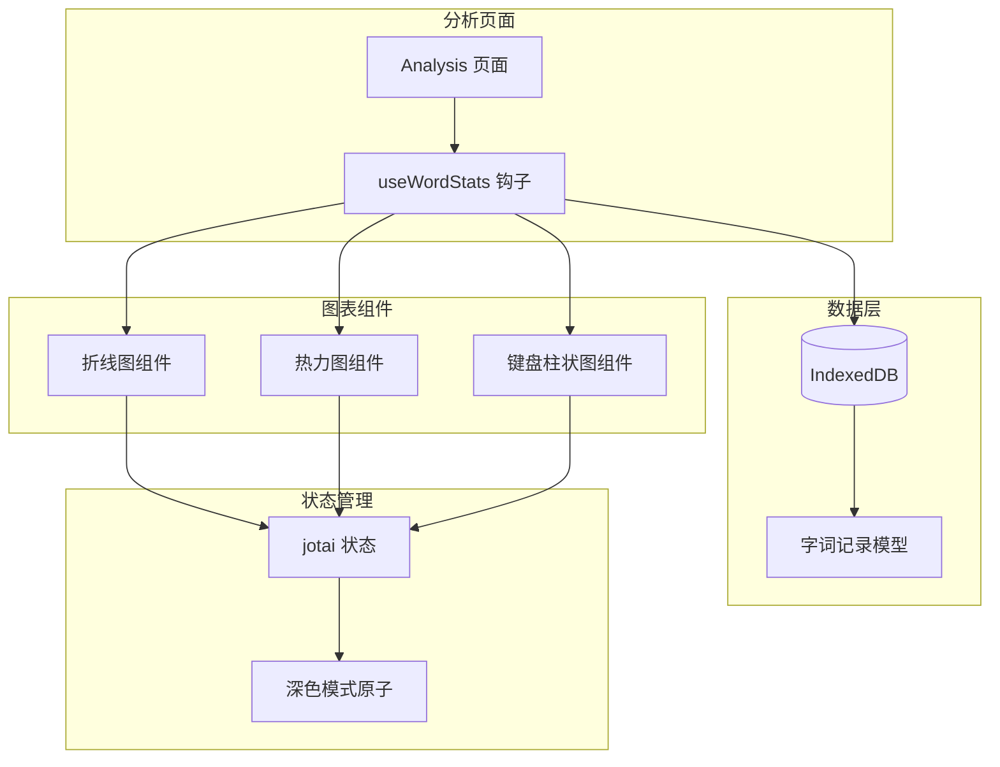
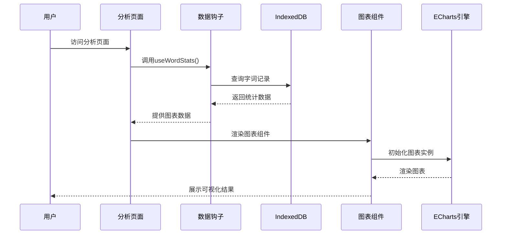
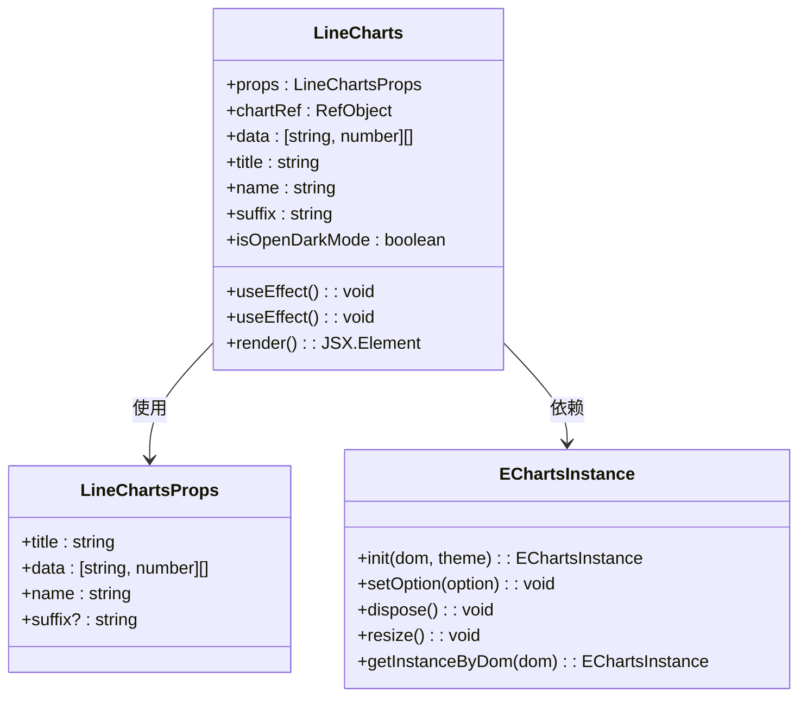
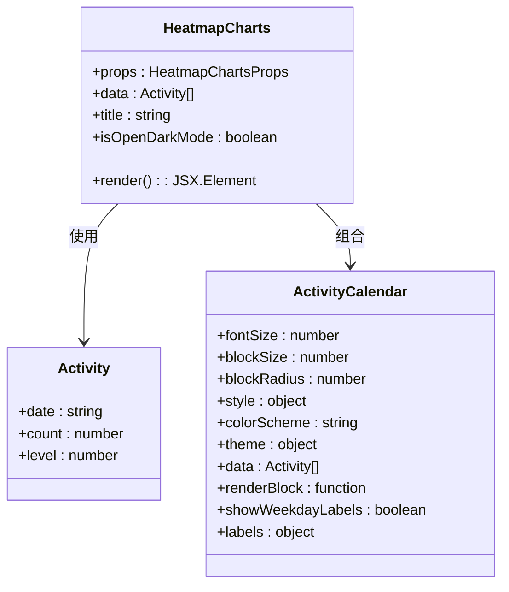
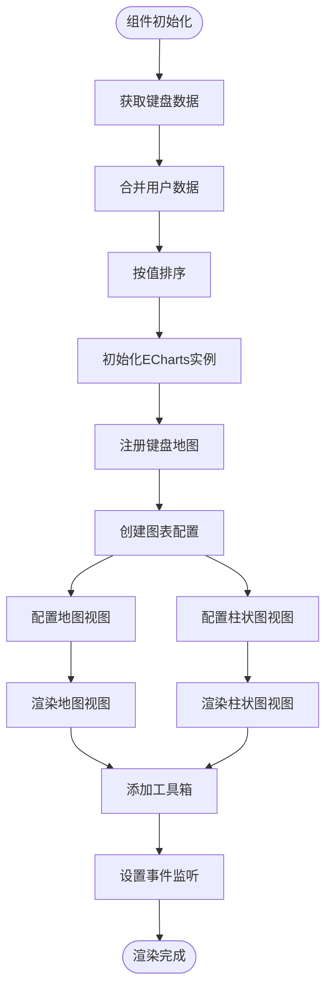
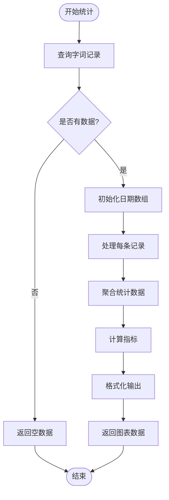
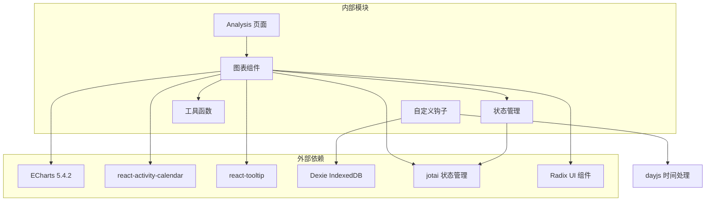
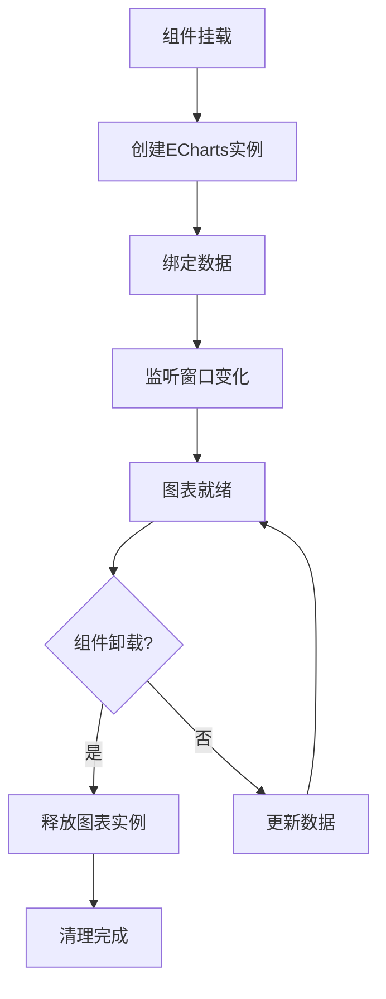

# 统计图表实现

<cite>
**本文档引用的文件**
- [src/pages/Analysis/components/LineCharts.tsx](file://src/pages/Analysis/components/LineCharts.tsx)
- [src/pages/Analysis/components/HeatmapCharts.tsx](file://src/pages/Analysis/components/HeatmapCharts.tsx)
- [src/pages/Analysis/components/KeyboardWithBarCharts.tsx](file://src/pages/Analysis/components/KeyboardWithBarCharts.tsx)
- [src/pages/Analysis/components/purple.json](file://src/pages/Analysis/components/purple.json)
- [src/pages/Analysis/components/keyboard.ts](file://src/pages/Analysis/components/keyboard.ts)
- [src/pages/Analysis/index.tsx](file://src/pages/Analysis/index.tsx)
- [src/pages/Analysis/hooks/useWordStats.ts](file://src/pages/Analysis/hooks/useWordStats.ts)
- [src/store/index.ts](file://src/store/index.ts)
- [src/hooks/useWindowSize.tsx](file://src/hooks/useWindowSize.tsx)
- [src/utils/db/record.ts](file://src/utils/db/record.ts)
- [package.json](file://package.json)
</cite>

## 目录

1. [简介](#简介)
2. [项目结构](#项目结构)
3. [核心组件](#核心组件)
4. [架构概览](#架构概览)
5. [详细组件分析](#详细组件分析)
6. [依赖关系分析](#依赖关系分析)
7. [性能考虑](#性能考虑)
8. [故障排除指南](#故障排除指南)
9. [结论](#结论)
10. [附录](#附录)

## 简介

本项目实现了完整的统计图表系统，包括折线图、热力图和键盘分布柱状图等可视化组件。系统基于 ECharts 图表库构建，集成了 React 生态中的状态管理、响应式设计和数据持久化技术。图表组件支持深色模式主题、响应式布局和丰富的交互功能。

## 项目结构

图表系统位于 Analysis 页面模块中，采用组件化架构设计，每个图表组件独立封装并可复用。

**图表来源**

- [src/pages/Analysis/index.tsx](file://src/pages/Analysis/index.tsx#L15-L82)
- [src/pages/Analysis/hooks/useWordStats.ts](file://src/pages/Analysis/hooks/useWordStats.ts#L38-L57)

**章节来源**

- [src/pages/Analysis/index.tsx](file://src/pages/Analysis/index.tsx#L1-L82)
- [src/pages/Analysis/hooks/useWordStats.ts](file://src/pages/Analysis/hooks/useWordStats.ts#L1-L132)

## 核心组件

系统包含三个主要图表组件，每个都针对特定的可视化需求进行了优化：

### 折线图组件 (LineCharts)

专门用于展示时间序列数据的趋势变化，支持平滑曲线和动态数据更新。

### 热力图组件 (HeatmapCharts)

基于 react-activity-calendar 实现的日历热力图，展示用户练习活动的强度分布。

### 键盘分布柱状图组件 (KeyboardWithBarCharts)

创新性的键盘映射图表，支持地图视图和柱状图视图的无缝切换。

**章节来源**

- [src/pages/Analysis/components/LineCharts.tsx](file://src/pages/Analysis/components/LineCharts.tsx#L15-L20)
- [src/pages/Analysis/components/HeatmapCharts.tsx](file://src/pages/Analysis/components/HeatmapCharts.tsx#L10-L13)
- [src/pages/Analysis/components/KeyboardWithBarCharts.tsx](file://src/pages/Analysis/components/KeyboardWithBarCharts.tsx#L48-L53)

## 架构概览

图表系统采用分层架构，从数据获取到渲染展示形成完整的数据流。

**图表来源**

- [src/pages/Analysis/index.tsx](file://src/pages/Analysis/index.tsx#L38-L41)
- [src/pages/Analysis/hooks/useWordStats.ts](file://src/pages/Analysis/hooks/useWordStats.ts#L47-L54)

## 详细组件分析

### 折线图组件实现

折线图组件实现了完整的数据绑定机制和响应式更新逻辑。

**图表来源**

- [src/pages/Analysis/components/LineCharts.tsx](file://src/pages/Analysis/components/LineCharts.tsx#L22-L88)

#### 数据绑定机制

组件通过 props 接收数据，使用 ECharts 的 setOption 方法进行数据绑定。数据格式为二维数组，其中第一个元素为时间戳，第二个元素为数值。

#### 响应式更新逻辑

- 监听数据变化：当 data、title、suffix 或 name 发生变化时重新初始化图表
- 监听主题变化：根据 isOpenDarkModeAtom 的状态切换深色模式主题
- 监听窗口大小：通过 useWindowSize 钩子监听窗口变化并调用 resize 方法

#### 渲染优化策略

- 实例复用：使用 getInstanceByDom 获取现有实例，避免重复创建
- 主题注册：预注册 purple 主题，减少运行时开销
- 条件渲染：只有在 chartRef 和有效数据存在时才进行渲染

**章节来源**

- [src/pages/Analysis/components/LineCharts.tsx](file://src/pages/Analysis/components/LineCharts.tsx#L29-L77)

### 热力图组件实现

热力图组件基于 react-activity-calendar 实现，专门用于展示用户的练习活动分布。

**图表来源**

- [src/pages/Analysis/components/HeatmapCharts.tsx](file://src/pages/Analysis/components/HeatmapCharts.tsx#L15-L58)

#### 特殊功能实现

- 自定义颜色方案：支持浅色和深色主题的自动切换
- 交互提示：使用 react-tooltip 提供详细的练习信息
- 国际化标签：支持中文月份和星期显示
- 动态样式：根据深色模式调整文本颜色和块状颜色

**章节来源**

- [src/pages/Analysis/components/HeatmapCharts.tsx](file://src/pages/Analysis/components/HeatmapCharts.tsx#L18-L54)

### 键盘分布柱状图组件实现

这是最具创新性的组件，实现了键盘映射和视图切换功能。

**图表来源**

- [src/pages/Analysis/components/KeyboardWithBarCharts.tsx](file://src/pages/Analysis/components/KeyboardWithBarCharts.tsx#L62-L165)

#### 核心特性

- **双视图切换**：支持键盘热力图和柱状图两种显示模式
- **地理映射**：使用 ECharts 的地图功能映射到物理键盘布局
- **动态切换**：通过工具箱按钮实现实时视图切换
- **动画过渡**：启用 universalTransition 实现流畅的视图切换动画

#### 数据处理流程

1. 初始化标准键盘数据结构
2. 合并用户实际使用数据
3. 按使用频率排序
4. 生成 ECharts 兼容的数据格式

**章节来源**

- [src/pages/Analysis/components/KeyboardWithBarCharts.tsx](file://src/pages/Analysis/components/KeyboardWithBarCharts.tsx#L65-L70)

### 数据获取和处理

useWordStats 钩子负责从 IndexedDB 中获取和处理统计数据。

**图表来源**

- [src/pages/Analysis/hooks/useWordStats.ts](file://src/pages/Analysis/hooks/useWordStats.ts#L59-L131)

#### 数据聚合策略

- **时间维度**：按天聚合，确保时间轴的连续性
- **练习次数**：统计每日练习的总次数
- **词汇量**：统计每日不同词汇的数量（去重）
- **性能指标**：计算 WPM 和准确率等性能指标
- **错误分析**：统计按键错误频率

**章节来源**

- [src/pages/Analysis/hooks/useWordStats.ts](file://src/pages/Analysis/hooks/useWordStats.ts#L77-L131)

## 依赖关系分析

图表系统依赖于多个外部库和内部模块。

**图表来源**

- [package.json](file://package.json#L6-L58)
- [src/pages/Analysis/index.tsx](file://src/pages/Analysis/index.tsx#L1-L13)

### 关键依赖说明

#### ECharts 集成

- **模块化导入**：仅导入需要的组件，减少包体积
- **主题系统**：自定义 purple 主题适配深色模式
- **渲染器选择**：使用 CanvasRenderer 确保跨平台兼容性

#### 数据持久化

- **IndexedDB**：使用 Dexie 简化数据库操作
- **异步处理**：所有数据库操作都是异步的
- **数据模型**：严格的接口定义确保数据一致性

**章节来源**

- [package.json](file://package.json#L33-L49)
- [src/utils/db/record.ts](file://src/utils/db/record.ts#L4-L46)

## 性能考虑

### 渲染优化策略

1. **实例生命周期管理**

   - 使用 getInstanceByDom 避免重复创建图表实例
   - 在组件卸载时调用 dispose 释放资源
   - 通过条件渲染避免不必要的初始化

2. **数据处理优化**

   - 使用 Map 和 Reduce 进行高效的数据聚合
   - 预分配数组大小减少内存重新分配
   - 避免在渲染过程中进行复杂的计算

3. **响应式更新优化**
   - 使用 useWindowSize 钩子监听窗口变化
   - 通过 effect 依赖数组精确控制更新时机
   - 避免频繁的 setOption 调用

### 内存管理

**图表来源**

- [src/pages/Analysis/components/LineCharts.tsx](file://src/pages/Analysis/components/LineCharts.tsx#L32-L36)
- [src/pages/Analysis/components/KeyboardWithBarCharts.tsx](file://src/pages/Analysis/components/KeyboardWithBarCharts.tsx#L72-L75)

### 性能监控建议

1. **图表实例池化**：对于大量图表实例的场景，考虑实现实例池
2. **数据分页加载**：对于大数据集，实现分页或采样加载
3. **懒加载优化**：只在可视区域内的图表进行初始化
4. **缓存策略**：缓存计算结果避免重复计算

## 故障排除指南

### 常见问题及解决方案

#### 图表不显示或空白

1. **检查数据有效性**：确保传入的数据格式正确且非空
2. **验证 DOM 元素**：确认 chartRef 指向有效的 HTML 元素
3. **检查主题配置**：验证深色模式主题是否正确注册

#### 响应式问题

1. **窗口尺寸监听**：确认 useWindowSize 钩子正常工作
2. **resize 调用时机**：确保在数据更新后调用 resize 方法
3. **CSS 样式冲突**：检查容器的宽高设置

#### 性能问题

1. **实例泄漏**：确认组件卸载时正确释放图表实例
2. **频繁更新**：避免在短时间内多次调用 setOption
3. **大数据处理**：考虑实现数据分批处理

**章节来源**

- [src/pages/Analysis/components/LineCharts.tsx](file://src/pages/Analysis/components/LineCharts.tsx#L29-L36)
- [src/pages/Analysis/components/KeyboardWithBarCharts.tsx](file://src/pages/Analysis/components/KeyboardWithBarCharts.tsx#L72-L77)

## 结论

该统计图表系统实现了完整的可视化解决方案，具有以下特点：

1. **模块化设计**：每个图表组件独立封装，便于维护和扩展
2. **数据驱动**：基于真实用户数据的统计分析
3. **响应式架构**：支持深色模式和多种设备尺寸
4. **性能优化**：通过实例管理和数据处理优化确保流畅体验
5. **交互丰富**：提供多种图表视图和用户交互功能

系统为开发者提供了良好的扩展基础，可以根据具体需求添加新的图表类型或增强现有功能。

## 附录

### 开发者指南

#### 添加新图表类型

1. 创建新的组件文件，遵循现有组件的接口规范
2. 实现数据绑定和响应式更新逻辑
3. 集成到 Analysis 页面的布局中
4. 测试深色模式和响应式效果

#### 自定义样式

1. 修改 purple.json 主题配置文件
2. 更新键盘映射数据结构
3. 调整工具箱图标和交互行为

#### 性能调优

1. 监控图表实例数量和内存使用
2. 优化数据处理算法
3. 实现适当的缓存策略
