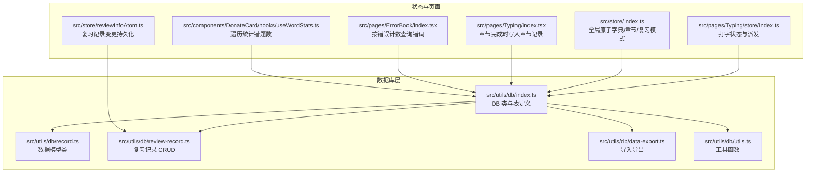
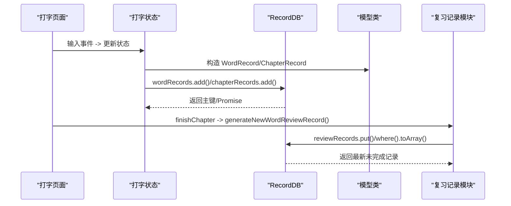
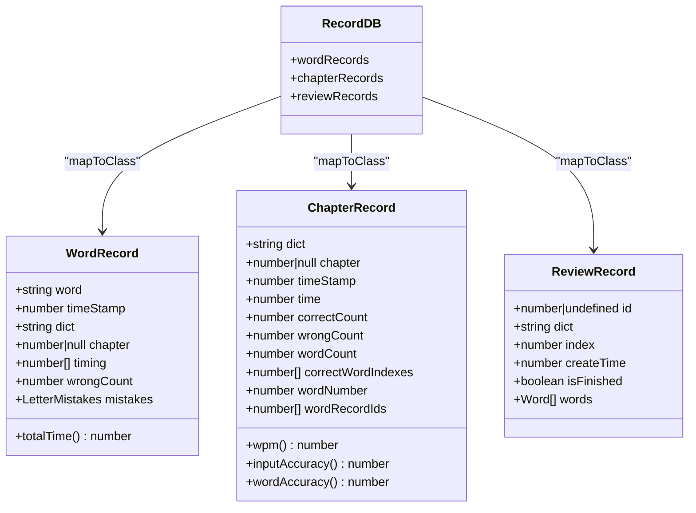
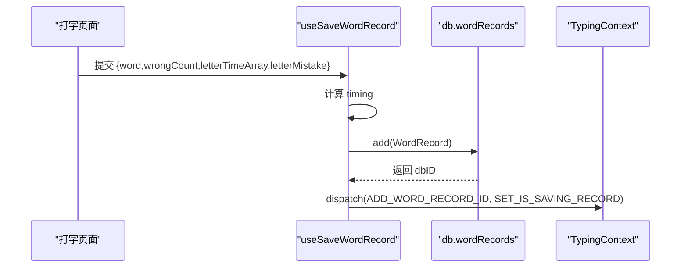
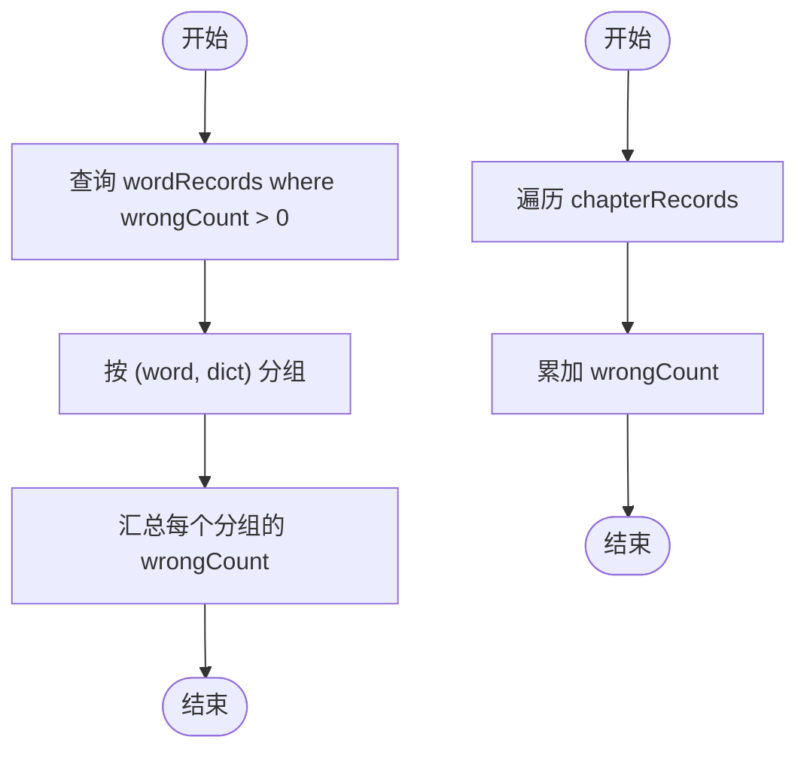
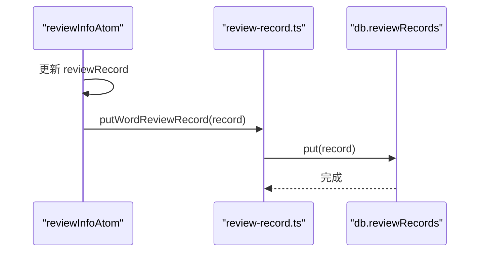
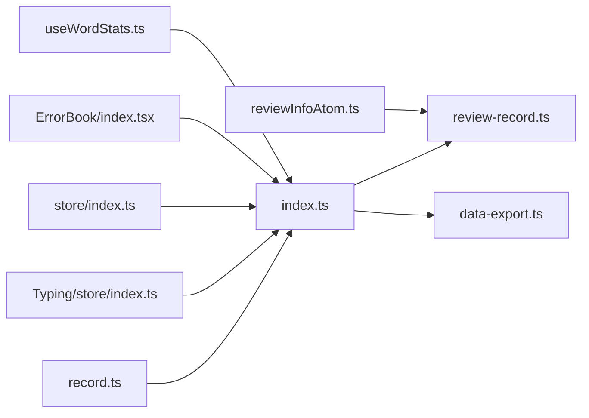

# CRUD 操作实现

<cite>
**本文引用的文件**
- [src/utils/db/index.ts](file://src/utils/db/index.ts)
- [src/utils/db/record.ts](file://src/utils/db/record.ts)
- [src/utils/db/review-record.ts](file://src/utils/db/review-record.ts)
- [src/utils/db/data-export.ts](file://src/utils/db/data-export.ts)
- [src/utils/db/utils.ts](file://src/utils/db/utils.ts)
- [src/pages/Typing/store/index.ts](file://src/pages/Typing/store/index.ts)
- [src/store/index.ts](file://src/store/index.ts)
- [src/components/DonateCard/hooks/useWordStats.ts](file://src/components/DonateCard/hooks/useWordStats.ts)
- [src/pages/ErrorBook/index.tsx](file://src/pages/ErrorBook/index.tsx)
- [src/pages/Typing/index.tsx](file://src/pages/Typing/index.tsx)
- [src/store/reviewInfoAtom.ts](file://src/store/reviewInfoAtom.ts)
- [src/utils/index.ts](file://src/utils/index.ts)
</cite>

## 目录

1. [简介](#简介)
2. [项目结构](#项目结构)
3. [核心组件](#核心组件)
4. [架构总览](#架构总览)
5. [详细组件分析](#详细组件分析)
6. [依赖关系分析](#依赖关系分析)
7. [性能考虑](#性能考虑)
8. [故障排查指南](#故障排查指南)
9. [结论](#结论)
10. [附录](#附录)

## 简介

本文件围绕基于 Dexie 的本地数据库实现，系统性梳理与解释“增删改查”（CRUD）操作在项目中的落地方式，重点覆盖以下方面：

- 数据模型类的定义与映射：WordRecord、ChapterRecord、ReviewRecord 等。
- CRUD 方法的实现路径与调用链：新增、查询、更新、删除。
- 异步处理、错误捕获与异常处理机制。
- 批量操作、事务处理与并发控制策略。
- 性能优化、查询优化与索引使用建议。
- 使用示例与最佳实践。

## 项目结构

数据库层位于 src/utils/db，采用 Dexie 进行 IndexedDB 封装，并通过自定义 Hook 暴露 CRUD 能力；上层 Typing 页面与统计模块通过状态管理与 Hook 触发持久化。

图表来源

- [src/utils/db/index.ts](file://src/utils/db/index.ts#L1-L136)
- [src/utils/db/record.ts](file://src/utils/db/record.ts#L1-L186)
- [src/utils/db/review-record.ts](file://src/utils/db/review-record.ts#L1-L69)
- [src/utils/db/data-export.ts](file://src/utils/db/data-export.ts#L1-L68)
- [src/utils/db/utils.ts](file://src/utils/db/utils.ts#L1-L18)
- [src/pages/Typing/store/index.ts](file://src/pages/Typing/store/index.ts#L1-L227)
- [src/store/index.ts](file://src/store/index.ts#L1-L118)
- [src/pages/Typing/index.tsx](file://src/pages/Typing/index.tsx#L106-L127)
- [src/pages/ErrorBook/index.tsx](file://src/pages/ErrorBook/index.tsx#L39-L90)
- [src/components/DonateCard/hooks/useWordStats.ts](file://src/components/DonateCard/hooks/useWordStats.ts#L51-L71)
- [src/store/reviewInfoAtom.ts](file://src/store/reviewInfoAtom.ts#L1-L28)

章节来源

- [src/utils/db/index.ts](file://src/utils/db/index.ts#L1-L136)
- [src/utils/db/record.ts](file://src/utils/db/record.ts#L1-L186)
- [src/utils/db/review-record.ts](file://src/utils/db/review-record.ts#L1-L69)
- [src/utils/db/data-export.ts](file://src/utils/db/data-export.ts#L1-L68)
- [src/utils/db/utils.ts](file://src/utils/db/utils.ts#L1-L18)
- [src/pages/Typing/store/index.ts](file://src/pages/Typing/store/index.ts#L1-L227)
- [src/store/index.ts](file://src/store/index.ts#L1-L118)
- [src/pages/Typing/index.tsx](file://src/pages/Typing/index.tsx#L106-L127)
- [src/pages/ErrorBook/index.tsx](file://src/pages/ErrorBook/index.tsx#L39-L90)
- [src/components/DonateCard/hooks/useWordStats.ts](file://src/components/DonateCard/hooks/useWordStats.ts#L51-L71)
- [src/store/reviewInfoAtom.ts](file://src/store/reviewInfoAtom.ts#L1-L28)

## 核心组件

- 数据模型类
  - WordRecord：单词级记录，包含字幕时间差数组、错误次数、逐字母错误映射等。
  - ChapterRecord：章节级记录，包含正确/错误按键计数、用时、单词总数、正确单词索引集合、关联的单词记录 ID 列表等。
  - ReviewRecord：复习记录，包含字典标识、当前索引、创建时间、是否完成、单词列表等。
- 数据库类与表定义
  - RecordDB：继承 Dexie，声明 wordRecords、chapterRecords、reviewRecords 等表，定义版本迁移与索引。
  - 映射：通过 mapToClass 将表与模型类绑定，使查询结果自动实例化为类实例。
- CRUD 工具函数
  - 新增/保存：useSaveWordRecord、useSaveChapterRecord。
  - 删除：useDeleteWordRecord。
  - 复习记录：useGetLatestReviewRecord、generateNewWordReviewRecord、putWordReviewRecord。
  - 导入导出：exportDatabase、importDatabase。
  - 字母错误合并：mergeLetterMistake。

章节来源

- [src/utils/db/record.ts](file://src/utils/db/record.ts#L1-L186)
- [src/utils/db/index.ts](file://src/utils/db/index.ts#L1-L136)
- [src/utils/db/review-record.ts](file://src/utils/db/review-record.ts#L1-L69)
- [src/utils/db/data-export.ts](file://src/utils/db/data-export.ts#L1-L68)
- [src/utils/db/utils.ts](file://src/utils/db/utils.ts#L1-L18)

## 架构总览

下图展示从打字页面到数据库的典型 CRUD 流程：打字过程中收集输入日志，完成后写入单词记录与章节记录；复习模式下生成或更新复习记录；支持导入导出与统计查询。

图表来源

- [src/pages/Typing/index.tsx](file://src/pages/Typing/index.tsx#L106-L127)
- [src/pages/Typing/store/index.ts](file://src/pages/Typing/store/index.ts#L1-L227)
- [src/utils/db/index.ts](file://src/utils/db/index.ts#L43-L136)
- [src/utils/db/review-record.ts](file://src/utils/db/review-record.ts#L1-L69)

## 详细组件分析

### 数据模型类与映射

- WordRecord
  - 关键字段：word、timeStamp、dict、chapter、timing、wrongCount、mistakes。
  - 计算属性：totalTime（基于 timing 求和）。
- ChapterRecord
  - 关键字段：dict、chapter、timeStamp、time、correctCount、wrongCount、wordCount、correctWordIndexes、wordNumber、wordRecordIds。
  - 计算属性：wpm、inputAccuracy、wordAccuracy。
- ReviewRecord
  - 关键字段：dict、index、createTime、isFinished、words。
  - 默认值：index=0、isFinished=false、createTime 使用 UTC 秒时间戳。
- 映射与版本
  - 通过 mapToClass 将表与类绑定。
  - 版本 1/2/3 的 stores 定义展示了字段演进与复合索引 [dict+chapter] 的引入。

图表来源

- [src/utils/db/record.ts](file://src/utils/db/record.ts#L1-L186)
- [src/utils/db/index.ts](file://src/utils/db/index.ts#L1-L42)

章节来源

- [src/utils/db/record.ts](file://src/utils/db/record.ts#L1-L186)
- [src/utils/db/index.ts](file://src/utils/db/index.ts#L1-L42)

### CRUD 方法实现

#### 新增（Add）

- 单词记录新增
  - 路径：useSaveWordRecord
  - 行为：计算每字母耗时差数组，构造 WordRecord，调用 db.wordRecords.add，捕获异常并回传主键给状态机。
  - 关联：TypingContext 分发 ADD_WORD_RECORD_ID 与 SET_IS_SAVING_RECORD。
- 章节记录新增
  - 路径：useSaveChapterRecord
  - 行为：根据 TypingState 计算正确单词索引集合，构造 ChapterRecord，调用 db.chapterRecords.add。
- 复习记录新增/更新
  - 路径：generateNewWordReviewRecord、putWordReviewRecord
  - 行为：基于错词数据生成排序后的单词列表，构造 ReviewRecord，调用 db.reviewRecords.put；通过 useGetLatestReviewRecord 获取最新未完成记录。

图表来源

- [src/utils/db/index.ts](file://src/utils/db/index.ts#L80-L122)
- [src/pages/Typing/store/index.ts](file://src/pages/Typing/store/index.ts#L1-L227)

章节来源

- [src/utils/db/index.ts](file://src/utils/db/index.ts#L43-L136)
- [src/utils/db/review-record.ts](file://src/utils/db/review-record.ts#L1-L69)
- [src/pages/Typing/store/index.ts](file://src/pages/Typing/store/index.ts#L1-L227)

#### 查询（Read）

- 错题统计与分组
  - 路径：ErrorBook 页面
  - 行为：查询 wordRecords 中 wrongCount > 0 的记录，按 word+dict 分组，汇总 wrongCount。
- 章节错题总数
  - 路径：useSumWrongCount
  - 行为：遍历 chapterRecords，累加 wrongCount。
- 复习记录查询
  - 路径：useGetLatestReviewRecord
  - 行为：按 dict 精确匹配，取 createTime 最新的未完成记录。

图表来源

- [src/pages/ErrorBook/index.tsx](file://src/pages/ErrorBook/index.tsx#L39-L90)
- [src/components/DonateCard/hooks/useWordStats.ts](file://src/components/DonateCard/hooks/useWordStats.ts#L51-L71)

章节来源

- [src/pages/ErrorBook/index.tsx](file://src/pages/ErrorBook/index.tsx#L39-L90)
- [src/components/DonateCard/hooks/useWordStats.ts](file://src/components/DonateCard/hooks/useWordStats.ts#L51-L71)
- [src/utils/db/review-record.ts](file://src/utils/db/review-record.ts#L1-L69)

#### 更新（Update）

- 复习记录进度更新
  - 路径：reviewInfoAtom
  - 行为：当 reviewRecord.id 存在时，调用 putWordReviewRecord 持久化更新。
- 章节完成时写入
  - 路径：Typing 页面
  - 行为：当 state.isFinished 且不再保存中时，调用 saveChapterRecord 写入章节记录。

图表来源

- [src/store/reviewInfoAtom.ts](file://src/store/reviewInfoAtom.ts#L1-L28)
- [src/utils/db/review-record.ts](file://src/utils/db/review-record.ts#L61-L69)

章节来源

- [src/store/reviewInfoAtom.ts](file://src/store/reviewInfoAtom.ts#L1-L28)
- [src/utils/db/review-record.ts](file://src/utils/db/review-record.ts#L1-L69)
- [src/pages/Typing/index.tsx](file://src/pages/Typing/index.tsx#L106-L127)

#### 删除（Delete）

- 单词记录删除
  - 路径：useDeleteWordRecord
  - 行为：按 {word, dict} 条件删除，返回删除数量并打印错误日志。

章节来源

- [src/utils/db/index.ts](file://src/utils/db/index.ts#L124-L136)

### 异步处理、错误捕获与异常处理

- 异步与并发
  - Dexie 的 Table API 返回 Promise，所有 CRUD 操作均为异步。
  - useSaveWordRecord 中对 add 调用进行 try/catch，避免异常冒泡导致 UI 卡死。
  - 多个异步任务通过 Promise.all 并行执行（如导出时统计行数）。
- 错误捕获
  - 删除接口对异常进行 console.error 记录。
  - 导入流程中通过 progressCallback 推送进度，便于 UI 反馈。
- 异常处理建议
  - 在调用方增加重试与降级逻辑（例如网络异常时回退到内存缓存）。
  - 对关键写入操作增加幂等校验（如重复主键冲突）。

章节来源

- [src/utils/db/index.ts](file://src/utils/db/index.ts#L107-L117)
- [src/utils/db/index.ts](file://src/utils/db/index.ts#L124-L136)
- [src/utils/db/data-export.ts](file://src/utils/db/data-export.ts#L16-L68)

### 批量操作、事务处理与并发控制

- 批量写入
  - Dexie 支持批量 add/put，可在单个事务中提交多个写操作，减少往返开销。
  - 导入流程使用 db.import，支持 clearTablesBeforeImport、overwriteValues 等选项。
- 事务
  - Dexie 默认在单次 CRUD 调用中使用事务；跨多表或多语句的复杂写入建议显式开启事务。
- 并发控制
  - 使用全局状态（isSavingRecord）协调 UI 与数据库写入节奏，避免重复写入。
  - 复习记录更新通过 reviewInfoAtom 的 setter 触发，确保仅在有 id 时持久化。

章节来源

- [src/utils/db/data-export.ts](file://src/utils/db/data-export.ts#L34-L68)
- [src/pages/Typing/store/index.ts](file://src/pages/Typing/store/index.ts#L1-L227)
- [src/store/reviewInfoAtom.ts](file://src/store/reviewInfoAtom.ts#L1-L28)

### 查询优化与索引使用

- 复合索引
  - wordRecords/chapterRecords 均定义了 [dict+chapter] 复合索引，适合按字典与章节范围查询。
- 精确过滤
  - 复习记录按 dict 精确过滤，配合 createTime 排序取最新未完成记录。
- 遍历与聚合
  - useSumWrongCount 使用 each 遍历，适合小规模聚合；大规模数据建议分页或使用游标。
- 时间戳与精度
  - 字段 timeStamp 使用 UTC 秒级时间戳，便于排序与范围查询。

章节来源

- [src/utils/db/index.ts](file://src/utils/db/index.ts#L21-L34)
- [src/utils/db/review-record.ts](file://src/utils/db/review-record.ts#L21-L27)
- [src/utils/index.ts](file://src/utils/index.ts#L107-L120)

## 依赖关系分析

- 模型与数据库
  - RecordDB 与各模型类之间通过 mapToClass 建立绑定，查询结果自动实例化。
- 页面与状态
  - Typing 页面依赖 TypingContext 与全局 atoms（currentDictIdAtom、currentChapterAtom、isReviewModeAtom），在完成章节时触发写入。
- 统计与查询
  - ErrorBook 与 DonateCard 组件直接使用 db.\* 表进行查询与聚合。
- 复习记录
  - reviewInfoAtom 在更新 reviewRecord 时调用 review-record.ts 的 put 方法，实现持久化。

图表来源

- [src/utils/db/record.ts](file://src/utils/db/record.ts#L1-L186)
- [src/utils/db/index.ts](file://src/utils/db/index.ts#L1-L136)
- [src/utils/db/review-record.ts](file://src/utils/db/review-record.ts#L1-L69)
- [src/utils/db/data-export.ts](file://src/utils/db/data-export.ts#L1-L68)
- [src/pages/Typing/store/index.ts](file://src/pages/Typing/store/index.ts#L1-L227)
- [src/store/index.ts](file://src/store/index.ts#L1-L118)
- [src/pages/ErrorBook/index.tsx](file://src/pages/ErrorBook/index.tsx#L39-L90)
- [src/components/DonateCard/hooks/useWordStats.ts](file://src/components/DonateCard/hooks/useWordStats.ts#L51-L71)
- [src/store/reviewInfoAtom.ts](file://src/store/reviewInfoAtom.ts#L1-L28)

章节来源

- [src/utils/db/record.ts](file://src/utils/db/record.ts#L1-L186)
- [src/utils/db/index.ts](file://src/utils/db/index.ts#L1-L136)
- [src/utils/db/review-record.ts](file://src/utils/db/review-record.ts#L1-L69)
- [src/utils/db/data-export.ts](file://src/utils/db/data-export.ts#L1-L68)
- [src/pages/Typing/store/index.ts](file://src/pages/Typing/store/index.ts#L1-L227)
- [src/store/index.ts](file://src/store/index.ts#L1-L118)
- [src/pages/ErrorBook/index.tsx](file://src/pages/ErrorBook/index.tsx#L39-L90)
- [src/components/DonateCard/hooks/useWordStats.ts](file://src/components/DonateCard/hooks/useWordStats.ts#L51-L71)
- [src/store/reviewInfoAtom.ts](file://src/store/reviewInfoAtom.ts#L1-L28)

## 性能考虑

- 索引与查询
  - 优先使用复合索引 [dict+chapter] 进行范围查询，避免全表扫描。
  - 对高频过滤字段（如 dict、timeStamp）建立合适索引。
- 批处理与事务
  - 大量写入时使用批量 add/put 或显式事务，减少事务切换开销。
- 导入导出
  - 导出前先统计行数，使用 gzip 压缩，降低传输体积。
  - 导入时启用 clearTablesBeforeImport 与 overwriteValues，保证一致性。
- 渲染与计算
  - 聚合计算尽量在后台线程或分批执行，避免阻塞主线程。
  - 对大数据集采用分页或游标遍历，避免一次性读取过多数据。

[本节为通用建议，不直接分析具体文件]

## 故障排查指南

- 写入失败
  - 检查 useSaveWordRecord 的 try/catch 日志，确认异常类型与上下文。
  - 核对模型字段与表结构是否一致（版本迁移）。
- 查询无结果
  - 确认过滤条件（如 dict、chapter）是否正确。
  - 复习记录需确保 isFinished=false 且 createTime 最新。
- 导入导出问题
  - 导出时 progressCallback 返回 false 可中断导出，检查回调逻辑。
  - 导入时 acceptVersionDiff/acceptMissingTables 等选项需按需求配置。
- 并发冲突
  - 若出现重复主键或竞态，检查全局状态 isSavingRecord 的流转是否正确。

章节来源

- [src/utils/db/index.ts](file://src/utils/db/index.ts#L107-L117)
- [src/utils/db/review-record.ts](file://src/utils/db/review-record.ts#L21-L27)
- [src/utils/db/data-export.ts](file://src/utils/db/data-export.ts#L16-L68)

## 结论

本项目基于 Dexie 的数据库层清晰地实现了 CRUD 能力，结合 React Hooks 与 Jotai 状态管理，形成了从输入到持久化的完整闭环。通过模型类映射、复合索引与事务控制，兼顾了易用性与性能。建议在后续迭代中进一步完善批量写入、错误重试与更细粒度的并发控制策略。

[本节为总结性内容，不直接分析具体文件]

## 附录

### 使用示例与最佳实践

- 新增单词记录
  - 调用 useSaveWordRecord，传入 word、wrongCount、letterTimeArray、letterMistake。
  - 在回调中接收 dbID 并更新状态，避免重复写入。
- 新增章节记录
  - 在章节完成时调用 saveChapterRecord，传入 TypingState。
  - 确保 state.isFinished 且不再保存中，防止重复写入。
- 查询错词
  - 在 ErrorBook 页面使用 where('wrongCount').above(0) 进行过滤与分组。
- 复习记录
  - 使用 generateNewWordReviewRecord 生成新记录，使用 putWordReviewRecord 持久化更新。
- 导入导出
  - 使用 exportDatabase/importDatabase，结合进度回调反馈用户。
- 最佳实践
  - 为高频查询字段建立索引，优先使用复合索引。
  - 大批量写入使用事务或批量 API。
  - 对异常进行捕获与降级处理，保持 UI 流畅。

章节来源

- [src/utils/db/index.ts](file://src/utils/db/index.ts#L43-L136)
- [src/utils/db/review-record.ts](file://src/utils/db/review-record.ts#L1-L69)
- [src/utils/db/data-export.ts](file://src/utils/db/data-export.ts#L1-L68)
- [src/pages/ErrorBook/index.tsx](file://src/pages/ErrorBook/index.tsx#L39-L90)
- [src/pages/Typing/index.tsx](file://src/pages/Typing/index.tsx#L106-L127)
