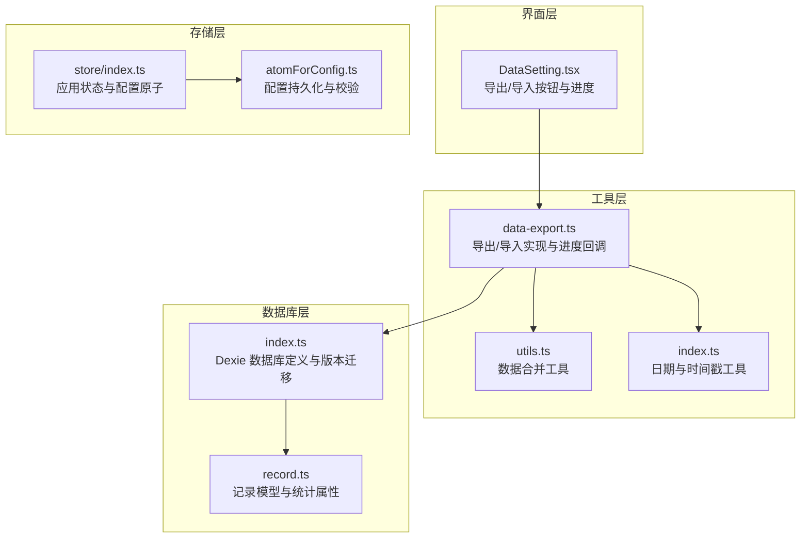
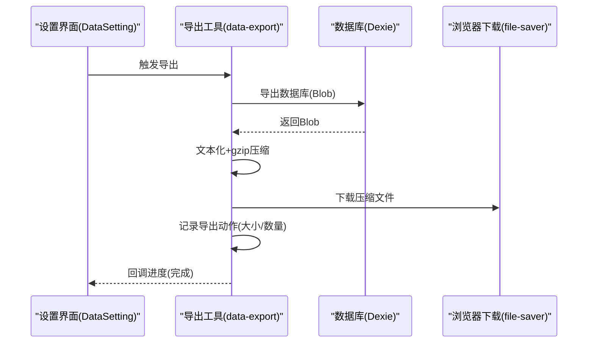
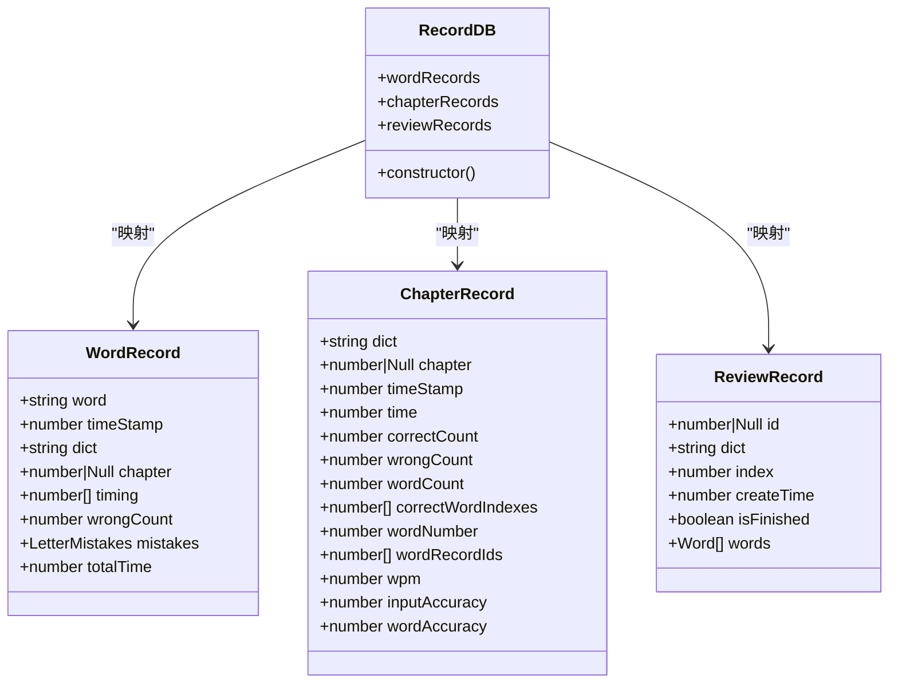
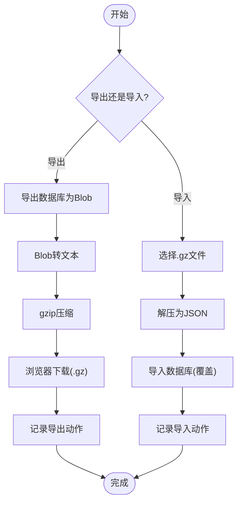
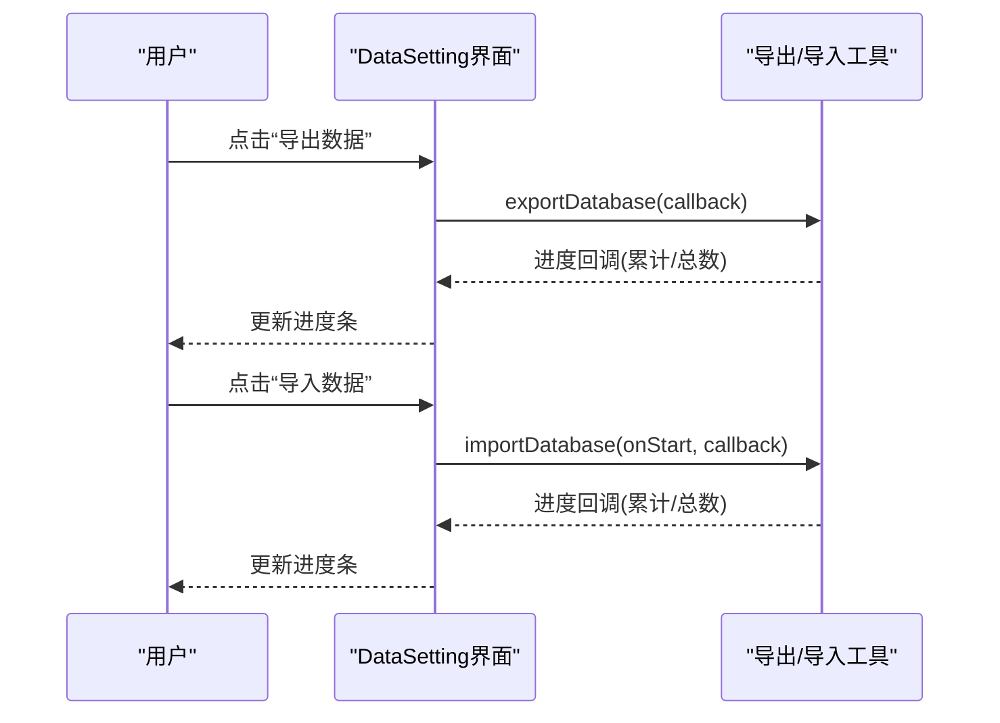
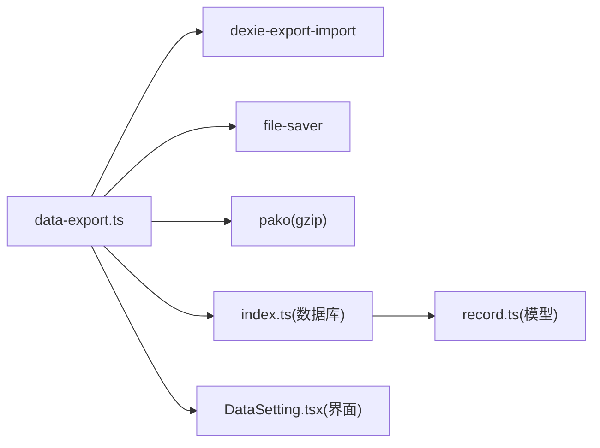

# 备份与恢复

<cite>
**本文引用的文件**
- [src/utils/db/data-export.ts](file://src/utils/db/data-export.ts)
- [src/utils/db/index.ts](file://src/utils/db/index.ts)
- [src/utils/db/record.ts](file://src/utils/db/record.ts)
- [src/utils/db/utils.ts](file://src/utils/db/utils.ts)
- [src/pages/Typing/components/Setting/DataSetting.tsx](file://src/pages/Typing/components/Setting/DataSetting.tsx)
- [src/store/index.ts](file://src/store/index.ts)
- [src/store/atomForConfig.ts](file://src/store/atomForConfig.ts)
- [src/utils/index.ts](file://src/utils/index.ts)
- [README.md](file://README.md)
</cite>

## 目录

1. [简介](#简介)
2. [项目结构](#项目结构)
3. [核心组件](#核心组件)
4. [架构总览](#架构总览)
5. [详细组件分析](#详细组件分析)
6. [依赖关系分析](#依赖关系分析)
7. [性能考量](#性能考量)
8. [故障排除指南](#故障排除指南)
9. [结论](#结论)
10. [附录](#附录)

## 简介

本技术文档围绕“备份与恢复”功能展开，系统性阐述当前实现的全量备份、导入/覆盖恢复、数据验证与完整性检查、存储位置与命名规则、版本管理策略，以及面向跨设备与云端的迁移与同步方案建议。文档同时提供配置与操作指引、故障排除方法与最佳实践，帮助开发者与用户高效、安全地管理练习数据。

## 项目结构

备份与恢复功能主要位于数据库工具层与设置界面层：

- 数据库层：定义 IndexedDB 模式、记录模型与导出/导入逻辑
- 工具层：导出/导入进度回调、压缩与下载、动作记录
- 界面层：数据设置页提供导出/导入按钮与进度反馈
- 存储层：配置与状态持久化（用于辅助理解数据范围）

图表来源

- [src/pages/Typing/components/Setting/DataSetting.tsx](file://src/pages/Typing/components/Setting/DataSetting.tsx#L1-L128)
- [src/utils/db/data-export.ts](file://src/utils/db/data-export.ts#L1-L68)
- [src/utils/db/index.ts](file://src/utils/db/index.ts#L1-L136)
- [src/utils/db/record.ts](file://src/utils/db/record.ts#L1-L186)
- [src/utils/db/utils.ts](file://src/utils/db/utils.ts#L1-L18)
- [src/utils/index.ts](file://src/utils/index.ts#L85-L130)
- [src/store/index.ts](file://src/store/index.ts#L1-L118)
- [src/store/atomForConfig.ts](file://src/store/atomForConfig.ts#L1-L45)

章节来源

- [src/pages/Typing/components/Setting/DataSetting.tsx](file://src/pages/Typing/components/Setting/DataSetting.tsx#L1-L128)
- [src/utils/db/data-export.ts](file://src/utils/db/data-export.ts#L1-L68)
- [src/utils/db/index.ts](file://src/utils/db/index.ts#L1-L136)
- [src/utils/db/record.ts](file://src/utils/db/record.ts#L1-L186)
- [src/utils/db/utils.ts](file://src/utils/db/utils.ts#L1-L18)
- [src/utils/index.ts](file://src/utils/index.ts#L85-L130)
- [src/store/index.ts](file://src/store/index.ts#L1-L118)
- [src/store/atomForConfig.ts](file://src/store/atomForConfig.ts#L1-L45)

## 核心组件

- 数据库定义与版本迁移：定义 IndexedDB 表结构与版本演进，支持历史数据兼容
- 记录模型：封装单词记录、章节记录、复习记录等，提供统计属性
- 导出/导入工具：基于 Dexie 导出导入库，提供进度回调、压缩与下载
- 设置界面：提供导出/导入按钮、进度条与提示文案
- 工具函数：日期格式化、时间戳转换、数据合并等

章节来源

- [src/utils/db/index.ts](file://src/utils/db/index.ts#L11-L35)
- [src/utils/db/record.ts](file://src/utils/db/record.ts#L4-L186)
- [src/utils/db/data-export.ts](file://src/utils/db/data-export.ts#L16-L67)
- [src/pages/Typing/components/Setting/DataSetting.tsx](file://src/pages/Typing/components/Setting/DataSetting.tsx#L8-L127)
- [src/utils/index.ts](file://src/utils/index.ts#L85-L130)

## 架构总览

备份与恢复采用“界面触发—工具处理—数据库交互—文件落盘”的链路，导出时先导出数据库为 Blob，再进行 gzip 压缩，最后通过浏览器下载；导入时从文件读取 gzip，解压后导入数据库，覆盖现有数据。

图表来源

- [src/pages/Typing/components/Setting/DataSetting.tsx](file://src/pages/Typing/components/Setting/DataSetting.tsx#L28-L32)
- [src/utils/db/data-export.ts](file://src/utils/db/data-export.ts#L16-L32)

章节来源

- [src/pages/Typing/components/Setting/DataSetting.tsx](file://src/pages/Typing/components/Setting/DataSetting.tsx#L15-L54)
- [src/utils/db/data-export.ts](file://src/utils/db/data-export.ts#L16-L32)

## 详细组件分析

### 数据库与记录模型

- 数据库版本与表结构：定义 wordRecords、chapterRecords、reviewRecords 等表，支持字段演进与版本迁移
- 记录模型：封装单词记录、章节记录、复习记录，提供统计属性（如 WPM、准确率等）
- 数据合并工具：合并字母级错误映射，便于统计与分析

图表来源

- [src/utils/db/index.ts](file://src/utils/db/index.ts#L11-L41)
- [src/utils/db/record.ts](file://src/utils/db/record.ts#L24-L146)

章节来源

- [src/utils/db/index.ts](file://src/utils/db/index.ts#L11-L41)
- [src/utils/db/record.ts](file://src/utils/db/record.ts#L4-L186)
- [src/utils/db/utils.ts](file://src/utils/db/utils.ts#L3-L17)

### 导出与导入实现

- 导出流程：导出数据库为 Blob，文本化后 gzip 压缩，使用浏览器下载 API 保存为 .gz 文件，记录导出动作（大小、记录数）
- 导入流程：选择 .gz 文件，解压为 JSON，导入数据库，覆盖现有数据，记录导入动作（大小、记录数）
- 进度回调：导出/导入均支持进度回调，界面实时更新进度条

图表来源

- [src/utils/db/data-export.ts](file://src/utils/db/data-export.ts#L16-L67)

章节来源

- [src/utils/db/data-export.ts](file://src/utils/db/data-export.ts#L16-L67)

### 设置界面与交互

- 导出：点击按钮触发导出，禁用按钮直至完成，进度条实时更新
- 导入：点击按钮触发文件选择，选择文件后开始导入，进度条实时更新
- 提示与警告：明确覆盖风险与文件完整性要求

图表来源

- [src/pages/Typing/components/Setting/DataSetting.tsx](file://src/pages/Typing/components/Setting/DataSetting.tsx#L8-L127)

章节来源

- [src/pages/Typing/components/Setting/DataSetting.tsx](file://src/pages/Typing/components/Setting/DataSetting.tsx#L8-L127)

### 数据验证与完整性检查

- 导入参数：允许版本差异、缺失表、名称差异、主键变更，覆盖值，清空表后再导入，保证一致性
- 进度回调：通过 totalRows/completedRows/done 判断完成状态
- 记录动作：导出/导入后统计记录数量与文件大小，便于核对

章节来源

- [src/utils/db/data-export.ts](file://src/utils/db/data-export.ts#L50-L63)

### 存储位置、命名规则与版本管理

- 存储位置：浏览器本地存储（IndexedDB），导出文件保存至本地磁盘
- 命名规则：文件名为“Qwerty-Learner-User-Data-YYYYMMDD.gz”，日期来自工具函数
- 版本管理：数据库版本迁移支持字段演进；导入时接受版本差异与缺失表，避免因版本不一致导致导入失败

章节来源

- [src/utils/db/data-export.ts](file://src/utils/db/data-export.ts#L29-L31)
- [src/utils/index.ts](file://src/utils/index.ts#L85-L92)
- [src/utils/db/index.ts](file://src/utils/db/index.ts#L19-L34)

### 自动备份策略

当前实现为手动触发的全量备份。若需自动备份，可结合浏览器定时任务或扩展机制在后台定期导出数据。由于本项目为前端应用，自动备份需考虑：

- 用户授权与隐私
- 存储配额与压缩策略
- 失败重试与通知

（本节为概念性建议，不直接对应具体代码实现）

## 依赖关系分析

- 导出/导入依赖 Dexie 导出导入库与文件下载库
- 压缩依赖 gzip 库
- 进度回调依赖 UI 层状态管理
- 数据库版本迁移依赖 Dexie 版本声明

图表来源

- [src/utils/db/data-export.ts](file://src/utils/db/data-export.ts#L17-L18)
- [src/utils/db/index.ts](file://src/utils/db/index.ts#L1-L10)
- [src/utils/db/record.ts](file://src/utils/db/record.ts#L1-L10)

章节来源

- [src/utils/db/data-export.ts](file://src/utils/db/data-export.ts#L1-L68)
- [src/utils/db/index.ts](file://src/utils/db/index.ts#L1-L136)
- [src/utils/db/record.ts](file://src/utils/db/record.ts#L1-L186)

## 性能考量

- 导出/导入为一次性大对象操作，建议在空闲时段或网络良好的环境下执行
- 压缩可显著降低文件体积，但会增加 CPU 开销
- 进度回调应避免频繁渲染，可采用节流策略
- 数据库版本迁移与导入覆盖策略可减少不必要写入，提升导入效率

（本节为通用性能建议）

## 故障排除指南

- 导入文件为空或无法选择：确认文件类型为 .gz，且文件未损坏
- 导入后数据未更新：检查导入覆盖策略与清空表设置，确认导入完成回调
- 导出进度卡住：检查浏览器下载权限与存储空间
- 版本不兼容：数据库版本迁移与导入参数已允许版本差异，若仍失败，尝试重新导出最新版本数据
- 进度条不更新：确认回调函数正确传递给导出/导入工具

章节来源

- [src/utils/db/data-export.ts](file://src/utils/db/data-export.ts#L34-L67)
- [src/pages/Typing/components/Setting/DataSetting.tsx](file://src/pages/Typing/components/Setting/DataSetting.tsx#L15-L54)

## 结论

当前备份与恢复功能以手动全量备份为核心，具备进度反馈与覆盖导入能力，满足跨设备与云端迁移的基本需求。建议后续引入自动备份策略、增量备份与版本对比机制，以进一步提升用户体验与数据安全性。

## 附录

### 备份策略配置与操作指引

- 导出数据
  - 打开设置页面，点击“导出数据”，等待进度条完成
  - 文件保存为“Qwerty-Learner-User-Data-YYYYMMDD.gz”
- 导入数据
  - 点击“导入数据”，选择目标 .gz 文件
  - 导入将覆盖当前所有练习数据，请谨慎操作
- 数据验证
  - 导出/导入完成后，系统记录文件大小与记录数量，可用于核对

章节来源

- [src/pages/Typing/components/Setting/DataSetting.tsx](file://src/pages/Typing/components/Setting/DataSetting.tsx#L60-L121)
- [src/utils/db/data-export.ts](file://src/utils/db/data-export.ts#L16-L32)
- [src/utils/db/data-export.ts](file://src/utils/db/data-export.ts#L50-L63)

### 数据迁移与跨设备同步方案

- 手动迁移：导出后通过任意介质传输至目标设备，再导入
- 云端同步：将导出文件上传至网盘，跨设备下载后导入
- 自动化建议：结合浏览器定时任务或扩展机制定期导出，注意隐私与配额

（本节为概念性建议，不直接对应具体代码实现）

### 最佳实践

- 定期导出重要数据，建议在完成阶段性练习后执行
- 导入前做好本地数据备份，以防意外覆盖
- 使用稳定网络与空闲时段执行导出/导入
- 导入文件务必来自可信来源，避免篡改

（本节为通用建议）
