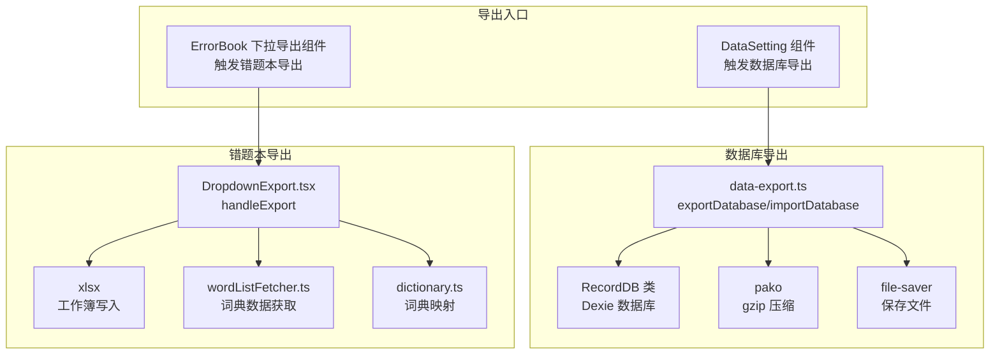
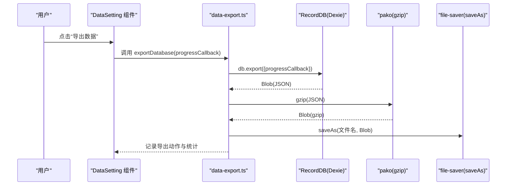
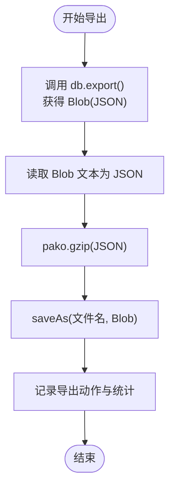
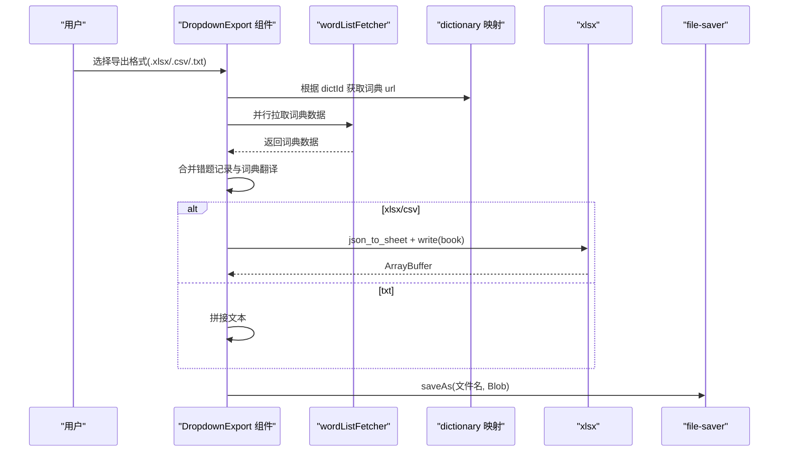
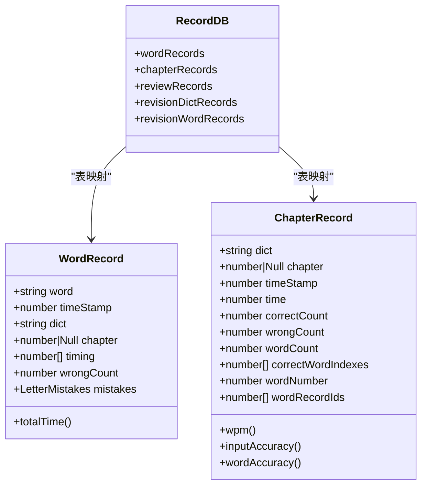
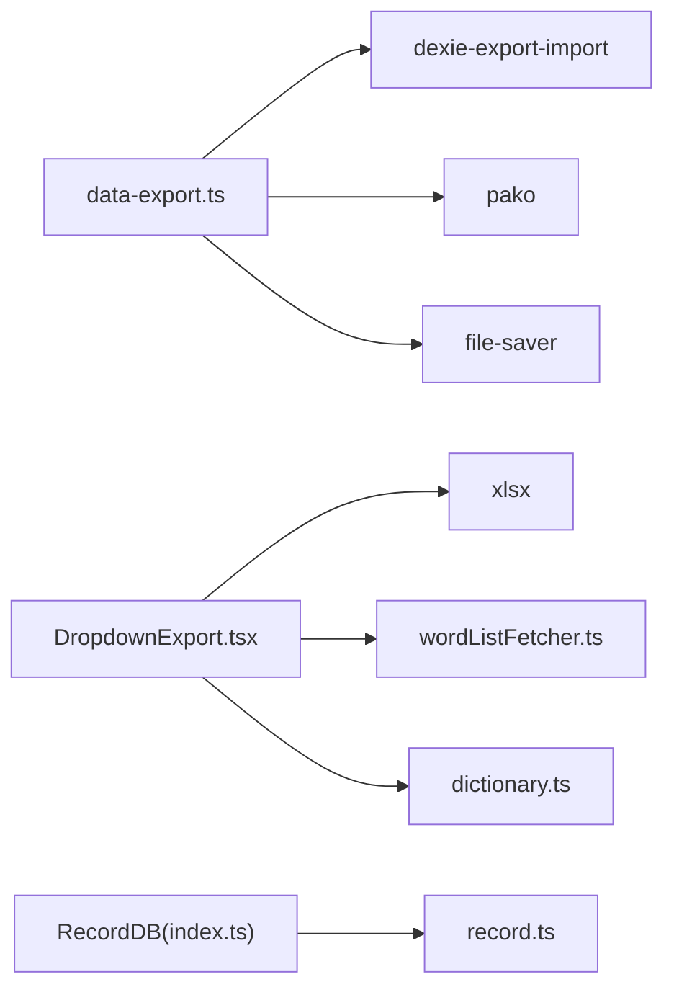

# 数据导出功能

<cite>
**本文引用的文件**
- [src/utils/db/data-export.ts](file://src/utils/db/data-export.ts)
- [src/pages/Typing/components/Setting/DataSetting.tsx](file://src/pages/Typing/components/Setting/DataSetting.tsx)
- [src/utils/db/index.ts](file://src/utils/db/index.ts)
- [src/utils/db/record.ts](file://src/utils/db/record.ts)
- [src/pages/ErrorBook/DropdownExport.tsx](file://src/pages/ErrorBook/DropdownExport.tsx)
- [src/resources/dictionary.ts](file://src/resources/dictionary.ts)
- [src/utils/wordListFetcher.ts](file://src/utils/wordListFetcher.ts)
- [src/utils/db/utils.ts](file://src/utils/db/utils.ts)
- [package.json](file://package.json)
</cite>

## 目录

1. [简介](#简介)
2. [项目结构](#项目结构)
3. [核心组件](#核心组件)
4. [架构概览](#架构概览)
5. [详细组件分析](#详细组件分析)
6. [依赖关系分析](#依赖关系分析)
7. [性能与内存优化](#性能与内存优化)
8. [故障排查指南](#故障排查指南)
9. [结论](#结论)
10. [附录](#附录)

## 简介

本文件系统性梳理并解释本项目的“数据导出”能力，覆盖以下方面：

- 导出机制与流程：本地数据库导出、错题本导出、文件生成与压缩
- 支持的导出格式与转换规则：.gz 压缩包（数据库）、.xlsx/.csv（错题本）
- 数据序列化与文件生成：JSON 序列化、gzip 压缩、Excel 工作簿写入
- 过滤、排序与聚合：按词典分组、按错误次数排序、按词典映射翻译
- 大文件处理策略与内存优化：并发拉取词典数据、流式处理思路
- 批量导出与模板定制：多格式选择、文件命名与下载
- 开发者使用示例与最佳实践

## 项目结构

围绕数据导出的相关模块分布如下：

- 数据库导出与导入：位于数据库工具层，负责本地 IndexedDB 的导出与导入
- 错题本导出：位于页面组件层，负责将错题数据导出为 Excel 或 CSV
- 数据模型与存储：定义数据结构与数据库版本迁移
- 词典资源与词典数据获取：提供词典元数据与远程词典数据拉取

图表来源

- [src/pages/Typing/components/Setting/DataSetting.tsx](file://src/pages/Typing/components/Setting/DataSetting.tsx#L1-L127)
- [src/utils/db/data-export.ts](file://src/utils/db/data-export.ts#L1-L68)
- [src/utils/db/index.ts](file://src/utils/db/index.ts#L1-L136)
- [src/pages/ErrorBook/DropdownExport.tsx](file://src/pages/ErrorBook/DropdownExport.tsx#L1-L131)
- [src/utils/wordListFetcher.ts](file://src/utils/wordListFetcher.ts#L1-L10)
- [src/resources/dictionary.ts](file://src/resources/dictionary.ts#L1-L800)

章节来源

- [src/pages/Typing/components/Setting/DataSetting.tsx](file://src/pages/Typing/components/Setting/DataSetting.tsx#L1-L127)
- [src/utils/db/data-export.ts](file://src/utils/db/data-export.ts#L1-L68)
- [src/utils/db/index.ts](file://src/utils/db/index.ts#L1-L136)
- [src/pages/ErrorBook/DropdownExport.tsx](file://src/pages/ErrorBook/DropdownExport.tsx#L1-L131)
- [src/utils/wordListFetcher.ts](file://src/utils/wordListFetcher.ts#L1-L10)
- [src/resources/dictionary.ts](file://src/resources/dictionary.ts#L1-L800)

## 核心组件

- 数据库导出/导入工具：提供进度回调、gzip 压缩、文件保存与统计上报
- 错题本导出组件：提供 .xlsx/.csv 导出，支持并发拉取词典数据并合并翻译
- 数据库模型与版本：定义 WordRecord/ChapterRecord/ReviewRecord 等实体及版本迁移
- 词典资源与数据获取：提供词典元数据与远程词典数据拉取

章节来源

- [src/utils/db/data-export.ts](file://src/utils/db/data-export.ts#L1-L68)
- [src/pages/ErrorBook/DropdownExport.tsx](file://src/pages/ErrorBook/DropdownExport.tsx#L1-L131)
- [src/utils/db/index.ts](file://src/utils/db/index.ts#L1-L136)
- [src/utils/db/record.ts](file://src/utils/db/record.ts#L1-L186)
- [src/resources/dictionary.ts](file://src/resources/dictionary.ts#L1-L800)
- [src/utils/wordListFetcher.ts](file://src/utils/wordListFetcher.ts#L1-L10)

## 架构概览

本项目的数据导出分为两条路径：

- 本地数据库导出：将 Dexie 数据库导出为 JSON，再用 gzip 压缩为 .gz 文件，便于跨设备/浏览器迁移
- 错题本导出：从本地错题记录出发，按词典映射拉取词典数据，生成 Excel/CSV 文件

图表来源

- [src/pages/Typing/components/Setting/DataSetting.tsx](file://src/pages/Typing/components/Setting/DataSetting.tsx#L1-L127)
- [src/utils/db/data-export.ts](file://src/utils/db/data-export.ts#L1-L68)
- [src/utils/db/index.ts](file://src/utils/db/index.ts#L1-L136)

## 详细组件分析

### 数据库导出与导入（本地数据迁移）

- 导出流程
  - 调用 Dexie 的导出方法，获得包含所有表数据的 Blob
  - 读取 Blob 文本为 JSON，使用 pako 进行 gzip 压缩
  - 使用 file-saver 将压缩后的 Blob 保存为 .gz 文件
  - 上报导出动作与统计（文件大小、记录条数）
- 导入流程
  - 弹出文件选择器，限制文件类型为 .gz
  - 解压文件内容为 JSON 字符串，构造 Blob 后调用 Dexie 导入
  - 提供进度回调，支持覆盖策略与表结构差异处理
- 进度反馈
  - 通过 progressCallback 接收 totalRows/completedRows/done，用于 UI 进度条更新

图表来源

- [src/utils/db/data-export.ts](file://src/utils/db/data-export.ts#L16-L32)

章节来源

- [src/utils/db/data-export.ts](file://src/utils/db/data-export.ts#L1-L68)
- [src/pages/Typing/components/Setting/DataSetting.tsx](file://src/pages/Typing/components/Setting/DataSetting.tsx#L1-L127)

### 错题本导出（Excel/CSV）

- 功能概述
  - 从渲染的错题记录中提取词典标识，去重后并发拉取对应词典数据
  - 将错题记录与词典翻译合并，生成统一的导出数据结构
  - 依据选择的格式（xlsx/csv/txt）生成文件并下载
- 数据结构与字段
  - 单词、释义、错误次数、词典名称
- 并发策略
  - 使用 Promise.all 并行拉取多个词典数据，减少等待时间
- 文件生成
  - txt：拼接文本行
  - xlsx/csv：使用 xlsx 写入工作簿，设置 sheet 名称与类型

图表来源

- [src/pages/ErrorBook/DropdownExport.tsx](file://src/pages/ErrorBook/DropdownExport.tsx#L27-L99)
- [src/utils/wordListFetcher.ts](file://src/utils/wordListFetcher.ts#L1-L10)
- [src/resources/dictionary.ts](file://src/resources/dictionary.ts#L1-L800)

章节来源

- [src/pages/ErrorBook/DropdownExport.tsx](file://src/pages/ErrorBook/DropdownExport.tsx#L1-L131)
- [src/utils/wordListFetcher.ts](file://src/utils/wordListFetcher.ts#L1-L10)
- [src/resources/dictionary.ts](file://src/resources/dictionary.ts#L1-L800)

### 数据模型与版本管理

- 数据模型
  - WordRecord：单词记录，包含字幕错误时间差、错误次数、错误字母映射
  - ChapterRecord：章节记录，包含正确/错误按键计数、用时、单词数、单词记录 ID 列表
  - ReviewRecord/Revision\*：复习相关记录
- 版本迁移
  - 通过 Dexie 的 version/stores 定义表结构与索引，支持字段演进（如错误字段从 errorCount 迁移到 wrongCount）

图表来源

- [src/utils/db/index.ts](file://src/utils/db/index.ts#L11-L41)
- [src/utils/db/record.ts](file://src/utils/db/record.ts#L4-L186)

章节来源

- [src/utils/db/index.ts](file://src/utils/db/index.ts#L1-L136)
- [src/utils/db/record.ts](file://src/utils/db/record.ts#L1-L186)

### 进度回调与 UI 更新

- 数据库导出/导入均提供进度回调，UI 根据 totalRows/completedRows/done 更新进度条
- DataSetting 组件封装了导出/导入的触发与进度展示逻辑

章节来源

- [src/pages/Typing/components/Setting/DataSetting.tsx](file://src/pages/Typing/components/Setting/DataSetting.tsx#L1-L127)
- [src/utils/db/data-export.ts](file://src/utils/db/data-export.ts#L16-L32)

## 依赖关系分析

- 外部依赖
  - dexie：IndexedDB 封装与导出导入
  - dexie-export-import：数据库导出导入能力
  - pako：gzip 压缩
  - file-saver：浏览器端保存文件
  - xlsx：Excel 工作簿写入
- 内部依赖
  - 数据模型与版本迁移：RecordDB 与各实体类
  - 词典资源与数据获取：dictionary.ts 与 wordListFetcher.ts

图表来源

- [src/utils/db/data-export.ts](file://src/utils/db/data-export.ts#L1-L68)
- [src/pages/ErrorBook/DropdownExport.tsx](file://src/pages/ErrorBook/DropdownExport.tsx#L1-L131)
- [src/utils/db/index.ts](file://src/utils/db/index.ts#L1-L136)
- [src/utils/db/record.ts](file://src/utils/db/record.ts#L1-L186)
- [src/utils/wordListFetcher.ts](file://src/utils/wordListFetcher.ts#L1-L10)
- [src/resources/dictionary.ts](file://src/resources/dictionary.ts#L1-L800)
- [package.json](file://package.json#L30-L58)

章节来源

- [package.json](file://package.json#L30-L58)

## 性能与内存优化

- 并发拉取词典数据
  - 错题本导出中，对不同词典 URL 使用 Promise.all 并行获取，降低总等待时间
- 流式与分块处理
  - 数据库导出采用 Blob(JSON) -> gzip -> Blob(gzip) 的链路，避免一次性加载全部数据到内存
- 压缩与体积控制
  - 使用 gzip 对导出的 JSON 进行压缩，显著降低文件体积
- UI 进度反馈
  - 通过 progressCallback 实时更新进度，避免长时间无响应
- 大文件下载
  - 使用 file-saver 保存 Blob，避免大字符串在内存中的多次拼接

章节来源

- [src/pages/ErrorBook/DropdownExport.tsx](file://src/pages/ErrorBook/DropdownExport.tsx#L40-L52)
- [src/utils/db/data-export.ts](file://src/utils/db/data-export.ts#L26-L31)

## 故障排查指南

- 导出失败或文件损坏
  - 检查导出过程中是否抛出异常，确认 pako/xlsx/file-saver 是否正常加载
  - 确认导出文件类型与扩展名匹配（.gz/.xlsx/.csv/.txt）
- 导入失败或数据不一致
  - 确认导入文件为 .gz 压缩包
  - 检查 Dexie 导入参数（版本差异、表缺失、主键变更等）是否允许
- 错题本导出为空或翻译缺失
  - 检查词典映射 idDictionaryMap 是否包含对应 dictId
  - 检查网络请求是否成功，确保词典数据可访问
- 性能问题
  - 若词典数量较多导致并发过多，可考虑分批拉取或增加节流
  - 大型 Excel 导出时注意浏览器内存占用，必要时拆分工作表

章节来源

- [src/utils/db/data-export.ts](file://src/utils/db/data-export.ts#L34-L67)
- [src/pages/ErrorBook/DropdownExport.tsx](file://src/pages/ErrorBook/DropdownExport.tsx#L93-L98)

## 结论

本项目提供了两类数据导出能力：

- 本地数据库导出：面向用户数据迁移与备份，采用 Dexie 导出 + gzip 压缩 + 浏览器保存
- 错题本导出：面向学习数据分析，支持 Excel/CSV/txt 多格式，具备并发词典数据拉取与翻译合并能力

整体设计清晰、模块职责明确，具备良好的扩展性与性能表现。后续可在以下方向进一步增强：

- 错题本导出支持更多筛选/排序/聚合维度
- 导出模板自定义（列顺序、列标题、格式样式）
- 分页/分片导出大型数据集
- 导出任务队列与后台导出

## 附录

### 支持的导出格式与转换规则

- 本地数据库导出
  - 输出：.gz 压缩包（内部为 JSON）
  - 规则：Dexie 导出 JSON -> pako gzip -> file-saver 保存
- 错题本导出
  - 输出：.xlsx/.csv/.txt
  - 规则：xlsx/csv 使用 xlsx 写入工作簿；txt 拼接文本行

章节来源

- [src/utils/db/data-export.ts](file://src/utils/db/data-export.ts#L16-L32)
- [src/pages/ErrorBook/DropdownExport.tsx](file://src/pages/ErrorBook/DropdownExport.tsx#L74-L85)

### 导出数据的过滤、排序与聚合

- 过滤
  - 错题本导出：按词典去重后再并发拉取词典数据
- 排序
  - 错题本导出：由外部组件提供排序类型（如按错误次数升序/降序），此处为调用方控制
- 聚合
  - 错题本导出：将错题记录与词典翻译合并，形成统一导出数据结构

章节来源

- [src/pages/ErrorBook/DropdownExport.tsx](file://src/pages/ErrorBook/DropdownExport.tsx#L32-L72)
- [src/pages/ErrorBook/index.tsx](file://src/pages/ErrorBook/index.tsx#L21-L21)

### 大文件处理策略与内存优化

- 并发拉取：Promise.all 并行获取词典数据
- 压缩传输：数据库导出采用 gzip 压缩
- 流式保存：使用 Blob 与 file-saver 保存，避免大字符串驻留内存

章节来源

- [src/pages/ErrorBook/DropdownExport.tsx](file://src/pages/ErrorBook/DropdownExport.tsx#L40-L52)
- [src/utils/db/data-export.ts](file://src/utils/db/data-export.ts#L26-L31)

### 批量导出与模板定制

- 批量导出
  - 错题本导出：支持多格式一键导出
  - 数据库导出：单次导出全部表数据
- 模板定制
  - 错题本导出：可通过调整导出数据结构与 xlsx 写入参数实现列顺序与样式定制
  - 数据库导出：当前为全量 JSON 导出，如需自定义可基于导出结果二次处理

章节来源

- [src/pages/ErrorBook/DropdownExport.tsx](file://src/pages/ErrorBook/DropdownExport.tsx#L101-L127)
- [src/utils/db/data-export.ts](file://src/utils/db/data-export.ts#L16-L32)

### 开发者使用示例

- 数据库导出
  - 在设置页点击“导出数据”，通过进度回调实时更新 UI
  - 导出完成后，浏览器自动下载 .gz 文件
- 错题本导出
  - 在错题本页面点击“导出”，选择 .xlsx 或 .csv
  - 导出完成后，浏览器自动下载对应文件

章节来源

- [src/pages/Typing/components/Setting/DataSetting.tsx](file://src/pages/Typing/components/Setting/DataSetting.tsx#L28-L32)
- [src/pages/ErrorBook/DropdownExport.tsx](file://src/pages/ErrorBook/DropdownExport.tsx#L101-L127)
