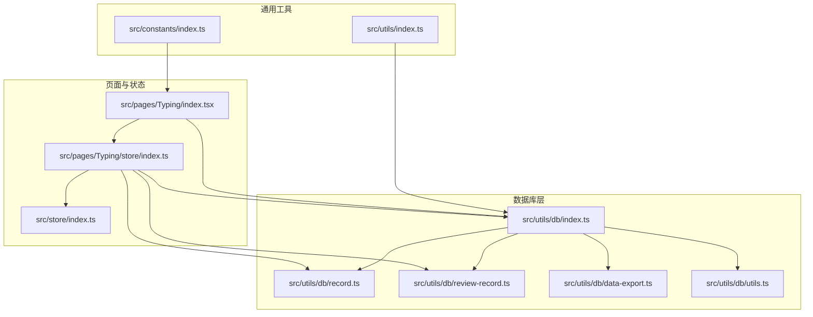
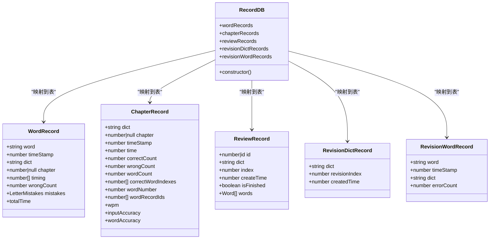
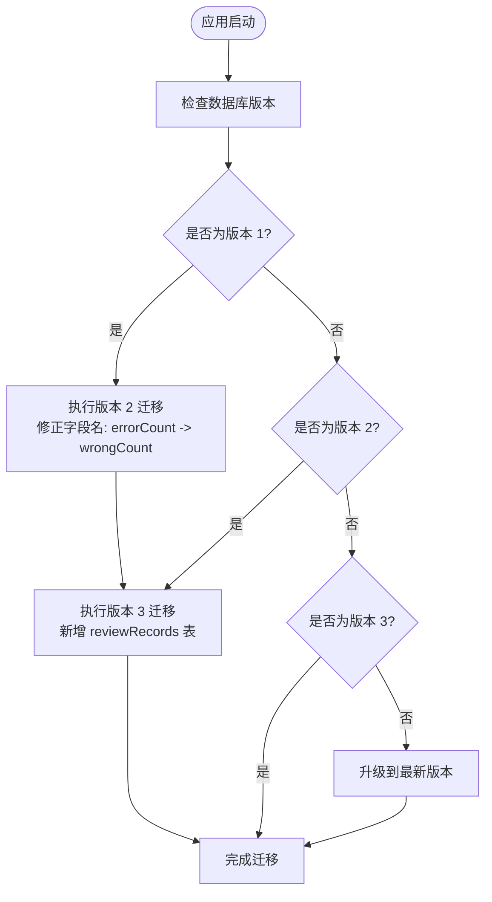
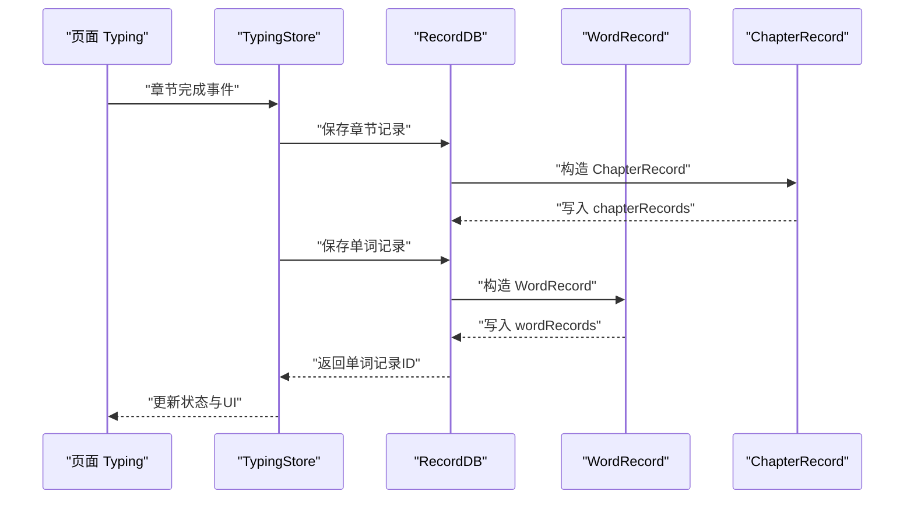
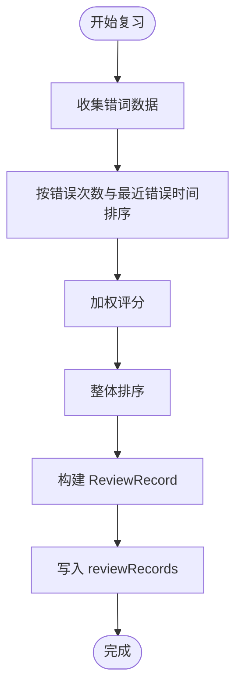
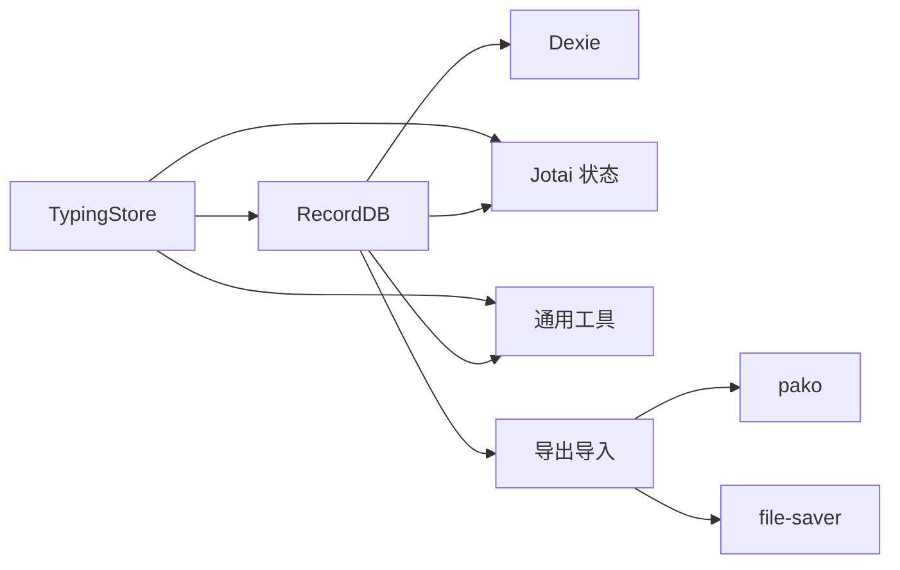

# 数据库设计

<cite>
**本文引用的文件**
- [src/utils/db/index.ts](file://src/utils/db/index.ts)
- [src/utils/db/record.ts](file://src/utils/db/record.ts)
- [src/utils/db/review-record.ts](file://src/utils/db/review-record.ts)
- [src/utils/db/data-export.ts](file://src/utils/db/data-export.ts)
- [src/utils/db/utils.ts](file://src/utils/db/utils.ts)
- [src/pages/Typing/index.tsx](file://src/pages/Typing/index.tsx)
- [src/pages/Typing/store/index.ts](file://src/pages/Typing/store/index.ts)
- [src/store/index.ts](file://src/store/index.ts)
- [src/utils/index.ts](file://src/utils/index.ts)
- [src/constants/index.ts](file://src/constants/index.ts)
</cite>

## 目录

1. [简介](#简介)
2. [项目结构](#项目结构)
3. [核心组件](#核心组件)
4. [架构总览](#架构总览)
5. [详细组件分析](#详细组件分析)
6. [依赖分析](#依赖分析)
7. [性能考虑](#性能考虑)
8. [故障排查指南](#故障排查指南)
9. [结论](#结论)
10. [附录](#附录)

## 简介

本文件面向数据库设计与实现，围绕基于 Dexie 的 IndexedDB 数据库架构展开，重点覆盖以下方面：

- 数据库版本管理与升级策略
- 表结构定义与索引设计
- 数据模型与字段语义
- 表间关系与数据完整性
- 性能优化与存储管理
- 数据导出导入与迁移兼容
- 扩展与维护建议

本设计服务于打字练习与复习场景，核心数据表包括 wordRecords（单词记录）、chapterRecords（章节记录）与 reviewRecords（复习记录），并通过版本化迁移保证向后兼容。

## 项目结构

数据库相关代码集中在 src/utils/db 目录，配合页面层 TypingStore 与全局状态管理，形成“视图状态 → 数据持久化”的闭环。

图表来源

- [src/utils/db/index.ts](file://src/utils/db/index.ts#L1-L136)
- [src/utils/db/record.ts](file://src/utils/db/record.ts#L1-L186)
- [src/utils/db/review-record.ts](file://src/utils/db/review-record.ts#L1-L69)
- [src/utils/db/data-export.ts](file://src/utils/db/data-export.ts#L1-L68)
- [src/utils/db/utils.ts](file://src/utils/db/utils.ts#L1-L18)
- [src/pages/Typing/index.tsx](file://src/pages/Typing/index.tsx#L1-L174)
- [src/pages/Typing/store/index.ts](file://src/pages/Typing/store/index.ts#L1-L227)
- [src/store/index.ts](file://src/store/index.ts#L1-L118)
- [src/utils/index.ts](file://src/utils/index.ts#L1-L130)
- [src/constants/index.ts](file://src/constants/index.ts#L1-L19)

章节来源

- [src/utils/db/index.ts](file://src/utils/db/index.ts#L1-L136)
- [src/utils/db/record.ts](file://src/utils/db/record.ts#L1-L186)
- [src/utils/db/review-record.ts](file://src/utils/db/review-record.ts#L1-L69)
- [src/utils/db/data-export.ts](file://src/utils/db/data-export.ts#L1-L68)
- [src/utils/db/utils.ts](file://src/utils/db/utils.ts#L1-L18)
- [src/pages/Typing/index.tsx](file://src/pages/Typing/index.tsx#L1-L174)
- [src/pages/Typing/store/index.ts](file://src/pages/Typing/store/index.ts#L1-L227)
- [src/store/index.ts](file://src/store/index.ts#L1-L118)
- [src/utils/index.ts](file://src/utils/index.ts#L1-L130)
- [src/constants/index.ts](file://src/constants/index.ts#L1-L19)

## 核心组件

- 数据库类 RecordDB：继承 Dexie，定义表与版本迁移规则，映射类到表。
- 数据模型：WordRecord、ChapterRecord、ReviewRecord、RevisionDictRecord、RevisionWordRecord。
- 导出导入：支持 gzip 压缩导出与导入，兼容版本差异与缺失表。
- 工具方法：合并字母级错误映射。

章节来源

- [src/utils/db/index.ts](file://src/utils/db/index.ts#L1-L136)
- [src/utils/db/record.ts](file://src/utils/db/record.ts#L1-L186)
- [src/utils/db/data-export.ts](file://src/utils/db/data-export.ts#L1-L68)
- [src/utils/db/utils.ts](file://src/utils/db/utils.ts#L1-L18)

## 架构总览

下图展示数据库版本演进与表结构关系，以及页面层如何触发记录写入。

图表来源

- [src/utils/db/index.ts](file://src/utils/db/index.ts#L1-L136)
- [src/utils/db/record.ts](file://src/utils/db/record.ts#L1-L186)

## 详细组件分析

### 数据库版本管理与迁移

- 版本 1：初始表结构，包含 wordRecords 与 chapterRecords。
- 版本 2：将 wordRecords 的字段名从 errorCount 改为 wrongCount，保持向后兼容。
- 版本 3：新增 reviewRecords 表，用于复习进度与单词序列管理。
- 迁移策略：Dexie 的 version().stores() 逐版本声明表结构，自动迁移旧数据；reviewRecords 仅在新版本引入。

图表来源

- [src/utils/db/index.ts](file://src/utils/db/index.ts#L19-L34)

章节来源

- [src/utils/db/index.ts](file://src/utils/db/index.ts#L19-L34)

### 表结构与索引设计

- wordRecords
  - 主键：自增 id
  - 字段：word、timeStamp、dict、chapter、timing、wrongCount、mistakes
  - 复合索引：[dict+chapter]
  - 设计要点：按字典与章节分组查询，便于统计与复习；timing 与 mistakes 提供细粒度分析。
- chapterRecords
  - 主键：自增 id
  - 字段：dict、chapter、timeStamp、time、correctCount、wrongCount、wordCount、correctWordIndexes、wordNumber、wordRecordIds
  - 复合索引：[dict+chapter]
  - 设计要点：记录整章表现，包含正确/错误计数、WPM、准确率等派生指标。
- reviewRecords
  - 主键：自增 id
  - 字段：dict、index、createTime、isFinished、words
  - 设计要点：用于复习流程控制，words 为复习单词序列，支持重复项。

章节来源

- [src/utils/db/index.ts](file://src/utils/db/index.ts#L21-L33)
- [src/utils/db/record.ts](file://src/utils/db/record.ts#L1-L186)

### 数据模型与字段语义

- WordRecord
  - timing：相邻字母输入时间差数组，可累加得到总耗时。
  - mistakes：字母级错误映射，键为字母索引，值为错误键集合。
- ChapterRecord
  - wpm、inputAccuracy、wordAccuracy：基于章节数据计算的派生指标。
- ReviewRecord
  - index：当前复习进度索引；isFinished：是否完成本轮复习。
- Revision\* 记录
  - 作为复习辅助的数据结构，用于字典与单词级别的复习索引与错误计数。

章节来源

- [src/utils/db/record.ts](file://src/utils/db/record.ts#L1-L186)

### 表间关系与数据完整性

- 关系设计
  - chapterRecords 与 wordRecords：通过 chapter 与 dict 关联；wordRecordIds 字段在章节记录中保存对应单词记录 ID 列表，形成“章节到单词”的一对多关联。
  - reviewRecords：与 dict 绑定，管理复习进度与单词序列。
- 完整性保障
  - 复合索引 [dict+chapter]：加速按字典与章节的查询与聚合。
  - 字段命名一致性：版本迁移确保字段名一致，避免查询失败。
  - 导入兼容：data-export 使用 acceptVersionDiff 与 acceptMissingTables，允许跨版本导入与缺失表容错。

章节来源

- [src/utils/db/index.ts](file://src/utils/db/index.ts#L21-L33)
- [src/utils/db/record.ts](file://src/utils/db/record.ts#L48-L116)
- [src/utils/db/data-export.ts](file://src/utils/db/data-export.ts#L34-L68)

### 写入流程与调用链

- 页面 Typing
  - 在章节结束时，若不再保存中，则调用保存章节记录。
- TypingStore
  - 维护打字状态，收集正确/错误计数、用户输入日志、单词记录 ID 列表。
  - 在每词结束后，保存单词记录，并回填该词的数据库 ID。
- 数据库层
  - 将 WordRecord/ChapterRecord 映射到表，执行插入或更新。

图表来源

- [src/pages/Typing/index.tsx](file://src/pages/Typing/index.tsx#L106-L114)
- [src/pages/Typing/store/index.ts](file://src/pages/Typing/store/index.ts#L1-L227)
- [src/utils/db/index.ts](file://src/utils/db/index.ts#L43-L122)
- [src/utils/db/record.ts](file://src/utils/db/record.ts#L24-L116)

章节来源

- [src/pages/Typing/index.tsx](file://src/pages/Typing/index.tsx#L106-L114)
- [src/pages/Typing/store/index.ts](file://src/pages/Typing/store/index.ts#L1-L227)
- [src/utils/db/index.ts](file://src/utils/db/index.ts#L43-L122)
- [src/utils/db/record.ts](file://src/utils/db/record.ts#L24-L116)

### 复习记录生成与管理

- 生成策略
  - 基于错词数据，按错误次数与最近错误时间进行排名，加权排序生成复习单词序列。
- 状态管理
  - 通过 useGetLatestReviewRecord 获取最新未完成的复习记录；通过 generateNewWordReviewRecord 生成新的复习记录并写入 reviewRecords。

图表来源

- [src/utils/db/review-record.ts](file://src/utils/db/review-record.ts#L1-L69)

章节来源

- [src/utils/db/review-record.ts](file://src/utils/db/review-record.ts#L1-L69)

### 导出导入与版本兼容

- 导出
  - 使用 dexie-export-import 导出全库，进度回调驱动 UI 更新；导出内容经 gzip 压缩并以日期命名保存。
- 导入
  - 读取 gzip 文件，解压为 JSON 后导入；开启 acceptVersionDiff 与 acceptMissingTables，允许跨版本与缺失表导入；clearTablesBeforeImport 与 overwriteValues 确保导入一致性。

章节来源

- [src/utils/db/data-export.ts](file://src/utils/db/data-export.ts#L1-L68)

### 字母级错误合并工具

- mergeLetterMistake：将两次输入的字母级错误映射合并，保留相同索引的错误历史，便于统计与分析。

章节来源

- [src/utils/db/utils.ts](file://src/utils/db/utils.ts#L1-L18)

## 依赖分析

- 组件耦合
  - TypingStore 依赖数据库层写入接口，同时依赖全局状态 currentDictIdAtom、currentChapterAtom、isReviewModeAtom 控制上下文。
  - 数据库层依赖 Dexie 与 Jotai（用于状态集成），并暴露 hooks 供页面使用。
- 外部依赖
  - dexie-export-import：提供数据库导出导入能力。
  - pako：gzip 压缩与解压。
  - file-saver：下载压缩文件。
- 潜在环路
  - 数据库层与页面层通过 hooks 与上下文交互，未见直接循环依赖；review-record.ts 引入 db 以读取记录，属于单向依赖。

图表来源

- [src/pages/Typing/store/index.ts](file://src/pages/Typing/store/index.ts#L1-L227)
- [src/utils/db/index.ts](file://src/utils/db/index.ts#L1-L136)
- [src/utils/db/data-export.ts](file://src/utils/db/data-export.ts#L1-L68)

章节来源

- [src/pages/Typing/store/index.ts](file://src/pages/Typing/store/index.ts#L1-L227)
- [src/utils/db/index.ts](file://src/utils/db/index.ts#L1-L136)
- [src/utils/db/data-export.ts](file://src/utils/db/data-export.ts#L1-L68)

## 性能考虑

- 索引优化
  - 为高频查询字段建立复合索引 [dict+chapter]，减少扫描成本。
  - wordRecords.timing 为数组，建议在统计时批量读取并本地聚合，避免多次 IO。
- 写入批量化
  - 单词记录写入后立即回填 ID，章节记录统一在完成后批量落盘，降低事务开销。
- 导出导入
  - 导出阶段使用进度回调，避免阻塞 UI；导入阶段启用 clearTablesBeforeImport 与 overwriteValues，确保一致性。
- 存储管理
  - 定期清理历史章节记录与过期复习记录，控制 IndexedDB 存储增长。
- 时间戳与精度
  - 使用 UTC 秒级时间戳，避免时区与精度问题；章节时间采用整秒，减少冗余存储。

[本节为通用建议，无需列出具体文件来源]

## 故障排查指南

- 导入失败或数据不一致
  - 检查导入配置：acceptVersionDiff、acceptMissingTables、overwriteValues、clearTablesBeforeImport 是否符合预期。
  - 确认文件格式为 gzip，且包含有效 JSON 结构。
- 查询结果为空
  - 确认 dict 与 chapter 参数是否匹配；检查复合索引 [dict+chapter] 是否正确使用。
- 性能异常
  - 检查是否频繁进行大范围扫描；为常用过滤字段添加索引或调整查询策略。
- 复习记录未更新
  - 确认 generateNewWordReviewRecord 已被调用，且 reviewRecords 中存在未完成记录；检查 isFinished 标志位。

章节来源

- [src/utils/db/data-export.ts](file://src/utils/db/data-export.ts#L34-L68)
- [src/utils/db/review-record.ts](file://src/utils/db/review-record.ts#L1-L69)

## 结论

本数据库设计以 Dexie 为核心，围绕打字练习与复习场景，建立了清晰的表结构与版本迁移策略。通过复合索引与派生指标，兼顾查询效率与分析深度；通过导出导入与版本兼容，保障数据可移植与向前兼容。建议在后续迭代中持续关注索引覆盖、批量写入与定期清理策略，以维持长期性能与稳定性。

[本节为总结，无需列出具体文件来源]

## 附录

### 字段定义与约束说明

- wordRecords
  - 主键：id（自增）
  - 字段：word（字符串）、timeStamp（整数，UTC 秒）、dict（字符串）、chapter（整数或 null）、timing（数字数组）、wrongCount（整数）、mistakes（对象映射）
  - 约束：唯一性由主键保证；dict 与 chapter 组合用于高效查询。
- chapterRecords
  - 主键：id（自增）
  - 字段：dict（字符串）、chapter（整数或 null）、timeStamp（整数，UTC 秒）、time（整数，秒）、correctCount（整数）、wrongCount（整数）、wordCount（整数）、correctWordIndexes（整数数组）、wordNumber（整数）、wordRecordIds（整数数组）
  - 约束：派生指标由字段计算，确保一致性。
- reviewRecords
  - 主键：id（自增）
  - 字段：dict（字符串）、index（整数）、createTime（整数，UTC 秒）、isFinished（布尔）、words（对象数组）
  - 约束：未完成记录需满足 isFinished=false；words 可含重复元素。

章节来源

- [src/utils/db/index.ts](file://src/utils/db/index.ts#L21-L33)
- [src/utils/db/record.ts](file://src/utils/db/record.ts#L1-L186)
