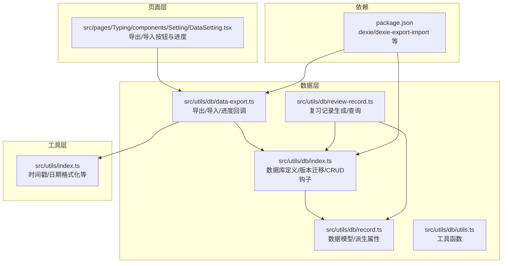
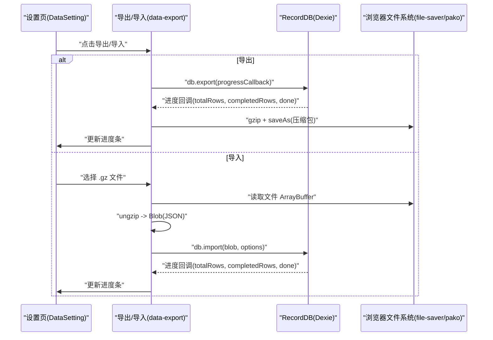
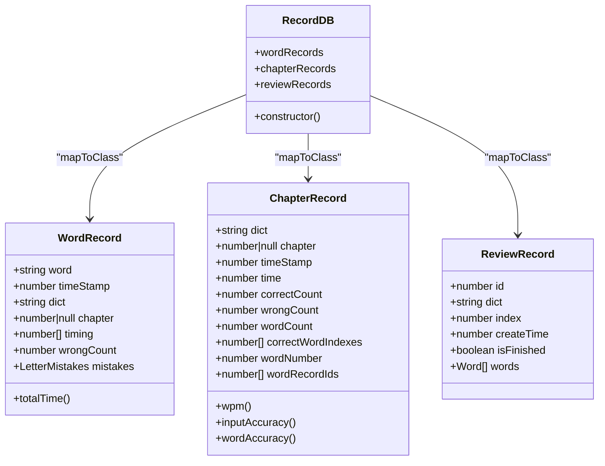
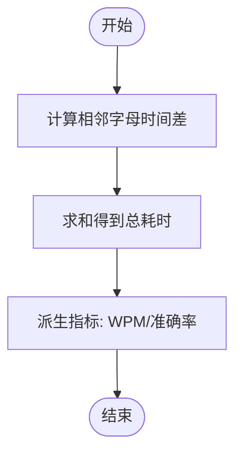
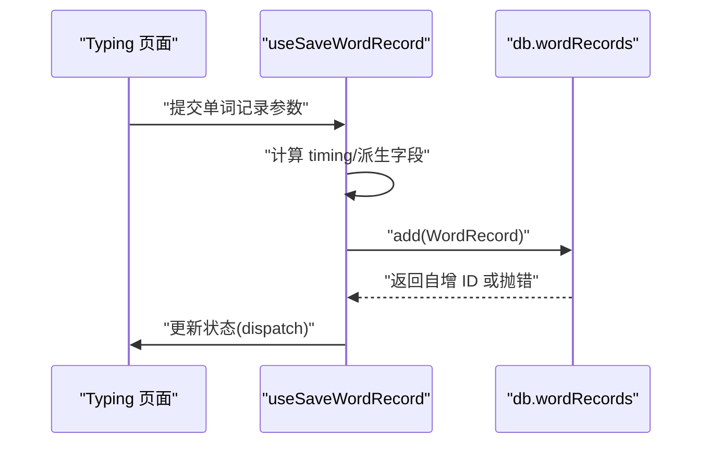
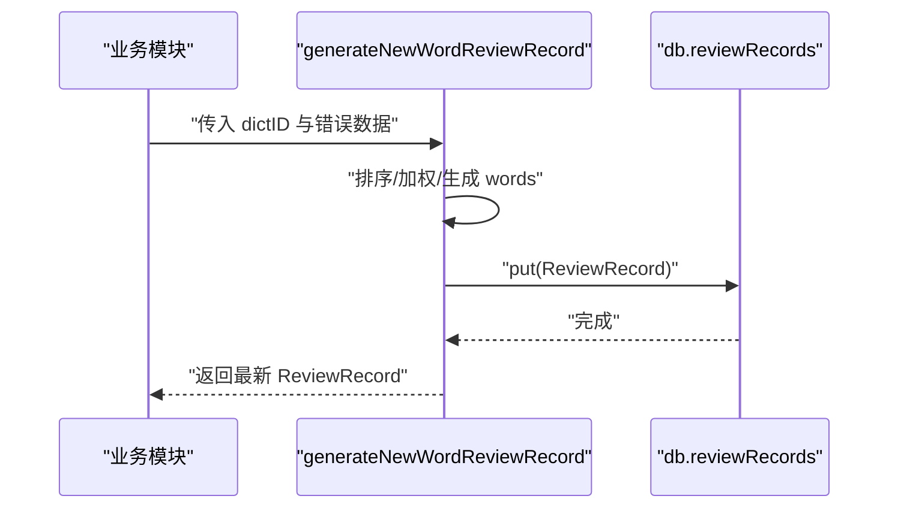
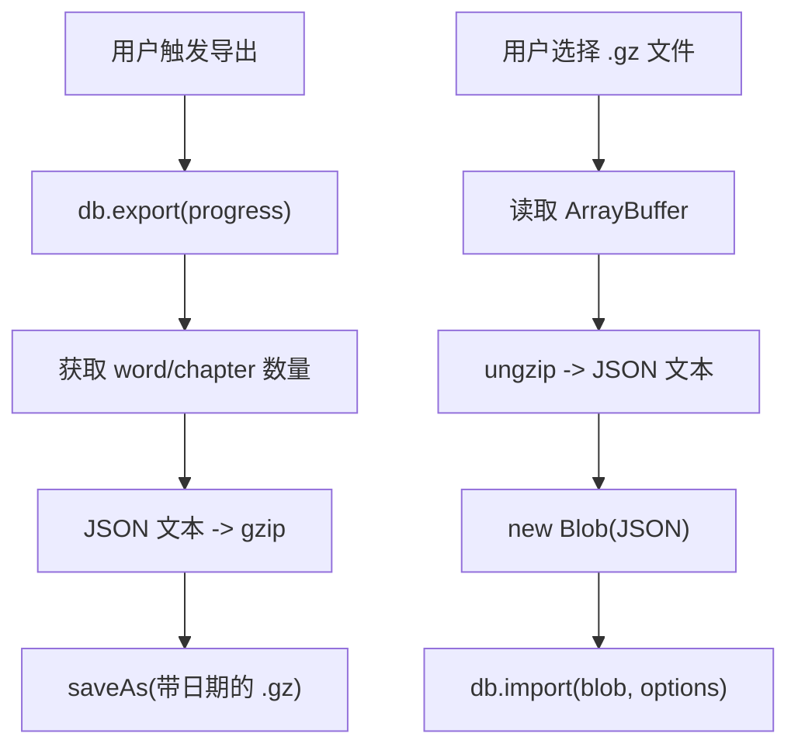
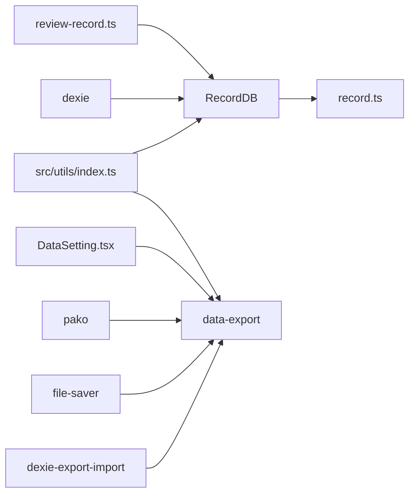

# 数据持久化系统

<cite>
**本文引用的文件**
- [src/utils/db/index.ts](file://src/utils/db/index.ts)
- [src/utils/db/record.ts](file://src/utils/db/record.ts)
- [src/utils/db/data-export.ts](file://src/utils/db/data-export.ts)
- [src/utils/db/review-record.ts](file://src/utils/db/review-record.ts)
- [src/utils/db/utils.ts](file://src/utils/db/utils.ts)
- [src/pages/Typing/components/Setting/DataSetting.tsx](file://src/pages/Typing/components/Setting/DataSetting.tsx)
- [src/utils/index.ts](file://src/utils/index.ts)
- [package.json](file://package.json)
</cite>

## 目录

1. [简介](#简介)
2. [项目结构](#项目结构)
3. [核心组件](#核心组件)
4. [架构总览](#架构总览)
5. [组件详解](#组件详解)
6. [依赖关系分析](#依赖关系分析)
7. [性能考量](#性能考量)
8. [故障排查指南](#故障排查指南)
9. [结论](#结论)
10. [附录](#附录)

## 简介

本文件面向开发者，系统性梳理基于 Dexie 的 IndexedDB 封装实现，覆盖数据库设计、数据模型与关系映射、CRUD 实现机制、事务与并发控制策略、备份/恢复/迁移、导出格式规范、性能优化与容量管理、一致性保障、错误处理与调试方法，并提供扩展与维护指引。目标是帮助你在不直接阅读源码的情况下，也能高效理解与维护该数据持久化体系。

## 项目结构

围绕数据持久化的核心代码集中在 src/utils/db 目录，配合页面层的导入导出入口与工具函数：

- 数据库定义与版本迁移：src/utils/db/index.ts
- 数据模型与派生属性：src/utils/db/record.ts
- 复习记录与生成逻辑：src/utils/db/review-record.ts
- 导出/导入流程与进度回调：src/utils/db/data-export.ts
- 字母错误合并工具：src/utils/db/utils.ts
- 页面入口（导出/导入 UI 与进度展示）：src/pages/Typing/components/Setting/DataSetting.tsx
- 通用工具（时间戳、日期格式化等）：src/utils/index.ts
- 依赖声明（dexie、dexie-export-import 等）：package.json



**图表来源**

- [src/utils/db/index.ts](file://src/utils/db/index.ts#L1-L136)
- [src/utils/db/record.ts](file://src/utils/db/record.ts#L1-L186)
- [src/utils/db/review-record.ts](file://src/utils/db/review-record.ts#L1-L69)
- [src/utils/db/data-export.ts](file://src/utils/db/data-export.ts#L1-L67)
- [src/utils/db/utils.ts](file://src/utils/db/utils.ts#L1-L18)
- [src/pages/Typing/components/Setting/DataSetting.tsx](file://src/pages/Typing/components/Setting/DataSetting.tsx#L1-L110)
- [src/utils/index.ts](file://src/utils/index.ts#L85-L130)
- [package.json](file://package.json#L1-L128)

**章节来源**

- [src/utils/db/index.ts](file://src/utils/db/index.ts#L1-L136)
- [src/utils/db/record.ts](file://src/utils/db/record.ts#L1-L186)
- [src/utils/db/review-record.ts](file://src/utils/db/review-record.ts#L1-L69)
- [src/utils/db/data-export.ts](file://src/utils/db/data-export.ts#L1-L67)
- [src/utils/db/utils.ts](file://src/utils/db/utils.ts#L1-L18)
- [src/pages/Typing/components/Setting/DataSetting.tsx](file://src/pages/Typing/components/Setting/DataSetting.tsx#L1-L110)
- [src/utils/index.ts](file://src/utils/index.ts#L85-L130)
- [package.json](file://package.json#L1-L128)

## 核心组件

- 数据库类与版本迁移
  - 使用 Dexie 定义 RecordDB，包含 wordRecords、chapterRecords、reviewRecords 等表，通过多版本 stores 配置实现迁移。
  - 通过 mapToClass 将表映射到模型类，便于使用类方法与派生属性。
- 数据模型
  - WordRecord、ChapterRecord、ReviewRecord、Revision\* 系列模型，定义字段与派生属性（如 totalTime、wpm、inputAccuracy、wordAccuracy）。
- CRUD 钩子
  - 提供 useSaveWordRecord、useSaveChapterRecord、useDeleteWordRecord 等 Hook，封装典型业务写入与删除路径。
- 复习记录
  - 生成复习计划（按错误次数与最新错误时间加权排序），并支持查询最新未完成记录。
- 导出/导入
  - 基于 dexie-export-import，提供压缩导出与进度回调；导入时可接受版本差异、清表覆盖等策略。
- 工具函数
  - 合并字母级错误记录，便于聚合统计。

**章节来源**

- [src/utils/db/index.ts](file://src/utils/db/index.ts#L1-L136)
- [src/utils/db/record.ts](file://src/utils/db/record.ts#L1-L186)
- [src/utils/db/review-record.ts](file://src/utils/db/review-record.ts#L1-L69)
- [src/utils/db/data-export.ts](file://src/utils/db/data-export.ts#L1-L67)
- [src/utils/db/utils.ts](file://src/utils/db/utils.ts#L1-L18)

## 架构总览

下图展示从页面到数据库的调用链路与关键交互点。



**图表来源**

- [src/pages/Typing/components/Setting/DataSetting.tsx](file://src/pages/Typing/components/Setting/DataSetting.tsx#L1-L110)
- [src/utils/db/data-export.ts](file://src/utils/db/data-export.ts#L1-L67)
- [src/utils/index.ts](file://src/utils/index.ts#L85-L130)
- [package.json](file://package.json#L1-L128)

## 组件详解

### 数据库与版本迁移（RecordDB）

- 表与索引
  - wordRecords：自增主键，复合索引 [dict+chapter]，字段包含 word、timeStamp、dict、chapter、timing、wrongCount、mistakes。
  - chapterRecords：自增主键，复合索引 [dict+chapter]，字段包含 dict、chapter、timeStamp、time、correctCount、wrongCount、wordCount、correctWordIndexes、wordNumber、wordRecordIds。
  - reviewRecords：自增主键，字段包含 dict、index、createTime、isFinished、words。
- 版本迁移
  - 通过 this.version(n).stores(...) 逐步演进，确保历史数据兼容。
- 类映射
  - 使用 mapToClass 将表映射到模型类，便于在业务层以类实例方式访问。



**图表来源**

- [src/utils/db/index.ts](file://src/utils/db/index.ts#L1-L136)
- [src/utils/db/record.ts](file://src/utils/db/record.ts#L1-L186)

**章节来源**

- [src/utils/db/index.ts](file://src/utils/db/index.ts#L1-L136)
- [src/utils/db/record.ts](file://src/utils/db/record.ts#L1-L186)

### 数据模型与派生属性

- WordRecord
  - timing 为相邻字母输入时间差数组，totalTime 为其累加和。
- ChapterRecord
  - 提供 wpm、inputAccuracy、wordAccuracy 等派生指标，便于前端展示与分析。
- ReviewRecord
  - 用于记录复习进度与计划，支持查询最新未完成记录。



**图表来源**

- [src/utils/db/record.ts](file://src/utils/db/record.ts#L1-L186)

**章节来源**

- [src/utils/db/record.ts](file://src/utils/db/record.ts#L1-L186)

### CRUD 实现机制与并发控制

- 写入
  - useSaveWordRecord：构造 WordRecord，调用 db.wordRecords.add，捕获异常并回传 dispatch 状态。
  - useSaveChapterRecord：构造 ChapterRecord，调用 db.chapterRecords.add。
- 删除
  - useDeleteWordRecord：按 word 与 dict 条件删除，返回删除数量。
- 并发控制
  - Dexie 默认在同域同命名空间下提供串行化事务语义，避免竞态。
  - 业务层通过 Hook 将状态更新与数据库写入解耦，减少 UI 与 DB 的耦合。



**图表来源**

- [src/utils/db/index.ts](file://src/utils/db/index.ts#L80-L122)

**章节来源**

- [src/utils/db/index.ts](file://src/utils/db/index.ts#L80-L122)

### 复习记录生成与查询

- 生成策略
  - 基于错误次数与最新错误时间进行排名，加权排序生成复习单词序列，写入 reviewRecords。
- 查询策略
  - 查询指定 dict 最近创建且未完成的记录；若已完成则返回 undefined。



**图表来源**

- [src/utils/db/review-record.ts](file://src/utils/db/review-record.ts#L1-L69)

**章节来源**

- [src/utils/db/review-record.ts](file://src/utils/db/review-record.ts#L1-L69)

### 备份、恢复与迁移

- 导出
  - 调用 db.export，接收进度回调，导出完成后 gzip 压缩并以文件名带日期保存。
- 导入
  - 选择 .gz 文件，ungzip 后以 Blob 形式导入，支持 acceptVersionDiff、acceptMissingTables、overwriteValues、clearTablesBeforeImport 等策略。
- 迁移
  - 通过多版本 stores 渐进升级，保证旧数据可用。



**图表来源**

- [src/utils/db/data-export.ts](file://src/utils/db/data-export.ts#L1-L67)
- [src/pages/Typing/components/Setting/DataSetting.tsx](file://src/pages/Typing/components/Setting/DataSetting.tsx#L1-L110)
- [src/utils/index.ts](file://src/utils/index.ts#L85-L130)

**章节来源**

- [src/utils/db/data-export.ts](file://src/utils/db/data-export.ts#L1-L67)
- [src/pages/Typing/components/Setting/DataSetting.tsx](file://src/pages/Typing/components/Setting/DataSetting.tsx#L1-L110)
- [src/utils/index.ts](file://src/utils/index.ts#L85-L130)

### 数据导出格式规范

- 导出内容
  - 包含所有表数据的 JSON 结构，经 gzip 压缩为 .gz 文件。
- 文件命名
  - Qwerty-Learner-User-Data-YYYYMMDD.gz。
- 导入策略
  - 支持版本差异、缺失表、名称差异、主键变更等宽容策略；默认覆盖写入并清表导入。

**章节来源**

- [src/utils/db/data-export.ts](file://src/utils/db/data-export.ts#L1-L67)
- [src/utils/index.ts](file://src/utils/index.ts#L85-L130)

### 数据一致性保障与错误处理

- 一致性
  - Dexie 事务语义保证同一命名空间下的串行化；复合索引 [dict+chapter] 有助于快速定位与更新。
- 错误处理
  - 写入/删除处均包裹 try/catch 并打印日志；导入导出通过进度回调反馈状态，UI 层根据 done 控制完成态。
- 调试
  - 使用浏览器开发者工具查看 IndexedDB 存储状态；结合进度回调定位卡顿或异常阶段。

**章节来源**

- [src/utils/db/index.ts](file://src/utils/db/index.ts#L108-L136)
- [src/utils/db/data-export.ts](file://src/utils/db/data-export.ts#L1-L67)

## 依赖关系分析

- 外部依赖
  - dexie：IndexedDB 封装与 ORM。
  - dexie-export-import：数据库导出/导入与进度回调。
  - file-saver：保存文件。
  - pako：gzip/ungzip 压缩。
- 内部依赖
  - 数据模型依赖工具函数（如 getUTCUnixTimestamp）。
  - 页面层依赖导出/导入流程与进度回调。



**图表来源**

- [package.json](file://package.json#L1-L128)
- [src/utils/db/data-export.ts](file://src/utils/db/data-export.ts#L1-L67)
- [src/utils/db/index.ts](file://src/utils/db/index.ts#L1-L136)
- [src/utils/db/record.ts](file://src/utils/db/record.ts#L1-L186)
- [src/utils/db/review-record.ts](file://src/utils/db/review-record.ts#L1-L69)
- [src/utils/index.ts](file://src/utils/index.ts#L85-L130)

**章节来源**

- [package.json](file://package.json#L1-L128)
- [src/utils/db/data-export.ts](file://src/utils/db/data-export.ts#L1-L67)
- [src/utils/db/index.ts](file://src/utils/db/index.ts#L1-L136)
- [src/utils/db/record.ts](file://src/utils/db/record.ts#L1-L186)
- [src/utils/db/review-record.ts](file://src/utils/db/review-record.ts#L1-L69)
- [src/utils/index.ts](file://src/utils/index.ts#L85-L130)

## 性能考量

- 索引与查询
  - 为高频过滤字段建立复合索引 [dict+chapter]，降低查询成本。
- 写入批量化
  - 若存在批量写入场景，可在业务层合并多次 add 为单次事务，减少往返。
- 导出/导入
  - 使用进度回调分段处理，避免阻塞 UI；gzip 压缩显著降低体积。
- 时间戳与派生字段
  - 在模型中缓存派生指标，避免重复计算；仅在必要时重新计算。

[本节为通用性能建议，无需特定文件引用]

## 故障排查指南

- 导出/导入无响应
  - 检查浏览器是否允许下载与文件选择；确认进度回调是否持续触发。
- 导入失败或数据不一致
  - 查看导入选项（如 overwriteValues、clearTablesBeforeImport）是否符合预期；核对版本差异策略。
- 写入报错
  - 捕获异常并检查参数合法性（dict、chapter、word 等）；确认表结构与版本是否匹配。
- 复习记录为空
  - 确认是否存在未完成的 ReviewRecord；检查 generateNewWordReviewRecord 的输入数据是否为空。

**章节来源**

- [src/pages/Typing/components/Setting/DataSetting.tsx](file://src/pages/Typing/components/Setting/DataSetting.tsx#L1-L110)
- [src/utils/db/data-export.ts](file://src/utils/db/data-export.ts#L1-L67)
- [src/utils/db/index.ts](file://src/utils/db/index.ts#L108-L136)
- [src/utils/db/review-record.ts](file://src/utils/db/review-record.ts#L1-L69)

## 结论

该数据持久化系统以 Dexie 为核心，采用清晰的模型分层与版本迁移策略，结合导出/导入与进度反馈，实现了可靠的本地数据管理。通过复合索引、派生属性与串行化事务，兼顾了查询效率与数据一致性。建议在后续迭代中进一步完善批量写入、增量导出与更细粒度的错误分类，以提升大规模数据场景下的稳定性与可观测性。

## 附录

### 数据模型 ER 关系图

```mermaid
erDiagram
WORD_RECORDS {
number id PK
string word
number timeStamp
string dict
number|null chapter
number[] timing
number wrongCount
json mistakes
}
CHAPTER_RECORDS {
number id PK
string dict
number|null chapter
number timeStamp
number time
number correctCount
number wrongCount
number wordCount
number[] correctWordIndexes
number wordNumber
number[] wordRecordIds
}
REVIEW_RECORDS {
number id PK
string dict
number index
number createTime
boolean isFinished
json words
}
WORD_RECORDS ||--o{ CHAPTER_RECORDS : "通过 wordRecordIds 关联"
```

**图表来源**

- [src/utils/db/record.ts](file://src/utils/db/record.ts#L1-L186)
- [src/utils/db/index.ts](file://src/utils/db/index.ts#L1-L136)
