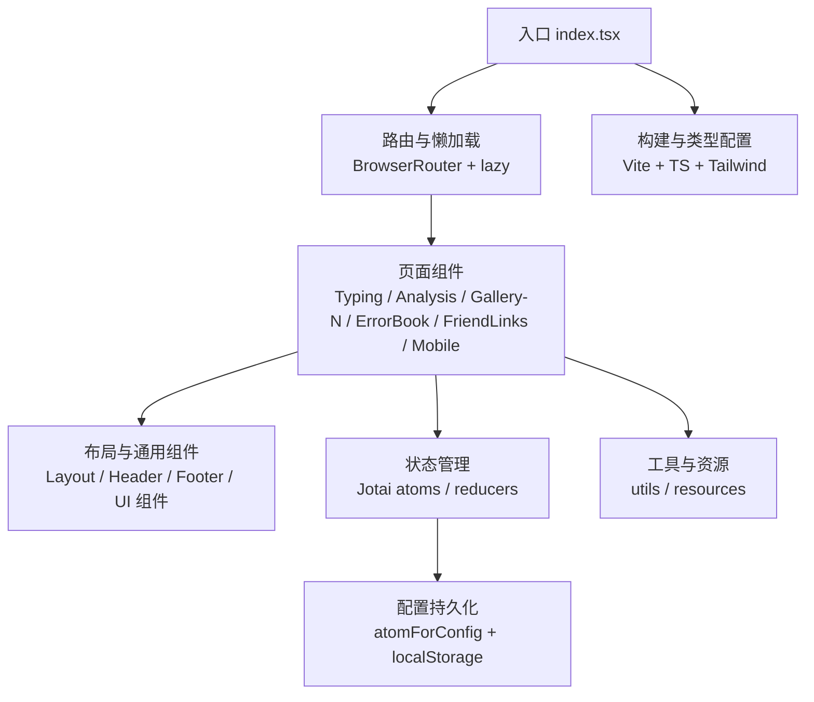
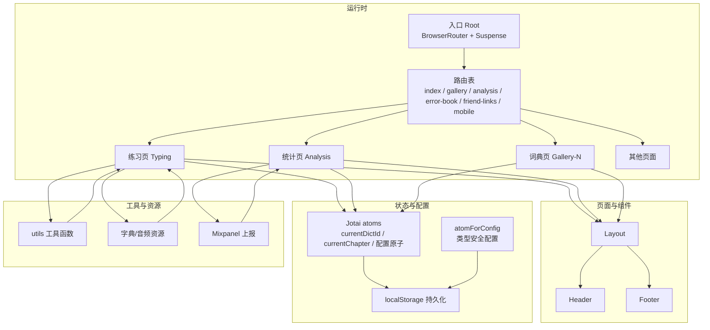
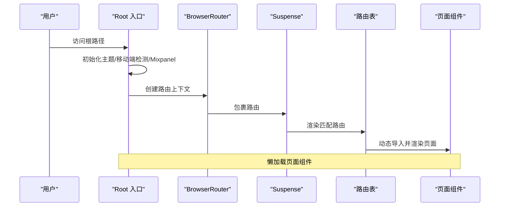
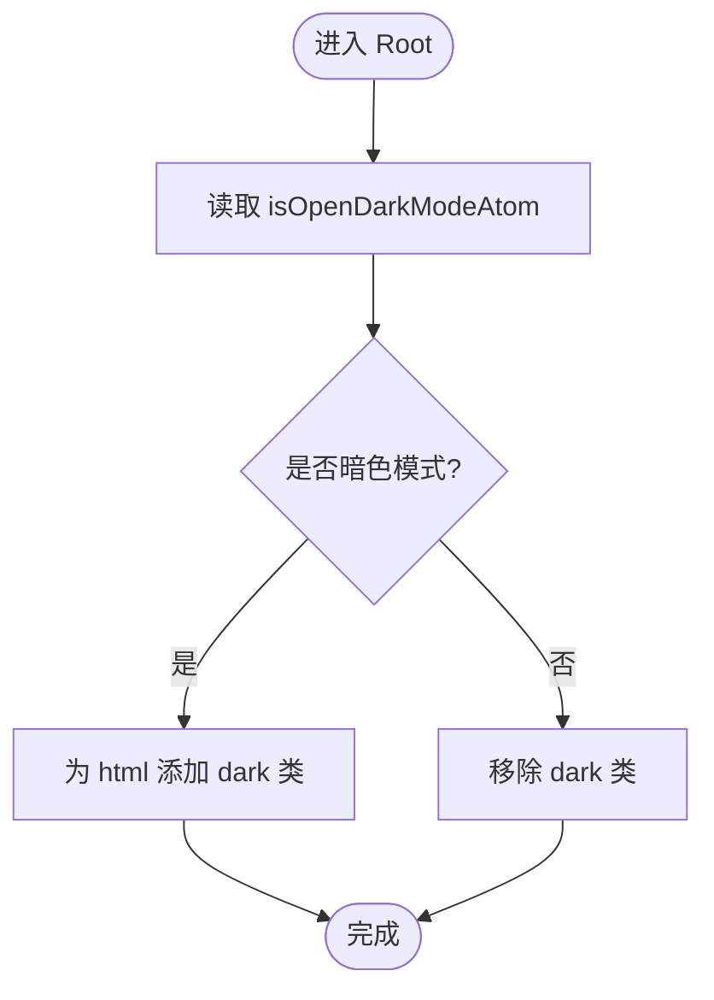
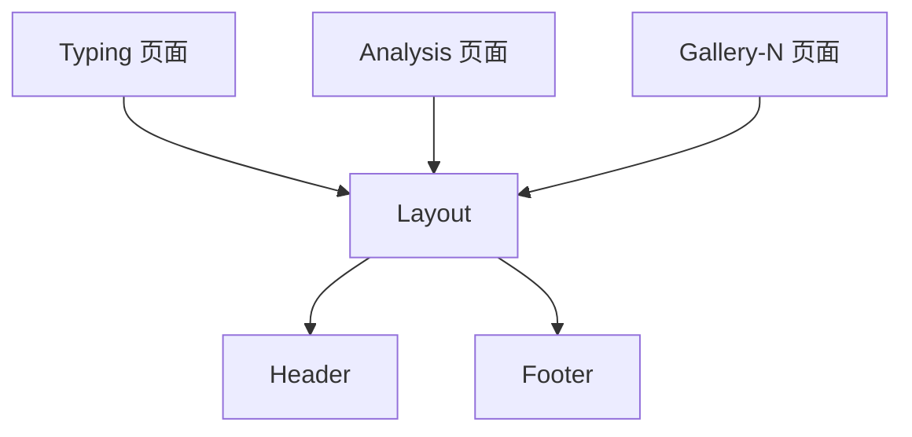
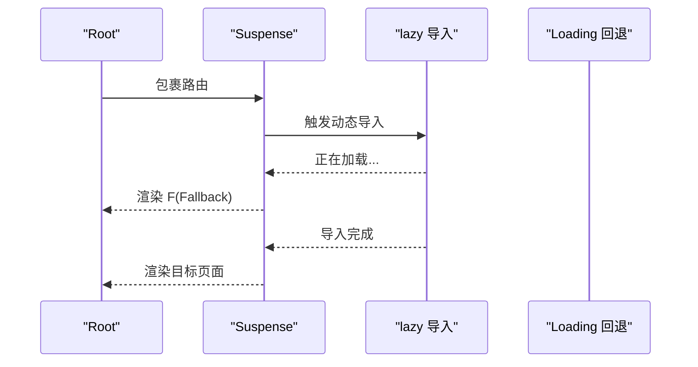
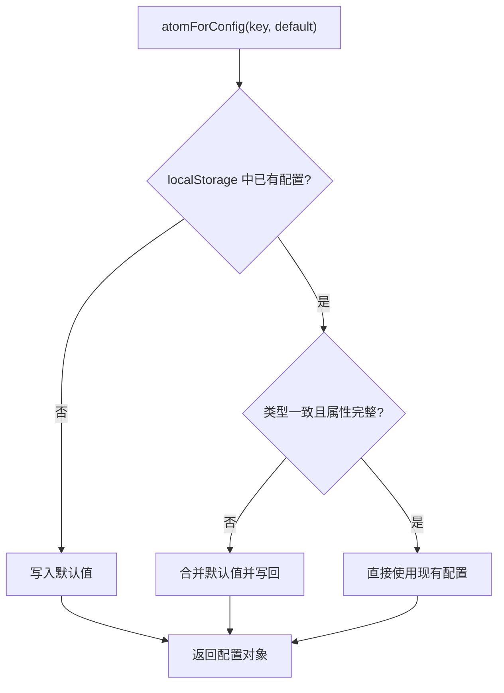
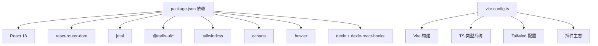

# 前端架构设计

<cite>
**本文引用的文件**
- [package.json](file://package.json)
- [vite.config.ts](file://vite.config.ts)
- [src/index.tsx](file://src/index.tsx)
- [tsconfig.json](file://tsconfig.json)
- [tailwind.config.js](file://tailwind.config.js)
- [src/pages/Typing/index.tsx](file://src/pages/Typing/index.tsx)
- [src/store/index.ts](file://src/store/index.ts)
- [src/store/atomForConfig.ts](file://src/store/atomForConfig.ts)
- [src/components/Layout.tsx](file://src/components/Layout.tsx)
- [src/components/Header/index.tsx](file://src/components/Header/index.tsx)
- [src/components/Footer/index.tsx](file://src/components/Footer/index.tsx)
- [src/pages/Analysis/index.tsx](file://src/pages/Analysis/index.tsx)
- [src/pages/Gallery-N/index.tsx](file://src/pages/Gallery-N/index.tsx)
- [src/hooks/useWindowSize.tsx](file://src/hooks/useWindowSize.tsx)
- [src/utils/index.ts](file://src/utils/index.ts)
</cite>

## 目录

1. [引言](#引言)
2. [项目结构](#项目结构)
3. [核心组件](#核心组件)
4. [架构总览](#架构总览)
5. [组件与页面详解](#组件与页面详解)
6. [依赖关系分析](#依赖关系分析)
7. [性能与优化](#性能与优化)
8. [故障排查指南](#故障排查指南)
9. [结论](#结论)
10. [附录](#附录)

## 引言

本设计文档面向 Qwerty Learner 前端团队与协作开发者，系统性阐述基于 React 18 + TypeScript 的前端架构设计，覆盖组件化架构模式、路由系统与懒加载策略、应用启动流程、主题系统与响应式设计、组件层次与页面组织、Suspense 异步加载机制、Vite 构建配置与 TypeScript 类型体系的作用，并总结性能优化与运行时优化措施。文档同时提供多幅架构与流程图，帮助读者快速理解整体设计思路。

## 项目结构

Qwerty Learner 采用以功能域为中心的目录组织方式：页面按业务域划分（Typing、Analysis、Gallery-N、ErrorBook、FriendLinks、Mobile），通用 UI 组件集中在 components/ui 与业务组件中，状态管理统一通过 Jotai 的 atoms 与 reducers 管理，工具函数与资源集中于 utils 与 resources，样式与主题通过 TailwindCSS 驱动。

**图表来源**

- [src/index.tsx](file://src/index.tsx#L1-L79)
- [src/pages/Typing/index.tsx](file://src/pages/Typing/index.tsx#L1-L174)
- [src/pages/Analysis/index.tsx](file://src/pages/Analysis/index.tsx#L1-L82)
- [src/pages/Gallery-N/index.tsx](file://src/pages/Gallery-N/index.tsx#L1-L104)
- [src/store/index.ts](file://src/store/index.ts#L1-L118)
- [src/store/atomForConfig.ts](file://src/store/atomForConfig.ts#L1-L45)
- [src/components/Layout.tsx](file://src/components/Layout.tsx#L1-L12)
- [src/components/Header/index.tsx](file://src/components/Header/index.tsx#L1-L26)
- [src/components/Footer/index.tsx](file://src/components/Footer/index.tsx#L1-L253)
- [vite.config.ts](file://vite.config.ts#L1-L55)
- [tsconfig.json](file://tsconfig.json#L1-L41)
- [tailwind.config.js](file://tailwind.config.js#L1-L78)

**章节来源**

- [package.json](file://package.json#L1-L128)
- [vite.config.ts](file://vite.config.ts#L1-L55)
- [tsconfig.json](file://tsconfig.json#L1-L41)
- [tailwind.config.js](file://tailwind.config.js#L1-L78)

## 核心组件

- 应用入口与路由：应用在入口文件中初始化路由、主题切换、移动端检测与 Suspense 异步加载，统一渲染页面组件。
- 页面组件：Typing 为核心练习页；Analysis 提供统计与可视化；Gallery-N 展示词典与分类；其他页面作为补充。
- 布局与通用组件：Layout 负责全局容器与页脚；Header 提供导航与操作区；Footer 提供信息面板与社交链接。
- 状态管理：Jotai 原子化状态，结合 atomWithStorage 实现本地持久化；atomForConfig 提供类型安全的配置读写与默认值合并。
- 工具与资源：通用工具函数（键盘过滤、日期处理、尺寸计算等）、字典与音频资源、Mixpanel 事件上报、数据库记录上传。

**章节来源**

- [src/index.tsx](file://src/index.tsx#L1-L79)
- [src/pages/Typing/index.tsx](file://src/pages/Typing/index.tsx#L1-L174)
- [src/pages/Analysis/index.tsx](file://src/pages/Analysis/index.tsx#L1-L82)
- [src/pages/Gallery-N/index.tsx](file://src/pages/Gallery-N/index.tsx#L1-L104)
- [src/store/index.ts](file://src/store/index.ts#L1-L118)
- [src/store/atomForConfig.ts](file://src/store/atomForConfig.ts#L1-L45)
- [src/components/Layout.tsx](file://src/components/Layout.tsx#L1-L12)
- [src/components/Header/index.tsx](file://src/components/Header/index.tsx#L1-L26)
- [src/components/Footer/index.tsx](file://src/components/Footer/index.tsx#L1-L253)
- [src/utils/index.ts](file://src/utils/index.ts#L1-L130)

## 架构总览

下图展示从入口到页面、组件、状态与资源的整体交互关系：

**图表来源**

- [src/index.tsx](file://src/index.tsx#L1-L79)
- [src/pages/Typing/index.tsx](file://src/pages/Typing/index.tsx#L1-L174)
- [src/pages/Analysis/index.tsx](file://src/pages/Analysis/index.tsx#L1-L82)
- [src/pages/Gallery-N/index.tsx](file://src/pages/Gallery-N/index.tsx#L1-L104)
- [src/store/index.ts](file://src/store/index.ts#L1-L118)
- [src/store/atomForConfig.ts](file://src/store/atomForConfig.ts#L1-L45)
- [src/components/Layout.tsx](file://src/components/Layout.tsx#L1-L12)
- [src/components/Header/index.tsx](file://src/components/Header/index.tsx#L1-L26)
- [src/components/Footer/index.tsx](file://src/components/Footer/index.tsx#L1-L253)
- [src/utils/index.ts](file://src/utils/index.ts#L1-L130)

## 组件与页面详解

### 应用启动流程与路由系统

- 启动流程：入口文件初始化主题类名、移动端检测、Mixpanel 初始化、BrowserRouter、Suspense 与路由表，按环境变量决定部署路径前缀。
- 路由系统：首页与各页面通过 React Router DOM 定义；Analysis 与 Gallery-N 使用 React.lazy 懒加载，提升首屏性能。
- 移动端适配：监听窗口宽度，超过阈值时重定向至首页，否则渲染 Mobile 页面。

**图表来源**

- [src/index.tsx](file://src/index.tsx#L1-L79)

**章节来源**

- [src/index.tsx](file://src/index.tsx#L1-L79)

### 主题系统与响应式设计

- 主题系统：通过 Jotai 原子控制暗色模式开关，入口在 documentElement 上切换 dark 类名，Tailwind 配置启用 class 形式的深色模式。
- 响应式设计：Tailwind 配置扩展了常用断点与尺寸，组件使用 Tailwind 工具类实现自适应布局；移动端检测逻辑在入口处生效。

**图表来源**

- [src/index.tsx](file://src/index.tsx#L1-L79)
- [tailwind.config.js](file://tailwind.config.js#L1-L78)

**章节来源**

- [src/index.tsx](file://src/index.tsx#L1-L79)
- [tailwind.config.js](file://tailwind.config.js#L1-L78)

### 组件层次与页面组织

- 布局层：Layout 作为全局容器，承载 Header 与 Footer，页面组件仅关注自身业务。
- 页面层：Typing 为核心业务页，内部组合多个功能组件（WordPanel、WordList、Speed、ResultScreen 等）；Analysis 与 Gallery-N 分别负责统计与词典浏览。
- 通用组件：Header 提供导航与操作按钮；Footer 提供信息面板与社交链接，统一风格与交互。

**图表来源**

- [src/components/Layout.tsx](file://src/components/Layout.tsx#L1-L12)
- [src/components/Header/index.tsx](file://src/components/Header/index.tsx#L1-L26)
- [src/components/Footer/index.tsx](file://src/components/Footer/index.tsx#L1-L253)
- [src/pages/Typing/index.tsx](file://src/pages/Typing/index.tsx#L1-L174)
- [src/pages/Analysis/index.tsx](file://src/pages/Analysis/index.tsx#L1-L82)
- [src/pages/Gallery-N/index.tsx](file://src/pages/Gallery-N/index.tsx#L1-L104)

**章节来源**

- [src/components/Layout.tsx](file://src/components/Layout.tsx#L1-L12)
- [src/components/Header/index.tsx](file://src/components/Header/index.tsx#L1-L26)
- [src/components/Footer/index.tsx](file://src/components/Footer/index.tsx#L1-L253)
- [src/pages/Typing/index.tsx](file://src/pages/Typing/index.tsx#L1-L174)
- [src/pages/Analysis/index.tsx](file://src/pages/Analysis/index.tsx#L1-L82)
- [src/pages/Gallery-N/index.tsx](file://src/pages/Gallery-N/index.tsx#L1-L104)

### Suspense 异步加载机制

- 懒加载策略：Analysis 与 Gallery-N 使用 React.lazy 动态导入，配合 Suspense 的 fallback 提升用户体验。
- 性能收益：首屏仅加载必要模块，减少初始包体积，提升首屏渲染速度。

**图表来源**

- [src/index.tsx](file://src/index.tsx#L1-L79)

**章节来源**

- [src/index.tsx](file://src/index.tsx#L1-L79)

### 状态管理与配置持久化

- Jotai 原子：currentDictId、currentChapter、随机/发音/字号等配置均以原子形式管理；通过 atomWithStorage 实现 localStorage 持久化。
- 类型安全配置：atomForConfig 对配置对象进行类型校验与默认值合并，避免版本升级导致的配置不兼容问题。
- 页面联动：Typing 读取字典与章节信息，Analysis 读取统计数据，两者共享同一套配置体系。

**图表来源**

- [src/store/atomForConfig.ts](file://src/store/atomForConfig.ts#L1-L45)
- [src/store/index.ts](file://src/store/index.ts#L1-L118)

**章节来源**

- [src/store/index.ts](file://src/store/index.ts#L1-L118)
- [src/store/atomForConfig.ts](file://src/store/atomForConfig.ts#L1-L45)

### 工具函数与资源

- 键盘过滤与设备检测：过滤非字母键、区分中英文标点、判断桌面端设备，保障输入行为一致性。
- 日期与时间：提供 UTC 时间戳转换、格式化字符串等工具，便于统计与日志记录。
- 尺寸与分组：章节长度计算、数组交集查找、数值精度处理等，支撑页面逻辑与性能优化。

**章节来源**

- [src/utils/index.ts](file://src/utils/index.ts#L1-L130)

## 依赖关系分析

- 外部依赖：React 18、React Router DOM、Jotai、Radix UI、TailwindCSS、ECharts、Howler、Dexie 等。
- 构建与开发：Vite 作为构建工具，TS 作为类型系统，Tailwind 作为样式框架，ESBuild 压缩与去调试语句，Rollup 可视化分析打包体积。
- 运行时：Mixpanel 用于事件追踪，Vercel Analytics 用于流量分析，图标通过 unplugin-icons 注入。

**图表来源**

- [package.json](file://package.json#L1-L128)
- [vite.config.ts](file://vite.config.ts#L1-L55)
- [tailwind.config.js](file://tailwind.config.js#L1-L78)

**章节来源**

- [package.json](file://package.json#L1-L128)
- [vite.config.ts](file://vite.config.ts#L1-L55)
- [tailwind.config.js](file://tailwind.config.js#L1-L78)

## 性能与优化

- 代码分割与懒加载：Analysis 与 Gallery-N 使用 React.lazy，配合 Suspense 回退，降低首屏包体。
- 构建优化：生产环境启用最小化、移除 console 与 debugger，关闭 Source Map，ESBuild 压缩，Rollup 可视化分析包体构成。
- 运行时优化：Jotai 原子粒度细、局部更新；useImmerReducer 减少不必要的重渲染；工具函数避免重复计算。
- 样式与图标：Tailwind 仅收集 src 内容，减少无关样式；unplugin-icons 按需注入图标，避免全量引入。
- 资源与缓存：字典与音频资源按需加载；配置持久化减少网络请求与初始化开销。

**章节来源**

- [vite.config.ts](file://vite.config.ts#L1-L55)
- [src/index.tsx](file://src/index.tsx#L1-L79)
- [src/store/index.ts](file://src/store/index.ts#L1-L118)
- [src/utils/index.ts](file://src/utils/index.ts#L1-L130)

## 故障排查指南

- 路由与懒加载问题：确认 lazy 导入路径正确、fallback 组件可用；检查 Suspense 是否包裹路由。
- 主题切换无效：检查 isOpenDarkModeAtom 是否更新、documentElement 是否存在 dark 类。
- 移动端异常：确认窗口宽度监听逻辑、重定向条件与移动端页面路径。
- 配置读取异常：检查 localStorage 中对应键是否存在、类型是否匹配；必要时回退到默认值。
- 图标与样式：确认 unplugin-icons 配置、Tailwind content 路径包含组件文件。

**章节来源**

- [src/index.tsx](file://src/index.tsx#L1-L79)
- [src/store/index.ts](file://src/store/index.ts#L1-L118)
- [tailwind.config.js](file://tailwind.config.js#L1-L78)

## 结论

Qwerty Learner 前端以 React 18 + TypeScript 为基础，结合 Jotai 实现轻量级状态管理，通过 Vite 与 Tailwind 构建出高性能、可维护的前端应用。路由系统与懒加载策略有效降低首屏负担；主题系统与响应式设计提升跨设备体验；工具函数与资源管理保障数据一致性与可扩展性。整体架构清晰、模块职责明确，适合长期演进与团队协作。

## 附录

- TypeScript 配置要点：严格模式、路径别名、CSS Modules 类名转换、JSX 运行时等。
- Tailwind 配置要点：深色模式、动画与过渡、自定义断点与尺寸、插件扩展。
- Vite 插件与构建：React 插件、图标插件、可视化分析、ESBuild 去调试语句、define 注入环境变量。

**章节来源**

- [tsconfig.json](file://tsconfig.json#L1-L41)
- [tailwind.config.js](file://tailwind.config.js#L1-L78)
- [vite.config.ts](file://vite.config.ts#L1-L55)
