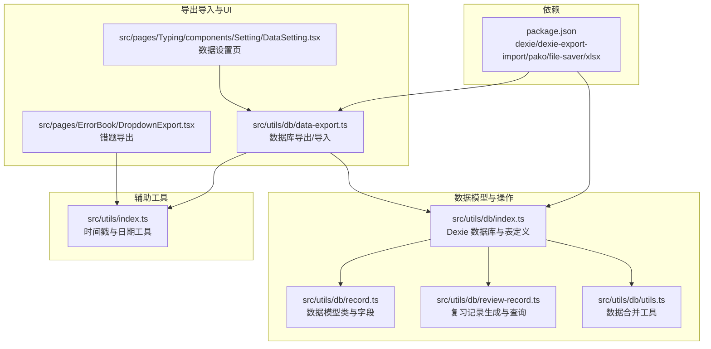
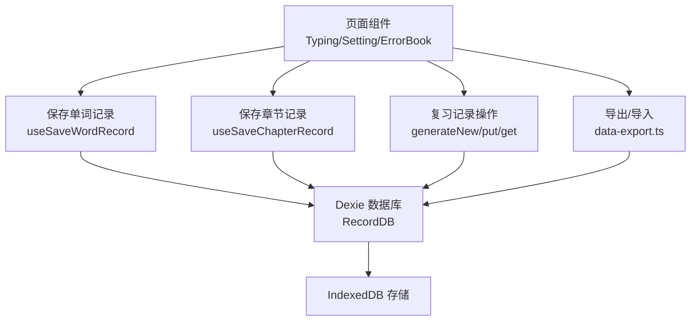
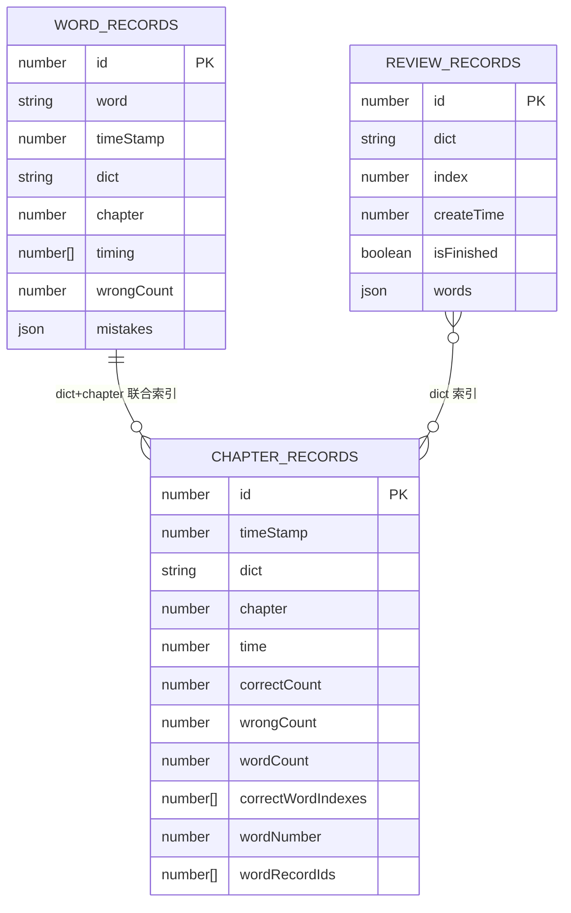
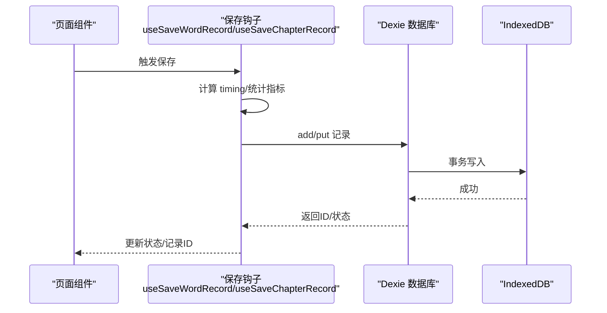
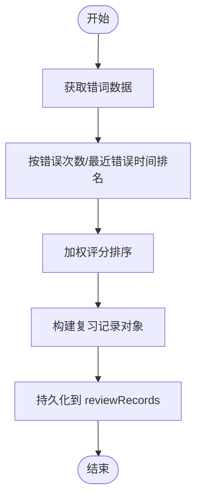
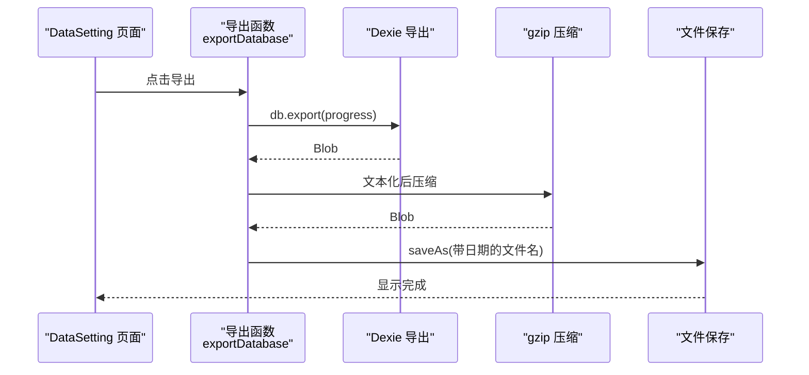
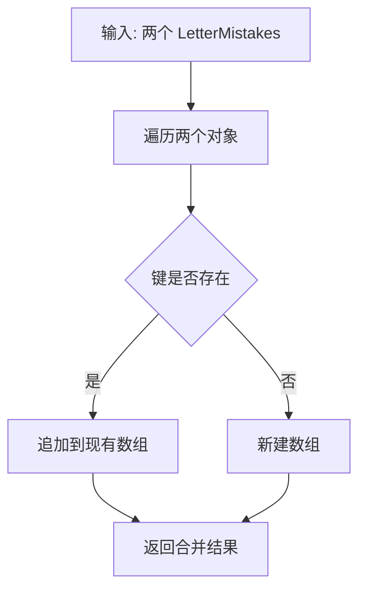
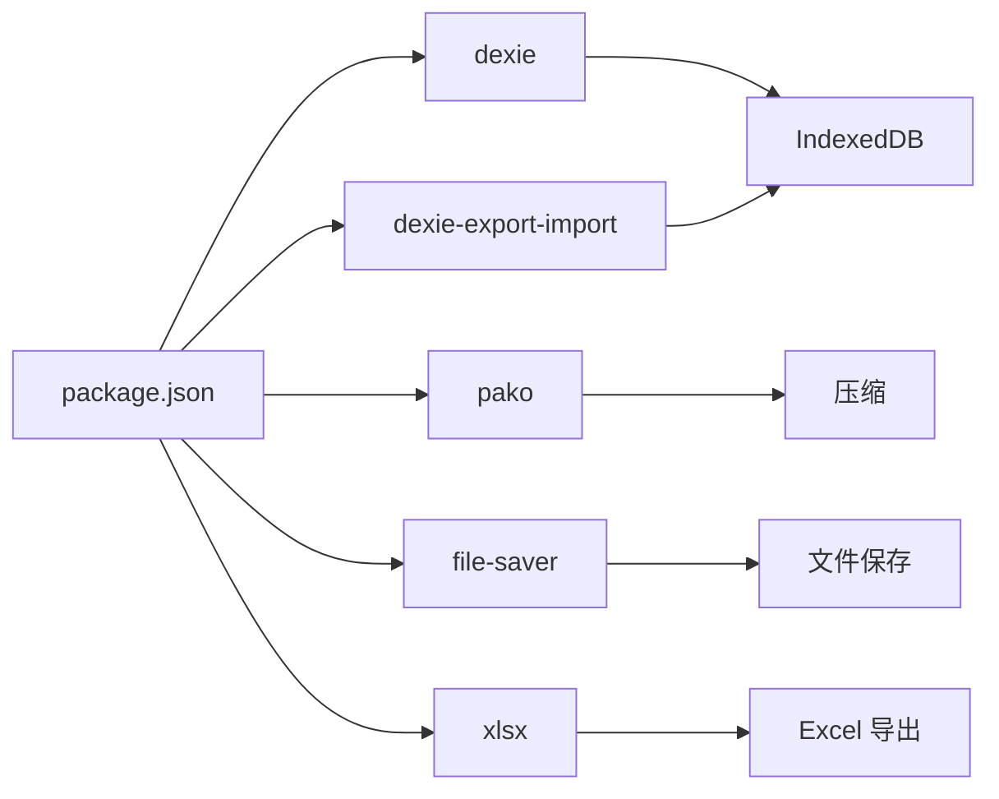

# 数据存储架构

<cite>
**本文引用的文件**
- [src/utils/db/index.ts](file://src/utils/db/index.ts)
- [src/utils/db/record.ts](file://src/utils/db/record.ts)
- [src/utils/db/review-record.ts](file://src/utils/db/review-record.ts)
- [src/utils/db/data-export.ts](file://src/utils/db/data-export.ts)
- [src/pages/Typing/components/Setting/DataSetting.tsx](file://src/pages/Typing/components/Setting/DataSetting.tsx)
- [src/pages/ErrorBook/DropdownExport.tsx](file://src/pages/ErrorBook/DropdownExport.tsx)
- [src/utils/db/utils.ts](file://src/utils/db/utils.ts)
- [src/utils/index.ts](file://src/utils/index.ts)
- [package.json](file://package.json)
</cite>

## 目录

1. [简介](#简介)
2. [项目结构](#项目结构)
3. [核心组件](#核心组件)
4. [架构总览](#架构总览)
5. [详细组件分析](#详细组件分析)
6. [依赖分析](#依赖分析)
7. [性能考量](#性能考量)
8. [故障排查指南](#故障排查指南)
9. [结论](#结论)
10. [附录](#附录)

## 简介

本设计文档围绕 Qwerty Learner 的本地数据存储架构展开，系统性阐述基于 Dexie + IndexedDB 的数据模型、索引策略、事务处理与持久化机制，覆盖练习记录、章节记录、复习记录等关键数据结构，并补充数据导出导入、备份恢复、数据迁移、安全与隐私、存储空间优化等实践建议。文档同时提供架构图与实体关系图，帮助开发者快速理解数据层的设计思路与实现细节。

## 项目结构

数据存储相关代码集中在 src/utils/db 目录，配合页面层的数据设置与导出组件，形成“模型定义—业务操作—UI 交互—导出导入”的闭环。

**图表来源**

- [src/utils/db/index.ts](file://src/utils/db/index.ts#L1-L136)
- [src/utils/db/record.ts](file://src/utils/db/record.ts#L1-L186)
- [src/utils/db/review-record.ts](file://src/utils/db/review-record.ts#L1-L69)
- [src/utils/db/data-export.ts](file://src/utils/db/data-export.ts#L1-L42)
- [src/pages/Typing/components/Setting/DataSetting.tsx](file://src/pages/Typing/components/Setting/DataSetting.tsx#L1-L110)
- [src/pages/ErrorBook/DropdownExport.tsx](file://src/pages/ErrorBook/DropdownExport.tsx#L74-L130)
- [src/utils/index.ts](file://src/utils/index.ts#L85-L92)
- [package.json](file://package.json#L1-L128)

**章节来源**

- [src/utils/db/index.ts](file://src/utils/db/index.ts#L1-L136)
- [src/utils/db/record.ts](file://src/utils/db/record.ts#L1-L186)
- [src/utils/db/review-record.ts](file://src/utils/db/review-record.ts#L1-L69)
- [src/utils/db/data-export.ts](file://src/utils/db/data-export.ts#L1-L42)
- [src/pages/Typing/components/Setting/DataSetting.tsx](file://src/pages/Typing/components/Setting/DataSetting.tsx#L1-L110)
- [src/pages/ErrorBook/DropdownExport.tsx](file://src/pages/ErrorBook/DropdownExport.tsx#L74-L130)
- [src/utils/index.ts](file://src/utils/index.ts#L85-L92)
- [package.json](file://package.json#L1-L128)

## 核心组件

- 数据库与表定义：通过 Dexie 类 RecordDB 定义 wordRecords、chapterRecords、reviewRecords 等表，并声明主键与复合索引。
- 数据模型类：WordRecord、ChapterRecord、ReviewRecord 等类封装字段与派生属性（如总时间、WPM、准确率等）。
- 复习记录模块：负责生成最新复习记录、查询与持久化复习状态。
- 导出导入模块：基于 dexie-export-import 与 pako 压缩，提供进度回调与文件落盘。
- 工具函数：字母错误合并等数据处理工具。
- UI 交互：数据设置页提供导出/导入进度展示，错题导出支持 Excel/CSV 文本格式。

**章节来源**

- [src/utils/db/index.ts](file://src/utils/db/index.ts#L1-L136)
- [src/utils/db/record.ts](file://src/utils/db/record.ts#L1-L186)
- [src/utils/db/review-record.ts](file://src/utils/db/review-record.ts#L1-L69)
- [src/utils/db/data-export.ts](file://src/utils/db/data-export.ts#L1-L42)
- [src/utils/db/utils.ts](file://src/utils/db/utils.ts#L1-L18)
- [src/pages/Typing/components/Setting/DataSetting.tsx](file://src/pages/Typing/components/Setting/DataSetting.tsx#L1-L110)
- [src/pages/ErrorBook/DropdownExport.tsx](file://src/pages/ErrorBook/DropdownExport.tsx#L74-L130)

## 架构总览

下图展示了数据层的整体交互：页面触发保存/查询，通过 Dexie 操作 IndexedDB；导出导入通过专用模块完成压缩与进度反馈。

**图表来源**

- [src/utils/db/index.ts](file://src/utils/db/index.ts#L43-L136)
- [src/utils/db/review-record.ts](file://src/utils/db/review-record.ts#L1-L69)
- [src/utils/db/data-export.ts](file://src/utils/db/data-export.ts#L1-L42)

## 详细组件分析

### 数据模型与索引策略

- 表与索引
  - wordRecords：自增主键 id；普通索引 word、timeStamp、dict、chapter；复合索引 [dict+chapter]；字段包含 timing、wrongCount、mistakes 等。
  - chapterRecords：自增主键 id；普通索引 dict、chapter、time；复合索引 [dict+chapter]；字段包含 time、correctCount、wrongCount、wordCount、correctWordIndexes、wordRecordIds 等。
  - reviewRecords：自增主键 id；普通索引 dict、createTime、isFinished；用于按字典检索与状态过滤。
- 字段设计要点
  - 时间戳统一使用 UTC 秒级时间戳，便于跨时区比较与排序。
  - timing 采用相邻字母输入时间差数组，可计算总耗时与平均速度。
  - mistakes 为字母索引到错误键值的映射，便于统计与分析。
  - chapter 字段允许 null，用于错题等特殊场景。
- 复合索引策略
  - [dict+chapter] 用于快速定位某字典某章节的所有记录，支撑章节统计与复习生成。
  - dict+time 等索引用于复习记录与章节记录的高效查询。

**图表来源**

- [src/utils/db/index.ts](file://src/utils/db/index.ts#L21-L34)
- [src/utils/db/record.ts](file://src/utils/db/record.ts#L1-L186)

**章节来源**

- [src/utils/db/index.ts](file://src/utils/db/index.ts#L21-L34)
- [src/utils/db/record.ts](file://src/utils/db/record.ts#L1-L186)

### 练习记录与章节记录

- 单词记录保存流程
  - 计算相邻字母输入时间差，构造 WordRecord。
  - 异步写入 wordRecords，成功后通过上下文分发更新打字状态中的记录 ID。
- 章节记录保存流程
  - 从打字状态提取正确/错误计数、单词数、正确单词索引、wordRecordIds 等。
  - 构造 ChapterRecord 并写入 chapterRecords。
- 查询与统计
  - 通过 dict+chapter 复合索引快速筛选某章节记录。
  - 通过派生属性计算 WPM、按键准确率、单词准确率等指标。

**图表来源**

- [src/utils/db/index.ts](file://src/utils/db/index.ts#L43-L136)
- [src/utils/db/record.ts](file://src/utils/db/record.ts#L24-L116)

**章节来源**

- [src/utils/db/index.ts](file://src/utils/db/index.ts#L43-L136)
- [src/utils/db/record.ts](file://src/utils/db/record.ts#L24-L116)

### 复习记录维护

- 生成逻辑
  - 基于错词数据计算错误次数与最近错误时间的排名，加权排序生成复习单词序列。
  - 新建 ReviewRecord 并持久化，标记未完成状态以便后续迭代。
- 查询逻辑
  - 按字典检索所有复习记录，取创建时间最新的且未完成的记录作为当前复习任务。
- 迭代与完成
  - 通过 put 接口更新当前索引与完成状态，支持继续/暂停/重启复习流程。

**图表来源**

- [src/utils/db/review-record.ts](file://src/utils/db/review-record.ts#L21-L64)

**章节来源**

- [src/utils/db/review-record.ts](file://src/utils/db/review-record.ts#L1-L69)

### 数据导出导入与备份恢复

- 导出
  - 使用 dexie-export-import 导出数据库为 Blob，文本化后 gzip 压缩，文件名包含日期，调用 file-saver 下载。
  - 导出过程提供进度回调，包含 totalRows/completedRows/done。
- 导入
  - 通过文件选择器读取 .gz 文件，解压后导入数据库；导入同样提供进度回调。
  - UI 层 DataSetting 提供导出/导入按钮与进度条，覆盖导出会提示风险。
- 错题导出
  - 支持 .xlsx/.csv 文本导出，便于离线分析与分享。

**图表来源**

- [src/utils/db/data-export.ts](file://src/utils/db/data-export.ts#L16-L32)
- [src/pages/Typing/components/Setting/DataSetting.tsx](file://src/pages/Typing/components/Setting/DataSetting.tsx#L1-L110)

**章节来源**

- [src/utils/db/data-export.ts](file://src/utils/db/data-export.ts#L1-L42)
- [src/pages/Typing/components/Setting/DataSetting.tsx](file://src/pages/Typing/components/Setting/DataSetting.tsx#L1-L110)
- [src/pages/ErrorBook/DropdownExport.tsx](file://src/pages/ErrorBook/DropdownExport.tsx#L74-L130)

### 数据合并与工具函数

- 合并字母错误：将两个 LetterMistakes 结果按索引合并，避免重复与丢失。
- 时间戳与日期：提供 UTC 秒级时间戳与本地化字符串转换，统一时间维度。

**图表来源**

- [src/utils/db/utils.ts](file://src/utils/db/utils.ts#L1-L18)
- [src/utils/index.ts](file://src/utils/index.ts#L107-L129)

**章节来源**

- [src/utils/db/utils.ts](file://src/utils/db/utils.ts#L1-L18)
- [src/utils/index.ts](file://src/utils/index.ts#L85-L92)

## 依赖分析

- 外部依赖
  - dexie：IndexedDB 封装与 ORM 能力。
  - dexie-export-import：数据库导出导入。
  - pako：gzip 压缩。
  - file-saver：浏览器端文件保存。
  - xlsx：Excel 导出。
- 版本与兼容性
  - 依赖版本在 package.json 中明确声明，确保导出导入与压缩流程稳定可用。

**图表来源**

- [package.json](file://package.json#L1-L128)

**章节来源**

- [package.json](file://package.json#L1-L128)

## 性能考量

- 索引命中
  - 复合索引 [dict+chapter] 能显著降低章节统计与复习生成的查询成本。
  - 为高频查询字段建立单列索引（如 dict、time、timeStamp）。
- 写入批量化
  - 批量写入时尽量减少事务拆分，合并多次 add/put 为一次性提交。
- 数据体积控制
  - timing 与 mistakes 为数组/JSON，建议在导入/导出时进行必要裁剪与压缩。
  - 定期清理历史冗余记录（如已完成的复习记录）。
- 导出导入
  - 导出前先统计记录数量，避免一次性加载过多数据导致卡顿。
  - 导入时提供进度回调，让用户感知进度并可中断。

[本节为通用指导，无需列出具体文件来源]

## 故障排查指南

- 导出失败
  - 检查浏览器是否支持 file-saver 与 Blob；确认 dexie-export-import 可用。
  - 若进度回调未触发，检查导出函数的回调参数传递。
- 导入失败
  - 确认选择的文件为 .gz 格式；导入前注意覆盖风险提示。
  - 若导入后数据异常，尝试重新导出并校验文件完整性。
- 记录保存异常
  - 查看保存钩子中的错误日志；确认上下文分发逻辑是否生效。
- 复习记录为空
  - 确认错词数据是否为空；检查 reviewRecords 是否存在未完成记录。

**章节来源**

- [src/pages/Typing/components/Setting/DataSetting.tsx](file://src/pages/Typing/components/Setting/DataSetting.tsx#L1-L110)
- [src/utils/db/data-export.ts](file://src/utils/db/data-export.ts#L1-L42)
- [src/utils/db/index.ts](file://src/utils/db/index.ts#L80-L136)

## 结论

本数据存储架构以 Dexie + IndexedDB 为核心，围绕练习记录、章节记录与复习记录构建清晰的数据模型与索引策略。通过导出导入模块实现数据备份与跨设备迁移，结合 UI 层进度反馈与安全提示，形成完整的本地数据生命周期管理。建议在实际部署中持续关注索引优化、数据体积控制与用户隐私保护，以提升整体体验与可靠性。

[本节为总结性内容，无需列出具体文件来源]

## 附录

- 数据安全与隐私
  - 本地存储，无上传至服务端；导出文件请妥善保管，避免泄露。
  - 导入前务必确认来源可信，防止恶意数据覆盖。
- 存储空间优化
  - 定期清理历史记录；导出时可选择仅保留必要字段。
- 数据迁移
  - 通过导出导入实现版本升级或设备切换；保持 dexie 版本与导出导入库一致。

[本节为通用指导，无需列出具体文件来源]
