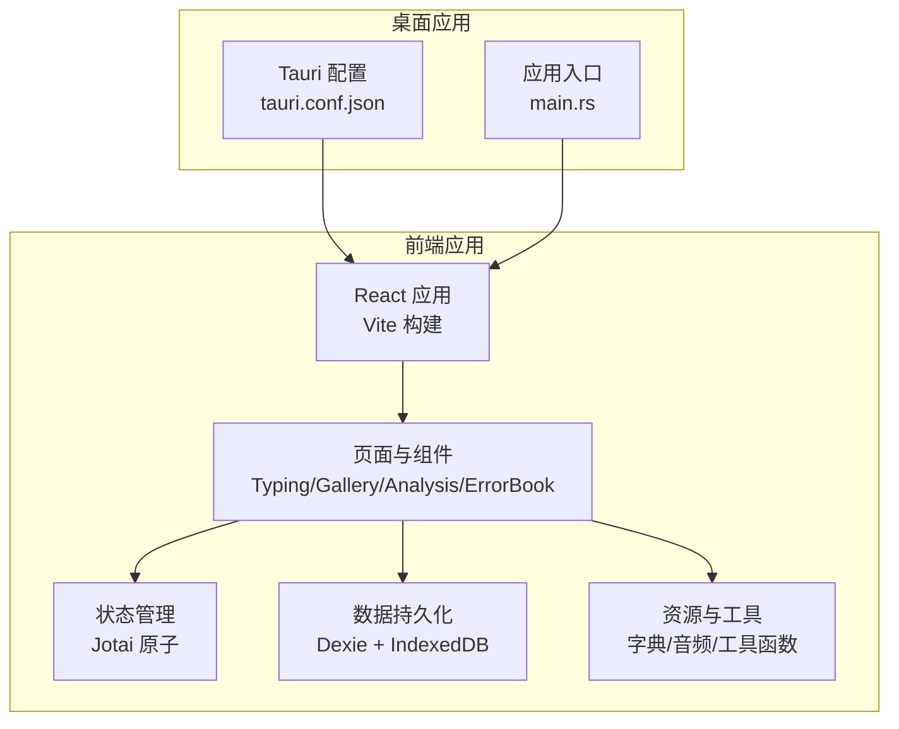
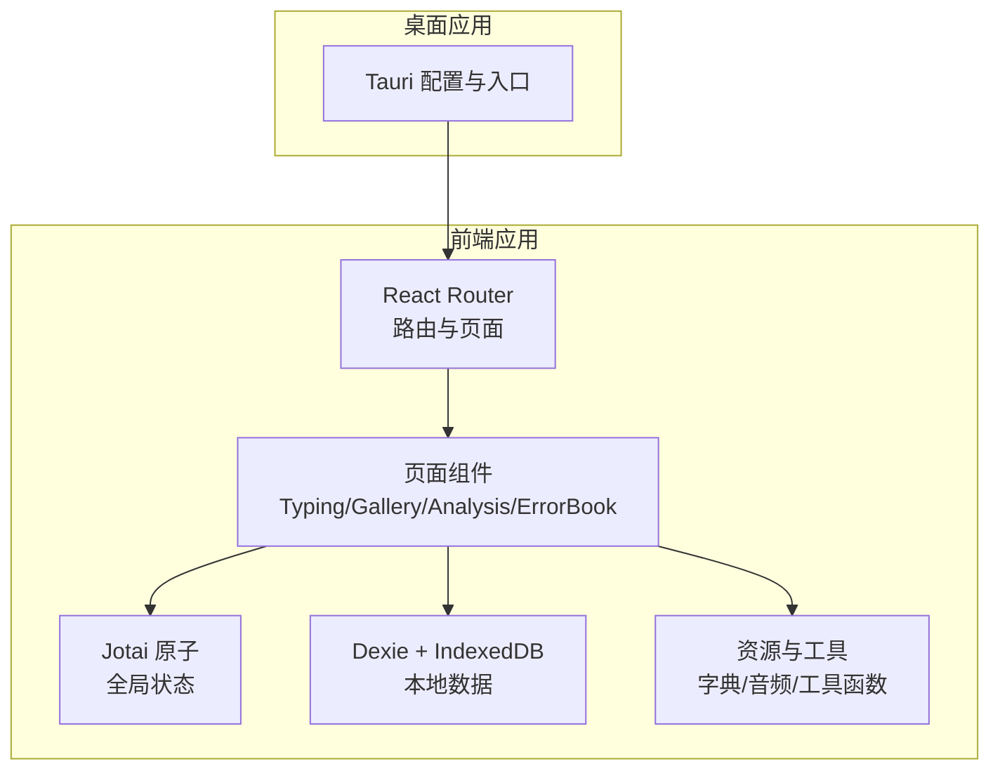
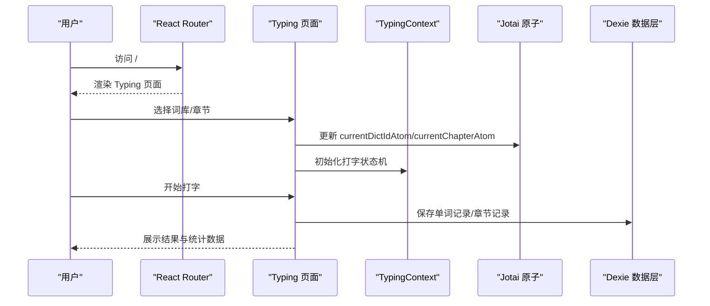
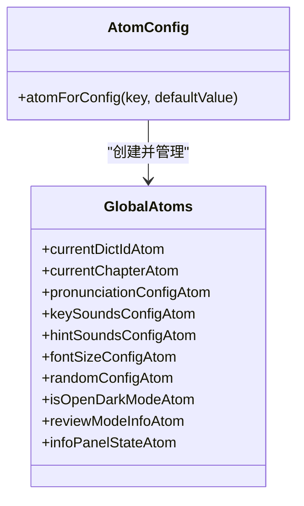
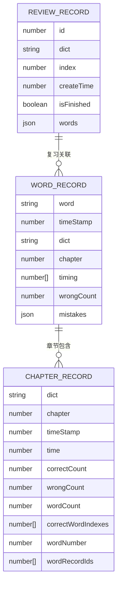
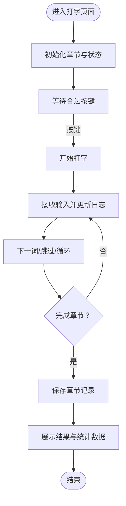
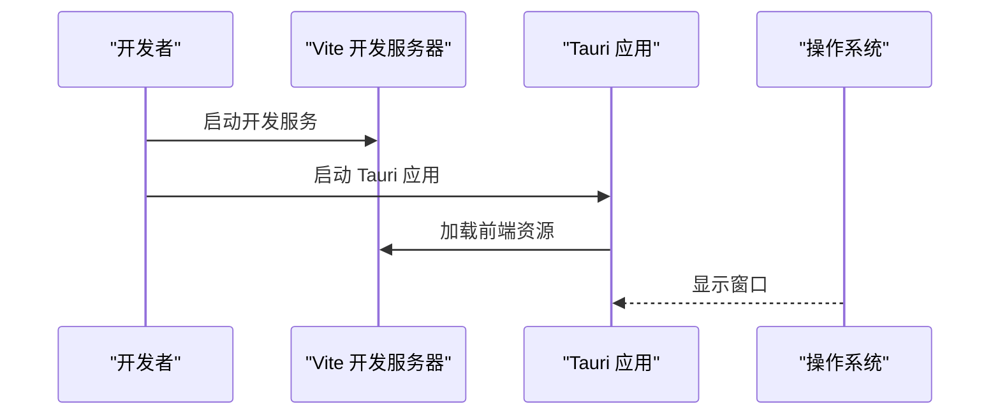
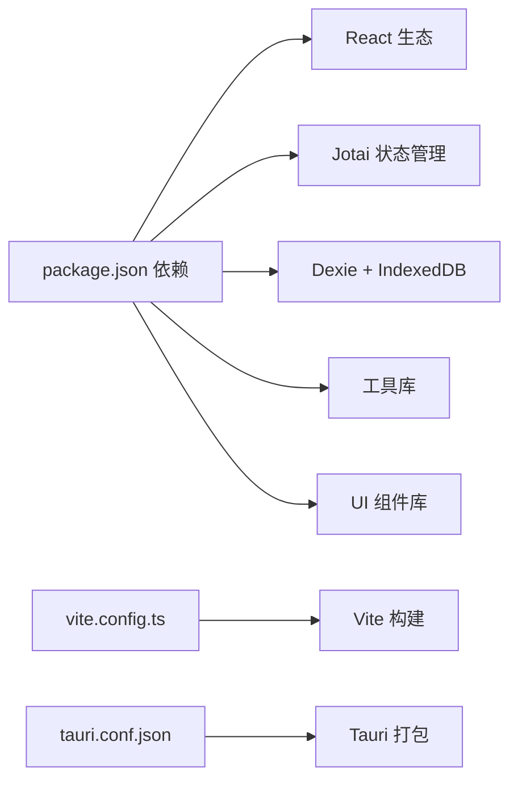

# 架构设计

<cite>
**本文引用的文件**
- [package.json](file://package.json)
- [vite.config.ts](file://vite.config.ts)
- [src/index.tsx](file://src/index.tsx)
- [src/pages/Typing/index.tsx](file://src/pages/Typing/index.tsx)
- [src/pages/Typing/store/index.ts](file://src/pages/Typing/store/index.ts)
- [src/store/index.ts](file://src/store/index.ts)
- [src/store/atomForConfig.ts](file://src/store/atomForConfig.ts)
- [src/utils/db/index.ts](file://src/utils/db/index.ts)
- [src/utils/db/record.ts](file://src/utils/db/record.ts)
- [src/utils/db/data-export.ts](file://src/utils/db/data-export.ts)
- [src/resources/dictionary.ts](file://src/resources/dictionary.ts)
- [src/constants/index.ts](file://src/constants/index.ts)
- [src-tauri/tauri.conf.json](file://src-tauri/tauri.conf.json)
- [src-tauri/src/main.rs](file://src-tauri/src/main.rs)
</cite>

## 目录

1. [简介](#简介)
2. [项目结构](#项目结构)
3. [核心组件](#核心组件)
4. [架构总览](#架构总览)
5. [组件详细分析](#组件详细分析)
6. [依赖关系分析](#依赖关系分析)
7. [性能考量](#性能考量)
8. [故障排查指南](#故障排查指南)
9. [结论](#结论)

## 简介

本项目为“Qwerty Learner”，旨在通过键盘打字练习提升英语输入效率与记忆效果。系统采用前端 React 应用 + Tauri 桌面应用打包的双层架构，结合本地 IndexedDB（Dexie）进行数据持久化，并以 Jotai 实现轻量原子化状态管理。系统支持多种词库、章节练习、错题回顾、数据分析与导出导入等功能，强调跨平台部署与离线可用性。

## 项目结构

- 前端应用（React + Vite）
  - 页面与组件：Typing 打字页、Gallery 图书馆、Analysis 分析页、ErrorBook 错题本等
  - 状态管理：Jotai 原子 + 本地存储（localStorage）
  - 数据持久化：Dexie + IndexedDB
  - 工具与资源：字典资源、音频资源、工具函数
- 桌面应用（Tauri）
  - 配置与入口：tauri.conf.json、main.rs
  - 构建流程：Vite 构建产物作为前端静态资源，Tauri 打包为桌面应用

**图表来源**

- [src/index.tsx](file://src/index.tsx#L1-L79)
- [src/pages/Typing/index.tsx](file://src/pages/Typing/index.tsx#L1-L174)
- [src/utils/db/index.ts](file://src/utils/db/index.ts#L1-L136)
- [src-tauri/tauri.conf.json](file://src-tauri/tauri.conf.json#L1-L60)
- [src-tauri/src/main.rs](file://src-tauri/src/main.rs#L1-L9)

**章节来源**

- [package.json](file://package.json#L1-L128)
- [vite.config.ts](file://vite.config.ts#L1-L55)
- [src/index.tsx](file://src/index.tsx#L1-L79)

## 核心组件

- 前端路由与入口
  - 使用 React Router DOM 进行页面路由，支持移动端与桌面端分流
  - 根组件负责主题切换、懒加载页面、埋点初始化
- 打字练习核心
  - Typing 页面承载打字体验，包含词牌按钮、发音开关、速度统计、结果展示等
  - 内部使用 useImmerReducer 维护打字状态机，配合 TypingContext 提供上下文
- 状态管理（Jotai）
  - 以原子为中心的状态模型，支持本地存储同步、配置合并与类型安全
  - 提供字典选择、章节、发音、字号、随机模式、深色模式等全局配置
- 数据持久化（Dexie + IndexedDB）
  - 定义 WordRecord、ChapterRecord、ReviewRecord 等实体模型
  - 提供章节记录与单词记录的增删改查、导出导入能力
- 桌面应用（Tauri）
  - 配置构建路径、窗口尺寸、打包标识、安全策略等
  - 通过 Vite 构建产物作为前端资源运行于 Tauri WebView

**章节来源**

- [src/index.tsx](file://src/index.tsx#L1-L79)
- [src/pages/Typing/index.tsx](file://src/pages/Typing/index.tsx#L1-L174)
- [src/pages/Typing/store/index.ts](file://src/pages/Typing/store/index.ts#L1-L227)
- [src/store/index.ts](file://src/store/index.ts#L1-L118)
- [src/utils/db/index.ts](file://src/utils/db/index.ts#L1-L136)
- [src/utils/db/record.ts](file://src/utils/db/record.ts#L1-L186)
- [src-tauri/tauri.conf.json](file://src-tauri/tauri.conf.json#L1-L60)

## 架构总览

系统采用“前端应用 + 桌面应用”双层架构：

- 前端应用负责业务逻辑与界面渲染，使用 React + Vite 构建
- Tauri 将前端静态资源封装为桌面应用，提供原生窗口与打包能力
- 数据持久化在浏览器端使用 IndexedDB（Dexie），确保离线可用与快速访问
- 状态管理采用 Jotai，兼顾响应式与可序列化特性

**图表来源**

- [src/index.tsx](file://src/index.tsx#L1-L79)
- [src/pages/Typing/index.tsx](file://src/pages/Typing/index.tsx#L1-L174)
- [src/store/index.ts](file://src/store/index.ts#L1-L118)
- [src/utils/db/index.ts](file://src/utils/db/index.ts#L1-L136)
- [src-tauri/tauri.conf.json](file://src-tauri/tauri.conf.json#L1-L60)

## 组件详细分析

### 路由与页面组织

- 路由设计
  - 桌面端主路由：首页（打字）、画廊、分析、错题本、友链
  - 移动端路由：统一跳转至移动页
  - 路由懒加载：Analysis、Gallery 采用动态导入，减少首屏体积
- 页面职责
  - Typing：打字练习主页面，包含词牌选择、发音控制、速度统计、结果展示
  - Gallery：词库浏览与分类导航
  - Analysis：练习数据分析（热力图、折线图等）
  - ErrorBook：错题本与分页展示
  - FriendLinks：友链展示

**图表来源**

- [src/index.tsx](file://src/index.tsx#L50-L74)
- [src/pages/Typing/index.tsx](file://src/pages/Typing/index.tsx#L26-L174)
- [src/pages/Typing/store/index.ts](file://src/pages/Typing/store/index.ts#L1-L227)
- [src/utils/db/index.ts](file://src/utils/db/index.ts#L43-L136)

**章节来源**

- [src/index.tsx](file://src/index.tsx#L1-L79)
- [src/pages/Typing/index.tsx](file://src/pages/Typing/index.tsx#L1-L174)

### 状态管理（Jotai 原子）

- 设计要点
  - 使用 atomWithStorage 将配置持久化到 localStorage，自动恢复
  - atomForConfig 提供类型安全与默认值补全，避免配置不一致
  - 通过派生原子组合复杂状态（如 currentDictInfoAtom）
- 关键原子
  - 字典与章节：currentDictIdAtom、currentDictInfoAtom、currentChapterAtom
  - 打字配置：pronunciationConfigAtom、keySoundsConfigAtom、hintSoundsConfigAtom、fontSizeConfigAtom、randomConfigAtom
  - 视图与行为：isShowPrevAndNextWordAtom、isIgnoreCaseAtom、isShowAnswerOnHoverAtom、isTextSelectableAtom、isOpenDarkModeAtom
  - 复习模式：reviewModeInfoAtom、isReviewModeAtom
  - 其他：infoPanelStateAtom、wordDictationConfigAtom、dismissStartCardDateAtom、hasSeenEnhancedPromotionAtom

**图表来源**

- [src/store/atomForConfig.ts](file://src/store/atomForConfig.ts#L1-L45)
- [src/store/index.ts](file://src/store/index.ts#L1-L118)

**章节来源**

- [src/store/atomForConfig.ts](file://src/store/atomForConfig.ts#L1-L45)
- [src/store/index.ts](file://src/store/index.ts#L1-L118)

### 数据模型与持久化（Dexie + IndexedDB）

- 数据模型
  - WordRecord：单词记录，包含单词、时间戳、所属词库、章节、按键耗时、错误次数、逐字母错误映射
  - ChapterRecord：章节记录，包含词库、章节、时间、正确/错误按键数、单词数、正确单词索引、单词记录 ID 列表
  - ReviewRecord：复习记录，包含词库、索引、创建时间、是否完成、单词列表
  - RevisionDictRecord / RevisionWordRecord：复习相关字典与单词记录
- 数据库版本演进
  - 版本 1：wordRecords、chapterRecords
  - 版本 2：字段调整（错误计数字段名变更）
  - 版本 3：新增 reviewRecords
- 数据操作
  - 保存章节记录：useSaveChapterRecord
  - 保存单词记录：useSaveWordRecord（异步写入并回填 ID）
  - 删除单词记录：useDeleteWordRecord
  - 导出/导入：exportDatabase/importDatabase（基于 dexie-export-import 与 pako 压缩）

**图表来源**

- [src/utils/db/record.ts](file://src/utils/db/record.ts#L4-L186)
- [src/utils/db/index.ts](file://src/utils/db/index.ts#L11-L37)

**章节来源**

- [src/utils/db/record.ts](file://src/utils/db/record.ts#L1-L186)
- [src/utils/db/index.ts](file://src/utils/db/index.ts#L1-L136)
- [src/utils/db/data-export.ts](file://src/utils/db/data-export.ts#L1-L68)

### 打字状态机与交互

- 状态机
  - 初始状态：包含章节数据、计时器数据、打字状态、完成状态、显示控制等
  - 动作类型：设置章节、切换打字态、报告正确/错误、下一词、跳过、完成章节、计时、保存记录等
  - 计算指标：准确率、WPM、总时间等
- 事件处理
  - 键盘事件：合法按键触发打字开始
  - 窗口失焦：暂停打字
  - 完成章节：上传埋点、保存章节记录
- 上下文
  - TypingContext 提供 state 与 dispatch，供子组件使用

**图表来源**

- [src/pages/Typing/store/index.ts](file://src/pages/Typing/store/index.ts#L9-L227)
- [src/pages/Typing/index.tsx](file://src/pages/Typing/index.tsx#L26-L174)

**章节来源**

- [src/pages/Typing/store/index.ts](file://src/pages/Typing/store/index.ts#L1-L227)
- [src/pages/Typing/index.tsx](file://src/pages/Typing/index.tsx#L1-L174)

### 桌面应用（Tauri）集成

- 配置要点
  - 构建：devPath 指向 Vite 开发服务器，distDir 指向 Vite 构建输出
  - 打包：产品名称、版本、图标、目标平台等
  - 安全：权限白名单、CSP、窗口属性
- 入口
  - main.rs 仅负责启动 Tauri 应用

**图表来源**

- [src-tauri/tauri.conf.json](file://src-tauri/tauri.conf.json#L2-L7)
- [src-tauri/src/main.rs](file://src-tauri/src/main.rs#L4-L8)

**章节来源**

- [src-tauri/tauri.conf.json](file://src-tauri/tauri.conf.json#L1-L60)
- [src-tauri/src/main.rs](file://src-tauri/src/main.rs#L1-L9)

## 依赖关系分析

- 前端依赖
  - React 生态：react、react-router-dom、react-dom
  - 状态管理：jotai、dexie、dexie-react-hooks
  - 可视化与图表：echarts、react-activity-calendar
  - 工具库：immer、use-immer、pako、file-saver、howler、use-sound
  - UI 组件：@radix-ui/\*、@headlessui/react、lucide-react
- 构建与开发
  - Vite、@vitejs/plugin-react、rollup 插件可视化
  - TailwindCSS、PostCSS、Prettier、ESLint
- 桌面应用
  - Tauri：tauri.conf.json 配置，main.rs 入口

**图表来源**

- [package.json](file://package.json#L6-L58)
- [vite.config.ts](file://vite.config.ts#L1-L55)
- [src-tauri/tauri.conf.json](file://src-tauri/tauri.conf.json#L1-L60)

**章节来源**

- [package.json](file://package.json#L1-L128)
- [vite.config.ts](file://vite.config.ts#L1-L55)
- [src-tauri/tauri.conf.json](file://src-tauri/tauri.conf.json#L1-L60)

## 性能考量

- 路由与懒加载
  - Analysis、Gallery 页面采用动态导入，降低首屏加载压力
- 状态管理
  - Jotai 原子粒度细、更新局部化，避免不必要的重渲染
  - atomWithStorage 自动持久化，减少初始化开销
- 数据持久化
  - IndexedDB 适合频繁小数据写入；Dexie 提供简洁 API 与版本迁移
  - 导出/导入使用 pako 压缩，减少传输与存储体积
- 构建优化
  - Vite 生产构建开启压缩与移除调试语句
  - Rollup 可视化插件辅助分析包体构成

[本节为通用性能建议，不直接分析具体文件]

## 故障排查指南

- 路由与页面
  - 移动端自动跳转：若页面未按预期显示，请检查窗口宽度监听与路由跳转逻辑
  - 懒加载失败：确认动态导入路径与构建产物目录一致
- 打字状态
  - 无法开始打字：检查键盘事件绑定与合法按键判断
  - 计时异常：确认计时器生命周期与打字状态联动
- 数据持久化
  - 记录保存失败：查看 useSaveWordRecord 的异常捕获与回调
  - 导入/导出失败：确认文件格式、压缩解压流程与进度回调
- 桌面应用
  - 开发环境无法加载：检查 tauri.conf.json 中 devPath 与 distDir 配置
  - 打包后窗口异常：核对窗口尺寸、标题与安全策略

**章节来源**

- [src/index.tsx](file://src/index.tsx#L35-L48)
- [src/pages/Typing/index.tsx](file://src/pages/Typing/index.tsx#L80-L125)
- [src/utils/db/index.ts](file://src/utils/db/index.ts#L80-L136)
- [src/utils/db/data-export.ts](file://src/utils/db/data-export.ts#L16-L67)
- [src-tauri/tauri.conf.json](file://src-tauri/tauri.conf.json#L2-L7)

## 结论

Qwerty Learner 采用“前端应用 + 桌面应用”的清晰分层架构，结合 Jotai 原子状态管理与 Dexie + IndexedDB 数据持久化，实现了高效、可维护、可扩展的学习系统。通过合理的路由设计、状态机与数据模型，系统在桌面端提供了流畅的打字练习体验，并支持丰富的数据分析与数据迁移能力。未来可在以下方面持续优化：

- 引入更细粒度的模块拆分与组件抽象
- 增强错误边界与日志上报
- 优化大词库场景下的加载与渲染性能
- 扩展多语言与国际化支持
