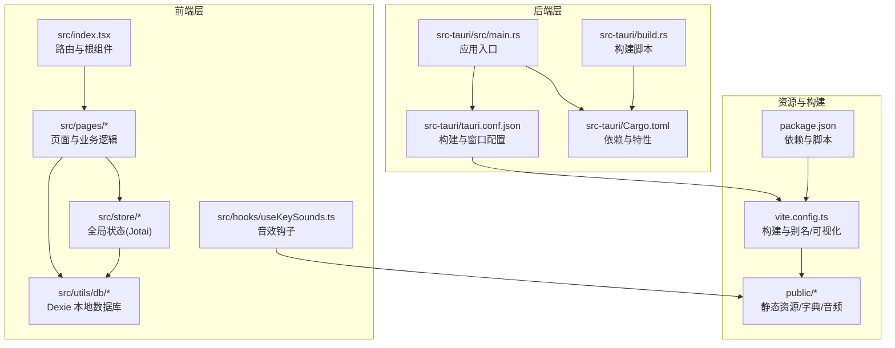
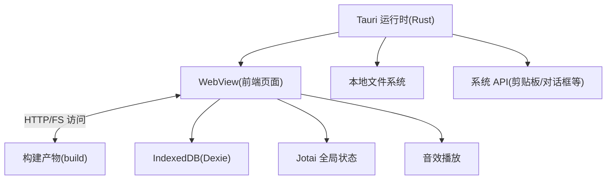
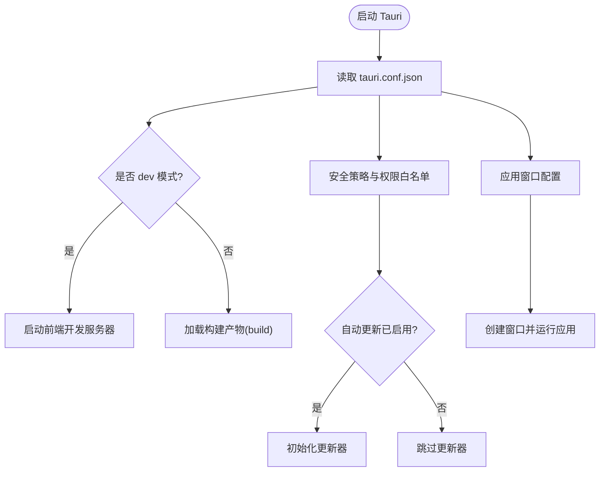
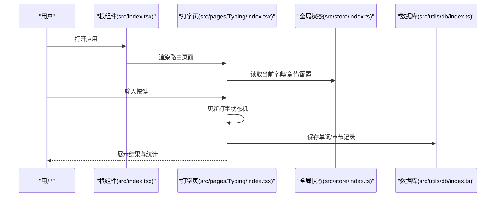
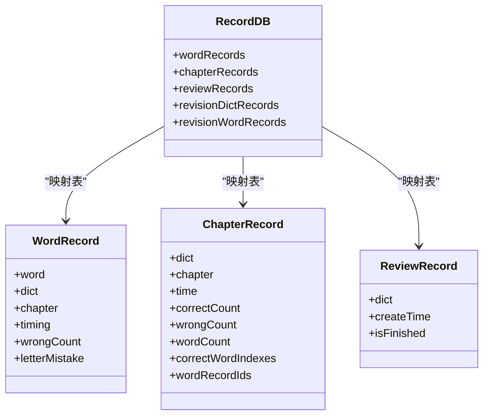
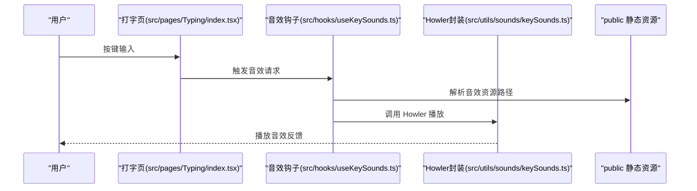
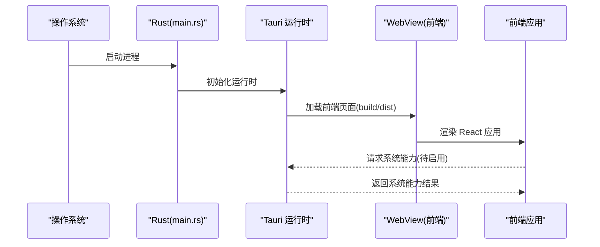
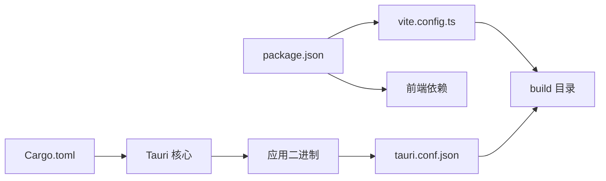

# 桌面应用架构

<cite>
**本文引用的文件**
- [src-tauri/tauri.conf.json](file://src-tauri/tauri.conf.json)
- [src-tauri/Cargo.toml](file://src-tauri/Cargo.toml)
- [src-tauri/src/main.rs](file://src-tauri/src/main.rs)
- [src-tauri/build.rs](file://src-tauri/build.rs)
- [package.json](file://package.json)
- [vite.config.ts](file://vite.config.ts)
- [src/index.tsx](file://src/index.tsx)
- [src/pages/Typing/index.tsx](file://src/pages/Typing/index.tsx)
- [src/utils/db/index.ts](file://src/utils/db/index.ts)
- [src/store/index.ts](file://src/store/index.ts)
- [src/hooks/useKeySounds.ts](file://src/hooks/useKeySounds.ts)
- [src/utils/sounds/keySounds.ts](file://src/utils/sounds/keySounds.ts)
- [src/utils/index.ts](file://src/utils/index.ts)
- [public/default.conf](file://public/default.conf)
</cite>

## 目录

1. [引言](#引言)
2. [项目结构](#项目结构)
3. [核心组件](#核心组件)
4. [架构总览](#架构总览)
5. [详细组件分析](#详细组件分析)
6. [依赖关系分析](#依赖关系分析)
7. [性能考虑](#性能考虑)
8. [故障排查指南](#故障排查指南)
9. [结论](#结论)
10. [附录](#附录)

## 引言

本设计文档面向 Qwerty Learner 桌面应用，围绕基于 Tauri 的双层架构（Rust 后端 + 前端渲染）进行系统化说明。文档重点覆盖以下方面：

- Tauri 配置文件的作用与窗口管理机制
- 系统集成功能与安全模型
- 桌面应用生命周期管理与原生能力调用
- 文件系统访问与数据持久化策略
- 跨平台兼容性与打包发布流程
- 自动更新机制现状与建议
- 进程间通信与数据流图示
- 安全模型、沙箱隔离与权限控制策略

## 项目结构

Qwerty Learner 采用“前端 Vite + React + TypeScript”与“Rust + Tauri”双层架构：

- 前端层：React 应用通过 Vite 构建，产物输出到 build 目录，由 Tauri 在运行时加载
- 后端层：Rust 程序作为应用入口，负责窗口、系统集成与打包配置
- 数据层：本地 IndexedDB（Dexie）用于记录打字练习数据；全局状态使用 Jotai 管理
- 资源层：字典与音频资源位于 public 目录，供前端按需加载

**图表来源**

- [src/index.tsx](file://src/index.tsx#L1-L79)
- [src/pages/Typing/index.tsx](file://src/pages/Typing/index.tsx#L1-L174)
- [src/store/index.ts](file://src/store/index.ts#L1-L118)
- [src/utils/db/index.ts](file://src/utils/db/index.ts#L1-L136)
- [src/hooks/useKeySounds.ts](file://src/hooks/useKeySounds.ts#L1-L51)
- [src-tauri/src/main.rs](file://src-tauri/src/main.rs#L1-L9)
- [src-tauri/tauri.conf.json](file://src-tauri/tauri.conf.json#L1-L60)
- [src-tauri/Cargo.toml](file://src-tauri/Cargo.toml#L1-L27)
- [src-tauri/build.rs](file://src-tauri/build.rs#L1-L3)
- [vite.config.ts](file://vite.config.ts#L1-L55)
- [package.json](file://package.json#L1-L128)
- [public/default.conf](file://public/default.conf#L1-L14)

**章节来源**

- [src-tauri/tauri.conf.json](file://src-tauri/tauri.conf.json#L1-L60)
- [src-tauri/Cargo.toml](file://src-tauri/Cargo.toml#L1-L27)
- [src-tauri/src/main.rs](file://src-tauri/src/main.rs#L1-L9)
- [src-tauri/build.rs](file://src-tauri/build.rs#L1-L3)
- [package.json](file://package.json#L1-L128)
- [vite.config.ts](file://vite.config.ts#L1-L55)
- [src/index.tsx](file://src/index.tsx#L1-L79)
- [src/pages/Typing/index.tsx](file://src/pages/Typing/index.tsx#L1-L174)
- [src/utils/db/index.ts](file://src/utils/db/index.ts#L1-L136)
- [src/store/index.ts](file://src/store/index.ts#L1-L118)
- [src/hooks/useKeySounds.ts](file://src/hooks/useKeySounds.ts#L1-L51)
- [src/utils/sounds/keySounds.ts](file://src/utils/sounds/keySounds.ts#L1-L14)
- [src/utils/index.ts](file://src/utils/index.ts#L1-L130)
- [public/default.conf](file://public/default.conf#L1-L14)

## 核心组件

- 应用入口与生命周期
  - Rust 入口在 [src-tauri/src/main.rs](file://src-tauri/src/main.rs#L1-L9)，通过 Tauri 默认构建器启动应用上下文并运行
  - Windows 发行版下隐藏额外控制台窗口，避免调试期弹窗
- 前端根组件与路由
  - 根组件 [src/index.tsx](file://src/index.tsx#L1-L79) 使用 React Router 管理页面路由，支持移动端自适应与懒加载
- 打字页面与状态机
  - 打字页 [src/pages/Typing/index.tsx](file://src/pages/Typing/index.tsx#L1-L174) 维护打字状态机，处理键盘事件、计时与结果展示
- 全局状态与配置
  - 全局状态 [src/store/index.ts](file://src/store/index.ts#L1-L118) 使用 Jotai 管理字典、章节、音效、发音等配置，并持久化到本地存储
- 数据持久化
  - 本地数据库 [src/utils/db/index.ts](file://src/utils/db/index.ts#L1-L136) 基于 Dexie，记录单词与章节练习数据
- 音效与声音播放
  - 音效钩子 [src/hooks/useKeySounds.ts](file://src/hooks/useKeySounds.ts#L1-L51) 与底层 Howler 封装 [src/utils/sounds/keySounds.ts](file://src/utils/sounds/keySounds.ts#L1-L14)
- 构建与打包
  - 前端构建 [vite.config.ts](file://vite.config.ts#L1-L55) 输出 build 目录，Tauri 配置 [src-tauri/tauri.conf.json](file://src-tauri/tauri.conf.json#L1-L60) 指定 devPath 与 distDir
  - Rust 依赖与特性 [src-tauri/Cargo.toml](file://src-tauri/Cargo.toml#L1-L27)、构建脚本 [src-tauri/build.rs](file://src-tauri/build.rs#L1-L3)

**章节来源**

- [src-tauri/src/main.rs](file://src-tauri/src/main.rs#L1-L9)
- [src/index.tsx](file://src/index.tsx#L1-L79)
- [src/pages/Typing/index.tsx](file://src/pages/Typing/index.tsx#L1-L174)
- [src/store/index.ts](file://src/store/index.ts#L1-L118)
- [src/utils/db/index.ts](file://src/utils/db/index.ts#L1-L136)
- [src/hooks/useKeySounds.ts](file://src/hooks/useKeySounds.ts#L1-L51)
- [src/utils/sounds/keySounds.ts](file://src/utils/sounds/keySounds.ts#L1-L14)
- [vite.config.ts](file://vite.config.ts#L1-L55)
- [src-tauri/tauri.conf.json](file://src-tauri/tauri.conf.json#L1-L60)
- [src-tauri/Cargo.toml](file://src-tauri/Cargo.toml#L1-L27)
- [src-tauri/build.rs](file://src-tauri/build.rs#L1-L3)

## 架构总览

Qwerty Learner 的桌面应用采用“前端渲染 + Rust 后端”的双层架构：

- 前端层：React/Vite 提供页面与交互，构建产物由 Tauri 加载
- 后端层：Tauri 负责窗口、系统集成、打包与安全策略
- 数据层：Dexie 本地数据库与 Jotai 全局状态
- 资源层：public 目录存放字典与音频资源

**图表来源**

- [src-tauri/tauri.conf.json](file://src-tauri/tauri.conf.json#L1-L60)
- [vite.config.ts](file://vite.config.ts#L1-L55)
- [src/utils/db/index.ts](file://src/utils/db/index.ts#L1-L136)
- [src/store/index.ts](file://src/store/index.ts#L1-L118)
- [src/hooks/useKeySounds.ts](file://src/hooks/useKeySounds.ts#L1-L51)

## 详细组件分析

### Tauri 配置与窗口管理

- 构建配置
  - devPath 指向本地开发服务器，distDir 指向构建目录，beforeBuildCommand/beforeDevCommand 控制前后端联调流程
- 窗口配置
  - 单窗口设置：标题、尺寸、是否可调整大小、全屏开关
- 安全与权限
  - 当前 allowlist 关闭所有 API，需按需开启白名单以启用系统功能
- 打包与标识
  - 产品名称、版本、图标、包标识符、目标平台等
- 更新机制
  - updater 默认关闭，可按需启用

**图表来源**

- [src-tauri/tauri.conf.json](file://src-tauri/tauri.conf.json#L1-L60)

**章节来源**

- [src-tauri/tauri.conf.json](file://src-tauri/tauri.conf.json#L1-L60)

### 前端渲染与状态管理

- 根组件与路由
  - 根组件 [src/index.tsx](file://src/index.tsx#L1-L79) 使用 React Router 管理页面路由，支持移动端自适应与懒加载
- 打字页面状态机
  - 打字页 [src/pages/Typing/index.tsx](file://src/pages/Typing/index.tsx#L1-L174) 维护打字状态机，处理键盘事件、计时与结果展示
- 全局状态
  - Jotai 状态 [src/store/index.ts](file://src/store/index.ts#L1-L118) 管理字典、章节、音效、发音等配置

**图表来源**

- [src/index.tsx](file://src/index.tsx#L1-L79)
- [src/pages/Typing/index.tsx](file://src/pages/Typing/index.tsx#L1-L174)
- [src/store/index.ts](file://src/store/index.ts#L1-L118)
- [src/utils/db/index.ts](file://src/utils/db/index.ts#L1-L136)

**章节来源**

- [src/index.tsx](file://src/index.tsx#L1-L79)
- [src/pages/Typing/index.tsx](file://src/pages/Typing/index.tsx#L1-L174)
- [src/store/index.ts](file://src/store/index.ts#L1-L118)
- [src/utils/db/index.ts](file://src/utils/db/index.ts#L1-L136)

### 数据持久化与本地存储

- Dexie 数据库
  - 记录单词与章节练习数据，支持版本迁移与类映射
- Jotai 全局状态
  - 配置项持久化到本地存储，支持主题、音效、发音等偏好设置

**图表来源**

- [src/utils/db/index.ts](file://src/utils/db/index.ts#L1-L136)

**章节来源**

- [src/utils/db/index.ts](file://src/utils/db/index.ts#L1-L136)
- [src/store/index.ts](file://src/store/index.ts#L1-L118)

### 音效播放与系统集成功能

- 音效钩子
  - 钩子 [src/hooks/useKeySounds.ts](file://src/hooks/useKeySounds.ts#L1-L51) 基于 use-sound 与本地资源路径
- Howler 封装
  - 底层封装 [src/utils/sounds/keySounds.ts](file://src/utils/sounds/keySounds.ts#L1-L14) 使用 Howler 播放
- 键盘事件与合法性判断
  - 工具函数 [src/utils/index.ts](file://src/utils/index.ts#L1-L130) 提供键位合法性与平台相关常量

**图表来源**

- [src/pages/Typing/index.tsx](file://src/pages/Typing/index.tsx#L1-L174)
- [src/hooks/useKeySounds.ts](file://src/hooks/useKeySounds.ts#L1-L51)
- [src/utils/sounds/keySounds.ts](file://src/utils/sounds/keySounds.ts#L1-L14)
- [public/default.conf](file://public/default.conf#L1-L14)

**章节来源**

- [src/hooks/useKeySounds.ts](file://src/hooks/useKeySounds.ts#L1-L51)
- [src/utils/sounds/keySounds.ts](file://src/utils/sounds/keySounds.ts#L1-L14)
- [src/utils/index.ts](file://src/utils/index.ts#L1-L130)
- [public/default.conf](file://public/default.conf#L1-L14)

### 进程间通信与生命周期

- 生命周期
  - Rust 入口启动应用上下文，随后由 Tauri 管理窗口生命周期
- 前端与后端通信
  - 当前配置未启用任何 API 白名单，若需系统级能力（如文件对话框、剪贴板），需在 tauri.conf.json 中按需开启相应 API

**图表来源**

- [src-tauri/src/main.rs](file://src-tauri/src/main.rs#L1-L9)
- [src-tauri/tauri.conf.json](file://src-tauri/tauri.conf.json#L1-L60)
- [vite.config.ts](file://vite.config.ts#L1-L55)

**章节来源**

- [src-tauri/src/main.rs](file://src-tauri/src/main.rs#L1-L9)
- [src-tauri/tauri.conf.json](file://src-tauri/tauri.conf.json#L1-L60)

## 依赖关系分析

- 前端依赖
  - React 生态、路由、状态管理、可视化与音效库等
- Rust 依赖
  - Tauri 核心、序列化、构建工具等
- 构建链路
  - package.json 脚本驱动 Vite 构建，Vite 输出 build 目录，Tauri 在运行时加载

**图表来源**

- [package.json](file://package.json#L1-L128)
- [vite.config.ts](file://vite.config.ts#L1-L55)
- [src-tauri/Cargo.toml](file://src-tauri/Cargo.toml#L1-L27)
- [src-tauri/tauri.conf.json](file://src-tauri/tauri.conf.json#L1-L60)

**章节来源**

- [package.json](file://package.json#L1-L128)
- [vite.config.ts](file://vite.config.ts#L1-L55)
- [src-tauri/Cargo.toml](file://src-tauri/Cargo.toml#L1-L27)
- [src-tauri/tauri.conf.json](file://src-tauri/tauri.conf.json#L1-L60)

## 性能考虑

- 构建优化
  - Vite 在生产模式下启用最小化与移除调试语句，减少体积
  - Rollup 可视化插件便于分析包体构成
- 前端性能
  - 页面懒加载与路由按需加载，降低首屏压力
- 数据层
  - Dexie 使用 IndexedDB，注意批量写入与索引设计，避免主线程阻塞
- 音效
  - 音效播放应避免频繁创建实例，复用 Howler 实例或使用钩子统一管理

[本节为通用指导，不直接分析具体文件]

## 故障排查指南

- 开发与构建问题
  - 确认 Vite 开发服务器地址与 Tauri devPath 一致
  - 检查构建目录 distDir 是否正确指向 build
- 权限与 API
  - 若前端需要系统能力，需在 tauri.conf.json 中启用对应 API 白名单
- 音效播放
  - 确认音效资源路径与 public 目录结构一致
  - 检查音效钩子与 Howler 封装的调用链路
- 数据持久化
  - Dexie 版本迁移失败时，检查 stores 定义与字段一致性

**章节来源**

- [src-tauri/tauri.conf.json](file://src-tauri/tauri.conf.json#L1-L60)
- [vite.config.ts](file://vite.config.ts#L1-L55)
- [src/hooks/useKeySounds.ts](file://src/hooks/useKeySounds.ts#L1-L51)
- [src/utils/sounds/keySounds.ts](file://src/utils/sounds/keySounds.ts#L1-L14)
- [src/utils/db/index.ts](file://src/utils/db/index.ts#L1-L136)

## 结论

Qwerty Learner 的桌面应用采用成熟的 Tauri + React 技术栈，实现了跨平台桌面体验。当前配置聚焦安全与可控，默认关闭所有 API 白名单，前端通过 Dexie 与 Jotai 实现数据与状态管理。后续可在确保安全的前提下，按需启用系统 API 并完善自动更新与打包发布流程。

[本节为总结性内容，不直接分析具体文件]

## 附录

### Tauri 配置要点说明

- build
  - beforeBuildCommand/beforeDevCommand：前后端联调命令
  - devPath：开发时前端服务器地址
  - distDir：构建产物目录
- tauri.windows
  - 窗口尺寸、标题、是否可调整大小等
- tauri.allowlist
  - 当前关闭 all，需按需开启
- tauri.updater
  - 当前关闭，可按需启用
- bundle
  - 图标、包标识符、目标平台等

**章节来源**

- [src-tauri/tauri.conf.json](file://src-tauri/tauri.conf.json#L1-L60)

### 打包与发布流程建议

- 构建前端：执行构建脚本生成 build 目录
- Rust 打包：使用 Tauri CLI 或 Cargo 目标进行多平台打包
- 资源与签名：根据目标平台配置签名与证书（如适用）
- 自动更新：启用 tauri.updater 并配置更新通道与签名策略

[本节为通用指导，不直接分析具体文件]
