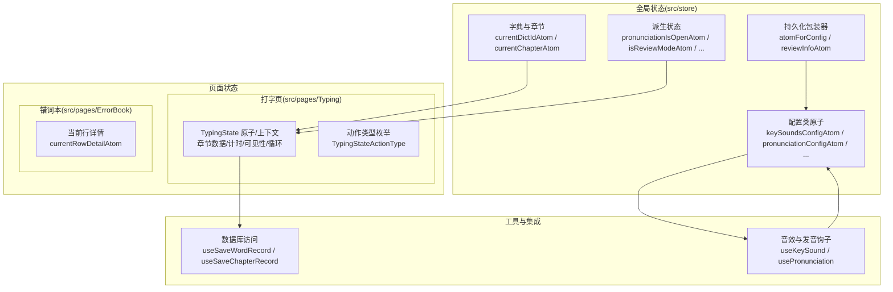
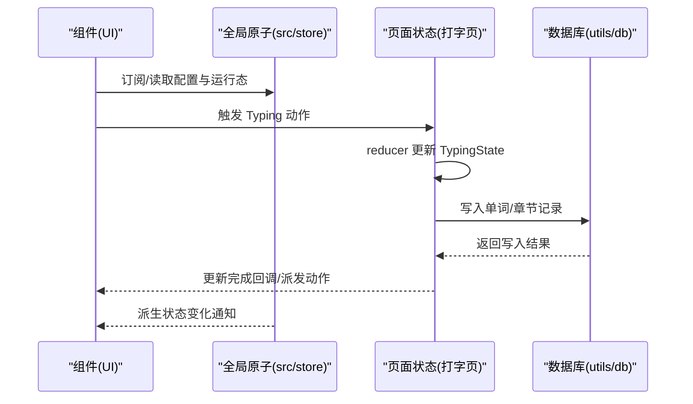
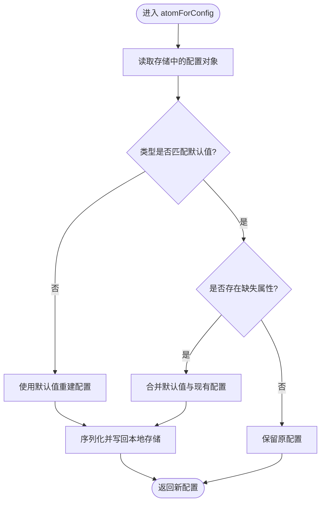
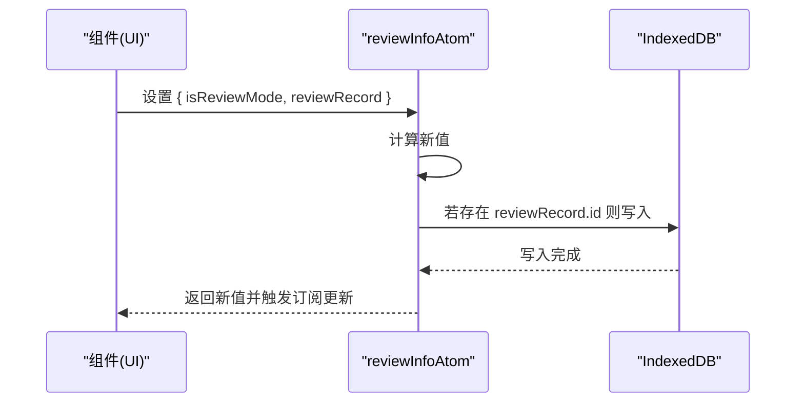
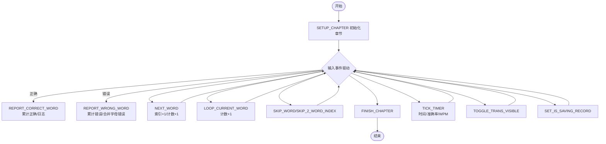
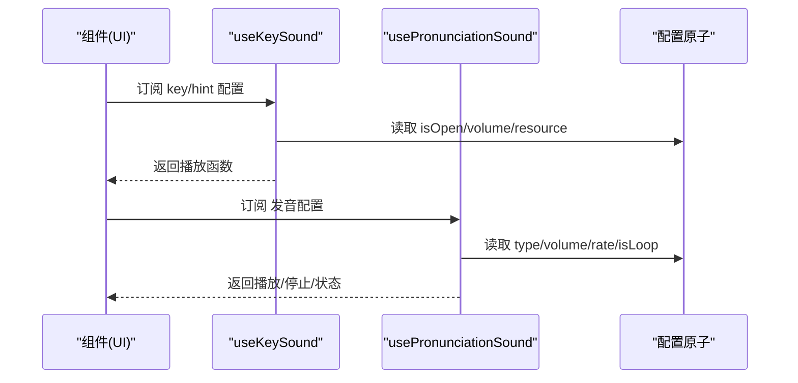
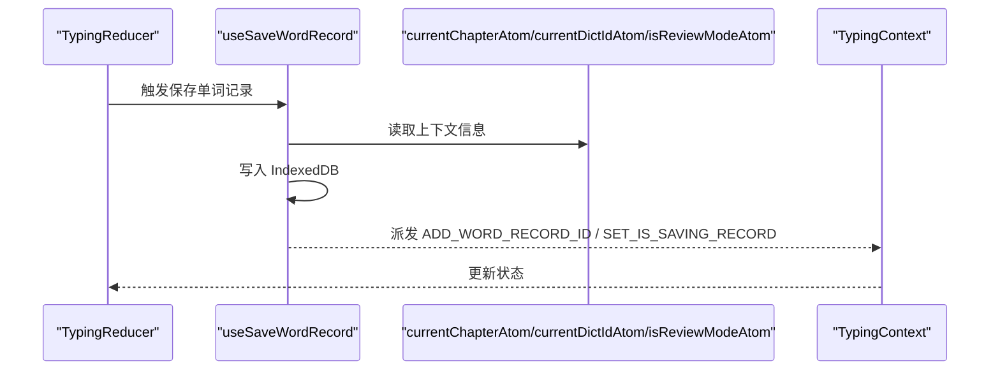
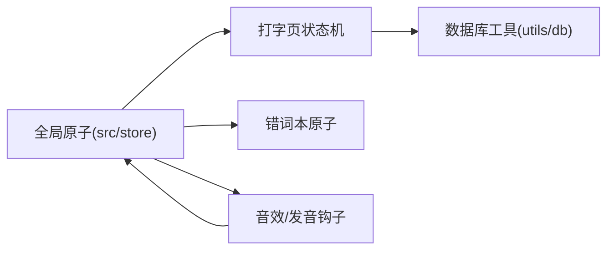

# 状态管理架构

<cite>
**本文引用的文件**
- [src/store/index.ts](file://src/store/index.ts)
- [src/store/atomForConfig.ts](file://src/store/atomForConfig.ts)
- [src/store/reviewInfoAtom.ts](file://src/store/reviewInfoAtom.ts)
- [src/pages/Typing/store/index.ts](file://src/pages/Typing/store/index.ts)
- [src/pages/Typing/store/type.ts](file://src/pages/Typing/store/type.ts)
- [src/pages/ErrorBook/store/index.ts](file://src/pages/ErrorBook/store/index.ts)
- [src/hooks/useKeySounds.ts](file://src/hooks/useKeySounds.ts)
- [src/hooks/usePronunciation.ts](file://src/hooks/usePronunciation.ts)
- [src/utils/db/index.ts](file://src/utils/db/index.ts)
- [vite.config.ts](file://vite.config.ts)
</cite>

## 目录

1. [引言](#引言)
2. [项目结构](#项目结构)
3. [核心组件](#核心组件)
4. [架构总览](#架构总览)
5. [详细组件分析](#详细组件分析)
6. [依赖分析](#依赖分析)
7. [性能考虑](#性能考虑)
8. [故障排查指南](#故障排查指南)
9. [结论](#结论)
10. [附录](#附录)

## 引言

本设计文档围绕 Qwerty Learner 的状态管理架构展开，系统性阐述基于 Jotai 的原子状态管理设计与实现。文档覆盖原子状态定义、派生状态计算、状态订阅机制；解释全局状态管理、页面状态隔离、组件状态共享策略；说明状态持久化方案、状态重置机制与状态同步策略；并总结最佳实践、性能优化技巧与调试工具使用方法。同时，提供状态流转图、组件状态依赖关系与异步状态处理流程，帮助开发者深入理解细粒度状态管理的理念与实现方式。

## 项目结构

Qwerty Learner 的状态管理采用“分层原子 + 页面局部状态”的混合架构：

- 全局配置与运行态原子集中于 src/store，负责跨页面共享的状态（如字典选择、章节、主题、音效、发音、复习模式等）。
- 页面级状态通过 Jotai 原子或 React Context/Reducer 组合实现，典型如打字页 Typing 的细粒度状态机。
- 工具层与数据库交互通过 Jotai 原子读取上下文信息，保证状态一致性与持久化。

**图表来源**

- [src/store/index.ts](file://src/store/index.ts#L1-L118)
- [src/store/atomForConfig.ts](file://src/store/atomForConfig.ts#L1-L45)
- [src/store/reviewInfoAtom.ts](file://src/store/reviewInfoAtom.ts#L1-L29)
- [src/pages/Typing/store/index.ts](file://src/pages/Typing/store/index.ts#L1-L227)
- [src/pages/Typing/store/type.ts](file://src/pages/Typing/store/type.ts#L1-L55)
- [src/pages/ErrorBook/store/index.ts](file://src/pages/ErrorBook/store/index.ts#L1-L5)
- [src/hooks/useKeySounds.ts](file://src/hooks/useKeySounds.ts#L1-L51)
- [src/hooks/usePronunciation.ts](file://src/hooks/usePronunciation.ts#L1-L104)
- [src/utils/db/index.ts](file://src/utils/db/index.ts#L1-L136)

**章节来源**

- [src/store/index.ts](file://src/store/index.ts#L1-L118)
- [src/pages/Typing/store/index.ts](file://src/pages/Typing/store/index.ts#L1-L227)

## 核心组件

本节聚焦 Jotai 原子与派生状态的定义与职责划分，以及页面局部状态机的组织方式。

- 全局原子与派生状态

  - 字典与章节：currentDictIdAtom、currentDictInfoAtom、currentChapterAtom，用于跨页面共享当前字典与章节索引，并在缺失时回退到默认值。
  - 配置类原子：keySoundsConfigAtom、hintSoundsConfigAtom、pronunciationConfigAtom、fontSizeConfigAtom、phoneticConfigAtom、wordDictationConfigAtom 等，均通过 atomForConfig 包装，具备类型校验与属性补齐能力，并持久化到本地存储。
  - 运行态派生：pronunciationIsOpenAtom、isReviewModeAtom 等，从配置原子派生，供组件订阅。
  - 复习模式：reviewInfoAtom 封装了复习模式开关与复习记录，并在更新时同步写入 IndexedDB。
  - 其他运行态：isOpenDarkModeAtom、isShowPrevAndNextWordAtom、isIgnoreCaseAtom、isShowAnswerOnHoverAtom、isTextSelectableAtom、isShowSkipAtom、isInDevModeAtom、infoPanelStateAtom、dismissStartCardDateAtom、hasSeenEnhancedPromotionAtom 等，统一以 atomWithStorage 持久化。

- 页面局部状态（Typing）

  - TypingState 定义了章节数据、计时数据、交互控制标志等字段；TypingStateActionType 定义了完整的动作集合，typingReducer 实现了状态机的分支逻辑，确保状态变更可预测且细粒度可控。
  - TypingContext 提供状态与派发器的上下文，便于组件树中深层消费。

- 页面局部原子（ErrorBook）
  - currentRowDetailAtom 用于承载错词本当前行详情，实现页面内状态隔离与共享。

**章节来源**

- [src/store/index.ts](file://src/store/index.ts#L1-L118)
- [src/store/atomForConfig.ts](file://src/store/atomForConfig.ts#L1-L45)
- [src/store/reviewInfoAtom.ts](file://src/store/reviewInfoAtom.ts#L1-L29)
- [src/pages/Typing/store/index.ts](file://src/pages/Typing/store/index.ts#L1-L227)
- [src/pages/Typing/store/type.ts](file://src/pages/Typing/store/type.ts#L1-L55)
- [src/pages/ErrorBook/store/index.ts](file://src/pages/ErrorBook/store/index.ts#L1-L5)

## 架构总览

下图展示了全局状态、页面状态与工具层之间的交互关系，以及状态持久化与异步写入路径。

**图表来源**

- [src/store/index.ts](file://src/store/index.ts#L1-L118)
- [src/pages/Typing/store/index.ts](file://src/pages/Typing/store/index.ts#L1-L227)
- [src/utils/db/index.ts](file://src/utils/db/index.ts#L1-L136)

## 详细组件分析

### 全局配置原子与类型安全校验

- 设计要点
  - 使用 atomWithStorage 将配置持久化至本地存储，键名唯一，避免冲突。
  - atomForConfig 对底层配置对象进行类型与结构校验：若类型不一致或缺少必要属性，则以默认值重建并回写存储，确保配置健壮性。
  - 通过只读派生函数返回最新配置，写操作委托给底层 storageAtom.write，保持读写分离与一致性。

**图表来源**

- [src/store/atomForConfig.ts](file://src/store/atomForConfig.ts#L1-L45)

**章节来源**

- [src/store/atomForConfig.ts](file://src/store/atomForConfig.ts#L1-L45)

### 复习模式状态与 IndexedDB 同步

- 设计要点
  - reviewInfoAtom 包装了复习模式开关与复习记录，写入时自动调用 putWordReviewRecord 持久化到 IndexedDB。
  - 通过派生原子 isReviewModeAtom 将复习模式状态暴露给订阅者，避免直接读取底层存储带来的耦合。

**图表来源**

- [src/store/reviewInfoAtom.ts](file://src/store/reviewInfoAtom.ts#L1-L29)

**章节来源**

- [src/store/reviewInfoAtom.ts](file://src/store/reviewInfoAtom.ts#L1-L29)

### 打字页状态机与计时统计

- 设计要点
  - TypingState 定义了章节内单词列表、索引、正确/错误计数、逐词输入日志、记录 ID 列表等字段，确保统计与回放可追溯。
  - TypingStateActionType 覆盖初始化、跳过、循环、下一词、计时 tick、可见性切换、保存记录等完整生命周期动作。
  - typingReducer 以纯函数方式处理状态转换，避免副作用扩散，提升可测试性与可维护性。
  - TypingContext 提供 state 与 dispatch，便于深层组件消费。

**图表来源**

- [src/pages/Typing/store/index.ts](file://src/pages/Typing/store/index.ts#L1-L227)
- [src/pages/Typing/store/type.ts](file://src/pages/Typing/store/type.ts#L1-L55)

**章节来源**

- [src/pages/Typing/store/index.ts](file://src/pages/Typing/store/index.ts#L1-L227)
- [src/pages/Typing/store/type.ts](file://src/pages/Typing/store/type.ts#L1-L55)

### 错词本页面状态隔离

- 设计要点
  - currentRowDetailAtom 作为页面级原子，仅在错词本页面内生效，避免与其他页面状态交叉污染。
  - 通过原子读写实现轻量状态共享，无需引入全局状态。

**章节来源**

- [src/pages/ErrorBook/store/index.ts](file://src/pages/ErrorBook/store/index.ts#L1-L5)

### 音效与发音状态订阅

- 设计要点
  - useKeySound 订阅 keySoundsConfigAtom 与 hintSoundsConfigAtom，动态生成音效 URL 并根据开关与音量播放点击声、正确声、错误声。
  - usePronunciationSound 订阅 pronunciationConfigAtom，按配置生成发音源并控制播放/暂停/循环/速率/音量，支持预取优化。
  - 两者均通过 useAtomValue 订阅，避免手动订阅/取消订阅的复杂性。

**图表来源**

- [src/hooks/useKeySounds.ts](file://src/hooks/useKeySounds.ts#L1-L51)
- [src/hooks/usePronunciation.ts](file://src/hooks/usePronunciation.ts#L1-L104)

**章节来源**

- [src/hooks/useKeySounds.ts](file://src/hooks/useKeySounds.ts#L1-L51)
- [src/hooks/usePronunciation.ts](file://src/hooks/usePronunciation.ts#L1-L104)

### 数据库写入与状态同步

- 设计要点
  - useSaveWordRecord/useSaveChapterRecord 通过 useAtomValue 读取 currentChapterAtom、currentDictIdAtom、isReviewModeAtom，构造记录并写入 IndexedDB。
  - 写入完成后，通过 TypingContext 的 dispatch 触发 ADD_WORD_RECORD_ID 与 SET_IS_SAVING_RECORD，使页面状态与数据库写入保持同步。

**图表来源**

- [src/utils/db/index.ts](file://src/utils/db/index.ts#L1-L136)
- [src/pages/Typing/store/index.ts](file://src/pages/Typing/store/index.ts#L1-L227)

**章节来源**

- [src/utils/db/index.ts](file://src/utils/db/index.ts#L1-L136)

## 依赖分析

- 组件耦合与内聚
  - 全局原子与页面状态解耦：全局原子仅提供稳定的数据源，页面状态机独立演进，降低跨模块影响。
  - 配置原子通过 atomForConfig 统一入口，减少重复校验逻辑，提升内聚性。
- 直接与间接依赖
  - 打字页状态机依赖全局配置与运行态原子，间接依赖数据库工具层。
  - 音效与发音钩子仅依赖配置原子，无业务耦合。
- 外部依赖与集成点
  - 本地存储：atomWithStorage 提供持久化能力。
  - IndexedDB：Dexie 封装数据库操作，配合 reviewInfoAtom 与数据库工具层实现持久化。
  - 调试工具：Vite 插件启用 jotai/babel/plugin-debug-label 与 plugin-react-refresh，便于开发期调试。

**图表来源**

- [src/store/index.ts](file://src/store/index.ts#L1-L118)
- [src/pages/Typing/store/index.ts](file://src/pages/Typing/store/index.ts#L1-L227)
- [src/pages/ErrorBook/store/index.ts](file://src/pages/ErrorBook/store/index.ts#L1-L5)
- [src/hooks/useKeySounds.ts](file://src/hooks/useKeySounds.ts#L1-L51)
- [src/hooks/usePronunciation.ts](file://src/hooks/usePronunciation.ts#L1-L104)
- [src/utils/db/index.ts](file://src/utils/db/index.ts#L1-L136)

**章节来源**

- [vite.config.ts](file://vite.config.ts#L1-L54)

## 性能考虑

- 原子拆分与最小化订阅
  - 将配置项拆分为独立原子，避免单一大型原子导致的全量重渲染。
  - 使用派生原子（如 pronunciationIsOpenAtom）减少不必要的订阅范围。
- 持久化与去抖
  - 配置写入通过 atomWithStorage 自动持久化，建议在高频更新场景下结合节流/去抖策略，避免频繁写盘。
- 渲染优化
  - TypingReducer 采用纯函数与结构化克隆，减少深拷贝成本；对大数组操作（如排序/洗牌）应谨慎，必要时在外部完成。
- 音频与网络
  - usePronunciationSound 支持预取与循环控制，合理设置 preload 与循环参数，避免资源浪费。
- 调试与可观测性
  - 开启 jotai/babel/plugin-debug-label 与 plugin-react-refresh，有助于定位状态更新来源与响应链路。

[本节为通用指导，无需列出具体文件来源]

## 故障排查指南

- 配置异常或丢失
  - 现象：配置项缺失或类型不匹配导致行为异常。
  - 排查：确认 atomForConfig 是否已将默认值回填至本地存储；检查键名是否与默认值一致。
  - 参考
    - [src/store/atomForConfig.ts](file://src/store/atomForConfig.ts#L1-L45)
- 复习记录未写入
  - 现象：修改 reviewModeInfoAtom 后未见 IndexedDB 更新。
  - 排查：确认 reviewRecord 是否包含有效 id；检查 reviewInfoAtom 的写入分支是否执行。
  - 参考
    - [src/store/reviewInfoAtom.ts](file://src/store/reviewInfoAtom.ts#L1-L29)
- 单词记录未回填
  - 现象：保存成功但页面未显示记录 ID。
  - 排查：确认 useSaveWordRecord 在写入后是否派发 ADD_WORD_RECORD_ID；检查 TypingContext 是否可用。
  - 参考
    - [src/utils/db/index.ts](file://src/utils/db/index.ts#L1-L136)
    - [src/pages/Typing/store/index.ts](file://src/pages/Typing/store/index.ts#L1-L227)
- 音效播放异常
  - 现象：点击声/正确声/错误声无法播放或音量无效。
  - 排查：核对 key/hint 配置的 isOpen 与 volume；检查资源文件名是否在资源列表中。
  - 参考
    - [src/hooks/useKeySounds.ts](file://src/hooks/useKeySounds.ts#L1-L51)
- 发音链接为空或无法播放
  - 现象：发音 URL 为空或播放失败。
  - 排查：核对 generateWordSoundSrc 的语言类型映射；确认网络可达与跨域设置。
  - 参考
    - [src/hooks/usePronunciation.ts](file://src/hooks/usePronunciation.ts#L1-L104)

**章节来源**

- [src/store/atomForConfig.ts](file://src/store/atomForConfig.ts#L1-L45)
- [src/store/reviewInfoAtom.ts](file://src/store/reviewInfoAtom.ts#L1-L29)
- [src/utils/db/index.ts](file://src/utils/db/index.ts#L1-L136)
- [src/pages/Typing/store/index.ts](file://src/pages/Typing/store/index.ts#L1-L227)
- [src/hooks/useKeySounds.ts](file://src/hooks/useKeySounds.ts#L1-L51)
- [src/hooks/usePronunciation.ts](file://src/hooks/usePronunciation.ts#L1-L104)

## 结论

Qwerty Learner 的状态管理以 Jotai 为核心，通过“全局原子 + 页面局部状态机”的组合实现了高内聚、低耦合的状态体系。全局配置与运行态通过原子持久化与类型校验保障一致性；页面状态机以细粒度动作驱动状态演进，配合数据库工具层实现数据闭环。该架构兼顾易用性与扩展性，适合在多页面、多功能场景下持续演进。

[本节为总结性内容，无需列出具体文件来源]

## 附录

- 状态树概览（概念示意）
  - 全局配置树：keySoundsConfigAtom → 音效开关/音量/资源
  - pronunciationConfigAtom → 发音开关/类型/音量/速率/循环
  - 字典与章节树：currentDictIdAtom → currentDictInfoAtom → currentChapterAtom
  - 复习模式树：reviewInfoAtom → reviewRecord（IndexedDB）
  - 页面状态树（Typing）：TypingState → TypingStateActionType 分支
  - 页面状态树（ErrorBook）：currentRowDetailAtom

[本图为概念示意，不对应具体代码文件，故不附带图表来源]
