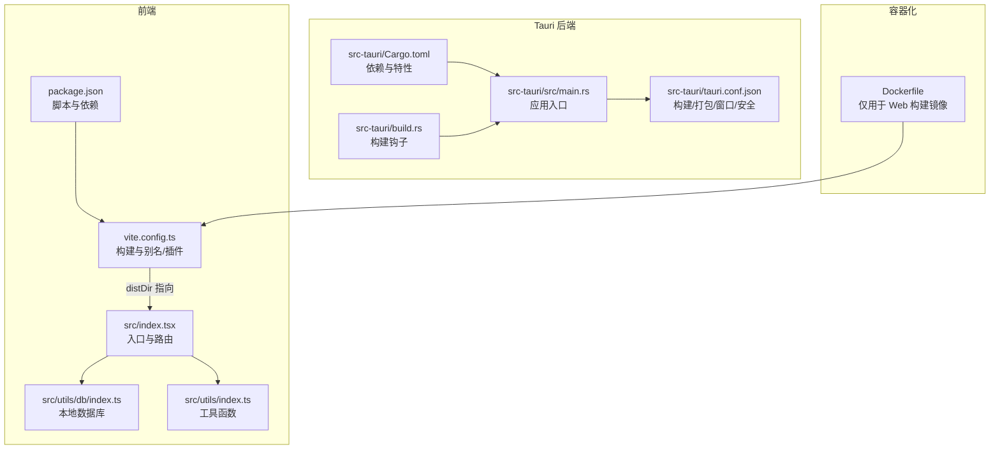
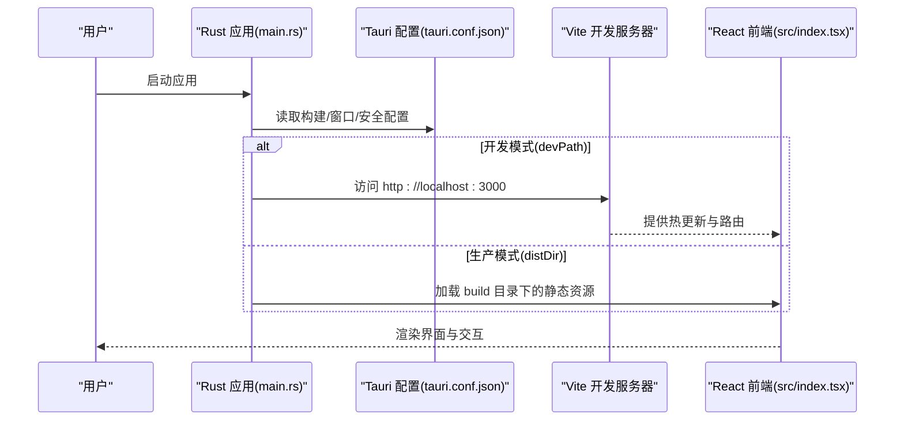
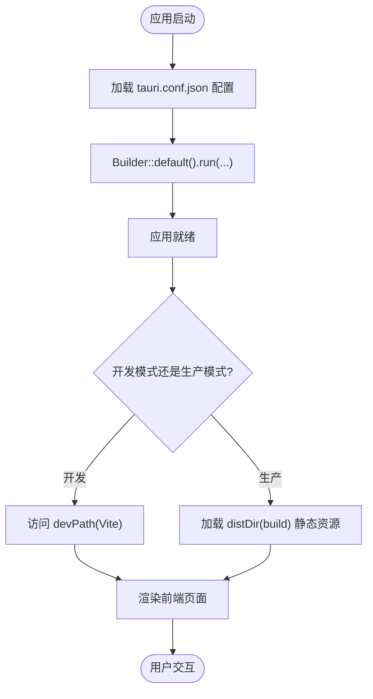
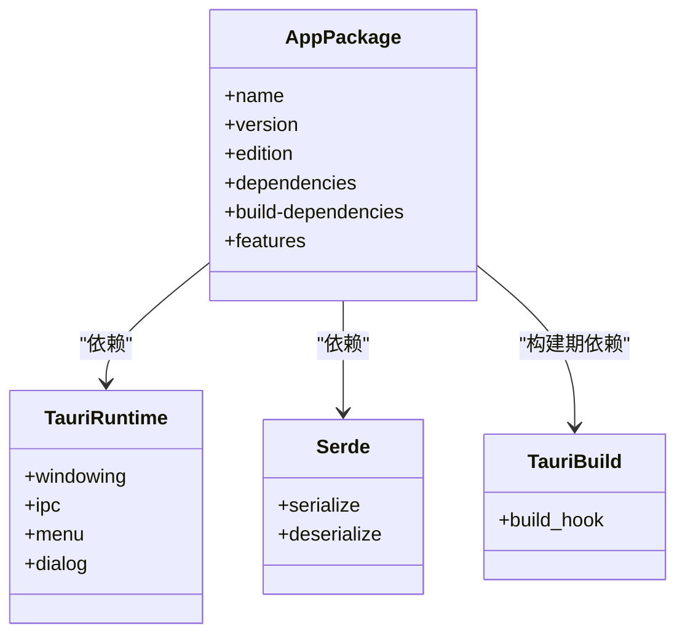
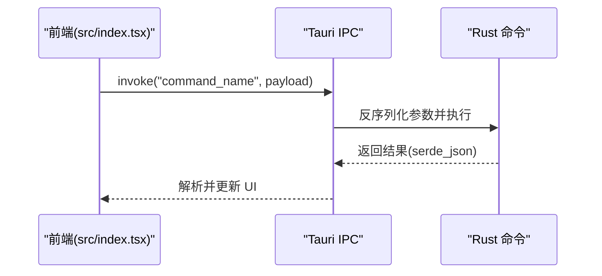
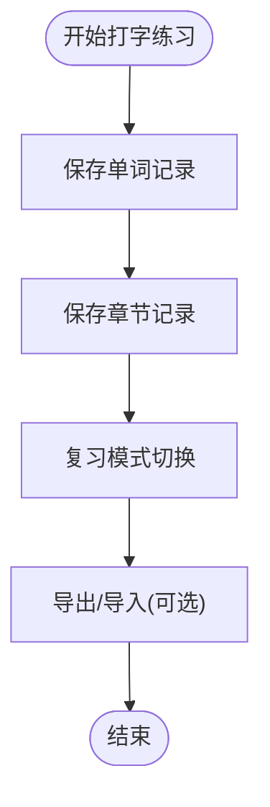
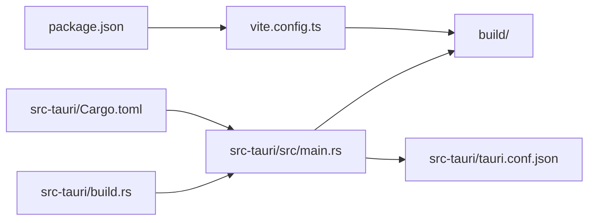

# Tauri 框架集成

<cite>
**本文引用的文件**
- [tauri.conf.json](file://src-tauri/tauri.conf.json)
- [Cargo.toml](file://src-tauri/Cargo.toml)
- [main.rs](file://src-tauri/src/main.rs)
- [build.rs](file://src-tauri/build.rs)
- [package.json](file://package.json)
- [vite.config.ts](file://vite.config.ts)
- [Dockerfile](file://Dockerfile)
- [src/index.tsx](file://src/index.tsx)
- [src/utils/db/index.ts](file://src/utils/db/index.ts)
- [src/utils/index.ts](file://src/utils/index.ts)
</cite>

## 目录

1. [引言](#引言)
2. [项目结构](#项目结构)
3. [核心组件](#核心组件)
4. [架构总览](#架构总览)
5. [详细组件分析](#详细组件分析)
6. [依赖关系分析](#依赖关系分析)
7. [性能考虑](#性能考虑)
8. [故障排查指南](#故障排查指南)
9. [结论](#结论)
10. [附录](#附录)

## 引言

本技术文档面向希望在现有前端应用基础上集成 Tauri 的开发者，系统性讲解如何在该仓库中完成 Tauri 集成与配置，涵盖以下关键主题：

- Tauri 配置文件的各项参数（构建、打包、安全策略、窗口设置）
- Rust 主程序初始化流程与事件处理机制
- Cargo.toml 中的依赖管理与编译配置
- 前后端通信机制（命令系统与 IPC 协议）
- 最佳实践与性能优化建议
- 跨平台兼容性与平台特定配置差异

本项目当前未显式声明命令与 IPC 处理逻辑，但已具备 Tauri 运行所需的最小化配置与工程化基础，可作为扩展命令与 IPC 的起点。

## 项目结构

该项目采用“前端 Vite + React + TypeScript”与“Rust + Tauri”双栈架构，Tauri 相关配置位于 src-tauri 目录，前端构建产物输出至根目录 build，供 Tauri 在开发与生产模式下使用。

图表来源

- [tauri.conf.json](file://src-tauri/tauri.conf.json#L1-L60)
- [Cargo.toml](file://src-tauri/Cargo.toml#L1-L27)
- [main.rs](file://src-tauri/src/main.rs#L1-L9)
- [build.rs](file://src-tauri/build.rs#L1-L4)
- [package.json](file://package.json#L1-L128)
- [vite.config.ts](file://vite.config.ts#L1-L55)
- [Dockerfile](file://Dockerfile#L1-L15)

章节来源

- [tauri.conf.json](file://src-tauri/tauri.conf.json#L1-L60)
- [Cargo.toml](file://src-tauri/Cargo.toml#L1-L27)
- [main.rs](file://src-tauri/src/main.rs#L1-L9)
- [build.rs](file://src-tauri/build.rs#L1-L4)
- [package.json](file://package.json#L1-L128)
- [vite.config.ts](file://vite.config.ts#L1-L55)
- [Dockerfile](file://Dockerfile#L1-L15)

## 核心组件

- Tauri 配置层：通过 tauri.conf.json 管理构建命令、开发服务器地址、打包产物目录、产品信息、打包选项、安全策略与窗口初始尺寸等。
- Rust 应用层：main.rs 使用默认 Builder 初始化并运行应用；build.rs 触发 tauri_build 构建流程；Cargo.toml 定义依赖与特性。
- 前端工程层：package.json 提供开发/构建脚本；vite.config.ts 控制构建输出、源码映射、别名与插件；src/index.tsx 为 React 入口与路由。
- 数据持久层：src/utils/db/index.ts 基于 Dexie 实现 IndexedDB 封装，支撑打字练习与复习记录的本地存储。

章节来源

- [tauri.conf.json](file://src-tauri/tauri.conf.json#L1-L60)
- [Cargo.toml](file://src-tauri/Cargo.toml#L1-L27)
- [main.rs](file://src-tauri/src/main.rs#L1-L9)
- [build.rs](file://src-tauri/build.rs#L1-L4)
- [package.json](file://package.json#L1-L128)
- [vite.config.ts](file://vite.config.ts#L1-L55)
- [src/index.tsx](file://src/index.tsx#L1-L79)
- [src/utils/db/index.ts](file://src/utils/db/index.ts#L1-L136)

## 架构总览

下图展示从用户启动到页面渲染的端到端流程，以及 Tauri 如何在开发与生产模式下加载前端资源。

图表来源

- [main.rs](file://src-tauri/src/main.rs#L1-L9)
- [tauri.conf.json](file://src-tauri/tauri.conf.json#L1-L60)
- [vite.config.ts](file://vite.config.ts#L1-L55)
- [src/index.tsx](file://src/index.tsx#L1-L79)

## 详细组件分析

### Tauri 配置文件详解（tauri.conf.json）

- 构建配置
  - beforeDevCommand：开发前执行的命令，用于启动 Vite 开发服务器。
  - beforeBuildCommand：构建前执行的命令，用于生成生产构建产物。
  - devPath：开发模式下前端开发服务器地址。
  - distDir：生产模式下静态资源目录，需与 Vite 输出目录一致。
- 包管理与打包
  - productName/version：产品名称与版本号。
  - bundle.identifier：应用标识符，用于签名与分发。
  - bundle.icon：多尺寸图标列表，覆盖不同平台需求。
  - bundle.targets：目标平台（当前为 all）。
  - bundle.macOS/windows：平台特定配置项（如签名、证书指纹、摘要算法等）。
  - bundle.resources：打包时附加的资源路径。
- 安全策略
  - allowlist.all：当前关闭全局允许，建议按需开启具体 API。
  - security.csp：内容安全策略，当前为空。
- 更新器
  - updater.active：当前关闭自动更新。
- 窗口设置
  - 初始窗口尺寸、标题、是否可调整大小、是否全屏等。

章节来源

- [tauri.conf.json](file://src-tauri/tauri.conf.json#L1-L60)

### Rust 主程序初始化与事件处理

- 初始化流程
  - main.rs 使用默认 Builder 初始化应用，并通过 generate_context!() 注入配置。
  - windows_subsystem 在发布版隐藏控制台窗口，避免额外控制台弹出。
- 事件处理机制
  - 当前未注册任何命令或事件监听器，建议在初始化阶段通过 Commands 与 Menu/GlobalShortcut 等能力扩展功能。

图表来源

- [main.rs](file://src-tauri/src/main.rs#L1-L9)
- [tauri.conf.json](file://src-tauri/tauri.conf.json#L1-L60)

章节来源

- [main.rs](file://src-tauri/src/main.rs#L1-L9)

### Cargo.toml 依赖管理与编译配置

- 依赖
  - tauri：核心运行时，提供窗口、菜单、对话框、IPC 等能力。
  - serde/serde_json：序列化与反序列化支持。
  - tauri-build：构建期辅助，配合 build.rs 使用。
- 特性
  - custom-protocol：用于切换 dev/build 模式的自定义协议特性，便于 CLI 或非 CLI 场景区分环境。

图表来源

- [Cargo.toml](file://src-tauri/Cargo.toml#L1-L27)

章节来源

- [Cargo.toml](file://src-tauri/Cargo.toml#L1-L27)

### 前端工程与构建配置（Vite）

- 构建输出
  - outDir：构建产物目录为 build。
  - minify：生产模式启用压缩。
  - sourcemap：生产模式关闭以减小体积。
- 插件与别名
  - react 插件、可视化插件、图标插件、别名 @ -> src。
- define 常量
  - 注入部署环境与最新提交哈希等常量，便于运行时判断。
- 资源路径
  - 基础路径 base=./，确保打包后资源正确解析。

章节来源

- [vite.config.ts](file://vite.config.ts#L1-L55)
- [package.json](file://package.json#L1-L128)

### 前后端通信机制（命令系统与 IPC）

- 当前状态
  - 未在 Rust 侧注册命令，也未在前端发起命令调用。
- 扩展建议
  - 在 Rust 侧通过 Commands 注册命令，前端通过 invoke 调用，返回值通过 serde_json 进行序列化传输。
  - 对于需要权限的操作，结合 allowlist 与 CSP 进行安全加固。
  - 对大对象或二进制数据，优先采用文件路径传递或分块传输，避免过大的 JSON 体积。

图表来源

- [main.rs](file://src-tauri/src/main.rs#L1-L9)
- [tauri.conf.json](file://src-tauri/tauri.conf.json#L1-L60)

### 数据持久化与本地存储

- Dexie 封装
  - 使用 Dexie 对 IndexedDB 进行版本化管理，定义 wordRecords/chapterRecords/reviewRecords 表结构。
  - 提供保存/删除/查询等常用操作，支撑打字练习与复习场景。
- 与 Tauri 的关系
  - 前端本地存储不直接依赖 Tauri；若需导出/导入或跨设备同步，可在 Rust 侧新增命令进行文件系统交互或网络请求。

图表来源

- [src/utils/db/index.ts](file://src/utils/db/index.ts#L1-L136)

章节来源

- [src/utils/db/index.ts](file://src/utils/db/index.ts#L1-L136)

### 跨平台兼容性与平台特定配置

- 平台差异
  - macOS：可通过 bundle.macOS 配置 entitlements/signingIdentity 等。
  - Windows：可通过 bundle.windows 配置证书指纹、摘要算法与时间戳 URL。
  - Linux：注意 GTK/WebKit2 等运行时依赖，必要时通过包管理器安装。
- 图标与资源
  - 通过 bundle.icon 提供多尺寸图标，满足不同 DPI 与平台要求。
- 窗口行为
  - 不同平台窗口装饰、菜单栏与快捷键行为存在差异，建议在窗口初始化时根据平台动态调整。

章节来源

- [tauri.conf.json](file://src-tauri/tauri.conf.json#L1-L60)

## 依赖关系分析

- 前端依赖
  - React 生态、路由、状态管理、可视化库与工具库构成前端主体。
  - Vite 提供开发与构建能力，配合插件增强开发体验。
- 后端依赖
  - tauri 为核心运行时，tauri-build 用于构建期资源注入。
  - serde/serde_json 支持命令参数与返回值的序列化。
- 构建链路
  - package.json 脚本触发 Vite 构建；tauri.conf.json 指定 distDir；Rust 通过 generate_context!() 读取配置并加载静态资源。

图表来源

- [package.json](file://package.json#L1-L128)
- [vite.config.ts](file://vite.config.ts#L1-L55)
- [main.rs](file://src-tauri/src/main.rs#L1-L9)
- [tauri.conf.json](file://src-tauri/tauri.conf.json#L1-L60)
- [Cargo.toml](file://src-tauri/Cargo.toml#L1-L27)
- [build.rs](file://src-tauri/build.rs#L1-L4)

章节来源

- [package.json](file://package.json#L1-L128)
- [vite.config.ts](file://vite.config.ts#L1-L55)
- [main.rs](file://src-tauri/src/main.rs#L1-L9)
- [tauri.conf.json](file://src-tauri/tauri.conf.json#L1-L60)
- [Cargo.toml](file://src-tauri/Cargo.toml#L1-L27)
- [build.rs](file://src-tauri/build.rs#L1-L4)

## 性能考虑

- 构建优化
  - 生产模式启用压缩与移除调试语句，减少体积与运行时开销。
  - 关闭 sourcemap 以降低发布包体积。
- 资源加载
  - 将静态资源置于 distDir，确保路径正确；避免重复请求与缓存失效。
- 数据库访问
  - 合理拆分事务与批量写入，避免主线程阻塞。
- IPC 传输
  - 大对象尽量通过文件路径或流式传输，减少 JSON 序列化成本。
- 跨平台
  - 预先安装平台依赖，避免运行时动态下载导致卡顿。

## 故障排查指南

- 开发模式无法加载前端
  - 检查 devPath 是否可达，确认 beforeDevCommand 正确启动 Vite。
  - 确认 package.json 中 dev 脚本与 Vite 配置一致。
- 生产模式白屏或资源 404
  - 检查 distDir 与 Vite outDir 是否一致。
  - 确认构建脚本未被 CI 修改输出目录。
- 窗口尺寸/标题异常
  - 检查 tauri.conf.json 中 windows 数组对应字段。
- 安全策略相关问题
  - 若启用 allowlist/all=false，需逐项开放所需 API。
  - CSP 为空时，注意浏览器对内联脚本与外链资源的限制。
- 平台签名与打包失败
  - macOS 需要有效的 signingIdentity 与 entitlements。
  - Windows 需要有效证书指纹与时间戳 URL。

章节来源

- [tauri.conf.json](file://src-tauri/tauri.conf.json#L1-L60)
- [package.json](file://package.json#L1-L128)
- [vite.config.ts](file://vite.config.ts#L1-L55)

## 结论

本项目已具备 Tauri 集成的基础条件：正确的构建链路、合理的打包配置与清晰的窗口/安全策略入口。下一步建议围绕命令系统与 IPC 进行扩展，完善权限控制与错误处理，并针对各平台进行签名与打包验证，最终形成稳定、高性能且跨平台可用的应用。

## 附录

- Dockerfile 仅用于 Web 构建镜像，不参与 Tauri 打包流程；如需容器化 Tauri 应用，建议另行准备多阶段构建以适配各平台依赖。
- 平台特定配置示例（macOS/Windows/Linux）可在 tauri.conf.json 的 bundle.macOS 与 bundle.windows 字段中补充，确保签名与资源完整。

章节来源

- [Dockerfile](file://Dockerfile#L1-L15)
- [tauri.conf.json](file://src-tauri/tauri.conf.json#L1-L60)
