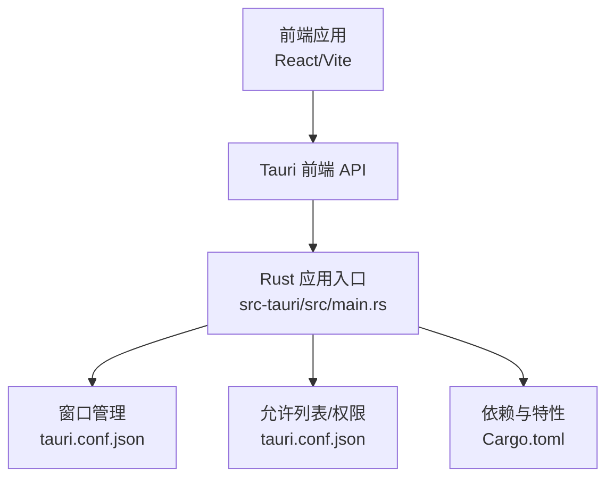
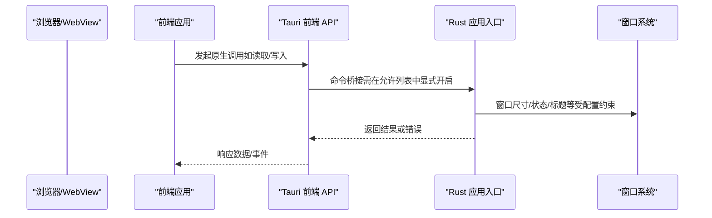
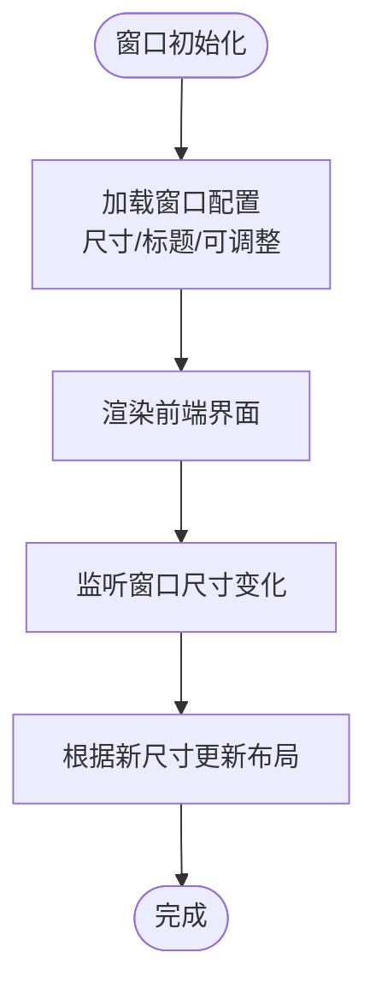
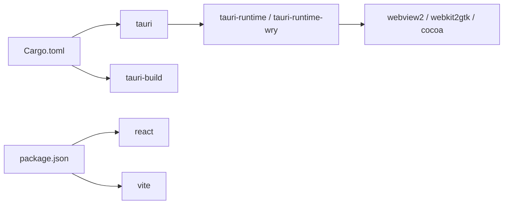

# 原生功能实现

<cite>
**本文引用的文件**
- [tauri.conf.json](file://src-tauri/tauri.conf.json)
- [main.rs](file://src-tauri/src/main.rs)
- [Cargo.toml](file://src-tauri/Cargo.toml)
- [build.rs](file://src-tauri/build.rs)
- [package.json](file://package.json)
- [useWindowSize.tsx](file://src/hooks/useWindowSize.tsx)
</cite>

## 目录

1. [简介](#简介)
2. [项目结构](#项目结构)
3. [核心组件](#核心组件)
4. [架构总览](#架构总览)
5. [详细组件分析](#详细组件分析)
6. [依赖关系分析](#依赖关系分析)
7. [性能考量](#性能考量)
8. [故障排查指南](#故障排查指南)
9. [结论](#结论)
10. [附录](#附录)

## 简介

本技术文档围绕 Tauri 应用“qwerty-learner”的原生功能实现展开，重点覆盖以下方面：

- 允许列表（Allowlist）的安全配置与权限管理策略
- 文件系统访问、剪贴板操作、系统通知等原生 API 的调用方式与边界
- 窗口管理：窗口创建、尺寸调整与状态控制
- 菜单系统与系统托盘的实现机制
- 跨平台原生功能的差异处理与兼容性方案
- 原生功能扩展的开发指南与调试技巧
- 安全考虑与权限验证的最佳实践

当前仓库未在 Rust 层显式声明任何允许列表或原生命令绑定，因此默认采用最小权限模型；前端通过 Tauri 提供的 API 与命令桥接进行交互。

## 项目结构

该应用采用典型的 Tauri 前后端分离结构：

- 前端：React/Vite 工程，位于根目录，负责用户界面与交互逻辑
- 原生层：Rust 工程位于 src-tauri，负责窗口、系统集成与可选的原生命令桥接
- 构建与打包：通过 tauri.conf.json 配置构建流程、打包参数与窗口初始属性

图表来源

- [main.rs](file://src-tauri/src/main.rs#L1-L9)
- [tauri.conf.json](file://src-tauri/tauri.conf.json#L1-L60)
- [Cargo.toml](file://src-tauri/Cargo.toml#L1-L27)

章节来源

- [package.json](file://package.json#L1-L128)
- [tauri.conf.json](file://src-tauri/tauri.conf.json#L1-L60)
- [main.rs](file://src-tauri/src/main.rs#L1-L9)
- [Cargo.toml](file://src-tauri/Cargo.toml#L1-L27)

## 核心组件

- 允许列表与安全策略
  - 当前配置中允许列表处于关闭状态，意味着默认不开放任何原生能力，需按需启用
- 窗口与运行时
  - 初始窗口尺寸、标题、是否可调整等由配置文件定义
- 构建与运行
  - Rust 入口仅执行默认构建器并运行上下文
  - 构建脚本委托给 tauri-build

章节来源

- [tauri.conf.json](file://src-tauri/tauri.conf.json#L12-L58)
- [main.rs](file://src-tauri/src/main.rs#L4-L8)
- [build.rs](file://src-tauri/build.rs#L1-L4)

## 架构总览

下图展示了从前端到原生层的关键交互路径，以及当前配置下的默认安全边界。

图表来源

- [main.rs](file://src-tauri/src/main.rs#L4-L8)
- [tauri.conf.json](file://src-tauri/tauri.conf.json#L12-L58)

## 详细组件分析

### 允许列表与权限管理

- 默认行为
  - 允许列表被显式关闭，表示所有原生能力默认禁用，避免不必要的安全风险
- 启用策略
  - 在允许列表中按需开启特定 API 或命令，例如文件系统、剪贴板、通知等
  - 每个启用的 API 都应遵循最小权限原则，并在前端侧做好输入校验与错误处理
- 权限验证最佳实践
  - 在前端对敏感操作进行二次确认与用户授权提示
  - 对外部输入进行严格校验与白名单过滤
  - 使用只读访问优先策略，必要时再申请写入权限

章节来源

- [tauri.conf.json](file://src-tauri/tauri.conf.json#L12-L16)

### 窗口管理

- 初始化与属性
  - 窗口标题、尺寸、是否可调整等在配置中集中定义
- 尺寸调整与响应式
  - 前端可通过监听窗口 resize 事件动态适配布局
- 状态控制
  - 可通过前端 API 控制窗口可见性、置顶、最小化/还原等（需在允许列表中启用对应命令）

图表来源

- [tauri.conf.json](file://src-tauri/tauri.conf.json#L49-L57)
- [useWindowSize.tsx](file://src/hooks/useWindowSize.tsx#L1-L29)

章节来源

- [tauri.conf.json](file://src-tauri/tauri.conf.json#L49-L57)
- [useWindowSize.tsx](file://src/hooks/useWindowSize.tsx#L1-L29)

### 文件系统访问

- 当前未启用文件系统相关命令
- 若需启用，请在允许列表中添加相应命令，并在前端侧：
  - 限制可访问的目录范围
  - 对文件名与路径进行白名单校验
  - 提供进度反馈与错误回滚机制

章节来源

- [tauri.conf.json](file://src-tauri/tauri.conf.json#L12-L16)

### 剪贴板操作

- 当前未启用剪贴板相关命令
- 若需启用，请在允许列表中添加对应命令，并在前端侧：
  - 明确告知用户剪贴板用途与数据范围
  - 对粘贴内容进行格式与长度限制

章节来源

- [tauri.conf.json](file://src-tauri/tauri.conf.json#L12-L16)

### 系统通知

- 当前未启用通知相关命令
- 若需启用，请在允许列表中添加对应命令，并在前端侧：
  - 提供用户开关与权限引导
  - 区分重要通知与普通提示，避免打扰

章节来源

- [tauri.conf.json](file://src-tauri/tauri.conf.json#L12-L16)

### 菜单系统与系统托盘

- 当前未启用菜单与托盘相关命令
- 若需启用，请在允许列表中添加对应命令，并在前端侧：
  - 统一管理菜单项与快捷键
  - 托盘图标与上下文菜单需遵循平台规范

章节来源

- [tauri.conf.json](file://src-tauri/tauri.conf.json#L12-L16)

### 跨平台差异与兼容性

- 平台差异
  - 不同平台的窗口系统、菜单与托盘实现存在差异
- 兼容性建议
  - 在允许列表中按平台分别配置所需能力
  - 前端通过条件分支或运行时检测适配不同平台行为
  - 对于不可用的功能，提供降级提示与替代方案

章节来源

- [tauri.conf.json](file://src-tauri/tauri.conf.json#L27-L41)

### 原生功能扩展开发指南

- 开发步骤
  - 在允许列表中启用目标原生能力
  - 在 Rust 层实现对应的命令处理器（如需要）
  - 在前端封装调用接口，统一错误处理与用户提示
- 调试技巧
  - 使用日志输出与断点定位问题
  - 分模块测试：先验证命令桥接，再验证 UI 行为
  - 在开发模式下逐步放开允许列表，缩小问题范围

章节来源

- [tauri.conf.json](file://src-tauri/tauri.conf.json#L12-L16)
- [main.rs](file://src-tauri/src/main.rs#L4-L8)

## 依赖关系分析

- Rust 依赖
  - 使用 tauri 作为核心框架，tauri-build 用于构建期生成资源与上下文
- 前端依赖
  - React 生态与 Vite 构建工具链，负责页面渲染与交互
- 关系图

图表来源

- [Cargo.toml](file://src-tauri/Cargo.toml#L1-L27)
- [package.json](file://package.json#L1-L128)

章节来源

- [Cargo.toml](file://src-tauri/Cargo.toml#L1-L27)
- [package.json](file://package.json#L1-L128)

## 性能考量

- 最小权限原则有助于减少不必要的系统调用与内存占用
- 前端窗口尺寸监听应节流处理，避免频繁重排
- 对大文件读写与网络请求应采用异步与进度反馈机制

## 故障排查指南

- 常见问题
  - 原生调用失败：检查允许列表是否已启用对应命令
  - 窗口尺寸异常：核对配置中的宽高与前端监听逻辑
  - 构建失败：确认 tauri-build 版本与 Cargo.toml 中的依赖一致
- 排查步骤
  - 逐项启用允许列表能力，定位具体失败点
  - 使用浏览器开发者工具观察前端 API 调用与返回
  - 查看原生层日志输出，定位命令处理异常

章节来源

- [tauri.conf.json](file://src-tauri/tauri.conf.json#L12-L16)
- [build.rs](file://src-tauri/build.rs#L1-L4)
- [Cargo.toml](file://src-tauri/Cargo.toml#L1-L27)

## 结论

本项目当前采用严格的最小权限模型，默认不开放任何原生能力，确保了基础安全性。若后续需要引入文件系统、剪贴板、通知、菜单与托盘等功能，应在允许列表中按需启用，并结合前端的权限提示与校验机制，形成完整的安全闭环。同时，针对跨平台差异制定兼容性策略，确保在不同操作系统上的一致体验。

## 附录

- 快速参考
  - 允许列表位置：[tauri.conf.json](file://src-tauri/tauri.conf.json#L12-L16)
  - 窗口配置位置：[tauri.conf.json](file://src-tauri/tauri.conf.json#L49-L57)
  - 原生入口位置：[main.rs](file://src-tauri/src/main.rs#L4-L8)
  - 构建入口位置：[build.rs](file://src-tauri/build.rs#L1-L4)
  - 依赖声明位置：[Cargo.toml](file://src-tauri/Cargo.toml#L1-L27)
  - 前端窗口监听位置：[useWindowSize.tsx](file://src/hooks/useWindowSize.tsx#L1-L29)
