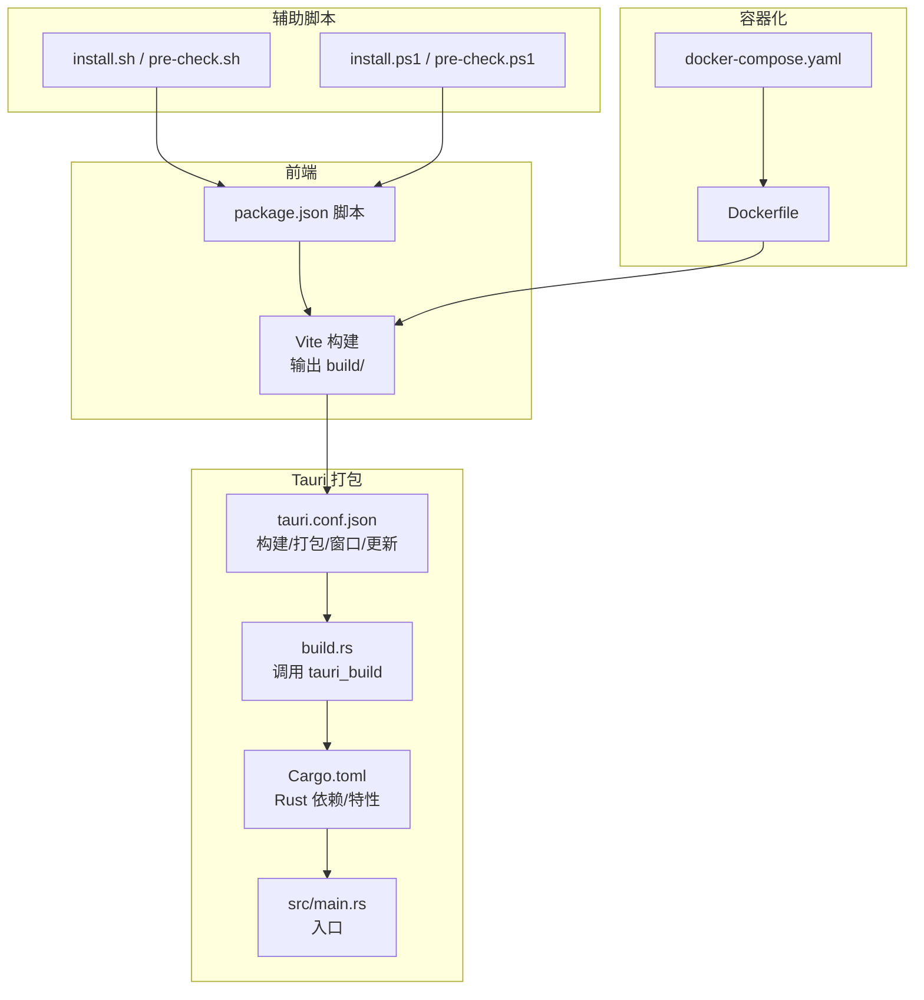
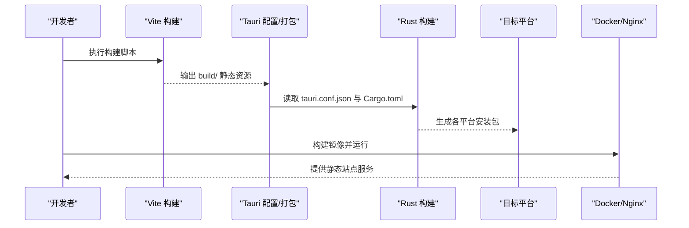
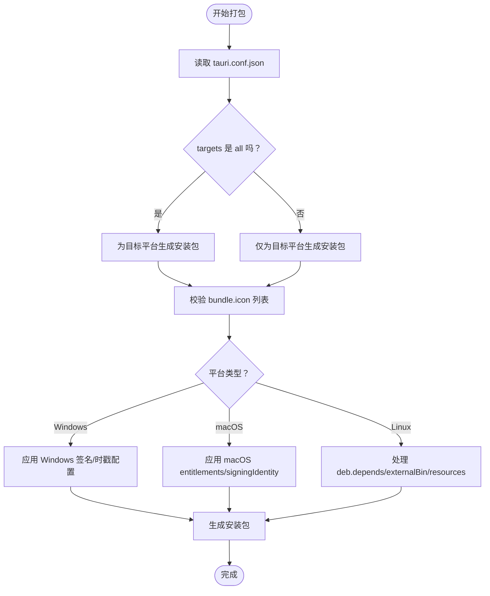
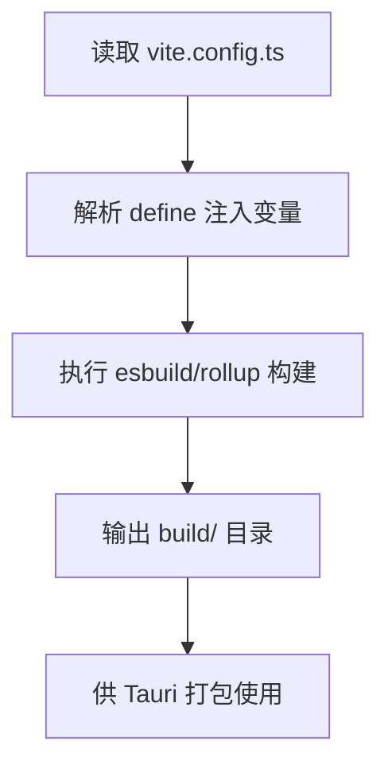
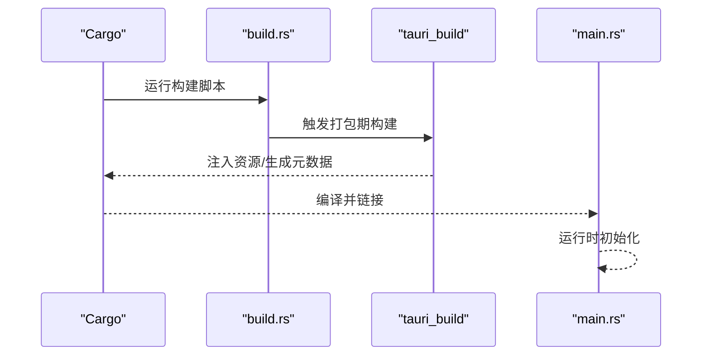
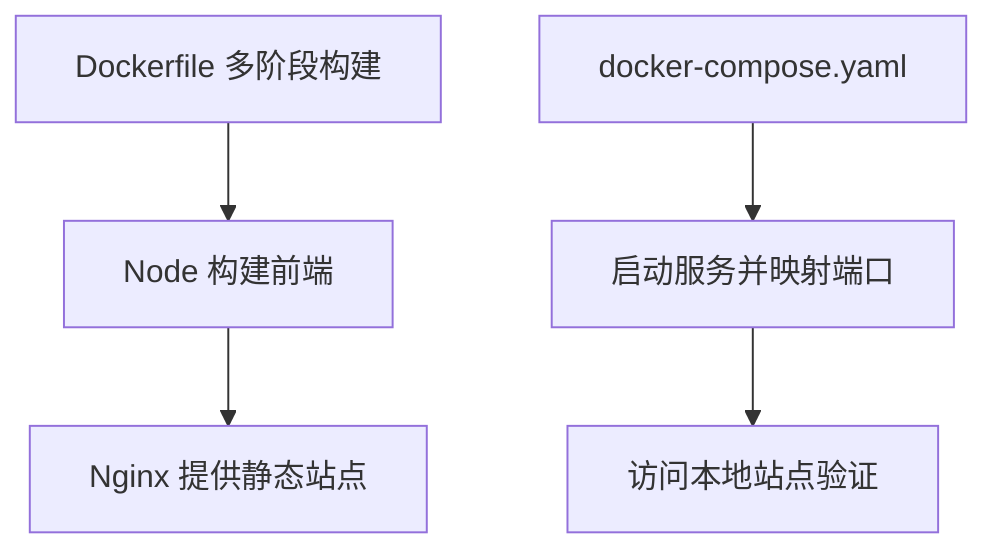
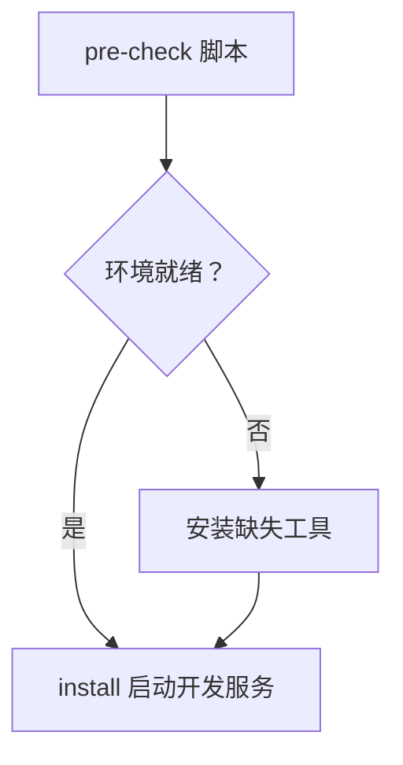
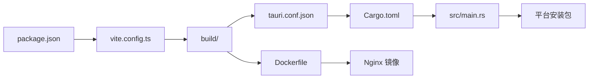

# 应用打包与分发

<cite>
**本文引用的文件**
- [package.json](file://package.json)
- [vite.config.ts](file://vite.config.ts)
- [src-tauri/tauri.conf.json](file://src-tauri/tauri.conf.json)
- [src-tauri/Cargo.toml](file://src-tauri/Cargo.toml)
- [src-tauri/src/main.rs](file://src-tauri/src/main.rs)
- [src-tauri/build.rs](file://src-tauri/build.rs)
- [Dockerfile](file://Dockerfile)
- [docker-compose.yaml](file://docker-compose.yaml)
- [scripts/install.sh](file://scripts/install.sh)
- [scripts/install.ps1](file://scripts/install.ps1)
- [scripts/pre-check.sh](file://scripts/pre-check.sh)
- [scripts/pre-check.ps1](file://scripts/pre-check.ps1)
</cite>

## 目录

1. [简介](#简介)
2. [项目结构](#项目结构)
3. [核心组件](#核心组件)
4. [架构总览](#架构总览)
5. [详细组件分析](#详细组件分析)
6. [依赖关系分析](#依赖关系分析)
7. [性能考虑](#性能考虑)
8. [故障排查指南](#故障排查指南)
9. [结论](#结论)
10. [附录](#附录)

## 简介

本指南面向 Tauri 应用“qwerty-learner”的打包与分发，覆盖以下主题：

- Tauri 打包配置：图标、包标识符、目标平台、依赖管理
- 多平台打包流程（Windows/macOS/Linux）与平台特定配置
- Docker 容器化与 docker-compose 编排
- 自动更新机制的现状与启用建议
- 应用签名、证书与安全发布最佳实践
- CI/CD 流水线集成与自动化部署思路
- 应用商店与传统分发渠道准备要点

## 项目结构

该仓库采用前端（Vite/React）+ Rust（Tauri）双层架构，打包与分发相关的关键位置如下：

- 前端构建：Vite 配置与构建脚本
- 打包配置：Tauri 配置文件与 Rust 清单
- 容器化：Dockerfile 与 docker-compose
- 脚本工具：跨平台安装与前置检查脚本

图表来源

- [vite.config.ts](file://vite.config.ts#L1-L55)
- [package.json](file://package.json#L60-L68)
- [src-tauri/tauri.conf.json](file://src-tauri/tauri.conf.json#L1-L59)
- [src-tauri/Cargo.toml](file://src-tauri/Cargo.toml#L1-L27)
- [src-tauri/src/main.rs](file://src-tauri/src/main.rs#L1-L8)
- [src-tauri/build.rs](file://src-tauri/build.rs#L1-L3)
- [Dockerfile](file://Dockerfile#L1-L15)
- [docker-compose.yaml](file://docker-compose.yaml#L1-L10)
- [scripts/install.sh](file://scripts/install.sh#L1-L28)
- [scripts/install.ps1](file://scripts/install.ps1#L1-L39)
- [scripts/pre-check.sh](file://scripts/pre-check.sh#L1-L47)
- [scripts/pre-check.ps1](file://scripts/pre-check.ps1#L1-L63)

章节来源

- [package.json](file://package.json#L60-L68)
- [vite.config.ts](file://vite.config.ts#L1-L55)
- [src-tauri/tauri.conf.json](file://src-tauri/tauri.conf.json#L1-L59)
- [src-tauri/Cargo.toml](file://src-tauri/Cargo.toml#L1-L27)
- [src-tauri/src/main.rs](file://src-tauri/src/main.rs#L1-L8)
- [src-tauri/build.rs](file://src-tauri/build.rs#L1-L3)
- [Dockerfile](file://Dockerfile#L1-L15)
- [docker-compose.yaml](file://docker-compose.yaml#L1-L10)
- [scripts/install.sh](file://scripts/install.sh#L1-L28)
- [scripts/install.ps1](file://scripts/install.ps1#L1-L39)
- [scripts/pre-check.sh](file://scripts/pre-check.sh#L1-L47)
- [scripts/pre-check.ps1](file://scripts/pre-check.ps1#L1-L63)

## 核心组件

- 前端构建与产物
  - 使用 Vite 进行构建，输出目录为 build，生产模式启用最小化与源码映射策略由配置控制。
  - 构建脚本在 package.json 中定义，用于生成静态资源供 Tauri 打包。
- Tauri 打包配置
  - 构建阶段：devPath 指向本地开发服务器，distDir 指向 build 目录；beforeBuildCommand 与 beforeDevCommand 分别在打包前与开发前执行。
  - 包元数据：productName 与 version 用于生成最终安装包。
  - 打包参数：图标列表、包标识符、目标平台、类别、Windows 与 macOS 平台特定字段等。
  - 更新器：当前处于禁用状态，可按需启用并配置后端更新通道。
  - 窗口尺寸与标题：统一配置在 windows 数组中。
- Rust 侧入口与构建
  - main.rs 为 Tauri 应用入口，Windows 发布版隐藏控制台。
  - build.rs 调用 tauri_build 完成打包期资源注入。

章节来源

- [vite.config.ts](file://vite.config.ts#L31-L52)
- [package.json](file://package.json#L60-L68)
- [src-tauri/tauri.conf.json](file://src-tauri/tauri.conf.json#L1-L59)
- [src-tauri/src/main.rs](file://src-tauri/src/main.rs#L1-L8)
- [src-tauri/build.rs](file://src-tauri/build.rs#L1-L3)

## 架构总览

下图展示从前端构建到多平台打包的整体流程，以及容器化部署路径。

图表来源

- [package.json](file://package.json#L60-L68)
- [vite.config.ts](file://vite.config.ts#L31-L52)
- [src-tauri/tauri.conf.json](file://src-tauri/tauri.conf.json#L1-L59)
- [src-tauri/Cargo.toml](file://src-tauri/Cargo.toml#L1-L27)
- [Dockerfile](file://Dockerfile#L1-L15)

## 详细组件分析

### 组件 A：Tauri 打包配置与平台目标

- 图标设置
  - 在 bundle.icon 中声明多分辨率图标与平台专用图标（PNG、ICNS、ICO），确保应用在各桌面环境中显示一致。
- 包标识符与元数据
  - identifier 作为包标识符，productName 与 version 决定安装包名称与版本。
- 目标平台
  - targets 设置为“all”，表示同时为目标平台打包；可根据需要改为具体平台以加速构建。
- 平台特定配置
  - macOS：可配置 entitlements、signingIdentity 等（当前为空，表示未启用签名）。
  - Windows：可配置证书指纹、摘要算法与时间戳 URL（当前为空，表示未启用签名与时戳）。
- 依赖与资源
  - deb.depends、externalBin、resources 等可按需扩展。
- 自动更新
  - updater.active 当前为 false，如需启用，应配置后端更新通道与签名策略。

图表来源

- [src-tauri/tauri.conf.json](file://src-tauri/tauri.conf.json#L16-L41)

章节来源

- [src-tauri/tauri.conf.json](file://src-tauri/tauri.conf.json#L16-L41)

### 组件 B：前端构建与产物组织

- 构建目录与最小化策略
  - outDir 为 build，生产模式 drop 控制台与调试语句，提升体积与安全性。
- 版本与提交信息注入
  - 通过 define 注入 REACT_APP_DEPLOY_ENV 与 LATEST_COMMIT_HASH，便于版本追踪。
- 插件生态
  - React 插件、可视化分析插件、图标集合插件等，按需启用。

图表来源

- [vite.config.ts](file://vite.config.ts#L1-L55)

章节来源

- [vite.config.ts](file://vite.config.ts#L1-L55)
- [package.json](file://package.json#L60-L68)

### 组件 C：Rust 入口与构建链路

- 入口逻辑
  - main.rs 使用默认 Builder 运行，生成上下文并启动应用。
- 构建链路
  - build.rs 调用 tauri_build，结合 Cargo.toml 中的依赖与特性，完成打包期资源注入与平台适配。

图表来源

- [src-tauri/build.rs](file://src-tauri/build.rs#L1-L3)
- [src-tauri/Cargo.toml](file://src-tauri/Cargo.toml#L1-L27)
- [src-tauri/src/main.rs](file://src-tauri/src/main.rs#L1-L8)

章节来源

- [src-tauri/src/main.rs](file://src-tauri/src/main.rs#L1-L8)
- [src-tauri/build.rs](file://src-tauri/build.rs#L1-L3)
- [src-tauri/Cargo.toml](file://src-tauri/Cargo.toml#L1-L27)

### 组件 D：Docker 容器化与编排

- Dockerfile
  - 使用多阶段构建：第一阶段安装依赖并构建前端；第二阶段基于 Nginx，将构建产物复制至站点目录，并加载默认站点配置。
- docker-compose
  - 定义服务名称、镜像构建上下文与端口映射，便于本地快速预览与测试。

图表来源

- [Dockerfile](file://Dockerfile#L1-L15)
- [docker-compose.yaml](file://docker-compose.yaml#L1-L10)

章节来源

- [Dockerfile](file://Dockerfile#L1-L15)
- [docker-compose.yaml](file://docker-compose.yaml#L1-L10)

### 组件 E：跨平台安装与前置检查脚本

- install.sh / install.ps1
  - 自动检测并安装 Node（macOS 通过 Homebrew，Windows 通过 Winget），随后安装依赖并启动本地开发服务。
- pre-check.sh / pre-check.ps1
  - 检查 Node/Git/Yarn 环境并提示安装，帮助新环境快速就绪。

图表来源

- [scripts/pre-check.sh](file://scripts/pre-check.sh#L1-L47)
- [scripts/pre-check.ps1](file://scripts/pre-check.ps1#L1-L63)
- [scripts/install.sh](file://scripts/install.sh#L1-L28)
- [scripts/install.ps1](file://scripts/install.ps1#L1-L39)

章节来源

- [scripts/pre-check.sh](file://scripts/pre-check.sh#L1-L47)
- [scripts/pre-check.ps1](file://scripts/pre-check.ps1#L1-L63)
- [scripts/install.sh](file://scripts/install.sh#L1-L28)
- [scripts/install.ps1](file://scripts/install.ps1#L1-L39)

## 依赖关系分析

- 前端到打包
  - package.json 的构建脚本驱动 Vite，产出 build 目录供 Tauri 消费。
- 打包到平台
  - tauri.conf.json 定义打包参数；Cargo.toml 与 build.rs 负责 Rust 侧构建与资源注入。
- 容器化到发布
  - Dockerfile 将 build 目录作为静态站点根目录；docker-compose 提供本地编排。

图表来源

- [package.json](file://package.json#L60-L68)
- [vite.config.ts](file://vite.config.ts#L31-L52)
- [src-tauri/tauri.conf.json](file://src-tauri/tauri.conf.json#L1-L59)
- [src-tauri/Cargo.toml](file://src-tauri/Cargo.toml#L1-L27)
- [src-tauri/src/main.rs](file://src-tauri/src/main.rs#L1-L8)
- [Dockerfile](file://Dockerfile#L1-L15)

章节来源

- [package.json](file://package.json#L60-L68)
- [vite.config.ts](file://vite.config.ts#L31-L52)
- [src-tauri/tauri.conf.json](file://src-tauri/tauri.conf.json#L1-L59)
- [src-tauri/Cargo.toml](file://src-tauri/Cargo.toml#L1-L27)
- [src-tauri/src/main.rs](file://src-tauri/src/main.rs#L1-L8)
- [Dockerfile](file://Dockerfile#L1-L15)

## 性能考虑

- 构建优化
  - 生产模式启用最小化与移除调试语句，有助于减小包体与提升运行时性能。
  - 可结合可视化分析插件定位大体积模块，按需拆分或替换依赖。
- 打包体积
  - 控制 bundle.icon 数量与分辨率，避免冗余资源。
  - externalBin 与 resources 仅添加必要项，减少安装包大小。
- 容器镜像
  - 多阶段构建仅保留必要产物，减少镜像体积；Nginx 官方镜像轻量稳定。

章节来源

- [vite.config.ts](file://vite.config.ts#L31-L52)
- [src-tauri/tauri.conf.json](file://src-tauri/tauri.conf.json#L23-L41)
- [Dockerfile](file://Dockerfile#L1-L15)

## 故障排查指南

- 前端构建失败
  - 检查 package.json 的构建脚本与 Vite 配置；确认 Node/Yarn 版本满足要求。
- Tauri 打包异常
  - 校验 tauri.conf.json 的 devPath 与 distDir 是否匹配实际构建产物。
  - 确认图标路径与文件存在，且命名符合平台规范。
- 平台签名问题
  - Windows：若启用签名，需配置证书指纹、摘要算法与时戳 URL；macOS：配置 entitlements 与 signingIdentity。
- 容器化访问异常
  - 检查 docker-compose 端口映射与 Dockerfile 中 Nginx 配置文件路径。
- 开发环境准备
  - 使用 pre-check 脚本自动检测并安装缺失工具，减少环境差异导致的问题。

章节来源

- [package.json](file://package.json#L60-L68)
- [vite.config.ts](file://vite.config.ts#L31-L52)
- [src-tauri/tauri.conf.json](file://src-tauri/tauri.conf.json#L1-L59)
- [Dockerfile](file://Dockerfile#L1-L15)
- [docker-compose.yaml](file://docker-compose.yaml#L1-L10)
- [scripts/pre-check.sh](file://scripts/pre-check.sh#L1-L47)
- [scripts/pre-check.ps1](file://scripts/pre-check.ps1#L1-L63)

## 结论

本指南梳理了“qwerty-learner”在 Tauri 生态下的打包与分发路径，明确了前端构建、Tauri 配置、平台签名、容器化与脚本工具的协作关系。当前自动更新处于关闭状态，建议在完善签名与后端更新通道后再行启用。后续可在 CI/CD 中串联上述步骤，实现自动化构建与分发。

## 附录

### A. 多平台打包流程与平台特定配置

- Windows
  - 目标：MSI/Installer（由 Tauri 根据配置生成）
  - 签名与时戳：在 Windows 段配置证书指纹、摘要算法与时戳 URL
- macOS
  - 目标：DMG/APP（可进一步公证与沙箱配置）
  - 签名：配置 signingIdentity 与 entitlements
- Linux
  - 目标：AppImage/deb/rpm（取决于目标平台）
  - 依赖：通过 deb.depends 声明系统依赖

章节来源

- [src-tauri/tauri.conf.json](file://src-tauri/tauri.conf.json#L16-L41)

### B. 自动更新机制配置与实现原理

- 当前状态：updater.active 为 false
- 启用步骤（建议）
  - 设置 active 为 true，配置后端更新通道（如 GitHub Releases 或自建服务）
  - 确保安装包签名完整，以便客户端验证更新包合法性
- 实现原理（通用）
  - 应用启动时拉取版本信息与变更日志，对比本地版本后提示或静默更新

章节来源

- [src-tauri/tauri.conf.json](file://src-tauri/tauri.conf.json#L46-L48)

### C. 应用签名、证书管理与安全发布最佳实践

- Windows
  - 使用受信任 CA 签发的代码签名证书
  - 配置证书指纹、摘要算法与时戳 URL，避免离线构建失败
- macOS
  - 使用 Developer ID 或 Apple Distribution 证书
  - 配置 entitlements 与 signingIdentity，确保沙箱合规
- Linux
  - 优先使用发行版签名机制（如 deb 的 debsign）
- 通用
  - 将证书与密钥纳入安全存储，避免硬编码在仓库
  - 对外发布前进行完整性校验与安全扫描

章节来源

- [src-tauri/tauri.conf.json](file://src-tauri/tauri.conf.json#L27-L41)

### D. CI/CD 流水线集成与自动化部署

- 建议步骤
  - 触发条件：push 到主分支或打标签
  - 步骤：安装依赖 → 前端构建 → Tauri 打包 → 生成安装包 → 上传制品 → 发布到应用商店或分发渠道
  - 平台矩阵：分别在 Windows/macOS/Linux 运行打包任务
- 工件管理
  - 将安装包与更新元数据归档，便于回溯与重放发布

[本节为通用实践建议，不直接分析具体文件，故无章节来源]

### E. 应用商店发布与传统分发渠道准备

- 应用商店
  - 准备品牌资料、截图、描述、隐私政策与合规文档
  - 遵循商店审核规范，确保签名与版本号一致
- 传统分发
  - 提供直链下载与校验和（SHA-256）
  - 配置自动更新通道与变更日志

[本节为通用实践建议，不直接分析具体文件，故无章节来源]
