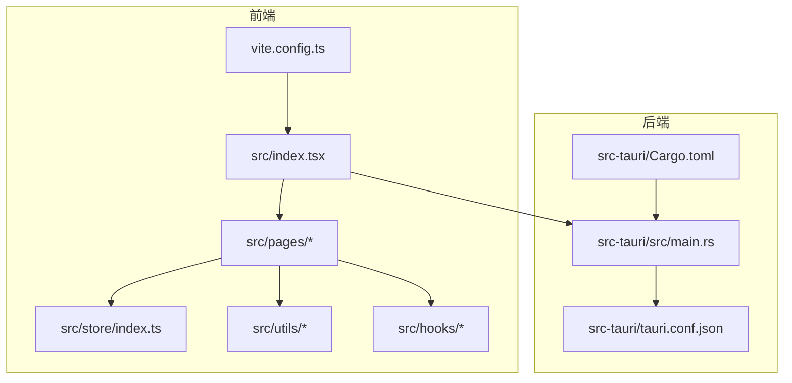
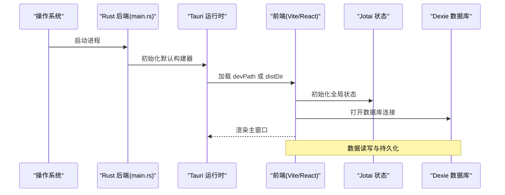
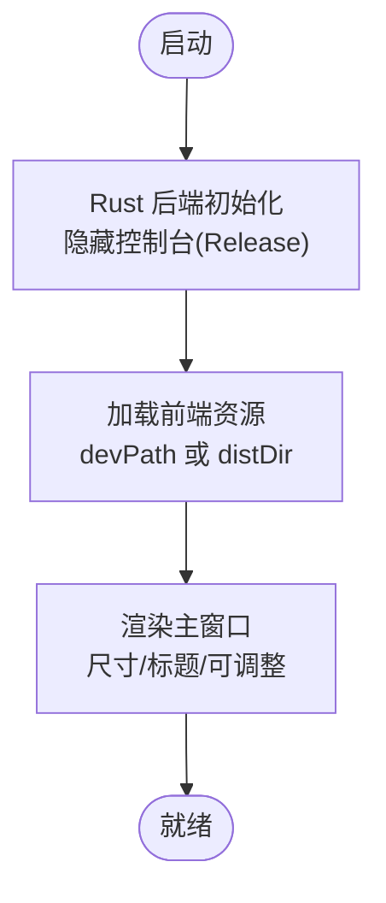
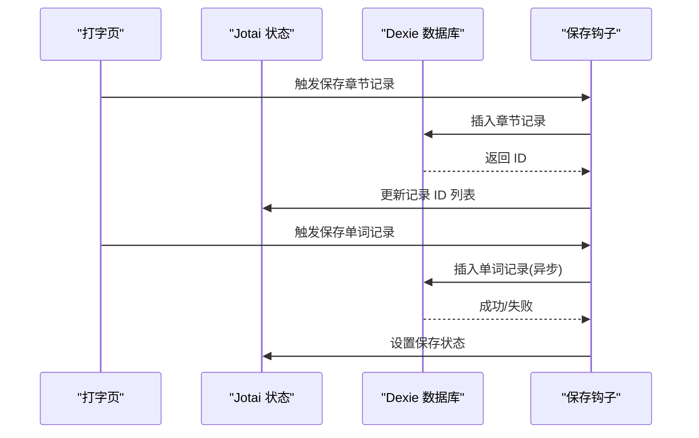
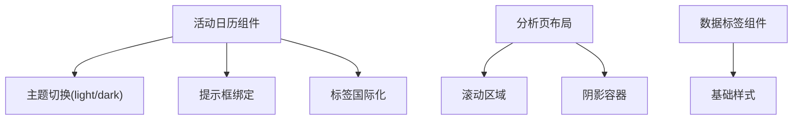
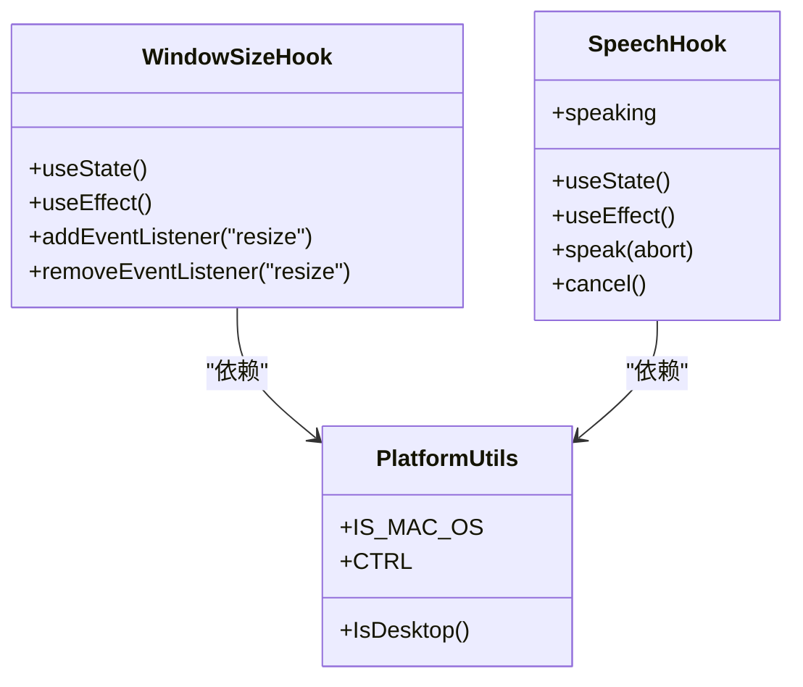
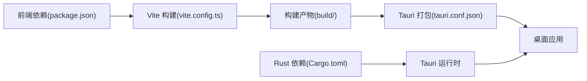

# 桌面应用性能优化

<cite>
**本文引用的文件**
- [main.rs](file://src-tauri/src/main.rs)
- [Cargo.toml](file://src-tauri/Cargo.toml)
- [tauri.conf.json](file://src-tauri/tauri.conf.json)
- [package.json](file://package.json)
- [vite.config.ts](file://vite.config.ts)
- [index.tsx](file://src/index.tsx)
- [index.ts](file://src/pages/Typing/index.tsx)
- [store/index.ts](file://src/store/index.ts)
- [utils/index.ts](file://src/utils/index.ts)
- [utils/db/index.ts](file://src/utils/db/index.ts)
- [hooks/useWindowSize.tsx](file://src/hooks/useWindowSize.tsx)
- [hooks/useSpeech.ts](file://src/hooks/useSpeech.ts)
- [pages/Analysis/components/HeatmapCharts.tsx](file://src/pages/Analysis/components/HeatmapCharts.tsx)
- [pages/Analysis/index.tsx](file://src/pages/Analysis/index.tsx)
- [pages/ErrorBook/RowDetail/DataTag.tsx](file://src/pages/ErrorBook/RowDetail/DataTag.tsx)
</cite>

## 目录

1. [引言](#引言)
2. [项目结构](#项目结构)
3. [核心组件](#核心组件)
4. [架构总览](#架构总览)
5. [详细组件分析](#详细组件分析)
6. [依赖关系分析](#依赖关系分析)
7. [性能考量](#性能考量)
8. [故障排查指南](#故障排查指南)
9. [结论](#结论)
10. [附录](#附录)

## 引言

本指南面向使用 Tauri 构建的桌面应用，聚焦于内存管理、资源优化、前后端协同、窗口渲染性能、启动时间与 CPU 占用控制、后台运行优化、性能监控与瓶颈定位，以及跨平台差异与平台特定优化策略。文档结合仓库现有代码与配置，给出可落地的优化建议与可视化流程。

## 项目结构

该项目采用“前端 Vite + React + TypeScript + Jotai 状态”与“后端 Tauri + Rust”的双层架构。前端负责 UI、交互与数据展示，后端负责系统集成与窗口生命周期管理。构建链路通过 Vite 打包，Tauri 负责打包与分发。

图表来源

- [index.tsx](file://src/index.tsx#L1-L50)
- [main.rs](file://src-tauri/src/main.rs#L1-L9)
- [vite.config.ts](file://vite.config.ts#L1-L55)
- [tauri.conf.json](file://src-tauri/tauri.conf.json#L1-L60)

章节来源

- [package.json](file://package.json#L1-L128)
- [vite.config.ts](file://vite.config.ts#L1-L55)
- [main.rs](file://src-tauri/src/main.rs#L1-L9)
- [tauri.conf.json](file://src-tauri/tauri.conf.json#L1-L60)

## 核心组件

- 前端入口与路由：负责应用启动、页面挂载与全局状态初始化。
- 状态管理：基于 Jotai 的原子化状态，减少不必要的重渲染。
- 数据持久化：基于 Dexie 的 IndexedDB 封装，异步写入与索引设计。
- 性能工具与钩子：窗口尺寸监听、语音合成封装等。
- 后端入口：Tauri 默认构建器启动应用，配置窗口属性与打包选项。

章节来源

- [index.tsx](file://src/index.tsx#L1-L50)
- [store/index.ts](file://src/store/index.ts#L1-L118)
- [utils/db/index.ts](file://src/utils/db/index.ts#L1-L136)
- [hooks/useWindowSize.tsx](file://src/hooks/useWindowSize.tsx#L1-L30)
- [hooks/useSpeech.ts](file://src/hooks/useSpeech.ts#L1-L87)
- [main.rs](file://src-tauri/src/main.rs#L1-L9)

## 架构总览

下图展示了 Tauri 应用的启动与窗口渲染路径，以及前端与后端的协作边界。

图表来源

- [main.rs](file://src-tauri/src/main.rs#L1-L9)
- [tauri.conf.json](file://src-tauri/tauri.conf.json#L1-L60)
- [vite.config.ts](file://vite.config.ts#L1-L55)
- [store/index.ts](file://src/store/index.ts#L1-L118)
- [utils/db/index.ts](file://src/utils/db/index.ts#L1-L136)

## 详细组件分析

### 组件 A：窗口与启动流程

- 启动入口：后端通过默认构建器运行，release 下隐藏控制台，降低额外开销。
- 窗口配置：尺寸、标题、是否可调整、全屏开关等在配置中集中定义，便于统一优化。
- 开发/生产路径：devPath 指向本地开发服务器，distDir 指向构建产物目录，确保构建与调试分离。

图表来源

- [main.rs](file://src-tauri/src/main.rs#L1-L9)
- [tauri.conf.json](file://src-tauri/tauri.conf.json#L1-L60)
- [vite.config.ts](file://vite.config.ts#L1-L55)

章节来源

- [main.rs](file://src-tauri/src/main.rs#L1-L9)
- [tauri.conf.json](file://src-tauri/tauri.conf.json#L1-L60)

### 组件 B：状态与数据流（Jotai + Dexie）

- 状态模型：使用原子化状态，按页面维度拆分，避免全局抖动。
- 数据持久化：Dexie 定义表结构与版本迁移，异步写入与错误处理，减少主线程阻塞。
- 典型流程：打字页保存章节与单词记录，计算派生指标，回写状态，触发 UI 更新。

图表来源

- [store/index.ts](file://src/store/index.ts#L1-L118)
- [utils/db/index.ts](file://src/utils/db/index.ts#L1-L136)

章节来源

- [store/index.ts](file://src/store/index.ts#L1-L118)
- [utils/db/index.ts](file://src/utils/db/index.ts#L1-L136)

### 组件 C：渲染性能与资源优化（图表与 UI）

- 图表组件：活动日历组件按需渲染块、主题切换与标签国际化，避免重复计算。
- 页面布局：滚动区域与阴影容器组合，注意层级与重绘范围。
- 数据标签：轻量组件，避免复杂样式与频繁重排。

图表来源

- [pages/Analysis/components/HeatmapCharts.tsx](file://src/pages/Analysis/components/HeatmapCharts.tsx#L1-L57)
- [pages/Analysis/index.tsx](file://src/pages/Analysis/index.tsx#L62-L81)
- [pages/ErrorBook/RowDetail/DataTag.tsx](file://src/pages/ErrorBook/RowDetail/DataTag.tsx#L1-L25)

章节来源

- [pages/Analysis/components/HeatmapCharts.tsx](file://src/pages/Analysis/components/HeatmapCharts.tsx#L1-L57)
- [pages/Analysis/index.tsx](file://src/pages/Analysis/index.tsx#L62-L81)
- [pages/ErrorBook/RowDetail/DataTag.tsx](file://src/pages/ErrorBook/RowDetail/DataTag.tsx#L1-L25)

### 组件 D：性能工具与平台特性

- 窗口尺寸监听：客户端环境才注册事件，卸载时清理，避免内存泄漏。
- 语音合成封装：对浏览器 Web Speech API 的安全封装，支持取消与状态管理。
- 平台判断：移动端检测与平台键位映射，减少无效渲染与逻辑分支。

图表来源

- [hooks/useWindowSize.tsx](file://src/hooks/useWindowSize.tsx#L1-L30)
- [hooks/useSpeech.ts](file://src/hooks/useSpeech.ts#L1-L87)
- [utils/index.ts](file://src/utils/index.ts#L1-L130)

章节来源

- [hooks/useWindowSize.tsx](file://src/hooks/useWindowSize.tsx#L1-L30)
- [hooks/useSpeech.ts](file://src/hooks/useSpeech.ts#L1-L87)
- [utils/index.ts](file://src/utils/index.ts#L1-L130)

## 依赖关系分析

- 前端依赖：React 生态、Jotai、Dexie、ECharts、Tailwind 等，构建期启用压缩与可视化插件。
- 后端依赖：Tauri、Serde、tauri-build，功能白名单关闭，最小权限原则降低攻击面。
- 构建链路：Vite 配置开启压缩、移除调试语句、关闭 SourceMap，定义别名与 CSS 模块命名约定。

图表来源

- [package.json](file://package.json#L1-L128)
- [vite.config.ts](file://vite.config.ts#L1-L55)
- [tauri.conf.json](file://src-tauri/tauri.conf.json#L1-L60)
- [Cargo.toml](file://src-tauri/Cargo.toml#L1-L27)

章节来源

- [package.json](file://package.json#L1-L128)
- [vite.config.ts](file://vite.config.ts#L1-L55)
- [Cargo.toml](file://src-tauri/Cargo.toml#L1-L27)
- [tauri.conf.json](file://src-tauri/tauri.conf.json#L1-L60)

## 性能考量

### 内存管理与资源优化

- 前端
  - 使用 Jotai 原子化状态，避免全局重渲染；按页面拆分状态，减少无关更新。
  - 图表组件传入数据时尽量扁平化，避免深层对象导致的 diff 复杂度上升。
  - 使用轻量组件（如数据标签），减少 DOM 层级与样式计算。
- 后端
  - 关闭非必要功能白名单，减少 IPC 与权限检查带来的额外开销。
  - 窗口尺寸与标题等静态配置集中管理，避免运行时动态拼接字符串。

章节来源

- [store/index.ts](file://src/store/index.ts#L1-L118)
- [pages/ErrorBook/RowDetail/DataTag.tsx](file://src/pages/ErrorBook/RowDetail/DataTag.tsx#L1-L25)
- [tauri.conf.json](file://src-tauri/tauri.conf.json#L1-L60)

### 前后端协同与数据传输优化

- 最小权限：仅开放必要的 API，降低跨语言调用成本。
- 数据序列化：后端使用 Serde，前端与后端字段保持一致，减少转换损耗。
- 事件驱动：前端通过状态原子与钩子触发后端行为，避免阻塞主线程。

章节来源

- [Cargo.toml](file://src-tauri/Cargo.toml#L1-L27)
- [tauri.conf.json](file://src-tauri/tauri.conf.json#L1-L60)

### 窗口渲染性能优化

- 硬件加速：确保 WebView 使用硬件加速（由 Tauri/Wry 控制），避免过度阴影与复杂滤镜。
- 图形处理：图表组件按需渲染，主题切换时避免全量重绘；滚动区域限制重绘范围。
- 动画与特效：谨慎使用重型动画库，优先使用原生 CSS 动画与较低开销的过渡。

章节来源

- [pages/Analysis/components/HeatmapCharts.tsx](file://src/pages/Analysis/components/HeatmapCharts.tsx#L1-L57)
- [pages/Analysis/index.tsx](file://src/pages/Analysis/index.tsx#L62-L81)

### 启动时间优化、内存占用控制与 CPU 使用率管理

- 启动时间
  - 关闭 SourceMap，移除 console/debugger，启用压缩，缩短构建体积与加载时间。
  - 将非关键模块懒加载，延迟初始化大型图表与数据库。
- 内存占用
  - Dexie 异步写入，避免主线程阻塞；合理设置索引，减少查询成本。
  - 窗口尺寸监听只在客户端注册，卸载时清理事件。
- CPU 使用率
  - 语音合成封装提供取消能力，避免并发 speak 导致的资源竞争。
  - 移动端检测与平台键位映射减少无效逻辑分支。

章节来源

- [vite.config.ts](file://vite.config.ts#L1-L55)
- [utils/db/index.ts](file://src/utils/db/index.ts#L1-L136)
- [hooks/useWindowSize.tsx](file://src/hooks/useWindowSize.tsx#L1-L30)
- [hooks/useSpeech.ts](file://src/hooks/useSpeech.ts#L1-L87)
- [utils/index.ts](file://src/utils/index.ts#L1-L130)

### 后台运行优化与系统资源占用控制

- 窗口最小化/隐藏：根据业务需要最小化到托盘或隐藏窗口，释放 GPU/CPU 资源。
- 定时任务：避免高频定时器，合并批处理任务，使用节流/防抖。
- 数据库：批量写入、事务化操作，减少磁盘 IO。

章节来源

- [tauri.conf.json](file://src-tauri/tauri.conf.json#L1-L60)
- [utils/db/index.ts](file://src/utils/db/index.ts#L1-L136)

### 性能监控与瓶颈分析

- 构建可视化：利用 rollup-plugin-visualizer 生成包体分析报告，识别大体积依赖。
- 运行时监控：结合浏览器开发者工具的时间线、内存快照与网络面板，定位卡顿与内存泄漏。
- 前端性能：使用 React Profiler 与性能 API，识别重渲染热点与长任务。
- 后端性能：通过日志与系统监控工具观察 CPU、内存与线程状态。

章节来源

- [vite.config.ts](file://vite.config.ts#L1-L55)
- [package.json](file://package.json#L1-L128)

### 跨平台差异与平台特定优化

- 平台键位映射：根据 macOS/Windows 差异选择 Control/Ctrl，减少误触。
- 移动端检测：在移动端禁用某些键盘事件或改用触摸手势，避免无效计算。
- 窗口行为：不同平台的窗口系统差异较大，尽量通过 Tauri 配置统一行为。

章节来源

- [utils/index.ts](file://src/utils/index.ts#L1-L130)
- [tauri.conf.json](file://src-tauri/tauri.conf.json#L1-L60)

## 故障排查指南

- 启动黑屏或空白页
  - 检查 devPath 与 distDir 配置是否正确，确认构建产物存在。
  - 确认前端未在生产模式保留 console/debugger。
- 图表渲染异常
  - 检查传入数据格式与国际化标签，避免空值导致的渲染中断。
- 数据库写入失败
  - 查看 Dexie 版本迁移与索引定义，确认字段一致性。
- 语音合成无效
  - 浏览器不支持 Web Speech API 时会输出错误日志，需降级处理或提示用户。

章节来源

- [tauri.conf.json](file://src-tauri/tauri.conf.json#L1-L60)
- [vite.config.ts](file://vite.config.ts#L1-L55)
- [utils/db/index.ts](file://src/utils/db/index.ts#L1-L136)
- [hooks/useSpeech.ts](file://src/hooks/useSpeech.ts#L1-L87)

## 结论

通过合理的前端状态模型、数据库异步写入、构建期优化与最小权限的后端配置，可在保证功能完整性的同时显著提升桌面应用的启动速度、内存占用与 CPU 使用效率。配合可视化监控与跨平台适配策略，可进一步稳定应用在不同设备与系统上的表现。

## 附录

- 关键优化清单
  - 构建期：启用压缩、移除调试语句、关闭 SourceMap、使用别名与 CSS 模块。
  - 前端：Jotai 原子化、懒加载、轻量组件、避免深层对象。
  - 后端：最小权限、窗口配置集中管理、隐藏控制台。
  - 数据库：异步写入、索引设计、版本迁移。
  - 监控：包体分析、性能分析、日志与系统监控。
