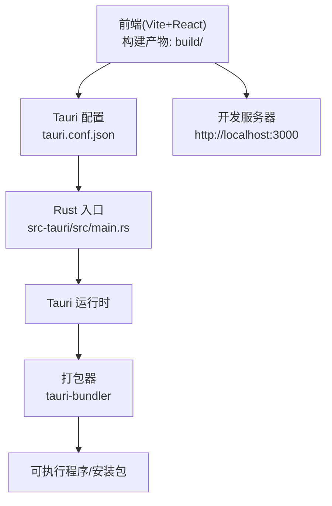
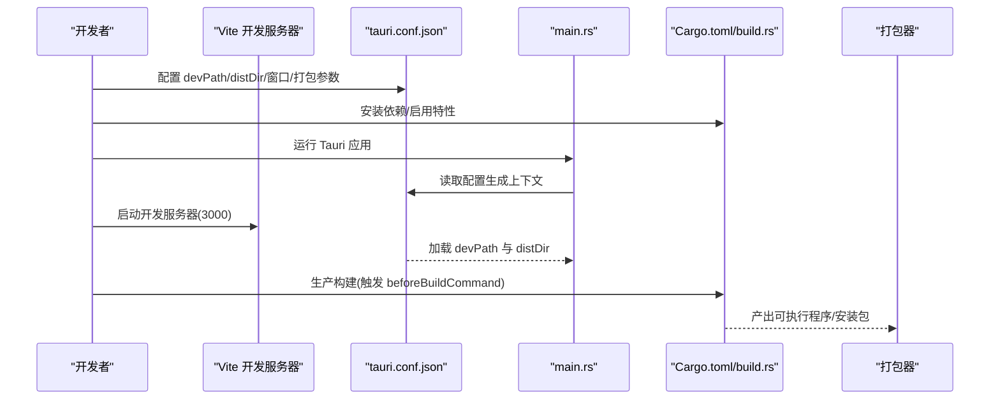
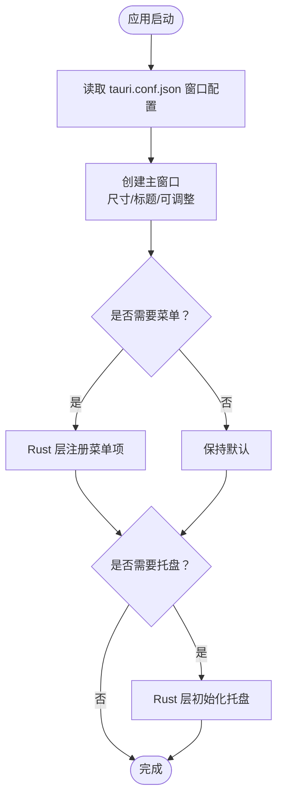
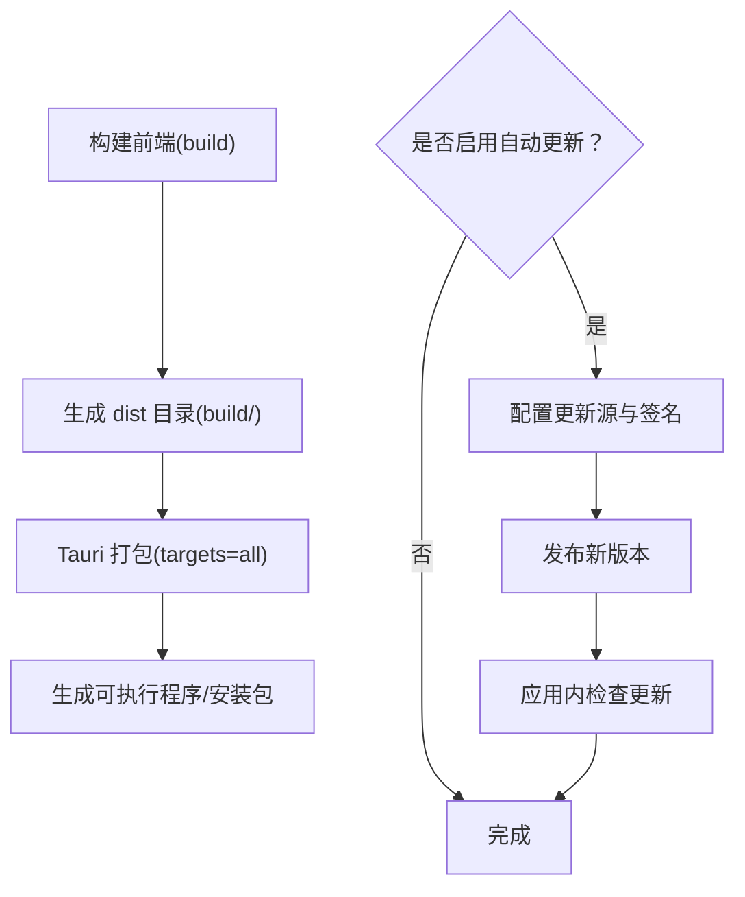
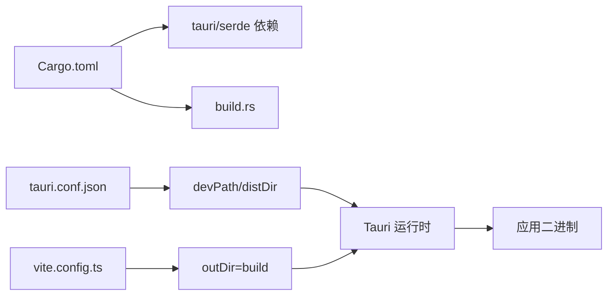

# 桌面应用集成

<cite>
**本文引用的文件**
- [src-tauri/tauri.conf.json](file://src-tauri/tauri.conf.json)
- [src-tauri/Cargo.toml](file://src-tauri/Cargo.toml)
- [src-tauri/src/main.rs](file://src-tauri/src/main.rs)
- [src-tauri/build.rs](file://src-tauri/build.rs)
- [package.json](file://package.json)
- [vite.config.ts](file://vite.config.ts)
- [src/utils/index.ts](file://src/utils/index.ts)
- [src/pages/Typing/index.tsx](file://src/pages/Typing/index.tsx)
- [src/utils/db/index.ts](file://src/utils/db/index.ts)
- [src/utils/db/data-export.ts](file://src/utils/db/data-export.ts)
- [src/constants/index.ts](file://src/constants/index.ts)
</cite>

## 目录

1. [简介](#简介)
2. [项目结构](#项目结构)
3. [核心组件](#核心组件)
4. [架构总览](#架构总览)
5. [详细组件分析](#详细组件分析)
6. [依赖关系分析](#依赖关系分析)
7. [性能考虑](#性能考虑)
8. [故障排查指南](#故障排查指南)
9. [结论](#结论)
10. [附录](#附录)

## 简介

本文件面向桌面应用集成场景，围绕基于 Tauri 的桌面端实现进行系统化技术说明。内容涵盖配置文件设置、原生能力调用与跨平台兼容性、窗口管理与菜单系统、系统托盘、文件系统访问、剪贴板与系统通知、打包发布与自动更新、安全权限管理、性能优化与用户体验设计，以及扩展与平台优化建议。本文所有技术要点均以仓库现有文件为依据，并通过图示与来源标注帮助读者快速定位实现位置。

## 项目结构

该项目采用“前端（Vite + React）+ 桌面壳（Tauri）”的混合架构：

- 前端工程位于根目录，构建产物输出至 build 目录；
- Tauri 桌面壳位于 src-tauri，包含 Rust 入口、构建脚本与配置；
- 打包与开发流程通过 tauri.conf.json 配置 devPath 与 distDir，使 Tauri 在开发模式下加载本地 Vite 服务，在生产模式下加载构建产物。

图表来源

- [src-tauri/tauri.conf.json](file://src-tauri/tauri.conf.json#L1-L60)
- [src-tauri/src/main.rs](file://src-tauri/src/main.rs#L1-L9)
- [package.json](file://package.json#L60-L70)
- [vite.config.ts](file://vite.config.ts#L31-L35)

章节来源

- [src-tauri/tauri.conf.json](file://src-tauri/tauri.conf.json#L1-L60)
- [src-tauri/src/main.rs](file://src-tauri/src/main.rs#L1-L9)
- [package.json](file://package.json#L60-L70)
- [vite.config.ts](file://vite.config.ts#L31-L35)

## 核心组件

- Tauri 配置与窗口管理
  - 开发与构建路径、产品信息、打包目标、图标、窗口尺寸与标题等在 tauri.conf.json 中集中定义。
  - 窗口初始宽高、是否可调整、标题等在 windows 数组中配置。
- Rust 入口与运行时
  - main.rs 使用默认 Builder 启动应用上下文，配合 tauri.conf.json 完成窗口与权限初始化。
- 构建链路
  - tauri.conf.json 指定 beforeDevCommand 与 beforeBuildCommand；build.rs 调用 tauri_build::build；Cargo.toml 声明 tauri 依赖与自定义协议特性。
- 前端构建与注入
  - vite.config.ts 设置 outDir 为 build，define 注入环境变量，用于区分部署环境与提交哈希。
- 平台检测与桌面适配
  - utils/index.ts 提供 IsDesktop 判断与平台相关常量，Typing 页面在非桌面环境提示使用桌面端或外接键盘。

章节来源

- [src-tauri/tauri.conf.json](file://src-tauri/tauri.conf.json#L1-L60)
- [src-tauri/src/main.rs](file://src-tauri/src/main.rs#L1-L9)
- [src-tauri/build.rs](file://src-tauri/build.rs#L1-L3)
- [src-tauri/Cargo.toml](file://src-tauri/Cargo.toml#L1-L27)
- [vite.config.ts](file://vite.config.ts#L31-L42)
- [src/utils/index.ts](file://src/utils/index.ts#L49-L66)
- [src/pages/Typing/index.tsx](file://src/pages/Typing/index.tsx#L40-L50)

## 架构总览

下图展示从启动到打包的关键流程，映射到实际配置与入口文件：

图表来源

- [src-tauri/tauri.conf.json](file://src-tauri/tauri.conf.json#L1-L60)
- [src-tauri/src/main.rs](file://src-tauri/src/main.rs#L1-L9)
- [src-tauri/build.rs](file://src-tauri/build.rs#L1-L3)
- [src-tauri/Cargo.toml](file://src-tauri/Cargo.toml#L1-L27)
- [package.json](file://package.json#L60-L70)

## 详细组件分析

### 组件 A：窗口管理与菜单系统

- 窗口属性
  - 通过 tauri.conf.json 的 windows 数组设置初始宽高、是否可调整、标题等。
- 菜单系统
  - 当前配置未显式声明菜单项；若需添加系统菜单或上下文菜单，可在 Rust 层通过 Tauri API 动态注册，或在前端通过自定义 UI 实现菜单容器。
- 系统托盘
  - 当前配置未启用托盘；若需托盘功能，可在 Rust 层使用 Tauri 托盘 API 初始化托盘并绑定点击事件，再通过 IPC 与前端交互。

图表来源

- [src-tauri/tauri.conf.json](file://src-tauri/tauri.conf.json#L49-L57)

章节来源

- [src-tauri/tauri.conf.json](file://src-tauri/tauri.conf.json#L49-L57)

### 组件 B：原生功能调用（文件系统、剪贴板、通知）

- 文件系统访问
  - 前端通过 dexie 与 file-saver 在浏览器侧进行数据导出与导入；导出时使用 gzip 压缩并触发下载，导入时通过文件选择器读取压缩文件并解压后导入数据库。
- 剪贴板操作
  - 仓库未直接使用剪贴板 API；若需实现复制/粘贴，可在 Rust 层通过 Tauri clipboard 原生能力暴露给前端。
- 系统通知
  - 仓库未使用系统通知；可通过 Rust 层的 notification 原生能力向用户推送状态提示。

```mermaid
sequenceDiagram
participant UI as "前端 UI"
participant DB as "Dexie 数据库"
participant FS as "文件系统(file-saver)"
participant LZ as "压缩(pako)"
UI->>DB : 导出数据库(进度回调)
DB-->>UI : 返回 Blob
UI->>LZ : gzip 压缩
LZ-->>UI : 返回压缩 Blob
UI->>FS : 触发下载(saveAs)
UI->>UI : 记录导出动作与统计
```

图表来源

- [src/utils/db/data-export.ts](file://src/utils/db/data-export.ts#L1-L32)

章节来源

- [src/utils/db/data-export.ts](file://src/utils/db/data-export.ts#L1-L32)
- [src/utils/db/index.ts](file://src/utils/db/index.ts#L1-L136)

### 组件 C：打包发布与自动更新

- 打包发布
  - tauri.conf.json 的 bundle 字段控制打包目标、图标、标识符、目标平台等；targets 设为 all 表示多平台打包。
- 自动更新
  - 当前 updater.active 为 false；若启用自动更新，需在 tauri.conf.json 中配置更新源与签名信息，并在 Rust 层实现更新逻辑（例如通过 Tauri updater API）。

图表来源

- [src-tauri/tauri.conf.json](file://src-tauri/tauri.conf.json#L16-L41)
- [package.json](file://package.json#L60-L70)
- [vite.config.ts](file://vite.config.ts#L31-L35)

章节来源

- [src-tauri/tauri.conf.json](file://src-tauri/tauri.conf.json#L16-L41)
- [package.json](file://package.json#L60-L70)
- [vite.config.ts](file://vite.config.ts#L31-L35)

### 组件 D：安全权限管理与 CSP

- 权限白名单
  - tauri.allowlist.all 默认关闭，表示默认不开放任何原生命令，需按需开启特定 API。
- 内容安全策略
  - tauri.security.csp 为空，表示未强制 CSP；建议在生产环境设置合理 CSP 以降低 XSS 风险。

章节来源

- [src-tauri/tauri.conf.json](file://src-tauri/tauri.conf.json#L13-L15)
- [src-tauri/tauri.conf.json](file://src-tauri/tauri.conf.json#L43-L45)

### 组件 E：跨平台兼容性处理

- 平台检测
  - utils/index.ts 提供 IsDesktop 与 IS_MAC_OS，用于区分桌面与移动端、以及 macOS 特性（如快捷键组合）。
- 桌面适配
  - Typing 页面在非桌面设备弹窗提示，建议使用桌面端或外接键盘。

章节来源

- [src/utils/index.ts](file://src/utils/index.ts#L49-L66)
- [src/pages/Typing/index.tsx](file://src/pages/Typing/index.tsx#L40-L50)

### 组件 F：性能优化与用户体验设计

- 性能优化
  - vite.config.ts 在生产模式下移除 console 与 debugger，启用最小化与 sourcemap 关闭，减少体积与运行开销。
  - define 注入环境变量，便于在运行时区分部署环境与提交哈希。
- 用户体验
  - constants/index.ts 定义了默认字体大小与装饰效果，Typing 页面提供加载状态与完成后的庆祝反馈。

章节来源

- [vite.config.ts](file://vite.config.ts#L31-L42)
- [vite.config.ts](file://vite.config.ts#L36-L42)
- [src/constants/index.ts](file://src/constants/index.ts#L1-L19)
- [src/pages/Typing/index.tsx](file://src/pages/Typing/index.tsx#L129-L171)

## 依赖关系分析

- Rust 依赖
  - tauri 与 serde 等核心依赖由 Cargo.toml 管理；tauri-build 用于构建期资源处理。
- 前端依赖
  - package.json 管理 React 生态与工具链；scripts 中定义 dev/build 流程。
- 构建耦合
  - tauri.conf.json 的 devPath 与 distDir 与 vite.config.ts 的 outDir 强耦合，确保开发与生产路径一致。

图表来源

- [src-tauri/Cargo.toml](file://src-tauri/Cargo.toml#L1-L27)
- [src-tauri/build.rs](file://src-tauri/build.rs#L1-L3)
- [src-tauri/tauri.conf.json](file://src-tauri/tauri.conf.json#L1-L12)
- [vite.config.ts](file://vite.config.ts#L31-L35)

章节来源

- [src-tauri/Cargo.toml](file://src-tauri/Cargo.toml#L1-L27)
- [src-tauri/tauri.conf.json](file://src-tauri/tauri.conf.json#L1-L12)
- [vite.config.ts](file://vite.config.ts#L31-L35)

## 性能考虑

- 构建阶段
  - 生产构建启用最小化与移除调试语句，有助于减小包体与提升运行时性能。
- 运行阶段
  - 将大型数据导出压缩后再下载，减少网络与存储压力。
- UI 与交互
  - 在完成章节后延迟触发庆祝反馈，避免阻塞主线程。

章节来源

- [vite.config.ts](file://vite.config.ts#L31-L42)
- [src/utils/db/data-export.ts](file://src/utils/db/data-export.ts#L16-L32)
- [src/pages/Typing/index.tsx](file://src/pages/Typing/index.tsx#L129-L171)

## 故障排查指南

- 开发模式无法加载页面
  - 检查 tauri.conf.json 的 devPath 是否指向正确的本地开发服务器地址。
- 生产构建后资源缺失
  - 确认 vite.config.ts 的 outDir 与 tauri.conf.json 的 distDir 一致。
- 打包失败或图标缺失
  - 检查 tauri.conf.json 的 icon 路径与实际图标文件是否存在。
- 权限不足导致功能不可用
  - 若启用特定原生命令，需在 tauri.conf.json 的 allowlist 中显式开启对应 API。

章节来源

- [src-tauri/tauri.conf.json](file://src-tauri/tauri.conf.json#L1-L12)
- [vite.config.ts](file://vite.config.ts#L31-L35)
- [src-tauri/tauri.conf.json](file://src-tauri/tauri.conf.json#L24-L24)

## 结论

本项目已具备完整的 Tauri 桌面应用骨架：前端构建与 Tauri 配置解耦、窗口与打包参数集中管理、权限白名单与 CSP 可控。后续可在 Rust 层扩展菜单、托盘与原生能力（剪贴板、通知），完善自动更新机制，并结合平台差异进行 UI 与交互优化，以达成更佳的桌面体验。

## 附录

- 开发与构建命令
  - 开发：npm/yarn start 或 dev，启动 Vite 开发服务器与 Tauri。
  - 生产：npm/yarn build，生成构建产物后由 Tauri 打包。
- 推荐实践
  - 明确列出需要的原生命令并仅开启必要权限。
  - 在生产环境设置合理的 CSP。
  - 对大文件导出使用压缩与分步进度反馈。
  - 为不同平台提供差异化 UI 与交互细节。

章节来源

- [package.json](file://package.json#L60-L70)
- [src-tauri/tauri.conf.json](file://src-tauri/tauri.conf.json#L1-L12)
- [src/utils/db/data-export.ts](file://src/utils/db/data-export.ts#L16-L32)
