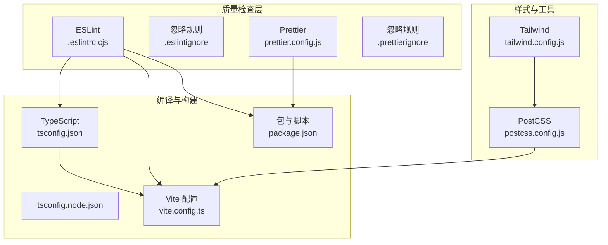
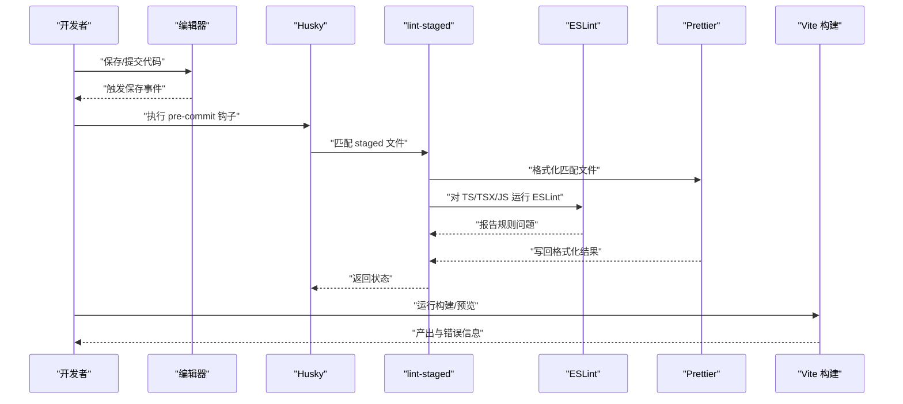
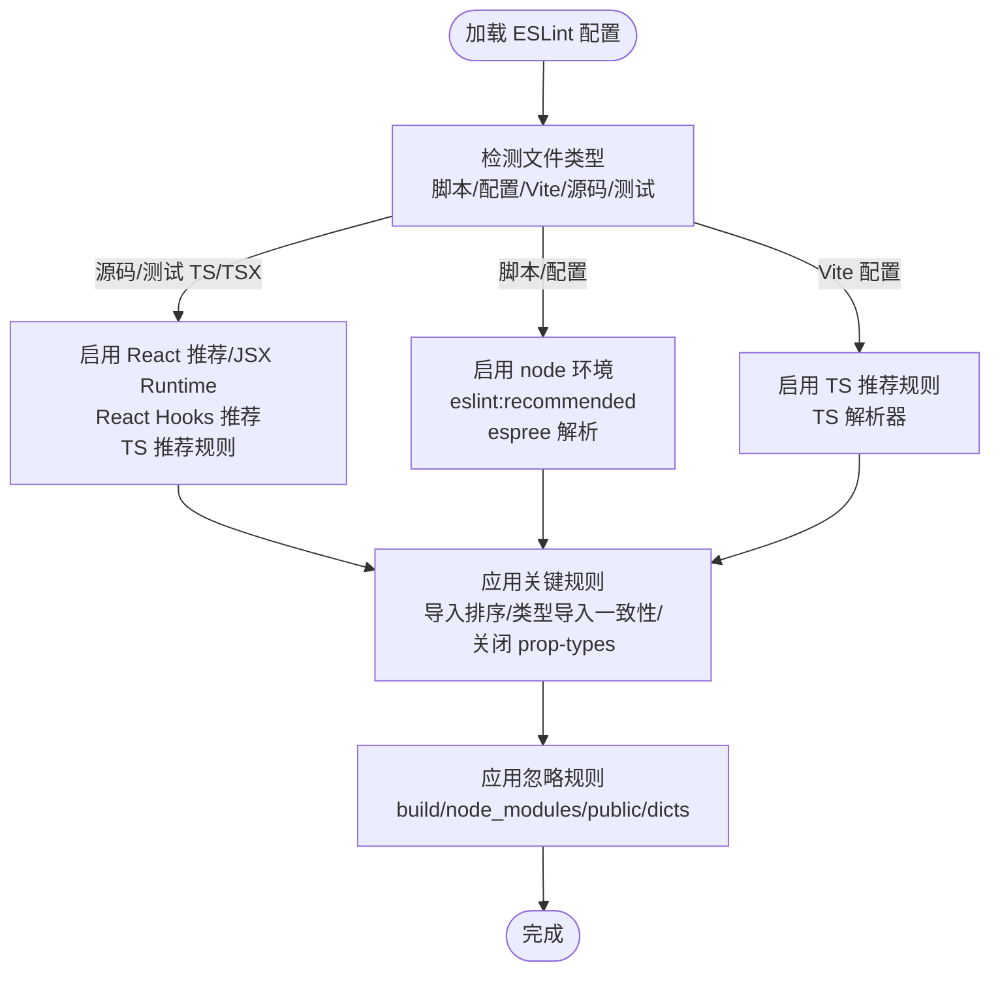
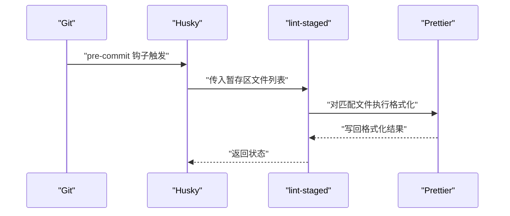
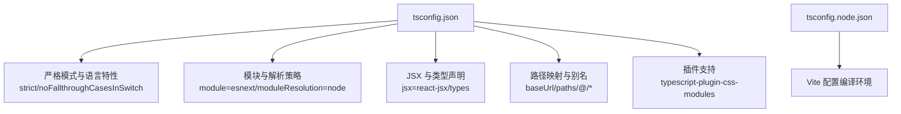
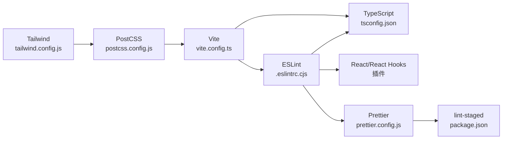

# 代码质量检查

<cite>
**本文引用的文件**
- [.eslintrc.cjs](file://.eslintrc.cjs)
- [.eslintignore](file://.eslintignore)
- [package.json](file://package.json)
- [tsconfig.json](file://tsconfig.json)
- [tsconfig.node.json](file://tsconfig.node.json)
- [vite.config.ts](file://vite.config.ts)
- [tailwind.config.js](file://tailwind.config.js)
- [postcss.config.js](file://postcss.config.js)
- [prettier.config.js](file://prettier.config.js)
- [.prettierignore](file://.preitorignore)
</cite>

## 目录

1. [引言](#引言)
2. [项目结构](#项目结构)
3. [核心组件](#核心组件)
4. [架构总览](#架构总览)
5. [详细组件分析](#详细组件分析)
6. [依赖关系分析](#依赖关系分析)
7. [性能考虑](#性能考虑)
8. [故障排查指南](#故障排查指南)
9. [结论](#结论)
10. [附录](#附录)

## 引言

本文件面向代码质量检查系统，围绕 ESLint 配置与规则、TypeScript 编译配置、Prettier 格式化与集成、以及在开发与 CI 中的质量门禁与流程进行系统化说明。内容覆盖：

- ESLint 规则与插件：包括 TypeScript 类型检查、React 钩子使用规范、代码风格约束等
- Prettier 配置与集成：编辑器自动格式化、提交前格式化（husky + lint-staged）
- TypeScript 编译最佳实践：严格模式、模块解析策略、类型声明管理
- 代码审查清单、质量门禁与持续集成中的质量检查流程
- 常见问题识别与修复建议

## 项目结构

本项目的质量检查体系由以下关键文件构成：

- ESLint 配置与忽略规则：.eslintrc.cjs、.eslintignore
- Prettier 配置与忽略规则：prettier.config.js、.prettierignore
- TypeScript 编译配置：tsconfig.json、tsconfig.node.json
- 构建与脚本：package.json（含 lint、prettier、husky、lint-staged 等）
- CSS 工具链：tailwind.config.js、postcss.config.js
- Vite 配置：vite.config.ts（与 ESLint/TSC/Prettier 协同）

图表来源

- [.eslintrc.cjs](file://.eslintrc.cjs#L1-L58)
- [.eslintignore](file://.eslintignore#L1-L3)
- [prettier.config.js](file://prettier.config.js#L1-L200)
- [.prettierignore](file://.prettierignore#L1-L200)
- [tsconfig.json](file://tsconfig.json#L1-L41)
- [tsconfig.node.json](file://tsconfig.node.json#L1-L10)
- [vite.config.ts](file://vite.config.ts#L1-L55)
- [package.json](file://package.json#L60-L75)
- [tailwind.config.js](file://tailwind.config.js#L1-L78)
- [postcss.config.js](file://postcss.config.js#L1-L7)

章节来源

- [package.json](file://package.json#L60-L75)
- [.eslintrc.cjs](file://.eslintrc.cjs#L1-L58)
- [tsconfig.json](file://tsconfig.json#L1-L41)
- [vite.config.ts](file://vite.config.ts#L1-L55)

## 核心组件

- ESLint 配置与规则
  - 使用扩展集：eslint:recommended、plugin:react/recommended、plugin:react-hooks/recommended、plugin:react/jsx-runtime、plugin:@typescript-eslint/recommended、eslint-config-prettier
  - 覆盖范围：脚本、Vite 配置、源码与测试的 TS/TSX 文件
  - 关键规则：导入排序、类型导入一致性、关闭 React prop-types 校验
- Prettier 配置与集成
  - 通过 husky + lint-staged 在提交前统一格式化
  - 支持排序导入、Tailwind 插件
- TypeScript 编译配置
  - 严格模式开启、模块解析策略、路径映射、JSX 策略、插件支持
- Vite 集成
  - 别名、构建优化、define 注入、CSS Modules 约定

章节来源

- [.eslintrc.cjs](file://.eslintrc.cjs#L1-L58)
- [package.json](file://package.json#L60-L75)
- [tsconfig.json](file://tsconfig.json#L1-L41)
- [vite.config.ts](file://vite.config.ts#L1-L55)

## 架构总览

下图展示从“编辑器保存/提交”到“构建与产出”的质量检查流程：

图表来源

- [package.json](file://package.json#L60-L75)
- [.eslintrc.cjs](file://.eslintrc.cjs#L1-L58)
- [prettier.config.js](file://prettier.config.js#L1-L200)

## 详细组件分析

### ESLint 配置与规则

- 扩展与插件
  - 使用 eslint-config-prettier 关闭与 Prettier 冲突的规则
  - 启用 react、react-hooks、@typescript-eslint 插件
  - 在不同文件组中启用相应扩展与解析器
- 文件覆盖策略
  - 脚本与配置文件：启用 node 环境、推荐规则、espree 解析
  - Vite 配置：启用 TypeScript 推荐规则、TS 解析器
  - 源码与测试 TS/TSX：启用 React 推荐、React Hooks 推荐、JSX Runtime、TS 推荐规则
- 关键规则
  - 导入排序：要求按声明排序，忽略声明排序以减少噪音
  - 类型导入一致性：强制使用 import type 进行类型导入
  - 关闭 prop-types 校验：避免与 TS 类型系统重复校验
- 忽略规则
  - 忽略 build、node_modules、public/dicts 目录

图表来源

- [.eslintrc.cjs](file://.eslintrc.cjs#L1-L58)
- [.eslintignore](file://.eslintignore#L1-L3)

章节来源

- [.eslintrc.cjs](file://.eslintrc.cjs#L1-L58)
- [.eslintignore](file://.eslintignore#L1-L3)

### Prettier 配置与集成

- 配置要点
  - 通过插件支持排序导入与 Tailwind CSS
  - 与 ESLint 结合，关闭冲突规则（由 eslint-config-prettier 提供）
- 集成方式
  - husky 安装后，借助 lint-staged 对暂存区文件执行格式化
  - 匹配范围：src 下 JS/TS/JSX/TSX/JSON/CSS/SCSS/MD
- 忽略规则
  - 通过 .prettierignore 控制不参与格式化的文件或目录

图表来源

- [package.json](file://package.json#L60-L75)
- [.prettierignore](file://.prettierignore#L1-L200)
- [prettier.config.js](file://prettier.config.js#L1-L200)

章节来源

- [package.json](file://package.json#L60-L75)
- [.prettierignore](file://.prettierignore#L1-L200)
- [prettier.config.js](file://prettier.config.js#L1-L200)

### TypeScript 编译配置最佳实践

- 严格模式
  - 启用 strict、noFallthroughCasesInSwitch、forceConsistentCasingInFileNames
- 模块与解析
  - module=esnext、moduleResolution=node、resolveJsonModule=true
- JSX 与类型
  - jsx=react-jsx、types=node、unplugin-icons/types/react
- 路径映射与别名
  - baseUrl=.、paths["@/_":["src/_"]]
- 插件支持
  - 启用 typescript-plugin-css-modules，驼峰转换仅限类名
- Node 环境配置
  - tsconfig.node.json 用于 vite.config.ts 的编译环境

图表来源

- [tsconfig.json](file://tsconfig.json#L1-L41)
- [tsconfig.node.json](file://tsconfig.node.json#L1-L10)

章节来源

- [tsconfig.json](file://tsconfig.json#L1-L41)
- [tsconfig.node.json](file://tsconfig.node.json#L1-L10)

### Vite 集成与质量协同

- 别名与路径
  - define: '@' -> 'src'
- 构建与调试
  - build.outDir=build、minify=true、sourcemap=false
- define 注入
  - REACT_APP_DEPLOY_ENV、LATEST_COMMIT_HASH
- CSS Modules
  - localsConvention=camelCaseOnly

章节来源

- [vite.config.ts](file://vite.config.ts#L1-L55)

### 样式工具链（Tailwind + PostCSS）

- Tailwind 配置
  - content 覆盖 src 与 index.html
  - 主题扩展、动画、过渡、尺寸、分页等
  - 插件：@headlessui/tailwindcss、@tailwindcss/forms、tailwindcss-animate
- PostCSS 配置
  - 启用 tailwindcss 与 autoprefixer

章节来源

- [tailwind.config.js](file://tailwind.config.js#L1-L78)
- [postcss.config.js](file://postcss.config.js#L1-L7)

## 依赖关系分析

- ESLint 与 Prettier
  - 通过 eslint-config-prettier 解除冲突；lint-staged 在提交前统一格式化
- ESLint 与 TypeScript
  - @typescript-eslint/parser 与 plugin:@typescript-eslint/recommended
- ESLint 与 React
  - plugin:react 与 plugin:react-hooks，配合 react/jsx-runtime
- 构建与质量
  - Vite 配置与 tsconfig.json 协同，确保类型与 JSX 行为一致

图表来源

- [.eslintrc.cjs](file://.eslintrc.cjs#L1-L58)
- [prettier.config.js](file://prettier.config.js#L1-L200)
- [tsconfig.json](file://tsconfig.json#L1-L41)
- [vite.config.ts](file://vite.config.ts#L1-L55)
- [tailwind.config.js](file://tailwind.config.js#L1-L78)
- [postcss.config.js](file://postcss.config.js#L1-L7)
- [package.json](file://package.json#L60-L75)

章节来源

- [package.json](file://package.json#L60-L75)
- [.eslintrc.cjs](file://.eslintrc.cjs#L1-L58)
- [prettier.config.js](file://prettier.config.js#L1-L200)
- [tsconfig.json](file://tsconfig.json#L1-L41)
- [vite.config.ts](file://vite.config.ts#L1-L55)
- [tailwind.config.js](file://tailwind.config.js#L1-L78)
- [postcss.config.js](file://postcss.config.js#L1-L7)

## 性能考虑

- 构建阶段
  - 生产环境移除 console 与 debugger，减小体积并提升运行时性能
  - 关闭 sourcemap 以加速构建
- 类型检查
  - 严格模式提升类型安全，但会增加编译时间；可在本地开发适度放宽，CI 中保持严格
- 格式化与校验
  - lint-staged 仅处理暂存区文件，降低提交耗时
- CSS Modules
  - camelCaseOnly 与插件配合，减少样式冲突与选择器复杂度

章节来源

- [vite.config.ts](file://vite.config.ts#L32-L41)
- [tsconfig.json](file://tsconfig.json#L1-L41)
- [package.json](file://package.json#L60-L75)

## 故障排查指南

- ESLint 报错与冲突
  - 若出现与 Prettier 冲突的规则，确认已安装 eslint-config-prettier 并正确扩展
  - 检查文件覆盖范围是否匹配实际文件类型
- Prettier 未生效
  - 确认 husky 已安装且 pre-commit 钩子存在
  - 检查 lint-staged 的匹配规则与 .prettierignore 是否误排除目标文件
- TypeScript 编译错误
  - 严格模式导致的类型不兼容：优先修正类型，必要时在局部使用类型断言
  - 模块解析失败：核对 tsconfig.json 的 baseUrl/paths 与 import 路径
- Vite 构建异常
  - 检查 define 注入的变量是否在运行时可用
  - 确认 CSS Modules 的命名约定与类名使用方式

章节来源

- [package.json](file://package.json#L60-L75)
- [.eslintrc.cjs](file://.eslintrc.cjs#L1-L58)
- [tsconfig.json](file://tsconfig.json#L1-L41)
- [vite.config.ts](file://vite.config.ts#L1-L55)

## 结论

本项目通过 ESLint + Prettier + TypeScript + Vite 的组合，建立了从编辑器保存到提交前的多层质量保障。ESLint 负责规则与类型检查，Prettier 统一风格，TypeScript 提升类型安全，Vite 与构建配置确保产物质量。建议在团队内明确代码审查清单与质量门禁，并在 CI 中保留严格模式与格式化检查，以维持长期可维护性。

## 附录

### 代码审查清单（基于当前配置）

- 代码风格
  - 导入顺序是否符合排序规则
  - 类型导入是否使用 import type
  - 是否存在未使用的 prop-types（已关闭）
- React 规范
  - Hooks 使用是否遵循 React Hooks 规范
  - JSX 语法是否符合 react/jsx-runtime 约定
- TypeScript 规范
  - 严格模式下的类型推导与显式声明是否合理
  - 路径别名与 baseUrl/paths 是否正确
- 格式化与提交
  - 提交前是否通过 lint-staged 与 Prettier 格式化
  - 是否被 .eslintignore/.prettierignore 正确忽略

章节来源

- [.eslintrc.cjs](file://.eslintrc.cjs#L52-L56)
- [tsconfig.json](file://tsconfig.json#L1-L41)
- [package.json](file://package.json#L60-L75)

### 质量门禁与持续集成建议

- 本地
  - 保存即触发 Prettier 格式化（编辑器插件）
  - 提交前通过 husky + lint-staged 格式化与 ESLint 校验
- CI
  - 安装依赖后执行：ESLint 全量检查、Prettier 校验、TypeScript 编译检查
  - 构建阶段启用生产优化（移除 console、关闭 sourcemap）
- 回退策略
  - 对于不可避免的规则例外，使用注释禁用并记录原因

章节来源

- [package.json](file://package.json#L60-L75)
- [vite.config.ts](file://vite.config.ts#L32-L41)
- [.eslintrc.cjs](file://.eslintrc.cjs#L1-L58)
