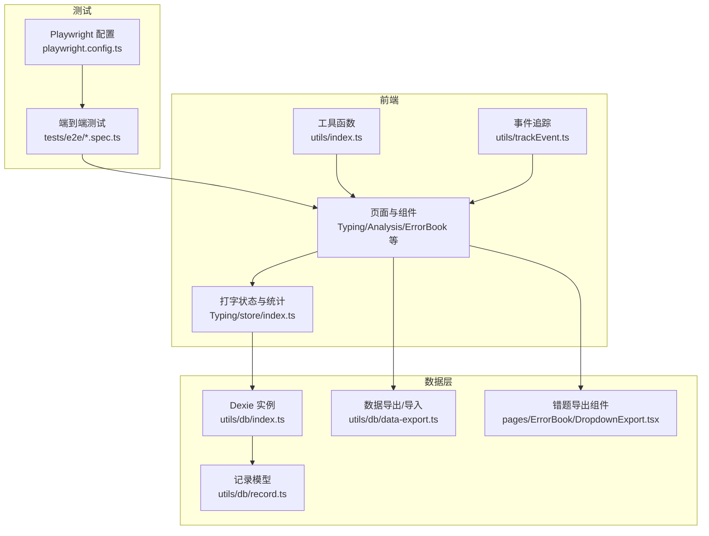
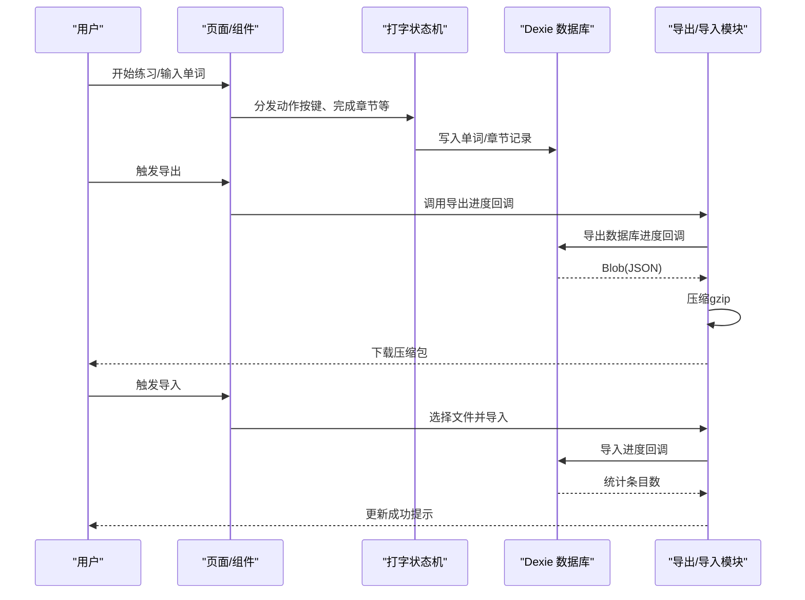
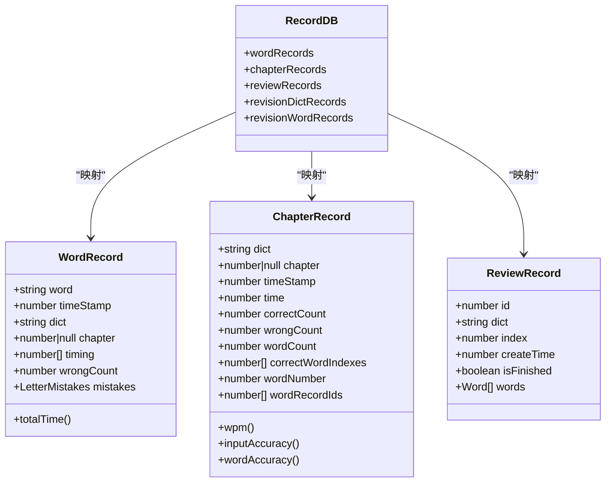
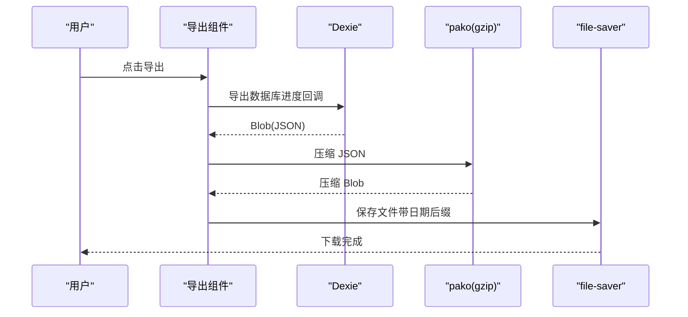
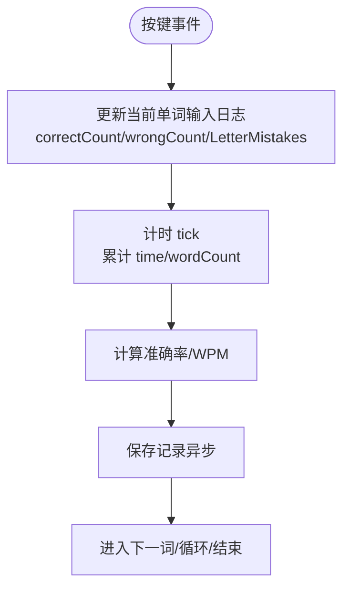
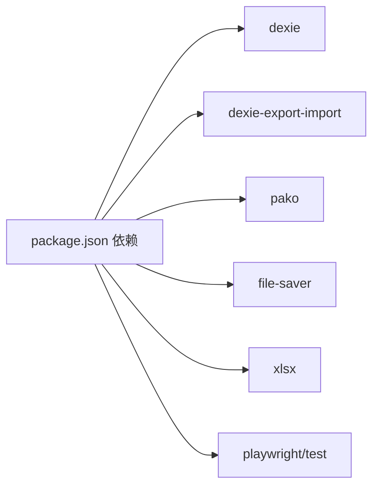

# 性能与安全测试

<cite>
**本文引用的文件**
- [src/utils/db/index.ts](file://src/utils/db/index.ts)
- [src/utils/db/record.ts](file://src/utils/db/record.ts)
- [src/utils/db/data-export.ts](file://src/utils/db/data-export.ts)
- [src/pages/ErrorBook/DropdownExport.tsx](file://src/pages/ErrorBook/DropdownExport.tsx)
- [src/pages/Typing/store/index.ts](file://src/pages/Typing/store/index.ts)
- [src/utils/db/utils.ts](file://src/utils/db/utils.ts)
- [src/utils/index.ts](file://src/utils/index.ts)
- [src/utils/trackEvent.ts](file://src/utils/trackEvent.ts)
- [tests/e2e/practice.spec.ts](file://tests/e2e/practice.spec.ts)
- [tests/e2e/main.spec.ts](file://tests/e2e/main.spec.ts)
- [playwright.config.ts](file://playwright.config.ts)
- [package.json](file://package.json)
</cite>

## 目录

1. [简介](#简介)
2. [项目结构](#项目结构)
3. [核心组件](#核心组件)
4. [架构总览](#架构总览)
5. [详细组件分析](#详细组件分析)
6. [依赖分析](#依赖分析)
7. [性能考虑](#性能考虑)
8. [故障排查指南](#故障排查指南)
9. [结论](#结论)
10. [附录](#附录)

## 简介

本测试文档面向性能与安全测试，聚焦以下目标：

- 数据库性能测试：IndexedDB（Dexie）操作的性能基准、查询优化验证、存储容量测试
- 数据导出功能安全性测试：数据完整性、导出格式正确性、敏感信息保护
- 内存使用监控、垃圾回收测试与大型词库加载的性能评估
- 安全漏洞扫描、SQL 注入防护与 XSS 攻击防范策略
- 性能瓶颈识别、内存泄漏检测与并发访问测试实施方案

## 项目结构

本项目前端基于 React/Vite，使用 Dexie 作为 IndexedDB 封装，提供用户练习记录的持久化与导出能力；同时包含端到端测试（Playwright）与基础工具函数。

图表来源

- [src/pages/Typing/store/index.ts](file://src/pages/Typing/store/index.ts#L1-L227)
- [src/utils/db/index.ts](file://src/utils/db/index.ts#L1-L136)
- [src/utils/db/record.ts](file://src/utils/db/record.ts#L1-L186)
- [src/utils/db/data-export.ts](file://src/utils/db/data-export.ts#L1-L68)
- [src/pages/ErrorBook/DropdownExport.tsx](file://src/pages/ErrorBook/DropdownExport.tsx#L1-L131)
- [tests/e2e/practice.spec.ts](file://tests/e2e/practice.spec.ts#L1-L122)
- [playwright.config.ts](file://playwright.config.ts#L1-L79)

章节来源

- [src/utils/db/index.ts](file://src/utils/db/index.ts#L1-L136)
- [src/utils/db/record.ts](file://src/utils/db/record.ts#L1-L186)
- [src/utils/db/data-export.ts](file://src/utils/db/data-export.ts#L1-L68)
- [src/pages/ErrorBook/DropdownExport.tsx](file://src/pages/ErrorBook/DropdownExport.tsx#L1-L131)
- [src/pages/Typing/store/index.ts](file://src/pages/Typing/store/index.ts#L1-L227)
- [tests/e2e/practice.spec.ts](file://tests/e2e/practice.spec.ts#L1-L122)
- [playwright.config.ts](file://playwright.config.ts#L1-L79)

## 核心组件

- 数据库与记录模型
  - Dexie 实例与版本迁移、表结构定义与映射类
  - 记录模型：单词记录、章节记录、复习记录等
- 导出与导入
  - 数据库导出（压缩、命名、进度回调）、导入（解压、进度回调）
  - 错题导出（Excel/CSV/TXT），并行拉取词典数据
- 打字状态与统计
  - 状态机驱动的计时、正确率、WPM 计算与输入日志合并
- 工具与追踪
  - 时间戳、日期格式化、平台判断、事件追踪

章节来源

- [src/utils/db/index.ts](file://src/utils/db/index.ts#L1-L136)
- [src/utils/db/record.ts](file://src/utils/db/record.ts#L1-L186)
- [src/utils/db/data-export.ts](file://src/utils/db/data-export.ts#L1-L68)
- [src/pages/ErrorBook/DropdownExport.tsx](file://src/pages/ErrorBook/DropdownExport.tsx#L1-L131)
- [src/pages/Typing/store/index.ts](file://src/pages/Typing/store/index.ts#L1-L227)
- [src/utils/db/utils.ts](file://src/utils/db/utils.ts#L1-L18)
- [src/utils/index.ts](file://src/utils/index.ts#L1-L130)
- [src/utils/trackEvent.ts](file://src/utils/trackEvent.ts#L1-L17)

## 架构总览

下图展示从用户交互到数据库写入、再到导出与导入的关键流程。

图表来源

- [src/pages/Typing/store/index.ts](file://src/pages/Typing/store/index.ts#L1-L227)
- [src/utils/db/index.ts](file://src/utils/db/index.ts#L1-L136)
- [src/utils/db/data-export.ts](file://src/utils/db/data-export.ts#L1-L68)

## 详细组件分析

### 数据库与记录模型（IndexedDB 性能与结构）

- 表结构与索引
  - wordRecords：主键自增、时间戳、词典与章节组合索引
  - chapterRecords：主键自增、时间戳、词典与章节组合索引
  - reviewRecords：复习进度与完成状态
- 记录类与派生指标
  - 单词记录含逐字母耗时数组，支持总耗时计算
  - 章节记录含 WPM、输入准确率、单词准确率等派生指标
- 写入路径
  - 打字状态机在按键与完成章节时调用保存函数，写入 IndexedDB
  - 异步写入并回填记录 ID，避免阻塞 UI

图表来源

- [src/utils/db/index.ts](file://src/utils/db/index.ts#L1-L136)
- [src/utils/db/record.ts](file://src/utils/db/record.ts#L1-L186)

章节来源

- [src/utils/db/index.ts](file://src/utils/db/index.ts#L1-L136)
- [src/utils/db/record.ts](file://src/utils/db/record.ts#L1-L186)

### 数据导出功能（安全与完整性）

- 数据库导出
  - 使用 dexie-export-import 导出 JSON，进度回调用于 UI 展示
  - 使用 pako gzip 压缩，file-saver 下载，记录导出大小与条目数
- 错题导出
  - 并行拉取词典数据，拼接释义，生成 Excel/CSV/TXT
  - 使用 file-saver 保存，带时间戳文件名
- 安全要点
  - 导出内容不包含敏感字段（如时间戳、内部 ID 等），仅保留必要列
  - 导入采用 clearTablesBeforeImport、overwriteValues 等选项，避免污染现有数据
  - 导入过程严格限制文件类型（.gz）

图表来源

- [src/utils/db/data-export.ts](file://src/utils/db/data-export.ts#L1-L68)
- [src/pages/ErrorBook/DropdownExport.tsx](file://src/pages/ErrorBook/DropdownExport.tsx#L1-L131)

章节来源

- [src/utils/db/data-export.ts](file://src/utils/db/data-export.ts#L1-L68)
- [src/pages/ErrorBook/DropdownExport.tsx](file://src/pages/ErrorBook/DropdownExport.tsx#L1-L131)

### 打字状态与统计（性能与内存）

- 状态机
  - 结构化克隆初始化章节，避免共享引用引发的深拷贝成本
  - 输入日志按单词维度维护，减少全局状态膨胀
- 统计指标
  - 正确/错误计数、WPM、准确率在每次计时 tick 中更新
- 合并错误日志
  - 使用工具函数合并每词错误映射，避免重复构造对象

图表来源

- [src/pages/Typing/store/index.ts](file://src/pages/Typing/store/index.ts#L1-L227)
- [src/utils/db/utils.ts](file://src/utils/db/utils.ts#L1-L18)

章节来源

- [src/pages/Typing/store/index.ts](file://src/pages/Typing/store/index.ts#L1-L227)
- [src/utils/db/utils.ts](file://src/utils/db/utils.ts#L1-L18)

### 大型词库加载与性能评估

- 并行拉取词典数据，使用 Map 缓存结果，避免重复请求
- 导出时根据词典 URL 去重，降低网络与解析开销
- 建议在测试中对比不同并发度下的首屏渲染与导出耗时

章节来源

- [src/pages/ErrorBook/DropdownExport.tsx](file://src/pages/ErrorBook/DropdownExport.tsx#L1-L131)

## 依赖分析

- 数据库与导出
  - dexie、dexie-export-import、pako、file-saver
- 导出格式
  - xlsx（生成 Excel/CSV）
- 端到端测试
  - Playwright（多浏览器、报告器、超时配置）

图表来源

- [package.json](file://package.json#L1-L128)

章节来源

- [package.json](file://package.json#L1-L128)
- [playwright.config.ts](file://playwright.config.ts#L1-L79)

## 性能考虑

- IndexedDB 性能基准
  - 基准测试建议：固定词长与章节长度，测量写入延迟、事务吞吐、查询耗时
  - 关键指标：单条写入耗时、批量写入吞吐、索引查找耗时、分页查询延迟
- 查询优化验证
  - 验证组合索引 [dict+chapter] 的命中情况，避免全表扫描
  - 对 reviewRecords 的 dict 字段建立查询路径，确保排序与过滤高效
- 存储容量测试
  - 逐步注入大量记录，观察 IndexedDB 存储上限、清理策略与性能退化点
- 内存使用与 GC
  - 使用浏览器性能面板监控主线程卡顿、堆内存峰值与 GC 频率
  - 避免在 reducer 中产生大对象快照，优先局部更新
- 大型词库加载
  - 控制并发拉取数量，设置超时与重试，记录首包与全量加载时间
- 并发访问测试
  - 模拟多标签页/多窗口同时写入，验证冲突与锁竞争
  - 使用 Playwright 并行项目覆盖主流浏览器

章节来源

- [src/utils/db/index.ts](file://src/utils/db/index.ts#L1-L136)
- [src/pages/Typing/store/index.ts](file://src/pages/Typing/store/index.ts#L1-L227)
- [playwright.config.ts](file://playwright.config.ts#L1-L79)

## 故障排查指南

- 导出失败
  - 检查进度回调返回值与文件类型限制，确认 gzip 解压与 Blob 转换
  - 若下载为空，核对导出前后的计数统计
- 导入异常
  - 确认 acceptVersionDiff/acceptMissingTables 等导入策略
  - 校验 clearTablesBeforeImport 与 overwriteValues 的影响
- 错题导出空白
  - 核查词典 URL 去重与并行拉取逻辑，确保字典数据可用
- 性能问题
  - 使用性能面板定位主线程阻塞点，检查 reducer 中的深拷贝与对象合并
  - 关注打包体积与可视化工具（rollup-plugin-visualizer）分析依赖

章节来源

- [src/utils/db/data-export.ts](file://src/utils/db/data-export.ts#L1-L68)
- [src/pages/ErrorBook/DropdownExport.tsx](file://src/pages/ErrorBook/DropdownExport.tsx#L1-L131)
- [src/pages/Typing/store/index.ts](file://src/pages/Typing/store/index.ts#L1-L227)

## 结论

通过结构化的数据库性能测试、导出导入的安全性验证以及内存与并发的系统性评估，可有效提升应用稳定性与用户体验。建议在持续集成中引入端到端测试与性能回归基线，确保变更不会引入性能退化或安全风险。

## 附录

### 测试策略清单

- 数据库性能
  - 基准：固定样本量写入/读取，记录耗时分布
  - 优化：组合索引命中率、事务批大小对吞吐的影响
  - 容量：存储上限、碎片整理与清理策略
- 导出安全
  - 完整性：校验导出前后条目数与大小
  - 格式：xlsx/csv/txt 一致性与编码
  - 敏感信息：确认无内部 ID、时间戳等敏感字段
- 内存与 GC
  - 监控：堆快照、GC 频率、主线程卡顿
  - 优化：减少对象快照、合并日志、控制并发
- 并发与稳定性
  - 多标签/多窗口并发写入
  - 端到端跨浏览器验证

### 端到端测试参考

- 页面标题与交互验证
- 练习流程：正确/错误输入、颜色反馈、章节切换
- 导出流程：导出按钮可用性、文件命名、下载触发

章节来源

- [tests/e2e/main.spec.ts](file://tests/e2e/main.spec.ts#L1-L16)
- [tests/e2e/practice.spec.ts](file://tests/e2e/practice.spec.ts#L1-L122)
