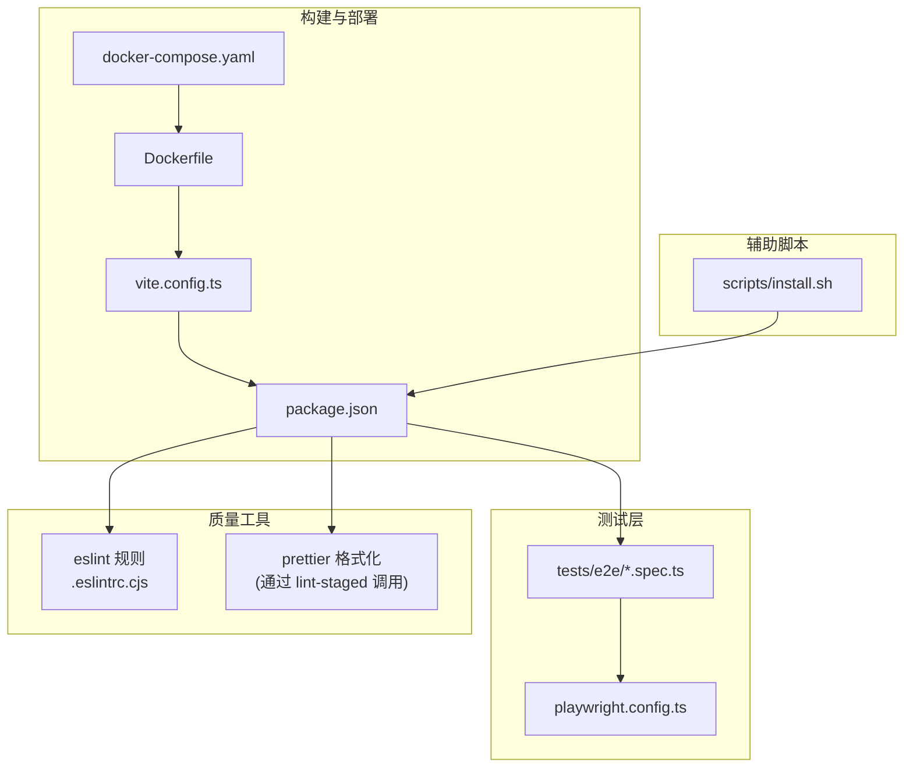
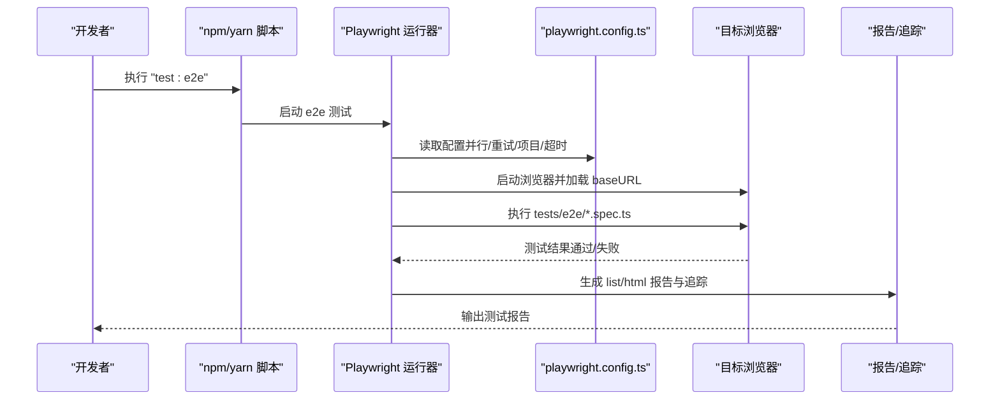
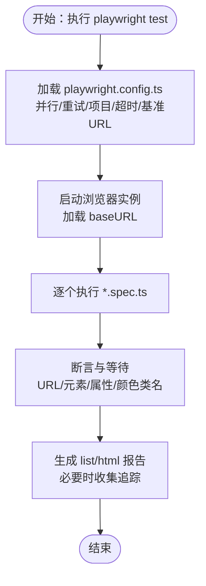
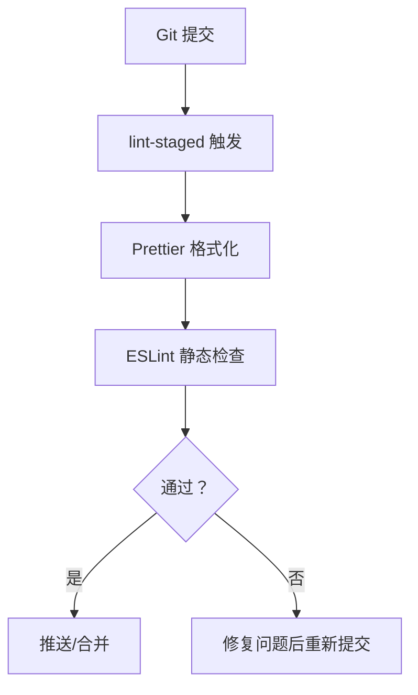
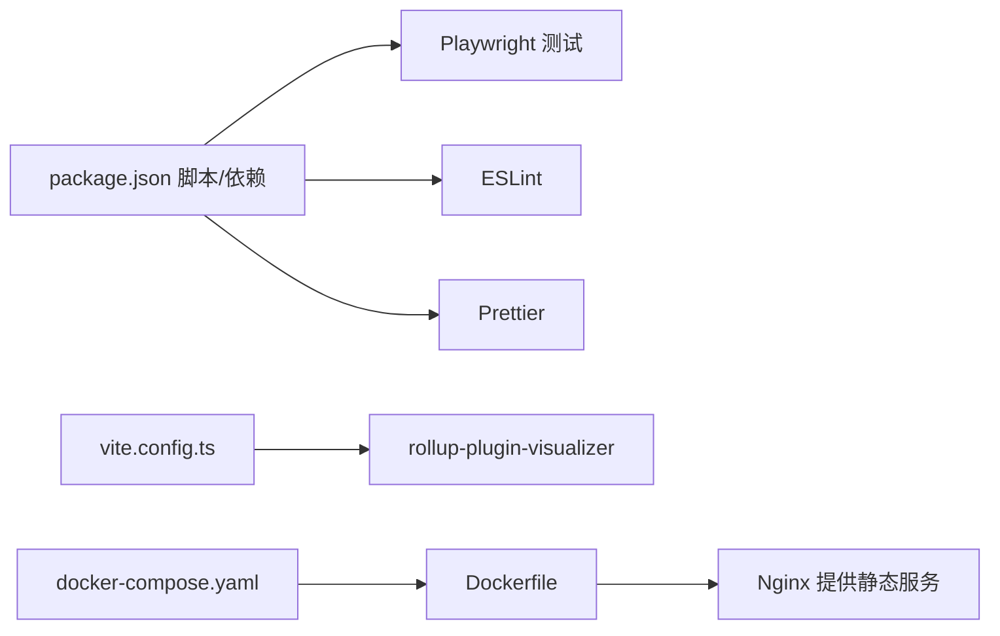

# 测试与质量保证

<cite>
**本文引用的文件**
- [package.json](file://package.json)
- [playwright.config.ts](file://playwright.config.ts)
- [.eslintrc.cjs](file://.eslintrc.cjs)
- [tests/e2e/main.spec.ts](file://tests/e2e/main.spec.ts)
- [tests/e2e/dictionary.spec.ts](file://tests/e2e/dictionary.spec.ts)
- [tests/e2e/practice.spec.ts](file://tests/e2e/practice.spec.ts)
- [tests/e2e/theme.spec.ts](file://tests/e2e/theme.spec.ts)
- [tests/e2e/practice-list.spec.ts](file://tests/e2e/practice-list.spec.ts)
- [vite.config.ts](file://vite.config.ts)
- [Dockerfile](file://Dockerfile)
- [docker-compose.yaml](file://docker-compose.yaml)
- [scripts/install.sh](file://scripts/install.sh)
</cite>

## 目录

1. [引言](#引言)
2. [项目结构](#项目结构)
3. [核心组件](#核心组件)
4. [架构总览](#架构总览)
5. [详细组件分析](#详细组件分析)
6. [依赖分析](#依赖分析)
7. [性能考虑](#性能考虑)
8. [故障排查指南](#故障排查指南)
9. [结论](#结论)
10. [附录](#附录)

## 引言

本文件面向测试与质量保证体系，围绕端到端测试（Playwright）、代码质量检查（ESLint/Prettier）、测试数据与环境管理、以及持续集成与部署流程，提供可操作的策略与最佳实践。文档同时覆盖性能、安全与兼容性测试建议，并给出调试与排障方法，帮助开发者在不同阶段高效保障质量。

## 项目结构

本项目的测试与质量相关文件主要分布在以下位置：

- 端到端测试：tests/e2e 下的多个 spec 文件
- 测试运行配置：playwright.config.ts
- 代码质量配置：.eslintrc.cjs
- 构建与可视化：vite.config.ts
- 部署与容器化：Dockerfile、docker-compose.yaml
- 安装与预检脚本：scripts/install.sh
- 包管理与脚本：package.json

图表来源

- [playwright.config.ts](file://playwright.config.ts#L1-L79)
- [.eslintrc.cjs](file://.eslintrc.cjs#L1-L58)
- [vite.config.ts](file://vite.config.ts#L1-L55)
- [Dockerfile](file://Dockerfile#L1-L15)
- [docker-compose.yaml](file://docker-compose.yaml#L1-L10)
- [package.json](file://package.json#L60-L68)
- [scripts/install.sh](file://scripts/install.sh#L1-L28)

章节来源

- [package.json](file://package.json#L60-L68)
- [playwright.config.ts](file://playwright.config.ts#L1-L79)
- [.eslintrc.cjs](file://.eslintrc.cjs#L1-L58)
- [vite.config.ts](file://vite.config.ts#L1-L55)
- [Dockerfile](file://Dockerfile#L1-L15)
- [docker-compose.yaml](file://docker-compose.yaml#L1-L10)
- [scripts/install.sh](file://scripts/install.sh#L1-L28)

## 核心组件

- 端到端测试框架：Playwright，支持多浏览器并行执行、重试策略、HTML 报告与首次失败追踪。
- 代码质量工具链：ESLint（含 React/TypeScript 插件）+ Prettier（通过 lint-staged 在提交前格式化）。
- 构建与可视化：Vite 配置包含 rollup 可视化插件，便于分析包体构成。
- 部署与容器化：基于 Node 构建后由 Nginx 提供静态服务，docker-compose 暴露端口。
- 安装与预检：install.sh 自动检测 Node 并安装依赖，随后启动开发服务器。

章节来源

- [package.json](file://package.json#L60-L68)
- [playwright.config.ts](file://playwright.config.ts#L1-L79)
- [.eslintrc.cjs](file://.eslintrc.cjs#L1-L58)
- [vite.config.ts](file://vite.config.ts#L1-L55)
- [Dockerfile](file://Dockerfile#L1-L15)
- [docker-compose.yaml](file://docker-compose.yaml#L1-L10)
- [scripts/install.sh](file://scripts/install.sh#L1-L28)

## 架构总览

下图展示了从“测试命令”到“浏览器执行与报告输出”的整体流程，以及质量工具在提交前的介入点。

图表来源

- [package.json](file://package.json#L60-L68)
- [playwright.config.ts](file://playwright.config.ts#L1-L79)
- [tests/e2e/main.spec.ts](file://tests/e2e/main.spec.ts#L1-L16)
- [tests/e2e/dictionary.spec.ts](file://tests/e2e/dictionary.spec.ts#L1-L91)
- [tests/e2e/practice.spec.ts](file://tests/e2e/practice.spec.ts#L1-L122)
- [tests/e2e/theme.spec.ts](file://tests/e2e/theme.spec.ts#L1-L25)
- [tests/e2e/practice-list.spec.ts](file://tests/e2e/practice-list.spec.ts#L1-L27)

## 详细组件分析

### 端到端测试实现策略

- 测试范围与用例设计
  - 主页标题校验、词典管理（语言/分类/字典/章节切换）、练习流程（按键触发、正确/错误反馈颜色、章节通关）、主题切换、练习列表交互等。
  - 建议补充：为每个页面/功能模块建立独立的 describe 分组；为关键交互增加断言点（如 URL 变化、元素可见性、属性变化）。
- 自动化测试流程
  - 使用 Playwright 的并行执行与重试机制，CI 环境启用最多两次重试；首次失败收集追踪信息，便于定位问题。
  - 基准 URL 指向线上域名，便于在不同环境验证一致性。
- 测试数据管理
  - 当前测试以真实数据驱动（如字典名称、章节标题），建议引入“稳定快照”与“最小化示例数据集”，在 CI 中使用只读数据源，避免外部依赖波动影响稳定性。
- 可视化回归
  - 示例中已预留截图对比注释，可在更新基线前进行视觉回归比对，建议在 CI 中自动上传/比较截图。

图表来源

- [playwright.config.ts](file://playwright.config.ts#L1-L79)
- [tests/e2e/main.spec.ts](file://tests/e2e/main.spec.ts#L1-L16)
- [tests/e2e/dictionary.spec.ts](file://tests/e2e/dictionary.spec.ts#L1-L91)
- [tests/e2e/practice.spec.ts](file://tests/e2e/practice.spec.ts#L1-L122)
- [tests/e2e/theme.spec.ts](file://tests/e2e/theme.spec.ts#L1-L25)
- [tests/e2e/practice-list.spec.ts](file://tests/e2e/practice-list.spec.ts#L1-L27)

章节来源

- [playwright.config.ts](file://playwright.config.ts#L1-L79)
- [tests/e2e/main.spec.ts](file://tests/e2e/main.spec.ts#L1-L16)
- [tests/e2e/dictionary.spec.ts](file://tests/e2e/dictionary.spec.ts#L1-L91)
- [tests/e2e/practice.spec.ts](file://tests/e2e/practice.spec.ts#L1-L122)
- [tests/e2e/theme.spec.ts](file://tests/e2e/theme.spec.ts#L1-L25)
- [tests/e2e/practice-list.spec.ts](file://tests/e2e/practice-list.spec.ts#L1-L27)

### 代码质量检查工具配置与使用

- ESLint 规则
  - 采用“prettier”扩展，结合 react、react-hooks、@typescript-eslint 等插件，覆盖推荐规则与类型导入规范。
  - 对特定文件（如 vite.config.ts、脚本）单独设置解析器与插件，确保配置一致性。
- 代码格式化
  - 通过 lint-staged 在提交前对变更文件执行 Prettier 写回，减少 CI 期间格式化冲突。
- 静态分析
  - 建议在 CI 中加入“lint”步骤，统一在本地与流水线执行，确保风格一致与潜在问题早发现。

图表来源

- [.eslintrc.cjs](file://.eslintrc.cjs#L1-L58)
- [package.json](file://package.json#L70-L74)

章节来源

- [.eslintrc.cjs](file://.eslintrc.cjs#L1-L58)
- [package.json](file://package.json#L70-L74)

### 单元测试编写方法、覆盖率与持续集成

- 编写方法
  - 建议针对组件逻辑、工具函数与 hooks 使用单元测试；优先断言边界条件、异步行为与副作用清理。
- 覆盖率要求
  - 建议设置阈值（如语句/分支/函数/行均不低于 80%），并在 CI 中失败阈值未达标时阻止合并。
- 持续集成
  - 在 CI 中顺序执行：安装依赖 → 构建 → Lint → 单测（带覆盖率）→ E2E → 部署预览或产物发布。

[本节为通用实践建议，不直接分析具体文件，故无章节来源]

### 性能测试、安全测试与兼容性测试

- 性能测试
  - 关键页面首屏时间、交互延迟与内存占用：建议使用 Lighthouse 或自定义基准脚本，在 CI 中定期运行并记录趋势。
- 安全测试
  - 输入校验、XSS 防护、HTTPS 强制与 CSP 策略：建议在构建阶段注入安全头，在 E2E 中验证关键交互的安全性。
- 兼容性测试
  - 多浏览器（Chrome/Firefox/Safari）与移动端 viewport：当前 Playwright 已配置多项目，建议在 CI 中固定并行度并在失败时保留追踪。

[本节为通用实践建议，不直接分析具体文件，故无章节来源]

### 测试环境搭建、调试与问题排查

- 环境搭建
  - 使用安装脚本一键安装 Node 与依赖，随后启动开发服务器；也可通过 docker-compose 快速拉起服务。
- 调试
  - Playwright 支持首次重试时生成追踪；建议在本地使用 headless:false 与慢动作调试，逐步缩小问题范围。
- 排查
  - 若测试不稳定，优先检查网络依赖（如基准 URL）、浏览器版本差异与页面元素选择器稳定性；必要时引入“稳定选择器”与“等待策略”。

章节来源

- [scripts/install.sh](file://scripts/install.sh#L1-L28)
- [docker-compose.yaml](file://docker-compose.yaml#L1-L10)
- [playwright.config.ts](file://playwright.config.ts#L1-L79)

## 依赖分析

- 测试依赖
  - Playwright 作为端到端测试框架，配合多浏览器项目配置；测试脚本通过 npm/yarn 调用。
- 质量依赖
  - ESLint 与 Prettier 通过插件生态实现规则与格式化；lint-staged 在提交前拦截。
- 构建与可视化
  - Vite 配置启用 rollup 可视化插件，便于分析打包体积与依赖关系。
- 部署依赖
  - Dockerfile 基于 Node 构建，Nginx 提供静态服务；docker-compose 暴露端口便于本地联调。

图表来源

- [package.json](file://package.json#L60-L68)
- [vite.config.ts](file://vite.config.ts#L1-L55)
- [Dockerfile](file://Dockerfile#L1-L15)
- [docker-compose.yaml](file://docker-compose.yaml#L1-L10)

章节来源

- [package.json](file://package.json#L60-L68)
- [vite.config.ts](file://vite.config.ts#L1-L55)
- [Dockerfile](file://Dockerfile#L1-L15)
- [docker-compose.yaml](file://docker-compose.yaml#L1-L10)

## 性能考虑

- 构建优化
  - 生产构建启用压缩与移除 console/debugger，有助于减小体积与提升加载速度。
- 包体分析
  - 使用可视化插件输出包体报告，识别大体积依赖并制定拆分或替换策略。
- 测试性能
  - 在 CI 中限制并行度与重试次数，平衡稳定性与耗时；本地开发使用并行与缓存加速。

章节来源

- [vite.config.ts](file://vite.config.ts#L31-L42)
- [vite.config.ts](file://vite.config.ts#L18-L21)

## 故障排查指南

- 端到端测试失败
  - 检查基准 URL 是否可达、浏览器驱动版本是否匹配、元素选择器是否稳定；利用追踪报告定位失败步骤。
- 代码质量检查失败
  - 在本地先执行“lint”与“prettier”修复，再提交；确保 CI 环境与本地工具版本一致。
- 构建/部署异常
  - 查看 Docker 构建日志与 Nginx 配置；确认端口映射与静态资源路径；使用 docker-compose 验证本地可用性。
- 安装问题
  - 使用 install.sh 自动检测 Node 并安装依赖；若失败，手动安装 Node 并更换镜像源后重试。

章节来源

- [playwright.config.ts](file://playwright.config.ts#L1-L79)
- [.eslintrc.cjs](file://.eslintrc.cjs#L1-L58)
- [Dockerfile](file://Dockerfile#L1-L15)
- [docker-compose.yaml](file://docker-compose.yaml#L1-L10)
- [scripts/install.sh](file://scripts/install.sh#L1-L28)

## 结论

本项目已具备完善的端到端测试与代码质量工具链基础：Playwright 多浏览器并行、ESLint/Prettier 提交前拦截、Vite 可视化与 Docker/Nginx 部署。建议在现有基础上补充单元测试覆盖率、性能与安全基线、移动端与品牌浏览器专项验证，并在 CI 中固化流程，形成闭环的质量保障体系。

## 附录

- 常用命令
  - 运行端到端测试：参见脚本定义
  - 代码质量检查：参见脚本定义
  - 启动开发服务器：参见脚本定义
- 最佳实践清单
  - 为每个重要页面/功能编写 E2E 用例并维护稳定选择器
  - 在 CI 中强制执行 Lint 与单测覆盖率
  - 使用追踪与报告定位失败根因
  - 定期分析包体与性能指标，优化体积与交互体验

章节来源

- [package.json](file://package.json#L60-L68)
