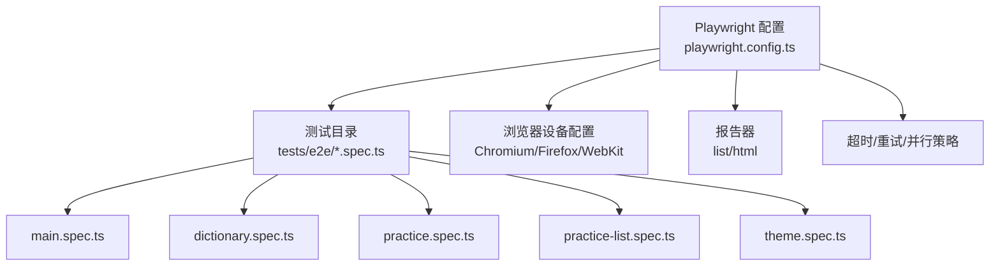
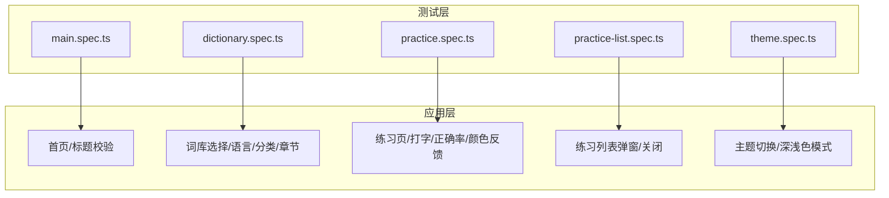
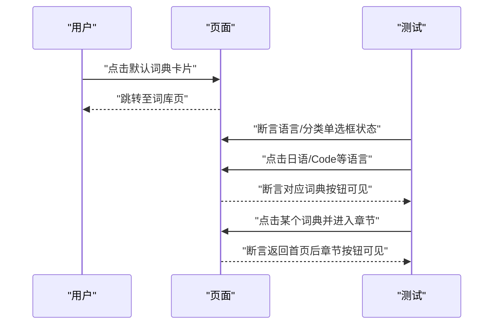
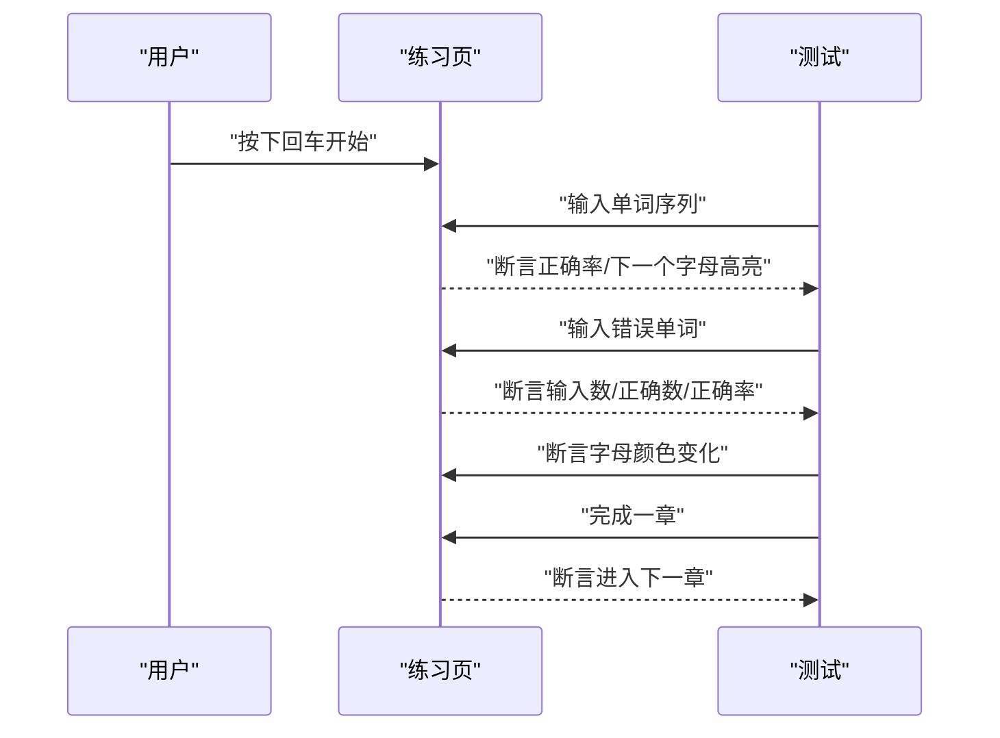
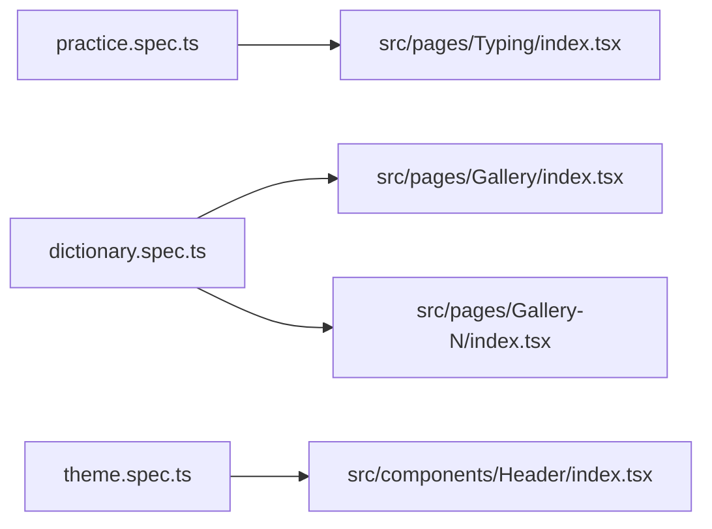
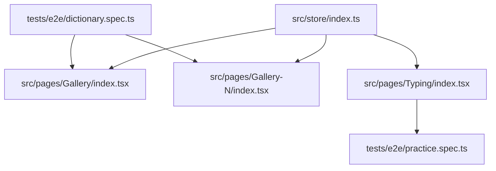

# 端到端测试实现

<cite>
**本文引用的文件**
- [playwright.config.ts](file://playwright.config.ts)
- [package.json](file://package.json)
- [tests/e2e/main.spec.ts](file://tests/e2e/main.spec.ts)
- [tests/e2e/dictionary.spec.ts](file://tests/e2e/dictionary.spec.ts)
- [tests/e2e/practice.spec.ts](file://tests/e2e/practice.spec.ts)
- [tests/e2e/practice-list.spec.ts](file://tests/e2e/practice-list.spec.ts)
- [tests/e2e/theme.spec.ts](file://tests/e2e/theme.spec.ts)
- [src/pages/Typing/index.tsx](file://src/pages/Typing/index.tsx)
- [src/pages/Gallery/index.tsx](file://src/pages/Gallery/index.tsx)
- [src/pages/Gallery-N/index.tsx](file://src/pages/Gallery-N/index.tsx)
- [src/components/Header/index.tsx](file://src/components/Header/index.tsx)
- [src/store/index.ts](file://src/store/index.ts)
</cite>

## 目录

1. [引言](#引言)
2. [项目结构](#项目结构)
3. [核心组件](#核心组件)
4. [架构总览](#架构总览)
5. [详细组件分析](#详细组件分析)
6. [依赖分析](#依赖分析)
7. [性能考虑](#性能考虑)
8. [故障排查指南](#故障排查指南)
9. [结论](#结论)
10. [附录](#附录)

## 引言

本文件面向端到端测试实现，围绕 Playwright 测试框架在本项目中的配置与使用展开，覆盖测试环境搭建、浏览器配置与并行执行策略；逐项解析各测试模块（词库管理、练习功能、主题切换等）的实现与设计原则；给出测试数据准备、环境隔离与结果分析方法，并提供调试技巧、失败重试机制与测试报告生成的完整指导。

## 项目结构

本项目的端到端测试位于 tests/e2e 目录下，采用 Playwright 的默认组织方式：每个业务域一个 spec 文件，统一由 playwright.config.ts 配置驱动。Playwright 默认从 tests/e2e 目录读取测试文件，支持多浏览器并行运行与 HTML 报告输出。

图表来源

- [playwright.config.ts](file://playwright.config.ts#L1-L79)
- [tests/e2e/main.spec.ts](file://tests/e2e/main.spec.ts#L1-L16)
- [tests/e2e/dictionary.spec.ts](file://tests/e2e/dictionary.spec.ts#L1-L91)
- [tests/e2e/practice.spec.ts](file://tests/e2e/practice.spec.ts#L1-L122)
- [tests/e2e/practice-list.spec.ts](file://tests/e2e/practice-list.spec.ts#L1-L27)
- [tests/e2e/theme.spec.ts](file://tests/e2e/theme.spec.ts#L1-L25)

章节来源

- [playwright.config.ts](file://playwright.config.ts#L1-L79)
- [package.json](file://package.json#L60-L69)

## 核心组件

- Playwright 配置与项目设置
  - 测试目录与并行策略：启用 fullyParallel，CI 环境下限制 workers 并设置 retries。
  - 报告器：list 与 html 双通道输出，便于本地快速反馈与 CI 生成可视化报告。
  - 基础 URL 与 Trace：baseURL 指向线上域名，首次重试时收集 trace，便于定位失败原因。
  - 设备矩阵：预设 Chromium/Firefox/WebKit，便于跨浏览器验证。
- 测试脚本与命令
  - package.json 提供 test:e2e 脚本，直接调用 playwright test 执行测试套件。

章节来源

- [playwright.config.ts](file://playwright.config.ts#L12-L33)
- [playwright.config.ts](file://playwright.config.ts#L35-L70)
- [package.json](file://package.json#L60-L69)

## 架构总览

端到端测试通过 Playwright 控制浏览器实例，访问应用页面并模拟用户操作，断言页面状态与交互结果。测试文件与被测页面之间通过 DOM 选择器、可访问性标签与路由行为进行耦合。

图表来源

- [tests/e2e/main.spec.ts](file://tests/e2e/main.spec.ts#L1-L16)
- [tests/e2e/dictionary.spec.ts](file://tests/e2e/dictionary.spec.ts#L1-L91)
- [tests/e2e/practice.spec.ts](file://tests/e2e/practice.spec.ts#L1-L122)
- [tests/e2e/practice-list.spec.ts](file://tests/e2e/practice-list.spec.ts#L1-L27)
- [tests/e2e/theme.spec.ts](file://tests/e2e/theme.spec.ts#L1-L25)

## 详细组件分析

### 主页与标题测试（main.spec.ts）

- 测试目标
  - 访问根路径，断言页面标题元素可见。
- 关键点
  - 使用 page.goto('/') 进入首页。
  - 使用 page.locator('h1') 与文本匹配进行可见性断言。
- 设计原则
  - 页面标题是基础可用性指标，适合作为首条回归用例。
  - 保留截图对比的注释说明，便于后续引入视觉回归。

章节来源

- [tests/e2e/main.spec.ts](file://tests/e2e/main.spec.ts#L1-L16)

### 词库管理测试（dictionary.spec.ts）

- 测试目标
  - 默认词典展示与悬停提示。
  - 语言切换（英语/日语/Code）与对应词典按钮出现。
  - 分类切换（大学英语/考研/GRE）与对应按钮出现。
  - 切换词典与章节，返回首页后章节按钮可见。
  - 关闭词库设置回到首页。
  - 章节切换的悬停与选项交互。
- 关键点
  - beforeEach 中先关闭提示，确保交互稳定。
  - 使用 getByText、getByRole、waitForURL 等定位与导航断言。
  - 通过 aria-checked 属性与可见性断言确认切换状态。
- 设计原则
  - 以用户任务流为主线：进入词库 -> 切换语言/分类 -> 选择词典 -> 返回首页 -> 章节切换。
  - 断言覆盖“状态属性 + 可见性 + 导航 URL”。

图表来源

- [tests/e2e/dictionary.spec.ts](file://tests/e2e/dictionary.spec.ts#L1-L91)

章节来源

- [tests/e2e/dictionary.spec.ts](file://tests/e2e/dictionary.spec.ts#L1-L91)

### 练习功能测试（practice.spec.ts）

- 测试目标
  - 按任意键开始练习。
  - 输入正确单词，自动显示下一个词并更新正确率。
  - 输入错误单词，统计输入数/正确数/正确率。
  - 正确字母显示绿色，错误字母显示红色，稍后恢复灰色。
  - 完成一章后进入下一章。
- 关键点
  - beforeEach 使用 test.slow() 降低速度以提升稳定性。
  - 自定义 pressWord/pressWords 封装键盘输入与延时。
  - 使用 page.keyboard.press 模拟按键，断言 DOM 文本与样式类名。
- 设计原则
  - 以“输入-反馈-状态变化”为核心断言链路。
  - 通过 waitForTimeout 控制节奏，避免竞态。

图表来源

- [tests/e2e/practice.spec.ts](file://tests/e2e/practice.spec.ts#L1-L122)

章节来源

- [tests/e2e/practice.spec.ts](file://tests/e2e/practice.spec.ts#L1-L122)

### 练习列表测试（practice-list.spec.ts）

- 测试目标
  - 点击练习列表入口打开列表弹窗，断言当前章节标题。
  - 点击某单词打开详情，断言可交互。
  - 关闭练习列表弹窗，断言弹窗消失。
- 关键点
  - beforeEach 中通过固定选择器触发入口并等待动画完成。
  - 使用 getRole('heading') 与 getRole('img') 等定位器进行交互与断言。
- 设计原则
  - 以弹窗生命周期为主线：打开 -> 交互 -> 关闭。
  - 对不稳定的选择器建议引入 data-testid，提升健壮性。

章节来源

- [tests/e2e/practice-list.spec.ts](file://tests/e2e/practice-list.spec.ts#L1-L27)

### 主题切换测试（theme.spec.ts）

- 测试目标
  - 存在深色模式切换按钮。
  - 切换深色模式后 html 元素具备 dark 类，再次切换恢复空字符串。
- 关键点
  - 使用 getByLabel 与 getAttribute('class') 断言主题状态。
- 设计原则
  - 以最小交互与状态断言覆盖主题切换核心路径。

章节来源

- [tests/e2e/theme.spec.ts](file://tests/e2e/theme.spec.ts#L1-L25)

### 与被测页面的映射关系

- 练习页（Typing）：负责打字练习、状态机与 DOM 更新，测试通过键盘事件与 DOM 文本/样式断言验证。
- 词库页（Gallery/Gallery-N）：负责词典与章节选择，测试通过导航 URL 与可见性断言验证。
- 头部组件（Header）：提供导航与按钮容器，测试中用于触发返回与交互。

图表来源

- [tests/e2e/practice.spec.ts](file://tests/e2e/practice.spec.ts#L1-L122)
- [tests/e2e/dictionary.spec.ts](file://tests/e2e/dictionary.spec.ts#L1-L91)
- [tests/e2e/theme.spec.ts](file://tests/e2e/theme.spec.ts#L1-L25)
- [src/pages/Typing/index.tsx](file://src/pages/Typing/index.tsx#L1-L174)
- [src/pages/Gallery/index.tsx](file://src/pages/Gallery/index.tsx#L1-L62)
- [src/pages/Gallery-N/index.tsx](file://src/pages/Gallery-N/index.tsx#L1-L83)
- [src/components/Header/index.tsx](file://src/components/Header/index.tsx#L1-L26)

## 依赖分析

- 测试与应用的耦合点
  - 词库切换依赖路由与页面标题/按钮可见性。
  - 练习页依赖键盘事件与 DOM 文本/样式状态。
  - 主题切换依赖 html 根节点类名。
- 状态原子（store）
  - currentDictIdAtom/currentChapterAtom 等状态影响词库与章节选择的初始状态，测试通过默认值与导航 URL 验证。

图表来源

- [src/store/index.ts](file://src/store/index.ts#L1-L118)
- [src/pages/Gallery/index.tsx](file://src/pages/Gallery/index.tsx#L1-L62)
- [src/pages/Gallery-N/index.tsx](file://src/pages/Gallery-N/index.tsx#L1-L83)
- [src/pages/Typing/index.tsx](file://src/pages/Typing/index.tsx#L1-L174)
- [tests/e2e/dictionary.spec.ts](file://tests/e2e/dictionary.spec.ts#L1-L91)
- [tests/e2e/practice.spec.ts](file://tests/e2e/practice.spec.ts#L1-L122)

章节来源

- [src/store/index.ts](file://src/store/index.ts#L1-L118)

## 性能考虑

- 并行与并发
  - fullyParallel 开启后，测试文件间并行执行；CI 环境下 workers=1，避免资源竞争。
- 超时与重试
  - 默认 30 秒超时；CI 环境 retries=2，首次重试收集 trace，便于定位问题。
- 报告与可视化
  - list 输出快速反馈，html 报告便于 CI 回溯与归档。

章节来源

- [playwright.config.ts](file://playwright.config.ts#L12-L33)
- [playwright.config.ts](file://playwright.config.ts#L21-L24)

## 故障排查指南

- 常见问题与对策
  - 页面元素不可见或不稳定：优先使用 getByRole/getByText 等更具语义的定位器；必要时增加 waitForTimeout 或 waitForURL。
  - CI 环境不稳定：利用 retries 与 trace 收集失败上下文；在本地复现时开启 trace 查看交互轨迹。
  - 选择器脆弱：引入 data-testid 标注关键元素，减少对层级与样式细节的依赖。
- 调试技巧
  - 使用 trace viewer 分析失败用例的交互步骤与 DOM 变化。
  - 在本地运行时开启 headed 模式（可在配置中临时启用），观察浏览器实际行为。
- 失败重试机制
  - CI 环境 retries=2，非 CI 环境 retries=0；首次重试自动收集 trace，便于分析。
- 测试报告生成
  - 使用 HTML 报告器生成可视化报告，结合 list 输出快速定位问题。

章节来源

- [playwright.config.ts](file://playwright.config.ts#L12-L33)
- [playwright.config.ts](file://playwright.config.ts#L21-L24)

## 结论

本项目的端到端测试以 Playwright 为基础，围绕首页标题、词库管理、练习功能与主题切换四个核心场景构建了稳定的回归用例。通过合理的定位策略、断言策略与并行/重试配置，能够在 CI 环境中高效发现回归问题。建议后续引入 data-testid、视觉回归截图与更细粒度的状态断言，进一步提升测试的稳定性与可维护性。

## 附录

- 测试环境搭建与运行
  - 安装依赖后，使用 yarn test:e2e 运行测试套件。
  - 如需本地开发调试，可在 playwright.config.ts 中临时启用 headed 模式与 webServer 启动命令。
- 测试数据准备
  - 本套件不依赖外部数据库，主要基于内置词库与默认状态；如需扩展，建议在 beforeEach 中注入稳定的数据占位。
- 测试环境隔离
  - 使用独立 baseURL 与无状态页面交互，避免跨用例污染；如需持久化数据，建议在测试前清理或使用沙箱账号。
- 测试结果分析
  - 结合 list 快速反馈与 HTML 报告，定位失败用例；配合 trace 分析交互时序与 DOM 状态。

章节来源

- [package.json](file://package.json#L60-L69)
- [playwright.config.ts](file://playwright.config.ts#L72-L79)
