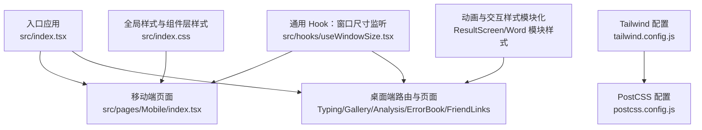
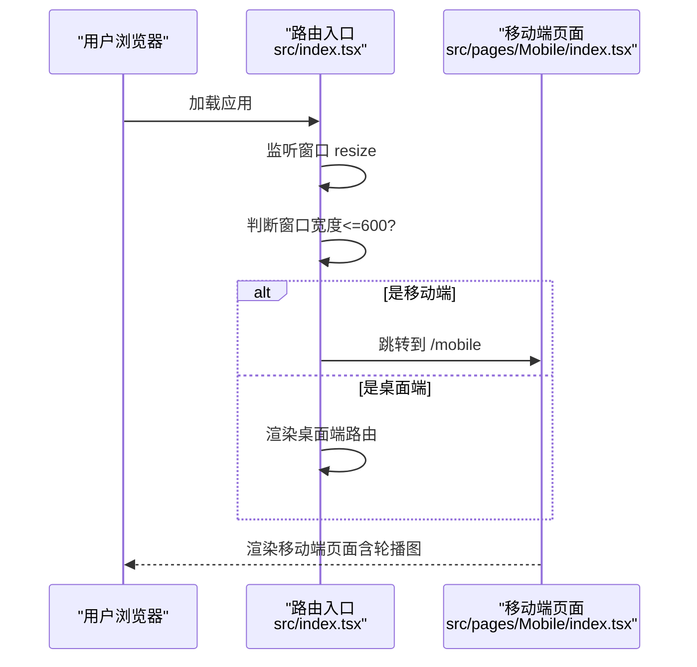
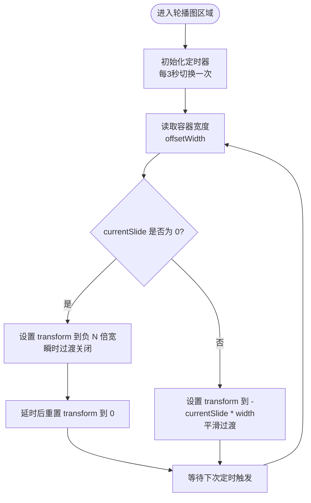
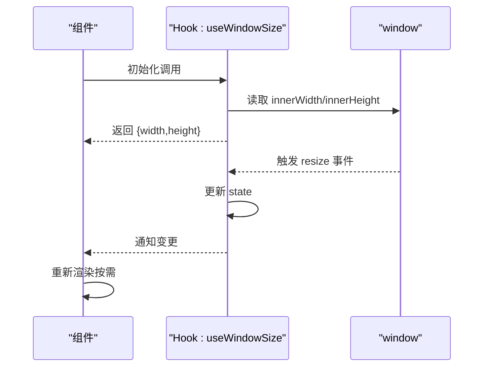
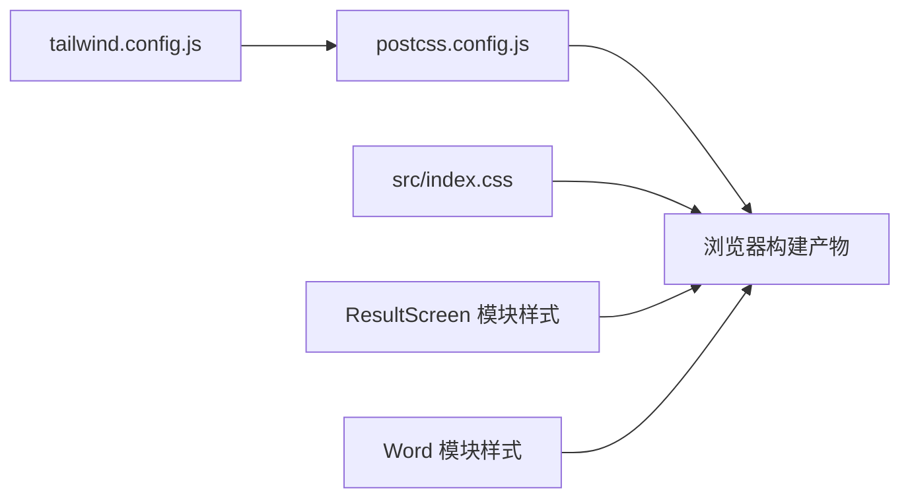

# 响应式设计实现

<cite>
**本文引用的文件**
- [tailwind.config.js](file://tailwind.config.js)
- [postcss.config.js](file://postcss.config.js)
- [src/index.tsx](file://src/index.tsx)
- [src/hooks/useWindowSize.tsx](file://src/hooks/useWindowSize.tsx)
- [src/pages/Mobile/index.tsx](file://src/pages/Mobile/index.tsx)
- [src/index.css](file://src/index.css)
- [src/utils/clamp.ts](file://src/utils/clamp.ts)
- [src/pages/Typing/components/ResultScreen/index.module.css](file://src/pages/Typing/components/ResultScreen/index.module.css)
- [src/pages/Typing/components/WordPanel/components/Word/index.module.css](file://src/pages/Typing/components/WordPanel/components/Word/index.module.css)
</cite>

## 目录

1. [引言](#引言)
2. [项目结构](#项目结构)
3. [核心组件](#核心组件)
4. [架构总览](#架构总览)
5. [详细组件分析](#详细组件分析)
6. [依赖分析](#依赖分析)
7. [性能考虑](#性能考虑)
8. [故障排查指南](#故障排查指南)
9. [结论](#结论)
10. [附录](#附录)

## 引言

本文件围绕移动端响应式设计实现进行系统化技术文档整理，重点覆盖以下方面：

- 移动端断点设计策略：TailwindCSS 响应式类的使用、媒体查询配置与自适应布局实现
- 移动端页面组件设计原理：轮播图组件实现、图片自适应处理、内容布局优化
- 窗口尺寸监听机制：useWindowSize Hook 的实现逻辑与响应式状态管理
- 移动端布局最佳实践：字体大小调整、间距优化、元素尺寸适配
- 具体配置与示例路径，便于开发者理解与扩展

## 项目结构

本项目采用前端单页应用（SPA）架构，通过路由在桌面端与移动端之间切换，并以 TailwindCSS 作为主要样式框架，结合 PostCSS 自动前缀与按需构建。

图表来源

- [src/index.tsx](file://src/index.tsx#L35-L78)
- [src/pages/Mobile/index.tsx](file://src/pages/Mobile/index.tsx#L1-L235)
- [tailwind.config.js](file://tailwind.config.js#L58-L66)
- [postcss.config.js](file://postcss.config.js#L1-L6)
- [src/index.css](file://src/index.css#L1-L208)
- [src/pages/Typing/components/ResultScreen/index.module.css](file://src/pages/Typing/components/ResultScreen/index.module.css#L1-L40)
- [src/pages/Typing/components/WordPanel/components/Word/index.module.css](file://src/pages/Typing/components/WordPanel/components/Word/index.module.css#L1-L45)

章节来源

- [src/index.tsx](file://src/index.tsx#L35-L78)
- [tailwind.config.js](file://tailwind.config.js#L58-L66)
- [postcss.config.js](file://postcss.config.js#L1-L6)

## 核心组件

- 移动端断点与 Tailwind 响应式类

  - 在 Tailwind 配置中定义了标准断点与业务断点，如 sm、md、lg、xl、2xl，以及 dic3、dic4 等用于特定场景的断点。这些断点直接映射到 CSS 媒体查询，供 Tailwind 响应式修饰符使用。
  - 示例路径：[tailwind.config.js 屏幕断点定义](file://tailwind.config.js#L58-L66)

- 窗口尺寸监听 Hook

  - useWindowSize Hook 在客户端监听 resize 事件，返回当前窗口宽高；在服务端渲染环境下返回初始值，避免 SSR 报错。
  - 示例路径：[useWindowSize Hook 实现](file://src/hooks/useWindowSize.tsx#L1-L29)

- 移动端页面与轮播图组件

  - 移动端页面通过定时器驱动轮播图切换，使用容器宽度计算位移，实现平滑过渡与循环播放；图片采用全宽自适应，配合对象填充策略保证展示一致性。
  - 示例路径：
    - [移动端页面轮播图实现（容器与位移）](file://src/pages/Mobile/index.tsx#L41-L65)
    - [移动端页面轮播图图片列表与指示器](file://src/pages/Mobile/index.tsx#L200-L235)

- 字体、间距与尺寸适配
  - 全局样式与组件层样式中广泛使用 Tailwind 响应式修饰符，如 sm、md、lg 等，确保在不同屏幕尺寸下获得一致的排版与间距体验。
  - 示例路径：
    - [全局样式与组件层样式（含响应式修饰符）](file://src/index.css#L58-L147)

章节来源

- [tailwind.config.js](file://tailwind.config.js#L58-L66)
- [src/hooks/useWindowSize.tsx](file://src/hooks/useWindowSize.tsx#L1-L29)
- [src/pages/Mobile/index.tsx](file://src/pages/Mobile/index.tsx#L41-L65)
- [src/pages/Mobile/index.tsx](file://src/pages/Mobile/index.tsx#L200-L235)
- [src/index.css](file://src/index.css#L58-L147)

## 架构总览

移动端与桌面端通过入口路由进行分流：当窗口宽度小于等于阈值时自动跳转至移动端页面；否则加载桌面端页面。移动端页面内部包含轮播图、功能卡片、词库展示等多个响应式区块。

图表来源

- [src/index.tsx](file://src/index.tsx#L35-L78)
- [src/pages/Mobile/index.tsx](file://src/pages/Mobile/index.tsx#L1-L235)

章节来源

- [src/index.tsx](file://src/index.tsx#L35-L78)

## 详细组件分析

### 组件一：移动端轮播图组件

- 设计要点
  - 使用定时器周期性推进当前幻灯片索引，实现自动播放
  - 通过容器 offsetWidth 获取单张图片宽度，动态计算 transform 位移
  - 首尾帧处理：当回到起点时瞬时重置 transform，避免过渡闪烁
  - 指示器根据当前索引高亮，提供直观的浏览位置提示
- 响应式策略
  - 图片采用全宽自适应，配合对象填充策略保证在不同设备上保持一致的视觉比例
  - 断点控制：在不同屏幕尺寸下，通过 Tailwind 响应式修饰符调整内边距、字号与卡片尺寸，确保内容可读性与可触达性

图表来源

- [src/pages/Mobile/index.tsx](file://src/pages/Mobile/index.tsx#L41-L65)
- [src/pages/Mobile/index.tsx](file://src/pages/Mobile/index.tsx#L200-L235)

章节来源

- [src/pages/Mobile/index.tsx](file://src/pages/Mobile/index.tsx#L41-L65)
- [src/pages/Mobile/index.tsx](file://src/pages/Mobile/index.tsx#L200-L235)

### 组件二：窗口尺寸监听 Hook（useWindowSize）

- 实现逻辑
  - 在客户端环境初始化状态为当前窗口宽高；在服务端返回初始值
  - 监听 resize 事件，实时更新宽高；组件卸载时移除监听，防止内存泄漏
- 响应式状态管理
  - 可与路由分流逻辑配合：在入口处根据窗口宽度决定渲染移动端或桌面端页面
  - 可在组件内部根据宽度动态调整布局、字体大小、间距等

图表来源

- [src/hooks/useWindowSize.tsx](file://src/hooks/useWindowSize.tsx#L1-L29)
- [src/index.tsx](file://src/index.tsx#L35-L78)

章节来源

- [src/hooks/useWindowSize.tsx](file://src/hooks/useWindowSize.tsx#L1-L29)
- [src/index.tsx](file://src/index.tsx#L35-L78)

### 组件三：移动端页面整体布局与断点策略

- 断点与类名使用
  - 使用 sm、md、lg 等 Tailwind 响应式修饰符控制字体大小、内边距、卡片尺寸与网格布局列数
  - 通过 max-width 与容器约束，确保在大屏设备上内容不被过度拉伸
- 图片自适应
  - 轮播图与功能展示区域内的图片采用全宽自适应与对象填充策略，保证在不同设备上视觉一致
- 交互与动画
  - 结果页与单词面板等模块使用模块化 CSS 动画，增强反馈体验；在移动端同样适用

图表来源

- [src/pages/Mobile/index.tsx](file://src/pages/Mobile/index.tsx#L67-L194)
- [src/pages/Mobile/index.tsx](file://src/pages/Mobile/index.tsx#L196-L360)
- [src/pages/Mobile/index.tsx](file://src/pages/Mobile/index.tsx#L360-L470)

章节来源

- [src/pages/Mobile/index.tsx](file://src/pages/Mobile/index.tsx#L67-L194)
- [src/pages/Mobile/index.tsx](file://src/pages/Mobile/index.tsx#L196-L360)
- [src/pages/Mobile/index.tsx](file://src/pages/Mobile/index.tsx#L360-L470)

### 组件四：动画与交互样式（结果页与单词面板）

- 结果页图片抖动动画
  - 通过模块化 CSS 定义关键帧动画，用于结果页的视觉反馈
  - 示例路径：[结果页动画样式](file://src/pages/Typing/components/ResultScreen/index.module.css#L1-L40)
- 单词错误抖动动画
  - 单词输入错误时触发抖动动画，提升错误反馈的可感知性
  - 示例路径：[单词错误动画样式](file://src/pages/Typing/components/WordPanel/components/Word/index.module.css#L1-L45)

章节来源

- [src/pages/Typing/components/ResultScreen/index.module.css](file://src/pages/Typing/components/ResultScreen/index.module.css#L1-L40)
- [src/pages/Typing/components/WordPanel/components/Word/index.module.css](file://src/pages/Typing/components/WordPanel/components/Word/index.module.css#L1-L45)

## 依赖分析

- TailwindCSS 与 PostCSS
  - Tailwind 通过配置文件定义断点、颜色、动画与扩展尺寸，PostCSS 负责编译与自动前缀
  - 示例路径：
    - [Tailwind 配置（断点与扩展）](file://tailwind.config.js#L58-L66)
    - [PostCSS 配置（tailwindcss + autoprefixer）](file://postcss.config.js#L1-L6)
- 全局样式与组件层样式
  - 全局样式集中于入口 CSS 文件，组件层样式采用模块化 CSS，避免全局污染
  - 示例路径：
    - [全局样式与组件层样式](file://src/index.css#L58-L147)

图表来源

- [tailwind.config.js](file://tailwind.config.js#L58-L66)
- [postcss.config.js](file://postcss.config.js#L1-L6)
- [src/index.css](file://src/index.css#L58-L147)
- [src/pages/Typing/components/ResultScreen/index.module.css](file://src/pages/Typing/components/ResultScreen/index.module.css#L1-L40)
- [src/pages/Typing/components/WordPanel/components/Word/index.module.css](file://src/pages/Typing/components/WordPanel/components/Word/index.module.css#L1-L45)

章节来源

- [tailwind.config.js](file://tailwind.config.js#L58-L66)
- [postcss.config.js](file://postcss.config.js#L1-L6)
- [src/index.css](file://src/index.css#L58-L147)

## 性能考虑

- 轮播图位移计算
  - 使用容器 offsetWidth 计算位移，避免复杂布局回流；首尾帧瞬时重置减少不必要的过渡
  - 示例路径：[轮播图位移与过渡](file://src/pages/Mobile/index.tsx#L41-L65)
- Resize 监听去抖
  - 当前 Hook 未做去抖处理，若在高频 resize 场景下建议引入节流/去抖策略，降低重渲染频率
  - 示例路径：[useWindowSize Hook](file://src/hooks/useWindowSize.tsx#L1-L29)
- 动画与过渡
  - 使用 transform 与 opacity 控制动画，尽量避免触发布局与重绘；模块化 CSS 动画按需加载
  - 示例路径：
    - [结果页动画](file://src/pages/Typing/components/ResultScreen/index.module.css#L1-L40)
    - [单词错误动画](file://src/pages/Typing/components/WordPanel/components/Word/index.module.css#L1-L45)

## 故障排查指南

- 移动端页面未正确跳转
  - 检查入口路由对窗口宽度的判断与跳转逻辑
  - 示例路径：[路由分流逻辑](file://src/index.tsx#L35-L78)
- 轮播图切换异常或闪烁
  - 确认容器宽度读取时机与首尾帧重置逻辑
  - 示例路径：[轮播图位移与过渡](file://src/pages/Mobile/index.tsx#L41-L65)
- 图片在某些设备上变形
  - 检查图片容器的自适应类与对象填充策略
  - 示例路径：[轮播图图片容器](file://src/pages/Mobile/index.tsx#L200-L235)
- 动画在移动端卡顿
  - 检查动画关键帧与硬件加速属性，必要时减少动画复杂度或在移动端禁用部分动画
  - 示例路径：
    - [结果页动画](file://src/pages/Typing/components/ResultScreen/index.module.css#L1-L40)
    - [单词错误动画](file://src/pages/Typing/components/WordPanel/components/Word/index.module.css#L1-L45)

章节来源

- [src/index.tsx](file://src/index.tsx#L35-L78)
- [src/pages/Mobile/index.tsx](file://src/pages/Mobile/index.tsx#L41-L65)
- [src/pages/Mobile/index.tsx](file://src/pages/Mobile/index.tsx#L200-L235)
- [src/pages/Typing/components/ResultScreen/index.module.css](file://src/pages/Typing/components/ResultScreen/index.module.css#L1-L40)
- [src/pages/Typing/components/WordPanel/components/Word/index.module.css](file://src/pages/Typing/components/WordPanel/components/Word/index.module.css#L1-L45)

## 结论

本项目通过 TailwindCSS 断点体系与响应式修饰符，结合移动端页面的轮播图与模块化动画，实现了良好的移动端体验。入口路由基于窗口尺寸进行分流，配合 useWindowSize Hook 进行响应式状态管理，整体架构清晰、易于扩展。建议在高频 resize 场景下进一步优化 Hook 的性能，并在移动端谨慎使用复杂动画以保障流畅度。

## 附录

- 断点与尺寸扩展参考
  - Tailwind 屏幕断点与扩展尺寸定义
  - 示例路径：[tailwind.config.js 屏幕断点与扩展](file://tailwind.config.js#L58-L66)
- 全局样式与组件层样式
  - 组件层样式采用模块化 CSS，避免全局污染
  - 示例路径：[src/index.css 组件层样式](file://src/index.css#L58-L147)
- 数值裁剪工具
  - clamp 工具用于限制数值范围，可用于响应式尺寸计算
  - 示例路径：[src/utils/clamp.ts](file://src/utils/clamp.ts#L1-L13)
