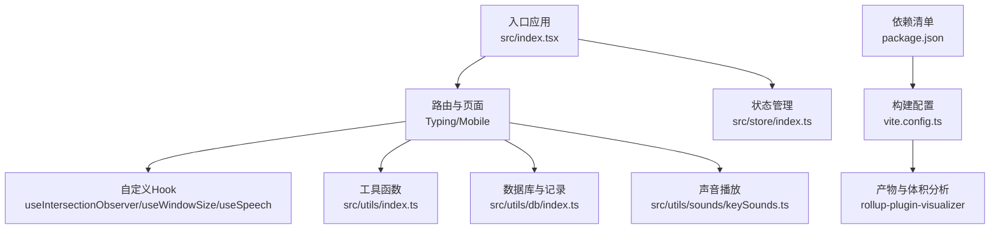
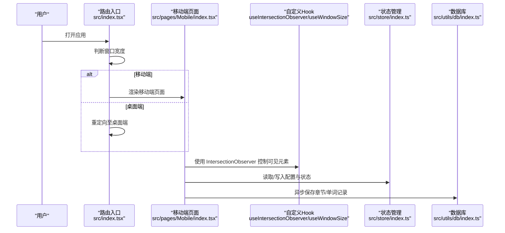
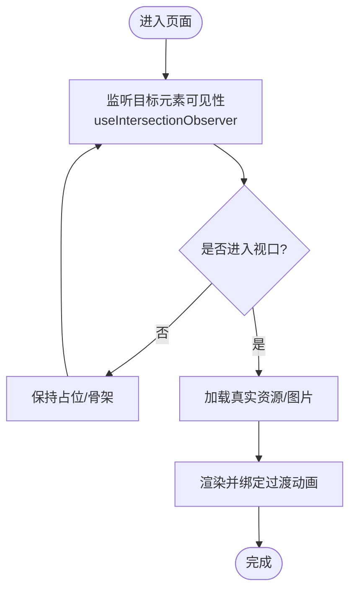
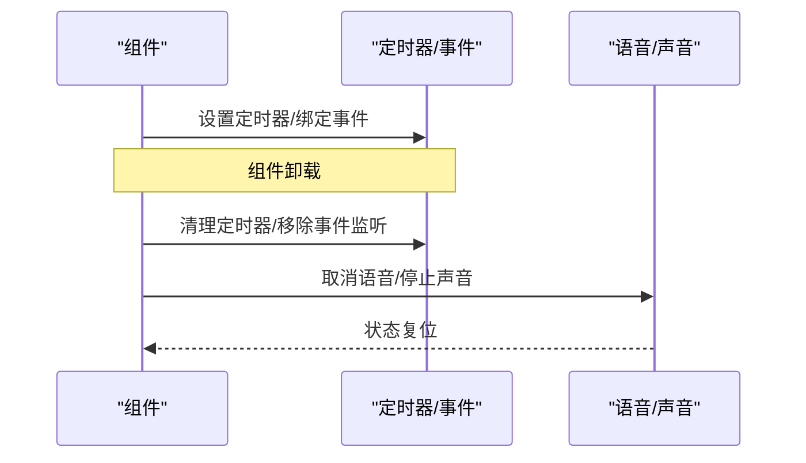
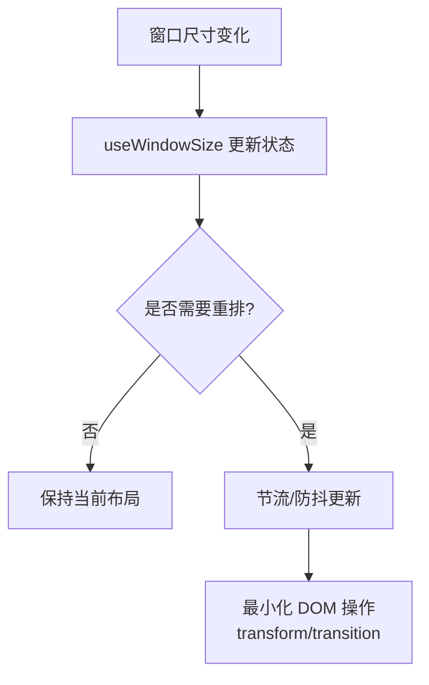
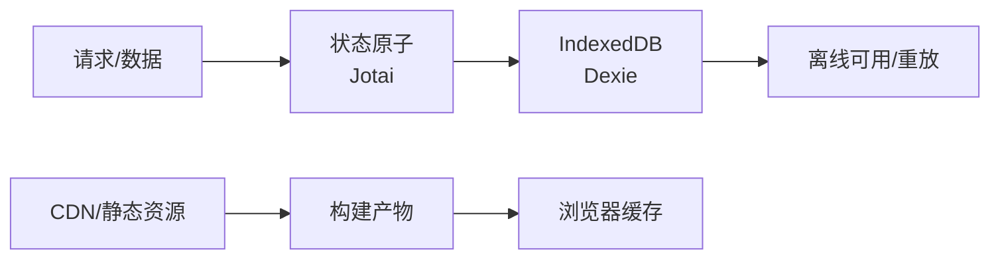
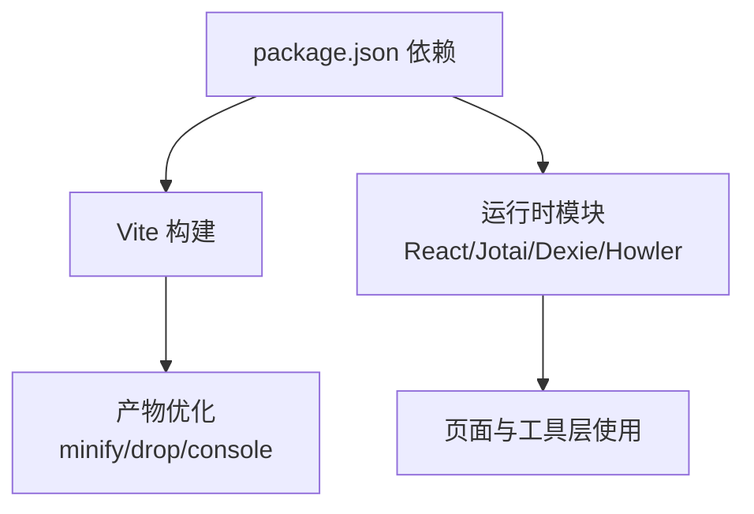

# 移动端性能优化

<cite>
**本文引用的文件**
- [README.md](file://README.md)
- [package.json](file://package.json)
- [vite.config.ts](file://vite.config.ts)
- [src/index.tsx](file://src/index.tsx)
- [src/pages/Mobile/index.tsx](file://src/pages/Mobile/index.tsx)
- [src/pages/Typing/index.tsx](file://src/pages/Typing/index.tsx)
- [src/hooks/useIntersectionObserver.ts](file://src/hooks/useIntersectionObserver.ts)
- [src/hooks/useWindowSize.tsx](file://src/hooks/useWindowSize.tsx)
- [src/hooks/useSpeech.ts](file://src/hooks/useSpeech.ts)
- [src/utils/index.ts](file://src/utils/index.ts)
- [src/utils/db/index.ts](file://src/utils/db/index.ts)
- [src/utils/sounds/keySounds.ts](file://src/utils/sounds/keySounds.ts)
- [src/store/index.ts](file://src/store/index.ts)
</cite>

## 目录

1. [引言](#引言)
2. [项目结构](#项目结构)
3. [核心组件](#核心组件)
4. [架构总览](#架构总览)
5. [详细组件分析](#详细组件分析)
6. [依赖关系分析](#依赖关系分析)
7. [性能考量](#性能考量)
8. [故障排查指南](#故障排查指南)
9. [结论](#结论)
10. [附录](#附录)

## 引言

本文件面向移动端性能优化，结合仓库现有实现，系统梳理资源优化、内存管理、渲染性能、网络优化与监控调试等关键技术点，并给出可落地的最佳实践与案例路径，帮助开发者构建高性能的移动端应用。

## 项目结构

本项目采用 React + Vite 架构，页面入口在根入口文件中按路由懒加载与条件渲染区分桌面端与移动端；移动端页面位于独立页面组件中，配合自定义 Hook 与状态管理实现交互与性能控制。

图表来源

- [src/index.tsx](file://src/index.tsx#L1-L79)
- [src/pages/Mobile/index.tsx](file://src/pages/Mobile/index.tsx#L1-L120)
- [src/pages/Typing/index.tsx](file://src/pages/Typing/index.tsx#L1-L174)
- [src/hooks/useIntersectionObserver.ts](file://src/hooks/useIntersectionObserver.ts#L1-L43)
- [src/hooks/useWindowSize.tsx](file://src/hooks/useWindowSize.tsx#L1-L30)
- [src/hooks/useSpeech.ts](file://src/hooks/useSpeech.ts#L1-L87)
- [src/utils/index.ts](file://src/utils/index.ts#L1-L130)
- [src/utils/db/index.ts](file://src/utils/db/index.ts#L1-L136)
- [src/utils/sounds/keySounds.ts](file://src/utils/sounds/keySounds.ts#L1-L14)
- [src/store/index.ts](file://src/store/index.ts#L1-L118)
- [vite.config.ts](file://vite.config.ts#L1-L55)
- [package.json](file://package.json#L1-L128)

章节来源

- [README.md](file://README.md#L1-L120)
- [src/index.tsx](file://src/index.tsx#L1-L79)
- [vite.config.ts](file://vite.config.ts#L1-L55)
- [package.json](file://package.json#L1-L128)

## 核心组件

- 路由与页面分流：入口根据窗口宽度判断移动端并重定向至移动端页面，减少桌面端资源加载与渲染。
- 自定义 Hook：IntersectionObserver 用于懒加载与可见性控制；useWindowSize 用于响应式布局；useSpeech 用于语音合成生命周期管理。
- 状态管理：Jotai 原子状态持久化与配置管理，降低全局状态同步成本。
- 数据层：Dexie IndexedDB 封装，章节与单词记录异步入库，避免主线程阻塞。
- 声音播放：Howler 声音资源播放封装，统一音量与格式，减少重复初始化。

章节来源

- [src/index.tsx](file://src/index.tsx#L35-L74)
- [src/hooks/useIntersectionObserver.ts](file://src/hooks/useIntersectionObserver.ts#L1-L43)
- [src/hooks/useWindowSize.tsx](file://src/hooks/useWindowSize.tsx#L1-L30)
- [src/hooks/useSpeech.ts](file://src/hooks/useSpeech.ts#L1-L87)
- [src/store/index.ts](file://src/store/index.ts#L1-L118)
- [src/utils/db/index.ts](file://src/utils/db/index.ts#L1-L136)
- [src/utils/sounds/keySounds.ts](file://src/utils/sounds/keySounds.ts#L1-L14)

## 架构总览

移动端页面与桌面端页面通过路由与窗口尺寸判断进行分流；页面内组件通过 Hook 与状态管理解耦，数据通过 Dexie 异步入库，声音与语音通过独立模块管理生命周期。

图表来源

- [src/index.tsx](file://src/index.tsx#L35-L74)
- [src/pages/Mobile/index.tsx](file://src/pages/Mobile/index.tsx#L1-L120)
- [src/hooks/useIntersectionObserver.ts](file://src/hooks/useIntersectionObserver.ts#L1-L43)
- [src/store/index.ts](file://src/store/index.ts#L1-L118)
- [src/utils/db/index.ts](file://src/utils/db/index.ts#L1-L136)

## 详细组件分析

### 资源优化与懒加载

- 图片懒加载与可见性控制
  - 使用 IntersectionObserver Hook 监听元素可见性，避免一次性渲染大量图片导致的首屏卡顿与内存占用。
  - 在移动端页面中，轮播图容器通过样式与过渡属性控制动画流畅度，减少不必要的重排重绘。
- 资源打包与体积分析
  - 构建配置启用可视化分析插件，便于定位体积热点与拆分代码。
  - 生产环境移除 console 与 debugger，减小包体与运行时开销。

图表来源

- [src/hooks/useIntersectionObserver.ts](file://src/hooks/useIntersectionObserver.ts#L1-L43)
- [src/pages/Mobile/index.tsx](file://src/pages/Mobile/index.tsx#L180-L240)

章节来源

- [src/hooks/useIntersectionObserver.ts](file://src/hooks/useIntersectionObserver.ts#L1-L43)
- [src/pages/Mobile/index.tsx](file://src/pages/Mobile/index.tsx#L180-L240)
- [vite.config.ts](file://vite.config.ts#L1-L55)

### 内存管理与资源清理

- 组件卸载与事件监听移除
  - 轮播图定时器在组件卸载时清理，避免内存泄漏与后台持续运行。
  - 页面 resize 监听在卸载时移除，防止重复绑定与冗余回调。
- 语音与声音资源生命周期
  - 语音合成在组件卸载时取消，避免后台占用。
  - Howler 声音播放在播放完成后及时释放，避免重复实例累积。
- 定时器与全局事件
  - 桌面端练习页对窗口 blur 与 keydown 事件进行绑定与清理，避免常驻监听导致的内存压力。

图表来源

- [src/pages/Mobile/index.tsx](file://src/pages/Mobile/index.tsx#L35-L70)
- [src/index.tsx](file://src/index.tsx#L35-L74)
- [src/hooks/useSpeech.ts](file://src/hooks/useSpeech.ts#L1-L87)
- [src/utils/sounds/keySounds.ts](file://src/utils/sounds/keySounds.ts#L1-L14)
- [src/pages/Typing/index.tsx](file://src/pages/Typing/index.tsx#L60-L92)

章节来源

- [src/pages/Mobile/index.tsx](file://src/pages/Mobile/index.tsx#L35-L70)
- [src/index.tsx](file://src/index.tsx#L35-L74)
- [src/hooks/useSpeech.ts](file://src/hooks/useSpeech.ts#L1-L87)
- [src/utils/sounds/keySounds.ts](file://src/utils/sounds/keySounds.ts#L1-L14)
- [src/pages/Typing/index.tsx](file://src/pages/Typing/index.tsx#L60-L92)

### 渲染性能优化

- DOM 操作最小化与过渡控制
  - 轮播图通过 transform 与 transition 控制动画，优先使用合成属性减少重排。
  - 使用骨架屏与占位符，避免首屏大量图片加载造成的抖动。
- 响应式与尺寸监听
  - 使用 useWindowSize 获取窗口尺寸，避免频繁计算与不必要重渲染。
- 虚拟滚动与长列表
  - 页面中使用滚动区域组件，结合状态裁剪与分页策略，降低节点数量。

图表来源

- [src/hooks/useWindowSize.tsx](file://src/hooks/useWindowSize.tsx#L1-L30)
- [src/pages/Mobile/index.tsx](file://src/pages/Mobile/index.tsx#L180-L240)

章节来源

- [src/pages/Mobile/index.tsx](file://src/pages/Mobile/index.tsx#L180-L240)
- [src/hooks/useWindowSize.tsx](file://src/hooks/useWindowSize.tsx#L1-L30)

### 网络优化策略

- 请求合并与批量处理
  - 通过状态原子持久化减少重复请求；章节与单词记录异步入库，避免阻塞主线程。
- CDN 与静态资源
  - 构建配置开启产物输出与 Source Map 控制，便于 CDN 缓存与回源策略制定。
- 离线缓存
  - IndexedDB 记录本地持久化，结合离线场景下的数据恢复与重放逻辑，提升可用性。

图表来源

- [src/store/index.ts](file://src/store/index.ts#L1-L118)
- [src/utils/db/index.ts](file://src/utils/db/index.ts#L1-L136)
- [vite.config.ts](file://vite.config.ts#L1-L55)

章节来源

- [src/store/index.ts](file://src/store/index.ts#L1-L118)
- [src/utils/db/index.ts](file://src/utils/db/index.ts#L1-L136)
- [vite.config.ts](file://vite.config.ts#L1-L55)

### 性能监控与调试

- 构建期体积分析
  - 使用可视化插件输出包体分析报告，定位大体积依赖与重复模块。
- 运行时行为追踪
  - 生产环境 Mixpanel 初始化，结合章节完成事件上传，辅助性能回归分析。
- 移动端调试要点
  - 使用浏览器 DevTools 移动设备仿真，观察帧率、内存与网络瀑布；结合 IntersectionObserver 与滚动区域组件定位渲染瓶颈。

章节来源

- [vite.config.ts](file://vite.config.ts#L1-L55)
- [src/index.tsx](file://src/index.tsx#L1-L30)
- [src/utils/index.ts](file://src/utils/index.ts#L1-L130)

## 依赖关系分析

- 构建与打包
  - Vite 配置启用 esbuild 删除与 rollup 可视化分析，生产环境关闭 Source Map。
- 运行时依赖
  - React、Jotai、Dexie、Howler、SpeechSynthesis 等模块在页面与工具层广泛使用，需关注其体积与生命周期管理。

图表来源

- [package.json](file://package.json#L1-L128)
- [vite.config.ts](file://vite.config.ts#L1-L55)

章节来源

- [package.json](file://package.json#L1-L128)
- [vite.config.ts](file://vite.config.ts#L1-L55)

## 性能考量

- 首屏与交互
  - 使用路由懒加载与条件渲染，减少初始包体；移动端页面采用骨架屏与可见性控制，缩短感知等待。
- 渲染与动画
  - 优先 transform/opacity 动画，避免布局抖动；控制滚动区域节点数量，使用虚拟化策略。
- 资源与网络
  - 合理拆分代码与资源，利用 CDN 与缓存；离线记录与重放提升稳定性。
- 内存与事件
  - 统一清理定时器与事件监听，避免泄漏；语音与声音模块在卸载时取消与释放。

## 故障排查指南

- 页面在移动端被重定向至桌面端
  - 检查窗口宽度判断逻辑与路由重定向，确认断点设置合理。
- 轮播图动画卡顿
  - 检查 transform/transition 使用是否正确，避免强制同步布局；确认定时器在卸载时清理。
- 语音/声音异常
  - 确认浏览器支持 SpeechSynthesis 与 Howler；在组件卸载时取消与释放资源。
- 数据记录未入库
  - 检查 Dexie 版本与表结构迁移；确认异步保存流程与回调状态。

章节来源

- [src/index.tsx](file://src/index.tsx#L35-L74)
- [src/pages/Mobile/index.tsx](file://src/pages/Mobile/index.tsx#L35-L70)
- [src/hooks/useSpeech.ts](file://src/hooks/useSpeech.ts#L1-L87)
- [src/utils/sounds/keySounds.ts](file://src/utils/sounds/keySounds.ts#L1-L14)
- [src/utils/db/index.ts](file://src/utils/db/index.ts#L1-L136)

## 结论

通过路由分流、懒加载、状态与数据层解耦、资源与声音生命周期管理、构建期体积分析与运行时监控，可在保证功能完整性的同时显著提升移动端性能与稳定性。建议持续使用可视化分析与移动端仿真工具进行回归测试，确保优化效果可持续。

## 附录

- 优化案例路径
  - 路由分流与懒加载：[src/index.tsx](file://src/index.tsx#L35-L74)、[src/pages/Mobile/index.tsx](file://src/pages/Mobile/index.tsx#L1-L120)
  - 可见性控制与动画：[src/hooks/useIntersectionObserver.ts](file://src/hooks/useIntersectionObserver.ts#L1-L43)
  - 事件与定时器清理：[src/pages/Mobile/index.tsx](file://src/pages/Mobile/index.tsx#L35-L70)、[src/pages/Typing/index.tsx](file://src/pages/Typing/index.tsx#L60-L92)
  - 语音与声音管理：[src/hooks/useSpeech.ts](file://src/hooks/useSpeech.ts#L1-L87)、[src/utils/sounds/keySounds.ts](file://src/utils/sounds/keySounds.ts#L1-L14)
  - 数据持久化与离线：[src/utils/db/index.ts](file://src/utils/db/index.ts#L1-L136)
  - 构建与体积分析：[vite.config.ts](file://vite.config.ts#L1-L55)、[package.json](file://package.json#L1-L128)
