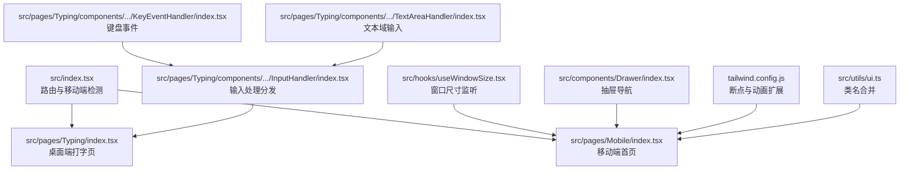
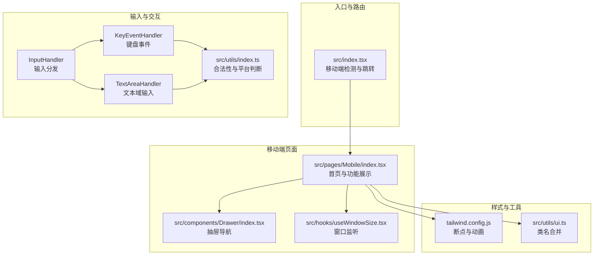
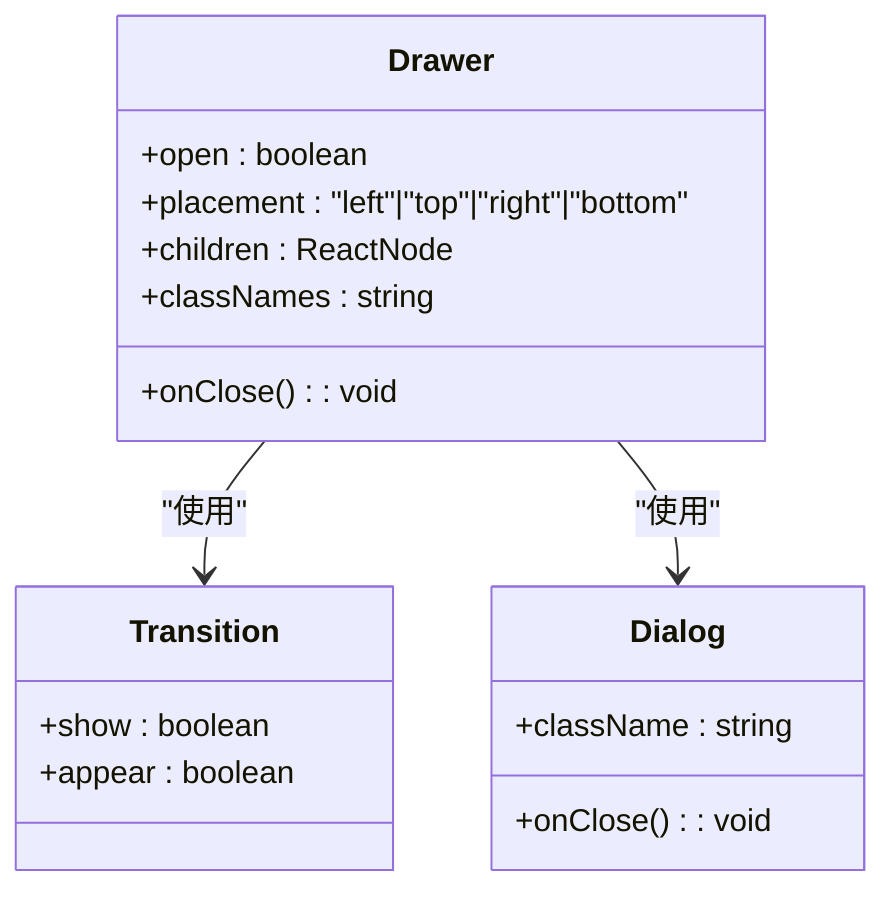
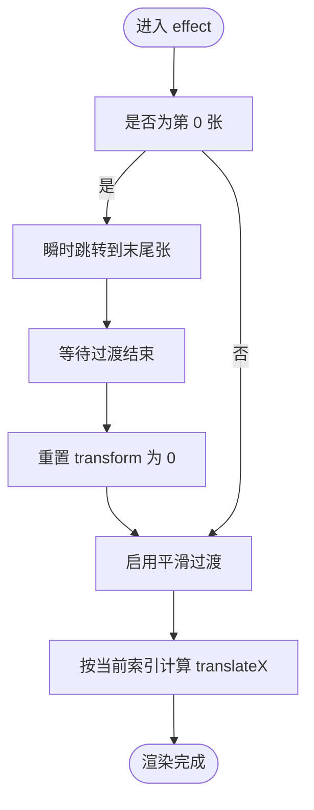
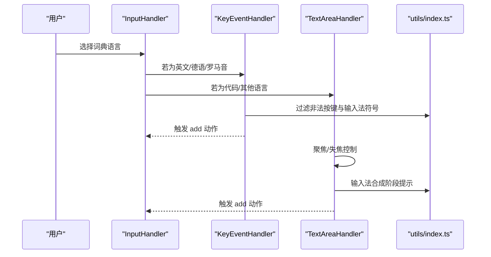
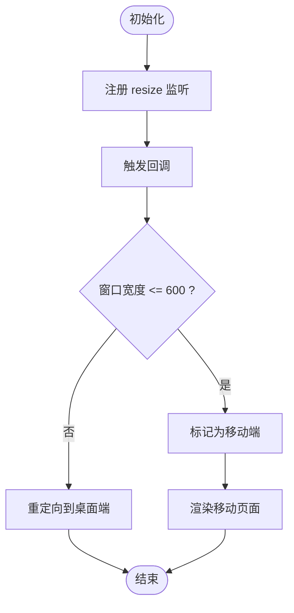
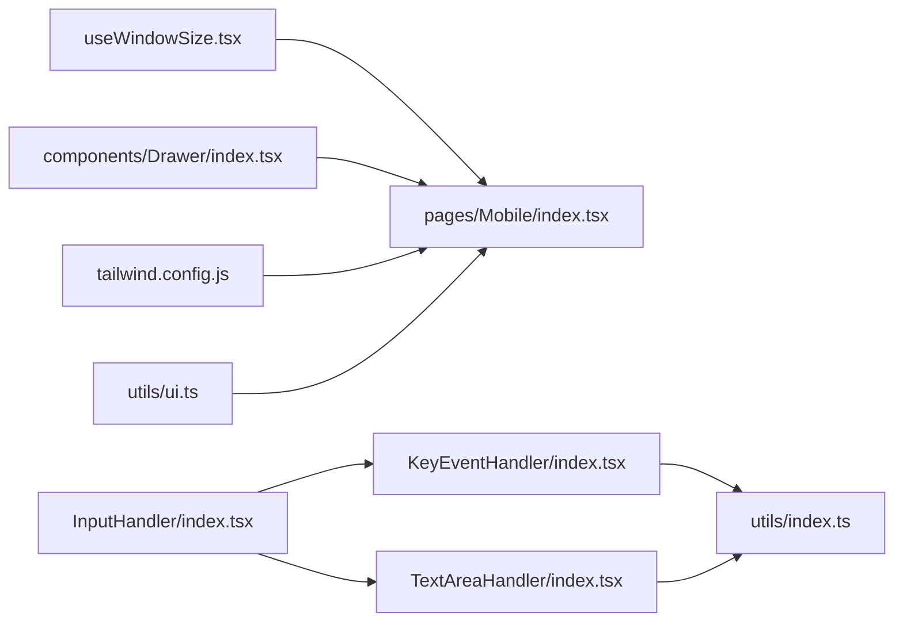

# 移动端适配

<cite>
**本文引用的文件**
- [src/index.tsx](file://src/index.tsx)
- [src/pages/Mobile/index.tsx](file://src/pages/Mobile/index.tsx)
- [src/hooks/useWindowSize.tsx](file://src/hooks/useWindowSize.tsx)
- [src/components/Drawer/index.tsx](file://src/components/Drawer/index.tsx)
- [src/utils/ui.ts](file://src/utils/ui.ts)
- [tailwind.config.js](file://tailwind.config.js)
- [src/pages/Typing/components/WordPanel/components/InputHandler/index.tsx](file://src/pages/Typing/components/WordPanel/components/InputHandler/index.tsx)
- [src/pages/Typing/components/WordPanel/components/KeyEventHandler/index.tsx](file://src/pages/Typing/components/WordPanel/components/KeyEventHandler/index.tsx)
- [src/pages/Typing/components/WordPanel/components/TextAreaHandler/index.tsx](file://src/pages/Typing/components/WordPanel/components/TextAreaHandler/index.tsx)
- [src/utils/index.ts](file://src/utils/index.ts)
- [src/hooks/useIntersectionObserver.ts](file://src/hooks/useIntersectionObserver.ts)
- [src/utils/clamp.ts](file://src/utils/clamp.ts)
- [src/utils/shuffle.ts](file://src/utils/shuffle.ts)
- [src/components/Loading/index.tsx](file://src/components/Loading/index.tsx)
- [playwright.config.ts](file://playwright.config.ts)
</cite>

## 目录

1. [引言](#引言)
2. [项目结构](#项目结构)
3. [核心组件](#核心组件)
4. [架构总览](#架构总览)
5. [详细组件分析](#详细组件分析)
6. [依赖关系分析](#依赖关系分析)
7. [性能考量](#性能考量)
8. [故障排查指南](#故障排查指南)
9. [结论](#结论)
10. [附录](#附录)

## 引言

本文件面向移动端适配系统，围绕响应式设计、触摸交互、性能优化与跨平台兼容性进行系统化技术说明。文档基于仓库现有实现进行提炼，涵盖断点设计、布局适配、抽屉导航、滑动操作、输入法与虚拟键盘处理、懒加载与内存管理、以及测试与调试方法，并提供扩展与优化建议。

## 项目结构

本项目采用前端单页应用结构，移动端入口通过路由自动跳转至移动页面，移动页面包含轮播图、功能卡片与词库展示等模块。Tailwind CSS 提供响应式断点与样式工具，自定义 Hook 用于窗口尺寸监听与交集观察器，组件层提供抽屉导航与加载占位等通用能力。

图表来源

- [src/index.tsx](file://src/index.tsx#L35-L78)
- [src/pages/Mobile/index.tsx](file://src/pages/Mobile/index.tsx#L1-L120)
- [src/hooks/useWindowSize.tsx](file://src/hooks/useWindowSize.tsx#L1-L30)
- [src/components/Drawer/index.tsx](file://src/components/Drawer/index.tsx#L1-L69)
- [tailwind.config.js](file://tailwind.config.js#L1-L78)
- [src/utils/ui.ts](file://src/utils/ui.ts#L1-L7)
- [src/pages/Typing/components/WordPanel/components/InputHandler/index.tsx](file://src/pages/Typing/components/WordPanel/components/InputHandler/index.tsx#L1-L46)
- [src/pages/Typing/components/WordPanel/components/KeyEventHandler/index.tsx](file://src/pages/Typing/components/WordPanel/components/KeyEventHandler/index.tsx#L1-L37)
- [src/pages/Typing/components/WordPanel/components/TextAreaHandler/index.tsx](file://src/pages/Typing/components/WordPanel/components/TextAreaHandler/index.tsx#L1-L54)

章节来源

- [src/index.tsx](file://src/index.tsx#L35-L78)
- [tailwind.config.js](file://tailwind.config.js#L1-L78)

## 核心组件

- 移动端入口与路由跳转：根据窗口宽度判断是否为移动端，自动跳转到移动页面，保证移动端用户直达移动首页。
- 移动端首页：包含固定头部、面包屑导航、功能特性卡片、轮播图与词库展示等模块，使用 Tailwind 断点控制布局。
- 抽屉导航：基于 Headless UI 的 Dialog/Transition 实现，支持多方向抽屉，提供遮罩与过渡动画。
- 输入处理：根据词典语言类型动态选择键盘事件或文本域输入处理器，统一抽象输入动作，屏蔽平台差异。
- 窗口尺寸监听：在客户端监听 resize 事件，返回当前宽高，便于条件渲染与布局调整。
- UI 类名合并：使用 clsx 与 tailwind-merge 合并类名，避免冲突与重复。

章节来源

- [src/index.tsx](file://src/index.tsx#L35-L78)
- [src/pages/Mobile/index.tsx](file://src/pages/Mobile/index.tsx#L1-L120)
- [src/components/Drawer/index.tsx](file://src/components/Drawer/index.tsx#L1-L69)
- [src/pages/Typing/components/WordPanel/components/InputHandler/index.tsx](file://src/pages/Typing/components/WordPanel/components/InputHandler/index.tsx#L1-L46)
- [src/pages/Typing/components/WordPanel/components/KeyEventHandler/index.tsx](file://src/pages/Typing/components/WordPanel/components/KeyEventHandler/index.tsx#L1-L37)
- [src/pages/Typing/components/WordPanel/components/TextAreaHandler/index.tsx](file://src/pages/Typing/components/WordPanel/components/TextAreaHandler/index.tsx#L1-L54)
- [src/hooks/useWindowSize.tsx](file://src/hooks/useWindowSize.tsx#L1-L30)
- [src/utils/ui.ts](file://src/utils/ui.ts#L1-L7)

## 架构总览

移动端适配以“路由分流 + 响应式布局 + 交互组件 + 输入处理”为核心路径，结合 Tailwind 断点与自定义 Hook 实现跨设备一致体验。

图表来源

- [src/index.tsx](file://src/index.tsx#L35-L78)
- [src/pages/Mobile/index.tsx](file://src/pages/Mobile/index.tsx#L1-L120)
- [src/components/Drawer/index.tsx](file://src/components/Drawer/index.tsx#L1-L69)
- [src/hooks/useWindowSize.tsx](file://src/hooks/useWindowSize.tsx#L1-L30)
- [src/pages/Typing/components/WordPanel/components/InputHandler/index.tsx](file://src/pages/Typing/components/WordPanel/components/InputHandler/index.tsx#L1-L46)
- [src/pages/Typing/components/WordPanel/components/KeyEventHandler/index.tsx](file://src/pages/Typing/components/WordPanel/components/KeyEventHandler/index.tsx#L1-L37)
- [src/pages/Typing/components/WordPanel/components/TextAreaHandler/index.tsx](file://src/pages/Typing/components/WordPanel/components/TextAreaHandler/index.tsx#L1-L54)
- [src/utils/index.ts](file://src/utils/index.ts#L1-L65)
- [tailwind.config.js](file://tailwind.config.js#L1-L78)
- [src/utils/ui.ts](file://src/utils/ui.ts#L1-L7)

## 详细组件分析

### 响应式设计与断点策略

- 断点扩展：在 Tailwind 配置中扩展了多个断点，如 dic3、dic4 等，便于针对不同设备密度与屏幕尺寸进行精细化布局。
- 布局适配：移动端首页广泛使用相对宽度与内边距断点类，配合固定定位与视口单位，保证在小屏设备上的可读性与可触达性。
- 交互优化：通过类名合并工具与过渡动画配置，减少冗余样式计算，提升滚动与点击反馈的流畅度。

章节来源

- [tailwind.config.js](file://tailwind.config.js#L1-L78)
- [src/pages/Mobile/index.tsx](file://src/pages/Mobile/index.tsx#L1-L120)
- [src/utils/ui.ts](file://src/utils/ui.ts#L1-L7)

### 抽屉导航组件

- 功能：支持从左、右、上、下四个方向滑入的抽屉，提供遮罩层与平滑过渡动画。
- 使用：通过属性控制打开状态、放置位置与关闭回调，内部使用 Headless UI 的 Transition 与 Dialog 组合实现。
- 适用场景：移动端菜单、设置面板、侧栏导航等。

图表来源

- [src/components/Drawer/index.tsx](file://src/components/Drawer/index.tsx#L1-L69)

章节来源

- [src/components/Drawer/index.tsx](file://src/components/Drawer/index.tsx#L1-L69)

### 轮播图与滑动操作

- 自动轮播：定时器驱动当前幻灯片索引递增，周期性切换。
- 切换逻辑：在首尾帧切换时通过瞬时位移消除过渡，再恢复平滑过渡，避免视觉跳变。
- 尺寸适配：根据容器宽度计算位移，确保在不同屏幕宽度下保持一致的滑动体验。

图表来源

- [src/pages/Mobile/index.tsx](file://src/pages/Mobile/index.tsx#L1-L120)

章节来源

- [src/pages/Mobile/index.tsx](file://src/pages/Mobile/index.tsx#L1-L120)

### 触摸交互与输入处理

- 输入分发：根据词典语言类型选择键盘事件或文本域输入处理器，统一抽象输入动作类型，屏蔽平台差异。
- 键盘事件：监听全局 keydown，过滤组合键与非法按键，避免输入法符号干扰。
- 文本域输入：聚焦/失焦控制、输入事件处理、输入法合成阶段提示，确保移动端输入体验稳定。
- 平台判断：提供合法性与平台判断工具函数，辅助输入与行为控制。

图表来源

- [src/pages/Typing/components/WordPanel/components/InputHandler/index.tsx](file://src/pages/Typing/components/WordPanel/components/InputHandler/index.tsx#L1-L46)
- [src/pages/Typing/components/WordPanel/components/KeyEventHandler/index.tsx](file://src/pages/Typing/components/WordPanel/components/KeyEventHandler/index.tsx#L1-L37)
- [src/pages/Typing/components/WordPanel/components/TextAreaHandler/index.tsx](file://src/pages/Typing/components/WordPanel/components/TextAreaHandler/index.tsx#L1-L54)
- [src/utils/index.ts](file://src/utils/index.ts#L1-L65)

章节来源

- [src/pages/Typing/components/WordPanel/components/InputHandler/index.tsx](file://src/pages/Typing/components/WordPanel/components/InputHandler/index.tsx#L1-L46)
- [src/pages/Typing/components/WordPanel/components/KeyEventHandler/index.tsx](file://src/pages/Typing/components/WordPanel/components/KeyEventHandler/index.tsx#L1-L37)
- [src/pages/Typing/components/WordPanel/components/TextAreaHandler/index.tsx](file://src/pages/Typing/components/WordPanel/components/TextAreaHandler/index.tsx#L1-L54)
- [src/utils/index.ts](file://src/utils/index.ts#L1-L65)

### 点击延迟优化与虚拟键盘适配

- 点击延迟：通过类名合并与过渡动画配置，减少不必要的重绘与回流，提升点击反馈的即时感。
- 虚拟键盘：文本域输入组件对聚焦/失焦进行条件控制，避免输入法唤起导致的布局抖动；在输入法合成阶段给出提示，引导用户关闭输入法后再继续输入。
- 平台差异：利用平台判断工具函数区分不同平台的行为差异，针对性优化交互体验。

章节来源

- [src/utils/ui.ts](file://src/utils/ui.ts#L1-L7)
- [src/pages/Typing/components/WordPanel/components/TextAreaHandler/index.tsx](file://src/pages/Typing/components/WordPanel/components/TextAreaHandler/index.tsx#L1-L54)
- [src/utils/index.ts](file://src/utils/index.ts#L1-L65)

### 屏幕旋转与窗口变化处理

- 窗口监听：在客户端监听 resize 事件，返回当前宽高，便于在组件内部做条件渲染与布局调整。
- 移动端检测：在根路由中根据窗口宽度判断是否为移动端，若非移动端则重定向至桌面端页面，确保用户获得合适的页面。

图表来源

- [src/hooks/useWindowSize.tsx](file://src/hooks/useWindowSize.tsx#L1-L30)
- [src/index.tsx](file://src/index.tsx#L35-L78)

章节来源

- [src/hooks/useWindowSize.tsx](file://src/hooks/useWindowSize.tsx#L1-L30)
- [src/index.tsx](file://src/index.tsx#L35-L78)

### 性能优化实践

- 懒加载与可见性：使用交集观察器 Hook 监听元素可见性，仅在进入视口时加载或渲染，降低初始渲染压力。
- 数组操作与数值范围：提供 clamp 与 shuffle 工具，避免无意义的数组拷贝与随机化开销，提升数据处理效率。
- 资源与渲染：通过 Tailwind 断点与类名合并减少冗余样式，配合过渡动画参数优化渲染性能。

章节来源

- [src/hooks/useIntersectionObserver.ts](file://src/hooks/useIntersectionObserver.ts#L1-L43)
- [src/utils/clamp.ts](file://src/utils/clamp.ts#L1-L13)
- [src/utils/shuffle.ts](file://src/utils/shuffle.ts#L1-L17)
- [tailwind.config.js](file://tailwind.config.js#L1-L78)
- [src/utils/ui.ts](file://src/utils/ui.ts#L1-L7)

### 加载与骨架屏

- 占位加载：提供统一的加载组件，使用动画与居中布局，避免空白页面带来的感知延迟。

章节来源

- [src/components/Loading/index.tsx](file://src/components/Loading/index.tsx#L1-L22)

## 依赖关系分析

- 组件耦合：移动端页面依赖窗口监听 Hook 与抽屉组件；输入处理链路依赖工具函数与上下文状态。
- 外部依赖：Headless UI 提供抽屉与过渡动画；Tailwind CSS 提供断点与动画扩展；clsx 与 tailwind-merge 提供类名合并。
- 潜在循环：当前文件间未见直接循环依赖；输入处理链路为单向依赖，符合组件职责单一原则。

图表来源

- [src/hooks/useWindowSize.tsx](file://src/hooks/useWindowSize.tsx#L1-L30)
- [src/pages/Mobile/index.tsx](file://src/pages/Mobile/index.tsx#L1-L120)
- [src/components/Drawer/index.tsx](file://src/components/Drawer/index.tsx#L1-L69)
- [src/pages/Typing/components/WordPanel/components/InputHandler/index.tsx](file://src/pages/Typing/components/WordPanel/components/InputHandler/index.tsx#L1-L46)
- [src/pages/Typing/components/WordPanel/components/KeyEventHandler/index.tsx](file://src/pages/Typing/components/WordPanel/components/KeyEventHandler/index.tsx#L1-L37)
- [src/pages/Typing/components/WordPanel/components/TextAreaHandler/index.tsx](file://src/pages/Typing/components/WordPanel/components/TextAreaHandler/index.tsx#L1-L54)
- [src/utils/index.ts](file://src/utils/index.ts#L1-L65)
- [tailwind.config.js](file://tailwind.config.js#L1-L78)
- [src/utils/ui.ts](file://src/utils/ui.ts#L1-L7)

章节来源

- [src/hooks/useWindowSize.tsx](file://src/hooks/useWindowSize.tsx#L1-L30)
- [src/pages/Mobile/index.tsx](file://src/pages/Mobile/index.tsx#L1-L120)
- [src/components/Drawer/index.tsx](file://src/components/Drawer/index.tsx#L1-L69)
- [src/pages/Typing/components/WordPanel/components/InputHandler/index.tsx](file://src/pages/Typing/components/WordPanel/components/InputHandler/index.tsx#L1-L46)
- [src/pages/Typing/components/WordPanel/components/KeyEventHandler/index.tsx](file://src/pages/Typing/components/WordPanel/components/KeyEventHandler/index.tsx#L1-L37)
- [src/pages/Typing/components/WordPanel/components/TextAreaHandler/index.tsx](file://src/pages/Typing/components/WordPanel/components/TextAreaHandler/index.tsx#L1-L54)
- [src/utils/index.ts](file://src/utils/index.ts#L1-L65)
- [tailwind.config.js](file://tailwind.config.js#L1-L78)
- [src/utils/ui.ts](file://src/utils/ui.ts#L1-L7)

## 性能考量

- 渲染优化：使用 Tailwind 断点与类名合并减少样式计算；在轮播图中避免不必要的重排，仅在必要时切换过渡。
- 事件处理：键盘事件与输入法合成阶段的过滤与提示，减少无效输入处理与布局抖动。
- 数据处理：通过 clamp 与 shuffle 等工具函数优化数组与数值处理，避免不必要的拷贝与随机化成本。
- 可见性加载：交集观察器仅在元素进入视口时执行昂贵操作，降低首屏渲染压力。

章节来源

- [src/pages/Mobile/index.tsx](file://src/pages/Mobile/index.tsx#L1-L120)
- [src/utils/clamp.ts](file://src/utils/clamp.ts#L1-L13)
- [src/utils/shuffle.ts](file://src/utils/shuffle.ts#L1-L17)
- [src/hooks/useIntersectionObserver.ts](file://src/hooks/useIntersectionObserver.ts#L1-L43)

## 故障排查指南

- 输入法问题：若出现输入法符号或合成阶段异常，检查键盘事件与文本域输入的过滤逻辑与提示信息。
- 抽屉动画异常：确认 Transition 与 Dialog 的 show 状态同步，检查 placement 映射与过渡方向。
- 轮播图跳变：检查首尾帧瞬时位移与过渡复位逻辑，确保容器宽度计算与索引切换时机正确。
- 窗口监听失效：确认客户端环境判断与事件绑定/解绑逻辑，避免 SSR 或非浏览器环境报错。
- 路由跳转异常：检查移动端检测阈值与重定向逻辑，确保在桌面端不误跳转。

章节来源

- [src/pages/Typing/components/WordPanel/components/KeyEventHandler/index.tsx](file://src/pages/Typing/components/WordPanel/components/KeyEventHandler/index.tsx#L1-L37)
- [src/pages/Typing/components/WordPanel/components/TextAreaHandler/index.tsx](file://src/pages/Typing/components/WordPanel/components/TextAreaHandler/index.tsx#L1-L54)
- [src/components/Drawer/index.tsx](file://src/components/Drawer/index.tsx#L1-L69)
- [src/pages/Mobile/index.tsx](file://src/pages/Mobile/index.tsx#L1-L120)
- [src/hooks/useWindowSize.tsx](file://src/hooks/useWindowSize.tsx#L1-L30)
- [src/index.tsx](file://src/index.tsx#L35-L78)

## 结论

本项目通过路由分流、Tailwind 断点、抽屉导航与输入处理链路，构建了面向移动端的适配体系。配合窗口监听、交集观察器与工具函数，实现了良好的响应式布局、流畅的交互体验与可控的性能开销。后续可在手势识别、离线缓存与跨端测试方面进一步增强。

## 附录

- 跨平台兼容性测试方法与调试技巧
  - Playwright 测试配置中预留了移动端设备场景注释，可按需启用并添加测试用例，覆盖关键交互流程与断点表现。
  - 建议在真实设备与模拟器上验证输入法、虚拟键盘与触摸手势行为，关注滚动与焦点管理。
  - 使用浏览器开发者工具的设备模式与网络节流，模拟弱网与低端设备，验证懒加载与骨架屏效果。

章节来源

- [playwright.config.ts](file://playwright.config.ts#L46-L78)
