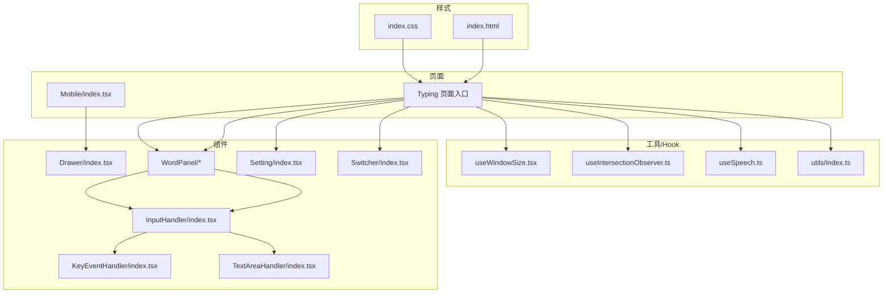
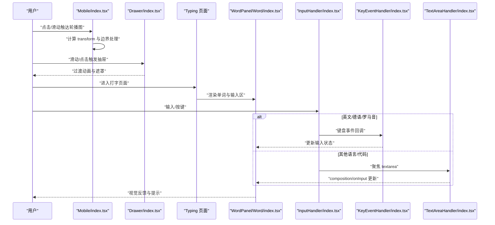
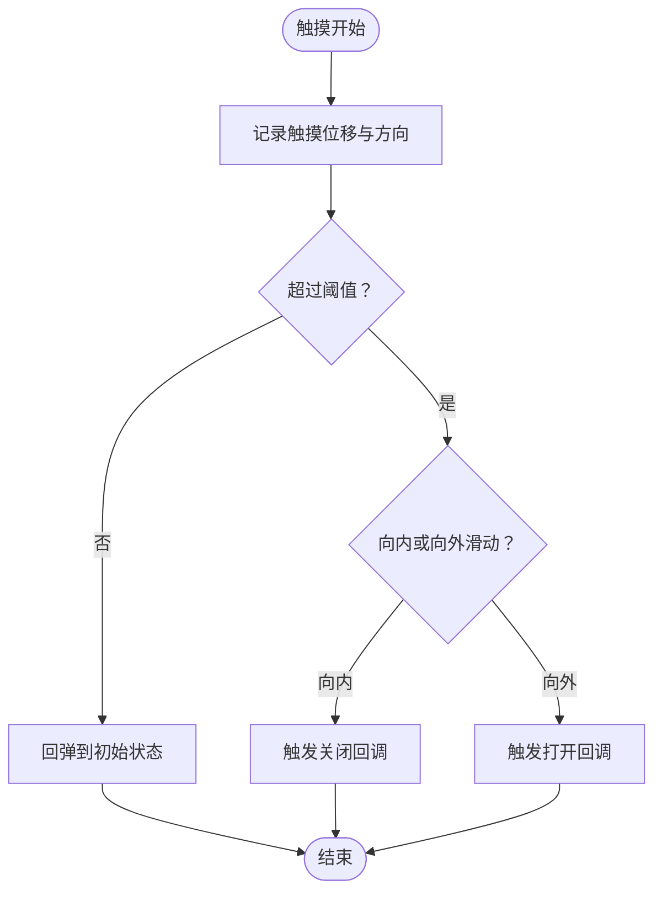
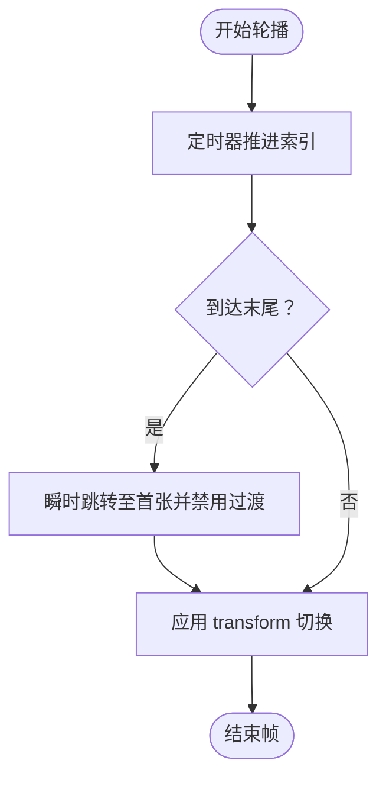
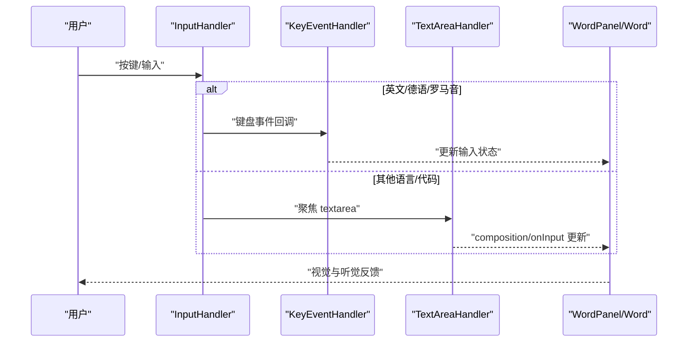
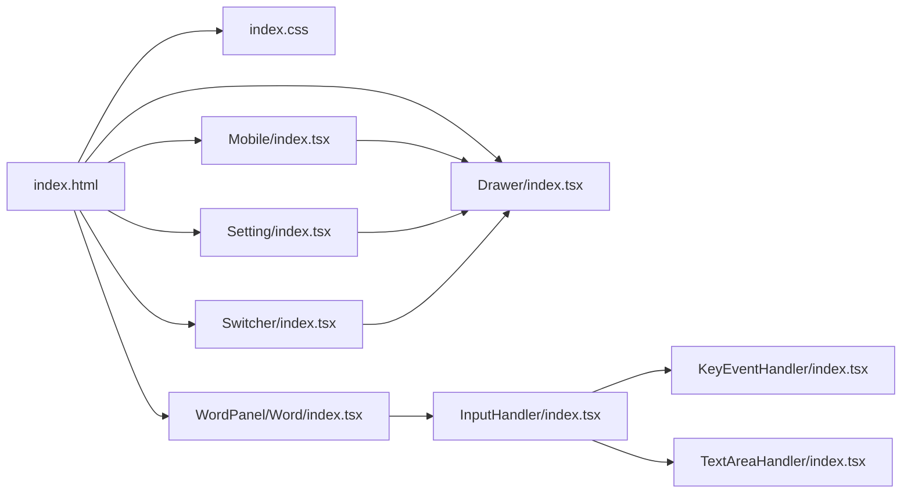

# 触摸交互优化

<cite>
**本文引用的文件**
- [index.html](file://index.html)
- [index.css](file://src/index.css)
- [Drawer/index.tsx](file://src/components/Drawer/index.tsx)
- [Mobile/index.tsx](file://src/pages/Mobile/index.tsx)
- [WordPanel/Word/index.tsx](file://src/pages/Typing/components/WordPanel/components/Word/index.tsx)
- [InputHandler/index.tsx](file://src/pages/Typing/components/WordPanel/components/InputHandler/index.tsx)
- [KeyEventHandler/index.tsx](file://src/pages/Typing/components/WordPanel/components/KeyEventHandler/index.tsx)
- [TextAreaHandler/index.tsx](file://src/pages/Typing/components/WordPanel/components/TextAreaHandler/index.tsx)
- [Setting/index.tsx](file://src/pages/Typing/components/Setting/index.tsx)
- [Switcher/index.tsx](file://src/pages/Typing/components/Switcher/index.tsx)
- [useWindowSize.tsx](file://src/hooks/useWindowSize.tsx)
- [useIntersectionObserver.ts](file://src/hooks/useIntersectionObserver.ts)
- [useSpeech.ts](file://src/hooks/useSpeech.ts)
- [index.ts（utils）](file://src/utils/index.ts)
</cite>

## 目录

1. [引言](#引言)
2. [项目结构](#项目结构)
3. [核心组件](#核心组件)
4. [架构总览](#架构总览)
5. [详细组件分析](#详细组件分析)
6. [依赖关系分析](#依赖关系分析)
7. [性能考量](#性能考量)
8. [故障排查指南](#故障排查指南)
9. [结论](#结论)
10. [附录](#附录)

## 引言

本文件面向移动端触摸交互优化，围绕以下目标展开：手势识别（点击、滑动、长按）、抽屉导航组件的滑动手势与动画边界控制、点击延迟优化（touch-action 与快速响应）、虚拟键盘适配（键盘弹起时的布局与焦点处理）、触摸性能优化（事件委托、防抖节流、内存泄漏防护），并提供调试方法与实践建议，帮助开发者实现流畅的移动端交互体验。

## 项目结构

本项目采用前端单页应用结构，典型模块划分如下：

- 页面层：Typing 打字练习、Mobile 移动端展示页等
- 组件层：通用 UI 组件（如 Drawer 抽屉）、Typing 子组件（WordPanel、InputHandler 等）
- 工具与 Hook：窗口尺寸监听、交集观察器、语音合成、通用工具函数
- 样式层：全局样式与 Tailwind 类组合，统一交互态与视觉反馈

图表来源

- [Mobile/index.tsx](file://src/pages/Mobile/index.tsx#L1-L120)
- [Drawer/index.tsx](file://src/components/Drawer/index.tsx#L1-L69)
- [WordPanel/Word/index.tsx](file://src/pages/Typing/components/WordPanel/components/Word/index.tsx#L1-L120)
- [InputHandler/index.tsx](file://src/pages/Typing/components/WordPanel/components/InputHandler/index.tsx#L1-L46)
- [KeyEventHandler/index.tsx](file://src/pages/Typing/components/WordPanel/components/KeyEventHandler/index.tsx#L1-L36)
- [TextAreaHandler/index.tsx](file://src/pages/Typing/components/WordPanel/components/TextAreaHandler/index.tsx#L1-L54)
- [Setting/index.tsx](file://src/pages/Typing/components/Setting/index.tsx#L31-L150)
- [Switcher/index.tsx](file://src/pages/Typing/components/Switcher/index.tsx#L74-L99)
- [useWindowSize.tsx](file://src/hooks/useWindowSize.tsx#L1-L29)
- [useIntersectionObserver.ts](file://src/hooks/useIntersectionObserver.ts#L1-L42)
- [useSpeech.ts](file://src/hooks/useSpeech.ts#L1-L40)
- [index.ts（utils）](file://src/utils/index.ts#L1-L129)
- [index.css](file://src/index.css#L1-L208)
- [index.html](file://index.html#L76-L92)

章节来源

- [index.html](file://index.html#L76-L92)
- [index.css](file://src/index.css#L1-L208)
- [Drawer/index.tsx](file://src/components/Drawer/index.tsx#L1-L69)
- [Mobile/index.tsx](file://src/pages/Mobile/index.tsx#L1-L120)
- [WordPanel/Word/index.tsx](file://src/pages/Typing/components/WordPanel/components/Word/index.tsx#L1-L120)
- [InputHandler/index.tsx](file://src/pages/Typing/components/WordPanel/components/InputHandler/index.tsx#L1-L46)
- [KeyEventHandler/index.tsx](file://src/pages/Typing/components/WordPanel/components/KeyEventHandler/index.tsx#L1-L36)
- [TextAreaHandler/index.tsx](file://src/pages/Typing/components/WordPanel/components/TextAreaHandler/index.tsx#L1-L54)
- [Setting/index.tsx](file://src/pages/Typing/components/Setting/index.tsx#L31-L150)
- [Switcher/index.tsx](file://src/pages/Typing/components/Switcher/index.tsx#L74-L99)
- [useWindowSize.tsx](file://src/hooks/useWindowSize.tsx#L1-L29)
- [useIntersectionObserver.ts](file://src/hooks/useIntersectionObserver.ts#L1-L42)
- [useSpeech.ts](file://src/hooks/useSpeech.ts#L1-L40)
- [index.ts（utils）](file://src/utils/index.ts#L1-L129)

## 核心组件

- 抽屉导航组件 Drawer：基于 Headless UI 的 Dialog/Transition 实现，支持从 left/right/top/bottom 进入，内置淡入淡出与位移过渡，适合移动端侧滑呼出场景。
- 移动端轮播图：通过容器 transform 位移与定时器实现自动轮播，包含边界回弹与无缝衔接逻辑。
- 打字输入链路：InputHandler 根据词典语言选择 KeyEventHandler 或 TextAreaHandler；前者监听键盘事件，后者聚焦 textarea 以触发原生输入法与 composition 事件。
- 设置面板：基于 Headless UI 对话框与标签页，提供声音、视图、数据等设置项。
- 交互辅助 Hook：useWindowSize、useIntersectionObserver、useSpeech 等，用于窗口尺寸监听、可见性观测与语音播报。

章节来源

- [Drawer/index.tsx](file://src/components/Drawer/index.tsx#L1-L69)
- [Mobile/index.tsx](file://src/pages/Mobile/index.tsx#L1-L120)
- [InputHandler/index.tsx](file://src/pages/Typing/components/WordPanel/components/InputHandler/index.tsx#L1-L46)
- [KeyEventHandler/index.tsx](file://src/pages/Typing/components/WordPanel/components/KeyEventHandler/index.tsx#L1-L36)
- [TextAreaHandler/index.tsx](file://src/pages/Typing/components/WordPanel/components/TextAreaHandler/index.tsx#L1-L54)
- [Setting/index.tsx](file://src/pages/Typing/components/Setting/index.tsx#L31-L150)
- [useWindowSize.tsx](file://src/hooks/useWindowSize.tsx#L1-L29)
- [useIntersectionObserver.ts](file://src/hooks/useIntersectionObserver.ts#L1-L42)
- [useSpeech.ts](file://src/hooks/useSpeech.ts#L1-L40)

## 架构总览

移动端触摸交互涉及“事件捕获—状态更新—UI 动画—无障碍与性能”的闭环。下图展示从页面到组件的关键交互路径与依赖：

图表来源

- [Mobile/index.tsx](file://src/pages/Mobile/index.tsx#L1-L120)
- [Drawer/index.tsx](file://src/components/Drawer/index.tsx#L1-L69)
- [WordPanel/Word/index.tsx](file://src/pages/Typing/components/WordPanel/components/Word/index.tsx#L1-L120)
- [InputHandler/index.tsx](file://src/pages/Typing/components/WordPanel/components/InputHandler/index.tsx#L1-L46)
- [KeyEventHandler/index.tsx](file://src/pages/Typing/components/WordPanel/components/KeyEventHandler/index.tsx#L1-L36)
- [TextAreaHandler/index.tsx](file://src/pages/Typing/components/WordPanel/components/TextAreaHandler/index.tsx#L1-L54)

## 详细组件分析

### 抽屉导航组件（Drawer）的触摸交互设计

- 滑动手势检测：当前实现未直接绑定 onTouchGesture，但通过 CSS 过渡与位置映射实现从 left/right/top/bottom 的进入/退出动画。若需手势检测，可在容器上添加 touch 事件监听，并结合位移阈值与方向判断实现滑动呼出/关闭。
- 动画过渡效果：使用 Headless UI Transition 的 enter/leave 配置，分别定义透明度与位移变换，保证滑动与遮罩的同步过渡。
- 边界处理：通过 transitionDirectionMap 映射不同方位的初始位移，避免初始闪动；在关闭时恢复到初始状态，形成自然边界。

图表来源

- [Drawer/index.tsx](file://src/components/Drawer/index.tsx#L1-L69)

章节来源

- [Drawer/index.tsx](file://src/components/Drawer/index.tsx#L1-L69)

### 移动端轮播图的滑动与边界处理

- 自动轮播：通过定时器推进 currentSlide，结合容器 transform 实现平滑切换。
- 边界处理：当到达末尾时，先瞬时跳转至首张并禁用过渡，再回到首张，形成无缝循环；其他情况按常规 transform 切换。
- 触摸交互：当前文件未直接绑定触摸事件，建议在容器上添加 touch 事件监听，根据 deltaX/时间计算惯性滚动与阈值判定，结合 CSS transition 控制动画。

图表来源

- [Mobile/index.tsx](file://src/pages/Mobile/index.tsx#L1-L120)

章节来源

- [Mobile/index.tsx](file://src/pages/Mobile/index.tsx#L1-L120)

### 打字输入链路与点击延迟优化

- 输入选择：InputHandler 根据词典语言选择 KeyEventHandler 或 TextAreaHandler。前者监听键盘事件，后者聚焦 textarea 以触发原生输入法与 composition 事件，避免自定义输入法的复杂性。
- 点击延迟优化：通过将输入焦点集中在 textarea 上，利用浏览器默认的触摸反馈与输入法行为，减少自定义事件处理带来的延迟；同时在按钮点击后主动 blur，降低后续点击事件的额外开销。
- 快速响应机制：在 WordPanel 中对输入进行即时状态更新与音效反馈，增强触觉反馈；对错误输入进行短延迟重置，避免卡顿。

图表来源

- [InputHandler/index.tsx](file://src/pages/Typing/components/WordPanel/components/InputHandler/index.tsx#L1-L46)
- [KeyEventHandler/index.tsx](file://src/pages/Typing/components/WordPanel/components/KeyEventHandler/index.tsx#L1-L36)
- [TextAreaHandler/index.tsx](file://src/pages/Typing/components/WordPanel/components/TextAreaHandler/index.tsx#L1-L54)
- [WordPanel/Word/index.tsx](file://src/pages/Typing/components/WordPanel/components/Word/index.tsx#L1-L120)

章节来源

- [InputHandler/index.tsx](file://src/pages/Typing/components/WordPanel/components/InputHandler/index.tsx#L1-L46)
- [KeyEventHandler/index.tsx](file://src/pages/Typing/components/WordPanel/components/KeyEventHandler/index.tsx#L1-L36)
- [TextAreaHandler/index.tsx](file://src/pages/Typing/components/WordPanel/components/TextAreaHandler/index.tsx#L1-L54)
- [WordPanel/Word/index.tsx](file://src/pages/Typing/components/WordPanel/components/Word/index.tsx#L1-L120)

### 虚拟键盘适配方案

- 键盘弹起时的布局调整：通过 useWindowSize 监听窗口尺寸变化，动态调整可视区域高度；在需要时将输入框置于可视区域内，避免被键盘遮挡。
- 输入框焦点处理：TextAreaHandler 在 Typing 状态切换时自动聚焦/失焦，确保输入法正常唤起与隐藏；点击按钮后主动 blur，减少后续点击事件的额外开销。
- 无障碍与可访问性：设置 aria-label 与 title 属性，保证屏幕阅读器可用；在对话框中使用 Headless UI 的 onClose 回调，确保键盘关闭时的状态一致性。

章节来源

- [useWindowSize.tsx](file://src/hooks/useWindowSize.tsx#L1-L29)
- [TextAreaHandler/index.tsx](file://src/pages/Typing/components/WordPanel/components/TextAreaHandler/index.tsx#L1-L54)
- [Setting/index.tsx](file://src/pages/Typing/components/Setting/index.tsx#L31-L150)
- [Switcher/index.tsx](file://src/pages/Typing/components/Switcher/index.tsx#L74-L99)

### 触摸性能优化技巧

- 事件委托：在页面根节点集中处理轻量级触摸事件（如抽屉开关），避免在大量子元素上重复绑定监听器。
- 防抖节流：对 resize、scroll、触摸拖拽等高频事件使用节流，限制帧率；对需要精确判断的滑动事件使用防抖，避免抖动导致的频繁状态切换。
- 内存泄漏防护：确保在组件卸载时移除所有事件监听器；对定时器、订阅与回调进行清理；在对话框关闭时解除相关事件绑定。
- CSS 硬件加速：优先使用 transform/opacity 等可由 GPU 加速的属性；合理设置 will-change 与 backface-visibility，减少重排与重绘。
- 交互态优化：统一使用 outline-none 或替代焦点样式，避免移动端点击态闪烁；在按钮点击后 blur，减少后续点击事件的额外开销。

章节来源

- [index.css](file://src/index.css#L1-L208)
- [index.html](file://index.html#L76-L92)
- [useIntersectionObserver.ts](file://src/hooks/useIntersectionObserver.ts#L1-L42)
- [useSpeech.ts](file://src/hooks/useSpeech.ts#L1-L40)

## 依赖关系分析

- 组件耦合：Drawer 与页面无直接耦合，仅通过 open/close 回调与类名控制；Mobile 轮播图与 WordPanel 输入链路相互独立，通过路由与状态管理连接。
- 外部依赖：Headless UI 用于对话框与过渡动画；Jotai 用于状态共享；React Hotkeys 用于快捷键；Tailwind 用于样式组织。
- 性能影响点：高频事件（resize、scroll、触摸）与大量 DOM 更新可能引发性能问题，需结合节流与最小化重渲染策略。

图表来源

- [index.html](file://index.html#L76-L92)
- [index.css](file://src/index.css#L1-L208)
- [Mobile/index.tsx](file://src/pages/Mobile/index.tsx#L1-L120)
- [Drawer/index.tsx](file://src/components/Drawer/index.tsx#L1-L69)
- [Setting/index.tsx](file://src/pages/Typing/components/Setting/index.tsx#L31-L150)
- [Switcher/index.tsx](file://src/pages/Typing/components/Switcher/index.tsx#L74-L99)
- [WordPanel/Word/index.tsx](file://src/pages/Typing/components/WordPanel/components/Word/index.tsx#L1-L120)
- [InputHandler/index.tsx](file://src/pages/Typing/components/WordPanel/components/InputHandler/index.tsx#L1-L46)
- [KeyEventHandler/index.tsx](file://src/pages/Typing/components/WordPanel/components/KeyEventHandler/index.tsx#L1-L36)
- [TextAreaHandler/index.tsx](file://src/pages/Typing/components/WordPanel/components/TextAreaHandler/index.tsx#L1-L54)

章节来源

- [index.html](file://index.html#L76-L92)
- [index.css](file://src/index.css#L1-L208)
- [Mobile/index.tsx](file://src/pages/Mobile/index.tsx#L1-L120)
- [Drawer/index.tsx](file://src/components/Drawer/index.tsx#L1-L69)
- [Setting/index.tsx](file://src/pages/Typing/components/Setting/index.tsx#L31-L150)
- [Switcher/index.tsx](file://src/pages/Typing/components/Switcher/index.tsx#L74-L99)
- [WordPanel/Word/index.tsx](file://src/pages/Typing/components/WordPanel/components/Word/index.tsx#L1-L120)
- [InputHandler/index.tsx](file://src/pages/Typing/components/WordPanel/components/InputHandler/index.tsx#L1-L46)
- [KeyEventHandler/index.tsx](file://src/pages/Typing/components/WordPanel/components/KeyEventHandler/index.tsx#L1-L36)
- [TextAreaHandler/index.tsx](file://src/pages/Typing/components/WordPanel/components/TextAreaHandler/index.tsx#L1-L54)

## 性能考量

- 事件频率控制：对触摸拖拽、滚动、窗口尺寸变化等高频事件使用节流；对需要精确判断的滑动事件使用防抖。
- 渲染最小化：将可由 CSS 控制的状态（如透明度、位移）用于动画，避免强制同步布局；减少不必要的状态更新与深层重渲染。
- 资源与内存：及时清理事件监听器、定时器与订阅；在对话框关闭时解除相关回调，防止内存泄漏。
- 无障碍与可访问性：统一焦点样式与键盘操作路径，避免因触摸优化导致的可访问性退化。

## 故障排查指南

- 抽屉无法滑动关闭：检查容器是否绑定了触摸事件；确认 transitionDirection 与初始位移一致；验证 onClose 回调是否被正确触发。
- 轮播图跳帧或卡顿：检查定时器间隔与 transform 过渡时间；确保在末尾切换时禁用过渡；避免在动画过程中频繁修改布局属性。
- 输入法冲突：确认 TextAreaHandler 是否在 Typing 状态切换时正确聚焦/失焦；避免在 composition 期间进行状态重置。
- 键盘遮挡输入框：使用 useWindowSize 监听窗口变化，动态调整可视区域；在按钮点击后主动 blur，减少后续点击事件的额外开销。
- 无障碍问题：为交互元素添加 aria-label/title；在对话框关闭时确保焦点回到触发按钮。

章节来源

- [Drawer/index.tsx](file://src/components/Drawer/index.tsx#L1-L69)
- [Mobile/index.tsx](file://src/pages/Mobile/index.tsx#L1-L120)
- [TextAreaHandler/index.tsx](file://src/pages/Typing/components/WordPanel/components/TextAreaHandler/index.tsx#L1-L54)
- [useWindowSize.tsx](file://src/hooks/useWindowSize.tsx#L1-L29)
- [Setting/index.tsx](file://src/pages/Typing/components/Setting/index.tsx#L31-L150)

## 结论

本项目在移动端交互方面已具备良好的基础：抽屉动画、轮播图切换、输入链路与对话框交互均通过现代前端技术实现。为进一步优化触摸体验，建议补充触摸手势检测与惯性滚动、完善事件节流与内存清理、加强无障碍与可访问性，并在关键路径引入硬件加速与最小化重渲染策略。

## 附录

- 触摸优化清单
  - 在抽屉与轮播图容器上添加触摸事件监听，实现滑动呼出/关闭与惯性滚动
  - 对高频事件使用节流/防抖，限制帧率与触发频率
  - 使用 transform/opacity 等 GPU 加速属性，减少重排重绘
  - 在组件卸载时清理事件监听器、定时器与订阅
  - 统一焦点样式与键盘操作路径，确保可访问性
