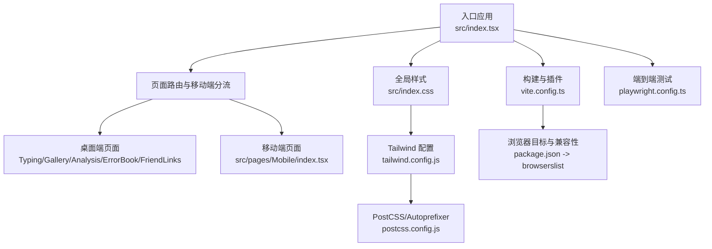
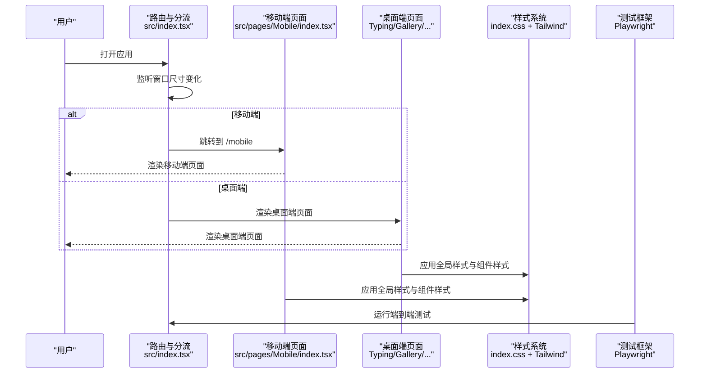
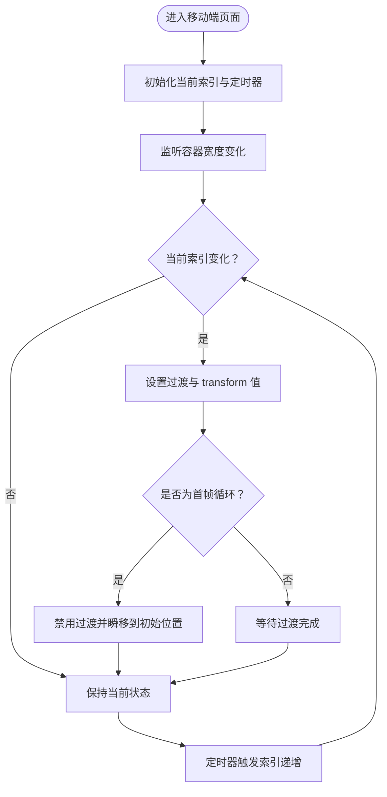
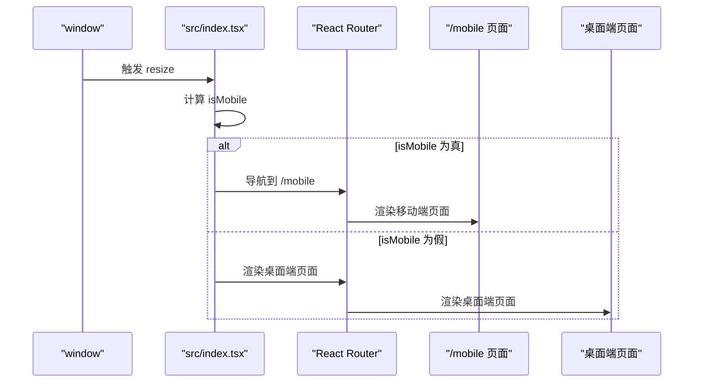
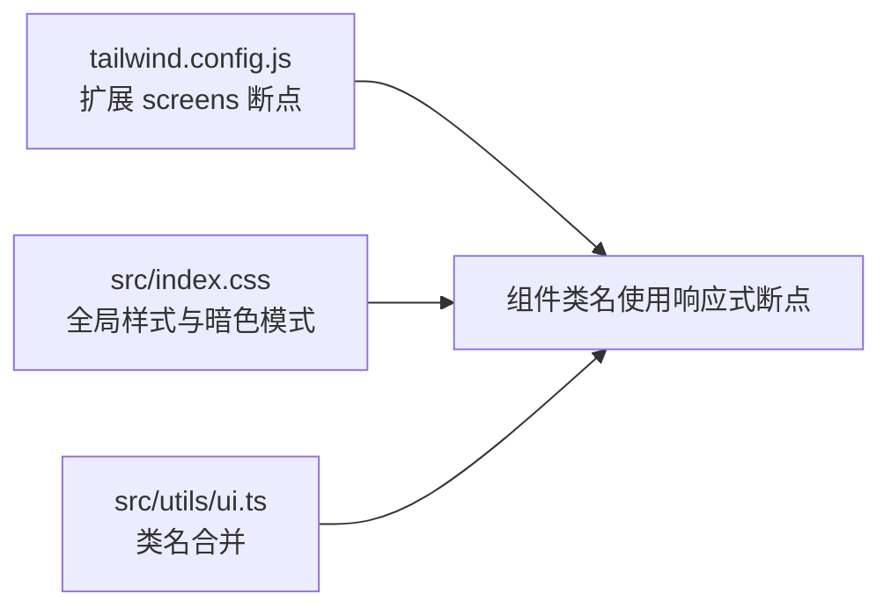
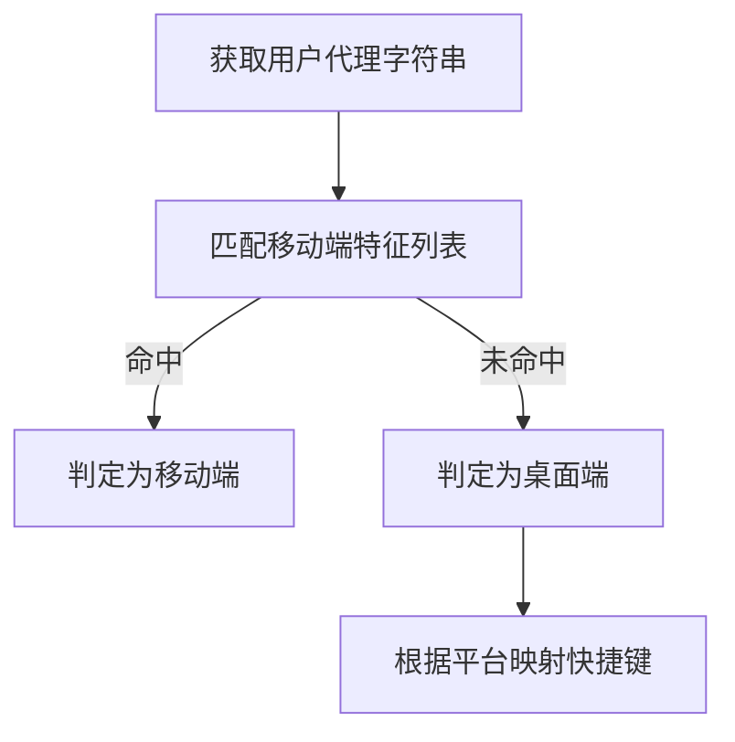
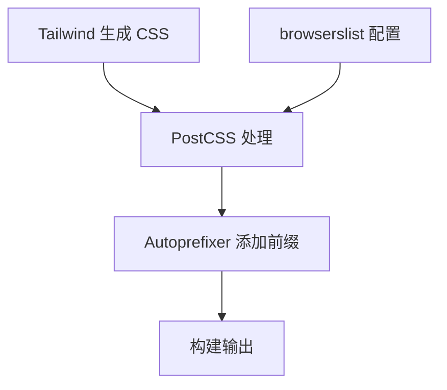
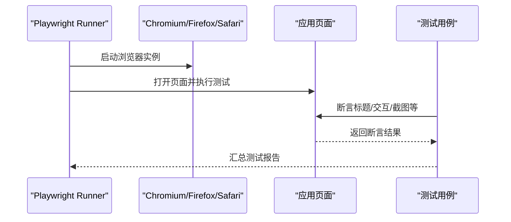
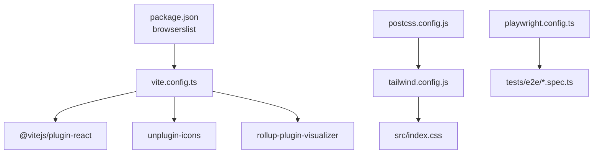

# 跨平台兼容性

<cite>
**本文引用的文件**
- [package.json](file://package.json)
- [vite.config.ts](file://vite.config.ts)
- [tailwind.config.js](file://tailwind.config.js)
- [postcss.config.js](file://postcss.config.js)
- [playwright.config.ts](file://playwright.config.ts)
- [src/index.tsx](file://src/index.tsx)
- [src/pages/Mobile/index.tsx](file://src/pages/Mobile/index.tsx)
- [src/hooks/useWindowSize.tsx](file://src/hooks/useWindowSize.tsx)
- [src/utils/index.ts](file://src/utils/index.ts)
- [src/utils/ui.ts](file://src/utils/ui.ts)
- [src/index.css](file://src/index.css)
- [tests/e2e/main.spec.ts](file://tests/e2e/main.spec.ts)
- [tests/e2e/practice.spec.ts](file://tests/e2e/practice.spec.ts)
</cite>

## 目录

1. [引言](#引言)
2. [项目结构](#项目结构)
3. [核心组件](#核心组件)
4. [架构总览](#架构总览)
5. [详细组件分析](#详细组件分析)
6. [依赖关系分析](#依赖关系分析)
7. [性能考量](#性能考量)
8. [故障排除指南](#故障排除指南)
9. [结论](#结论)
10. [附录](#附录)

## 引言

本文件聚焦于该代码库的跨平台兼容性实践，覆盖移动端与桌面端差异、浏览器兼容性（含 CSS 前缀与 polyfill）、屏幕适配策略（分辨率、像素密度、安全区域）、设备特性检测（触摸、权限与摄像头）、兼容性测试流程（自动化与真机调试）以及常见问题排查。文档以仓库现有实现为依据，结合可视化图表帮助读者快速定位问题与优化方向。

## 项目结构

该项目采用前端单页应用架构，构建工具链基于 Vite，样式使用 TailwindCSS，并通过 Playwright 进行端到端测试。移动端与桌面端通过路由与窗口尺寸判断进行分流；样式层通过 PostCSS 的 Autoprefixer 自动补齐浏览器前缀；构建配置启用最小化与生产环境优化。

**图表来源**

- [src/index.tsx](file://src/index.tsx#L35-L78)
- [src/pages/Mobile/index.tsx](file://src/pages/Mobile/index.tsx#L1-L120)
- [src/index.css](file://src/index.css#L1-L40)
- [tailwind.config.js](file://tailwind.config.js#L1-L78)
- [postcss.config.js](file://postcss.config.js#L1-L7)
- [vite.config.ts](file://vite.config.ts#L1-L55)
- [package.json](file://package.json#L75-L86)
- [playwright.config.ts](file://playwright.config.ts#L1-L79)

**章节来源**

- [package.json](file://package.json#L75-L86)
- [vite.config.ts](file://vite.config.ts#L1-L55)
- [tailwind.config.js](file://tailwind.config.js#L1-L78)
- [postcss.config.js](file://postcss.config.js#L1-L7)
- [playwright.config.ts](file://playwright.config.ts#L1-L79)
- [src/index.tsx](file://src/index.tsx#L35-L78)
- [src/pages/Mobile/index.tsx](file://src/pages/Mobile/index.tsx#L1-L120)
- [src/index.css](file://src/index.css#L1-L40)

## 核心组件

- 路由与平台分流：根据窗口宽度决定跳转至移动端或桌面端路由。
- 移动端页面：包含轮播图与功能卡片展示，使用内联样式与 Tailwind 类控制布局与动画。
- 屏幕尺寸监听 Hook：用于响应式 UI 的尺寸计算与状态更新。
- 工具函数：UA 判断、平台快捷键映射、类名合并等。
- 样式与主题：全局样式、暗色模式、自定义滚动条与 UI 组件样式。
- 测试配置：Playwright 项目配置，包含桌面端浏览器与可选移动端设备集。

**章节来源**

- [src/index.tsx](file://src/index.tsx#L35-L78)
- [src/pages/Mobile/index.tsx](file://src/pages/Mobile/index.tsx#L1-L120)
- [src/hooks/useWindowSize.tsx](file://src/hooks/useWindowSize.tsx#L1-L30)
- [src/utils/index.ts](file://src/utils/index.ts#L49-L61)
- [src/utils/ui.ts](file://src/utils/ui.ts#L1-L7)
- [src/index.css](file://src/index.css#L1-L40)
- [playwright.config.ts](file://playwright.config.ts#L1-L79)

## 架构总览

下图展示了从入口到页面渲染、样式与测试的整体流程，以及移动端与桌面端的分流机制。

**图表来源**

- [src/index.tsx](file://src/index.tsx#L35-L78)
- [src/pages/Mobile/index.tsx](file://src/pages/Mobile/index.tsx#L1-L120)
- [src/index.css](file://src/index.css#L1-L40)
- [playwright.config.ts](file://playwright.config.ts#L1-L79)

## 详细组件分析

### 组件一：移动端页面与轮播逻辑

移动端页面包含轮播图与功能卡片展示，轮播通过容器宽度与 transform 实现平滑过渡；在首尾切换时采用无过渡瞬移以实现循环视觉效果。

**图表来源**

- [src/pages/Mobile/index.tsx](file://src/pages/Mobile/index.tsx#L1-L120)

**章节来源**

- [src/pages/Mobile/index.tsx](file://src/pages/Mobile/index.tsx#L1-L120)

### 组件二：窗口尺寸监听与桌面/移动端分流

应用在入口处监听窗口尺寸变化，当宽度小于等于阈值时强制跳转至移动端路由，否则渲染桌面端页面。

**图表来源**

- [src/index.tsx](file://src/index.tsx#L35-L78)

**章节来源**

- [src/index.tsx](file://src/index.tsx#L35-L78)

### 组件三：屏幕适配与响应式策略

- Tailwind 断点扩展：自定义断点覆盖移动端典型宽度，便于在组件中使用响应式类。
- 全局样式：统一字体、滚动条与暗色模式背景，减少平台差异带来的视觉偏差。
- UI 工具：类名合并函数用于组合 Tailwind 与条件类，保证样式一致性。

**图表来源**

- [tailwind.config.js](file://tailwind.config.js#L58-L66)
- [src/index.css](file://src/index.css#L1-L40)
- [src/utils/ui.ts](file://src/utils/ui.ts#L1-L7)

**章节来源**

- [tailwind.config.js](file://tailwind.config.js#L58-L66)
- [src/index.css](file://src/index.css#L1-L40)
- [src/utils/ui.ts](file://src/utils/ui.ts#L1-L7)

### 组件四：设备特性检测与平台差异

- UA 检测：通过用户代理字符串判断是否为桌面环境，用于控制快捷键等交互行为。
- Mac 与非 Mac 快捷键映射：根据平台动态选择 Ctrl 或 Control。
- Touch/手势：移动端页面未直接使用触屏 API，但可通过事件模型与样式适配实现触摸友好交互。

**图表来源**

- [src/utils/index.ts](file://src/utils/index.ts#L49-L61)
- [src/utils/index.ts](file://src/utils/index.ts#L63-L66)

**章节来源**

- [src/utils/index.ts](file://src/utils/index.ts#L49-L61)
- [src/utils/index.ts](file://src/utils/index.ts#L63-L66)

### 组件五：浏览器兼容性与样式前缀

- Autoprefixer：通过 PostCSS 自动为 CSS 属性添加浏览器前缀，降低手动维护成本。
- 浏览器目标：通过 browserslist 配置指定目标浏览器范围，影响构建产物的兼容性与体积。

**图表来源**

- [postcss.config.js](file://postcss.config.js#L1-L7)
- [package.json](file://package.json#L75-L86)

**章节来源**

- [postcss.config.js](file://postcss.config.js#L1-L7)
- [package.json](file://package.json#L75-L86)

### 组件六：端到端测试与兼容性验证

- Playwright 项目：包含桌面端三大主流浏览器配置，便于验证跨浏览器一致性。
- 测试脚本：包含页面标题校验与练习流程的关键交互断言，可扩展为移动端设备集测试。

**图表来源**

- [playwright.config.ts](file://playwright.config.ts#L1-L79)
- [tests/e2e/main.spec.ts](file://tests/e2e/main.spec.ts#L1-L16)
- [tests/e2e/practice.spec.ts](file://tests/e2e/practice.spec.ts#L1-L122)

**章节来源**

- [playwright.config.ts](file://playwright.config.ts#L1-L79)
- [tests/e2e/main.spec.ts](file://tests/e2e/main.spec.ts#L1-L16)
- [tests/e2e/practice.spec.ts](file://tests/e2e/practice.spec.ts#L1-L122)

## 依赖关系分析

- 构建与兼容性：Vite 插件链路负责 JSX 编译、图标注入与可视化分析；browserslist 影响目标浏览器集合。
- 样式体系：Tailwind 提供原子化样式，PostCSS/Autoprefixer 自动补齐前缀；全局样式统一基础风格。
- 测试生态：Playwright 驱动多浏览器测试，便于发现跨浏览器差异。

**图表来源**

- [vite.config.ts](file://vite.config.ts#L1-L55)
- [package.json](file://package.json#L75-L86)
- [tailwind.config.js](file://tailwind.config.js#L1-L78)
- [postcss.config.js](file://postcss.config.js#L1-L7)
- [playwright.config.ts](file://playwright.config.ts#L1-L79)
- [tests/e2e/main.spec.ts](file://tests/e2e/main.spec.ts#L1-L16)
- [tests/e2e/practice.spec.ts](file://tests/e2e/practice.spec.ts#L1-L122)

**章节来源**

- [vite.config.ts](file://vite.config.ts#L1-L55)
- [package.json](file://package.json#L75-L86)
- [tailwind.config.js](file://tailwind.config.js#L1-L78)
- [postcss.config.js](file://postcss.config.js#L1-L7)
- [playwright.config.ts](file://playwright.config.ts#L1-L79)
- [tests/e2e/main.spec.ts](file://tests/e2e/main.spec.ts#L1-L16)
- [tests/e2e/practice.spec.ts](file://tests/e2e/practice.spec.ts#L1-L122)

## 性能考量

- 构建优化：生产环境启用最小化与 console/debugger 移除，有助于减小包体与提升加载性能。
- 样式体积：Tailwind 与 Autoprefixer 的组合在保证兼容性的同时需关注类名膨胀，建议结合可视化分析工具优化。
- 交互流畅度：移动端轮播过渡时间与 transform 使用合理，注意在低端设备上避免过度动画导致掉帧。

[本节为通用指导，无需列出具体文件来源]

## 故障排除指南

- 移动端无法进入移动端页面
  - 现象：调整窗口尺寸后未跳转至移动端路由。
  - 排查：确认窗口尺寸监听与跳转逻辑是否生效；检查路由 basename 与部署路径配置。
  - 参考
    - [src/index.tsx](file://src/index.tsx#L35-L78)
- 移动端轮播跳帧或卡顿
  - 现象：首尾切换时出现闪烁或过渡异常。
  - 排查：检查容器宽度计算与 transition 设置；确认无过渡瞬移时机与延迟。
  - 参考
    - [src/pages/Mobile/index.tsx](file://src/pages/Mobile/index.tsx#L1-L120)
- 样式在某些浏览器不生效
  - 现象：特定属性缺少前缀导致样式失效。
  - 排查：确认 PostCSS/Autoprefixer 是否启用；检查 browserslist 配置。
  - 参考
    - [postcss.config.js](file://postcss.config.js#L1-L7)
    - [package.json](file://package.json#L75-L86)
- 快捷键不符合预期
  - 现象：Mac 与 Windows 快捷键不一致。
  - 排查：确认平台判断与快捷键映射逻辑。
  - 参考
    - [src/utils/index.ts](file://src/utils/index.ts#L63-L66)
- 端到端测试失败
  - 现象：断言标题或交互失败。
  - 排查：核对测试页面 URL、元素选择器与断言条件；必要时开启重试与追踪。
  - 参考
    - [playwright.config.ts](file://playwright.config.ts#L1-L79)
    - [tests/e2e/main.spec.ts](file://tests/e2e/main.spec.ts#L1-L16)
    - [tests/e2e/practice.spec.ts](file://tests/e2e/practice.spec.ts#L1-L122)

**章节来源**

- [src/index.tsx](file://src/index.tsx#L35-L78)
- [src/pages/Mobile/index.tsx](file://src/pages/Mobile/index.tsx#L1-L120)
- [postcss.config.js](file://postcss.config.js#L1-L7)
- [package.json](file://package.json#L75-L86)
- [src/utils/index.ts](file://src/utils/index.ts#L63-L66)
- [playwright.config.ts](file://playwright.config.ts#L1-L79)
- [tests/e2e/main.spec.ts](file://tests/e2e/main.spec.ts#L1-L16)
- [tests/e2e/practice.spec.ts](file://tests/e2e/practice.spec.ts#L1-L122)

## 结论

本项目通过路由分流、Tailwind 响应式断点、PostCSS/Autoprefixer 与 Playwright 测试，形成了较为完善的跨平台兼容性基线。建议后续在移动端补充真实设备测试与触屏交互验证，并持续监控构建体积与关键路径性能，以进一步提升在多平台、多浏览器下的稳定性与体验。

[本节为总结性内容，无需列出具体文件来源]

## 附录

- 浏览器兼容性建议
  - 使用 browserslist 精确控制目标浏览器范围，避免过度 polyfill。
  - 对关键动画与交互使用 transform/opacity，减少重排。
- 移动端适配建议
  - 使用视口元标签与安全区域适配（如存在），并结合媒体查询与相对单位。
  - 避免固定宽高，优先使用流式布局与弹性容器。
- 权限与摄像头
  - 当前代码未涉及摄像头与地理定位权限调用，若引入相关功能，需遵循各平台隐私政策与权限申请流程。

[本节为通用指导，无需列出具体文件来源]
