# 基础配置管理

<cite>
**本文档引用的文件**
- [atomForConfig.ts](file://src/store/atomForConfig.ts)
- [index.ts](file://src/store/index.ts)
- [reviewInfoAtom.ts](file://src/store/reviewInfoAtom.ts)
- [index.ts](file://src/constants/index.ts)
- [index.ts](file://src/typings/index.ts)
- [SoundSetting.tsx](file://src/pages/Typing/components/Setting/SoundSetting.tsx)
- [DataSetting.tsx](file://src/pages/Typing/components/Setting/DataSetting.tsx)
</cite>

## 目录

1. [简介](#简介)
2. [项目结构](#项目结构)
3. [核心组件](#核心组件)
4. [架构概览](#架构概览)
5. [详细组件分析](#详细组件分析)
6. [依赖关系分析](#依赖关系分析)
7. [性能考虑](#性能考虑)
8. [故障排除指南](#故障排除指南)
9. [结论](#结论)

## 简介

基础配置管理系统是 Qwerty Learner 应用程序的核心基础设施，负责管理用户界面设置、学习偏好和应用程序行为配置。该系统基于 Jotai 状态管理库构建，提供了类型安全的配置状态管理、持久化存储和自动版本兼容性处理。

系统的主要特点包括：

- 原子化的配置状态管理
- 类型安全的配置验证
- 自动的默认值处理
- localStorage 持久化存储
- 版本兼容性保证
- 实时状态同步

## 项目结构

配置管理系统主要位于 `src/store` 目录中，采用模块化设计，每个配置项都有独立的原子状态管理器。

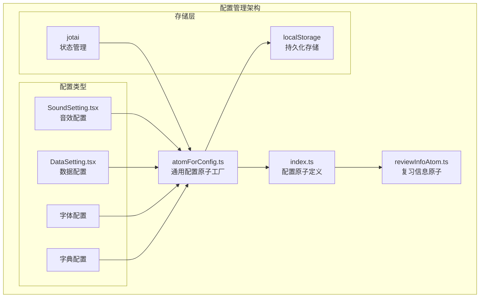

**图表来源**

- [atomForConfig.ts](file://src/store/atomForConfig.ts#L1-L45)
- [index.ts](file://src/store/index.ts#L1-L118)

**章节来源**

- [atomForConfig.ts](file://src/store/atomForConfig.ts#L1-L45)
- [index.ts](file://src/store/index.ts#L1-L118)

## 核心组件

### 通用配置原子工厂

`atomForConfig` 函数是整个配置管理系统的核心，它创建了一个通用的配置原子工厂，支持类型安全的配置管理和自动版本兼容性处理。

#### 主要特性

1. **类型安全检查**: 使用 TypeScript 泛型确保配置类型的正确性
2. **默认值处理**: 自动处理缺失的配置属性
3. **版本兼容性**: 检测配置格式变化并自动迁移
4. **持久化存储**: 透明地处理 localStorage 的读写操作

#### 关键实现模式

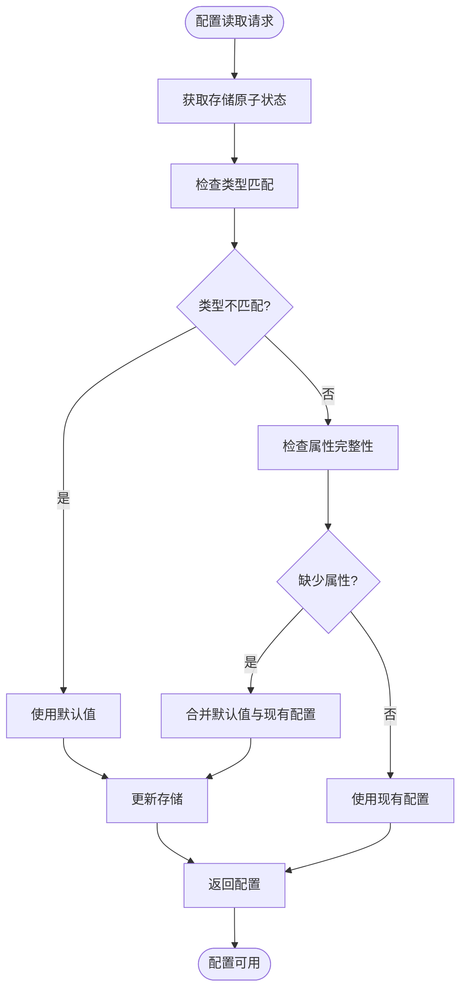

**图表来源**

- [atomForConfig.ts](file://src/store/atomForConfig.ts#L13-L43)

**章节来源**

- [atomForConfig.ts](file://src/store/atomForConfig.ts#L8-L44)

### 配置原子定义

主配置文件定义了所有应用程序的配置原子，包括音效、字体、字典等设置。

#### 配置分类

| 配置类别   | 原子名称                | 默认值       | 功能描述                               |
| ---------- | ----------------------- | ------------ | -------------------------------------- |
| 音效配置   | keySoundsConfigAtom     | 键盘音效设置 | 控制键盘按键音效的开关、音量和音效资源 |
| 发音配置   | pronunciationConfigAtom | 单词发音设置 | 管理单词发音的开关、音量、语速等       |
| 效果音配置 | hintSoundsConfigAtom    | 效果音设置   | 控制正确/错误音效的开关和音量          |
| 字体配置   | fontSizeConfigAtom      | 字体大小设置 | 管理外文和翻译文本的字体大小           |
| 字典配置   | currentDictIdAtom       | 当前字典 ID  | 存储用户选择的字典 ID                  |

**章节来源**

- [index.ts](file://src/store/index.ts#L32-L110)

## 架构概览

配置管理系统采用分层架构设计，确保了良好的可维护性和扩展性。

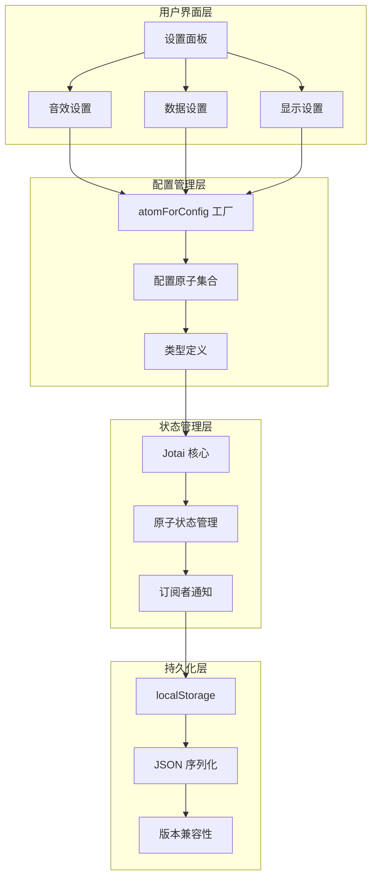

**图表来源**

- [index.ts](file://src/store/index.ts#L1-L118)
- [atomForConfig.ts](file://src/store/atomForConfig.ts#L1-L45)

## 详细组件分析

### 配置状态原子化管理

#### 类型安全机制

系统通过 TypeScript 泛型确保配置状态的类型安全：

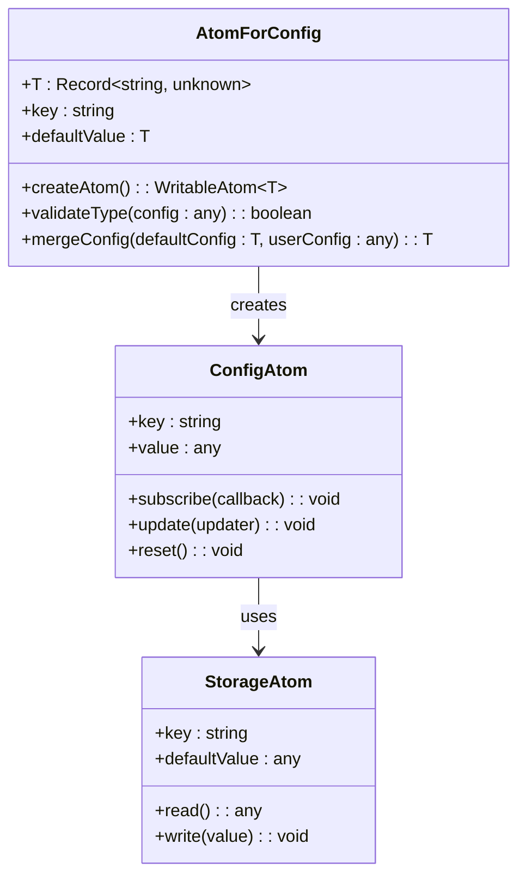

**图表来源**

- [atomForConfig.ts](file://src/store/atomForConfig.ts#L8-L44)

#### 配置状态生命周期

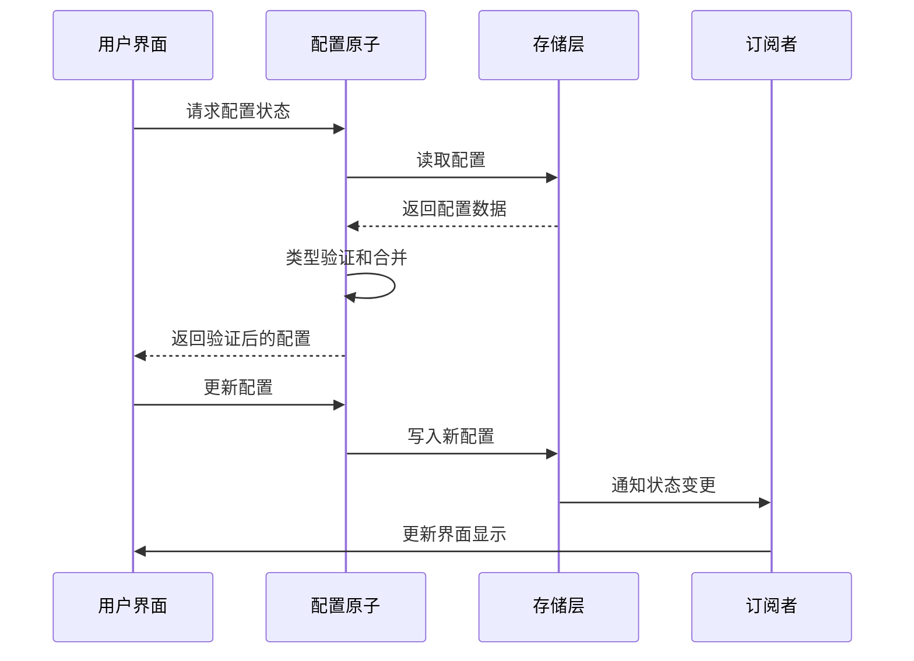

**图表来源**

- [atomForConfig.ts](file://src/store/atomForConfig.ts#L12-L43)

**章节来源**

- [atomForConfig.ts](file://src/store/atomForConfig.ts#L1-L45)

### 持久化存储实现

#### localStorage 数据序列化

系统使用 JSON 序列化机制处理配置数据的持久化存储：

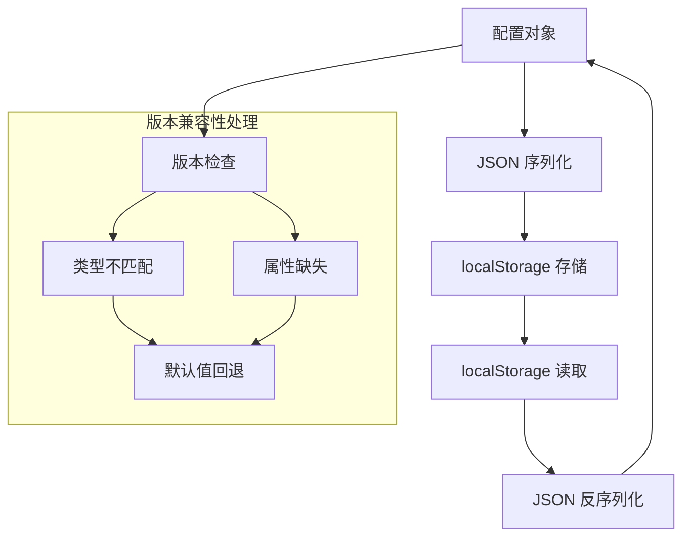

**图表来源**

- [atomForConfig.ts](file://src/store/atomForConfig.ts#L37-L40)

#### 版本兼容性处理策略

系统实现了多层次的版本兼容性检查：

1. **类型检查**: 确保配置数据类型与默认值一致
2. **属性完整性检查**: 验证配置对象是否包含所有必需属性
3. **自动回退机制**: 当检测到不兼容时，使用默认值替换

**章节来源**

- [atomForConfig.ts](file://src/store/atomForConfig.ts#L19-L35)

### 配置读取、更新和重置机制

#### 配置读取流程

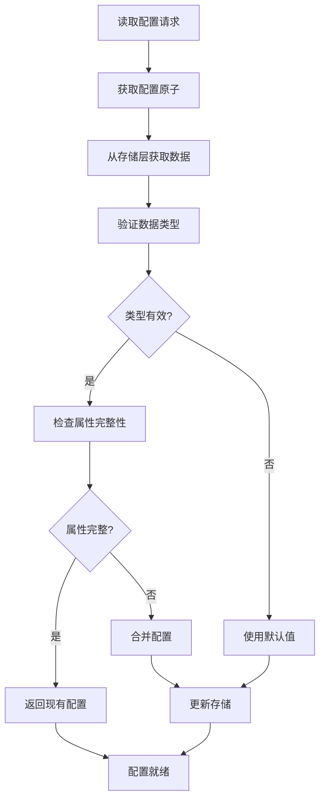

**图表来源**

- [atomForConfig.ts](file://src/store/atomForConfig.ts#L13-L43)

#### 配置更新机制

系统支持多种配置更新方式：

1. **直接赋值**: `setConfig(newValue)`
2. **函数式更新**: `setConfig(prev => {...})`
3. **部分更新**: `setConfig(prev => ({...prev, property}))`
4. **重置**: 使用 `RESET` 常量恢复默认值

**章节来源**

- [atomForConfig.ts](file://src/store/atomForConfig.ts#L6-L11)

### 配置同步和冲突解决

#### 同步策略

系统采用以下同步策略确保配置一致性：

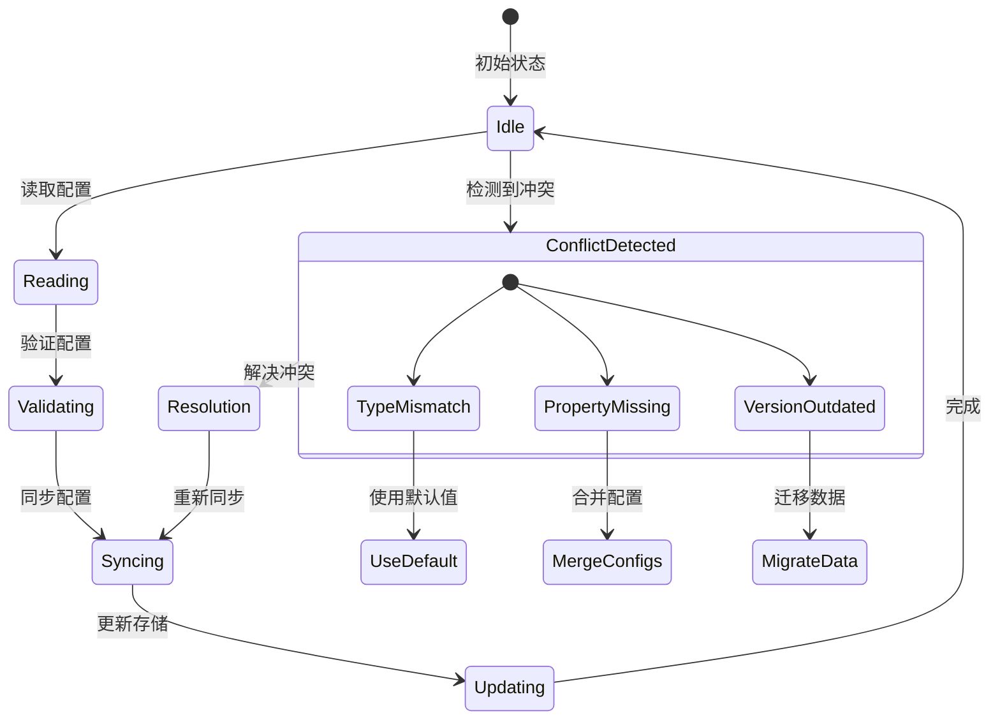

**图表来源**

- [atomForConfig.ts](file://src/store/atomForConfig.ts#L19-L35)

#### 冲突解决策略

当检测到配置冲突时，系统采用以下解决策略：

1. **类型不匹配**: 完全使用默认值替换
2. **属性缺失**: 合并默认值与现有配置
3. **版本过期**: 执行数据迁移程序

**章节来源**

- [atomForConfig.ts](file://src/store/atomForConfig.ts#L22-L35)

### 配置验证规则和错误处理

#### 验证规则

系统实施以下验证规则：

1. **类型验证**: 确保配置数据类型与预期一致
2. **范围验证**: 检查数值配置的合理范围
3. **枚举验证**: 验证枚举类型的配置值
4. **必填字段验证**: 确保关键配置字段存在

#### 错误处理机制

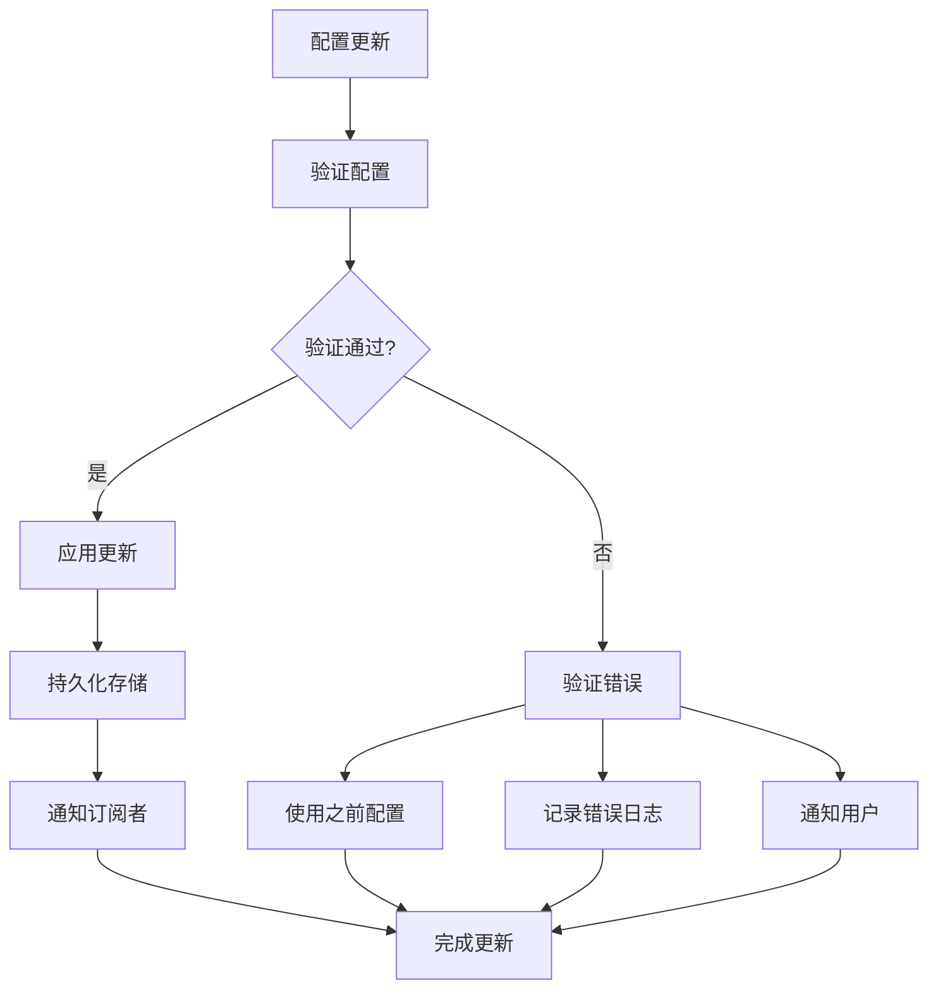

**图表来源**

- [atomForConfig.ts](file://src/store/atomForConfig.ts#L19-L35)

**章节来源**

- [atomForConfig.ts](file://src/store/atomForConfig.ts#L19-L40)

### 回滚机制

系统实现了完整的回滚机制以确保配置系统的稳定性：

#### 回滚触发条件

1. **配置损坏**: 检测到无法解析的配置数据
2. **类型不匹配**: 配置数据类型与期望不符
3. **验证失败**: 配置值超出允许范围
4. **存储错误**: 持久化过程中发生异常

#### 回滚过程

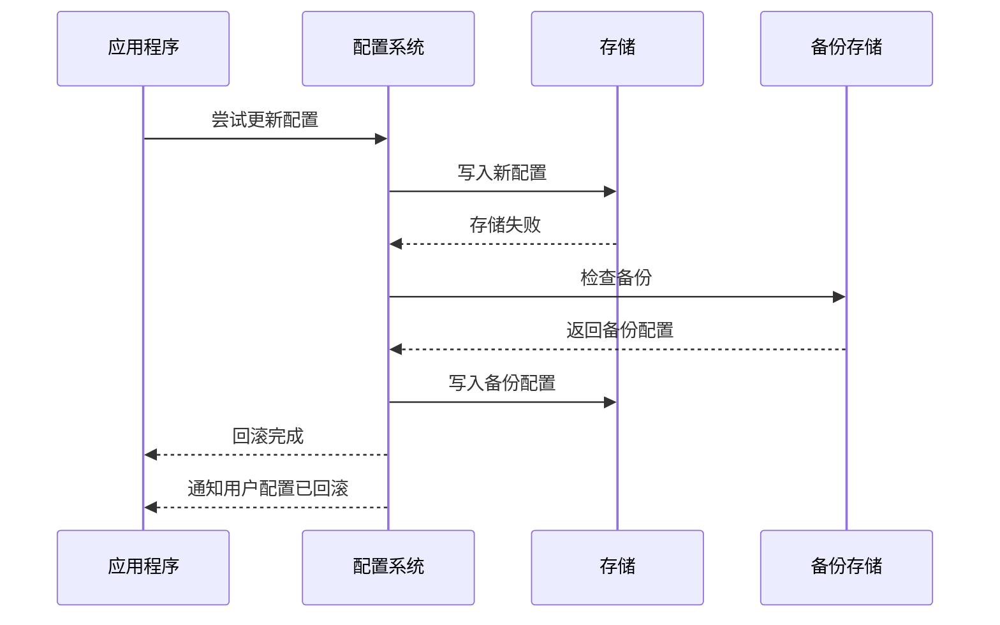

**图表来源**

- [atomForConfig.ts](file://src/store/atomForConfig.ts#L37-L40)

**章节来源**

- [atomForConfig.ts](file://src/store/atomForConfig.ts#L37-L40)

## 依赖关系分析

### 组件依赖图

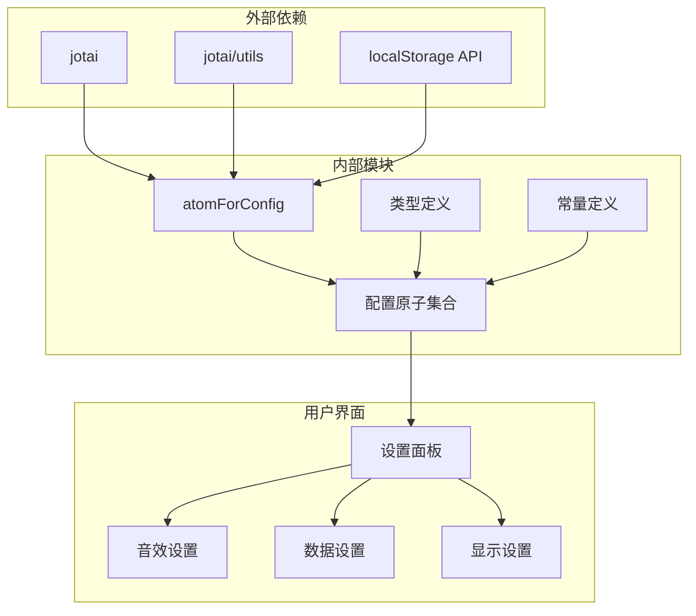

**图表来源**

- [index.ts](file://src/store/index.ts#L1-L18)
- [atomForConfig.ts](file://src/store/atomForConfig.ts#L1-L4)

### 循环依赖检测

系统设计避免了循环依赖：

- 配置原子只依赖于底层存储抽象
- UI 组件只依赖于配置原子
- 类型定义独立于实现逻辑

**章节来源**

- [index.ts](file://src/store/index.ts#L1-L118)
- [atomForConfig.ts](file://src/store/atomForConfig.ts#L1-L4)

## 性能考虑

### 性能优化策略

#### 原子状态优化

1. **细粒度状态分离**: 将不同配置项分离为独立的原子，减少不必要的重渲染
2. **批量更新**: 支持多个配置项的批量更新以减少存储操作次数
3. **缓存机制**: 利用 Jotai 的内置缓存机制提高状态访问性能

#### 存储性能优化

1. **延迟写入**: 对频繁更新的配置采用防抖机制减少存储压力
2. **增量更新**: 只更新发生变化的配置项而非整个配置对象
3. **压缩存储**: 对大型配置对象考虑使用压缩算法

#### 内存管理

1. **垃圾回收**: 及时清理不再使用的配置监听器
2. **内存泄漏防护**: 确保配置原子的生命周期管理
3. **弱引用**: 对大型配置对象使用弱引用避免内存占用

### 性能监控

建议实现以下性能监控指标：

- 配置读取延迟
- 存储操作频率
- 内存使用情况
- 渲染性能影响

## 故障排除指南

### 常见问题诊断

#### 配置丢失问题

**症状**: 用户发现配置在刷新后丢失

**可能原因**:

1. localStorage 权限问题
2. 浏览器隐私模式限制
3. 存储空间不足
4. 浏览器缓存清理

**解决方案**:

1. 检查浏览器控制台是否有存储错误
2. 验证 localStorage 可用性
3. 清理浏览器缓存
4. 检查磁盘空间

#### 配置不兼容问题

**症状**: 应用启动时出现配置错误或异常

**可能原因**:

1. 配置格式版本过旧
2. 新增配置字段未初始化
3. 数据类型转换错误

**解决方案**:

1. 触发配置自动迁移
2. 使用默认值回退
3. 清除损坏的配置数据

#### 性能问题

**症状**: 应用响应缓慢或内存占用过高

**可能原因**:

1. 配置监听器过多
2. 频繁的存储操作
3. 大型配置对象

**解决方案**:

1. 优化配置监听器数量
2. 实现存储操作节流
3. 分割大型配置对象

### 调试工具

#### 开发者工具

1. **Jotai DevTools**: 监控原子状态变化
2. **浏览器开发者工具**: 检查 localStorage 内容
3. **网络面板**: 监控存储操作

#### 日志记录

建议实现以下日志级别：

- 错误日志: 配置加载失败、存储异常
- 警告日志: 配置回退、版本警告
- 信息日志: 正常操作、状态变更

**章节来源**

- [atomForConfig.ts](file://src/store/atomForConfig.ts#L37-L40)

## 结论

基础配置管理系统通过 Jotai 原子状态管理提供了强大而灵活的配置管理能力。系统的设计充分考虑了类型安全、持久化存储、版本兼容性和性能优化等多个方面。

### 主要优势

1. **类型安全**: 完整的 TypeScript 支持确保编译时类型检查
2. **自动迁移**: 智能的版本兼容性处理减少维护成本
3. **性能优化**: 原子化设计提供高效的性能表现
4. **扩展性强**: 模块化架构便于功能扩展和维护

### 最佳实践建议

1. **配置设计**: 为每个配置项定义明确的默认值和验证规则
2. **版本管理**: 建立配置版本控制系统，确保向后兼容
3. **错误处理**: 实现完善的错误处理和回滚机制
4. **性能监控**: 建立性能监控体系，及时发现和解决问题

该系统为 Qwerty Learner 提供了稳定可靠的配置管理基础设施，支持应用程序的持续发展和用户需求的变化。
