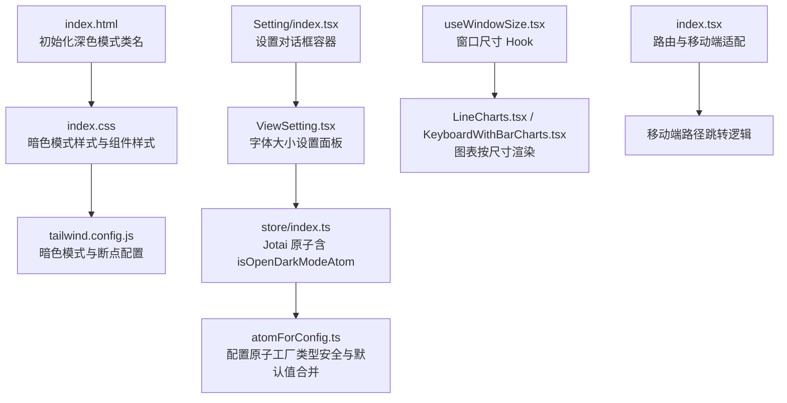
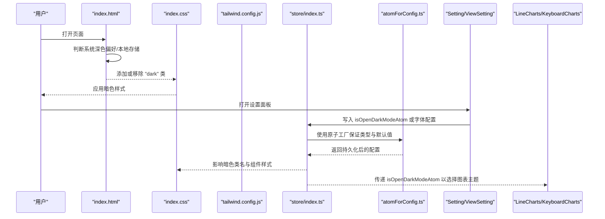
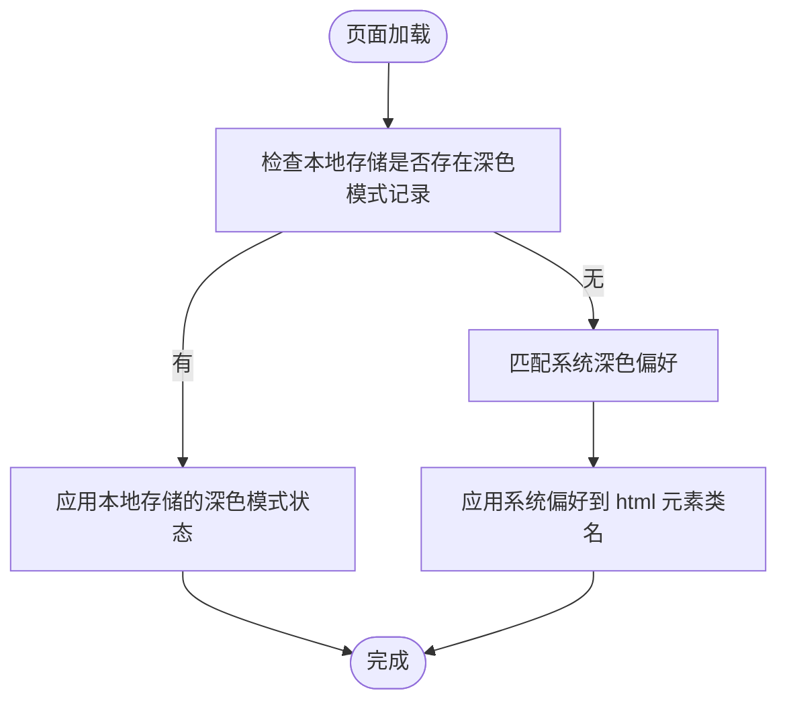
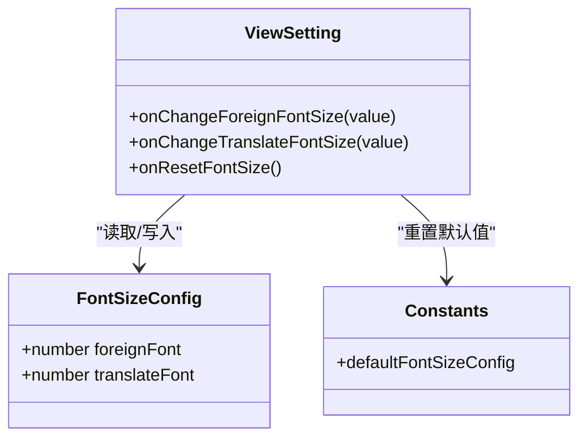
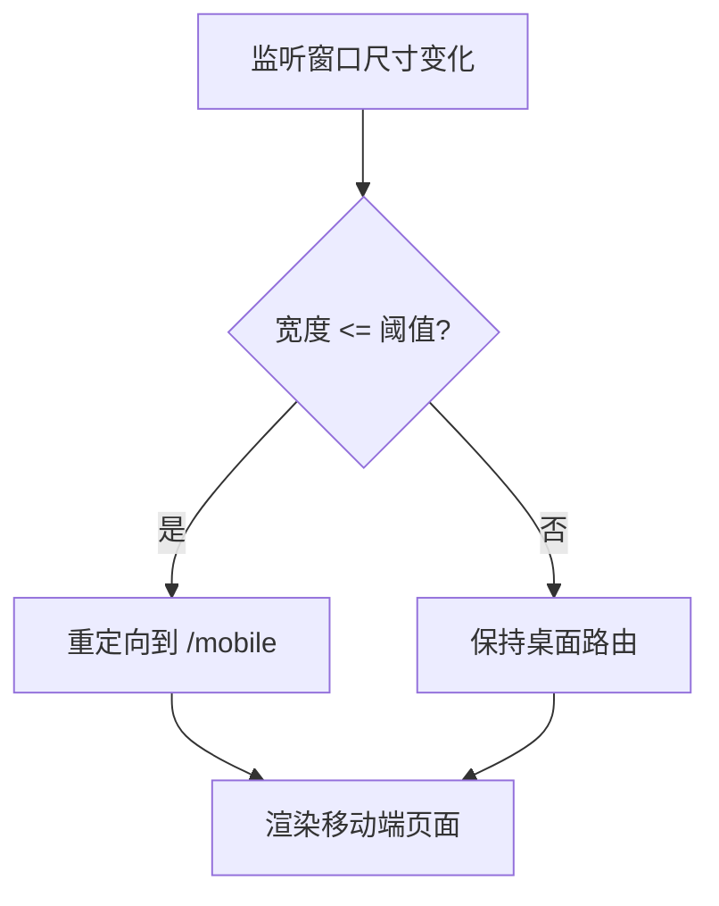
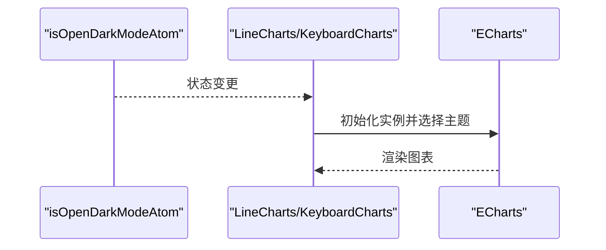
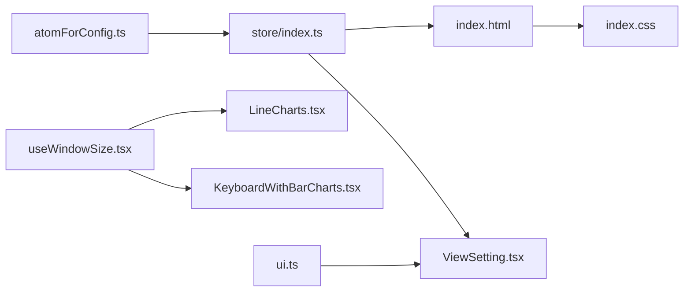

# 视图与主题配置

<cite>
**本文引用的文件**
- [index.html](file://index.html)
- [index.css](file://src/index.css)
- [tailwind.config.js](file://tailwind.config.js)
- [atomForConfig.ts](file://src/store/atomForConfig.ts)
- [store/index.ts](file://src/store/index.ts)
- [constants/index.ts](file://src/constants/index.ts)
- [ViewSetting.tsx](file://src/pages/Typing/components/Setting/ViewSetting.tsx)
- [Setting/index.tsx](file://src/pages/Typing/components/Setting/index.tsx)
- [useWindowSize.tsx](file://src/hooks/useWindowSize.tsx)
- [index.tsx](file://src/index.tsx)
- [theme.spec.ts](file://tests/e2e/theme.spec.ts)
- [LineCharts.tsx](file://src/pages/Analysis/components/LineCharts.tsx)
- [KeyboardWithBarCharts.tsx](file://src/pages/Analysis/components/KeyboardWithBarCharts.tsx)
- [purple.json](file://src/pages/Analysis/components/purple.json)
- [ui.ts](file://src/utils/ui.ts)
</cite>

## 目录

1. [引言](#引言)
2. [项目结构](#项目结构)
3. [核心组件](#核心组件)
4. [架构总览](#架构总览)
5. [详细组件分析](#详细组件分析)
6. [依赖关系分析](#依赖关系分析)
7. [性能考虑](#性能考虑)
8. [故障排查指南](#故障排查指南)
9. [结论](#结论)
10. [附录](#附录)

## 引言

本文件围绕“视图与主题配置”的实现进行系统化技术文档整理，重点覆盖以下方面：

- 主题切换机制：自动检测系统深色模式、手动切换、以及与系统主题的同步策略
- 视图布局配置：字体大小调整、颜色方案（主题）联动、显示密度控制
- 响应式设计：断点设置、移动端适配、窗口尺寸变化下的行为
- 无障碍访问：高对比度、键盘导航、屏幕阅读器兼容性建议
- 主题定制与动态样式更新：Tailwind 配置、暗色类名、图表主题
- 性能优化：状态持久化、原子粒度、事件监听去抖与资源释放

## 项目结构

本项目的主题与视图配置由多层协作完成：

- HTML 层负责初始化深色模式类名，并在页面加载时根据系统偏好或持久化状态应用
- 样式层通过 Tailwind 的暗色模式类与自定义 CSS 类实现主题切换
- 状态层使用 Jotai 原子持久化用户偏好（如字体大小、是否开启深色模式）
- 组件层提供设置面板与图表组件，基于状态驱动 UI 动态更新
- 响应式层通过 Tailwind 断点与窗口尺寸 Hook 实现不同设备的布局适配

**图示来源**

- [index.html](file://index.html#L185-L193)
- [index.css](file://src/index.css#L1-L95)
- [tailwind.config.js](file://tailwind.config.js#L1-L78)
- [store/index.ts](file://src/store/index.ts#L92-L92)
- [atomForConfig.ts](file://src/store/atomForConfig.ts#L1-L45)
- [ViewSetting.tsx](file://src/pages/Typing/components/Setting/ViewSetting.tsx#L1-L91)
- [Setting/index.tsx](file://src/pages/Typing/components/Setting/index.tsx#L1-L151)
- [useWindowSize.tsx](file://src/hooks/useWindowSize.tsx#L1-L29)
- [LineCharts.tsx](file://src/pages/Analysis/components/LineCharts.tsx#L1-L35)
- [KeyboardWithBarCharts.tsx](file://src/pages/Analysis/components/KeyboardWithBarCharts.tsx#L19-L75)
- [index.tsx](file://src/index.tsx#L35-L74)

**章节来源**

- [index.html](file://index.html#L185-L193)
- [index.css](file://src/index.css#L1-L95)
- [tailwind.config.js](file://tailwind.config.js#L1-L78)
- [store/index.ts](file://src/store/index.ts#L92-L92)
- [atomForConfig.ts](file://src/store/atomForConfig.ts#L1-L45)
- [ViewSetting.tsx](file://src/pages/Typing/components/Setting/ViewSetting.tsx#L1-L91)
- [Setting/index.tsx](file://src/pages/Typing/components/Setting/index.tsx#L1-L151)
- [useWindowSize.tsx](file://src/hooks/useWindowSize.tsx#L1-L29)
- [index.tsx](file://src/index.tsx#L35-L74)

## 核心组件

- 主题初始化与切换
  - HTML 在页面加载时根据系统偏好或本地存储决定是否添加暗色类名
  - 设置面板提供手动切换入口，配合 Jotai 原子持久化状态
- 字体大小配置
  - 设置面板提供滑块控件，分别调节“外语字体”和“中文字体”大小
  - 默认值来源于常量，重置按钮一键恢复默认
- 响应式与显示密度
  - Tailwind 断点覆盖常见桌面端场景；移动端路径跳转与窗口宽度监听确保体验一致
  - 图表组件根据窗口尺寸动态初始化实例，避免暗色模式下主题不匹配

**章节来源**

- [index.html](file://index.html#L185-L193)
- [store/index.ts](file://src/store/index.ts#L92-L92)
- [ViewSetting.tsx](file://src/pages/Typing/components/Setting/ViewSetting.tsx#L1-L91)
- [constants/index.ts](file://src/constants/index.ts#L15-L19)
- [index.tsx](file://src/index.tsx#L35-L74)
- [LineCharts.tsx](file://src/pages/Analysis/components/LineCharts.tsx#L1-L35)

## 架构总览

主题与视图配置的整体流程如下：

- 页面启动：HTML 判断系统深色偏好并应用暗色类名
- 用户交互：设置面板切换深色模式，状态写入本地存储
- 样式生效：CSS 使用暗色类名切换背景与文本颜色
- 视图联动：字体大小等配置通过 Jotai 原子驱动组件更新
- 响应式适配：断点与窗口尺寸 Hook 控制布局与图表渲染

**图示来源**

- [index.html](file://index.html#L185-L193)
- [index.css](file://src/index.css#L1-L95)
- [tailwind.config.js](file://tailwind.config.js#L1-L78)
- [store/index.ts](file://src/store/index.ts#L92-L92)
- [atomForConfig.ts](file://src/store/atomForConfig.ts#L1-L45)
- [ViewSetting.tsx](file://src/pages/Typing/components/Setting/ViewSetting.tsx#L1-L91)
- [LineCharts.tsx](file://src/pages/Analysis/components/LineCharts.tsx#L1-L35)

## 详细组件分析

### 主题切换机制

- 自动检测与初始化
  - 页面加载时，HTML 依据系统深色偏好或本地存储决定是否添加暗色类名
- 手动切换
  - 设置面板提供入口，切换后通过 Jotai 原子持久化状态
- 系统主题同步
  - 初始化阶段尊重系统偏好；后续可通过用户操作覆盖

**图示来源**

- [index.html](file://index.html#L185-L193)
- [store/index.ts](file://src/store/index.ts#L92-L92)

**章节来源**

- [index.html](file://index.html#L185-L193)
- [store/index.ts](file://src/store/index.ts#L92-L92)
- [theme.spec.ts](file://tests/e2e/theme.spec.ts#L1-L24)

### 视图布局配置（字体大小、颜色方案、显示密度）

- 字体大小调整
  - 设置面板提供两个独立滑块，分别控制“外语字体”和“中文字体”
  - 默认值来自常量，支持一键重置
- 颜色方案选择
  - 通过暗色类名切换整体配色；组件层广泛使用暗色变体类名
- 显示密度控制
  - Tailwind 提供断点与尺寸扩展，组件层使用响应式类名控制元素尺寸与间距

**图示来源**

- [ViewSetting.tsx](file://src/pages/Typing/components/Setting/ViewSetting.tsx#L1-L91)
- [constants/index.ts](file://src/constants/index.ts#L15-L19)

**章节来源**

- [ViewSetting.tsx](file://src/pages/Typing/components/Setting/ViewSetting.tsx#L1-L91)
- [constants/index.ts](file://src/constants/index.ts#L15-L19)
- [Setting/index.tsx](file://src/pages/Typing/components/Setting/index.tsx#L1-L151)

### 响应式设计配置策略

- 断点设置
  - Tailwind 定义了标准断点与额外字典专用断点，满足不同内容密度需求
- 移动端适配
  - 监听窗口宽度，当超过阈值时重定向至移动端路径，确保最佳体验
- 屏幕尺寸优化
  - 图表组件根据窗口尺寸初始化实例，避免暗色模式主题不一致

**图示来源**

- [index.tsx](file://src/index.tsx#L35-L74)
- [tailwind.config.js](file://tailwind.config.js#L58-L66)
- [useWindowSize.tsx](file://src/hooks/useWindowSize.tsx#L1-L29)
- [LineCharts.tsx](file://src/pages/Analysis/components/LineCharts.tsx#L1-L35)

**章节来源**

- [tailwind.config.js](file://tailwind.config.js#L58-L66)
- [index.tsx](file://src/index.tsx#L35-L74)
- [useWindowSize.tsx](file://src/hooks/useWindowSize.tsx#L1-L29)
- [LineCharts.tsx](file://src/pages/Analysis/components/LineCharts.tsx#L1-L35)

### 无障碍访问配置

- 高对比度模式
  - 通过暗色模式与 Tailwind 暗色变体类名实现高对比度视觉呈现
- 键盘导航支持
  - 设置面板使用 Headless UI 的 Tab/Dialog 组件，具备键盘可达性
- 屏幕阅读器兼容性
  - 组件使用语义化标签与可访问性属性，结合标题与图标描述提升可读性

**章节来源**

- [Setting/index.tsx](file://src/pages/Typing/components/Setting/index.tsx#L1-L151)
- [index.css](file://src/index.css#L58-L148)

### 主题定制与动态样式更新

- Tailwind 暗色模式
  - 通过类名切换实现主题切换；组件层广泛使用暗色变体类名
- 图表主题
  - 图表初始化时根据 isOpenDarkModeAtom 选择浅色或自定义“紫色”主题
- 动态样式更新
  - Jotai 原子持久化状态变更后，组件重新渲染，样式随之更新

**图示来源**

- [store/index.ts](file://src/store/index.ts#L92-L92)
- [LineCharts.tsx](file://src/pages/Analysis/components/LineCharts.tsx#L1-L35)
- [KeyboardWithBarCharts.tsx](file://src/pages/Analysis/components/KeyboardWithBarCharts.tsx#L19-L75)
- [purple.json](file://src/pages/Analysis/components/purple.json#L1-L206)

**章节来源**

- [store/index.ts](file://src/store/index.ts#L92-L92)
- [LineCharts.tsx](file://src/pages/Analysis/components/LineCharts.tsx#L1-L35)
- [KeyboardWithBarCharts.tsx](file://src/pages/Analysis/components/KeyboardWithBarCharts.tsx#L19-L75)
- [purple.json](file://src/pages/Analysis/components/purple.json#L1-L206)

## 依赖关系分析

- 状态持久化与类型安全
  - atomForConfig.ts 提供统一的配置原子工厂，确保类型正确与默认值合并
- 主题与视图联动
  - isOpenDarkModeAtom 与 index.html 的暗色类名、index.css 的暗色规则形成闭环
- 组件与工具函数
  - useWindowSize.tsx 为图表组件提供尺寸信息；cn 工具函数用于类名合并

**图示来源**

- [atomForConfig.ts](file://src/store/atomForConfig.ts#L1-L45)
- [store/index.ts](file://src/store/index.ts#L1-L118)
- [index.html](file://index.html#L185-L193)
- [index.css](file://src/index.css#L1-L95)
- [ViewSetting.tsx](file://src/pages/Typing/components/Setting/ViewSetting.tsx#L1-L91)
- [useWindowSize.tsx](file://src/hooks/useWindowSize.tsx#L1-L29)
- [LineCharts.tsx](file://src/pages/Analysis/components/LineCharts.tsx#L1-L35)
- [KeyboardWithBarCharts.tsx](file://src/pages/Analysis/components/KeyboardWithBarCharts.tsx#L19-L75)
- [ui.ts](file://src/utils/ui.ts#L1-L7)

**章节来源**

- [atomForConfig.ts](file://src/store/atomForConfig.ts#L1-L45)
- [store/index.ts](file://src/store/index.ts#L1-L118)
- [index.html](file://index.html#L185-L193)
- [index.css](file://src/index.css#L1-L95)
- [ViewSetting.tsx](file://src/pages/Typing/components/Setting/ViewSetting.tsx#L1-L91)
- [useWindowSize.tsx](file://src/hooks/useWindowSize.tsx#L1-L29)
- [LineCharts.tsx](file://src/pages/Analysis/components/LineCharts.tsx#L1-L35)
- [KeyboardWithBarCharts.tsx](file://src/pages/Analysis/components/KeyboardWithBarCharts.tsx#L19-L75)
- [ui.ts](file://src/utils/ui.ts#L1-L7)

## 性能考虑

- 状态持久化与最小化重渲染
  - 使用 Jotai 原子持久化配置，避免每次刷新丢失用户偏好
  - 原子工厂在读取时进行类型校验与默认值合并，减少异常状态导致的重渲染
- 事件监听与资源释放
  - 窗口尺寸监听在组件卸载时清理，防止内存泄漏
- 图表渲染优化
  - 图表实例按需销毁与重建，避免重复初始化造成性能损耗
- 样式与类名合并
  - 使用 cn 工具函数合并类名，减少不必要的样式冲突与重排

**章节来源**

- [atomForConfig.ts](file://src/store/atomForConfig.ts#L1-L45)
- [useWindowSize.tsx](file://src/hooks/useWindowSize.tsx#L1-L29)
- [LineCharts.tsx](file://src/pages/Analysis/components/LineCharts.tsx#L1-L35)
- [ui.ts](file://src/utils/ui.ts#L1-L7)

## 故障排查指南

- 主题切换无效
  - 检查 HTML 是否正确添加/移除暗色类名
  - 确认设置面板是否写入 isOpenDarkModeAtom 并持久化
- 字体设置未生效
  - 确认 ViewSetting 是否正确更新 fontSizeConfigAtom
  - 检查组件是否使用响应式类名或内联样式覆盖
- 图表主题不匹配
  - 确认 isOpenDarkModeAtom 的值与图表初始化主题一致
- 移动端跳转异常
  - 检查窗口宽度监听逻辑与路由重定向条件

**章节来源**

- [index.html](file://index.html#L185-L193)
- [store/index.ts](file://src/store/index.ts#L92-L92)
- [ViewSetting.tsx](file://src/pages/Typing/components/Setting/ViewSetting.tsx#L1-L91)
- [LineCharts.tsx](file://src/pages/Analysis/components/LineCharts.tsx#L1-L35)
- [index.tsx](file://src/index.tsx#L35-L74)

## 结论

本项目通过 HTML 初始化、Jotai 状态持久化、Tailwind 暗色模式与组件级响应式设计，构建了完整的主题与视图配置体系。主题切换支持自动检测、手动切换与系统同步；视图配置涵盖字体大小、颜色方案与显示密度；响应式策略结合断点与窗口尺寸 Hook 实现跨设备一致体验；同时在无障碍与性能方面提供了基础保障。未来可在高对比度模式与屏幕阅读器兼容性上进一步细化。

## 附录

- 关键配置项
  - 暗色模式原子：isOpenDarkModeAtom
  - 字体大小原子：fontSizeConfigAtom
  - Tailwind 暗色模式类：class
  - 自定义断点：sm/md/lg/xl/2xl 与字典专用断点

**章节来源**

- [store/index.ts](file://src/store/index.ts#L92-L92)
- [constants/index.ts](file://src/constants/index.ts#L15-L19)
- [tailwind.config.js](file://tailwind.config.js#L58-L66)
