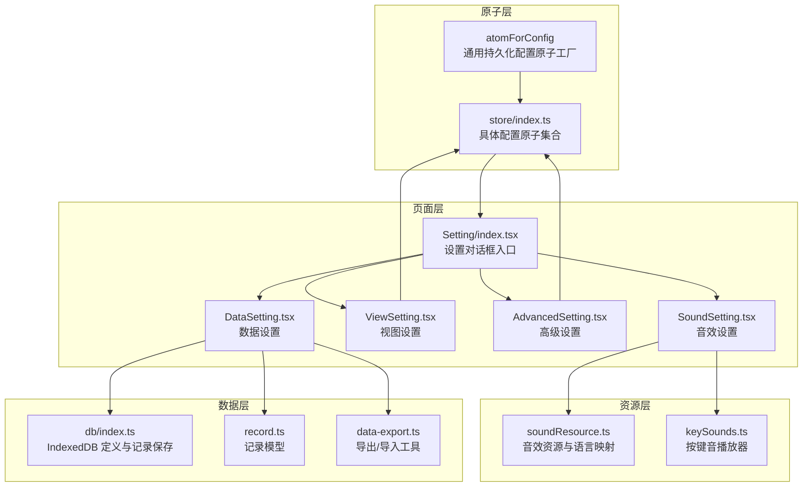
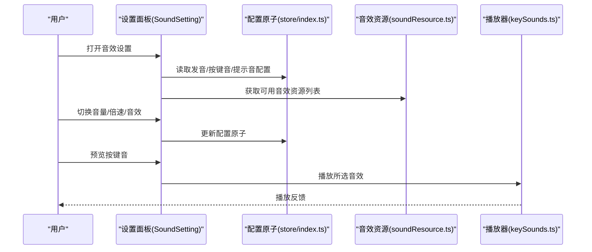
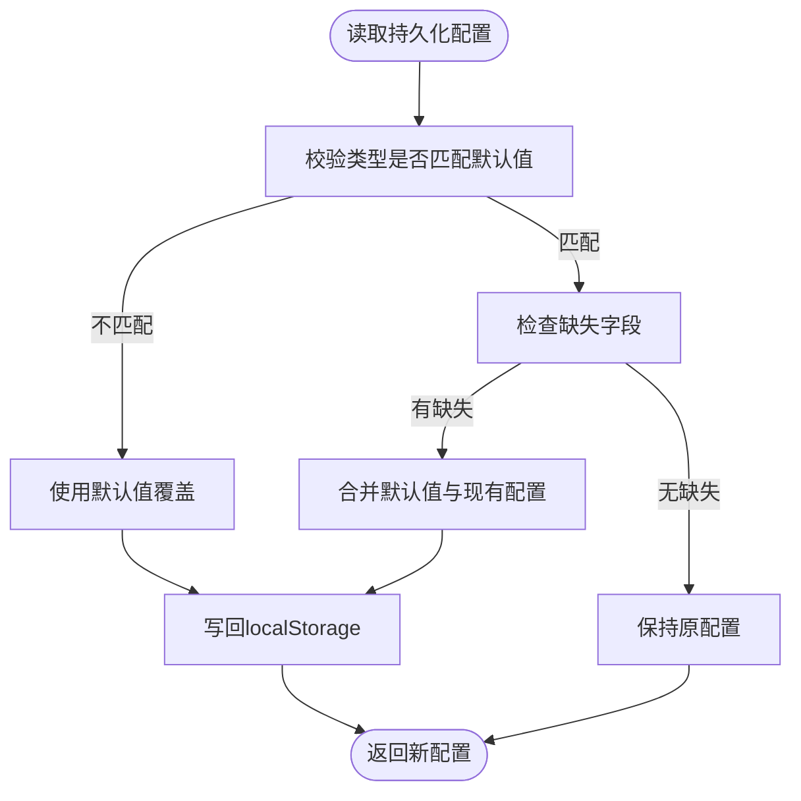
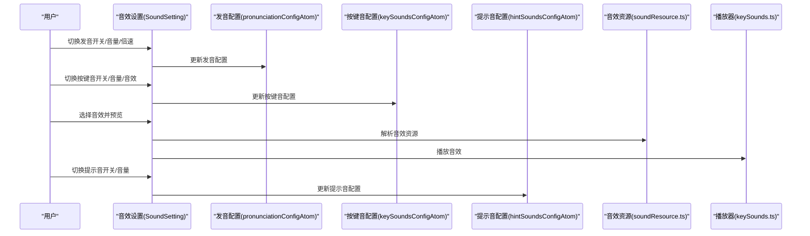
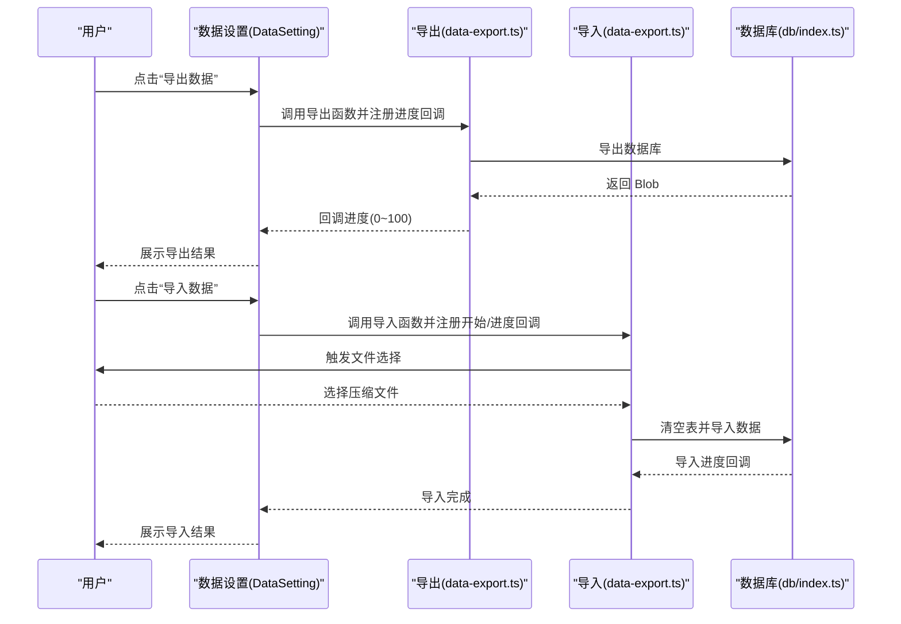
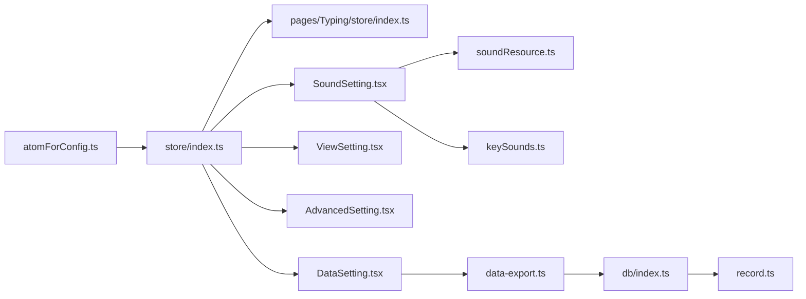

# 设置与配置系统

<cite>
**本文引用的文件**
- [src/store/atomForConfig.ts](file://src/store/atomForConfig.ts)
- [src/store/index.ts](file://src/store/index.ts)
- [src/pages/Typing/components/Setting/index.tsx](file://src/pages/Typing/components/Setting/index.tsx)
- [src/pages/Typing/components/Setting/SoundSetting.tsx](file://src/pages/Typing/components/Setting/SoundSetting.tsx)
- [src/pages/Typing/components/Setting/ViewSetting.tsx](file://src/pages/Typing/components/Setting/ViewSetting.tsx)
- [src/pages/Typing/components/Setting/AdvancedSetting.tsx](file://src/pages/Typing/components/Setting/AdvancedSetting.tsx)
- [src/pages/Typing/components/Setting/DataSetting.tsx](file://src/pages/Typing/components/Setting/DataSetting.tsx)
- [src/resources/soundResource.ts](file://src/resources/soundResource.ts)
- [src/utils/sounds/keySounds.ts](file://src/utils/sounds/keySounds.ts)
- [src/constants/index.ts](file://src/constants/index.ts)
- [src/typings/index.ts](file://src/typings/index.ts)
- [src/utils/db/data-export.ts](file://src/utils/db/data-export.ts)
- [src/utils/db/index.ts](file://src/utils/db/index.ts)
- [src/utils/db/record.ts](file://src/utils/db/record.ts)
- [src/pages/Typing/store/index.ts](file://src/pages/Typing/store/index.ts)
</cite>

## 目录

1. [简介](#简介)
2. [项目结构](#项目结构)
3. [核心组件](#核心组件)
4. [架构总览](#架构总览)
5. [详细组件分析](#详细组件分析)
6. [依赖关系分析](#依赖关系分析)
7. [性能考量](#性能考量)
8. [故障排查指南](#故障排查指南)
9. [结论](#结论)
10. [附录](#附录)

## 简介

本文件面向“设置与配置系统”的全面功能文档，覆盖用户偏好设置（音效配置、发音设置、视图配置等）的管理机制，解释配置状态的持久化存储、默认值管理与配置同步策略；阐述高级设置（性能调优、实验功能与开发者选项）的实现原理；并提供配置界面设计思路、用户体验优化与无障碍支持建议，以及配置迁移、重置与备份恢复的说明，最后给出面向开发者的扩展与定制化技术指导。

## 项目结构

设置与配置系统围绕前端状态管理库与页面组件展开，主要由以下层次构成：

- 原子层（原子配置）：基于轻量持久化原子，统一管理各类用户配置项，并负责默认值与字段兼容性校验。
- 页面层（设置面板）：提供音效、发音、视图、数据四大类设置面板，绑定原子状态并驱动实时更新。
- 资源层（音效资源与语言映射）：提供可选音效资源与发音类型映射，支撑配置面板的交互与播放。
- 数据层（本地数据库与导出导入）：封装本地 IndexedDB 记录模型与导出导入流程，支撑数据备份与恢复。

图表来源

- [src/store/atomForConfig.ts](file://src/store/atomForConfig.ts#L1-L45)
- [src/store/index.ts](file://src/store/index.ts#L1-L118)
- [src/pages/Typing/components/Setting/index.tsx](file://src/pages/Typing/components/Setting/index.tsx#L1-L151)
- [src/pages/Typing/components/Setting/SoundSetting.tsx](file://src/pages/Typing/components/Setting/SoundSetting.tsx#L1-L320)
- [src/pages/Typing/components/Setting/ViewSetting.tsx](file://src/pages/Typing/components/Setting/ViewSetting.tsx#L1-L91)
- [src/pages/Typing/components/Setting/AdvancedSetting.tsx](file://src/pages/Typing/components/Setting/AdvancedSetting.tsx#L1-L122)
- [src/pages/Typing/components/Setting/DataSetting.tsx](file://src/pages/Typing/components/Setting/DataSetting.tsx#L1-L128)
- [src/resources/soundResource.ts](file://src/resources/soundResource.ts#L1-L131)
- [src/utils/sounds/keySounds.ts](file://src/utils/sounds/keySounds.ts#L1-L14)
- [src/utils/db/index.ts](file://src/utils/db/index.ts#L1-L136)
- [src/utils/db/record.ts](file://src/utils/db/record.ts#L1-L186)
- [src/utils/db/data-export.ts](file://src/utils/db/data-export.ts#L1-L68)

章节来源

- [src/store/atomForConfig.ts](file://src/store/atomForConfig.ts#L1-L45)
- [src/store/index.ts](file://src/store/index.ts#L1-L118)
- [src/pages/Typing/components/Setting/index.tsx](file://src/pages/Typing/components/Setting/index.tsx#L1-L151)

## 核心组件

- 通用配置原子工厂：提供带默认值与类型/字段兼容性校验的持久化配置原子，确保配置升级时不会丢失或错配。
- 具体配置原子集合：集中定义音效、发音、视图、字典、章节、随机、忽略大小写、文本选择、悬停显示答案等配置项。
- 设置面板组件：按“音效设置/高级设置/视图设置/数据设置”分页组织，绑定对应原子状态，提供滑块、开关、列表选择等控件。
- 音效资源与播放：提供按键音、正确/错误提示音资源与发音类型映射，支持预览播放与实时切换。
- 数据导出导入：基于 IndexedDB 的导出/导入流程，支持进度回调、压缩与覆盖导入策略。

章节来源

- [src/store/atomForConfig.ts](file://src/store/atomForConfig.ts#L1-L45)
- [src/store/index.ts](file://src/store/index.ts#L1-L118)
- [src/pages/Typing/components/Setting/SoundSetting.tsx](file://src/pages/Typing/components/Setting/SoundSetting.tsx#L1-L320)
- [src/pages/Typing/components/Setting/AdvancedSetting.tsx](file://src/pages/Typing/components/Setting/AdvancedSetting.tsx#L1-L122)
- [src/pages/Typing/components/Setting/ViewSetting.tsx](file://src/pages/Typing/components/Setting/ViewSetting.tsx#L1-L91)
- [src/pages/Typing/components/Setting/DataSetting.tsx](file://src/pages/Typing/components/Setting/DataSetting.tsx#L1-L128)
- [src/resources/soundResource.ts](file://src/resources/soundResource.ts#L1-L131)
- [src/utils/sounds/keySounds.ts](file://src/utils/sounds/keySounds.ts#L1-L14)
- [src/utils/db/data-export.ts](file://src/utils/db/data-export.ts#L1-L68)

## 架构总览

设置与配置系统采用“原子状态 + 组件绑定 + 资源与数据工具”的分层架构：

- 原子层：统一持久化与默认值管理，保证配置健壮性。
- 页面层：设置对话框作为入口，各设置页签承载具体配置项。
- 资源层：音效与语言映射为配置面板提供素材与能力。
- 数据层：本地数据库与导出导入工具保障数据可迁移与可恢复。

图表来源

- [src/pages/Typing/components/Setting/SoundSetting.tsx](file://src/pages/Typing/components/Setting/SoundSetting.tsx#L1-L320)
- [src/store/index.ts](file://src/store/index.ts#L1-L118)
- [src/resources/soundResource.ts](file://src/resources/soundResource.ts#L1-L131)
- [src/utils/sounds/keySounds.ts](file://src/utils/sounds/keySounds.ts#L1-L14)

## 详细组件分析

### 配置原子工厂与默认值管理

- 设计要点
  - 使用持久化原子包装，键名隔离不同配置域。
  - 类型与字段兼容性校验：若类型不一致或缺少必要字段，回退到默认值并写回 localStorage。
  - 写入策略：仅在新旧配置不相等时才写入，避免不必要的存储写入。
- 默认值与字段演进
  - 通过工厂函数传入默认配置对象，确保新增字段自动补齐。
  - 适用于音效、发音、视图、随机、默写等多类配置。

图表来源

- [src/store/atomForConfig.ts](file://src/store/atomForConfig.ts#L1-L45)

章节来源

- [src/store/atomForConfig.ts](file://src/store/atomForConfig.ts#L1-L45)

### 音效配置（发音、按键音、提示音）

- 发音设置
  - 开关、音量、倍速、释义发音开关与释义音量控制。
  - 与语言映射联动，支持多种发音类型。
- 按键音设置
  - 开关、音量、音效资源选择，支持预览播放。
- 提示音设置
  - 开关、音量控制，分别支持正确/错误提示音资源。
- 无障碍与体验
  - 音量滑块禁用态随开关联动；预览按钮仅在交互时触发，避免后台持续播放。

图表来源

- [src/pages/Typing/components/Setting/SoundSetting.tsx](file://src/pages/Typing/components/Setting/SoundSetting.tsx#L1-L320)
- [src/store/index.ts](file://src/store/index.ts#L1-L118)
- [src/resources/soundResource.ts](file://src/resources/soundResource.ts#L1-L131)
- [src/utils/sounds/keySounds.ts](file://src/utils/sounds/keySounds.ts#L1-L14)

章节来源

- [src/pages/Typing/components/Setting/SoundSetting.tsx](file://src/pages/Typing/components/Setting/SoundSetting.tsx#L1-L320)
- [src/store/index.ts](file://src/store/index.ts#L1-L118)
- [src/resources/soundResource.ts](file://src/resources/soundResource.ts#L1-L131)
- [src/utils/sounds/keySounds.ts](file://src/utils/sounds/keySounds.ts#L1-L14)

### 发音类型与语言映射

- 支持语言与发音类型枚举，发音与音标映射关系明确。
- 配合配置面板中的发音类型选择，实现多语言发音切换。

章节来源

- [src/typings/index.ts](file://src/typings/index.ts#L1-L51)
- [src/resources/soundResource.ts](file://src/resources/soundResource.ts#L1-L131)

### 视图配置（字体大小）

- 字体设置
  - 外语字体与中文字体独立调节，支持重置为默认值。
- 默认值
  - 默认字体大小集中定义于常量模块，便于全局复用与一致性维护。

章节来源

- [src/pages/Typing/components/Setting/ViewSetting.tsx](file://src/pages/Typing/components/Setting/ViewSetting.tsx#L1-L91)
- [src/constants/index.ts](file://src/constants/index.ts#L1-L19)

### 高级设置（性能与实验选项）

- 功能概览
  - 章节乱序：开启后下一章节生效，影响单词顺序。
  - 上一个/下一个单词：练习中展示前后单词，辅助定位。
  - 忽略大小写：输入时不区分大小写。
  - 文本可选：允许鼠标选择文本。
  - 默写模式提示：hover 显示正确答案。
- 实现方式
  - 以上均为布尔开关，绑定至对应原子，直接驱动练习行为与界面渲染。

章节来源

- [src/pages/Typing/components/Setting/AdvancedSetting.tsx](file://src/pages/Typing/components/Setting/AdvancedSetting.tsx#L1-L122)
- [src/store/index.ts](file://src/store/index.ts#L1-L118)

### 数据设置（导出/导入/备份恢复）

- 导出
  - 导出 IndexedDB 数据，支持进度回调；导出内容经压缩并以日期命名。
- 导入
  - 支持覆盖导入，清空目标表并按进度回调更新 UI；导入完成后记录统计信息。
- 交互提示
  - 导出/导入过程提供进度条与百分比，明确覆盖风险与注意事项。

图表来源

- [src/pages/Typing/components/Setting/DataSetting.tsx](file://src/pages/Typing/components/Setting/DataSetting.tsx#L1-L128)
- [src/utils/db/data-export.ts](file://src/utils/db/data-export.ts#L1-L68)
- [src/utils/db/index.ts](file://src/utils/db/index.ts#L1-L136)

章节来源

- [src/pages/Typing/components/Setting/DataSetting.tsx](file://src/pages/Typing/components/Setting/DataSetting.tsx#L1-L128)
- [src/utils/db/data-export.ts](file://src/utils/db/data-export.ts#L1-L68)
- [src/utils/db/index.ts](file://src/utils/db/index.ts#L1-L136)
- [src/utils/db/record.ts](file://src/utils/db/record.ts#L1-L186)

### 配置界面设计思路与无障碍支持

- 设计思路
  - 分页式设置面板，清晰划分音效、高级、视图、数据四类设置。
  - 控件采用开关、滑块、下拉列表，配合预览与重置能力，提升易用性。
- 无障碍支持
  - 使用语义化标签与标题属性，为按钮与控件提供可读名称。
  - 预览按键音时避免后台持续播放，减少干扰。

章节来源

- [src/pages/Typing/components/Setting/index.tsx](file://src/pages/Typing/components/Setting/index.tsx#L1-L151)
- [src/pages/Typing/components/Setting/SoundSetting.tsx](file://src/pages/Typing/components/Setting/SoundSetting.tsx#L1-L320)
- [src/pages/Typing/components/Setting/ViewSetting.tsx](file://src/pages/Typing/components/Setting/ViewSetting.tsx#L1-L91)
- [src/pages/Typing/components/Setting/AdvancedSetting.tsx](file://src/pages/Typing/components/Setting/AdvancedSetting.tsx#L1-L122)
- [src/pages/Typing/components/Setting/DataSetting.tsx](file://src/pages/Typing/components/Setting/DataSetting.tsx#L1-L128)

### 配置状态持久化与同步机制

- 持久化
  - 使用持久化原子与 localStorage 存储，键名与配置域隔离，避免冲突。
- 同步与兼容
  - 类型与字段不一致时回退默认值并写回，确保升级后配置稳定。
- 与练习状态的耦合
  - 部分配置（如是否开启发音、是否忽略大小写）通过派生原子影响练习行为。

章节来源

- [src/store/atomForConfig.ts](file://src/store/atomForConfig.ts#L1-L45)
- [src/store/index.ts](file://src/store/index.ts#L1-L118)

### 配置迁移、重置与备份恢复

- 迁移
  - 通过默认值与字段补齐逻辑，实现配置版本升级时的平滑迁移。
- 重置
  - 视图设置提供重置按钮，一键恢复默认字体大小。
- 备份与恢复
  - 数据设置提供导出/导入能力，结合压缩与进度反馈，满足跨设备迁移需求。

章节来源

- [src/store/atomForConfig.ts](file://src/store/atomForConfig.ts#L1-L45)
- [src/pages/Typing/components/Setting/ViewSetting.tsx](file://src/pages/Typing/components/Setting/ViewSetting.tsx#L1-L91)
- [src/pages/Typing/components/Setting/DataSetting.tsx](file://src/pages/Typing/components/Setting/DataSetting.tsx#L1-L128)
- [src/utils/db/data-export.ts](file://src/utils/db/data-export.ts#L1-L68)

### 开发者扩展与定制化指导

- 新增配置项
  - 使用通用配置原子工厂创建新的配置原子，传入唯一键名与默认值对象。
  - 在设置面板中添加对应控件并绑定原子状态。
- 音效扩展
  - 在资源层增加音效文件与资源描述，更新资源列表即可在面板中选择。
- 数据迁移
  - 如需调整配置结构，利用默认值与字段补齐逻辑，确保向后兼容。
- 练习行为集成
  - 将配置项映射到练习状态或派生原子，通过 reducer 或上下文传播。

章节来源

- [src/store/atomForConfig.ts](file://src/store/atomForConfig.ts#L1-L45)
- [src/store/index.ts](file://src/store/index.ts#L1-L118)
- [src/pages/Typing/components/Setting/index.tsx](file://src/pages/Typing/components/Setting/index.tsx#L1-L151)
- [src/resources/soundResource.ts](file://src/resources/soundResource.ts#L1-L131)
- [src/pages/Typing/store/index.ts](file://src/pages/Typing/store/index.ts#L1-L227)

## 依赖关系分析

- 配置原子依赖
  - 具体配置原子依赖通用配置原子工厂与默认值常量。
- 设置面板依赖
  - 音效/视图/高级/数据设置分别依赖对应配置原子与资源/工具模块。
- 数据层依赖
  - 导出/导入工具依赖数据库实例与记录模型，导出时进行压缩与文件保存。

图表来源

- [src/store/atomForConfig.ts](file://src/store/atomForConfig.ts#L1-L45)
- [src/store/index.ts](file://src/store/index.ts#L1-L118)
- [src/pages/Typing/store/index.ts](file://src/pages/Typing/store/index.ts#L1-L227)
- [src/pages/Typing/components/Setting/SoundSetting.tsx](file://src/pages/Typing/components/Setting/SoundSetting.tsx#L1-L320)
- [src/pages/Typing/components/Setting/ViewSetting.tsx](file://src/pages/Typing/components/Setting/ViewSetting.tsx#L1-L91)
- [src/pages/Typing/components/Setting/AdvancedSetting.tsx](file://src/pages/Typing/components/Setting/AdvancedSetting.tsx#L1-L122)
- [src/pages/Typing/components/Setting/DataSetting.tsx](file://src/pages/Typing/components/Setting/DataSetting.tsx#L1-L128)
- [src/resources/soundResource.ts](file://src/resources/soundResource.ts#L1-L131)
- [src/utils/sounds/keySounds.ts](file://src/utils/sounds/keySounds.ts#L1-L14)
- [src/utils/db/data-export.ts](file://src/utils/db/data-export.ts#L1-L68)
- [src/utils/db/index.ts](file://src/utils/db/index.ts#L1-L136)
- [src/utils/db/record.ts](file://src/utils/db/record.ts#L1-L186)

章节来源

- [src/store/index.ts](file://src/store/index.ts#L1-L118)
- [src/pages/Typing/components/Setting/index.tsx](file://src/pages/Typing/components/Setting/index.tsx#L1-L151)

## 性能考量

- 原子写入去抖：仅在新旧配置不一致时写入 localStorage，降低频繁写入带来的性能损耗。
- 音效播放控制：预览播放时按需触发，避免后台持续播放造成资源占用。
- 导出导入异步：导出/导入采用异步流程与进度回调，避免阻塞主线程。
- 字体渲染：视图设置的字体调整为运行时样式变更，成本较低。

## 故障排查指南

- 配置未生效
  - 检查配置原子是否正确绑定至设置面板；确认默认值与字段补齐逻辑是否触发。
- 音效无法播放
  - 确认音效资源路径与文件是否存在；检查播放器初始化参数。
- 导出/导入失败
  - 导出：确认浏览器支持文件保存与压缩库；查看进度回调是否正常返回。
  - 导入：确认选择的文件格式与压缩包完整性；关注覆盖导入的风险提示。
- 练习行为异常
  - 检查高级设置中的开关项（如忽略大小写、文本可选、提示显示）是否符合预期。

章节来源

- [src/store/atomForConfig.ts](file://src/store/atomForConfig.ts#L1-L45)
- [src/utils/sounds/keySounds.ts](file://src/utils/sounds/keySounds.ts#L1-L14)
- [src/utils/db/data-export.ts](file://src/utils/db/data-export.ts#L1-L68)

## 结论

设置与配置系统通过统一的原子工厂与持久化策略，实现了用户偏好的可靠管理；通过分页设置面板与资源/数据工具，提供了完整的音效、发音、视图与数据迁移能力。系统在兼容性、可扩展性与用户体验方面均具备良好基础，适合进一步引入实验性功能与开发者选项。

## 附录

- 相关类型与枚举
  - 发音类型、音标类型、语言类别等类型定义，支撑配置面板的可选项与联动逻辑。

章节来源

- [src/typings/index.ts](file://src/typings/index.ts#L1-L51)
