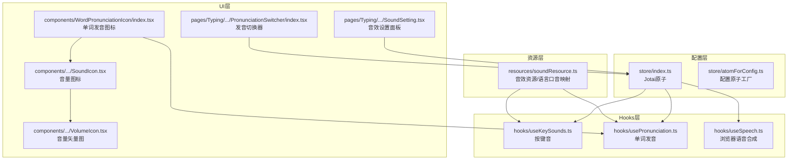
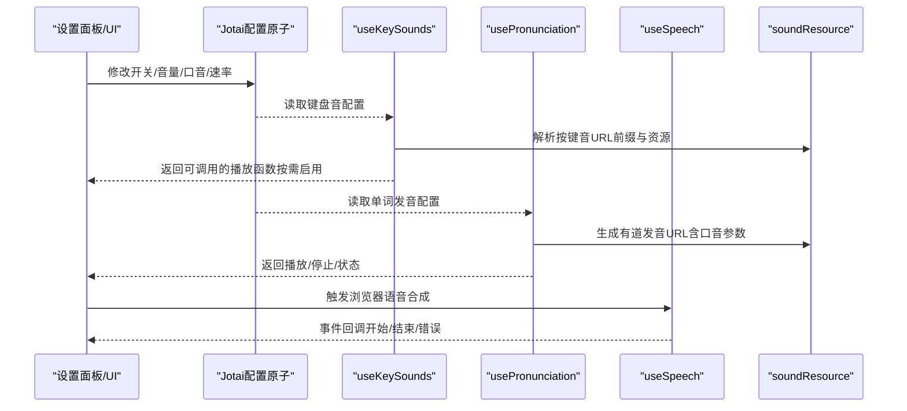
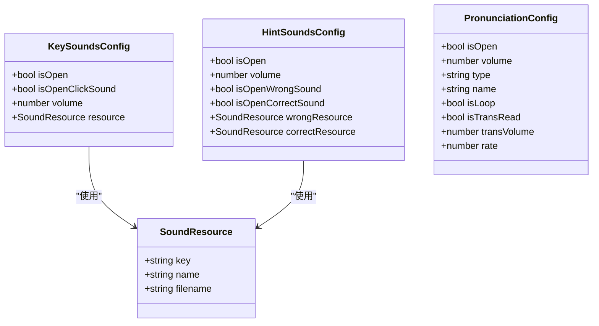
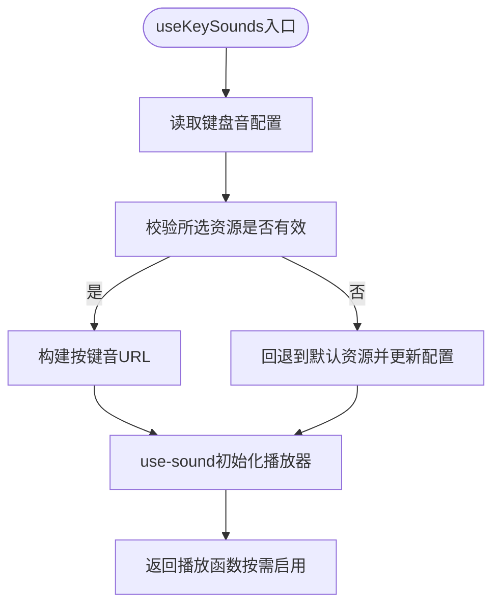
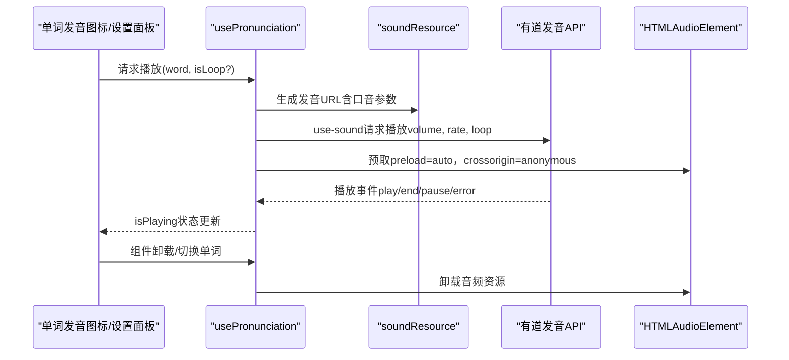
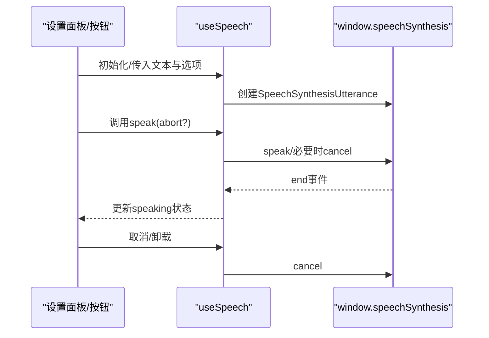
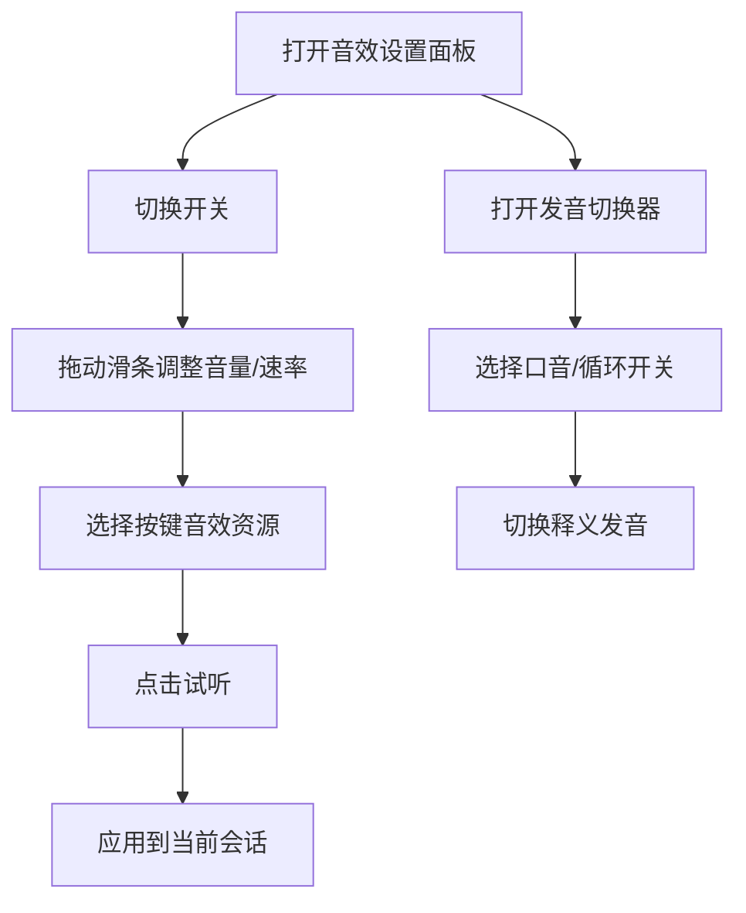
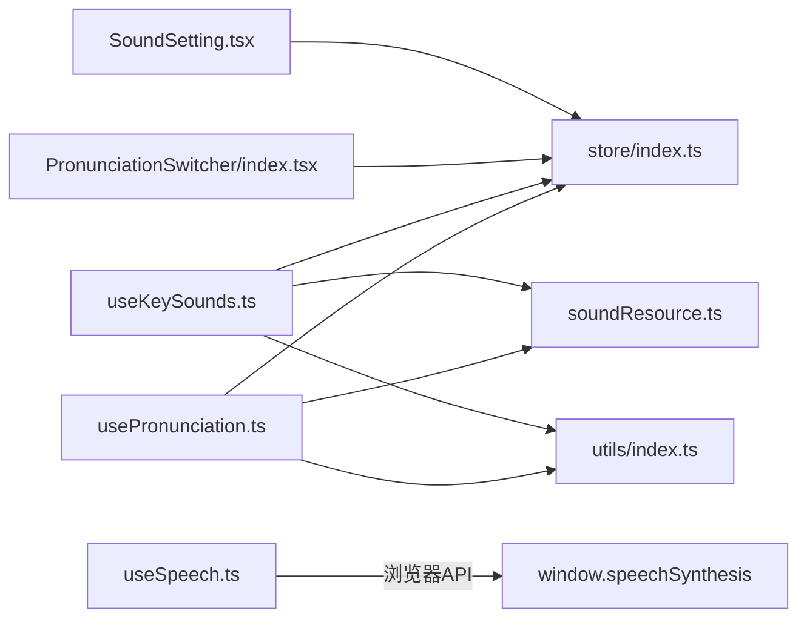

# 音效与发音配置

<cite>
**本文引用的文件**
- [useKeySounds.ts](file://src/hooks/useKeySounds.ts)
- [usePronunciation.ts](file://src/hooks/usePronunciation.ts)
- [useSpeech.ts](file://src/hooks/useSpeech.ts)
- [keySounds.ts](file://src/utils/sounds/keySounds.ts)
- [soundResource.ts](file://src/resources/soundResource.ts)
- [store/index.ts](file://src/store/index.ts)
- [atomForConfig.ts](file://src/store/atomForConfig.ts)
- [SoundSetting.tsx](file://src/pages/Typing/components/Setting/SoundSetting.tsx)
- [PronunciationSwitcher/index.tsx](file://src/pages/Typing/components/PronunciationSwitcher/index.tsx)
- [WordPronunciationIcon/index.tsx](file://src/components/WordPronunciationIcon/index.tsx)
- [WordPronunciationIcon/SoundIcon.tsx](file://src/components/WordPronunciationIcon/SoundIcon.tsx)
- [WordPronunciationIcon/VolumeIcon.tsx](file://src/components/WordPronunciationIcon/VolumeIcon.tsx)
- [utils/index.ts](file://src/utils/index.ts)
</cite>

## 目录

1. [简介](#简介)
2. [项目结构](#项目结构)
3. [核心组件](#核心组件)
4. [架构总览](#架构总览)
5. [详细组件分析](#详细组件分析)
6. [依赖关系分析](#依赖关系分析)
7. [性能考虑](#性能考虑)
8. [故障排查指南](#故障排查指南)
9. [结论](#结论)
10. [附录](#附录)

## 简介

本文件面向“音效与发音配置”的功能文档，覆盖以下主题：

- 音效开关控制：按键音、正确/错误提示音的开关与音量
- 音量调节：全局音量、分项音量与倍速调节
- 音效类型选择：按键音效资源列表与切换预览
- 发音功能配置：单词发音源、口音选择、循环播放、语速与释义发音
- 音效文件加载、缓存与播放优化：静态资源扫描、use-sound/use-howl、预取与卸载
- 发音 API 集成：有道词典发音接口、浏览器语音合成 API（Web Speech）与兜底策略
- 自定义与批量配置：基于 Jotai 原子的状态持久化、默认值与回退逻辑
- 用户体验优化：图标动画、无障碍交互、快捷键提示

## 项目结构

围绕音效与发音的关键目录与文件：

- hooks：封装音效与发音能力的 React Hooks
- utils：通用工具与发音辅助函数
- resources：音效资源枚举与语言-口音映射
- store：配置状态原子（Jotai），持久化存储
- pages/Typing/components：设置面板与发音切换器 UI
- components：单词发音图标与音量图标

图表来源

- [store/index.ts](file://src/store/index.ts#L36-L61)
- [atomForConfig.ts](file://src/store/atomForConfig.ts#L1-L45)
- [soundResource.ts](file://src/resources/soundResource.ts#L1-L131)
- [useKeySounds.ts](file://src/hooks/useKeySounds.ts#L1-L51)
- [usePronunciation.ts](file://src/hooks/usePronunciation.ts#L1-L104)
- [useSpeech.ts](file://src/hooks/useSpeech.ts#L1-L87)
- [SoundSetting.tsx](file://src/pages/Typing/components/Setting/SoundSetting.tsx#L1-L320)
- [PronunciationSwitcher/index.tsx](file://src/pages/Typing/components/PronunciationSwitcher/index.tsx#L1-L238)
- [WordPronunciationIcon/index.tsx](file://src/components/WordPronunciationIcon/index.tsx#L1-L58)
- [WordPronunciationIcon/SoundIcon.tsx](file://src/components/WordPronunciationIcon/SoundIcon.tsx#L1-L39)
- [WordPronunciationIcon/VolumeIcon.tsx](file://src/components/WordPronunciationIcon/VolumeIcon.tsx#L1-L33)

章节来源

- [store/index.ts](file://src/store/index.ts#L36-L61)
- [soundResource.ts](file://src/resources/soundResource.ts#L1-L131)
- [SoundSetting.tsx](file://src/pages/Typing/components/Setting/SoundSetting.tsx#L1-L320)
- [PronunciationSwitcher/index.tsx](file://src/pages/Typing/components/PronunciationSwitcher/index.tsx#L1-L238)
- [WordPronunciationIcon/index.tsx](file://src/components/WordPronunciationIcon/index.tsx#L1-L58)

## 核心组件

- 配置原子（Jotai）
  - 键盘音配置：开关、点击音开关、音量、资源
  - 提示音配置：开关、音量、正确/错误资源
  - 单词发音配置：开关、音量、口音类型、是否循环、释义发音开关、释义音量、语速
- 资源定义
  - 静态音效资源扫描与排序
  - 语言-口音映射表
- Hooks
  - 按键音：根据配置动态加载 URL、音量与中断策略
  - 单词发音：生成有道发音 URL、use-sound 播放、循环与速率控制、预取与卸载
  - 浏览器语音合成：封装 SpeechSynthesis API，支持取消与状态监听
- UI
  - 音效设置面板：开关、滑条、资源下拉与试听
  - 发音切换器：口音切换、循环开关、音标显示联动
  - 单词发音图标：播放、停止、动画反馈

章节来源

- [store/index.ts](file://src/store/index.ts#L36-L61)
- [soundResource.ts](file://src/resources/soundResource.ts#L1-L131)
- [useKeySounds.ts](file://src/hooks/useKeySounds.ts#L1-L51)
- [usePronunciation.ts](file://src/hooks/usePronunciation.ts#L1-L104)
- [useSpeech.ts](file://src/hooks/useSpeech.ts#L1-L87)
- [SoundSetting.tsx](file://src/pages/Typing/components/Setting/SoundSetting.tsx#L1-L320)
- [PronunciationSwitcher/index.tsx](file://src/pages/Typing/components/PronunciationSwitcher/index.tsx#L1-L238)
- [WordPronunciationIcon/index.tsx](file://src/components/WordPronunciationIcon/index.tsx#L1-L58)

## 架构总览

整体流程：UI 触发配置变更 → Jotai 原子持久化 → Hooks 读取配置 → 动态加载/播放音效或调用发音 API。

图表来源

- [store/index.ts](file://src/store/index.ts#L36-L61)
- [useKeySounds.ts](file://src/hooks/useKeySounds.ts#L1-L51)
- [usePronunciation.ts](file://src/hooks/usePronunciation.ts#L1-L104)
- [useSpeech.ts](file://src/hooks/useSpeech.ts#L1-L87)
- [soundResource.ts](file://src/resources/soundResource.ts#L1-L131)

## 详细组件分析

### 配置与状态管理（Jotai）

- 键盘音配置
  - 字段：isOpen、isOpenClickSound、volume、resource
  - 默认值：从资源列表中选取首个作为默认资源
- 提示音配置
  - 字段：isOpen、volume、isOpenWrongSound、isOpenCorrectSound、wrongResource、correctResource
- 单词发音配置
  - 字段：isOpen、volume、type、name、isLoop、isTransRead、transVolume、rate
  - 口音映射：通过语言到口音列表的映射决定可用类型与默认项
- 配置原子工厂
  - 支持类型校验与属性补齐，并持久化到 localStorage

图表来源

- [store/index.ts](file://src/store/index.ts#L36-L61)
- [typings/resource.ts](file://src/typings/resource.ts#L47-L52)

章节来源

- [store/index.ts](file://src/store/index.ts#L36-L61)
- [atomForConfig.ts](file://src/store/atomForConfig.ts#L1-L45)
- [typings/resource.ts](file://src/typings/resource.ts#L1-L52)

### 音效加载与播放（按键音）

- 资源扫描
  - 使用 Vite 的 glob 导入扫描 public/sounds/key-sound 下的音频文件，生成资源列表并排序，默认项优先
- URL 构建
  - 基于部署环境选择前缀（CDN 或本地），拼接资源文件名
- 播放控制
  - use-sound 按配置音量与 interrupt 策略播放
  - 根据开关状态返回空操作以避免无效调用
- 回退策略
  - 若当前选中资源不在可用列表中，回退到默认资源并更新配置

图表来源

- [useKeySounds.ts](file://src/hooks/useKeySounds.ts#L1-L51)
- [soundResource.ts](file://src/resources/soundResource.ts#L1-L34)

章节来源

- [useKeySounds.ts](file://src/hooks/useKeySounds.ts#L1-L51)
- [soundResource.ts](file://src/resources/soundResource.ts#L1-L34)
- [keySounds.ts](file://src/utils/sounds/keySounds.ts#L1-L14)

### 单词发音（有道发音 API）

- URL 生成
  - 根据口音类型生成不同参数的有道发音 URL（如英音、美音、日语、德语、印尼语等）
  - 对不支持的语言（如哈萨克语）采用兜底语言（俄语）
- 播放控制
  - use-sound 使用 html5 与 mp3 格式，支持 loop 与 rate（语速）
  - 监听播放事件以更新 isPlaying 状态
  - 组件卸载时主动 unload 释放资源
- 预取优化
  - 在设置面板或组件挂载时，向<head>注入 Audio 元素并设置 preload=auto，减少首次播放延迟
  - 通过 crossOrigin 与隐藏元素规避第三方插件干扰

图表来源

- [usePronunciation.ts](file://src/hooks/usePronunciation.ts#L1-L104)
- [soundResource.ts](file://src/resources/soundResource.ts#L40-L131)

章节来源

- [usePronunciation.ts](file://src/hooks/usePronunciation.ts#L1-L104)
- [soundResource.ts](file://src/resources/soundResource.ts#L40-L131)

### 浏览器语音合成（Web Speech）

- 能力检测
  - 若浏览器不支持 SpeechSynthesis 或 SpeechSynthesisUtterance 则记录错误
- 播放控制
  - speak 支持 abort 参数用于打断当前正在播报
  - 监听 end 事件更新 speaking 状态
  - 组件卸载时自动 cancel 并清理状态
- 与发音配置联动
  - 设置面板提供“释义发音”开关与音量调节

图表来源

- [useSpeech.ts](file://src/hooks/useSpeech.ts#L1-L87)

章节来源

- [useSpeech.ts](file://src/hooks/useSpeech.ts#L1-L87)

### UI 与交互

- 音效设置面板
  - 开关：单词发音、按键音、效果音
  - 音量：滑条调节（百分比/倍数）
  - 资源：下拉选择按键音效，支持试听
  - 释义发音：在支持 SpeechSynthesis 时显示开关与音量
- 发音切换器
  - 口音切换：根据字典语言与映射表动态生成可用口音
  - 循环播放：开关控制
  - 音标显示联动：口音变化同步到音标显示配置
- 单词发音图标
  - 点击播放/停止
  - 播放时显示音量波形动画
  - 适配不同语言（如哈萨克语）的发音源选择

图表来源

- [SoundSetting.tsx](file://src/pages/Typing/components/Setting/SoundSetting.tsx#L1-L320)
- [PronunciationSwitcher/index.tsx](file://src/pages/Typing/components/PronunciationSwitcher/index.tsx#L1-L238)
- [WordPronunciationIcon/index.tsx](file://src/components/WordPronunciationIcon/index.tsx#L1-L58)
- [WordPronunciationIcon/SoundIcon.tsx](file://src/components/WordPronunciationIcon/SoundIcon.tsx#L1-L39)
- [WordPronunciationIcon/VolumeIcon.tsx](file://src/components/WordPronunciationIcon/VolumeIcon.tsx#L1-L33)

章节来源

- [SoundSetting.tsx](file://src/pages/Typing/components/Setting/SoundSetting.tsx#L1-L320)
- [PronunciationSwitcher/index.tsx](file://src/pages/Typing/components/PronunciationSwitcher/index.tsx#L1-L238)
- [WordPronunciationIcon/index.tsx](file://src/components/WordPronunciationIcon/index.tsx#L1-L58)
- [WordPronunciationIcon/SoundIcon.tsx](file://src/components/WordPronunciationIcon/SoundIcon.tsx#L1-L39)
- [WordPronunciationIcon/VolumeIcon.tsx](file://src/components/WordPronunciationIcon/VolumeIcon.tsx#L1-L33)

## 依赖关系分析

- 组件耦合
  - Hooks 仅依赖 store 与 resources，低耦合高内聚
  - UI 层通过 Jotai 读写配置，避免直接访问 localStorage
- 外部依赖
  - use-sound/use-howl：统一音效播放与事件监听
  - Vite glob：静态资源扫描
  - Web Speech API：浏览器内置语音合成
- 潜在循环依赖
  - 未发现直接循环；资源与配置通过 store 解耦

图表来源

- [store/index.ts](file://src/store/index.ts#L36-L61)
- [useKeySounds.ts](file://src/hooks/useKeySounds.ts#L1-L51)
- [usePronunciation.ts](file://src/hooks/usePronunciation.ts#L1-L104)
- [useSpeech.ts](file://src/hooks/useSpeech.ts#L1-L87)
- [soundResource.ts](file://src/resources/soundResource.ts#L1-L131)
- [utils/index.ts](file://src/utils/index.ts#L67-L71)

章节来源

- [store/index.ts](file://src/store/index.ts#L36-L61)
- [useKeySounds.ts](file://src/hooks/useKeySounds.ts#L1-L51)
- [usePronunciation.ts](file://src/hooks/usePronunciation.ts#L1-L104)
- [useSpeech.ts](file://src/hooks/useSpeech.ts#L1-L87)
- [soundResource.ts](file://src/resources/soundResource.ts#L1-L131)
- [utils/index.ts](file://src/utils/index.ts#L67-L71)

## 性能考虑

- 音效文件加载
  - 使用 use-sound 的 interrupt 策略避免堆积播放，降低 CPU/GPU 占用
  - 预取策略通过 preload=auto 提前下载，显著降低首播延迟
- 资源管理
  - 组件卸载时主动 unload 音频，防止内存泄漏与后台播放
- 播放器选择
  - 静态音效使用 use-sound，发音 API 使用 use-howl 或原生 SpeechSynthesis，按场景选择最优方案
- UI 响应
  - 滑条与开关均为即时生效，避免频繁重渲染；播放函数按开关状态返回空操作，减少无效调用

## 故障排查指南

- 按键音无法播放
  - 检查所选资源是否仍存在于资源列表；若缺失将自动回退默认资源
  - 确认 isOpen 与 isOpenClickSound 均开启
- 单词发音无声音
  - 确认 isOpen 开启且网络可达有道发音服务
  - 检查音量与 rate 设置是否合理
  - 如为兜底语言（如哈萨克语），确认目标语言是否支持
- 释义发音不可用
  - 浏览器需支持 SpeechSynthesis API；否则设置面板不会显示对应控件
- 预取无效
  - 确认预取逻辑未重复添加相同 URL；确保设置了 crossOrigin 与隐藏元素
- 卸载后仍有声音
  - 确保组件卸载时执行了 unload 或 cancel

章节来源

- [useKeySounds.ts](file://src/hooks/useKeySounds.ts#L23-L30)
- [usePronunciation.ts](file://src/hooks/usePronunciation.ts#L56-L71)
- [useSpeech.ts](file://src/hooks/useSpeech.ts#L31-L46)
- [soundResource.ts](file://src/resources/soundResource.ts#L40-L131)

## 结论

本系统通过清晰的配置原子、资源映射与 Hooks 封装，实现了灵活可控的音效与发音体验。UI 层提供直观的开关、滑条与资源选择，底层结合 use-sound/use-howl 与浏览器语音合成 API，兼顾性能与兼容性。预取与卸载策略进一步优化了用户体验。建议后续扩展更多音效资源与口音类型，并完善网络异常与播放失败的用户提示。

## 附录

- 关键实现路径参考
  - 配置原子与默认值：[store/index.ts](file://src/store/index.ts#L36-L61)
  - 静态资源扫描与口音映射：[soundResource.ts](file://src/resources/soundResource.ts#L1-L131)
  - 按键音播放与回退：[useKeySounds.ts](file://src/hooks/useKeySounds.ts#L1-L51)
  - 单词发音生成与预取：[usePronunciation.ts](file://src/hooks/usePronunciation.ts#L1-L104)
  - 浏览器语音合成封装：[useSpeech.ts](file://src/hooks/useSpeech.ts#L1-L87)
  - 设置面板与切换器 UI：[SoundSetting.tsx](file://src/pages/Typing/components/Setting/SoundSetting.tsx#L1-L320)、[PronunciationSwitcher/index.tsx](file://src/pages/Typing/components/PronunciationSwitcher/index.tsx#L1-L238)
  - 单词发音图标与音量图标：[WordPronunciationIcon/index.tsx](file://src/components/WordPronunciationIcon/index.tsx#L1-L58)、[SoundIcon.tsx](file://src/components/WordPronunciationIcon/SoundIcon.tsx#L1-L39)、[VolumeIcon.tsx](file://src/components/WordPronunciationIcon/VolumeIcon.tsx#L1-L33)
  - 事件监听与工具函数：[utils/index.ts](file://src/utils/index.ts#L67-L71)
