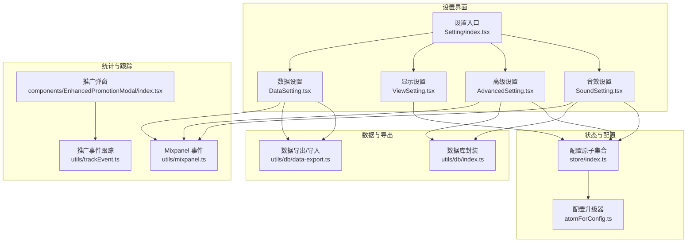
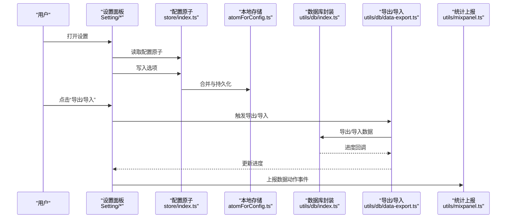
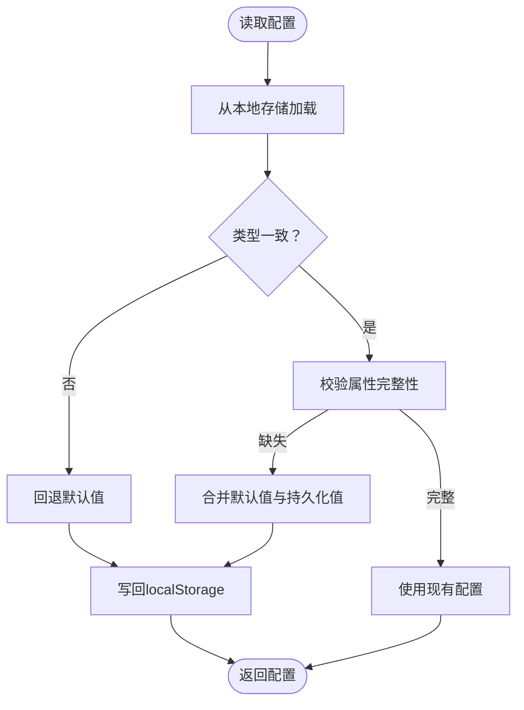
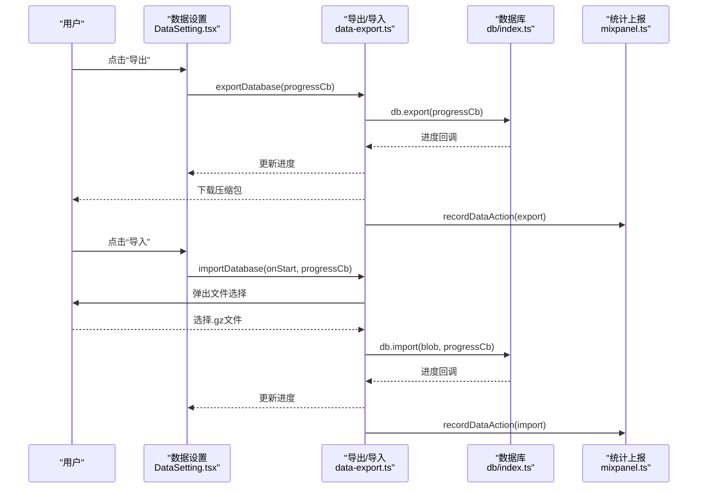
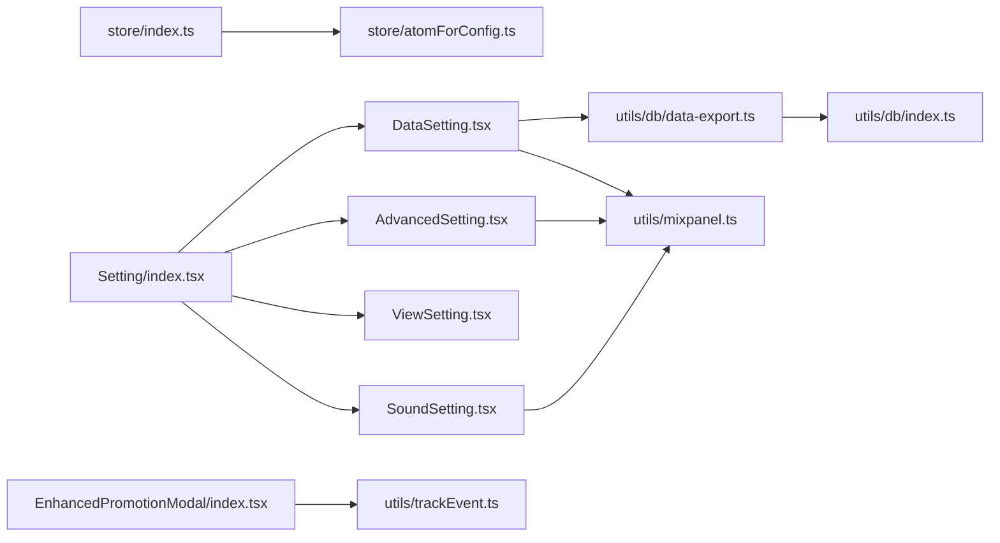

# 高级配置选项

<cite>
**本文引用的文件**
- [src/store/atomForConfig.ts](file://src/store/atomForConfig.ts)
- [src/store/index.ts](file://src/store/index.ts)
- [src/pages/Typing/components/Setting/index.tsx](file://src/pages/Typing/components/Setting/index.tsx)
- [src/pages/Typing/components/Setting/AdvancedSetting.tsx](file://src/pages/Typing/components/Setting/AdvancedSetting.tsx)
- [src/pages/Typing/components/Setting/SoundSetting.tsx](file://src/pages/Typing/components/Setting/SoundSetting.tsx)
- [src/pages/Typing/components/Setting/ViewSetting.tsx](file://src/pages/Typing/components/Setting/ViewSetting.tsx)
- [src/pages/Typing/components/Setting/DataSetting.tsx](file://src/pages/Typing/components/Setting/DataSetting.tsx)
- [src/utils/db/data-export.ts](file://src/utils/db/data-export.ts)
- [src/utils/db/index.ts](file://src/utils/db/index.ts)
- [src/utils/mixpanel.ts](file://src/utils/mixpanel.ts)
- [src/constants/index.ts](file://src/constants/index.ts)
- [src/utils/trackEvent.ts](file://src/utils/trackEvent.ts)
- [src/components/EnhancedPromotionModal/index.tsx](file://src/components/EnhancedPromotionModal/index.tsx)
</cite>

## 目录

1. [简介](#简介)
2. [项目结构](#项目结构)
3. [核心组件](#核心组件)
4. [架构总览](#架构总览)
5. [详细组件分析](#详细组件分析)
6. [依赖关系分析](#依赖关系分析)
7. [性能考虑](#性能考虑)
8. [故障排查指南](#故障排查指南)
9. [结论](#结论)
10. [附录](#附录)

## 简介

本文件面向高级用户与开发者，系统化梳理应用中的“高级配置选项”。内容覆盖：

- 性能调优配置：内存使用限制、渲染优化参数、缓存策略
- 实验性功能：A/B 测试配置、功能预览开关、用户反馈收集
- 开发者调试选项：日志级别设置、性能监控开关、错误报告配置
- 数据导出与备份策略、隐私设置
- 配置迁移工具、批量配置管理、配置模板功能的实现指导

说明：仓库中未发现显式的“内存使用限制”“全局渲染优化参数”“通用缓存策略”等配置项；也未发现“日志级别”“性能监控开关”“错误报告配置”的直接实现。因此，本文件在这些方面以“概念性指导”呈现，并结合现有实现给出可落地的实践建议。

## 项目结构

围绕“高级配置”，主要涉及以下模块：

- 配置原子与持久化：store 层负责定义各类配置原子（含默认值与本地存储）
- 设置面板：设置对话框按“音效设置/高级设置/显示设置/数据设置”分页
- 数据层：数据库与导出/导入工具
- 统计与事件上报：Mixpanel 事件与 Vercel Analytics 跟踪
- 常量与辅助：默认字体尺寸、推广弹窗跟踪等

图表来源

- [src/pages/Typing/components/Setting/index.tsx](file://src/pages/Typing/components/Setting/index.tsx#L1-L151)
- [src/pages/Typing/components/Setting/SoundSetting.tsx](file://src/pages/Typing/components/Setting/SoundSetting.tsx#L1-L320)
- [src/pages/Typing/components/Setting/AdvancedSetting.tsx](file://src/pages/Typing/components/Setting/AdvancedSetting.tsx#L1-L122)
- [src/pages/Typing/components/Setting/ViewSetting.tsx](file://src/pages/Typing/components/Setting/ViewSetting.tsx#L1-L91)
- [src/pages/Typing/components/Setting/DataSetting.tsx](file://src/pages/Typing/components/Setting/DataSetting.tsx#L1-L128)
- [src/store/index.ts](file://src/store/index.ts#L1-L118)
- [src/store/atomForConfig.ts](file://src/store/atomForConfig.ts#L1-L45)
- [src/utils/db/index.ts](file://src/utils/db/index.ts#L1-L136)
- [src/utils/db/data-export.ts](file://src/utils/db/data-export.ts#L1-L68)
- [src/utils/mixpanel.ts](file://src/utils/mixpanel.ts#L1-L227)
- [src/utils/trackEvent.ts](file://src/utils/trackEvent.ts#L1-L17)
- [src/components/EnhancedPromotionModal/index.tsx](file://src/components/EnhancedPromotionModal/index.tsx#L1-L46)

章节来源

- [src/pages/Typing/components/Setting/index.tsx](file://src/pages/Typing/components/Setting/index.tsx#L1-L151)
- [src/store/index.ts](file://src/store/index.ts#L1-L118)

## 核心组件

- 配置原子与持久化
  - 使用统一的配置工厂函数生成带本地存储的配置原子，自动处理类型不匹配与属性缺失的回退与合并
  - 关键配置包括：按键音、提示音、单词发音、音标、随机乱序、忽略大小写、显示前后词、文本可选、深色模式、默写模式提示等
- 设置面板
  - 音效设置：控制单词发音、释义发音、按键音、效果音的开关与音量、速率、音效资源
  - 高级设置：控制练习时展示前后词、忽略大小写、文本可选、默写模式下悬停显示答案、章节乱序等
  - 显示设置：调整外语与中文字体大小，支持重置
  - 数据设置：提供本地数据导出（压缩）与导入（覆盖），并上报数据动作统计
- 数据层
  - 使用 IndexedDB 封装记录表（单词、章节、复习记录），提供保存、删除、版本迁移能力
- 统计与事件上报
  - Mixpanel：记录单词/章节事件，携带模式与配置维度
  - 推广事件：通过 Vercel Analytics 与 gtag 记录推广弹窗交互

章节来源

- [src/store/atomForConfig.ts](file://src/store/atomForConfig.ts#L1-L45)
- [src/store/index.ts](file://src/store/index.ts#L1-L118)
- [src/pages/Typing/components/Setting/SoundSetting.tsx](file://src/pages/Typing/components/Setting/SoundSetting.tsx#L1-L320)
- [src/pages/Typing/components/Setting/AdvancedSetting.tsx](file://src/pages/Typing/components/Setting/AdvancedSetting.tsx#L1-L122)
- [src/pages/Typing/components/Setting/ViewSetting.tsx](file://src/pages/Typing/components/Setting/ViewSetting.tsx#L1-L91)
- [src/pages/Typing/components/Setting/DataSetting.tsx](file://src/pages/Typing/components/Setting/DataSetting.tsx#L1-L128)
- [src/utils/db/index.ts](file://src/utils/db/index.ts#L1-L136)
- [src/utils/db/data-export.ts](file://src/utils/db/data-export.ts#L1-L68)
- [src/utils/mixpanel.ts](file://src/utils/mixpanel.ts#L1-L227)
- [src/utils/trackEvent.ts](file://src/utils/trackEvent.ts#L1-L17)
- [src/components/EnhancedPromotionModal/index.tsx](file://src/components/EnhancedPromotionModal/index.tsx#L1-L46)

## 架构总览

下图展示“高级配置选项”的端到端流程：设置面板读取/写入配置原子，持久化至本地存储；数据设置触发数据库导出/导入；统计模块在关键路径上报事件。

图表来源

- [src/pages/Typing/components/Setting/index.tsx](file://src/pages/Typing/components/Setting/index.tsx#L1-L151)
- [src/store/index.ts](file://src/store/index.ts#L1-L118)
- [src/store/atomForConfig.ts](file://src/store/atomForConfig.ts#L1-L45)
- [src/utils/db/index.ts](file://src/utils/db/index.ts#L1-L136)
- [src/utils/db/data-export.ts](file://src/utils/db/data-export.ts#L1-L68)
- [src/utils/mixpanel.ts](file://src/utils/mixpanel.ts#L1-L227)

## 详细组件分析

### 配置原子与持久化（atomForConfig）

- 设计要点
  - 自动检测类型差异并回退到默认值
  - 对比默认配置与持久化对象，补齐缺失字段
  - 若配置被更新，序列化并写入 localStorage
- 复杂度
  - 类型检查与属性遍历为 O(n)，n 为默认配置键数量
- 错误处理
  - 类型不匹配或属性缺失时回退默认值并覆盖存储，避免运行期异常
- 性能影响
  - 每次读取均进行一次浅比较与必要时的写入，开销极低

图表来源

- [src/store/atomForConfig.ts](file://src/store/atomForConfig.ts#L1-L45)

章节来源

- [src/store/atomForConfig.ts](file://src/store/atomForConfig.ts#L1-L45)

### 音效设置（SoundSetting）

- 支持项
  - 单词发音：开关、音量、语速、是否朗读释义及释义音量
  - 按键音：开关、音量、音效资源列表、试听播放
  - 效果音：开关、音量
- 性能与体验
  - 音量与速率通过滑块调节，实时生效
  - 试听按键音减少切换成本
- 可扩展点
  - 可增加“按键音点击/错误/正确”三态独立开关与音量
  - 可增加“发音引擎选择”（系统语音合成 vs 预下载音频）

章节来源

- [src/pages/Typing/components/Setting/SoundSetting.tsx](file://src/pages/Typing/components/Setting/SoundSetting.tsx#L1-L320)
- [src/store/index.ts](file://src/store/index.ts#L1-L118)

### 高级设置（AdvancedSetting）

- 支持项
  - 章节乱序：开启后下一章节生效
  - 练习时展示上一个/下一个单词
  - 忽略大小写
  - 文本可选
  - 默写模式下悬停显示答案
- 实现方式
  - 通过 Jotai 原子与 useAtom 绑定，状态持久化
- 可扩展点
  - 可增加“自动暂停/继续”“错误率阈值提醒”等行为开关
  - 可增加“键盘布局映射”“手位提示”等渲染优化参数

章节来源

- [src/pages/Typing/components/Setting/AdvancedSetting.tsx](file://src/pages/Typing/components/Setting/AdvancedSetting.tsx#L1-L122)
- [src/store/index.ts](file://src/store/index.ts#L1-L118)

### 显示设置（ViewSetting）

- 支持项
  - 外语字体大小、中文字体大小滑块调节
  - 一键重置为默认字体尺寸
- 默认值
  - 默认字体尺寸由常量提供

章节来源

- [src/pages/Typing/components/Setting/ViewSetting.tsx](file://src/pages/Typing/components/Setting/ViewSetting.tsx#L1-L91)
- [src/constants/index.ts](file://src/constants/index.ts#L1-L19)

### 数据设置（DataSetting）

- 功能
  - 导出：导出数据库为压缩包，同时上报导出大小与记录数
  - 导入：覆盖式导入，支持进度回调
- 安全提示
  - 导入将覆盖当前数据，需谨慎操作
  - 不要修改导出文件，以免破坏数据一致性

图表来源

- [src/pages/Typing/components/Setting/DataSetting.tsx](file://src/pages/Typing/components/Setting/DataSetting.tsx#L1-L128)
- [src/utils/db/data-export.ts](file://src/utils/db/data-export.ts#L1-L68)
- [src/utils/db/index.ts](file://src/utils/db/index.ts#L1-L136)
- [src/utils/mixpanel.ts](file://src/utils/mixpanel.ts#L1-L227)

章节来源

- [src/pages/Typing/components/Setting/DataSetting.tsx](file://src/pages/Typing/components/Setting/DataSetting.tsx#L1-L128)
- [src/utils/db/data-export.ts](file://src/utils/db/data-export.ts#L1-L68)
- [src/utils/db/index.ts](file://src/utils/db/index.ts#L1-L136)
- [src/utils/mixpanel.ts](file://src/utils/mixpanel.ts#L1-L227)

### 数据库与记录（utils/db）

- 表结构与版本迁移
  - 单词记录、章节记录、复习记录等表定义与版本演进
  - 提供保存/删除/查询等常用操作
- 性能建议
  - 批量导入时建议先清空旧表再导入，避免重复索引冲突
  - 导出前可按字典/章节聚合统计，减少前端处理压力

章节来源

- [src/utils/db/index.ts](file://src/utils/db/index.ts#L1-L136)

### 统计与事件上报（Mixpanel/Vercel Analytics）

- Mixpanel
  - 记录单词/章节事件，包含模式与配置维度（如是否开启发音、是否暗色模式、是否乱序等）
  - 提供上传器钩子，便于在关键路径触发
- 推广事件跟踪
  - 推广弹窗交互通过 Vercel Analytics 与 gtag 记录，支持二级事件

章节来源

- [src/utils/mixpanel.ts](file://src/utils/mixpanel.ts#L1-L227)
- [src/utils/trackEvent.ts](file://src/utils/trackEvent.ts#L1-L17)
- [src/components/EnhancedPromotionModal/index.tsx](file://src/components/EnhancedPromotionModal/index.tsx#L1-L46)

## 依赖关系分析

- 配置层
  - 所有配置原子集中于 store/index.ts，通过 atomForConfig.ts 统一持久化
- 设置层
  - Setting/index.tsx 作为入口，分页承载各设置组件
- 数据层
  - DataSetting.tsx 依赖 data-export.ts，后者依赖 db/index.ts
- 统计层
  - Mixpanel 与 Vercel Analytics 分别用于产品行为与推广事件

图表来源

- [src/store/index.ts](file://src/store/index.ts#L1-L118)
- [src/store/atomForConfig.ts](file://src/store/atomForConfig.ts#L1-L45)
- [src/pages/Typing/components/Setting/index.tsx](file://src/pages/Typing/components/Setting/index.tsx#L1-L151)
- [src/pages/Typing/components/Setting/SoundSetting.tsx](file://src/pages/Typing/components/Setting/SoundSetting.tsx#L1-L320)
- [src/pages/Typing/components/Setting/AdvancedSetting.tsx](file://src/pages/Typing/components/Setting/AdvancedSetting.tsx#L1-L122)
- [src/pages/Typing/components/Setting/ViewSetting.tsx](file://src/pages/Typing/components/Setting/ViewSetting.tsx#L1-L91)
- [src/pages/Typing/components/Setting/DataSetting.tsx](file://src/pages/Typing/components/Setting/DataSetting.tsx#L1-L128)
- [src/utils/db/data-export.ts](file://src/utils/db/data-export.ts#L1-L68)
- [src/utils/db/index.ts](file://src/utils/db/index.ts#L1-L136)
- [src/utils/mixpanel.ts](file://src/utils/mixpanel.ts#L1-L227)
- [src/utils/trackEvent.ts](file://src/utils/trackEvent.ts#L1-L17)
- [src/components/EnhancedPromotionModal/index.tsx](file://src/components/EnhancedPromotionModal/index.tsx#L1-L46)

章节来源

- [src/store/index.ts](file://src/store/index.ts#L1-L118)
- [src/pages/Typing/components/Setting/index.tsx](file://src/pages/Typing/components/Setting/index.tsx#L1-L151)

## 性能考虑

- 内存使用限制
  - 当前未提供显式内存上限配置。建议在生产环境：
    - 控制导出/导入文件大小，避免一次性加载过大数据
    - 在移动端或低端设备上降低字体与音量等渲染密集项
- 渲染优化参数
  - 可通过“显示设置”调节字体大小，间接影响绘制复杂度
  - “高级设置”中可关闭“展示前后词”“文本可选”等，减少 DOM 与样式计算
- 缓存策略
  - 配置持久化基于 localStorage，建议避免频繁写入；可在设置面板增加“批量提交”或“防抖”机制
  - 数据导出采用 gzip 压缩，建议在导入前校验文件大小与时间戳，防止异常文件导致长时间阻塞

[本节为通用性能建议，不直接分析具体文件]

## 故障排查指南

- 导入失败或数据异常
  - 确认导入文件为受支持的压缩格式
  - 检查数据库版本兼容性与表结构差异
  - 导入为覆盖式操作，若失败可重新导出原始数据
- 配置未生效
  - 确认配置原子已正确写入 localStorage
  - 若类型不匹配或属性缺失，系统会回退默认值并覆盖存储
- 统计事件未上报
  - 检查 Mixpanel 初始化与网络连通性
  - 推广事件依赖 gtag，确认页面已注入对应脚本

章节来源

- [src/utils/db/data-export.ts](file://src/utils/db/data-export.ts#L1-L68)
- [src/store/atomForConfig.ts](file://src/store/atomForConfig.ts#L1-L45)
- [src/utils/mixpanel.ts](file://src/utils/mixpanel.ts#L1-L227)
- [src/utils/trackEvent.ts](file://src/utils/trackEvent.ts#L1-L17)

## 结论

- 本项目提供了完善的“高级配置选项”实现：配置原子化、持久化、UI 绑定与统计上报
- 对于未内置的“内存限制/渲染参数/缓存策略/日志级别/性能监控/错误报告”等，建议以“可扩展开关+事件上报+配置模板”的方式逐步引入
- 数据导出/导入具备基础的安全提示与进度反馈，满足日常备份与迁移需求

[本节为总结性内容，不直接分析具体文件]

## 附录

### 配置迁移工具与批量配置管理

- 迁移工具
  - 基于导出/导入流程，可编写脚本对历史数据进行转换与清洗
  - 建议在导入前执行“版本校验”与“字段映射”逻辑
- 批量配置管理
  - 在设置面板增加“批量开关”按钮，统一开启/关闭某类配置
  - 增加“配置模板”：保存当前配置快照，支持一键恢复与分享
- 配置模板功能
  - 将当前配置序列化为 JSON，包含版本号与描述
  - 导入时进行“版本兼容性检查”，不兼容时提示升级或降级

[本节为概念性指导，不直接分析具体文件]
