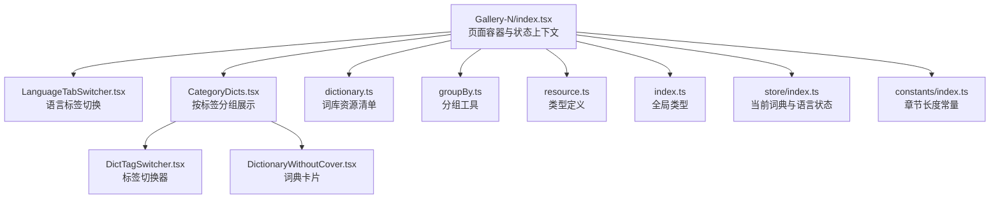
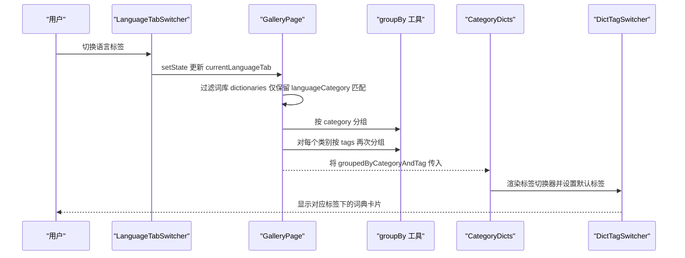
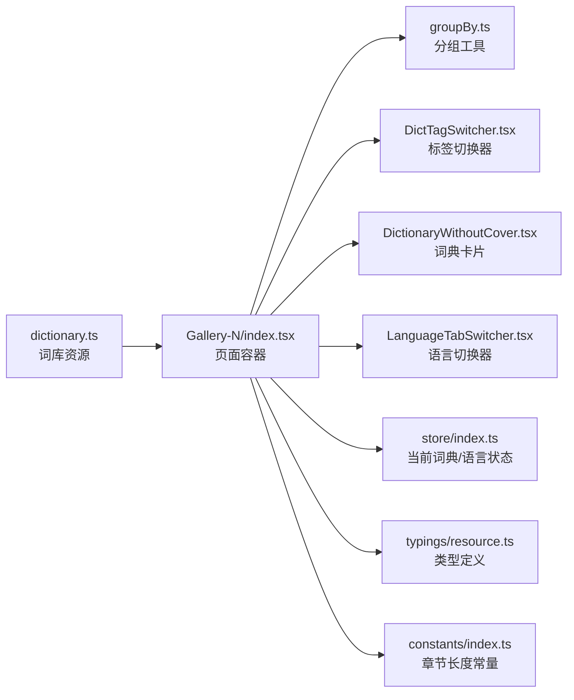

# 词库分类筛选

<cite>
**本文引用的文件**
- [src/pages/Gallery-N/index.tsx](file://src/pages/Gallery-N/index.tsx)
- [src/pages/Gallery-N/CategoryNavigation.tsx](file://src/pages/Gallery-N/CategoryNavigation.tsx)
- [src/pages/Gallery-N/CategoryDicts.tsx](file://src/pages/Gallery-N/CategoryDicts.tsx)
- [src/pages/Gallery-N/LanguageTabSwitcher.tsx](file://src/pages/Gallery-N/LanguageTabSwitcher.tsx)
- [src/pages/Gallery-N/DictTagSwitcher.tsx](file://src/pages/Gallery-N/DictTagSwitcher.tsx)
- [src/pages/Gallery-N/DictionaryWithoutCover.tsx](file://src/pages/Gallery-N/DictionaryWithoutCover.tsx)
- [src/resources/dictionary.ts](file://src/resources/dictionary.ts)
- [src/utils/groupBy.ts](file://src/utils/groupBy.ts)
- [src/utils/index.ts](file://src/utils/index.ts)
- [src/typings/index.ts](file://src/typings/index.ts)
- [src/typings/resource.ts](file://src/typings/resource.ts)
- [src/store/index.ts](file://src/store/index.ts)
- [src/constants/index.ts](file://src/constants/index.ts)
</cite>

## 目录

1. [简介](#简介)
2. [项目结构](#项目结构)
3. [核心组件](#核心组件)
4. [架构总览](#架构总览)
5. [详细组件分析](#详细组件分析)
6. [依赖关系分析](#依赖关系分析)
7. [性能考量](#性能考量)
8. [故障排查指南](#故障排查指南)
9. [结论](#结论)
10. [附录](#附录)

## 简介

本指南面向使用者，系统讲解“词库分类筛选”功能：包括词库分类体系的层级结构（大类/子类/标签/语言），筛选实现机制（按类别、标签、语言、难度等维度），分类导航组件的设计与交互，语言切换机制，筛选条件组合的最佳实践与性能建议，以及分类统计信息的展示与数据来源。

## 项目结构

该功能主要位于 Gallery 页面的“词库画廊”区域，围绕“按语言分类 -> 按类别分组 -> 按标签分组 -> 展示词典卡片”的流程组织。核心文件如下图所示：

图表来源

- [src/pages/Gallery-N/index.tsx](file://src/pages/Gallery-N/index.tsx#L1-L104)
- [src/pages/Gallery-N/LanguageTabSwitcher.tsx](file://src/pages/Gallery-N/LanguageTabSwitcher.tsx#L1-L57)
- [src/pages/Gallery-N/CategoryDicts.tsx](file://src/pages/Gallery-N/CategoryDicts.tsx#L1-L38)
- [src/pages/Gallery-N/DictTagSwitcher.tsx](file://src/pages/Gallery-N/DictTagSwitcher.tsx#L1-L38)
- [src/pages/Gallery-N/DictionaryWithoutCover.tsx](file://src/pages/Gallery-N/DictionaryWithoutCover.tsx#L1-L93)
- [src/resources/dictionary.ts](file://src/resources/dictionary.ts#L1-L120)
- [src/utils/groupBy.ts](file://src/utils/groupBy.ts#L1-L27)
- [src/typings/resource.ts](file://src/typings/resource.ts#L1-L52)
- [src/typings/index.ts](file://src/typings/index.ts#L1-L51)
- [src/store/index.ts](file://src/store/index.ts#L1-L118)
- [src/constants/index.ts](file://src/constants/index.ts#L1-L19)

章节来源

- [src/pages/Gallery-N/index.tsx](file://src/pages/Gallery-N/index.tsx#L1-L104)
- [src/resources/dictionary.ts](file://src/resources/dictionary.ts#L1-L120)

## 核心组件

- 语言标签切换器：提供多语言词库切换入口，支持英语、日语、德语、哈萨克语、印尼语、编程类等。
- 类别分组容器：根据当前语言过滤词库后，按“类别”进行一级分组；每个类别下再按“标签”进行二级分组。
- 标签切换器：在某个类别下，按标签切换展示词典卡片。
- 词典卡片：展示词典名称、描述、词数、学习进度条等信息，并支持详情弹窗。

章节来源

- [src/pages/Gallery-N/LanguageTabSwitcher.tsx](file://src/pages/Gallery-N/LanguageTabSwitcher.tsx#L1-L57)
- [src/pages/Gallery-N/CategoryDicts.tsx](file://src/pages/Gallery-N/CategoryDicts.tsx#L1-L38)
- [src/pages/Gallery-N/DictTagSwitcher.tsx](file://src/pages/Gallery-N/DictTagSwitcher.tsx#L1-L38)
- [src/pages/Gallery-N/DictionaryWithoutCover.tsx](file://src/pages/Gallery-N/DictionaryWithoutCover.tsx#L1-L93)

## 架构总览

整体筛选流程如下：

图表来源

- [src/pages/Gallery-N/LanguageTabSwitcher.tsx](file://src/pages/Gallery-N/LanguageTabSwitcher.tsx#L1-L57)
- [src/pages/Gallery-N/index.tsx](file://src/pages/Gallery-N/index.tsx#L1-L104)
- [src/utils/groupBy.ts](file://src/utils/groupBy.ts#L1-L27)
- [src/pages/Gallery-N/CategoryDicts.tsx](file://src/pages/Gallery-N/CategoryDicts.tsx#L1-L38)
- [src/pages/Gallery-N/DictTagSwitcher.tsx](file://src/pages/Gallery-N/DictTagSwitcher.tsx#L1-L38)

## 详细组件分析

### 语言切换与筛选维度

- 语言维度：通过语言标签切换器选择目标语言类别，GalleryPage 会基于该类别过滤词库资源，仅显示匹配的词典。
- 类别维度：词库资源按“category”字段进行一级分组，形成多个类别区块。
- 标签维度：在每个类别内部，按“tags”数组进行二次分组，标签切换器用于在同类别内切换展示。
- 难度维度：词典对象未直接暴露“难度”字段；但可通过“tags”与“description”等元信息间接识别（例如“高频”、“考研”、“托福”等标签可作为难度参考）。

章节来源

- [src/pages/Gallery-N/LanguageTabSwitcher.tsx](file://src/pages/Gallery-N/LanguageTabSwitcher.tsx#L1-L57)
- [src/pages/Gallery-N/index.tsx](file://src/pages/Gallery-N/index.tsx#L1-L104)
- [src/resources/dictionary.ts](file://src/resources/dictionary.ts#L1-L120)
- [src/utils/groupBy.ts](file://src/utils/groupBy.ts#L1-L27)

### 分类导航组件设计与交互

- 组件职责：提供“类别导航”区域，当前实现为单选语言标签，未直接展示“类别列表”导航按钮。
- 交互逻辑：用户点击语言标签后，GalleryPage 重新计算分组结果并渲染对应类别区块。
- 动态加载与缓存：分组结果在语言切换时重新计算；词典卡片使用 IntersectionObserver 与懒加载结合，仅在可见时请求统计数据，减少首屏压力。
- 性能优化：分组采用 reduce 实现，时间复杂度 O(N)；标签切换器使用原子状态管理，避免不必要的重渲染。

章节来源

- [src/pages/Gallery-N/CategoryNavigation.tsx](file://src/pages/Gallery-N/CategoryNavigation.tsx#L1-L32)
- [src/pages/Gallery-N/index.tsx](file://src/pages/Gallery-N/index.tsx#L1-L104)
- [src/pages/Gallery-N/DictionaryWithoutCover.tsx](file://src/pages/Gallery-N/DictionaryWithoutCover.tsx#L1-L93)

### 标签切换与默认标签策略

- 标签切换：在某个类别下，标签切换器会列出该类别下的所有标签，并允许用户切换。
- 默认标签策略：当用户已选择某个词典时，组件会尝试在当前类别下寻找与该词典标签相同的标签作为默认值，提升用户体验。

章节来源

- [src/pages/Gallery-N/CategoryDicts.tsx](file://src/pages/Gallery-N/CategoryDicts.tsx#L1-L38)
- [src/utils/index.ts](file://src/utils/index.ts#L98-L101)
- [src/store/index.ts](file://src/store/index.ts#L1-L40)

### 词典卡片与统计展示

- 卡片内容：名称、描述、词数、学习进度条。
- 统计来源：通过 useDictStats 获取章节练习统计，结合词典 length 与章节长度常量计算进度百分比。
- 可见性懒加载：使用 IntersectionObserver 仅在卡片进入视口时请求统计数据，降低网络与计算开销。

章节来源

- [src/pages/Gallery-N/DictionaryWithoutCover.tsx](file://src/pages/Gallery-N/DictionaryWithoutCover.tsx#L1-L93)
- [src/constants/index.ts](file://src/constants/index.ts#L1-L19)

### 分类体系与数据来源

- 词库资源清单：集中定义在资源文件中，包含 id、name、description、category、tags、url、length、language、languageCategory 等字段。
- 分类层级：语言类别（languageCategory） -> 词典类别（category） -> 标签（tags） -> 词典项（Dictionary）。
- 示例类别（节选）：中国考试、国际考试、青少年英语、专业词汇、英语词典等。

章节来源

- [src/resources/dictionary.ts](file://src/resources/dictionary.ts#L1-L120)
- [src/typings/resource.ts](file://src/typings/resource.ts#L1-L52)
- [src/typings/index.ts](file://src/typings/index.ts#L1-L51)

## 依赖关系分析

图表来源

- [src/resources/dictionary.ts](file://src/resources/dictionary.ts#L1-L120)
- [src/pages/Gallery-N/index.tsx](file://src/pages/Gallery-N/index.tsx#L1-L104)
- [src/utils/groupBy.ts](file://src/utils/groupBy.ts#L1-L27)
- [src/pages/Gallery-N/DictTagSwitcher.tsx](file://src/pages/Gallery-N/DictTagSwitcher.tsx#L1-L38)
- [src/pages/Gallery-N/DictionaryWithoutCover.tsx](file://src/pages/Gallery-N/DictionaryWithoutCover.tsx#L1-L93)
- [src/pages/Gallery-N/LanguageTabSwitcher.tsx](file://src/pages/Gallery-N/LanguageTabSwitcher.tsx#L1-L57)
- [src/store/index.ts](file://src/store/index.ts#L1-L118)
- [src/typings/resource.ts](file://src/typings/resource.ts#L1-L52)
- [src/constants/index.ts](file://src/constants/index.ts#L1-L19)

章节来源

- [src/pages/Gallery-N/index.tsx](file://src/pages/Gallery-N/index.tsx#L1-L104)
- [src/utils/groupBy.ts](file://src/utils/groupBy.ts#L1-L27)

## 性能考量

- 分组算法：使用 reduce 实现，时间复杂度 O(N)，空间复杂度 O(N)；适合词库规模增长时保持稳定性能。
- 懒加载与可见性：词典卡片仅在进入视口时请求统计数据，显著降低初始渲染成本。
- 状态管理：使用原子状态与不可变更新，避免深层嵌套导致的重渲染。
- 缓存策略：当前未实现跨页缓存；可在语言切换时缓存分组结果，减少重复计算。

章节来源

- [src/utils/groupBy.ts](file://src/utils/groupBy.ts#L1-L27)
- [src/pages/Gallery-N/DictionaryWithoutCover.tsx](file://src/pages/Gallery-N/DictionaryWithoutCover.tsx#L1-L93)
- [src/pages/Gallery-N/index.tsx](file://src/pages/Gallery-N/index.tsx#L1-L104)

## 故障排查指南

- 语言切换无效：确认 LanguageTabSwitcher 的上下文是否正确传递至 GalleryContext，且 setState 调用生效。
- 类别/标签不显示：检查 dictionaries 中是否存在与当前 languageCategory 匹配的词典；确认分组逻辑未被过滤条件误删。
- 标签默认值异常：若当前词典的标签不在当前类别中，组件会回退到第一个可用标签；可检查 findCommonValues 的交集逻辑。
- 统计数据不更新：确认 IntersectionObserver 触发时机与 useDictStats 请求频率；检查章节长度常量与词典 length 是否一致。

章节来源

- [src/pages/Gallery-N/LanguageTabSwitcher.tsx](file://src/pages/Gallery-N/LanguageTabSwitcher.tsx#L1-L57)
- [src/pages/Gallery-N/index.tsx](file://src/pages/Gallery-N/index.tsx#L1-L104)
- [src/utils/index.ts](file://src/utils/index.ts#L98-L101)
- [src/constants/index.ts](file://src/constants/index.ts#L1-L19)

## 结论

本功能以“语言 -> 类别 -> 标签 -> 词典”为主线，通过简洁的组件与高效的分组算法实现了灵活的词库筛选与展示。语言切换与标签切换器提供了直观的交互入口；懒加载与可见性检测保障了性能。未来可在语言切换时增加分组结果缓存，并扩展“难度”筛选维度以进一步提升可用性。

## 附录

### 分类统计信息展示方式与数据来源

- 展示方式：词典卡片右下角显示学习进度条，数值来源于章节练习统计与词典长度计算。
- 数据来源：章节长度常量与词典 length 字段共同决定章节总数；统计数据通过 useDictStats 按需请求。

章节来源

- [src/pages/Gallery-N/DictionaryWithoutCover.tsx](file://src/pages/Gallery-N/DictionaryWithoutCover.tsx#L1-L93)
- [src/constants/index.ts](file://src/constants/index.ts#L1-L19)
