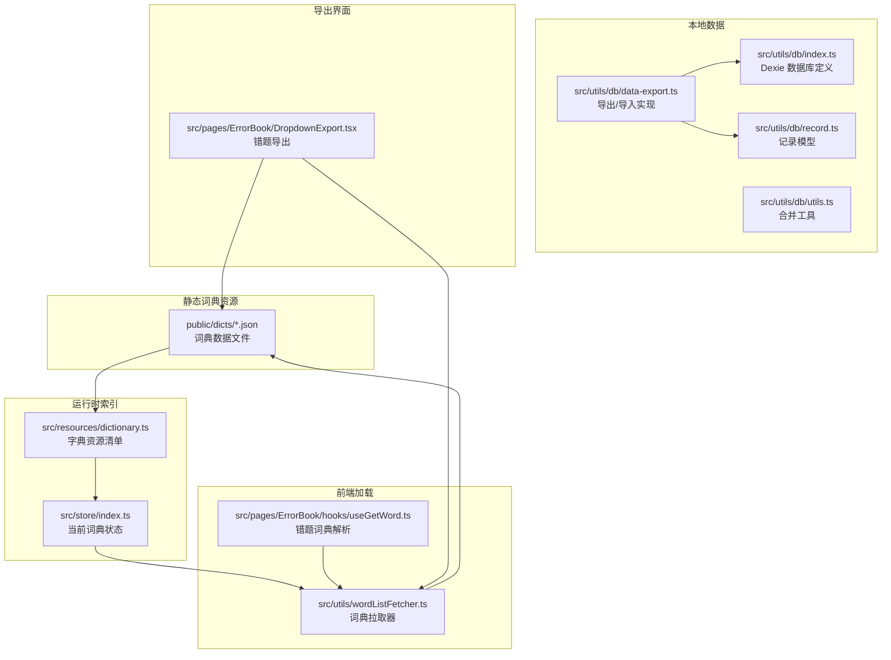
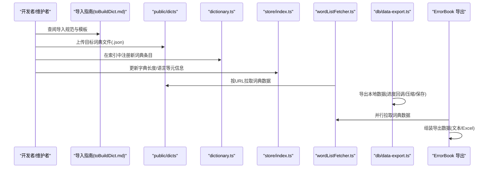
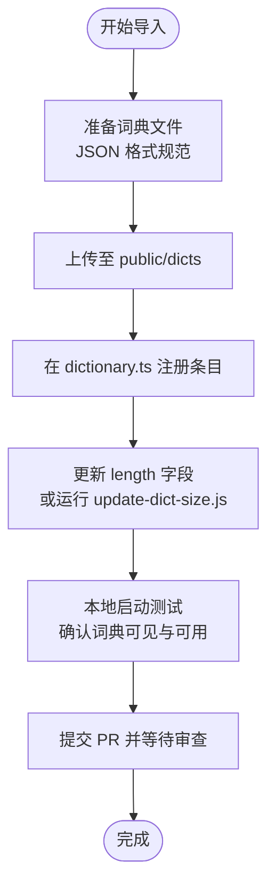
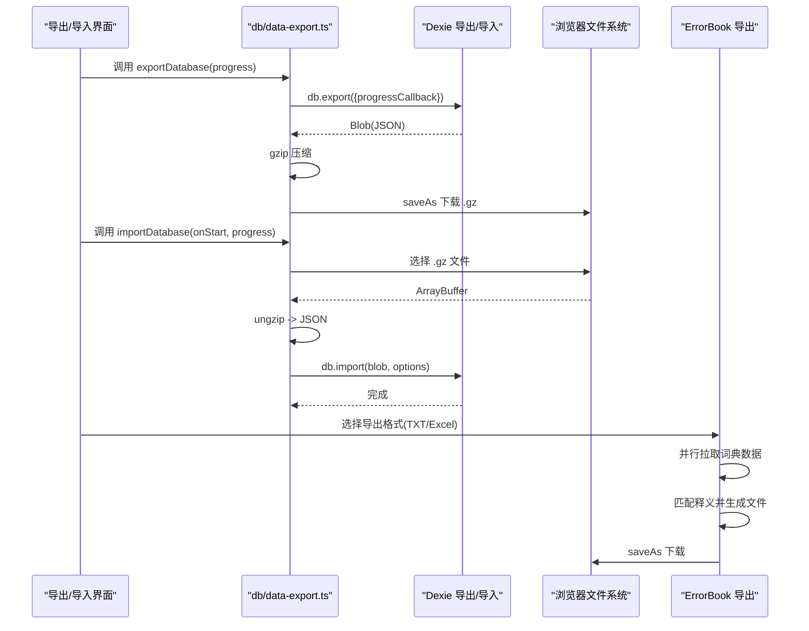
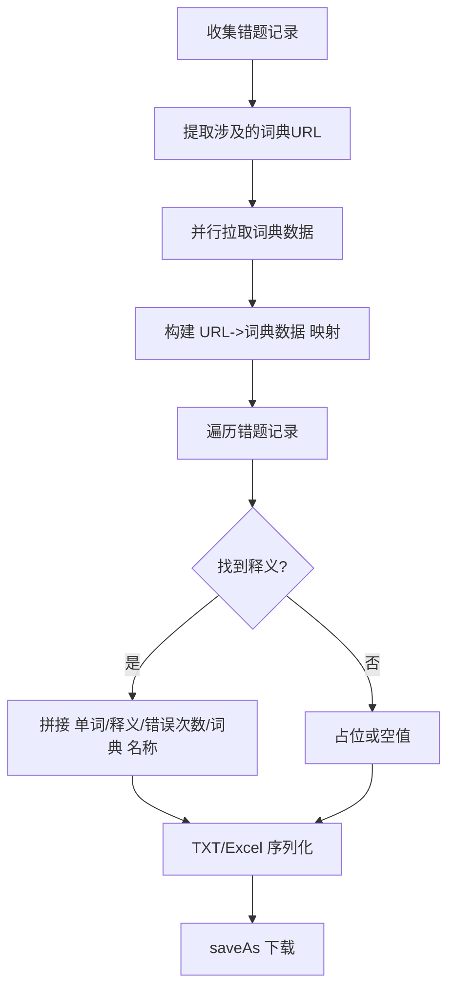
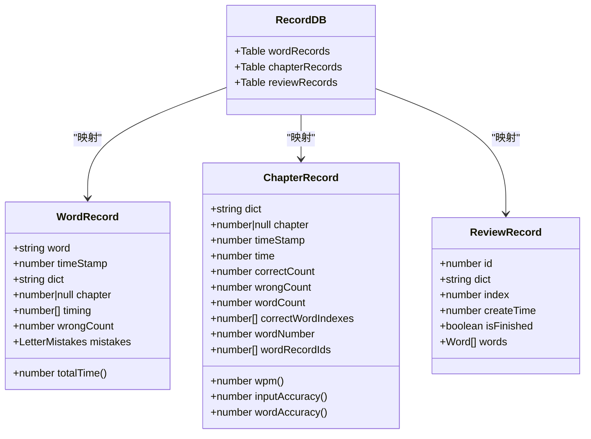
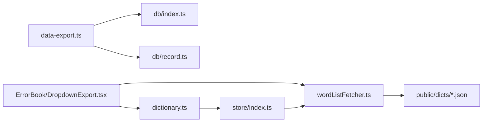

# 词库导入导出

<cite>
**本文引用的文件**
- [docs/toBuildDict.md](file://docs/toBuildDict.md)
- [src/resources/dictionary.ts](file://src/resources/dictionary.ts)
- [src/utils/wordListFetcher.ts](file://src/utils/wordListFetcher.ts)
- [src/utils/db/data-export.ts](file://src/utils/db/data-export.ts)
- [src/utils/db/index.ts](file://src/utils/db/index.ts)
- [src/utils/db/record.ts](file://src/utils/db/record.ts)
- [src/utils/db/utils.ts](file://src/utils/db/utils.ts)
- [scripts/update-dict-size.js](file://scripts/update-dict-size.js)
- [src/pages/ErrorBook/DropdownExport.tsx](file://src/pages/ErrorBook/DropdownExport.tsx)
- [src/pages/ErrorBook/hooks/useGetWord.ts](file://src/pages/ErrorBook/hooks/useGetWord.ts)
- [public/dicts/CET4_T.json](file://public/dicts/CET4_T.json)
- [public/dicts/IELTS_3_T.json](file://public/dicts/IELTS_3_T.json)
- [src/store/index.ts](file://src/store/index.ts)
</cite>

## 目录

1. [简介](#简介)
2. [项目结构](#项目结构)
3. [核心组件](#核心组件)
4. [架构总览](#架构总览)
5. [详细组件分析](#详细组件分析)
6. [依赖关系分析](#依赖关系分析)
7. [性能考量](#性能考量)
8. [故障排查指南](#故障排查指南)
9. [结论](#结论)
10. [附录](#附录)

## 简介

本文件面向开发者与维护者，系统性说明词库导入与导出的全流程与最佳实践。内容涵盖：

- 词库文件导入流程：文件格式要求、上传与索引机制、数据校验与质量检查
- 词库导出功能：本地数据库导出、压缩与下载、错题本导出与格式转换
- 自定义词库开发指南：JSON 结构规范、字段定义、质量检查标准与模板
- 错误处理与异常恢复：导入导出过程中的容错策略与常见问题定位
- 批量导入、增量更新与版本管理：建议流程与注意事项

## 项目结构

词库系统由“内置词典索引”“词典数据文件”“前端加载器”“本地数据库导出/导入”“错题本导出”五部分组成，整体遵循“静态资源 + 运行时索引 + 数据持久化”的设计。

图表来源

- [src/resources/dictionary.ts](file://src/resources/dictionary.ts#L4143-L4200)
- [src/utils/wordListFetcher.ts](file://src/utils/wordListFetcher.ts#L1-L10)
- [src/utils/db/data-export.ts](file://src/utils/db/data-export.ts#L1-L68)
- [src/utils/db/index.ts](file://src/utils/db/index.ts#L1-L136)
- [src/utils/db/record.ts](file://src/utils/db/record.ts#L1-L186)
- [src/pages/ErrorBook/DropdownExport.tsx](file://src/pages/ErrorBook/DropdownExport.tsx#L1-L99)
- [src/pages/ErrorBook/hooks/useGetWord.ts](file://src/pages/ErrorBook/hooks/useGetWord.ts#L1-L27)

章节来源

- [src/resources/dictionary.ts](file://src/resources/dictionary.ts#L4143-L4200)
- [src/utils/wordListFetcher.ts](file://src/utils/wordListFetcher.ts#L1-L10)
- [src/utils/db/data-export.ts](file://src/utils/db/data-export.ts#L1-L68)
- [src/utils/db/index.ts](file://src/utils/db/index.ts#L1-L136)
- [src/pages/ErrorBook/DropdownExport.tsx](file://src/pages/ErrorBook/DropdownExport.tsx#L1-L99)

## 核心组件

- 词典索引与清单
  - 字典资源清单集中定义在资源文件中，包含 id、名称、描述、分类、语言、长度、URL 等元信息，供页面渲染与章节计算使用。
  - 通过映射对象将 id 快速定位到字典详情，便于页面与导出模块按需查询。
- 词典数据文件
  - 位于 public/dicts 下，采用 JSON 数组格式，数组元素为词条对象，包含 name、trans 等字段。
  - 示例文件展示了英文词典的典型结构，包含音标等可选字段。
- 词典加载器
  - 前端通过统一的拉取器加载词典，支持部署环境前缀处理，确保不同部署环境下路径正确。
- 本地数据库导出/导入
  - 基于 Dexie 的导出/导入能力，支持进度回调、gzip 压缩、文件保存与统计上报。
- 错题本导出
  - 支持 TXT 与 Excel 多格式导出，按词典 URL 并行拉取词典数据，拼接释义后输出。

章节来源

- [src/resources/dictionary.ts](file://src/resources/dictionary.ts#L4143-L4200)
- [src/utils/wordListFetcher.ts](file://src/utils/wordListFetcher.ts#L1-L10)
- [src/utils/db/data-export.ts](file://src/utils/db/data-export.ts#L1-L68)
- [src/pages/ErrorBook/DropdownExport.tsx](file://src/pages/ErrorBook/DropdownExport.tsx#L1-L99)

## 架构总览

词库导入与导出的整体流程如下：

图表来源

- [docs/toBuildDict.md](file://docs/toBuildDict.md#L1-L124)
- [src/resources/dictionary.ts](file://src/resources/dictionary.ts#L4143-L4200)
- [src/utils/wordListFetcher.ts](file://src/utils/wordListFetcher.ts#L1-L10)
- [src/utils/db/data-export.ts](file://src/utils/db/data-export.ts#L1-L68)
- [src/pages/ErrorBook/DropdownExport.tsx](file://src/pages/ErrorBook/DropdownExport.tsx#L1-L99)

## 详细组件分析

### 词库导入流程（文件格式、上传、索引与校验）

- 文件格式要求
  - JSON 数组，元素为词条对象，必须包含 name 与 trans 字段；可选 usphone、ukphone 等音标字段。
  - 示例参考：CET4_T.json、IELTS_3_T.json。
- 上传与放置
  - 将目标文件放入 public/dicts 目录。
- 索引建立与注册
  - 在 dictionary.ts 中新增字典条目，填写 id、name、description、category、url、length、language 等字段。
  - 使用脚本 update-dict-size.js 自动扫描 dicts 目录并更新 length 字段，减少手工维护成本。
- 数据校验与质量检查
  - 建议在提交 PR 前进行：
    - JSON 语法校验（无语法错误）
    - 字段完整性检查（name、trans 存在且非空）
    - 重复项检查（name 唯一性）
    - 长度一致性核对（与实际数组长度一致）
  - 提交后由仓库 CI/CD 或维护者进行二次审查。

图表来源

- [docs/toBuildDict.md](file://docs/toBuildDict.md#L1-L124)
- [src/resources/dictionary.ts](file://src/resources/dictionary.ts#L4143-L4200)
- [scripts/update-dict-size.js](file://scripts/update-dict-size.js#L1-L23)

章节来源

- [docs/toBuildDict.md](file://docs/toBuildDict.md#L1-L124)
- [src/resources/dictionary.ts](file://src/resources/dictionary.ts#L4143-L4200)
- [scripts/update-dict-size.js](file://scripts/update-dict-size.js#L1-L23)
- [public/dicts/CET4_T.json](file://public/dicts/CET4_T.json#L1-L200)
- [public/dicts/IELTS_3_T.json](file://public/dicts/IELTS_3_T.json#L1-L200)

### 词库导出功能（本地数据库与错题本）

- 本地数据库导出
  - 通过 db.export 生成 Blob，使用 gzip 压缩，最终以 .gz 文件形式下载。
  - 导出过程支持进度回调，便于 UI 展示。
  - 导出完成后记录用户数据大小、单词记录数与章节记录数，用于统计与审计。
- 本地数据库导入
  - 通过文件选择器读取 .gz 文件，先解压为 JSON，再调用 db.import 完成导入。
  - 导入配置允许接受版本差异、缺失表、名称差异等，覆盖写入与清表策略可根据需要调整。
- 错题本导出
  - 支持 TXT 与 Excel 两种格式。
  - 并行拉取涉及的词典数据，基于 idDictionaryMap 与词典 URL 获取词典列表，再根据单词名匹配释义，最后生成导出文件。

图表来源

- [src/utils/db/data-export.ts](file://src/utils/db/data-export.ts#L1-L68)
- [src/pages/ErrorBook/DropdownExport.tsx](file://src/pages/ErrorBook/DropdownExport.tsx#L1-L99)

章节来源

- [src/utils/db/data-export.ts](file://src/utils/db/data-export.ts#L1-L68)
- [src/pages/ErrorBook/DropdownExport.tsx](file://src/pages/ErrorBook/DropdownExport.tsx#L1-L99)

### 自定义词库开发指南（JSON 规范、字段定义、质量检查）

- JSON 规范
  - 根对象为数组，元素为词条对象，至少包含 name 与 trans 字段；可选 usphone、ukphone 等音标字段。
  - 示例参考：CET4_T.json、IELTS_3_T.json。
- 字段定义要求
  - name：单词原文，字符串，唯一性建议在上游保证。
  - trans：释义数组，字符串数组，建议每条释义以分号分隔。
  - usphone/ukphone：美音/英音音标，字符串或字符串数组，可选。
- 质量检查标准
  - 语法：JSON 无语法错误
  - 结构：name、trans 存在且非空
  - 唯一性：name 唯一
  - 一致性：length 与实际数组长度一致
  - 语言与分类：language、category、tags 合理
- 模板与示例
  - 参考现有词典文件结构，复制并替换内容即可快速生成新词典。
  - 示例文件路径：
    - [public/dicts/CET4_T.json](file://public/dicts/CET4_T.json#L1-L200)
    - [public/dicts/IELTS_3_T.json](file://public/dicts/IELTS_3_T.json#L1-L200)

章节来源

- [docs/toBuildDict.md](file://docs/toBuildDict.md#L1-L124)
- [public/dicts/CET4_T.json](file://public/dicts/CET4_T.json#L1-L200)
- [public/dicts/IELTS_3_T.json](file://public/dicts/IELTS_3_T.json#L1-L200)

### 错题本导出的数据序列化与格式转换

- 数据来源
  - 错题记录来自本地数据库，通过 idDictionaryMap 与词典 URL 获取对应词典数据。
- 数据序列化
  - 并行拉取词典数据，构建词典 URL → 词典数据 的映射。
  - 遍历错题记录，按单词名在词典中查找对应词条，拼接释义。
- 格式转换
  - TXT：按“单词: 释义”格式拼接为纯文本。
  - Excel：使用工作簿与工作表封装，生成二进制缓冲区。
- 下载机制
  - 使用文件保存库将 Blob 以带时间戳的文件名下载。

图表来源

- [src/pages/ErrorBook/DropdownExport.tsx](file://src/pages/ErrorBook/DropdownExport.tsx#L1-L99)
- [src/resources/dictionary.ts](file://src/resources/dictionary.ts#L4143-L4200)

章节来源

- [src/pages/ErrorBook/DropdownExport.tsx](file://src/pages/ErrorBook/DropdownExport.tsx#L1-L99)
- [src/pages/ErrorBook/hooks/useGetWord.ts](file://src/pages/ErrorBook/hooks/useGetWord.ts#L1-L27)

### 本地数据库导入/导出的数据模型与依赖关系

- 数据模型
  - 词记录、章节记录、复习记录等模型定义清晰，包含时间戳、错误次数、按键耗时等字段。
- 导入/导出依赖
  - 导出/导入依赖 Dexie 的导出导入能力与 gzip 压缩库。
  - 错题本导出依赖文件保存库与 Excel 序列化库。
- 合并与工具
  - 提供字母错误合并工具，便于聚合多次输入错误信息。

图表来源

- [src/utils/db/record.ts](file://src/utils/db/record.ts#L1-L186)
- [src/utils/db/index.ts](file://src/utils/db/index.ts#L1-L136)

章节来源

- [src/utils/db/record.ts](file://src/utils/db/record.ts#L1-L186)
- [src/utils/db/index.ts](file://src/utils/db/index.ts#L1-L136)
- [src/utils/db/utils.ts](file://src/utils/db/utils.ts#L1-L18)

## 依赖关系分析

- 词典索引与加载
  - dictionary.ts 提供字典资源清单与 id 到字典的映射；store/index.ts 通过当前词典 ID 获取当前字典信息；wordListFetcher.ts 负责按 URL 拉取词典数据。
- 导出/导入与数据库
  - data-export.ts 依赖 Dexie 的导出/导入能力与 gzip；index.ts 定义数据库结构与记录模型。
- 错题本导出
  - DropdownExport.tsx 依赖 idDictionaryMap 与 wordListFetcher，实现并行拉取与导出。

图表来源

- [src/resources/dictionary.ts](file://src/resources/dictionary.ts#L4143-L4200)
- [src/store/index.ts](file://src/store/index.ts#L1-L118)
- [src/utils/wordListFetcher.ts](file://src/utils/wordListFetcher.ts#L1-L10)
- [src/utils/db/data-export.ts](file://src/utils/db/data-export.ts#L1-L68)
- [src/utils/db/index.ts](file://src/utils/db/index.ts#L1-L136)
- [src/pages/ErrorBook/DropdownExport.tsx](file://src/pages/ErrorBook/DropdownExport.tsx#L1-L99)

章节来源

- [src/resources/dictionary.ts](file://src/resources/dictionary.ts#L4143-L4200)
- [src/store/index.ts](file://src/store/index.ts#L1-L118)
- [src/utils/wordListFetcher.ts](file://src/utils/wordListFetcher.ts#L1-L10)
- [src/utils/db/data-export.ts](file://src/utils/db/data-export.ts#L1-L68)
- [src/pages/ErrorBook/DropdownExport.tsx](file://src/pages/ErrorBook/DropdownExport.tsx#L1-L99)

## 性能考量

- 并行拉取
  - 错题本导出对多个词典 URL 并行拉取，显著降低等待时间。
- 压缩与体积
  - 导出采用 gzip 压缩，有效降低下载体积与存储占用。
- 数据库版本迁移
  - Dexie 版本升级时注意迁移策略，避免字段变更导致导入失败。
- 前端渲染
  - 词典列表按语言分类与标签分组，减少 DOM 渲染压力。

[本节为通用指导，无需列出具体文件来源]

## 故障排查指南

- 词典未显示或加载失败
  - 检查 dictionary.ts 中的 url 与 id 是否正确，确保文件存在于 public/dicts。
  - 使用本地启动验证路径是否可达。
- 导出失败
  - 确认浏览器允许下载与弹窗；检查导出进度回调是否正常触发。
- 导入失败
  - 确认上传文件为 .gz 且可解压；查看导入选项配置（版本差异、缺失表、主键变更等）。
- 错题本导出为空或释义缺失
  - 检查错题记录中的 dict 与 word 是否与词典匹配；确认词典 URL 可访问。
- 长度不一致
  - 运行 update-dict-size.js 自动更新 length 字段。

章节来源

- [src/utils/db/data-export.ts](file://src/utils/db/data-export.ts#L1-L68)
- [src/pages/ErrorBook/DropdownExport.tsx](file://src/pages/ErrorBook/DropdownExport.tsx#L1-L99)
- [scripts/update-dict-size.js](file://scripts/update-dict-size.js#L1-L23)

## 结论

本系统通过“静态词典 + 运行时索引 + 数据持久化 + 多格式导出”的架构，实现了词库导入与导出的完整闭环。开发者只需遵循 JSON 规范与索引注册流程，即可快速上线新词库；用户可通过本地数据库导出与错题本导出获得便捷的数据迁移与备份能力。建议在生产环境中配合自动化脚本与质量检查，持续保障词库数据的准确性与一致性。

[本节为总结性内容，无需列出具体文件来源]

## 附录

- 词典文件模板与示例
  - 参考现有词典文件结构，复制并替换内容即可快速生成新词典。
  - 示例文件路径：
    - [public/dicts/CET4_T.json](file://public/dicts/CET4_T.json#L1-L200)
    - [public/dicts/IELTS_3_T.json](file://public/dicts/IELTS_3_T.json#L1-L200)
- 自动化脚本
  - 更新词典长度：[scripts/update-dict-size.js](file://scripts/update-dict-size.js#L1-L23)
- 导入指南
  - 详细步骤与规范参考：[docs/toBuildDict.md](file://docs/toBuildDict.md#L1-L124)
