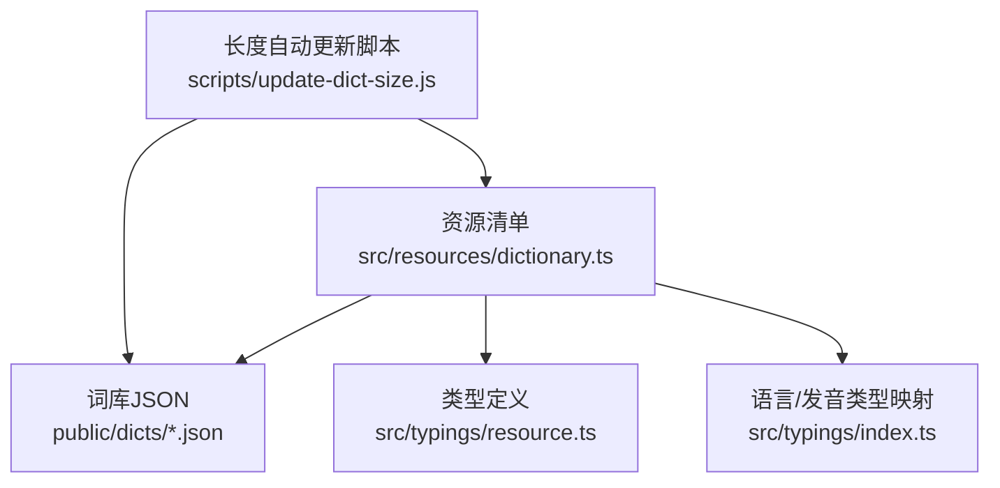
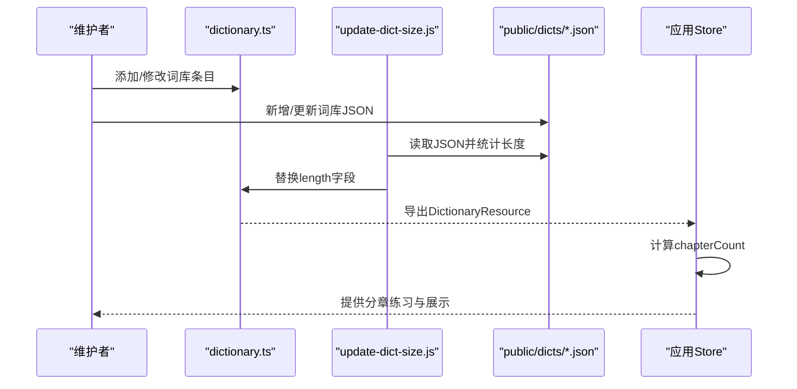
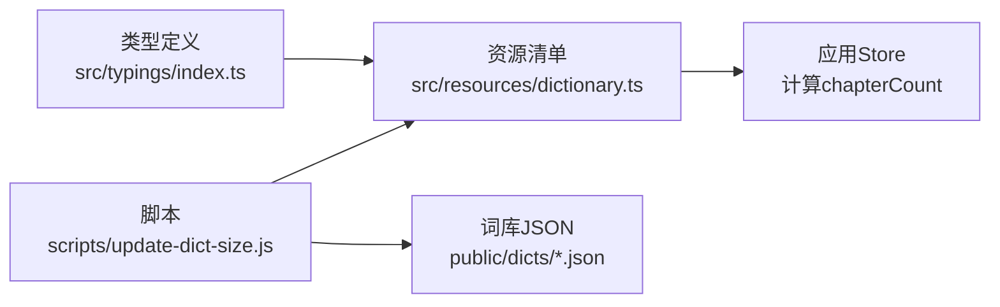

# 词库数据结构

<cite>
**本文引用的文件**
- [src/resources/dictionary.ts](file://src/resources/dictionary.ts)
- [src/typings/resource.ts](file://src/typings/resource.ts)
- [src/typings/index.ts](file://src/typings/index.ts)
- [scripts/update-dict-size.js](file://scripts/update-dict-size.js)
- [public/dicts/CET4_T.json](file://public/dicts/CET4_T.json)
- [public/dicts/IELTS_3_T.json](file://public/dicts/IELTS_3_T.json)
- [public/dicts/KaoYan_3_T.json](file://public/dicts/KaoYan_3_T.json)
- [public/dicts/JapVocabList.N1.json](file://public/dicts/JapVocabList.N1.json)
- [public/dicts/chinese_test.json](file://public/dicts/chinese_test.json)
- [public/dicts/EF_LEVEL_1.json](file://public/dicts/EF_LEVEL_1.json)
- [public/dicts/itVocabulary.json](file://public/dicts/itVocabulary.json)
- [public/dicts/child_python_code.json](file://public/dicts/child_python_code.json)
</cite>

## 目录

1. [简介](#简介)
2. [项目结构](#项目结构)
3. [核心组件](#核心组件)
4. [架构总览](#架构总览)
5. [详细组件分析](#详细组件分析)
6. [依赖关系分析](#依赖关系分析)
7. [性能考量](#性能考量)
8. [故障排查指南](#故障排查指南)
9. [结论](#结论)
10. [附录](#附录)

## 简介

本技术文档围绕“词库数据结构”展开，系统阐述 Dictionary 与 DictionaryResource 的接口定义、字段含义与约束、词库文件的数据格式规范、分类体系设计原则、元数据标准化示例与最佳实践，以及长度计算、语言标识与 URL 路径规范、数据验证与完整性保障机制。文档面向开发者与内容维护者，兼顾代码级细节与可操作建议。

## 项目结构

词库数据由两类核心要素构成：

- 元数据清单：在资源文件中统一声明词库条目，包含 id、name、description、category、tags、url、length、language、languageCategory 等字段。
- 词库 JSON 文件：存放单词条目数组，每条目包含 name、trans（翻译数组）、usphone、ukphone、notation 等字段（依词库而异）。

图表来源

- [src/resources/dictionary.ts](file://src/resources/dictionary.ts#L1-L120)
- [src/typings/resource.ts](file://src/typings/resource.ts#L1-L32)
- [src/typings/index.ts](file://src/typings/index.ts#L1-L21)
- [scripts/update-dict-size.js](file://scripts/update-dict-size.js#L1-L23)

章节来源

- [src/resources/dictionary.ts](file://src/resources/dictionary.ts#L1-L120)
- [src/typings/resource.ts](file://src/typings/resource.ts#L1-L32)
- [src/typings/index.ts](file://src/typings/index.ts#L1-L21)
- [scripts/update-dict-size.js](file://scripts/update-dict-size.js#L1-L23)

## 核心组件

- DictionaryResource：词库元数据的静态描述，用于前端展示与路由加载。
- Dictionary：运行时词库对象，扩展了 chapterCount 字段（由 store 计算），用于分章练习。
- 语言与发音类型：通过 LanguageType、LanguageCategoryType、PronunciationType 等类型约束语言标识与发音来源。

字段与约束要点（基于类型定义与资源清单）：

- id：唯一标识，字符串，建议使用小写、短横线或下划线风格，避免空格与特殊字符。
- name：显示名称，字符串。
- description：简要描述，字符串。
- category：分类标签，字符串，如“中国考试”“国际考试”“青少年英语”“专业词汇”等。
- tags：标签数组，字符串数组，用于二次筛选与聚合。
- url：词库 JSON 文件的相对路径，遵循 public/dicts 目录约定。
- length：词库条目数量，整数，应与 JSON 文件长度一致。
- language：语言标识，枚举自 LanguageType，如 en、zh、ja、code、de、kk、hapin、id 等。
- languageCategory：语言类别，枚举自 LanguageCategoryType，如 en、ja、de、code、kk、id。
- defaultPronIndex：可选，默认发音索引，用于覆盖默认发音配置。
- chapterCount：仅 Dictionary（运行时）包含，表示分章数量，由 store 基于 length 与章节策略计算。

章节来源

- [src/typings/resource.ts](file://src/typings/resource.ts#L1-L32)
- [src/typings/index.ts](file://src/typings/index.ts#L1-L21)
- [src/resources/dictionary.ts](file://src/resources/dictionary.ts#L1-L120)

## 架构总览

词库数据从“资源清单 + JSON 文件”两部分协同工作：

- 资源清单负责注册与分类，提供加载入口与元数据。
- JSON 文件承载单词条目，结构与字段因词库而异。
- 自动化脚本负责校验与同步 length 字段，确保一致性。
- 类型系统约束语言与发音标识，保障跨语言词库的统一处理。

图表来源

- [src/resources/dictionary.ts](file://src/resources/dictionary.ts#L1-L120)
- [scripts/update-dict-size.js](file://scripts/update-dict-size.js#L1-L23)
- [public/dicts/CET4_T.json](file://public/dicts/CET4_T.json#L1-L120)

章节来源

- [src/resources/dictionary.ts](file://src/resources/dictionary.ts#L1-L120)
- [scripts/update-dict-size.js](file://scripts/update-dict-size.js#L1-L23)

## 详细组件分析

### 接口与字段定义

- DictionaryResource 字段
  - id、name、description、category、tags、url、length、language、languageCategory、defaultPronIndex
- Dictionary 字段
  - 在 DictionaryResource 基础上增加 chapterCount
- 类型约束
  - LanguageType、LanguageCategoryType、PronunciationType 限定语言与发音来源，确保跨语言一致性

章节来源

- [src/typings/resource.ts](file://src/typings/resource.ts#L1-L32)
- [src/typings/index.ts](file://src/typings/index.ts#L1-L21)

### 词库文件数据格式规范

- 文件结构
  - JSON 数组，元素为单词条目对象
- 条目字段
  - 必填：name（字符串）
  - 常见：trans（字符串数组）、usphone（美式音标）、ukphone（英式音标）、notation（其他语言标注，如日语训读）
  - 可选：index（仅在运行时 WordWithIndex 中使用）
- 示例参考
  - 英语类词库：CET4_T.json、IELTS_3_T.json、KaoYan_3_T.json
  - 非英语类词库：JapVocabList.N1.json（含 notation）
  - 测试/示例词库：chinese_test.json、EF_LEVEL_1.json
  - 编程术语词库：itVocabulary.json、child_python_code.json

章节来源

- [public/dicts/CET4_T.json](file://public/dicts/CET4_T.json#L1-L120)
- [public/dicts/IELTS_3_T.json](file://public/dicts/IELTS_3_T.json#L1-L120)
- [public/dicts/KaoYan_3_T.json](file://public/dicts/KaoYan_3_T.json#L1-L120)
- [public/dicts/JapVocabList.N1.json](file://public/dicts/JapVocabList.N1.json#L1-L120)
- [public/dicts/chinese_test.json](file://public/dicts/chinese_test.json#L1-L60)
- [public/dicts/EF_LEVEL_1.json](file://public/dicts/EF_LEVEL_1.json#L1-L120)
- [public/dicts/itVocabulary.json](file://public/dicts/itVocabulary.json#L1-L120)
- [public/dicts/child_python_code.json](file://public/dicts/child_python_code.json#L1-L60)

### 词库分类体系设计原理

- 一级分类
  - 中国考试：CET、考研、专四专八、自考、成人教育等
  - 国际考试：雅思、托福、GRE、GMAT、PET、PTE、SAT、BEC 等
  - 青少年英语：教材同步（人教、外研、译林、冀教等）、分级阅读（RAZ）、EF 等
  - 专业词汇：IT、生物医学等
  - 英语词典：权威词典类
- 设计原则
  - 以学习阶段与用途为导向，便于按阶段与目标筛选
  - 与教材版本、考试大纲、学科领域对齐
  - 标签（tags）作为二级维度，补充用途与难度等信息

章节来源

- [src/resources/dictionary.ts](file://src/resources/dictionary.ts#L1-L120)
- [src/resources/dictionary.ts](file://src/resources/dictionary.ts#L1601-L1642)
- [src/resources/dictionary.ts](file://src/resources/dictionary.ts#L2401-L2460)

### 元数据标准化格式示例与最佳实践

- 标准化示例
  - 字段齐全：id、name、description、category、tags、url、length、language、languageCategory
  - 语言标识：language 使用 LanguageType，languageCategory 使用 LanguageCategoryType
  - URL 规范：以 /dicts/ 开头，指向 public/dicts 目录下的 JSON 文件
  - 长度同步：通过自动化脚本更新 length，避免手工错误
- 最佳实践
  - 为每个词库提供清晰 description，便于用户理解用途
  - tags 保持简洁一致，避免冗余与歧义
  - 对于多语言词库（如日语），使用 notation 字段补充说明
  - 保持 JSON 结构稳定，新增字段应兼容旧版本解析

章节来源

- [src/resources/dictionary.ts](file://src/resources/dictionary.ts#L1-L120)
- [scripts/update-dict-size.js](file://scripts/update-dict-size.js#L1-L23)
- [src/typings/index.ts](file://src/typings/index.ts#L1-L21)

### 词库长度计算方式

- 自动计算
  - 依据 JSON 文件长度（数组元素个数）自动更新 length 字段
- 手工校验
  - 若手动修改 JSON，请同步更新 length，避免展示与实际不符
- 分章策略
  - chapterCount 由 store 基于 length 与章节策略计算，用于分章练习

章节来源

- [scripts/update-dict-size.js](file://scripts/update-dict-size.js#L1-L23)
- [src/resources/dictionary.ts](file://src/resources/dictionary.ts#L1-L120)

### 语言标识规则与 URL 路径规范

- 语言标识
  - language：枚举值，如 en、zh、ja、code、de、kk、hapin、id
  - languageCategory：用于分组语言，如 en、ja、de、code、kk、id
- URL 路径
  - 统一使用 /dicts/<filename>.json，位于 public/dicts 目录
  - 本地开发与打包后路径保持一致

章节来源

- [src/typings/index.ts](file://src/typings/index.ts#L1-L21)
- [src/resources/dictionary.ts](file://src/resources/dictionary.ts#L1-L120)

### 数据验证规则与完整性保障

- 字段完整性
  - id、name、url、length、language、languageCategory 为必需字段
  - length 必须与 JSON 文件长度一致
- 类型一致性
  - language 与 languageCategory 必须属于各自枚举范围
  - url 必须指向 public/dicts 下存在的 JSON 文件
- 自动化保障
  - 使用 update-dict-size.js 自动扫描 public/dicts，替换 length 字段
  - 建议在 CI 中加入长度校验与 JSON 格式校验步骤

章节来源

- [scripts/update-dict-size.js](file://scripts/update-dict-size.js#L1-L23)
- [src/typings/resource.ts](file://src/typings/resource.ts#L1-L32)
- [src/typings/index.ts](file://src/typings/index.ts#L1-L21)

## 依赖关系分析

- 类型依赖
  - DictionaryResource/Dictionary 依赖 LanguageType、LanguageCategoryType、PronunciationType
- 运行时依赖
  - Store 依赖 Dictionary 的 length 计算 chapterCount
- 工具链依赖
  - update-dict-size.js 依赖 Node.js fs/path，读取 public/dicts 并写回 src/resources/dictionary.ts

图表来源

- [src/typings/index.ts](file://src/typings/index.ts#L1-L21)
- [src/resources/dictionary.ts](file://src/resources/dictionary.ts#L1-L120)
- [scripts/update-dict-size.js](file://scripts/update-dict-size.js#L1-L23)

章节来源

- [src/typings/index.ts](file://src/typings/index.ts#L1-L21)
- [src/resources/dictionary.ts](file://src/resources/dictionary.ts#L1-L120)
- [scripts/update-dict-size.js](file://scripts/update-dict-size.js#L1-L23)

## 性能考量

- 词库加载
  - 采用按需加载策略，减少初始包体积
  - 对大型词库（如 30K+ 条目）建议分卷或延迟加载
- 分章策略
  - chapterCount 由 length 与策略计算，避免一次性渲染大量 DOM
- 语言与发音
  - 通过 LanguagePronunciationMapConfig 与 defaultPronIndex 控制发音来源，减少运行时判断成本

[本节为通用指导，无需列出具体文件来源]

## 故障排查指南

- length 与 JSON 不一致
  - 现象：页面显示条目数与实际不符
  - 处理：运行 update-dict-size.js 同步 length，或手动修正
- 语言标识错误
  - 现象：发音或界面语言异常
  - 处理：检查 language 与 languageCategory 是否属于枚举范围
- URL 404 或路径错误
  - 现象：无法加载词库
  - 处理：确认 url 以 /dicts/ 开头且文件存在于 public/dicts
- JSON 格式错误
  - 现象：解析失败或报错
  - 处理：使用 JSON 校验工具修复语法问题

章节来源

- [scripts/update-dict-size.js](file://scripts/update-dict-size.js#L1-L23)
- [src/typings/index.ts](file://src/typings/index.ts#L1-L21)
- [src/resources/dictionary.ts](file://src/resources/dictionary.ts#L1-L120)

## 结论

本项目通过“资源清单 + JSON 文件”的双轨结构实现词库的统一管理与灵活扩展。类型系统与自动化脚本共同保障了语言标识、长度与路径的正确性。遵循本文档的分类原则、元数据规范与验证流程，可有效提升词库质量与维护效率。

[本节为总结性内容，无需列出具体文件来源]

## 附录

- 示例词库文件位置
  - 英语类：CET4_T.json、IELTS_3_T.json、KaoYan_3_T.json
  - 日语类：JapVocabList.N1.json
  - 中文类：chinese_test.json
  - 编程类：itVocabulary.json、child_python_code.json
  - EF 等分级：EF_LEVEL_1.json

章节来源

- [public/dicts/CET4_T.json](file://public/dicts/CET4_T.json#L1-L120)
- [public/dicts/IELTS_3_T.json](file://public/dicts/IELTS_3_T.json#L1-L120)
- [public/dicts/KaoYan_3_T.json](file://public/dicts/KaoYan_3_T.json#L1-L120)
- [public/dicts/JapVocabList.N1.json](file://public/dicts/JapVocabList.N1.json#L1-L120)
- [public/dicts/chinese_test.json](file://public/dicts/chinese_test.json#L1-L60)
- [public/dicts/EF_LEVEL_1.json](file://public/dicts/EF_LEVEL_1.json#L1-L120)
- [public/dicts/itVocabulary.json](file://public/dicts/itVocabulary.json#L1-L120)
- [public/dicts/child_python_code.json](file://public/dicts/child_python_code.json#L1-L60)
