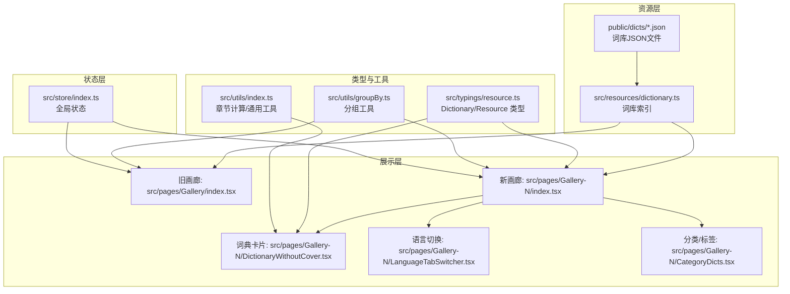
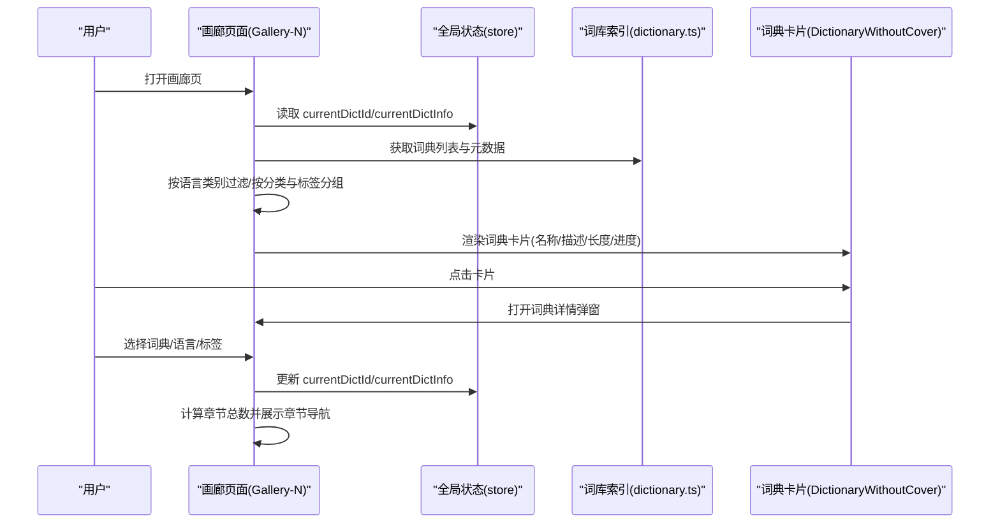
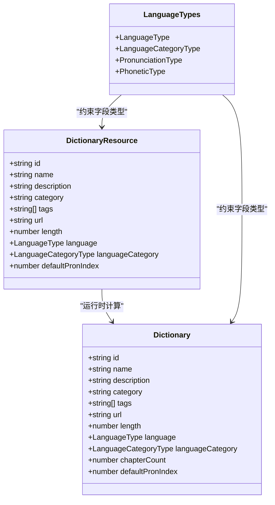
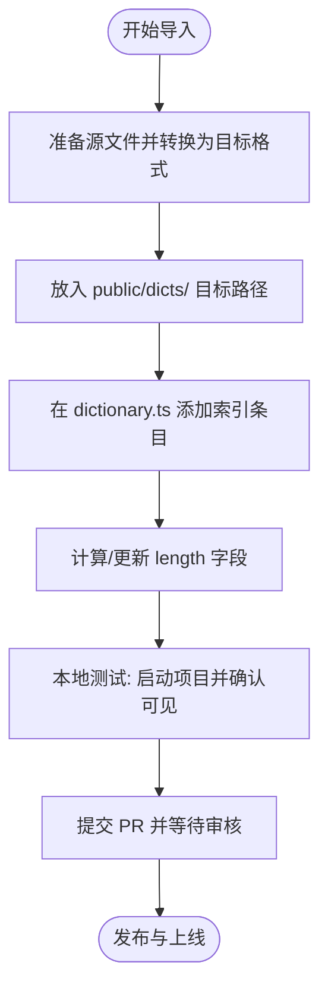
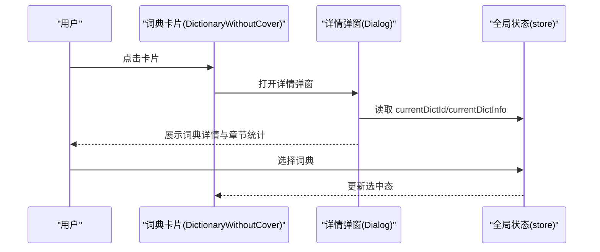
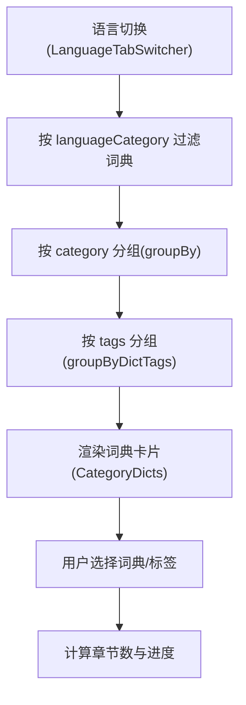
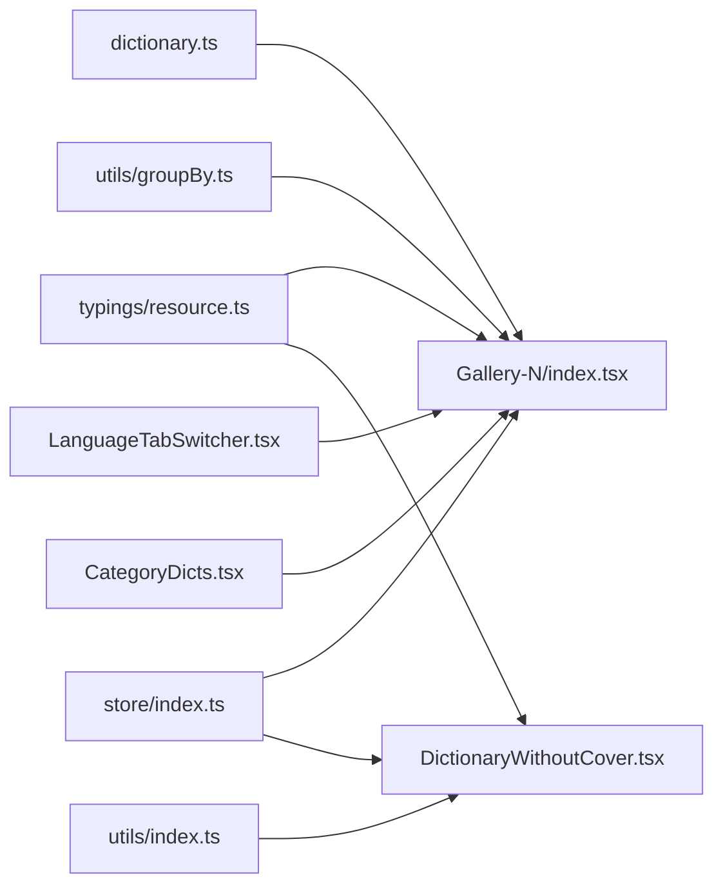

# 词库管理系统

<cite>
**本文引用的文件**
- [README.md](file://README.md)
- [toBuildDict.md](file://docs/toBuildDict.md)
- [CONTRIBUTING.md](file://docs/CONTRIBUTING.md)
- [dictionary.ts](file://src/resources/dictionary.ts)
- [index.tsx（旧画廊 Gallery）](file://src/pages/Gallery/index.tsx)
- [index.tsx（新画廊 Gallery-N）](file://src/pages/Gallery-N/index.tsx)
- [LanguageTabSwitcher.tsx](file://src/pages/Gallery-N/LanguageTabSwitcher.tsx)
- [CategoryDicts.tsx](file://src/pages/Gallery-N/CategoryDicts.tsx)
- [DictionaryWithoutCover.tsx](file://src/pages/Gallery-N/DictionaryWithoutCover.tsx)
- [index.ts（类型定义）](file://src/typings/index.ts)
- [resource.ts（类型定义）](file://src/typings/resource.ts)
- [groupBy.ts](file://src/utils/groupBy.ts)
- [index.ts（工具函数）](file://src/utils/index.ts)
- [index.ts（全局状态 store）](file://src/store/index.ts)
- [update-dict-size.js](file://scripts/update-dict-size.js)
</cite>

## 目录

1. [简介](#简介)
2. [项目结构](#项目结构)
3. [核心组件](#核心组件)
4. [架构总览](#架构总览)
5. [详细组件分析](#详细组件分析)
6. [依赖关系分析](#依赖关系分析)
7. [性能考量](#性能考量)
8. [故障排查指南](#故障排查指南)
9. [结论](#结论)
10. [附录](#附录)

## 简介

本文件面向词库管理系统，系统化梳理词典资源的组织结构、导入流程与管理机制，明确词库数据格式规范、分类体系与筛选功能实现，阐述词典卡片组件设计、语言切换与章节导航机制，并提供质量控制标准、社区贡献指南、数据验证规则、扩展最佳实践与性能优化建议。目标是为开发者提供词库开发与维护的完整指导。

## 项目结构

- 词库资源存放于 public/dicts 下，按主题与用途划分，文件名为“词典名.json”，内容为数组，元素为包含 name 与 trans 字段的对象。
- 词库索引配置位于 src/resources/dictionary.ts，集中声明词典元数据（id、name、description、category、tags、url、length、language、languageCategory 等）。
- 画廊页面负责展示词典与章节，提供分类、标签、语言切换与请求新增词典入口。
- 类型系统在 src/typings 下定义 Dictionary、DictionaryResource、语言与音标类型等。
- 工具函数提供分组、章节计算、通用校验等能力。
- 全局状态在 src/store 下管理当前词典、章节、发音与界面偏好等。

图表来源

- [dictionary.ts](file://src/resources/dictionary.ts#L1-L120)
- [index.tsx（旧画廊 Gallery）](file://src/pages/Gallery/index.tsx#L1-L62)
- [index.tsx（新画廊 Gallery-N）](file://src/pages/Gallery-N/index.tsx#L1-L104)
- [LanguageTabSwitcher.tsx](file://src/pages/Gallery-N/LanguageTabSwitcher.tsx#L1-L57)
- [CategoryDicts.tsx](file://src/pages/Gallery-N/CategoryDicts.tsx#L1-L38)
- [DictionaryWithoutCover.tsx](file://src/pages/Gallery-N/DictionaryWithoutCover.tsx#L1-L93)
- [resource.ts（类型定义）](file://src/typings/resource.ts#L1-L52)
- [groupBy.ts](file://src/utils/groupBy.ts#L1-L27)
- [index.ts（工具函数）](file://src/utils/index.ts#L94-L100)
- [index.ts（全局状态 store）](file://src/store/index.ts#L1-L118)

章节来源

- [README.md](file://README.md#L84-L121)
- [toBuildDict.md](file://docs/toBuildDict.md#L19-L123)
- [dictionary.ts](file://src/resources/dictionary.ts#L1-L120)

## 核心组件

- 词库索引与元数据：在 dictionary.ts 中集中声明词典 id、名称、描述、分类、标签、URL、长度、语言类别等，供页面渲染与筛选使用。
- 画廊页面：提供词典浏览、分类分组、标签切换、语言切换、章节概览与词典详情弹窗。
- 词典卡片：展示词典名称、描述、词数、进度条与封面占位图，支持选中态与悬停提示。
- 分组与筛选：通过 groupBy 与 groupByDictTags 实现按分类与标签分组，结合语言类别过滤。
- 章节计算：通过工具函数计算章节总数，用于进度条与章节导航。
- 导入与更新：提供导入指南与长度统计脚本，自动化更新词典长度。

章节来源

- [dictionary.ts](file://src/resources/dictionary.ts#L1-L120)
- [index.tsx（新画廊 Gallery-N）](file://src/pages/Gallery-N/index.tsx#L1-L104)
- [DictionaryWithoutCover.tsx](file://src/pages/Gallery-N/DictionaryWithoutCover.tsx#L1-L93)
- [groupBy.ts](file://src/utils/groupBy.ts#L1-L27)
- [index.ts（工具函数）](file://src/utils/index.ts#L94-L100)
- [toBuildDict.md](file://docs/toBuildDict.md#L19-L123)

## 架构总览

系统采用“资源索引 + 页面渲染 + 状态管理”的分层架构：

- 资源索引：dictionary.ts 作为单一事实来源，集中管理词典元数据。
- 展示层：画廊页面根据索引数据动态渲染词典卡片，支持语言与标签筛选。
- 状态层：store 维护当前词典、章节、发音设置等，驱动 UI 与交互。
- 工具层：分组、章节计算、通用校验等工具函数支撑页面逻辑。

图表来源

- [index.tsx（新画廊 Gallery-N）](file://src/pages/Gallery-N/index.tsx#L1-L104)
- [dictionary.ts](file://src/resources/dictionary.ts#L1-L120)
- [index.ts（全局状态 store）](file://src/store/index.ts#L1-L118)
- [DictionaryWithoutCover.tsx](file://src/pages/Gallery-N/DictionaryWithoutCover.tsx#L1-L93)

## 详细组件分析

### 词库索引与数据模型

- 数据模型
  - DictionaryResource：用于索引文件中的静态定义，包含 id、name、description、category、tags、url、length、language、languageCategory 等。
  - Dictionary：运行时计算后的词典对象，额外包含 chapterCount（章节数）等。
  - 语言与音标类型：LanguageType、LanguageCategoryType、PronunciationType、PhoneticType 等。
- 字段含义
  - id：唯一标识，用于状态与路由关联。
  - name/description：展示用名称与描述。
  - category/tags：分类与标签，用于筛选与分组。
  - url：词典 JSON 文件路径。
  - length：词典长度，用于章节计算与进度展示。
  - language/languageCategory：词典语言与语言类别，支持多语言与代码语言。
  - defaultPronIndex：可选，默认发音索引。
- 数据完整性保障
  - 词典 JSON 结构需满足 name 与 trans 字段存在且格式一致。
  - 索引文件中 length 与实际 JSON 长度应保持一致，可通过脚本自动更新。

图表来源

- [resource.ts（类型定义）](file://src/typings/resource.ts#L1-L52)
- [index.ts（类型定义）](file://src/typings/index.ts#L1-L51)

章节来源

- [resource.ts（类型定义）](file://src/typings/resource.ts#L1-L52)
- [index.ts（类型定义）](file://src/typings/index.ts#L1-L51)
- [dictionary.ts](file://src/resources/dictionary.ts#L1-L120)

### 词典导入流程与质量控制

- 导入流程
  - 准备源文件，转换为目标 JSON 格式（name、trans）。
  - 将 JSON 放置于 public/dicts/ 目标路径。
  - 在 src/resources/dictionary.ts 中添加索引条目（id、name、description、category、url、length、language）。
  - 使用脚本自动更新长度或手动填写 length。
  - 本地测试，确认词典出现在画廊列表中。
  - 提交 PR，等待审核与发布。
- 质量控制标准
  - JSON 结构必须为数组，元素包含 name 与 trans 字段。
  - trans 为字符串数组，建议每条翻译包含词性标注与释义。
  - id 唯一且语义清晰；category 与 tags 与现有体系对齐。
  - length 与实际 JSON 长度一致；若不一致，将导致章节数与进度异常。
  - 语言与语言类别字段正确，避免跨语言混用。
- 数据验证规则
  - 字段存在性：name、trans 必填。
  - 类型一致性：length 为数字；language 与 languageCategory 属于允许集合。
  - 唯一性：id 唯一。
  - 可达性：url 指向的 JSON 文件可访问。
- 社区贡献指南
  - 若无编程基础，可通过社区群或 Issue 提交需求。
  - 提交 PR 前先在 Issue 中沟通，遵循贡献准则与行为规范。
  - 优先参考现有分类与标签，避免重复与歧义。

图表来源

- [toBuildDict.md](file://docs/toBuildDict.md#L19-L123)
- [update-dict-size.js](file://scripts/update-dict-size.js#L1-L23)

章节来源

- [toBuildDict.md](file://docs/toBuildDict.md#L1-L124)
- [CONTRIBUTING.md](file://docs/CONTRIBUTING.md#L1-L48)
- [update-dict-size.js](file://scripts/update-dict-size.js#L1-L23)

### 词典卡片组件设计与交互

- 组件职责
  - 展示词典名称、描述、词数与进度条。
  - 支持选中态高亮与封面占位图。
  - 弹窗展示词典详情（含章节统计、标签等）。
- 关键交互
  - 点击卡片触发详情弹窗。
  - 选中词典后，卡片高亮并影响章节导航与练习入口。
- 性能优化
  - 使用 IntersectionObserver 仅在可见时加载统计，减少不必要的计算。
  - 使用 useMemo 缓存章节数与进度，避免重复计算。

图表来源

- [DictionaryWithoutCover.tsx](file://src/pages/Gallery-N/DictionaryWithoutCover.tsx#L1-L93)
- [index.ts（全局状态 store）](file://src/store/index.ts#L1-L118)

章节来源

- [DictionaryWithoutCover.tsx](file://src/pages/Gallery-N/DictionaryWithoutCover.tsx#L1-L93)
- [index.ts（全局状态 store）](file://src/store/index.ts#L1-L118)

### 语言切换与分类筛选

- 语言切换
  - 通过 LanguageTabSwitcher 提供多语言选项（英语、日语、德语、哈萨克语、印尼语、Code）。
  - 切换时过滤词典列表，仅展示 languageCategory 匹配的词典。
- 分类与标签筛选
  - 通过 groupBy 按 category 分组，通过 groupByDictTags 按 tags 分组。
  - CategoryDicts 根据当前词典的 tags 自动选择公共标签作为默认标签。
- 章节导航
  - 画廊页展示章节选择区域，结合 currentDictInfo.length 计算章节总数。
  - 旧画廊 Gallery 与新画廊 Gallery-N 均支持章节概览。

图表来源

- [LanguageTabSwitcher.tsx](file://src/pages/Gallery-N/LanguageTabSwitcher.tsx#L1-L57)
- [CategoryDicts.tsx](file://src/pages/Gallery-N/CategoryDicts.tsx#L1-L38)
- [groupBy.ts](file://src/utils/groupBy.ts#L1-L27)
- [index.ts（工具函数）](file://src/utils/index.ts#L94-L100)
- [index.tsx（新画廊 Gallery-N）](file://src/pages/Gallery-N/index.tsx#L1-L104)
- [index.tsx（旧画廊 Gallery）](file://src/pages/Gallery/index.tsx#L1-L62)

章节来源

- [LanguageTabSwitcher.tsx](file://src/pages/Gallery-N/LanguageTabSwitcher.tsx#L1-L57)
- [CategoryDicts.tsx](file://src/pages/Gallery-N/CategoryDicts.tsx#L1-L38)
- [groupBy.ts](file://src/utils/groupBy.ts#L1-L27)
- [index.ts（工具函数）](file://src/utils/index.ts#L94-L100)
- [index.tsx（新画廊 Gallery-N）](file://src/pages/Gallery-N/index.tsx#L1-L104)
- [index.tsx（旧画廊 Gallery）](file://src/pages/Gallery/index.tsx#L1-L62)

### 词库扩展最佳实践

- 新增词典
  - 严格遵循 JSON 格式规范，确保 name 与 trans 字段完整。
  - 在 dictionary.ts 中添加索引条目，合理选择 category 与 tags。
  - 使用脚本自动更新 length，避免手工维护误差。
- 分类与标签
  - 参考现有分类体系，避免新增歧义分类。
  - 标签尽量复用已有标签，减少碎片化。
- 性能与体验
  - 控制单个词典大小，避免过大 JSON 影响首屏加载。
  - 使用 IntersectionObserver 与 useMemo 降低渲染压力。
  - 保持语言类别与语言字段一致，避免跨语言显示异常。

章节来源

- [toBuildDict.md](file://docs/toBuildDict.md#L19-L123)
- [update-dict-size.js](file://scripts/update-dict-size.js#L1-L23)
- [dictionary.ts](file://src/resources/dictionary.ts#L1-L120)

## 依赖关系分析

- 画廊页面依赖词库索引与类型定义，使用分组工具与章节计算工具。
- 词典卡片依赖全局状态以获取当前词典信息，并通过 IntersectionObserver 与进度条组件展示统计。
- 语言切换与标签切换通过上下文与状态联动，实现动态筛选与渲染。

图表来源

- [dictionary.ts](file://src/resources/dictionary.ts#L1-L120)
- [index.tsx（新画廊 Gallery-N）](file://src/pages/Gallery-N/index.tsx#L1-L104)
- [DictionaryWithoutCover.tsx](file://src/pages/Gallery-N/DictionaryWithoutCover.tsx#L1-L93)
- [groupBy.ts](file://src/utils/groupBy.ts#L1-L27)
- [index.ts（工具函数）](file://src/utils/index.ts#L94-L100)
- [index.ts（全局状态 store）](file://src/store/index.ts#L1-L118)
- [LanguageTabSwitcher.tsx](file://src/pages/Gallery-N/LanguageTabSwitcher.tsx#L1-L57)
- [CategoryDicts.tsx](file://src/pages/Gallery-N/CategoryDicts.tsx#L1-L38)

章节来源

- [index.tsx（新画廊 Gallery-N）](file://src/pages/Gallery-N/index.tsx#L1-L104)
- [DictionaryWithoutCover.tsx](file://src/pages/Gallery-N/DictionaryWithoutCover.tsx#L1-L93)
- [index.ts（全局状态 store）](file://src/store/index.ts#L1-L118)

## 性能考量

- 渲染优化
  - 使用 IntersectionObserver 仅在卡片进入视口时加载详情统计，减少初始渲染压力。
  - 使用 useMemo 缓存章节数与进度，避免重复计算。
- 数据加载
  - 词典 JSON 体积控制在合理范围，避免首屏加载阻塞。
  - 词典长度通过脚本自动更新，避免运行时解析 JSON 计算长度。
- 交互响应
  - 语言切换与标签切换使用状态与上下文，避免全量重渲染。
  - 分组与过滤在客户端完成，建议限制词典数量或增加服务端筛选接口以进一步优化。

章节来源

- [DictionaryWithoutCover.tsx](file://src/pages/Gallery-N/DictionaryWithoutCover.tsx#L1-L93)
- [index.ts（工具函数）](file://src/utils/index.ts#L94-L100)
- [update-dict-size.js](file://scripts/update-dict-size.js#L1-L23)

## 故障排查指南

- 词典未显示
  - 检查 public/dicts 下文件是否存在且命名正确。
  - 检查 dictionary.ts 中索引条目是否添加，id 是否唯一，url 是否正确。
  - 使用脚本更新 length 或手动核对 length 与 JSON 长度一致。
- 语言切换无效
  - 确认词典的 languageCategory 与所选语言一致。
  - 检查 LanguageTabSwitcher 的状态更新逻辑。
- 章节数异常
  - 检查 length 字段与章节计算逻辑（章节数 = ceil(词数/章节长度））。
- 导入失败
  - 按导入指南逐项核对 JSON 格式与索引字段。
  - 参考贡献指南与社区渠道寻求帮助。

章节来源

- [toBuildDict.md](file://docs/toBuildDict.md#L19-L123)
- [update-dict-size.js](file://scripts/update-dict-size.js#L1-L23)
- [index.ts（工具函数）](file://src/utils/index.ts#L94-L100)
- [LanguageTabSwitcher.tsx](file://src/pages/Gallery-N/LanguageTabSwitcher.tsx#L1-L57)

## 结论

词库管理系统通过集中索引、清晰的数据模型与灵活的筛选机制，实现了词典资源的高效组织与便捷使用。配合语言切换、标签筛选与章节导航，用户可在多样化的词典中快速定位目标内容。建议在后续迭代中引入服务端筛选、缓存策略与更细粒度的质量校验，以进一步提升性能与稳定性。

## 附录

- 词典数据格式规范
  - 文件：public/dicts/词典名.json
  - 结构：数组，元素为对象，包含 name 与 trans 字段。
  - 示例路径：参见导入指南与现有词典文件。
- 分类与标签建议
  - 分类：中国考试、国际考试、专业词汇、英语词典、API 词库等。
  - 标签：大学英语、考研、雅思、托福、编程语言等。
- 贡献流程
  - 参考贡献指南与导入指南，先在 Issue 中沟通，再提交 PR。

章节来源

- [toBuildDict.md](file://docs/toBuildDict.md#L19-L123)
- [README.md](file://README.md#L84-L121)
- [CONTRIBUTING.md](file://docs/CONTRIBUTING.md#L1-L48)
